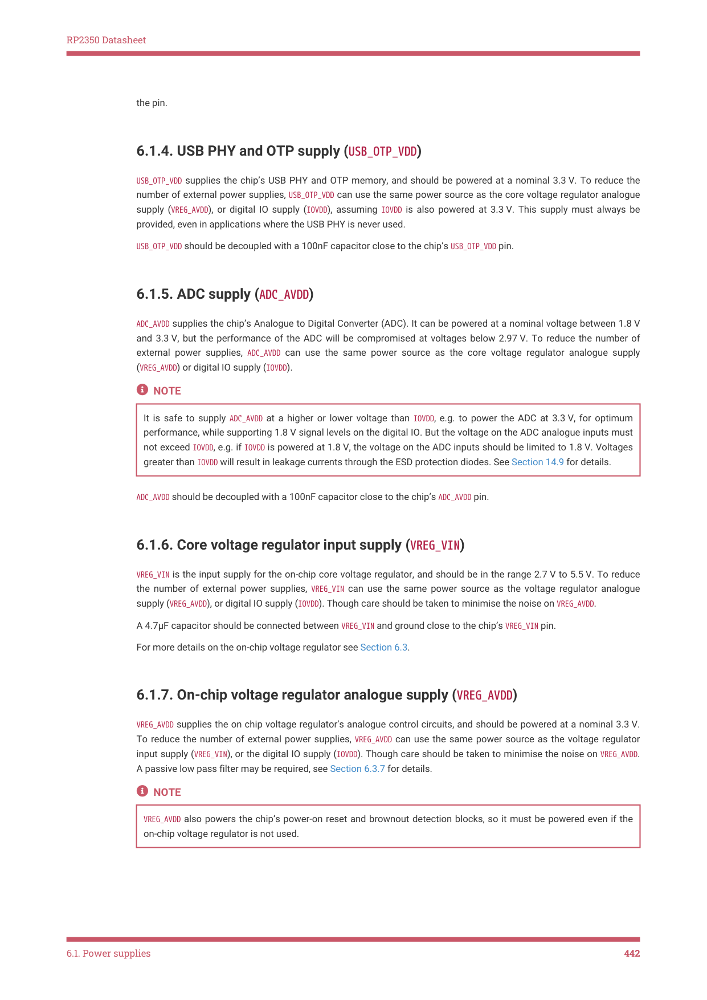

# 6.1.7. On-chip voltage regulator analogue supply (VREG_AVDD)

RP2350 Datasheet

the pin.

6.1.4. USB PHY and OTP supply (USB_OTP_VDD)

USB_OTP_VDD supplies the chip’s USB PHY and OTP memory, and should be powered at a nominal 3.3 V. To reduce the

number of external power supplies, USB_OTP_VDD can use the same power source as the core voltage regulator analogue

supply (VREG_AVDD), or digital IO supply (IOVDD), assuming IOVDD is also powered at 3.3 V. This supply must always be

provided, even in applications where the USB PHY is never used.

USB_OTP_VDD should be decoupled with a 100nF capacitor close to the chip’s USB_OTP_VDD pin.

6.1.5. ADC supply (ADC_AVDD)

ADC_AVDD supplies the chip’s Analogue to Digital Converter (ADC). It can be powered at a nominal voltage between 1.8 V

and 3.3 V, but the performance of the ADC will be compromised at voltages below 2.97 V. To reduce the number of

external power supplies, ADC_AVDD can use the same power source as the core voltage regulator analogue supply

(VREG_AVDD) or digital IO supply (IOVDD).

NOTE

It is safe to supply ADC_AVDD at a higher or lower voltage than IOVDD, e.g. to power the ADC at 3.3 V, for optimum

performance, while supporting 1.8 V signal levels on the digital IO. But the voltage on the ADC analogue inputs must

not exceed IOVDD, e.g. if IOVDD is powered at 1.8 V, the voltage on the ADC inputs should be limited to 1.8 V. Voltages

greater than IOVDD will result in leakage currents through the ESD protection diodes. See Section 14.9 for details.

ADC_AVDD should be decoupled with a 100nF capacitor close to the chip’s ADC_AVDD pin.

6.1.6. Core voltage regulator input supply (VREG_VIN)

VREG_VIN is the input supply for the on-chip core voltage regulator, and should be in the range 2.7 V to 5.5 V. To reduce

the number of external power supplies, VREG_VIN can use the same power source as the voltage regulator analogue

supply (VREG_AVDD), or digital IO supply (IOVDD). Though care should be taken to minimise the noise on VREG_AVDD.

A 4.7μF capacitor should be connected between VREG_VIN and ground close to the chip’s VREG_VIN pin.

For more details on the on-chip voltage regulator see Section 6.3.

6.1.7. On-chip voltage regulator analogue supply (VREG_AVDD)

VREG_AVDD supplies the on chip voltage regulator’s analogue control circuits, and should be powered at a nominal 3.3 V.

To reduce the number of external power supplies, VREG_AVDD can use the same power source as the voltage regulator

input supply (VREG_VIN), or the digital IO supply (IOVDD). Though care should be taken to minimise the noise on VREG_AVDD.

A passive low pass filter may be required, see Section 6.3.7 for details.

NOTE

VREG_AVDD also powers the chip’s power-on reset and brownout detection blocks, so it must be powered even if the

on-chip voltage regulator is not used.

6.1. Power supplies
442
