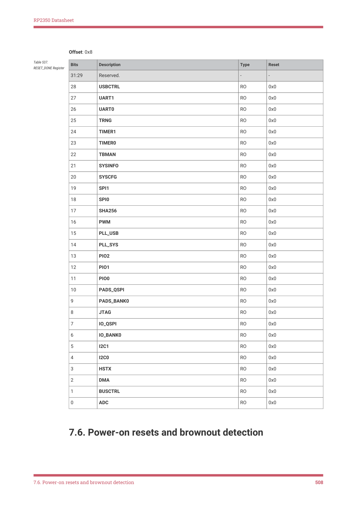

# 7.6. Power-on resets and brownout detection

RP2350 Datasheet

Offset: 0x8

| Bits | Description | Type | Reset |
| --- | --- | --- | --- |
| 31:29 | Reserved. | - | - |
| 28 | USBCTRL | RO | 0x0 |
| 27 | UART1 | RO | 0x0 |
| 26 | UART0 | RO | 0x0 |
| 25 | TRNG | RO | 0x0 |
| 24 | TIMER1 | RO | 0x0 |
| 23 | TIMER0 | RO | 0x0 |
| 22 | TBMAN | RO | 0x0 |
| 21 | SYSINFO | RO | 0x0 |
| 20 | SYSCFG | RO | 0x0 |
| 19 | SPI1 | RO | 0x0 |
| 18 | SPI0 | RO | 0x0 |
| 17 | SHA256 | RO | 0x0 |
| 16 | PWM | RO | 0x0 |
| 15 | PLL_USB | RO | 0x0 |
| 14 | PLL_SYS | RO | 0x0 |
| 13 | PIO2 | RO | 0x0 |
| 12 | PIO1 | RO | 0x0 |
| 11 | PIO0 | RO | 0x0 |
| 10 | PADS_QSPI | RO | 0x0 |
| 9 | PADS_BANK0 | RO | 0x0 |
| 8 | JTAG | RO | 0x0 |
| 7 | IO_QSPI | RO | 0x0 |
| 6 | IO_BANK0 | RO | 0x0 |
| 5 | I2C1 | RO | 0x0 |
| 4 | I2C0 | RO | 0x0 |
| 3 | HSTX | RO | 0x0 |
| 2 | DMA | RO | 0x0 |
| 1 | BUSCTRL | RO | 0x0 |
| 0 | ADC | RO | 0x0 |

Table 537.

7.6. Power-on resets and brownout detection

7.6. Power-on resets and brownout detection
508
