# 9.11.1. IO - User Bank

RP2350 Datasheet

13 static char event_str[128];

14 

15 void gpio_event_string(char *buf, uint32_t events);

16 

17 void gpio_callback(uint gpio, uint32_t events) {

18     // Put the GPIO event(s) that just happened into event_str

19     // so we can print it

20     gpio_event_string(event_str, events);

21     printf("GPIO %d %s\n", gpio, event_str);

22 }

23 

24 int main() {

25     stdio_init_all();

26 

27     printf("Hello GPIO IRQ\n");

28     gpio_init(GPIO_WATCH_PIN);

29     gpio_set_irq_enabled_with_callback(GPIO_WATCH_PIN, GPIO_IRQ_EDGE_RISE |

   GPIO_IRQ_EDGE_FALL, true, &gpio_callback);

30 

31     // Wait forever

32     while (1);

33 }

34 

35 

36 static const char *gpio_irq_str[] = {

37         "LEVEL_LOW",  // 0x1

38         "LEVEL_HIGH", // 0x2

39         "EDGE_FALL",  // 0x4

40         "EDGE_RISE"   // 0x8

41 };

42 

43 void gpio_event_string(char *buf, uint32_t events) {

44     for (uint i = 0; i < 4; i++) {

45         uint mask = (1 << i);

46         if (events & mask) {

47             // Copy this event string into the user string

48             const char *event_str = gpio_irq_str[i];

49             while (*event_str != '\0') {

50                 *buf++ = *event_str++;

51             }

52             events &= ~mask;

53 

54             // If more events add ", "

55             if (events) {

56                 *buf++ = ',';

57                 *buf++ = ' ';

58             }

59         }

60     }

61     *buf++ = '\0';

62 }

9.11. List of registers

9.11.1. IO - User Bank

The User Bank IO registers start at a base address of 0x40028000 (defined as IO_BANK0_BASE in SDK).

9.11. List of registers
604

RP2350 Datasheet

Table 649. List of

IO_BANK0 registers
Offset
Name
Info

0x000
GPIO0_STATUS

0x004
GPIO0_CTRL

0x008
GPIO1_STATUS

0x00c
GPIO1_CTRL

0x010
GPIO2_STATUS

0x014
GPIO2_CTRL

0x018
GPIO3_STATUS

0x01c
GPIO3_CTRL

0x020
GPIO4_STATUS

0x024
GPIO4_CTRL

0x028
GPIO5_STATUS

0x02c
GPIO5_CTRL

0x030
GPIO6_STATUS

0x034
GPIO6_CTRL

0x038
GPIO7_STATUS

0x03c
GPIO7_CTRL

0x040
GPIO8_STATUS

0x044
GPIO8_CTRL

0x048
GPIO9_STATUS

0x04c
GPIO9_CTRL

0x050
GPIO10_STATUS

0x054
GPIO10_CTRL

0x058
GPIO11_STATUS

0x05c
GPIO11_CTRL

0x060
GPIO12_STATUS

0x064
GPIO12_CTRL

0x068
GPIO13_STATUS

0x06c
GPIO13_CTRL

0x070
GPIO14_STATUS

0x074
GPIO14_CTRL

0x078
GPIO15_STATUS

0x07c
GPIO15_CTRL

0x080
GPIO16_STATUS

0x084
GPIO16_CTRL

0x088
GPIO17_STATUS

0x08c
GPIO17_CTRL

9.11. List of registers
605

RP2350 Datasheet

Offset
Name
Info

0x090
GPIO18_STATUS

0x094
GPIO18_CTRL

0x098
GPIO19_STATUS

0x09c
GPIO19_CTRL

0x0a0
GPIO20_STATUS

0x0a4
GPIO20_CTRL

0x0a8
GPIO21_STATUS

0x0ac
GPIO21_CTRL

0x0b0
GPIO22_STATUS

0x0b4
GPIO22_CTRL

0x0b8
GPIO23_STATUS

0x0bc
GPIO23_CTRL

0x0c0
GPIO24_STATUS

0x0c4
GPIO24_CTRL

0x0c8
GPIO25_STATUS

0x0cc
GPIO25_CTRL

0x0d0
GPIO26_STATUS

0x0d4
GPIO26_CTRL

0x0d8
GPIO27_STATUS

0x0dc
GPIO27_CTRL

0x0e0
GPIO28_STATUS

0x0e4
GPIO28_CTRL

0x0e8
GPIO29_STATUS

0x0ec
GPIO29_CTRL

0x0f0
GPIO30_STATUS

0x0f4
GPIO30_CTRL

0x0f8
GPIO31_STATUS

0x0fc
GPIO31_CTRL

0x100
GPIO32_STATUS

0x104
GPIO32_CTRL

0x108
GPIO33_STATUS

0x10c
GPIO33_CTRL

0x110
GPIO34_STATUS

0x114
GPIO34_CTRL

0x118
GPIO35_STATUS

0x11c
GPIO35_CTRL

9.11. List of registers
606

RP2350 Datasheet

Offset
Name
Info

0x120
GPIO36_STATUS

0x124
GPIO36_CTRL

0x128
GPIO37_STATUS

0x12c
GPIO37_CTRL

0x130
GPIO38_STATUS

0x134
GPIO38_CTRL

0x138
GPIO39_STATUS

0x13c
GPIO39_CTRL

0x140
GPIO40_STATUS

0x144
GPIO40_CTRL

0x148
GPIO41_STATUS

0x14c
GPIO41_CTRL

0x150
GPIO42_STATUS

0x154
GPIO42_CTRL

0x158
GPIO43_STATUS

0x15c
GPIO43_CTRL

0x160
GPIO44_STATUS

0x164
GPIO44_CTRL

0x168
GPIO45_STATUS

0x16c
GPIO45_CTRL

0x170
GPIO46_STATUS

0x174
GPIO46_CTRL

0x178
GPIO47_STATUS

0x17c
GPIO47_CTRL

0x200
IRQSUMMARY_PROC0_SECURE0

0x204
IRQSUMMARY_PROC0_SECURE1

0x208
IRQSUMMARY_PROC0_NONSECURE0

0x20c
IRQSUMMARY_PROC0_NONSECURE1

0x210
IRQSUMMARY_PROC1_SECURE0

0x214
IRQSUMMARY_PROC1_SECURE1

0x218
IRQSUMMARY_PROC1_NONSECURE0

0x21c
IRQSUMMARY_PROC1_NONSECURE1

0x220
IRQSUMMARY_COMA_WAKE_SECURE

0

0x224
IRQSUMMARY_COMA_WAKE_SECURE

1

9.11. List of registers
607

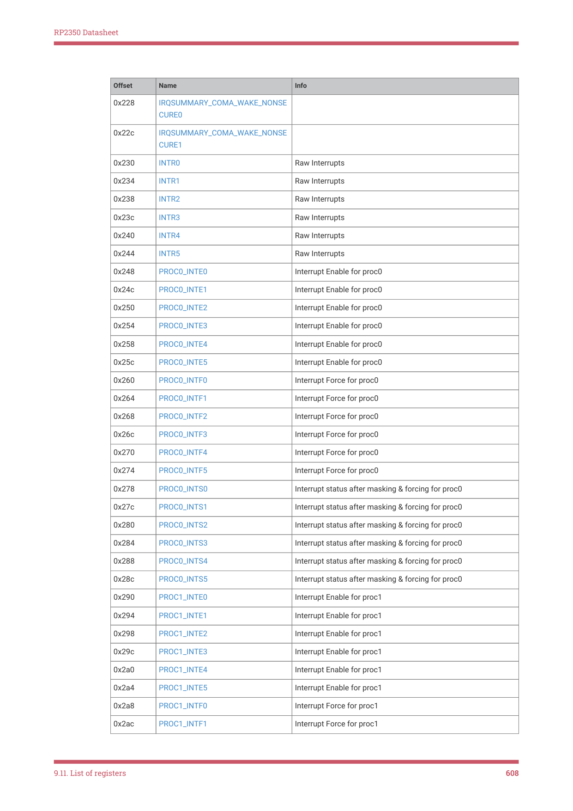

RP2350 Datasheet

| Offset | Name | Info |
| --- | --- | --- |
| 0x228 | IRQSUMMARY_COMA_WAKE_NONSE CURE0 |  |
| 0x22c | IRQSUMMARY_COMA_WAKE_NONSE CURE1 |  |
| 0x230 | INTR0 | Raw Interrupts |
| 0x234 | INTR1 | Raw Interrupts |
| 0x238 | INTR2 | Raw Interrupts |
| 0x23c | INTR3 | Raw Interrupts |
| 0x240 | INTR4 | Raw Interrupts |
| 0x244 | INTR5 | Raw Interrupts |
| 0x248 | PROC0_INTE0 | Interrupt Enable for proc0 |
| 0x24c | PROC0_INTE1 | Interrupt Enable for proc0 |
| 0x250 | PROC0_INTE2 | Interrupt Enable for proc0 |
| 0x254 | PROC0_INTE3 | Interrupt Enable for proc0 |
| 0x258 | PROC0_INTE4 | Interrupt Enable for proc0 |
| 0x25c | PROC0_INTE5 | Interrupt Enable for proc0 |
| 0x260 | PROC0_INTF0 | Interrupt Force for proc0 |
| 0x264 | PROC0_INTF1 | Interrupt Force for proc0 |
| 0x268 | PROC0_INTF2 | Interrupt Force for proc0 |
| 0x26c | PROC0_INTF3 | Interrupt Force for proc0 |
| 0x270 | PROC0_INTF4 | Interrupt Force for proc0 |
| 0x274 | PROC0_INTF5 | Interrupt Force for proc0 |
| 0x278 | PROC0_INTS0 | Interrupt status after masking & forcing for proc0 |
| 0x27c | PROC0_INTS1 | Interrupt status after masking & forcing for proc0 |
| 0x280 | PROC0_INTS2 | Interrupt status after masking & forcing for proc0 |
| 0x284 | PROC0_INTS3 | Interrupt status after masking & forcing for proc0 |
| 0x288 | PROC0_INTS4 | Interrupt status after masking & forcing for proc0 |
| 0x28c | PROC0_INTS5 | Interrupt status after masking & forcing for proc0 |
| 0x290 | PROC1_INTE0 | Interrupt Enable for proc1 |
| 0x294 | PROC1_INTE1 | Interrupt Enable for proc1 |
| 0x298 | PROC1_INTE2 | Interrupt Enable for proc1 |
| 0x29c | PROC1_INTE3 | Interrupt Enable for proc1 |
| 0x2a0 | PROC1_INTE4 | Interrupt Enable for proc1 |
| 0x2a4 | PROC1_INTE5 | Interrupt Enable for proc1 |
| 0x2a8 | PROC1_INTF0 | Interrupt Force for proc1 |
| 0x2ac | PROC1_INTF1 | Interrupt Force for proc1 |

9.11. List of registers
608

RP2350 Datasheet

| Offset | Name | Info |
| --- | --- | --- |
| 0x2b0 | PROC1_INTF2 | Interrupt Force for proc1 |
| 0x2b4 | PROC1_INTF3 | Interrupt Force for proc1 |
| 0x2b8 | PROC1_INTF4 | Interrupt Force for proc1 |
| 0x2bc | PROC1_INTF5 | Interrupt Force for proc1 |
| 0x2c0 | PROC1_INTS0 | Interrupt status after masking & forcing for proc1 |
| 0x2c4 | PROC1_INTS1 | Interrupt status after masking & forcing for proc1 |
| 0x2c8 | PROC1_INTS2 | Interrupt status after masking & forcing for proc1 |
| 0x2cc | PROC1_INTS3 | Interrupt status after masking & forcing for proc1 |
| 0x2d0 | PROC1_INTS4 | Interrupt status after masking & forcing for proc1 |
| 0x2d4 | PROC1_INTS5 | Interrupt status after masking & forcing for proc1 |
| 0x2d8 | DORMANT_WAKE_INTE0 | Interrupt Enable for dormant_wake |
| 0x2dc | DORMANT_WAKE_INTE1 | Interrupt Enable for dormant_wake |
| 0x2e0 | DORMANT_WAKE_INTE2 | Interrupt Enable for dormant_wake |
| 0x2e4 | DORMANT_WAKE_INTE3 | Interrupt Enable for dormant_wake |
| 0x2e8 | DORMANT_WAKE_INTE4 | Interrupt Enable for dormant_wake |
| 0x2ec | DORMANT_WAKE_INTE5 | Interrupt Enable for dormant_wake |
| 0x2f0 | DORMANT_WAKE_INTF0 | Interrupt Force for dormant_wake |
| 0x2f4 | DORMANT_WAKE_INTF1 | Interrupt Force for dormant_wake |
| 0x2f8 | DORMANT_WAKE_INTF2 | Interrupt Force for dormant_wake |
| 0x2fc | DORMANT_WAKE_INTF3 | Interrupt Force for dormant_wake |
| 0x300 | DORMANT_WAKE_INTF4 | Interrupt Force for dormant_wake |
| 0x304 | DORMANT_WAKE_INTF5 | Interrupt Force for dormant_wake |
| 0x308 | DORMANT_WAKE_INTS0 | Interrupt status after masking & forcing for dormant_wake |
| 0x30c | DORMANT_WAKE_INTS1 | Interrupt status after masking & forcing for dormant_wake |
| 0x310 | DORMANT_WAKE_INTS2 | Interrupt status after masking & forcing for dormant_wake |
| 0x314 | DORMANT_WAKE_INTS3 | Interrupt status after masking & forcing for dormant_wake |
| 0x318 | DORMANT_WAKE_INTS4 | Interrupt status after masking & forcing for dormant_wake |
| 0x31c | DORMANT_WAKE_INTS5 | Interrupt status after masking & forcing for dormant_wake |

IO_BANK0: GPIO0_STATUS Register

Offset: 0x000

| Bits | Description | Type | Reset |
| --- | --- | --- | --- |
| 31:27 | Reserved. | - | - |
| 26 | IRQTOPROC: interrupt to processors, after override is applied | RO | 0x0 |
| 25:18 | Reserved. | - | - |
| 17 | INFROMPAD: input signal from pad, before filtering and override are applied | RO | 0x0 |

Table 650.

GPIO0_STATUS

Register

9.11. List of registers
609

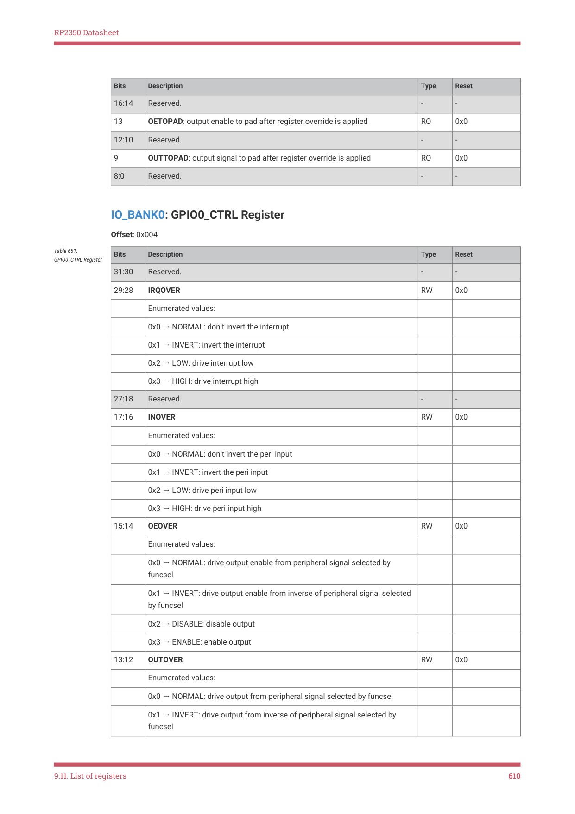

RP2350 Datasheet

| Bits | Description | Type | Reset |
| --- | --- | --- | --- |
| 16:14 | Reserved. | - | - |
| 13 | OETOPAD: output enable to pad after register override is applied | RO | 0x0 |
| 12:10 | Reserved. | - | - |
| 9 | OUTTOPAD: output signal to pad after register override is applied | RO | 0x0 |
| 8:0 | Reserved. | - | - |

IO_BANK0: GPIO0_CTRL Register

Offset: 0x004

Table 651.

GPIO0_CTRL Register
Bits
Description
Type
Reset

31:30
Reserved.
-
-

29:28
IRQOVER
RW
0x0

Enumerated values:

0x0 → NORMAL: don’t invert the interrupt

0x1 → INVERT: invert the interrupt

0x2 → LOW: drive interrupt low

0x3 → HIGH: drive interrupt high

27:18
Reserved.
-
-

17:16
INOVER
RW
0x0

Enumerated values:

0x0 → NORMAL: don’t invert the peri input

0x1 → INVERT: invert the peri input

0x2 → LOW: drive peri input low

0x3 → HIGH: drive peri input high

15:14
OEOVER
RW
0x0

Enumerated values:

0x0 → NORMAL: drive output enable from peripheral signal selected by

funcsel

0x1 → INVERT: drive output enable from inverse of peripheral signal selected

by funcsel

0x2 → DISABLE: disable output

0x3 → ENABLE: enable output

13:12
OUTOVER
RW
0x0

Enumerated values:

0x0 → NORMAL: drive output from peripheral signal selected by funcsel

0x1 → INVERT: drive output from inverse of peripheral signal selected by

funcsel

9.11. List of registers
610

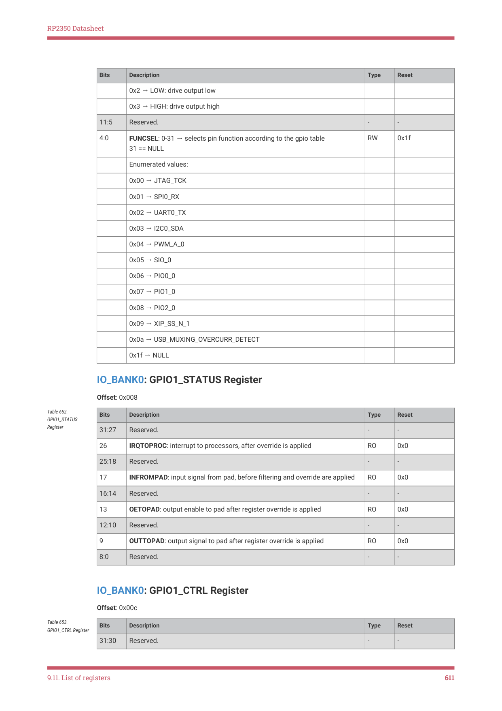

RP2350 Datasheet

Bits
Description
Type
Reset

0x2 → LOW: drive output low

0x3 → HIGH: drive output high

11:5
Reserved.
-
-

4:0
FUNCSEL: 0-31 → selects pin function according to the gpio table

RW
0x1f

31 == NULL

Enumerated values:

0x00 → JTAG_TCK

0x01 → SPI0_RX

0x02 → UART0_TX

0x03 → I2C0_SDA

0x04 → PWM_A_0

0x05 → SIO_0

0x06 → PIO0_0

0x07 → PIO1_0

0x08 → PIO2_0

0x09 → XIP_SS_N_1

0x0a → USB_MUXING_OVERCURR_DETECT

0x1f → NULL

IO_BANK0: GPIO1_STATUS Register

Offset: 0x008

| Bits | Description | Type | Reset |
| --- | --- | --- | --- |
| 31:27 | Reserved. | - | - |
| 26 | IRQTOPROC: interrupt to processors, after override is applied | RO | 0x0 |
| 25:18 | Reserved. | - | - |
| 17 | INFROMPAD: input signal from pad, before filtering and override are applied | RO | 0x0 |
| 16:14 | Reserved. | - | - |
| 13 | OETOPAD: output enable to pad after register override is applied | RO | 0x0 |
| 12:10 | Reserved. | - | - |
| 9 | OUTTOPAD: output signal to pad after register override is applied | RO | 0x0 |
| 8:0 | Reserved. | - | - |

Table 652.

GPIO1_STATUS

Register

IO_BANK0: GPIO1_CTRL Register

Offset: 0x00c

| Bits | Description | Type | Reset |
| --- | --- | --- | --- |
| 31:30 | Reserved. | - | - |

Table 653.

9.11. List of registers
611

RP2350 Datasheet

Bits
Description
Type
Reset

29:28
IRQOVER
RW
0x0

Enumerated values:

0x0 → NORMAL: don’t invert the interrupt

0x1 → INVERT: invert the interrupt

0x2 → LOW: drive interrupt low

0x3 → HIGH: drive interrupt high

27:18
Reserved.
-
-

17:16
INOVER
RW
0x0

Enumerated values:

0x0 → NORMAL: don’t invert the peri input

0x1 → INVERT: invert the peri input

0x2 → LOW: drive peri input low

0x3 → HIGH: drive peri input high

15:14
OEOVER
RW
0x0

Enumerated values:

0x0 → NORMAL: drive output enable from peripheral signal selected by

funcsel

0x1 → INVERT: drive output enable from inverse of peripheral signal selected

by funcsel

0x2 → DISABLE: disable output

0x3 → ENABLE: enable output

13:12
OUTOVER
RW
0x0

Enumerated values:

0x0 → NORMAL: drive output from peripheral signal selected by funcsel

0x1 → INVERT: drive output from inverse of peripheral signal selected by

funcsel

0x2 → LOW: drive output low

0x3 → HIGH: drive output high

11:5
Reserved.
-
-

4:0
FUNCSEL: 0-31 → selects pin function according to the gpio table

RW
0x1f

31 == NULL

Enumerated values:

0x00 → JTAG_TMS

0x01 → SPI0_SS_N

0x02 → UART0_RX

0x03 → I2C0_SCL

0x04 → PWM_B_0

9.11. List of registers
612

RP2350 Datasheet

Bits
Description
Type
Reset

0x05 → SIO_1

0x06 → PIO0_1

0x07 → PIO1_1

0x08 → PIO2_1

0x09 → CORESIGHT_TRACECLK

0x0a → USB_MUXING_VBUS_DETECT

0x1f → NULL

IO_BANK0: GPIO2_STATUS Register

Offset: 0x010

| Bits | Description | Type | Reset |
| --- | --- | --- | --- |
| 31:27 | Reserved. | - | - |
| 26 | IRQTOPROC: interrupt to processors, after override is applied | RO | 0x0 |
| 25:18 | Reserved. | - | - |
| 17 | INFROMPAD: input signal from pad, before filtering and override are applied | RO | 0x0 |
| 16:14 | Reserved. | - | - |
| 13 | OETOPAD: output enable to pad after register override is applied | RO | 0x0 |
| 12:10 | Reserved. | - | - |
| 9 | OUTTOPAD: output signal to pad after register override is applied | RO | 0x0 |
| 8:0 | Reserved. | - | - |

Table 654.

GPIO2_STATUS

Register

IO_BANK0: GPIO2_CTRL Register

Offset: 0x014

Table 655.

GPIO2_CTRL Register
Bits
Description
Type
Reset

31:30
Reserved.
-
-

29:28
IRQOVER
RW
0x0

Enumerated values:

0x0 → NORMAL: don’t invert the interrupt

0x1 → INVERT: invert the interrupt

0x2 → LOW: drive interrupt low

0x3 → HIGH: drive interrupt high

27:18
Reserved.
-
-

17:16
INOVER
RW
0x0

Enumerated values:

0x0 → NORMAL: don’t invert the peri input

0x1 → INVERT: invert the peri input

9.11. List of registers
613

RP2350 Datasheet

Bits
Description
Type
Reset

0x2 → LOW: drive peri input low

0x3 → HIGH: drive peri input high

15:14
OEOVER
RW
0x0

Enumerated values:

0x0 → NORMAL: drive output enable from peripheral signal selected by

funcsel

0x1 → INVERT: drive output enable from inverse of peripheral signal selected

by funcsel

0x2 → DISABLE: disable output

0x3 → ENABLE: enable output

13:12
OUTOVER
RW
0x0

Enumerated values:

0x0 → NORMAL: drive output from peripheral signal selected by funcsel

0x1 → INVERT: drive output from inverse of peripheral signal selected by

funcsel

0x2 → LOW: drive output low

0x3 → HIGH: drive output high

11:5
Reserved.
-
-

4:0
FUNCSEL: 0-31 → selects pin function according to the gpio table

RW
0x1f

31 == NULL

Enumerated values:

0x00 → JTAG_TDI

0x01 → SPI0_SCLK

0x02 → UART0_CTS

0x03 → I2C1_SDA

0x04 → PWM_A_1

0x05 → SIO_2

0x06 → PIO0_2

0x07 → PIO1_2

0x08 → PIO2_2

0x09 → CORESIGHT_TRACEDATA_0

0x0a → USB_MUXING_VBUS_EN

0x0b → UART0_TX

0x1f → NULL

IO_BANK0: GPIO3_STATUS Register

Offset: 0x018

9.11. List of registers
614

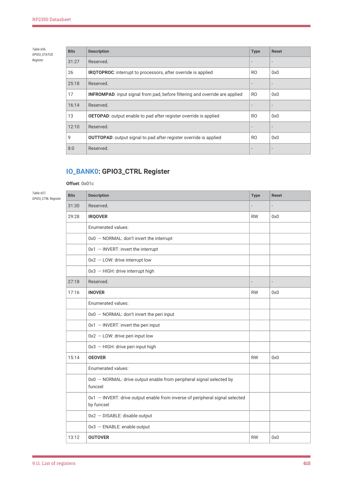

RP2350 Datasheet

| Bits | Description | Type | Reset |
| --- | --- | --- | --- |
| 31:27 | Reserved. | - | - |
| 26 | IRQTOPROC: interrupt to processors, after override is applied | RO | 0x0 |
| 25:18 | Reserved. | - | - |
| 17 | INFROMPAD: input signal from pad, before filtering and override are applied | RO | 0x0 |
| 16:14 | Reserved. | - | - |
| 13 | OETOPAD: output enable to pad after register override is applied | RO | 0x0 |
| 12:10 | Reserved. | - | - |
| 9 | OUTTOPAD: output signal to pad after register override is applied | RO | 0x0 |
| 8:0 | Reserved. | - | - |

Table 656.

GPIO3_STATUS

Register

IO_BANK0: GPIO3_CTRL Register

Offset: 0x01c

Table 657.

GPIO3_CTRL Register
Bits
Description
Type
Reset

31:30
Reserved.
-
-

29:28
IRQOVER
RW
0x0

Enumerated values:

0x0 → NORMAL: don’t invert the interrupt

0x1 → INVERT: invert the interrupt

0x2 → LOW: drive interrupt low

0x3 → HIGH: drive interrupt high

27:18
Reserved.
-
-

17:16
INOVER
RW
0x0

Enumerated values:

0x0 → NORMAL: don’t invert the peri input

0x1 → INVERT: invert the peri input

0x2 → LOW: drive peri input low

0x3 → HIGH: drive peri input high

15:14
OEOVER
RW
0x0

Enumerated values:

0x0 → NORMAL: drive output enable from peripheral signal selected by

funcsel

0x1 → INVERT: drive output enable from inverse of peripheral signal selected

by funcsel

0x2 → DISABLE: disable output

0x3 → ENABLE: enable output

13:12
OUTOVER
RW
0x0

9.11. List of registers
615

RP2350 Datasheet

Bits
Description
Type
Reset

Enumerated values:

0x0 → NORMAL: drive output from peripheral signal selected by funcsel

0x1 → INVERT: drive output from inverse of peripheral signal selected by

funcsel

0x2 → LOW: drive output low

0x3 → HIGH: drive output high

11:5
Reserved.
-
-

4:0
FUNCSEL: 0-31 → selects pin function according to the gpio table

RW
0x1f

31 == NULL

Enumerated values:

0x00 → JTAG_TDO

0x01 → SPI0_TX

0x02 → UART0_RTS

0x03 → I2C1_SCL

0x04 → PWM_B_1

0x05 → SIO_3

0x06 → PIO0_3

0x07 → PIO1_3

0x08 → PIO2_3

0x09 → CORESIGHT_TRACEDATA_1

0x0a → USB_MUXING_OVERCURR_DETECT

0x0b → UART0_RX

0x1f → NULL

IO_BANK0: GPIO4_STATUS Register

Offset: 0x020

| Bits | Description | Type | Reset |
| --- | --- | --- | --- |
| 31:27 | Reserved. | - | - |
| 26 | IRQTOPROC: interrupt to processors, after override is applied | RO | 0x0 |
| 25:18 | Reserved. | - | - |
| 17 | INFROMPAD: input signal from pad, before filtering and override are applied | RO | 0x0 |
| 16:14 | Reserved. | - | - |
| 13 | OETOPAD: output enable to pad after register override is applied | RO | 0x0 |
| 12:10 | Reserved. | - | - |
| 9 | OUTTOPAD: output signal to pad after register override is applied | RO | 0x0 |
| 8:0 | Reserved. | - | - |

Table 658.

GPIO4_STATUS

Register

9.11. List of registers
616

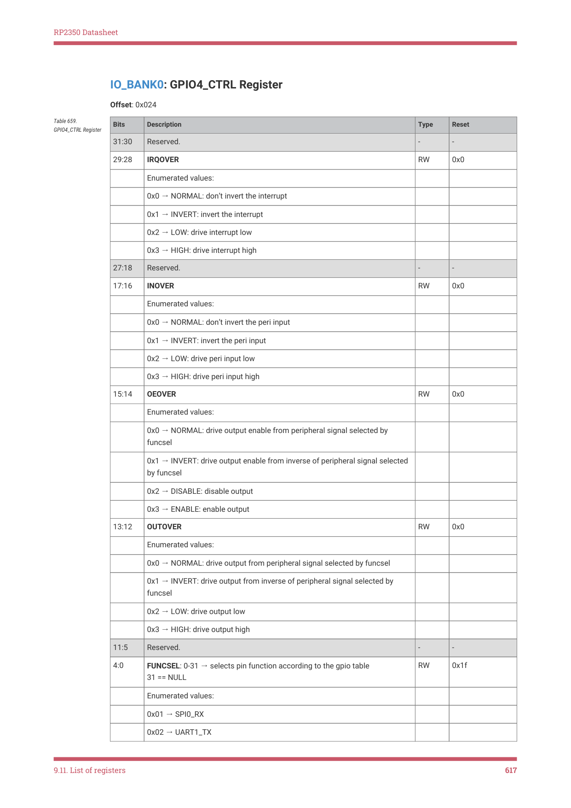

RP2350 Datasheet

IO_BANK0: GPIO4_CTRL Register

Offset: 0x024

Table 659.

GPIO4_CTRL Register
Bits
Description
Type
Reset

31:30
Reserved.
-
-

29:28
IRQOVER
RW
0x0

Enumerated values:

0x0 → NORMAL: don’t invert the interrupt

0x1 → INVERT: invert the interrupt

0x2 → LOW: drive interrupt low

0x3 → HIGH: drive interrupt high

27:18
Reserved.
-
-

17:16
INOVER
RW
0x0

Enumerated values:

0x0 → NORMAL: don’t invert the peri input

0x1 → INVERT: invert the peri input

0x2 → LOW: drive peri input low

0x3 → HIGH: drive peri input high

15:14
OEOVER
RW
0x0

Enumerated values:

0x0 → NORMAL: drive output enable from peripheral signal selected by

funcsel

0x1 → INVERT: drive output enable from inverse of peripheral signal selected

by funcsel

0x2 → DISABLE: disable output

0x3 → ENABLE: enable output

13:12
OUTOVER
RW
0x0

Enumerated values:

0x0 → NORMAL: drive output from peripheral signal selected by funcsel

0x1 → INVERT: drive output from inverse of peripheral signal selected by

funcsel

0x2 → LOW: drive output low

0x3 → HIGH: drive output high

11:5
Reserved.
-
-

4:0
FUNCSEL: 0-31 → selects pin function according to the gpio table

RW
0x1f

31 == NULL

Enumerated values:

0x01 → SPI0_RX

0x02 → UART1_TX

9.11. List of registers
617

RP2350 Datasheet

Bits
Description
Type
Reset

0x03 → I2C0_SDA

0x04 → PWM_A_2

0x05 → SIO_4

0x06 → PIO0_4

0x07 → PIO1_4

0x08 → PIO2_4

0x09 → CORESIGHT_TRACEDATA_2

0x0a → USB_MUXING_VBUS_DETECT

0x1f → NULL

IO_BANK0: GPIO5_STATUS Register

Offset: 0x028

| Bits | Description | Type | Reset |
| --- | --- | --- | --- |
| 31:27 | Reserved. | - | - |
| 26 | IRQTOPROC: interrupt to processors, after override is applied | RO | 0x0 |
| 25:18 | Reserved. | - | - |
| 17 | INFROMPAD: input signal from pad, before filtering and override are applied | RO | 0x0 |
| 16:14 | Reserved. | - | - |
| 13 | OETOPAD: output enable to pad after register override is applied | RO | 0x0 |
| 12:10 | Reserved. | - | - |
| 9 | OUTTOPAD: output signal to pad after register override is applied | RO | 0x0 |
| 8:0 | Reserved. | - | - |

Table 660.

GPIO5_STATUS

Register

IO_BANK0: GPIO5_CTRL Register

Offset: 0x02c

Table 661.

GPIO5_CTRL Register
Bits
Description
Type
Reset

31:30
Reserved.
-
-

29:28
IRQOVER
RW
0x0

Enumerated values:

0x0 → NORMAL: don’t invert the interrupt

0x1 → INVERT: invert the interrupt

0x2 → LOW: drive interrupt low

0x3 → HIGH: drive interrupt high

27:18
Reserved.
-
-

17:16
INOVER
RW
0x0

Enumerated values:

9.11. List of registers
618

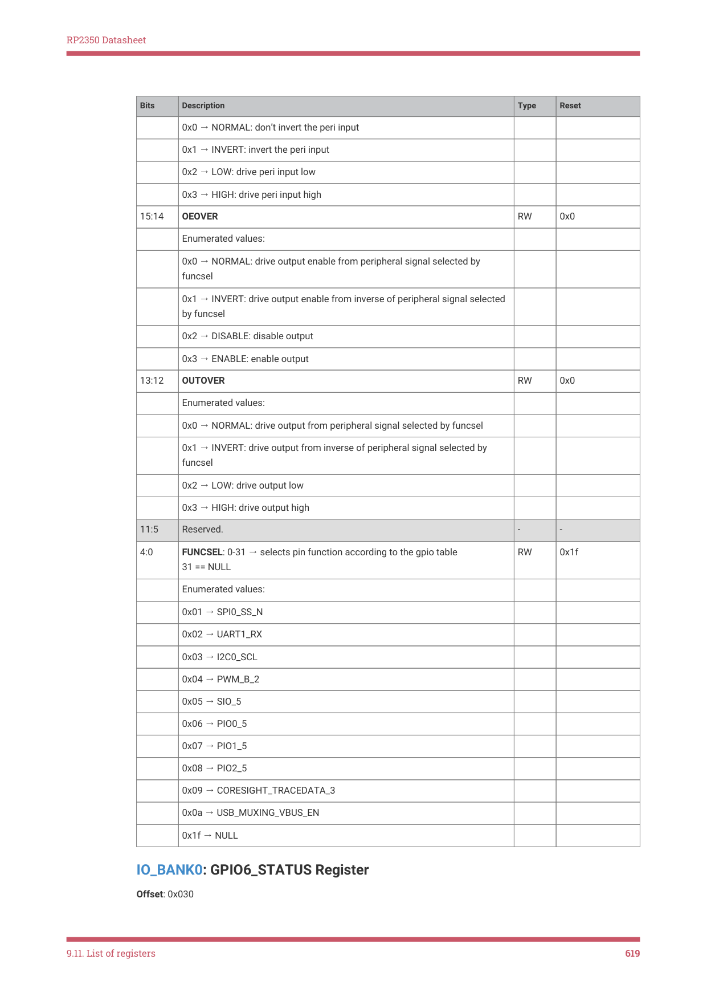

RP2350 Datasheet

Bits
Description
Type
Reset

0x0 → NORMAL: don’t invert the peri input

0x1 → INVERT: invert the peri input

0x2 → LOW: drive peri input low

0x3 → HIGH: drive peri input high

15:14
OEOVER
RW
0x0

Enumerated values:

0x0 → NORMAL: drive output enable from peripheral signal selected by

funcsel

0x1 → INVERT: drive output enable from inverse of peripheral signal selected

by funcsel

0x2 → DISABLE: disable output

0x3 → ENABLE: enable output

13:12
OUTOVER
RW
0x0

Enumerated values:

0x0 → NORMAL: drive output from peripheral signal selected by funcsel

0x1 → INVERT: drive output from inverse of peripheral signal selected by

funcsel

0x2 → LOW: drive output low

0x3 → HIGH: drive output high

11:5
Reserved.
-
-

4:0
FUNCSEL: 0-31 → selects pin function according to the gpio table

RW
0x1f

31 == NULL

Enumerated values:

0x01 → SPI0_SS_N

0x02 → UART1_RX

0x03 → I2C0_SCL

0x04 → PWM_B_2

0x05 → SIO_5

0x06 → PIO0_5

0x07 → PIO1_5

0x08 → PIO2_5

0x09 → CORESIGHT_TRACEDATA_3

0x0a → USB_MUXING_VBUS_EN

0x1f → NULL

IO_BANK0: GPIO6_STATUS Register

Offset: 0x030

9.11. List of registers
619

RP2350 Datasheet

| Bits | Description | Type | Reset |
| --- | --- | --- | --- |
| 31:27 | Reserved. | - | - |
| 26 | IRQTOPROC: interrupt to processors, after override is applied | RO | 0x0 |
| 25:18 | Reserved. | - | - |
| 17 | INFROMPAD: input signal from pad, before filtering and override are applied | RO | 0x0 |
| 16:14 | Reserved. | - | - |
| 13 | OETOPAD: output enable to pad after register override is applied | RO | 0x0 |
| 12:10 | Reserved. | - | - |
| 9 | OUTTOPAD: output signal to pad after register override is applied | RO | 0x0 |
| 8:0 | Reserved. | - | - |

Table 662.

GPIO6_STATUS

Register

IO_BANK0: GPIO6_CTRL Register

Offset: 0x034

Table 663.

GPIO6_CTRL Register
Bits
Description
Type
Reset

31:30
Reserved.
-
-

29:28
IRQOVER
RW
0x0

Enumerated values:

0x0 → NORMAL: don’t invert the interrupt

0x1 → INVERT: invert the interrupt

0x2 → LOW: drive interrupt low

0x3 → HIGH: drive interrupt high

27:18
Reserved.
-
-

17:16
INOVER
RW
0x0

Enumerated values:

0x0 → NORMAL: don’t invert the peri input

0x1 → INVERT: invert the peri input

0x2 → LOW: drive peri input low

0x3 → HIGH: drive peri input high

15:14
OEOVER
RW
0x0

Enumerated values:

0x0 → NORMAL: drive output enable from peripheral signal selected by

funcsel

0x1 → INVERT: drive output enable from inverse of peripheral signal selected

by funcsel

0x2 → DISABLE: disable output

0x3 → ENABLE: enable output

13:12
OUTOVER
RW
0x0

9.11. List of registers
620

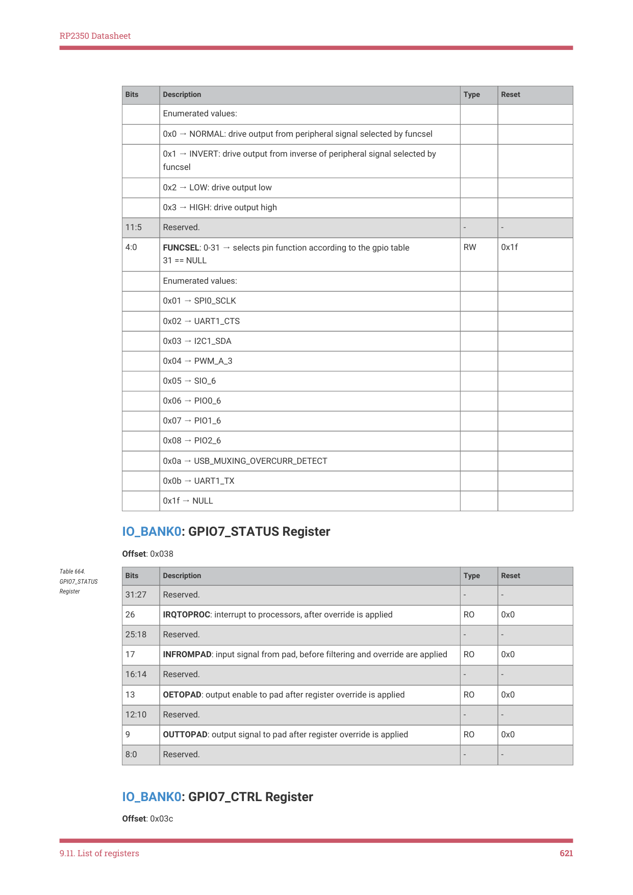

RP2350 Datasheet

Bits
Description
Type
Reset

Enumerated values:

0x0 → NORMAL: drive output from peripheral signal selected by funcsel

0x1 → INVERT: drive output from inverse of peripheral signal selected by

funcsel

0x2 → LOW: drive output low

0x3 → HIGH: drive output high

11:5
Reserved.
-
-

4:0
FUNCSEL: 0-31 → selects pin function according to the gpio table

RW
0x1f

31 == NULL

Enumerated values:

0x01 → SPI0_SCLK

0x02 → UART1_CTS

0x03 → I2C1_SDA

0x04 → PWM_A_3

0x05 → SIO_6

0x06 → PIO0_6

0x07 → PIO1_6

0x08 → PIO2_6

0x0a → USB_MUXING_OVERCURR_DETECT

0x0b → UART1_TX

0x1f → NULL

IO_BANK0: GPIO7_STATUS Register

Offset: 0x038

| Bits | Description | Type | Reset |
| --- | --- | --- | --- |
| 31:27 | Reserved. | - | - |
| 26 | IRQTOPROC: interrupt to processors, after override is applied | RO | 0x0 |
| 25:18 | Reserved. | - | - |
| 17 | INFROMPAD: input signal from pad, before filtering and override are applied | RO | 0x0 |
| 16:14 | Reserved. | - | - |
| 13 | OETOPAD: output enable to pad after register override is applied | RO | 0x0 |
| 12:10 | Reserved. | - | - |
| 9 | OUTTOPAD: output signal to pad after register override is applied | RO | 0x0 |
| 8:0 | Reserved. | - | - |

Table 664.

GPIO7_STATUS

Register

IO_BANK0: GPIO7_CTRL Register

Offset: 0x03c

9.11. List of registers
621

RP2350 Datasheet

Table 665.

GPIO7_CTRL Register
Bits
Description
Type
Reset

31:30
Reserved.
-
-

29:28
IRQOVER
RW
0x0

Enumerated values:

0x0 → NORMAL: don’t invert the interrupt

0x1 → INVERT: invert the interrupt

0x2 → LOW: drive interrupt low

0x3 → HIGH: drive interrupt high

27:18
Reserved.
-
-

17:16
INOVER
RW
0x0

Enumerated values:

0x0 → NORMAL: don’t invert the peri input

0x1 → INVERT: invert the peri input

0x2 → LOW: drive peri input low

0x3 → HIGH: drive peri input high

15:14
OEOVER
RW
0x0

Enumerated values:

0x0 → NORMAL: drive output enable from peripheral signal selected by

funcsel

0x1 → INVERT: drive output enable from inverse of peripheral signal selected

by funcsel

0x2 → DISABLE: disable output

0x3 → ENABLE: enable output

13:12
OUTOVER
RW
0x0

Enumerated values:

0x0 → NORMAL: drive output from peripheral signal selected by funcsel

0x1 → INVERT: drive output from inverse of peripheral signal selected by

funcsel

0x2 → LOW: drive output low

0x3 → HIGH: drive output high

11:5
Reserved.
-
-

4:0
FUNCSEL: 0-31 → selects pin function according to the gpio table

RW
0x1f

31 == NULL

Enumerated values:

0x01 → SPI0_TX

0x02 → UART1_RTS

0x03 → I2C1_SCL

0x04 → PWM_B_3

9.11. List of registers
622

RP2350 Datasheet

Bits
Description
Type
Reset

0x05 → SIO_7

0x06 → PIO0_7

0x07 → PIO1_7

0x08 → PIO2_7

0x0a → USB_MUXING_VBUS_DETECT

0x0b → UART1_RX

0x1f → NULL

IO_BANK0: GPIO8_STATUS Register

Offset: 0x040

| Bits | Description | Type | Reset |
| --- | --- | --- | --- |
| 31:27 | Reserved. | - | - |
| 26 | IRQTOPROC: interrupt to processors, after override is applied | RO | 0x0 |
| 25:18 | Reserved. | - | - |
| 17 | INFROMPAD: input signal from pad, before filtering and override are applied | RO | 0x0 |
| 16:14 | Reserved. | - | - |
| 13 | OETOPAD: output enable to pad after register override is applied | RO | 0x0 |
| 12:10 | Reserved. | - | - |
| 9 | OUTTOPAD: output signal to pad after register override is applied | RO | 0x0 |
| 8:0 | Reserved. | - | - |

Table 666.

GPIO8_STATUS

Register

IO_BANK0: GPIO8_CTRL Register

Offset: 0x044

Table 667.

GPIO8_CTRL Register
Bits
Description
Type
Reset

31:30
Reserved.
-
-

29:28
IRQOVER
RW
0x0

Enumerated values:

0x0 → NORMAL: don’t invert the interrupt

0x1 → INVERT: invert the interrupt

0x2 → LOW: drive interrupt low

0x3 → HIGH: drive interrupt high

27:18
Reserved.
-
-

17:16
INOVER
RW
0x0

Enumerated values:

0x0 → NORMAL: don’t invert the peri input

0x1 → INVERT: invert the peri input

9.11. List of registers
623

RP2350 Datasheet

Bits
Description
Type
Reset

0x2 → LOW: drive peri input low

0x3 → HIGH: drive peri input high

15:14
OEOVER
RW
0x0

Enumerated values:

0x0 → NORMAL: drive output enable from peripheral signal selected by

funcsel

0x1 → INVERT: drive output enable from inverse of peripheral signal selected

by funcsel

0x2 → DISABLE: disable output

0x3 → ENABLE: enable output

13:12
OUTOVER
RW
0x0

Enumerated values:

0x0 → NORMAL: drive output from peripheral signal selected by funcsel

0x1 → INVERT: drive output from inverse of peripheral signal selected by

funcsel

0x2 → LOW: drive output low

0x3 → HIGH: drive output high

11:5
Reserved.
-
-

4:0
FUNCSEL: 0-31 → selects pin function according to the gpio table

RW
0x1f

31 == NULL

Enumerated values:

0x01 → SPI1_RX

0x02 → UART1_TX

0x03 → I2C0_SDA

0x04 → PWM_A_4

0x05 → SIO_8

0x06 → PIO0_8

0x07 → PIO1_8

0x08 → PIO2_8

0x09 → XIP_SS_N_1

0x0a → USB_MUXING_VBUS_EN

0x1f → NULL

IO_BANK0: GPIO9_STATUS Register

Offset: 0x048

| Bits | Description | Type | Reset |
| --- | --- | --- | --- |
| 31:27 | Reserved. | - | - |

Table 668.

GPIO9_STATUS

Register

9.11. List of registers
624

RP2350 Datasheet

| Bits | Description | Type | Reset |
| --- | --- | --- | --- |
| 26 | IRQTOPROC: interrupt to processors, after override is applied | RO | 0x0 |
| 25:18 | Reserved. | - | - |
| 17 | INFROMPAD: input signal from pad, before filtering and override are applied | RO | 0x0 |
| 16:14 | Reserved. | - | - |
| 13 | OETOPAD: output enable to pad after register override is applied | RO | 0x0 |
| 12:10 | Reserved. | - | - |
| 9 | OUTTOPAD: output signal to pad after register override is applied | RO | 0x0 |
| 8:0 | Reserved. | - | - |

IO_BANK0: GPIO9_CTRL Register

Offset: 0x04c

Table 669.

GPIO9_CTRL Register
Bits
Description
Type
Reset

31:30
Reserved.
-
-

29:28
IRQOVER
RW
0x0

Enumerated values:

0x0 → NORMAL: don’t invert the interrupt

0x1 → INVERT: invert the interrupt

0x2 → LOW: drive interrupt low

0x3 → HIGH: drive interrupt high

27:18
Reserved.
-
-

17:16
INOVER
RW
0x0

Enumerated values:

0x0 → NORMAL: don’t invert the peri input

0x1 → INVERT: invert the peri input

0x2 → LOW: drive peri input low

0x3 → HIGH: drive peri input high

15:14
OEOVER
RW
0x0

Enumerated values:

0x0 → NORMAL: drive output enable from peripheral signal selected by

funcsel

0x1 → INVERT: drive output enable from inverse of peripheral signal selected

by funcsel

0x2 → DISABLE: disable output

0x3 → ENABLE: enable output

13:12
OUTOVER
RW
0x0

Enumerated values:

9.11. List of registers
625

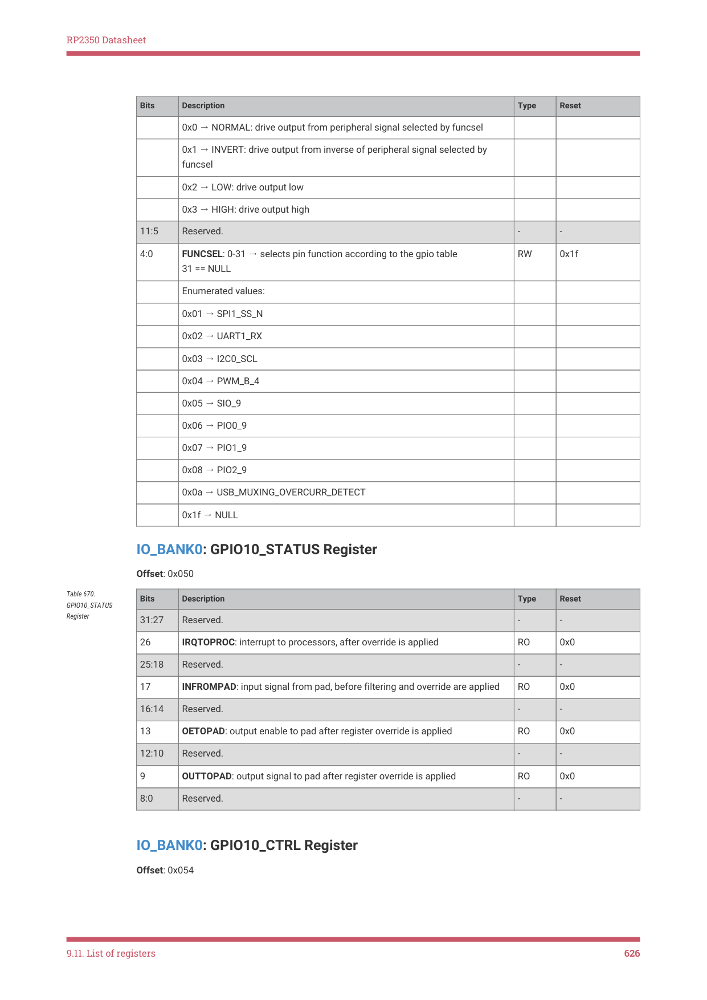

RP2350 Datasheet

Bits
Description
Type
Reset

0x0 → NORMAL: drive output from peripheral signal selected by funcsel

0x1 → INVERT: drive output from inverse of peripheral signal selected by

funcsel

0x2 → LOW: drive output low

0x3 → HIGH: drive output high

11:5
Reserved.
-
-

4:0
FUNCSEL: 0-31 → selects pin function according to the gpio table

RW
0x1f

31 == NULL

Enumerated values:

0x01 → SPI1_SS_N

0x02 → UART1_RX

0x03 → I2C0_SCL

0x04 → PWM_B_4

0x05 → SIO_9

0x06 → PIO0_9

0x07 → PIO1_9

0x08 → PIO2_9

0x0a → USB_MUXING_OVERCURR_DETECT

0x1f → NULL

IO_BANK0: GPIO10_STATUS Register

Offset: 0x050

| Bits | Description | Type | Reset |
| --- | --- | --- | --- |
| 31:27 | Reserved. | - | - |
| 26 | IRQTOPROC: interrupt to processors, after override is applied | RO | 0x0 |
| 25:18 | Reserved. | - | - |
| 17 | INFROMPAD: input signal from pad, before filtering and override are applied | RO | 0x0 |
| 16:14 | Reserved. | - | - |
| 13 | OETOPAD: output enable to pad after register override is applied | RO | 0x0 |
| 12:10 | Reserved. | - | - |
| 9 | OUTTOPAD: output signal to pad after register override is applied | RO | 0x0 |
| 8:0 | Reserved. | - | - |

Table 670.

GPIO10_STATUS

Register

IO_BANK0: GPIO10_CTRL Register

Offset: 0x054

9.11. List of registers
626

RP2350 Datasheet

Table 671.

GPIO10_CTRL Register
Bits
Description
Type
Reset

31:30
Reserved.
-
-

29:28
IRQOVER
RW
0x0

Enumerated values:

0x0 → NORMAL: don’t invert the interrupt

0x1 → INVERT: invert the interrupt

0x2 → LOW: drive interrupt low

0x3 → HIGH: drive interrupt high

27:18
Reserved.
-
-

17:16
INOVER
RW
0x0

Enumerated values:

0x0 → NORMAL: don’t invert the peri input

0x1 → INVERT: invert the peri input

0x2 → LOW: drive peri input low

0x3 → HIGH: drive peri input high

15:14
OEOVER
RW
0x0

Enumerated values:

0x0 → NORMAL: drive output enable from peripheral signal selected by

funcsel

0x1 → INVERT: drive output enable from inverse of peripheral signal selected

by funcsel

0x2 → DISABLE: disable output

0x3 → ENABLE: enable output

13:12
OUTOVER
RW
0x0

Enumerated values:

0x0 → NORMAL: drive output from peripheral signal selected by funcsel

0x1 → INVERT: drive output from inverse of peripheral signal selected by

funcsel

0x2 → LOW: drive output low

0x3 → HIGH: drive output high

11:5
Reserved.
-
-

4:0
FUNCSEL: 0-31 → selects pin function according to the gpio table

RW
0x1f

31 == NULL

Enumerated values:

0x01 → SPI1_SCLK

0x02 → UART1_CTS

0x03 → I2C1_SDA

0x04 → PWM_A_5

9.11. List of registers
627

RP2350 Datasheet

Bits
Description
Type
Reset

0x05 → SIO_10

0x06 → PIO0_10

0x07 → PIO1_10

0x08 → PIO2_10

0x0a → USB_MUXING_VBUS_DETECT

0x0b → UART1_TX

0x1f → NULL

IO_BANK0: GPIO11_STATUS Register

Offset: 0x058

| Bits | Description | Type | Reset |
| --- | --- | --- | --- |
| 31:27 | Reserved. | - | - |
| 26 | IRQTOPROC: interrupt to processors, after override is applied | RO | 0x0 |
| 25:18 | Reserved. | - | - |
| 17 | INFROMPAD: input signal from pad, before filtering and override are applied | RO | 0x0 |
| 16:14 | Reserved. | - | - |
| 13 | OETOPAD: output enable to pad after register override is applied | RO | 0x0 |
| 12:10 | Reserved. | - | - |
| 9 | OUTTOPAD: output signal to pad after register override is applied | RO | 0x0 |
| 8:0 | Reserved. | - | - |

Table 672.

GPIO11_STATUS

Register

IO_BANK0: GPIO11_CTRL Register

Offset: 0x05c

Table 673.

GPIO11_CTRL Register
Bits
Description
Type
Reset

31:30
Reserved.
-
-

29:28
IRQOVER
RW
0x0

Enumerated values:

0x0 → NORMAL: don’t invert the interrupt

0x1 → INVERT: invert the interrupt

0x2 → LOW: drive interrupt low

0x3 → HIGH: drive interrupt high

27:18
Reserved.
-
-

17:16
INOVER
RW
0x0

Enumerated values:

0x0 → NORMAL: don’t invert the peri input

0x1 → INVERT: invert the peri input

9.11. List of registers
628

RP2350 Datasheet

Bits
Description
Type
Reset

0x2 → LOW: drive peri input low

0x3 → HIGH: drive peri input high

15:14
OEOVER
RW
0x0

Enumerated values:

0x0 → NORMAL: drive output enable from peripheral signal selected by

funcsel

0x1 → INVERT: drive output enable from inverse of peripheral signal selected

by funcsel

0x2 → DISABLE: disable output

0x3 → ENABLE: enable output

13:12
OUTOVER
RW
0x0

Enumerated values:

0x0 → NORMAL: drive output from peripheral signal selected by funcsel

0x1 → INVERT: drive output from inverse of peripheral signal selected by

funcsel

0x2 → LOW: drive output low

0x3 → HIGH: drive output high

11:5
Reserved.
-
-

4:0
FUNCSEL: 0-31 → selects pin function according to the gpio table

RW
0x1f

31 == NULL

Enumerated values:

0x01 → SPI1_TX

0x02 → UART1_RTS

0x03 → I2C1_SCL

0x04 → PWM_B_5

0x05 → SIO_11

0x06 → PIO0_11

0x07 → PIO1_11

0x08 → PIO2_11

0x0a → USB_MUXING_VBUS_EN

0x0b → UART1_RX

0x1f → NULL

IO_BANK0: GPIO12_STATUS Register

Offset: 0x060

| Bits | Description | Type | Reset |
| --- | --- | --- | --- |
| 31:27 | Reserved. | - | - |

Table 674.

GPIO12_STATUS

Register

9.11. List of registers
629

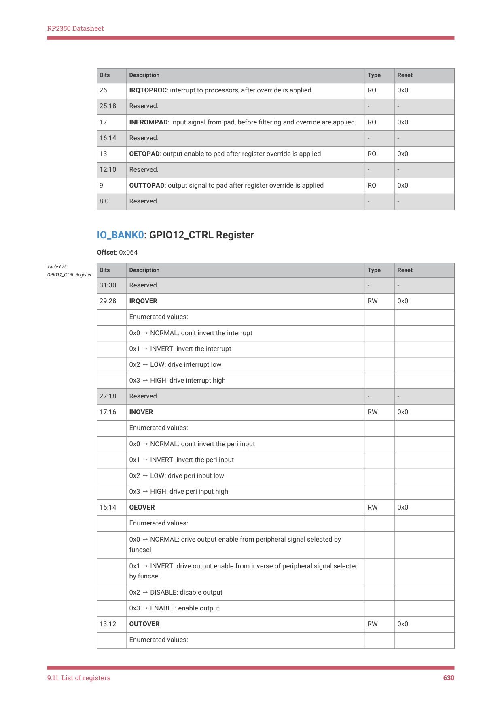

RP2350 Datasheet

| Bits | Description | Type | Reset |
| --- | --- | --- | --- |
| 26 | IRQTOPROC: interrupt to processors, after override is applied | RO | 0x0 |
| 25:18 | Reserved. | - | - |
| 17 | INFROMPAD: input signal from pad, before filtering and override are applied | RO | 0x0 |
| 16:14 | Reserved. | - | - |
| 13 | OETOPAD: output enable to pad after register override is applied | RO | 0x0 |
| 12:10 | Reserved. | - | - |
| 9 | OUTTOPAD: output signal to pad after register override is applied | RO | 0x0 |
| 8:0 | Reserved. | - | - |

IO_BANK0: GPIO12_CTRL Register

Offset: 0x064

Table 675.

GPIO12_CTRL Register
Bits
Description
Type
Reset

31:30
Reserved.
-
-

29:28
IRQOVER
RW
0x0

Enumerated values:

0x0 → NORMAL: don’t invert the interrupt

0x1 → INVERT: invert the interrupt

0x2 → LOW: drive interrupt low

0x3 → HIGH: drive interrupt high

27:18
Reserved.
-
-

17:16
INOVER
RW
0x0

Enumerated values:

0x0 → NORMAL: don’t invert the peri input

0x1 → INVERT: invert the peri input

0x2 → LOW: drive peri input low

0x3 → HIGH: drive peri input high

15:14
OEOVER
RW
0x0

Enumerated values:

0x0 → NORMAL: drive output enable from peripheral signal selected by

funcsel

0x1 → INVERT: drive output enable from inverse of peripheral signal selected

by funcsel

0x2 → DISABLE: disable output

0x3 → ENABLE: enable output

13:12
OUTOVER
RW
0x0

Enumerated values:

9.11. List of registers
630

RP2350 Datasheet

Bits
Description
Type
Reset

0x0 → NORMAL: drive output from peripheral signal selected by funcsel

0x1 → INVERT: drive output from inverse of peripheral signal selected by

funcsel

0x2 → LOW: drive output low

0x3 → HIGH: drive output high

11:5
Reserved.
-
-

4:0
FUNCSEL: 0-31 → selects pin function according to the gpio table

RW
0x1f

31 == NULL

Enumerated values:

0x00 → HSTX_0

0x01 → SPI1_RX

0x02 → UART0_TX

0x03 → I2C0_SDA

0x04 → PWM_A_6

0x05 → SIO_12

0x06 → PIO0_12

0x07 → PIO1_12

0x08 → PIO2_12

0x09 → CLOCKS_GPIN_0

0x0a → USB_MUXING_OVERCURR_DETECT

0x1f → NULL

IO_BANK0: GPIO13_STATUS Register

Offset: 0x068

| Bits | Description | Type | Reset |
| --- | --- | --- | --- |
| 31:27 | Reserved. | - | - |
| 26 | IRQTOPROC: interrupt to processors, after override is applied | RO | 0x0 |
| 25:18 | Reserved. | - | - |
| 17 | INFROMPAD: input signal from pad, before filtering and override are applied | RO | 0x0 |
| 16:14 | Reserved. | - | - |
| 13 | OETOPAD: output enable to pad after register override is applied | RO | 0x0 |
| 12:10 | Reserved. | - | - |
| 9 | OUTTOPAD: output signal to pad after register override is applied | RO | 0x0 |
| 8:0 | Reserved. | - | - |

Table 676.

GPIO13_STATUS

Register

IO_BANK0: GPIO13_CTRL Register

Offset: 0x06c

9.11. List of registers
631

RP2350 Datasheet

Table 677.

GPIO13_CTRL Register
Bits
Description
Type
Reset

31:30
Reserved.
-
-

29:28
IRQOVER
RW
0x0

Enumerated values:

0x0 → NORMAL: don’t invert the interrupt

0x1 → INVERT: invert the interrupt

0x2 → LOW: drive interrupt low

0x3 → HIGH: drive interrupt high

27:18
Reserved.
-
-

17:16
INOVER
RW
0x0

Enumerated values:

0x0 → NORMAL: don’t invert the peri input

0x1 → INVERT: invert the peri input

0x2 → LOW: drive peri input low

0x3 → HIGH: drive peri input high

15:14
OEOVER
RW
0x0

Enumerated values:

0x0 → NORMAL: drive output enable from peripheral signal selected by

funcsel

0x1 → INVERT: drive output enable from inverse of peripheral signal selected

by funcsel

0x2 → DISABLE: disable output

0x3 → ENABLE: enable output

13:12
OUTOVER
RW
0x0

Enumerated values:

0x0 → NORMAL: drive output from peripheral signal selected by funcsel

0x1 → INVERT: drive output from inverse of peripheral signal selected by

funcsel

0x2 → LOW: drive output low

0x3 → HIGH: drive output high

11:5
Reserved.
-
-

4:0
FUNCSEL: 0-31 → selects pin function according to the gpio table

RW
0x1f

31 == NULL

Enumerated values:

0x00 → HSTX_1

0x01 → SPI1_SS_N

0x02 → UART0_RX

0x03 → I2C0_SCL

9.11. List of registers
632

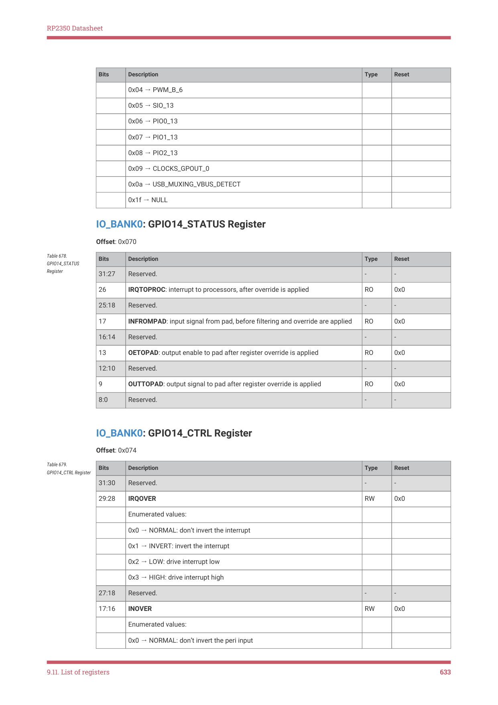

RP2350 Datasheet

Bits
Description
Type
Reset

0x04 → PWM_B_6

0x05 → SIO_13

0x06 → PIO0_13

0x07 → PIO1_13

0x08 → PIO2_13

0x09 → CLOCKS_GPOUT_0

0x0a → USB_MUXING_VBUS_DETECT

0x1f → NULL

IO_BANK0: GPIO14_STATUS Register

Offset: 0x070

| Bits | Description | Type | Reset |
| --- | --- | --- | --- |
| 31:27 | Reserved. | - | - |
| 26 | IRQTOPROC: interrupt to processors, after override is applied | RO | 0x0 |
| 25:18 | Reserved. | - | - |
| 17 | INFROMPAD: input signal from pad, before filtering and override are applied | RO | 0x0 |
| 16:14 | Reserved. | - | - |
| 13 | OETOPAD: output enable to pad after register override is applied | RO | 0x0 |
| 12:10 | Reserved. | - | - |
| 9 | OUTTOPAD: output signal to pad after register override is applied | RO | 0x0 |
| 8:0 | Reserved. | - | - |

Table 678.

GPIO14_STATUS

Register

IO_BANK0: GPIO14_CTRL Register

Offset: 0x074

Table 679.

GPIO14_CTRL Register
Bits
Description
Type
Reset

31:30
Reserved.
-
-

29:28
IRQOVER
RW
0x0

Enumerated values:

0x0 → NORMAL: don’t invert the interrupt

0x1 → INVERT: invert the interrupt

0x2 → LOW: drive interrupt low

0x3 → HIGH: drive interrupt high

27:18
Reserved.
-
-

17:16
INOVER
RW
0x0

Enumerated values:

0x0 → NORMAL: don’t invert the peri input

9.11. List of registers
633

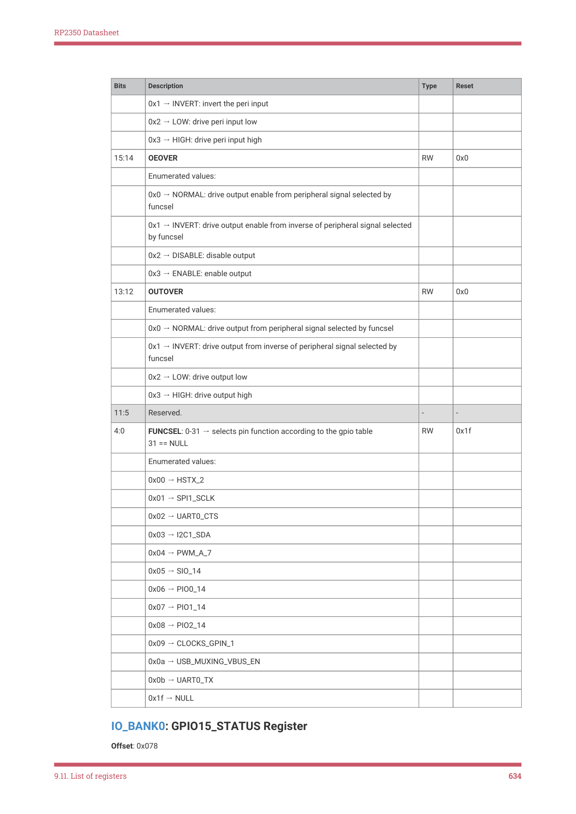

RP2350 Datasheet

Bits
Description
Type
Reset

0x1 → INVERT: invert the peri input

0x2 → LOW: drive peri input low

0x3 → HIGH: drive peri input high

15:14
OEOVER
RW
0x0

Enumerated values:

0x0 → NORMAL: drive output enable from peripheral signal selected by

funcsel

0x1 → INVERT: drive output enable from inverse of peripheral signal selected

by funcsel

0x2 → DISABLE: disable output

0x3 → ENABLE: enable output

13:12
OUTOVER
RW
0x0

Enumerated values:

0x0 → NORMAL: drive output from peripheral signal selected by funcsel

0x1 → INVERT: drive output from inverse of peripheral signal selected by

funcsel

0x2 → LOW: drive output low

0x3 → HIGH: drive output high

11:5
Reserved.
-
-

4:0
FUNCSEL: 0-31 → selects pin function according to the gpio table

RW
0x1f

31 == NULL

Enumerated values:

0x00 → HSTX_2

0x01 → SPI1_SCLK

0x02 → UART0_CTS

0x03 → I2C1_SDA

0x04 → PWM_A_7

0x05 → SIO_14

0x06 → PIO0_14

0x07 → PIO1_14

0x08 → PIO2_14

0x09 → CLOCKS_GPIN_1

0x0a → USB_MUXING_VBUS_EN

0x0b → UART0_TX

0x1f → NULL

IO_BANK0: GPIO15_STATUS Register

Offset: 0x078

9.11. List of registers
634

RP2350 Datasheet

| Bits | Description | Type | Reset |
| --- | --- | --- | --- |
| 31:27 | Reserved. | - | - |
| 26 | IRQTOPROC: interrupt to processors, after override is applied | RO | 0x0 |
| 25:18 | Reserved. | - | - |
| 17 | INFROMPAD: input signal from pad, before filtering and override are applied | RO | 0x0 |
| 16:14 | Reserved. | - | - |
| 13 | OETOPAD: output enable to pad after register override is applied | RO | 0x0 |
| 12:10 | Reserved. | - | - |
| 9 | OUTTOPAD: output signal to pad after register override is applied | RO | 0x0 |
| 8:0 | Reserved. | - | - |

Table 680.

GPIO15_STATUS

Register

IO_BANK0: GPIO15_CTRL Register

Offset: 0x07c

Table 681.

GPIO15_CTRL Register
Bits
Description
Type
Reset

31:30
Reserved.
-
-

29:28
IRQOVER
RW
0x0

Enumerated values:

0x0 → NORMAL: don’t invert the interrupt

0x1 → INVERT: invert the interrupt

0x2 → LOW: drive interrupt low

0x3 → HIGH: drive interrupt high

27:18
Reserved.
-
-

17:16
INOVER
RW
0x0

Enumerated values:

0x0 → NORMAL: don’t invert the peri input

0x1 → INVERT: invert the peri input

0x2 → LOW: drive peri input low

0x3 → HIGH: drive peri input high

15:14
OEOVER
RW
0x0

Enumerated values:

0x0 → NORMAL: drive output enable from peripheral signal selected by

funcsel

0x1 → INVERT: drive output enable from inverse of peripheral signal selected

by funcsel

0x2 → DISABLE: disable output

0x3 → ENABLE: enable output

13:12
OUTOVER
RW
0x0

9.11. List of registers
635

RP2350 Datasheet

Bits
Description
Type
Reset

Enumerated values:

0x0 → NORMAL: drive output from peripheral signal selected by funcsel

0x1 → INVERT: drive output from inverse of peripheral signal selected by

funcsel

0x2 → LOW: drive output low

0x3 → HIGH: drive output high

11:5
Reserved.
-
-

4:0
FUNCSEL: 0-31 → selects pin function according to the gpio table

RW
0x1f

31 == NULL

Enumerated values:

0x00 → HSTX_3

0x01 → SPI1_TX

0x02 → UART0_RTS

0x03 → I2C1_SCL

0x04 → PWM_B_7

0x05 → SIO_15

0x06 → PIO0_15

0x07 → PIO1_15

0x08 → PIO2_15

0x09 → CLOCKS_GPOUT_1

0x0a → USB_MUXING_OVERCURR_DETECT

0x0b → UART0_RX

0x1f → NULL

IO_BANK0: GPIO16_STATUS Register

Offset: 0x080

| Bits | Description | Type | Reset |
| --- | --- | --- | --- |
| 31:27 | Reserved. | - | - |
| 26 | IRQTOPROC: interrupt to processors, after override is applied | RO | 0x0 |
| 25:18 | Reserved. | - | - |
| 17 | INFROMPAD: input signal from pad, before filtering and override are applied | RO | 0x0 |
| 16:14 | Reserved. | - | - |
| 13 | OETOPAD: output enable to pad after register override is applied | RO | 0x0 |
| 12:10 | Reserved. | - | - |
| 9 | OUTTOPAD: output signal to pad after register override is applied | RO | 0x0 |
| 8:0 | Reserved. | - | - |

Table 682.

GPIO16_STATUS

Register

9.11. List of registers
636

RP2350 Datasheet

IO_BANK0: GPIO16_CTRL Register

Offset: 0x084

Table 683.

GPIO16_CTRL Register
Bits
Description
Type
Reset

31:30
Reserved.
-
-

29:28
IRQOVER
RW
0x0

Enumerated values:

0x0 → NORMAL: don’t invert the interrupt

0x1 → INVERT: invert the interrupt

0x2 → LOW: drive interrupt low

0x3 → HIGH: drive interrupt high

27:18
Reserved.
-
-

17:16
INOVER
RW
0x0

Enumerated values:

0x0 → NORMAL: don’t invert the peri input

0x1 → INVERT: invert the peri input

0x2 → LOW: drive peri input low

0x3 → HIGH: drive peri input high

15:14
OEOVER
RW
0x0

Enumerated values:

0x0 → NORMAL: drive output enable from peripheral signal selected by

funcsel

0x1 → INVERT: drive output enable from inverse of peripheral signal selected

by funcsel

0x2 → DISABLE: disable output

0x3 → ENABLE: enable output

13:12
OUTOVER
RW
0x0

Enumerated values:

0x0 → NORMAL: drive output from peripheral signal selected by funcsel

0x1 → INVERT: drive output from inverse of peripheral signal selected by

funcsel

0x2 → LOW: drive output low

0x3 → HIGH: drive output high

11:5
Reserved.
-
-

4:0
FUNCSEL: 0-31 → selects pin function according to the gpio table

RW
0x1f

31 == NULL

Enumerated values:

0x00 → HSTX_4

0x01 → SPI0_RX

9.11. List of registers
637

RP2350 Datasheet

Bits
Description
Type
Reset

0x02 → UART0_TX

0x03 → I2C0_SDA

0x04 → PWM_A_0

0x05 → SIO_16

0x06 → PIO0_16

0x07 → PIO1_16

0x08 → PIO2_16

0x0a → USB_MUXING_VBUS_DETECT

0x1f → NULL

IO_BANK0: GPIO17_STATUS Register

Offset: 0x088

| Bits | Description | Type | Reset |
| --- | --- | --- | --- |
| 31:27 | Reserved. | - | - |
| 26 | IRQTOPROC: interrupt to processors, after override is applied | RO | 0x0 |
| 25:18 | Reserved. | - | - |
| 17 | INFROMPAD: input signal from pad, before filtering and override are applied | RO | 0x0 |
| 16:14 | Reserved. | - | - |
| 13 | OETOPAD: output enable to pad after register override is applied | RO | 0x0 |
| 12:10 | Reserved. | - | - |
| 9 | OUTTOPAD: output signal to pad after register override is applied | RO | 0x0 |
| 8:0 | Reserved. | - | - |

Table 684.

GPIO17_STATUS

Register

IO_BANK0: GPIO17_CTRL Register

Offset: 0x08c

Table 685.

GPIO17_CTRL Register
Bits
Description
Type
Reset

31:30
Reserved.
-
-

29:28
IRQOVER
RW
0x0

Enumerated values:

0x0 → NORMAL: don’t invert the interrupt

0x1 → INVERT: invert the interrupt

0x2 → LOW: drive interrupt low

0x3 → HIGH: drive interrupt high

27:18
Reserved.
-
-

17:16
INOVER
RW
0x0

Enumerated values:

9.11. List of registers
638

RP2350 Datasheet

Bits
Description
Type
Reset

0x0 → NORMAL: don’t invert the peri input

0x1 → INVERT: invert the peri input

0x2 → LOW: drive peri input low

0x3 → HIGH: drive peri input high

15:14
OEOVER
RW
0x0

Enumerated values:

0x0 → NORMAL: drive output enable from peripheral signal selected by

funcsel

0x1 → INVERT: drive output enable from inverse of peripheral signal selected

by funcsel

0x2 → DISABLE: disable output

0x3 → ENABLE: enable output

13:12
OUTOVER
RW
0x0

Enumerated values:

0x0 → NORMAL: drive output from peripheral signal selected by funcsel

0x1 → INVERT: drive output from inverse of peripheral signal selected by

funcsel

0x2 → LOW: drive output low

0x3 → HIGH: drive output high

11:5
Reserved.
-
-

4:0
FUNCSEL: 0-31 → selects pin function according to the gpio table

RW
0x1f

31 == NULL

Enumerated values:

0x00 → HSTX_5

0x01 → SPI0_SS_N

0x02 → UART0_RX

0x03 → I2C0_SCL

0x04 → PWM_B_0

0x05 → SIO_17

0x06 → PIO0_17

0x07 → PIO1_17

0x08 → PIO2_17

0x0a → USB_MUXING_VBUS_EN

0x1f → NULL

IO_BANK0: GPIO18_STATUS Register

Offset: 0x090

9.11. List of registers
639

RP2350 Datasheet

| Bits | Description | Type | Reset |
| --- | --- | --- | --- |
| 31:27 | Reserved. | - | - |
| 26 | IRQTOPROC: interrupt to processors, after override is applied | RO | 0x0 |
| 25:18 | Reserved. | - | - |
| 17 | INFROMPAD: input signal from pad, before filtering and override are applied | RO | 0x0 |
| 16:14 | Reserved. | - | - |
| 13 | OETOPAD: output enable to pad after register override is applied | RO | 0x0 |
| 12:10 | Reserved. | - | - |
| 9 | OUTTOPAD: output signal to pad after register override is applied | RO | 0x0 |
| 8:0 | Reserved. | - | - |

Table 686.

GPIO18_STATUS

Register

IO_BANK0: GPIO18_CTRL Register

Offset: 0x094

Table 687.

GPIO18_CTRL Register
Bits
Description
Type
Reset

31:30
Reserved.
-
-

29:28
IRQOVER
RW
0x0

Enumerated values:

0x0 → NORMAL: don’t invert the interrupt

0x1 → INVERT: invert the interrupt

0x2 → LOW: drive interrupt low

0x3 → HIGH: drive interrupt high

27:18
Reserved.
-
-

17:16
INOVER
RW
0x0

Enumerated values:

0x0 → NORMAL: don’t invert the peri input

0x1 → INVERT: invert the peri input

0x2 → LOW: drive peri input low

0x3 → HIGH: drive peri input high

15:14
OEOVER
RW
0x0

Enumerated values:

0x0 → NORMAL: drive output enable from peripheral signal selected by

funcsel

0x1 → INVERT: drive output enable from inverse of peripheral signal selected

by funcsel

0x2 → DISABLE: disable output

0x3 → ENABLE: enable output

13:12
OUTOVER
RW
0x0

9.11. List of registers
640

RP2350 Datasheet

Bits
Description
Type
Reset

Enumerated values:

0x0 → NORMAL: drive output from peripheral signal selected by funcsel

0x1 → INVERT: drive output from inverse of peripheral signal selected by

funcsel

0x2 → LOW: drive output low

0x3 → HIGH: drive output high

11:5
Reserved.
-
-

4:0
FUNCSEL: 0-31 → selects pin function according to the gpio table

RW
0x1f

31 == NULL

Enumerated values:

0x00 → HSTX_6

0x01 → SPI0_SCLK

0x02 → UART0_CTS

0x03 → I2C1_SDA

0x04 → PWM_A_1

0x05 → SIO_18

0x06 → PIO0_18

0x07 → PIO1_18

0x08 → PIO2_18

0x0a → USB_MUXING_OVERCURR_DETECT

0x0b → UART0_TX

0x1f → NULL

IO_BANK0: GPIO19_STATUS Register

Offset: 0x098

| Bits | Description | Type | Reset |
| --- | --- | --- | --- |
| 31:27 | Reserved. | - | - |
| 26 | IRQTOPROC: interrupt to processors, after override is applied | RO | 0x0 |
| 25:18 | Reserved. | - | - |
| 17 | INFROMPAD: input signal from pad, before filtering and override are applied | RO | 0x0 |
| 16:14 | Reserved. | - | - |
| 13 | OETOPAD: output enable to pad after register override is applied | RO | 0x0 |
| 12:10 | Reserved. | - | - |
| 9 | OUTTOPAD: output signal to pad after register override is applied | RO | 0x0 |
| 8:0 | Reserved. | - | - |

Table 688.

GPIO19_STATUS

Register

IO_BANK0: GPIO19_CTRL Register

9.11. List of registers
641

RP2350 Datasheet

Offset: 0x09c

Table 689.

GPIO19_CTRL Register
Bits
Description
Type
Reset

31:30
Reserved.
-
-

29:28
IRQOVER
RW
0x0

Enumerated values:

0x0 → NORMAL: don’t invert the interrupt

0x1 → INVERT: invert the interrupt

0x2 → LOW: drive interrupt low

0x3 → HIGH: drive interrupt high

27:18
Reserved.
-
-

17:16
INOVER
RW
0x0

Enumerated values:

0x0 → NORMAL: don’t invert the peri input

0x1 → INVERT: invert the peri input

0x2 → LOW: drive peri input low

0x3 → HIGH: drive peri input high

15:14
OEOVER
RW
0x0

Enumerated values:

0x0 → NORMAL: drive output enable from peripheral signal selected by

funcsel

0x1 → INVERT: drive output enable from inverse of peripheral signal selected

by funcsel

0x2 → DISABLE: disable output

0x3 → ENABLE: enable output

13:12
OUTOVER
RW
0x0

Enumerated values:

0x0 → NORMAL: drive output from peripheral signal selected by funcsel

0x1 → INVERT: drive output from inverse of peripheral signal selected by

funcsel

0x2 → LOW: drive output low

0x3 → HIGH: drive output high

11:5
Reserved.
-
-

4:0
FUNCSEL: 0-31 → selects pin function according to the gpio table

RW
0x1f

31 == NULL

Enumerated values:

0x00 → HSTX_7

0x01 → SPI0_TX

0x02 → UART0_RTS

9.11. List of registers
642

RP2350 Datasheet

Bits
Description
Type
Reset

0x03 → I2C1_SCL

0x04 → PWM_B_1

0x05 → SIO_19

0x06 → PIO0_19

0x07 → PIO1_19

0x08 → PIO2_19

0x09 → XIP_SS_N_1

0x0a → USB_MUXING_VBUS_DETECT

0x0b → UART0_RX

0x1f → NULL

IO_BANK0: GPIO20_STATUS Register

Offset: 0x0a0

| Bits | Description | Type | Reset |
| --- | --- | --- | --- |
| 31:27 | Reserved. | - | - |
| 26 | IRQTOPROC: interrupt to processors, after override is applied | RO | 0x0 |
| 25:18 | Reserved. | - | - |
| 17 | INFROMPAD: input signal from pad, before filtering and override are applied | RO | 0x0 |
| 16:14 | Reserved. | - | - |
| 13 | OETOPAD: output enable to pad after register override is applied | RO | 0x0 |
| 12:10 | Reserved. | - | - |
| 9 | OUTTOPAD: output signal to pad after register override is applied | RO | 0x0 |
| 8:0 | Reserved. | - | - |

Table 690.

GPIO20_STATUS

Register

IO_BANK0: GPIO20_CTRL Register

Offset: 0x0a4

Table 691.

GPIO20_CTRL Register
Bits
Description
Type
Reset

31:30
Reserved.
-
-

29:28
IRQOVER
RW
0x0

Enumerated values:

0x0 → NORMAL: don’t invert the interrupt

0x1 → INVERT: invert the interrupt

0x2 → LOW: drive interrupt low

0x3 → HIGH: drive interrupt high

27:18
Reserved.
-
-

17:16
INOVER
RW
0x0

9.11. List of registers
643

RP2350 Datasheet

Bits
Description
Type
Reset

Enumerated values:

0x0 → NORMAL: don’t invert the peri input

0x1 → INVERT: invert the peri input

0x2 → LOW: drive peri input low

0x3 → HIGH: drive peri input high

15:14
OEOVER
RW
0x0

Enumerated values:

0x0 → NORMAL: drive output enable from peripheral signal selected by

funcsel

0x1 → INVERT: drive output enable from inverse of peripheral signal selected

by funcsel

0x2 → DISABLE: disable output

0x3 → ENABLE: enable output

13:12
OUTOVER
RW
0x0

Enumerated values:

0x0 → NORMAL: drive output from peripheral signal selected by funcsel

0x1 → INVERT: drive output from inverse of peripheral signal selected by

funcsel

0x2 → LOW: drive output low

0x3 → HIGH: drive output high

11:5
Reserved.
-
-

4:0
FUNCSEL: 0-31 → selects pin function according to the gpio table

RW
0x1f

31 == NULL

Enumerated values:

0x01 → SPI0_RX

0x02 → UART1_TX

0x03 → I2C0_SDA

0x04 → PWM_A_2

0x05 → SIO_20

0x06 → PIO0_20

0x07 → PIO1_20

0x08 → PIO2_20

0x09 → CLOCKS_GPIN_0

0x0a → USB_MUXING_VBUS_EN

0x1f → NULL

IO_BANK0: GPIO21_STATUS Register

Offset: 0x0a8

9.11. List of registers
644

RP2350 Datasheet

| Bits | Description | Type | Reset |
| --- | --- | --- | --- |
| 31:27 | Reserved. | - | - |
| 26 | IRQTOPROC: interrupt to processors, after override is applied | RO | 0x0 |
| 25:18 | Reserved. | - | - |
| 17 | INFROMPAD: input signal from pad, before filtering and override are applied | RO | 0x0 |
| 16:14 | Reserved. | - | - |
| 13 | OETOPAD: output enable to pad after register override is applied | RO | 0x0 |
| 12:10 | Reserved. | - | - |
| 9 | OUTTOPAD: output signal to pad after register override is applied | RO | 0x0 |
| 8:0 | Reserved. | - | - |

Table 692.

GPIO21_STATUS

Register

IO_BANK0: GPIO21_CTRL Register

Offset: 0x0ac

Table 693.

GPIO21_CTRL Register
Bits
Description
Type
Reset

31:30
Reserved.
-
-

29:28
IRQOVER
RW
0x0

Enumerated values:

0x0 → NORMAL: don’t invert the interrupt

0x1 → INVERT: invert the interrupt

0x2 → LOW: drive interrupt low

0x3 → HIGH: drive interrupt high

27:18
Reserved.
-
-

17:16
INOVER
RW
0x0

Enumerated values:

0x0 → NORMAL: don’t invert the peri input

0x1 → INVERT: invert the peri input

0x2 → LOW: drive peri input low

0x3 → HIGH: drive peri input high

15:14
OEOVER
RW
0x0

Enumerated values:

0x0 → NORMAL: drive output enable from peripheral signal selected by

funcsel

0x1 → INVERT: drive output enable from inverse of peripheral signal selected

by funcsel

0x2 → DISABLE: disable output

0x3 → ENABLE: enable output

13:12
OUTOVER
RW
0x0

9.11. List of registers
645

RP2350 Datasheet

Bits
Description
Type
Reset

Enumerated values:

0x0 → NORMAL: drive output from peripheral signal selected by funcsel

0x1 → INVERT: drive output from inverse of peripheral signal selected by

funcsel

0x2 → LOW: drive output low

0x3 → HIGH: drive output high

11:5
Reserved.
-
-

4:0
FUNCSEL: 0-31 → selects pin function according to the gpio table

RW
0x1f

31 == NULL

Enumerated values:

0x01 → SPI0_SS_N

0x02 → UART1_RX

0x03 → I2C0_SCL

0x04 → PWM_B_2

0x05 → SIO_21

0x06 → PIO0_21

0x07 → PIO1_21

0x08 → PIO2_21

0x09 → CLOCKS_GPOUT_0

0x0a → USB_MUXING_OVERCURR_DETECT

0x1f → NULL

IO_BANK0: GPIO22_STATUS Register

Offset: 0x0b0

| Bits | Description | Type | Reset |
| --- | --- | --- | --- |
| 31:27 | Reserved. | - | - |
| 26 | IRQTOPROC: interrupt to processors, after override is applied | RO | 0x0 |
| 25:18 | Reserved. | - | - |
| 17 | INFROMPAD: input signal from pad, before filtering and override are applied | RO | 0x0 |
| 16:14 | Reserved. | - | - |
| 13 | OETOPAD: output enable to pad after register override is applied | RO | 0x0 |
| 12:10 | Reserved. | - | - |
| 9 | OUTTOPAD: output signal to pad after register override is applied | RO | 0x0 |
| 8:0 | Reserved. | - | - |

Table 694.

GPIO22_STATUS

Register

IO_BANK0: GPIO22_CTRL Register

Offset: 0x0b4

9.11. List of registers
646

RP2350 Datasheet

Table 695.

GPIO22_CTRL Register
Bits
Description
Type
Reset

31:30
Reserved.
-
-

29:28
IRQOVER
RW
0x0

Enumerated values:

0x0 → NORMAL: don’t invert the interrupt

0x1 → INVERT: invert the interrupt

0x2 → LOW: drive interrupt low

0x3 → HIGH: drive interrupt high

27:18
Reserved.
-
-

17:16
INOVER
RW
0x0

Enumerated values:

0x0 → NORMAL: don’t invert the peri input

0x1 → INVERT: invert the peri input

0x2 → LOW: drive peri input low

0x3 → HIGH: drive peri input high

15:14
OEOVER
RW
0x0

Enumerated values:

0x0 → NORMAL: drive output enable from peripheral signal selected by

funcsel

0x1 → INVERT: drive output enable from inverse of peripheral signal selected

by funcsel

0x2 → DISABLE: disable output

0x3 → ENABLE: enable output

13:12
OUTOVER
RW
0x0

Enumerated values:

0x0 → NORMAL: drive output from peripheral signal selected by funcsel

0x1 → INVERT: drive output from inverse of peripheral signal selected by

funcsel

0x2 → LOW: drive output low

0x3 → HIGH: drive output high

11:5
Reserved.
-
-

4:0
FUNCSEL: 0-31 → selects pin function according to the gpio table

RW
0x1f

31 == NULL

Enumerated values:

0x01 → SPI0_SCLK

0x02 → UART1_CTS

0x03 → I2C1_SDA

0x04 → PWM_A_3

9.11. List of registers
647

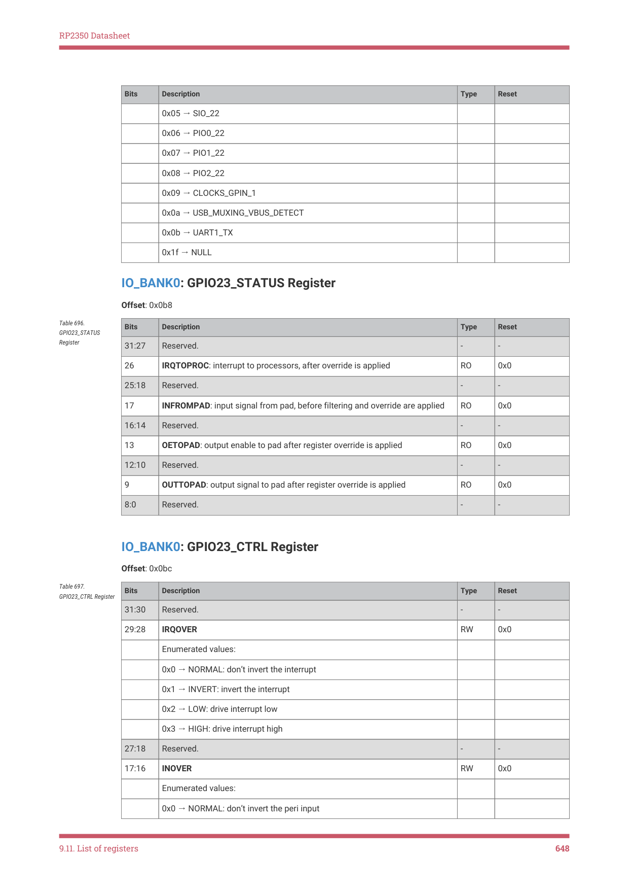

RP2350 Datasheet

Bits
Description
Type
Reset

0x05 → SIO_22

0x06 → PIO0_22

0x07 → PIO1_22

0x08 → PIO2_22

0x09 → CLOCKS_GPIN_1

0x0a → USB_MUXING_VBUS_DETECT

0x0b → UART1_TX

0x1f → NULL

IO_BANK0: GPIO23_STATUS Register

Offset: 0x0b8

| Bits | Description | Type | Reset |
| --- | --- | --- | --- |
| 31:27 | Reserved. | - | - |
| 26 | IRQTOPROC: interrupt to processors, after override is applied | RO | 0x0 |
| 25:18 | Reserved. | - | - |
| 17 | INFROMPAD: input signal from pad, before filtering and override are applied | RO | 0x0 |
| 16:14 | Reserved. | - | - |
| 13 | OETOPAD: output enable to pad after register override is applied | RO | 0x0 |
| 12:10 | Reserved. | - | - |
| 9 | OUTTOPAD: output signal to pad after register override is applied | RO | 0x0 |
| 8:0 | Reserved. | - | - |

Table 696.

GPIO23_STATUS

Register

IO_BANK0: GPIO23_CTRL Register

Offset: 0x0bc

Table 697.

GPIO23_CTRL Register
Bits
Description
Type
Reset

31:30
Reserved.
-
-

29:28
IRQOVER
RW
0x0

Enumerated values:

0x0 → NORMAL: don’t invert the interrupt

0x1 → INVERT: invert the interrupt

0x2 → LOW: drive interrupt low

0x3 → HIGH: drive interrupt high

27:18
Reserved.
-
-

17:16
INOVER
RW
0x0

Enumerated values:

0x0 → NORMAL: don’t invert the peri input

9.11. List of registers
648

RP2350 Datasheet

Bits
Description
Type
Reset

0x1 → INVERT: invert the peri input

0x2 → LOW: drive peri input low

0x3 → HIGH: drive peri input high

15:14
OEOVER
RW
0x0

Enumerated values:

0x0 → NORMAL: drive output enable from peripheral signal selected by

funcsel

0x1 → INVERT: drive output enable from inverse of peripheral signal selected

by funcsel

0x2 → DISABLE: disable output

0x3 → ENABLE: enable output

13:12
OUTOVER
RW
0x0

Enumerated values:

0x0 → NORMAL: drive output from peripheral signal selected by funcsel

0x1 → INVERT: drive output from inverse of peripheral signal selected by

funcsel

0x2 → LOW: drive output low

0x3 → HIGH: drive output high

11:5
Reserved.
-
-

4:0
FUNCSEL: 0-31 → selects pin function according to the gpio table

RW
0x1f

31 == NULL

Enumerated values:

0x01 → SPI0_TX

0x02 → UART1_RTS

0x03 → I2C1_SCL

0x04 → PWM_B_3

0x05 → SIO_23

0x06 → PIO0_23

0x07 → PIO1_23

0x08 → PIO2_23

0x09 → CLOCKS_GPOUT_1

0x0a → USB_MUXING_VBUS_EN

0x0b → UART1_RX

0x1f → NULL

IO_BANK0: GPIO24_STATUS Register

Offset: 0x0c0

9.11. List of registers
649

RP2350 Datasheet

| Bits | Description | Type | Reset |
| --- | --- | --- | --- |
| 31:27 | Reserved. | - | - |
| 26 | IRQTOPROC: interrupt to processors, after override is applied | RO | 0x0 |
| 25:18 | Reserved. | - | - |
| 17 | INFROMPAD: input signal from pad, before filtering and override are applied | RO | 0x0 |
| 16:14 | Reserved. | - | - |
| 13 | OETOPAD: output enable to pad after register override is applied | RO | 0x0 |
| 12:10 | Reserved. | - | - |
| 9 | OUTTOPAD: output signal to pad after register override is applied | RO | 0x0 |
| 8:0 | Reserved. | - | - |

Table 698.

GPIO24_STATUS

Register

IO_BANK0: GPIO24_CTRL Register

Offset: 0x0c4

Table 699.

GPIO24_CTRL Register
Bits
Description
Type
Reset

31:30
Reserved.
-
-

29:28
IRQOVER
RW
0x0

Enumerated values:

0x0 → NORMAL: don’t invert the interrupt

0x1 → INVERT: invert the interrupt

0x2 → LOW: drive interrupt low

0x3 → HIGH: drive interrupt high

27:18
Reserved.
-
-

17:16
INOVER
RW
0x0

Enumerated values:

0x0 → NORMAL: don’t invert the peri input

0x1 → INVERT: invert the peri input

0x2 → LOW: drive peri input low

0x3 → HIGH: drive peri input high

15:14
OEOVER
RW
0x0

Enumerated values:

0x0 → NORMAL: drive output enable from peripheral signal selected by

funcsel

0x1 → INVERT: drive output enable from inverse of peripheral signal selected

by funcsel

0x2 → DISABLE: disable output

0x3 → ENABLE: enable output

13:12
OUTOVER
RW
0x0

9.11. List of registers
650

RP2350 Datasheet

Bits
Description
Type
Reset

Enumerated values:

0x0 → NORMAL: drive output from peripheral signal selected by funcsel

0x1 → INVERT: drive output from inverse of peripheral signal selected by

funcsel

0x2 → LOW: drive output low

0x3 → HIGH: drive output high

11:5
Reserved.
-
-

4:0
FUNCSEL: 0-31 → selects pin function according to the gpio table

RW
0x1f

31 == NULL

Enumerated values:

0x01 → SPI1_RX

0x02 → UART1_TX

0x03 → I2C0_SDA

0x04 → PWM_A_4

0x05 → SIO_24

0x06 → PIO0_24

0x07 → PIO1_24

0x08 → PIO2_24

0x09 → CLOCKS_GPOUT_2

0x0a → USB_MUXING_OVERCURR_DETECT

0x1f → NULL

IO_BANK0: GPIO25_STATUS Register

Offset: 0x0c8

| Bits | Description | Type | Reset |
| --- | --- | --- | --- |
| 31:27 | Reserved. | - | - |
| 26 | IRQTOPROC: interrupt to processors, after override is applied | RO | 0x0 |
| 25:18 | Reserved. | - | - |
| 17 | INFROMPAD: input signal from pad, before filtering and override are applied | RO | 0x0 |
| 16:14 | Reserved. | - | - |
| 13 | OETOPAD: output enable to pad after register override is applied | RO | 0x0 |
| 12:10 | Reserved. | - | - |
| 9 | OUTTOPAD: output signal to pad after register override is applied | RO | 0x0 |
| 8:0 | Reserved. | - | - |

Table 700.

GPIO25_STATUS

Register

IO_BANK0: GPIO25_CTRL Register

Offset: 0x0cc

9.11. List of registers
651

RP2350 Datasheet

Table 701.

GPIO25_CTRL Register
Bits
Description
Type
Reset

31:30
Reserved.
-
-

29:28
IRQOVER
RW
0x0

Enumerated values:

0x0 → NORMAL: don’t invert the interrupt

0x1 → INVERT: invert the interrupt

0x2 → LOW: drive interrupt low

0x3 → HIGH: drive interrupt high

27:18
Reserved.
-
-

17:16
INOVER
RW
0x0

Enumerated values:

0x0 → NORMAL: don’t invert the peri input

0x1 → INVERT: invert the peri input

0x2 → LOW: drive peri input low

0x3 → HIGH: drive peri input high

15:14
OEOVER
RW
0x0

Enumerated values:

0x0 → NORMAL: drive output enable from peripheral signal selected by

funcsel

0x1 → INVERT: drive output enable from inverse of peripheral signal selected

by funcsel

0x2 → DISABLE: disable output

0x3 → ENABLE: enable output

13:12
OUTOVER
RW
0x0

Enumerated values:

0x0 → NORMAL: drive output from peripheral signal selected by funcsel

0x1 → INVERT: drive output from inverse of peripheral signal selected by

funcsel

0x2 → LOW: drive output low

0x3 → HIGH: drive output high

11:5
Reserved.
-
-

4:0
FUNCSEL: 0-31 → selects pin function according to the gpio table

RW
0x1f

31 == NULL

Enumerated values:

0x01 → SPI1_SS_N

0x02 → UART1_RX

0x03 → I2C0_SCL

0x04 → PWM_B_4

9.11. List of registers
652

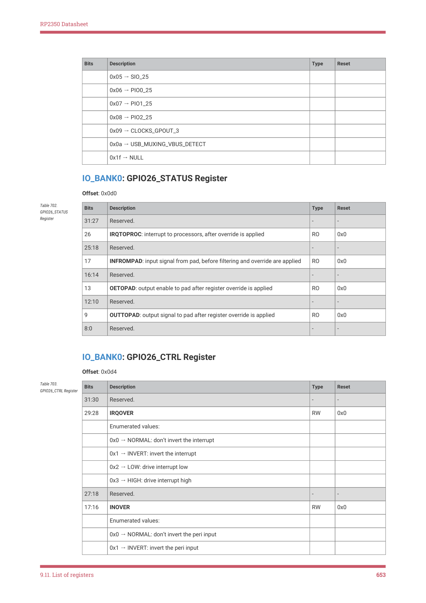

RP2350 Datasheet

Bits
Description
Type
Reset

0x05 → SIO_25

0x06 → PIO0_25

0x07 → PIO1_25

0x08 → PIO2_25

0x09 → CLOCKS_GPOUT_3

0x0a → USB_MUXING_VBUS_DETECT

0x1f → NULL

IO_BANK0: GPIO26_STATUS Register

Offset: 0x0d0

| Bits | Description | Type | Reset |
| --- | --- | --- | --- |
| 31:27 | Reserved. | - | - |
| 26 | IRQTOPROC: interrupt to processors, after override is applied | RO | 0x0 |
| 25:18 | Reserved. | - | - |
| 17 | INFROMPAD: input signal from pad, before filtering and override are applied | RO | 0x0 |
| 16:14 | Reserved. | - | - |
| 13 | OETOPAD: output enable to pad after register override is applied | RO | 0x0 |
| 12:10 | Reserved. | - | - |
| 9 | OUTTOPAD: output signal to pad after register override is applied | RO | 0x0 |
| 8:0 | Reserved. | - | - |

Table 702.

GPIO26_STATUS

Register

IO_BANK0: GPIO26_CTRL Register

Offset: 0x0d4

Table 703.

GPIO26_CTRL Register
Bits
Description
Type
Reset

31:30
Reserved.
-
-

29:28
IRQOVER
RW
0x0

Enumerated values:

0x0 → NORMAL: don’t invert the interrupt

0x1 → INVERT: invert the interrupt

0x2 → LOW: drive interrupt low

0x3 → HIGH: drive interrupt high

27:18
Reserved.
-
-

17:16
INOVER
RW
0x0

Enumerated values:

0x0 → NORMAL: don’t invert the peri input

0x1 → INVERT: invert the peri input

9.11. List of registers
653

RP2350 Datasheet

Bits
Description
Type
Reset

0x2 → LOW: drive peri input low

0x3 → HIGH: drive peri input high

15:14
OEOVER
RW
0x0

Enumerated values:

0x0 → NORMAL: drive output enable from peripheral signal selected by

funcsel

0x1 → INVERT: drive output enable from inverse of peripheral signal selected

by funcsel

0x2 → DISABLE: disable output

0x3 → ENABLE: enable output

13:12
OUTOVER
RW
0x0

Enumerated values:

0x0 → NORMAL: drive output from peripheral signal selected by funcsel

0x1 → INVERT: drive output from inverse of peripheral signal selected by

funcsel

0x2 → LOW: drive output low

0x3 → HIGH: drive output high

11:5
Reserved.
-
-

4:0
FUNCSEL: 0-31 → selects pin function according to the gpio table

RW
0x1f

31 == NULL

Enumerated values:

0x01 → SPI1_SCLK

0x02 → UART1_CTS

0x03 → I2C1_SDA

0x04 → PWM_A_5

0x05 → SIO_26

0x06 → PIO0_26

0x07 → PIO1_26

0x08 → PIO2_26

0x0a → USB_MUXING_VBUS_EN

0x0b → UART1_TX

0x1f → NULL

IO_BANK0: GPIO27_STATUS Register

Offset: 0x0d8

| Bits | Description | Type | Reset |
| --- | --- | --- | --- |
| 31:27 | Reserved. | - | - |

Table 704.

GPIO27_STATUS

Register

9.11. List of registers
654

RP2350 Datasheet

| Bits | Description | Type | Reset |
| --- | --- | --- | --- |
| 26 | IRQTOPROC: interrupt to processors, after override is applied | RO | 0x0 |
| 25:18 | Reserved. | - | - |
| 17 | INFROMPAD: input signal from pad, before filtering and override are applied | RO | 0x0 |
| 16:14 | Reserved. | - | - |
| 13 | OETOPAD: output enable to pad after register override is applied | RO | 0x0 |
| 12:10 | Reserved. | - | - |
| 9 | OUTTOPAD: output signal to pad after register override is applied | RO | 0x0 |
| 8:0 | Reserved. | - | - |

IO_BANK0: GPIO27_CTRL Register

Offset: 0x0dc

Table 705.

GPIO27_CTRL Register
Bits
Description
Type
Reset

31:30
Reserved.
-
-

29:28
IRQOVER
RW
0x0

Enumerated values:

0x0 → NORMAL: don’t invert the interrupt

0x1 → INVERT: invert the interrupt

0x2 → LOW: drive interrupt low

0x3 → HIGH: drive interrupt high

27:18
Reserved.
-
-

17:16
INOVER
RW
0x0

Enumerated values:

0x0 → NORMAL: don’t invert the peri input

0x1 → INVERT: invert the peri input

0x2 → LOW: drive peri input low

0x3 → HIGH: drive peri input high

15:14
OEOVER
RW
0x0

Enumerated values:

0x0 → NORMAL: drive output enable from peripheral signal selected by

funcsel

0x1 → INVERT: drive output enable from inverse of peripheral signal selected

by funcsel

0x2 → DISABLE: disable output

0x3 → ENABLE: enable output

13:12
OUTOVER
RW
0x0

Enumerated values:

9.11. List of registers
655

RP2350 Datasheet

Bits
Description
Type
Reset

0x0 → NORMAL: drive output from peripheral signal selected by funcsel

0x1 → INVERT: drive output from inverse of peripheral signal selected by

funcsel

0x2 → LOW: drive output low

0x3 → HIGH: drive output high

11:5
Reserved.
-
-

4:0
FUNCSEL: 0-31 → selects pin function according to the gpio table

RW
0x1f

31 == NULL

Enumerated values:

0x01 → SPI1_TX

0x02 → UART1_RTS

0x03 → I2C1_SCL

0x04 → PWM_B_5

0x05 → SIO_27

0x06 → PIO0_27

0x07 → PIO1_27

0x08 → PIO2_27

0x0a → USB_MUXING_OVERCURR_DETECT

0x0b → UART1_RX

0x1f → NULL

IO_BANK0: GPIO28_STATUS Register

Offset: 0x0e0

| Bits | Description | Type | Reset |
| --- | --- | --- | --- |
| 31:27 | Reserved. | - | - |
| 26 | IRQTOPROC: interrupt to processors, after override is applied | RO | 0x0 |
| 25:18 | Reserved. | - | - |
| 17 | INFROMPAD: input signal from pad, before filtering and override are applied | RO | 0x0 |
| 16:14 | Reserved. | - | - |
| 13 | OETOPAD: output enable to pad after register override is applied | RO | 0x0 |
| 12:10 | Reserved. | - | - |
| 9 | OUTTOPAD: output signal to pad after register override is applied | RO | 0x0 |
| 8:0 | Reserved. | - | - |

Table 706.

GPIO28_STATUS

Register

IO_BANK0: GPIO28_CTRL Register

Offset: 0x0e4

9.11. List of registers
656

RP2350 Datasheet

Table 707.

GPIO28_CTRL Register
Bits
Description
Type
Reset

31:30
Reserved.
-
-

29:28
IRQOVER
RW
0x0

Enumerated values:

0x0 → NORMAL: don’t invert the interrupt

0x1 → INVERT: invert the interrupt

0x2 → LOW: drive interrupt low

0x3 → HIGH: drive interrupt high

27:18
Reserved.
-
-

17:16
INOVER
RW
0x0

Enumerated values:

0x0 → NORMAL: don’t invert the peri input

0x1 → INVERT: invert the peri input

0x2 → LOW: drive peri input low

0x3 → HIGH: drive peri input high

15:14
OEOVER
RW
0x0

Enumerated values:

0x0 → NORMAL: drive output enable from peripheral signal selected by

funcsel

0x1 → INVERT: drive output enable from inverse of peripheral signal selected

by funcsel

0x2 → DISABLE: disable output

0x3 → ENABLE: enable output

13:12
OUTOVER
RW
0x0

Enumerated values:

0x0 → NORMAL: drive output from peripheral signal selected by funcsel

0x1 → INVERT: drive output from inverse of peripheral signal selected by

funcsel

0x2 → LOW: drive output low

0x3 → HIGH: drive output high

11:5
Reserved.
-
-

4:0
FUNCSEL: 0-31 → selects pin function according to the gpio table

RW
0x1f

31 == NULL

Enumerated values:

0x01 → SPI1_RX

0x02 → UART0_TX

0x03 → I2C0_SDA

0x04 → PWM_A_6

9.11. List of registers
657

RP2350 Datasheet

Bits
Description
Type
Reset

0x05 → SIO_28

0x06 → PIO0_28

0x07 → PIO1_28

0x08 → PIO2_28

0x0a → USB_MUXING_VBUS_DETECT

0x1f → NULL

IO_BANK0: GPIO29_STATUS Register

Offset: 0x0e8

| Bits | Description | Type | Reset |
| --- | --- | --- | --- |
| 31:27 | Reserved. | - | - |
| 26 | IRQTOPROC: interrupt to processors, after override is applied | RO | 0x0 |
| 25:18 | Reserved. | - | - |
| 17 | INFROMPAD: input signal from pad, before filtering and override are applied | RO | 0x0 |
| 16:14 | Reserved. | - | - |
| 13 | OETOPAD: output enable to pad after register override is applied | RO | 0x0 |
| 12:10 | Reserved. | - | - |
| 9 | OUTTOPAD: output signal to pad after register override is applied | RO | 0x0 |
| 8:0 | Reserved. | - | - |

Table 708.

GPIO29_STATUS

Register

IO_BANK0: GPIO29_CTRL Register

Offset: 0x0ec

Table 709.

GPIO29_CTRL Register
Bits
Description
Type
Reset

31:30
Reserved.
-
-

29:28
IRQOVER
RW
0x0

Enumerated values:

0x0 → NORMAL: don’t invert the interrupt

0x1 → INVERT: invert the interrupt

0x2 → LOW: drive interrupt low

0x3 → HIGH: drive interrupt high

27:18
Reserved.
-
-

17:16
INOVER
RW
0x0

Enumerated values:

0x0 → NORMAL: don’t invert the peri input

0x1 → INVERT: invert the peri input

0x2 → LOW: drive peri input low

9.11. List of registers
658

RP2350 Datasheet

Bits
Description
Type
Reset

0x3 → HIGH: drive peri input high

15:14
OEOVER
RW
0x0

Enumerated values:

0x0 → NORMAL: drive output enable from peripheral signal selected by

funcsel

0x1 → INVERT: drive output enable from inverse of peripheral signal selected

by funcsel

0x2 → DISABLE: disable output

0x3 → ENABLE: enable output

13:12
OUTOVER
RW
0x0

Enumerated values:

0x0 → NORMAL: drive output from peripheral signal selected by funcsel

0x1 → INVERT: drive output from inverse of peripheral signal selected by

funcsel

0x2 → LOW: drive output low

0x3 → HIGH: drive output high

11:5
Reserved.
-
-

4:0
FUNCSEL: 0-31 → selects pin function according to the gpio table

RW
0x1f

31 == NULL

Enumerated values:

0x01 → SPI1_SS_N

0x02 → UART0_RX

0x03 → I2C0_SCL

0x04 → PWM_B_6

0x05 → SIO_29

0x06 → PIO0_29

0x07 → PIO1_29

0x08 → PIO2_29

0x0a → USB_MUXING_VBUS_EN

0x1f → NULL

IO_BANK0: GPIO30_STATUS Register

Offset: 0x0f0

| Bits | Description | Type | Reset |
| --- | --- | --- | --- |
| 31:27 | Reserved. | - | - |
| 26 | IRQTOPROC: interrupt to processors, after override is applied | RO | 0x0 |
| 25:18 | Reserved. | - | - |

Table 710.

GPIO30_STATUS

Register

9.11. List of registers
659

RP2350 Datasheet

| Bits | Description | Type | Reset |
| --- | --- | --- | --- |
| 17 | INFROMPAD: input signal from pad, before filtering and override are applied | RO | 0x0 |
| 16:14 | Reserved. | - | - |
| 13 | OETOPAD: output enable to pad after register override is applied | RO | 0x0 |
| 12:10 | Reserved. | - | - |
| 9 | OUTTOPAD: output signal to pad after register override is applied | RO | 0x0 |
| 8:0 | Reserved. | - | - |

IO_BANK0: GPIO30_CTRL Register

Offset: 0x0f4

Table 711.

GPIO30_CTRL Register
Bits
Description
Type
Reset

31:30
Reserved.
-
-

29:28
IRQOVER
RW
0x0

Enumerated values:

0x0 → NORMAL: don’t invert the interrupt

0x1 → INVERT: invert the interrupt

0x2 → LOW: drive interrupt low

0x3 → HIGH: drive interrupt high

27:18
Reserved.
-
-

17:16
INOVER
RW
0x0

Enumerated values:

0x0 → NORMAL: don’t invert the peri input

0x1 → INVERT: invert the peri input

0x2 → LOW: drive peri input low

0x3 → HIGH: drive peri input high

15:14
OEOVER
RW
0x0

Enumerated values:

0x0 → NORMAL: drive output enable from peripheral signal selected by

funcsel

0x1 → INVERT: drive output enable from inverse of peripheral signal selected

by funcsel

0x2 → DISABLE: disable output

0x3 → ENABLE: enable output

13:12
OUTOVER
RW
0x0

Enumerated values:

0x0 → NORMAL: drive output from peripheral signal selected by funcsel

9.11. List of registers
660

RP2350 Datasheet

Bits
Description
Type
Reset

0x1 → INVERT: drive output from inverse of peripheral signal selected by

funcsel

0x2 → LOW: drive output low

0x3 → HIGH: drive output high

11:5
Reserved.
-
-

4:0
FUNCSEL: 0-31 → selects pin function according to the gpio table

RW
0x1f

31 == NULL

Enumerated values:

0x01 → SPI1_SCLK

0x02 → UART0_CTS

0x03 → I2C1_SDA

0x04 → PWM_A_7

0x05 → SIO_30

0x06 → PIO0_30

0x07 → PIO1_30

0x08 → PIO2_30

0x0a → USB_MUXING_OVERCURR_DETECT

0x0b → UART0_TX

0x1f → NULL

IO_BANK0: GPIO31_STATUS Register

Offset: 0x0f8

| Bits | Description | Type | Reset |
| --- | --- | --- | --- |
| 31:27 | Reserved. | - | - |
| 26 | IRQTOPROC: interrupt to processors, after override is applied | RO | 0x0 |
| 25:18 | Reserved. | - | - |
| 17 | INFROMPAD: input signal from pad, before filtering and override are applied | RO | 0x0 |
| 16:14 | Reserved. | - | - |
| 13 | OETOPAD: output enable to pad after register override is applied | RO | 0x0 |
| 12:10 | Reserved. | - | - |
| 9 | OUTTOPAD: output signal to pad after register override is applied | RO | 0x0 |
| 8:0 | Reserved. | - | - |

Table 712.

GPIO31_STATUS

Register

IO_BANK0: GPIO31_CTRL Register

Offset: 0x0fc

9.11. List of registers
661

RP2350 Datasheet

Table 713.

GPIO31_CTRL Register
Bits
Description
Type
Reset

31:30
Reserved.
-
-

29:28
IRQOVER
RW
0x0

Enumerated values:

0x0 → NORMAL: don’t invert the interrupt

0x1 → INVERT: invert the interrupt

0x2 → LOW: drive interrupt low

0x3 → HIGH: drive interrupt high

27:18
Reserved.
-
-

17:16
INOVER
RW
0x0

Enumerated values:

0x0 → NORMAL: don’t invert the peri input

0x1 → INVERT: invert the peri input

0x2 → LOW: drive peri input low

0x3 → HIGH: drive peri input high

15:14
OEOVER
RW
0x0

Enumerated values:

0x0 → NORMAL: drive output enable from peripheral signal selected by

funcsel

0x1 → INVERT: drive output enable from inverse of peripheral signal selected

by funcsel

0x2 → DISABLE: disable output

0x3 → ENABLE: enable output

13:12
OUTOVER
RW
0x0

Enumerated values:

0x0 → NORMAL: drive output from peripheral signal selected by funcsel

0x1 → INVERT: drive output from inverse of peripheral signal selected by

funcsel

0x2 → LOW: drive output low

0x3 → HIGH: drive output high

11:5
Reserved.
-
-

4:0
FUNCSEL: 0-31 → selects pin function according to the gpio table

RW
0x1f

31 == NULL

Enumerated values:

0x01 → SPI1_TX

0x02 → UART0_RTS

0x03 → I2C1_SCL

0x04 → PWM_B_7

9.11. List of registers
662

RP2350 Datasheet

Bits
Description
Type
Reset

0x05 → SIO_31

0x06 → PIO0_31

0x07 → PIO1_31

0x08 → PIO2_31

0x0a → USB_MUXING_VBUS_DETECT

0x0b → UART0_RX

0x1f → NULL

IO_BANK0: GPIO32_STATUS Register

Offset: 0x100

| Bits | Description | Type | Reset |
| --- | --- | --- | --- |
| 31:27 | Reserved. | - | - |
| 26 | IRQTOPROC: interrupt to processors, after override is applied | RO | 0x0 |
| 25:18 | Reserved. | - | - |
| 17 | INFROMPAD: input signal from pad, before filtering and override are applied | RO | 0x0 |
| 16:14 | Reserved. | - | - |
| 13 | OETOPAD: output enable to pad after register override is applied | RO | 0x0 |
| 12:10 | Reserved. | - | - |
| 9 | OUTTOPAD: output signal to pad after register override is applied | RO | 0x0 |
| 8:0 | Reserved. | - | - |

Table 714.

GPIO32_STATUS

Register

IO_BANK0: GPIO32_CTRL Register

Offset: 0x104

Table 715.

GPIO32_CTRL Register
Bits
Description
Type
Reset

31:30
Reserved.
-
-

29:28
IRQOVER
RW
0x0

Enumerated values:

0x0 → NORMAL: don’t invert the interrupt

0x1 → INVERT: invert the interrupt

0x2 → LOW: drive interrupt low

0x3 → HIGH: drive interrupt high

27:18
Reserved.
-
-

17:16
INOVER
RW
0x0

Enumerated values:

0x0 → NORMAL: don’t invert the peri input

0x1 → INVERT: invert the peri input

9.11. List of registers
663

RP2350 Datasheet

Bits
Description
Type
Reset

0x2 → LOW: drive peri input low

0x3 → HIGH: drive peri input high

15:14
OEOVER
RW
0x0

Enumerated values:

0x0 → NORMAL: drive output enable from peripheral signal selected by

funcsel

0x1 → INVERT: drive output enable from inverse of peripheral signal selected

by funcsel

0x2 → DISABLE: disable output

0x3 → ENABLE: enable output

13:12
OUTOVER
RW
0x0

Enumerated values:

0x0 → NORMAL: drive output from peripheral signal selected by funcsel

0x1 → INVERT: drive output from inverse of peripheral signal selected by

funcsel

0x2 → LOW: drive output low

0x3 → HIGH: drive output high

11:5
Reserved.
-
-

4:0
FUNCSEL: 0-31 → selects pin function according to the gpio table

RW
0x1f

31 == NULL

Enumerated values:

0x01 → SPI0_RX

0x02 → UART0_TX

0x03 → I2C0_SDA

0x04 → PWM_A_8

0x05 → SIO_32

0x06 → PIO0_32

0x07 → PIO1_32

0x08 → PIO2_32

0x0a → USB_MUXING_VBUS_EN

0x1f → NULL

IO_BANK0: GPIO33_STATUS Register

Offset: 0x108

| Bits | Description | Type | Reset |
| --- | --- | --- | --- |
| 31:27 | Reserved. | - | - |
| 26 | IRQTOPROC: interrupt to processors, after override is applied | RO | 0x0 |

Table 716.

GPIO33_STATUS

Register

9.11. List of registers
664

RP2350 Datasheet

| Bits | Description | Type | Reset |
| --- | --- | --- | --- |
| 25:18 | Reserved. | - | - |
| 17 | INFROMPAD: input signal from pad, before filtering and override are applied | RO | 0x0 |
| 16:14 | Reserved. | - | - |
| 13 | OETOPAD: output enable to pad after register override is applied | RO | 0x0 |
| 12:10 | Reserved. | - | - |
| 9 | OUTTOPAD: output signal to pad after register override is applied | RO | 0x0 |
| 8:0 | Reserved. | - | - |

IO_BANK0: GPIO33_CTRL Register

Offset: 0x10c

Table 717.

GPIO33_CTRL Register
Bits
Description
Type
Reset

31:30
Reserved.
-
-

29:28
IRQOVER
RW
0x0

Enumerated values:

0x0 → NORMAL: don’t invert the interrupt

0x1 → INVERT: invert the interrupt

0x2 → LOW: drive interrupt low

0x3 → HIGH: drive interrupt high

27:18
Reserved.
-
-

17:16
INOVER
RW
0x0

Enumerated values:

0x0 → NORMAL: don’t invert the peri input

0x1 → INVERT: invert the peri input

0x2 → LOW: drive peri input low

0x3 → HIGH: drive peri input high

15:14
OEOVER
RW
0x0

Enumerated values:

0x0 → NORMAL: drive output enable from peripheral signal selected by

funcsel

0x1 → INVERT: drive output enable from inverse of peripheral signal selected

by funcsel

0x2 → DISABLE: disable output

0x3 → ENABLE: enable output

13:12
OUTOVER
RW
0x0

Enumerated values:

0x0 → NORMAL: drive output from peripheral signal selected by funcsel

9.11. List of registers
665

RP2350 Datasheet

Bits
Description
Type
Reset

0x1 → INVERT: drive output from inverse of peripheral signal selected by

funcsel

0x2 → LOW: drive output low

0x3 → HIGH: drive output high

11:5
Reserved.
-
-

4:0
FUNCSEL: 0-31 → selects pin function according to the gpio table

RW
0x1f

31 == NULL

Enumerated values:

0x01 → SPI0_SS_N

0x02 → UART0_RX

0x03 → I2C0_SCL

0x04 → PWM_B_8

0x05 → SIO_33

0x06 → PIO0_33

0x07 → PIO1_33

0x08 → PIO2_33

0x0a → USB_MUXING_OVERCURR_DETECT

0x1f → NULL

IO_BANK0: GPIO34_STATUS Register

Offset: 0x110

| Bits | Description | Type | Reset |
| --- | --- | --- | --- |
| 31:27 | Reserved. | - | - |
| 26 | IRQTOPROC: interrupt to processors, after override is applied | RO | 0x0 |
| 25:18 | Reserved. | - | - |
| 17 | INFROMPAD: input signal from pad, before filtering and override are applied | RO | 0x0 |
| 16:14 | Reserved. | - | - |
| 13 | OETOPAD: output enable to pad after register override is applied | RO | 0x0 |
| 12:10 | Reserved. | - | - |
| 9 | OUTTOPAD: output signal to pad after register override is applied | RO | 0x0 |
| 8:0 | Reserved. | - | - |

Table 718.

GPIO34_STATUS

Register

IO_BANK0: GPIO34_CTRL Register

Offset: 0x114

| Bits | Description | Type | Reset |
| --- | --- | --- | --- |
| 31:30 | Reserved. | - | - |

Table 719.

9.11. List of registers
666

RP2350 Datasheet

Bits
Description
Type
Reset

29:28
IRQOVER
RW
0x0

Enumerated values:

0x0 → NORMAL: don’t invert the interrupt

0x1 → INVERT: invert the interrupt

0x2 → LOW: drive interrupt low

0x3 → HIGH: drive interrupt high

27:18
Reserved.
-
-

17:16
INOVER
RW
0x0

Enumerated values:

0x0 → NORMAL: don’t invert the peri input

0x1 → INVERT: invert the peri input

0x2 → LOW: drive peri input low

0x3 → HIGH: drive peri input high

15:14
OEOVER
RW
0x0

Enumerated values:

0x0 → NORMAL: drive output enable from peripheral signal selected by

funcsel

0x1 → INVERT: drive output enable from inverse of peripheral signal selected

by funcsel

0x2 → DISABLE: disable output

0x3 → ENABLE: enable output

13:12
OUTOVER
RW
0x0

Enumerated values:

0x0 → NORMAL: drive output from peripheral signal selected by funcsel

0x1 → INVERT: drive output from inverse of peripheral signal selected by

funcsel

0x2 → LOW: drive output low

0x3 → HIGH: drive output high

11:5
Reserved.
-
-

4:0
FUNCSEL: 0-31 → selects pin function according to the gpio table

RW
0x1f

31 == NULL

Enumerated values:

0x01 → SPI0_SCLK

0x02 → UART0_CTS

0x03 → I2C1_SDA

0x04 → PWM_A_9

0x05 → SIO_34

9.11. List of registers
667

RP2350 Datasheet

Bits
Description
Type
Reset

0x06 → PIO0_34

0x07 → PIO1_34

0x08 → PIO2_34

0x0a → USB_MUXING_VBUS_DETECT

0x0b → UART0_TX

0x1f → NULL

IO_BANK0: GPIO35_STATUS Register

Offset: 0x118

| Bits | Description | Type | Reset |
| --- | --- | --- | --- |
| 31:27 | Reserved. | - | - |
| 26 | IRQTOPROC: interrupt to processors, after override is applied | RO | 0x0 |
| 25:18 | Reserved. | - | - |
| 17 | INFROMPAD: input signal from pad, before filtering and override are applied | RO | 0x0 |
| 16:14 | Reserved. | - | - |
| 13 | OETOPAD: output enable to pad after register override is applied | RO | 0x0 |
| 12:10 | Reserved. | - | - |
| 9 | OUTTOPAD: output signal to pad after register override is applied | RO | 0x0 |
| 8:0 | Reserved. | - | - |

Table 720.

GPIO35_STATUS

Register

IO_BANK0: GPIO35_CTRL Register

Offset: 0x11c

Table 721.

GPIO35_CTRL Register
Bits
Description
Type
Reset

31:30
Reserved.
-
-

29:28
IRQOVER
RW
0x0

Enumerated values:

0x0 → NORMAL: don’t invert the interrupt

0x1 → INVERT: invert the interrupt

0x2 → LOW: drive interrupt low

0x3 → HIGH: drive interrupt high

27:18
Reserved.
-
-

17:16
INOVER
RW
0x0

Enumerated values:

0x0 → NORMAL: don’t invert the peri input

0x1 → INVERT: invert the peri input

0x2 → LOW: drive peri input low

9.11. List of registers
668

RP2350 Datasheet

Bits
Description
Type
Reset

0x3 → HIGH: drive peri input high

15:14
OEOVER
RW
0x0

Enumerated values:

0x0 → NORMAL: drive output enable from peripheral signal selected by

funcsel

0x1 → INVERT: drive output enable from inverse of peripheral signal selected

by funcsel

0x2 → DISABLE: disable output

0x3 → ENABLE: enable output

13:12
OUTOVER
RW
0x0

Enumerated values:

0x0 → NORMAL: drive output from peripheral signal selected by funcsel

0x1 → INVERT: drive output from inverse of peripheral signal selected by

funcsel

0x2 → LOW: drive output low

0x3 → HIGH: drive output high

11:5
Reserved.
-
-

4:0
FUNCSEL: 0-31 → selects pin function according to the gpio table

RW
0x1f

31 == NULL

Enumerated values:

0x01 → SPI0_TX

0x02 → UART0_RTS

0x03 → I2C1_SCL

0x04 → PWM_B_9

0x05 → SIO_35

0x06 → PIO0_35

0x07 → PIO1_35

0x08 → PIO2_35

0x0a → USB_MUXING_VBUS_EN

0x0b → UART0_RX

0x1f → NULL

IO_BANK0: GPIO36_STATUS Register

Offset: 0x120

| Bits | Description | Type | Reset |
| --- | --- | --- | --- |
| 31:27 | Reserved. | - | - |
| 26 | IRQTOPROC: interrupt to processors, after override is applied | RO | 0x0 |

Table 722.

GPIO36_STATUS

Register

9.11. List of registers
669

RP2350 Datasheet

| Bits | Description | Type | Reset |
| --- | --- | --- | --- |
| 25:18 | Reserved. | - | - |
| 17 | INFROMPAD: input signal from pad, before filtering and override are applied | RO | 0x0 |
| 16:14 | Reserved. | - | - |
| 13 | OETOPAD: output enable to pad after register override is applied | RO | 0x0 |
| 12:10 | Reserved. | - | - |
| 9 | OUTTOPAD: output signal to pad after register override is applied | RO | 0x0 |
| 8:0 | Reserved. | - | - |

IO_BANK0: GPIO36_CTRL Register

Offset: 0x124

Table 723.

GPIO36_CTRL Register
Bits
Description
Type
Reset

31:30
Reserved.
-
-

29:28
IRQOVER
RW
0x0

Enumerated values:

0x0 → NORMAL: don’t invert the interrupt

0x1 → INVERT: invert the interrupt

0x2 → LOW: drive interrupt low

0x3 → HIGH: drive interrupt high

27:18
Reserved.
-
-

17:16
INOVER
RW
0x0

Enumerated values:

0x0 → NORMAL: don’t invert the peri input

0x1 → INVERT: invert the peri input

0x2 → LOW: drive peri input low

0x3 → HIGH: drive peri input high

15:14
OEOVER
RW
0x0

Enumerated values:

0x0 → NORMAL: drive output enable from peripheral signal selected by

funcsel

0x1 → INVERT: drive output enable from inverse of peripheral signal selected

by funcsel

0x2 → DISABLE: disable output

0x3 → ENABLE: enable output

13:12
OUTOVER
RW
0x0

Enumerated values:

0x0 → NORMAL: drive output from peripheral signal selected by funcsel

9.11. List of registers
670

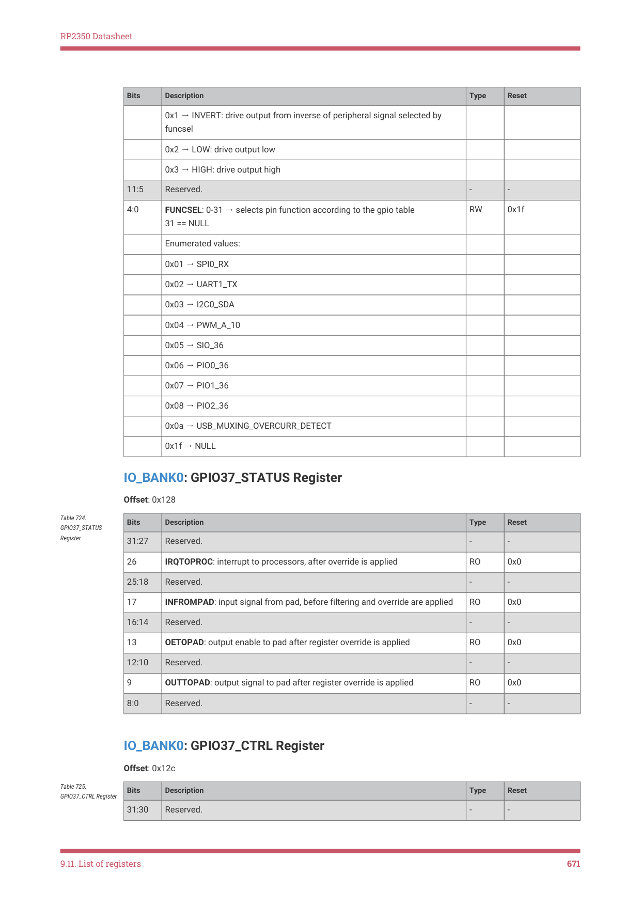

RP2350 Datasheet

Bits
Description
Type
Reset

0x1 → INVERT: drive output from inverse of peripheral signal selected by

funcsel

0x2 → LOW: drive output low

0x3 → HIGH: drive output high

11:5
Reserved.
-
-

4:0
FUNCSEL: 0-31 → selects pin function according to the gpio table

RW
0x1f

31 == NULL

Enumerated values:

0x01 → SPI0_RX

0x02 → UART1_TX

0x03 → I2C0_SDA

0x04 → PWM_A_10

0x05 → SIO_36

0x06 → PIO0_36

0x07 → PIO1_36

0x08 → PIO2_36

0x0a → USB_MUXING_OVERCURR_DETECT

0x1f → NULL

IO_BANK0: GPIO37_STATUS Register

Offset: 0x128

| Bits | Description | Type | Reset |
| --- | --- | --- | --- |
| 31:27 | Reserved. | - | - |
| 26 | IRQTOPROC: interrupt to processors, after override is applied | RO | 0x0 |
| 25:18 | Reserved. | - | - |
| 17 | INFROMPAD: input signal from pad, before filtering and override are applied | RO | 0x0 |
| 16:14 | Reserved. | - | - |
| 13 | OETOPAD: output enable to pad after register override is applied | RO | 0x0 |
| 12:10 | Reserved. | - | - |
| 9 | OUTTOPAD: output signal to pad after register override is applied | RO | 0x0 |
| 8:0 | Reserved. | - | - |

Table 724.

GPIO37_STATUS

Register

IO_BANK0: GPIO37_CTRL Register

Offset: 0x12c

| Bits | Description | Type | Reset |
| --- | --- | --- | --- |
| 31:30 | Reserved. | - | - |

Table 725.

9.11. List of registers
671

RP2350 Datasheet

Bits
Description
Type
Reset

29:28
IRQOVER
RW
0x0

Enumerated values:

0x0 → NORMAL: don’t invert the interrupt

0x1 → INVERT: invert the interrupt

0x2 → LOW: drive interrupt low

0x3 → HIGH: drive interrupt high

27:18
Reserved.
-
-

17:16
INOVER
RW
0x0

Enumerated values:

0x0 → NORMAL: don’t invert the peri input

0x1 → INVERT: invert the peri input

0x2 → LOW: drive peri input low

0x3 → HIGH: drive peri input high

15:14
OEOVER
RW
0x0

Enumerated values:

0x0 → NORMAL: drive output enable from peripheral signal selected by

funcsel

0x1 → INVERT: drive output enable from inverse of peripheral signal selected

by funcsel

0x2 → DISABLE: disable output

0x3 → ENABLE: enable output

13:12
OUTOVER
RW
0x0

Enumerated values:

0x0 → NORMAL: drive output from peripheral signal selected by funcsel

0x1 → INVERT: drive output from inverse of peripheral signal selected by

funcsel

0x2 → LOW: drive output low

0x3 → HIGH: drive output high

11:5
Reserved.
-
-

4:0
FUNCSEL: 0-31 → selects pin function according to the gpio table

RW
0x1f

31 == NULL

Enumerated values:

0x01 → SPI0_SS_N

0x02 → UART1_RX

0x03 → I2C0_SCL

0x04 → PWM_B_10

0x05 → SIO_37

9.11. List of registers
672

RP2350 Datasheet

Bits
Description
Type
Reset

0x06 → PIO0_37

0x07 → PIO1_37

0x08 → PIO2_37

0x0a → USB_MUXING_VBUS_DETECT

0x1f → NULL

IO_BANK0: GPIO38_STATUS Register

Offset: 0x130

| Bits | Description | Type | Reset |
| --- | --- | --- | --- |
| 31:27 | Reserved. | - | - |
| 26 | IRQTOPROC: interrupt to processors, after override is applied | RO | 0x0 |
| 25:18 | Reserved. | - | - |
| 17 | INFROMPAD: input signal from pad, before filtering and override are applied | RO | 0x0 |
| 16:14 | Reserved. | - | - |
| 13 | OETOPAD: output enable to pad after register override is applied | RO | 0x0 |
| 12:10 | Reserved. | - | - |
| 9 | OUTTOPAD: output signal to pad after register override is applied | RO | 0x0 |
| 8:0 | Reserved. | - | - |

Table 726.

GPIO38_STATUS

Register

IO_BANK0: GPIO38_CTRL Register

Offset: 0x134

Table 727.

GPIO38_CTRL Register
Bits
Description
Type
Reset

31:30
Reserved.
-
-

29:28
IRQOVER
RW
0x0

Enumerated values:

0x0 → NORMAL: don’t invert the interrupt

0x1 → INVERT: invert the interrupt

0x2 → LOW: drive interrupt low

0x3 → HIGH: drive interrupt high

27:18
Reserved.
-
-

17:16
INOVER
RW
0x0

Enumerated values:

0x0 → NORMAL: don’t invert the peri input

0x1 → INVERT: invert the peri input

0x2 → LOW: drive peri input low

0x3 → HIGH: drive peri input high

9.11. List of registers
673

RP2350 Datasheet

Bits
Description
Type
Reset

15:14
OEOVER
RW
0x0

Enumerated values:

0x0 → NORMAL: drive output enable from peripheral signal selected by

funcsel

0x1 → INVERT: drive output enable from inverse of peripheral signal selected

by funcsel

0x2 → DISABLE: disable output

0x3 → ENABLE: enable output

13:12
OUTOVER
RW
0x0

Enumerated values:

0x0 → NORMAL: drive output from peripheral signal selected by funcsel

0x1 → INVERT: drive output from inverse of peripheral signal selected by

funcsel

0x2 → LOW: drive output low

0x3 → HIGH: drive output high

11:5
Reserved.
-
-

4:0
FUNCSEL: 0-31 → selects pin function according to the gpio table

RW
0x1f

31 == NULL

Enumerated values:

0x01 → SPI0_SCLK

0x02 → UART1_CTS

0x03 → I2C1_SDA

0x04 → PWM_A_11

0x05 → SIO_38

0x06 → PIO0_38

0x07 → PIO1_38

0x08 → PIO2_38

0x0a → USB_MUXING_VBUS_EN

0x0b → UART1_TX

0x1f → NULL

IO_BANK0: GPIO39_STATUS Register

Offset: 0x138

| Bits | Description | Type | Reset |
| --- | --- | --- | --- |
| 31:27 | Reserved. | - | - |
| 26 | IRQTOPROC: interrupt to processors, after override is applied | RO | 0x0 |
| 25:18 | Reserved. | - | - |

Table 728.

GPIO39_STATUS

Register

9.11. List of registers
674

RP2350 Datasheet

| Bits | Description | Type | Reset |
| --- | --- | --- | --- |
| 17 | INFROMPAD: input signal from pad, before filtering and override are applied | RO | 0x0 |
| 16:14 | Reserved. | - | - |
| 13 | OETOPAD: output enable to pad after register override is applied | RO | 0x0 |
| 12:10 | Reserved. | - | - |
| 9 | OUTTOPAD: output signal to pad after register override is applied | RO | 0x0 |
| 8:0 | Reserved. | - | - |

IO_BANK0: GPIO39_CTRL Register

Offset: 0x13c

Table 729.

GPIO39_CTRL Register
Bits
Description
Type
Reset

31:30
Reserved.
-
-

29:28
IRQOVER
RW
0x0

Enumerated values:

0x0 → NORMAL: don’t invert the interrupt

0x1 → INVERT: invert the interrupt

0x2 → LOW: drive interrupt low

0x3 → HIGH: drive interrupt high

27:18
Reserved.
-
-

17:16
INOVER
RW
0x0

Enumerated values:

0x0 → NORMAL: don’t invert the peri input

0x1 → INVERT: invert the peri input

0x2 → LOW: drive peri input low

0x3 → HIGH: drive peri input high

15:14
OEOVER
RW
0x0

Enumerated values:

0x0 → NORMAL: drive output enable from peripheral signal selected by

funcsel

0x1 → INVERT: drive output enable from inverse of peripheral signal selected

by funcsel

0x2 → DISABLE: disable output

0x3 → ENABLE: enable output

13:12
OUTOVER
RW
0x0

Enumerated values:

0x0 → NORMAL: drive output from peripheral signal selected by funcsel

9.11. List of registers
675

RP2350 Datasheet

Bits
Description
Type
Reset

0x1 → INVERT: drive output from inverse of peripheral signal selected by

funcsel

0x2 → LOW: drive output low

0x3 → HIGH: drive output high

11:5
Reserved.
-
-

4:0
FUNCSEL: 0-31 → selects pin function according to the gpio table

RW
0x1f

31 == NULL

Enumerated values:

0x01 → SPI0_TX

0x02 → UART1_RTS

0x03 → I2C1_SCL

0x04 → PWM_B_11

0x05 → SIO_39

0x06 → PIO0_39

0x07 → PIO1_39

0x08 → PIO2_39

0x0a → USB_MUXING_OVERCURR_DETECT

0x0b → UART1_RX

0x1f → NULL

IO_BANK0: GPIO40_STATUS Register

Offset: 0x140

| Bits | Description | Type | Reset |
| --- | --- | --- | --- |
| 31:27 | Reserved. | - | - |
| 26 | IRQTOPROC: interrupt to processors, after override is applied | RO | 0x0 |
| 25:18 | Reserved. | - | - |
| 17 | INFROMPAD: input signal from pad, before filtering and override are applied | RO | 0x0 |
| 16:14 | Reserved. | - | - |
| 13 | OETOPAD: output enable to pad after register override is applied | RO | 0x0 |
| 12:10 | Reserved. | - | - |
| 9 | OUTTOPAD: output signal to pad after register override is applied | RO | 0x0 |
| 8:0 | Reserved. | - | - |

Table 730.

GPIO40_STATUS

Register

IO_BANK0: GPIO40_CTRL Register

Offset: 0x144

9.11. List of registers
676

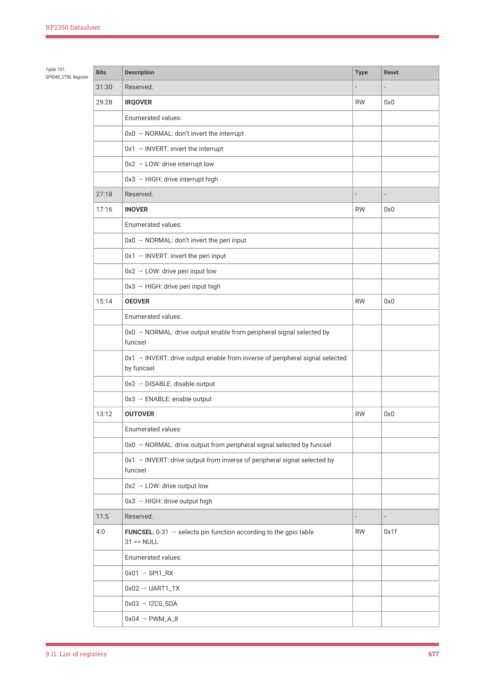

RP2350 Datasheet

Table 731.

GPIO40_CTRL Register
Bits
Description
Type
Reset

31:30
Reserved.
-
-

29:28
IRQOVER
RW
0x0

Enumerated values:

0x0 → NORMAL: don’t invert the interrupt

0x1 → INVERT: invert the interrupt

0x2 → LOW: drive interrupt low

0x3 → HIGH: drive interrupt high

27:18
Reserved.
-
-

17:16
INOVER
RW
0x0

Enumerated values:

0x0 → NORMAL: don’t invert the peri input

0x1 → INVERT: invert the peri input

0x2 → LOW: drive peri input low

0x3 → HIGH: drive peri input high

15:14
OEOVER
RW
0x0

Enumerated values:

0x0 → NORMAL: drive output enable from peripheral signal selected by

funcsel

0x1 → INVERT: drive output enable from inverse of peripheral signal selected

by funcsel

0x2 → DISABLE: disable output

0x3 → ENABLE: enable output

13:12
OUTOVER
RW
0x0

Enumerated values:

0x0 → NORMAL: drive output from peripheral signal selected by funcsel

0x1 → INVERT: drive output from inverse of peripheral signal selected by

funcsel

0x2 → LOW: drive output low

0x3 → HIGH: drive output high

11:5
Reserved.
-
-

4:0
FUNCSEL: 0-31 → selects pin function according to the gpio table

RW
0x1f

31 == NULL

Enumerated values:

0x01 → SPI1_RX

0x02 → UART1_TX

0x03 → I2C0_SDA

0x04 → PWM_A_8

9.11. List of registers
677

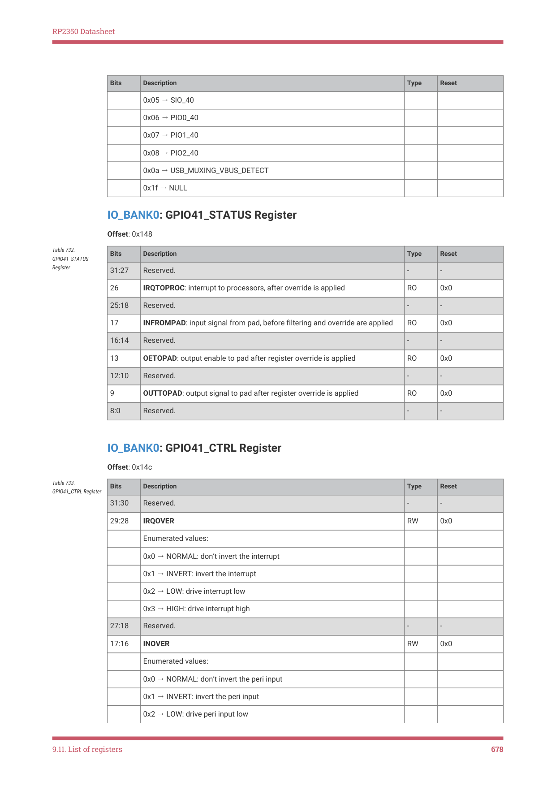

RP2350 Datasheet

Bits
Description
Type
Reset

0x05 → SIO_40

0x06 → PIO0_40

0x07 → PIO1_40

0x08 → PIO2_40

0x0a → USB_MUXING_VBUS_DETECT

0x1f → NULL

IO_BANK0: GPIO41_STATUS Register

Offset: 0x148

| Bits | Description | Type | Reset |
| --- | --- | --- | --- |
| 31:27 | Reserved. | - | - |
| 26 | IRQTOPROC: interrupt to processors, after override is applied | RO | 0x0 |
| 25:18 | Reserved. | - | - |
| 17 | INFROMPAD: input signal from pad, before filtering and override are applied | RO | 0x0 |
| 16:14 | Reserved. | - | - |
| 13 | OETOPAD: output enable to pad after register override is applied | RO | 0x0 |
| 12:10 | Reserved. | - | - |
| 9 | OUTTOPAD: output signal to pad after register override is applied | RO | 0x0 |
| 8:0 | Reserved. | - | - |

Table 732.

GPIO41_STATUS

Register

IO_BANK0: GPIO41_CTRL Register

Offset: 0x14c

Table 733.

GPIO41_CTRL Register
Bits
Description
Type
Reset

31:30
Reserved.
-
-

29:28
IRQOVER
RW
0x0

Enumerated values:

0x0 → NORMAL: don’t invert the interrupt

0x1 → INVERT: invert the interrupt

0x2 → LOW: drive interrupt low

0x3 → HIGH: drive interrupt high

27:18
Reserved.
-
-

17:16
INOVER
RW
0x0

Enumerated values:

0x0 → NORMAL: don’t invert the peri input

0x1 → INVERT: invert the peri input

0x2 → LOW: drive peri input low

9.11. List of registers
678

RP2350 Datasheet

Bits
Description
Type
Reset

0x3 → HIGH: drive peri input high

15:14
OEOVER
RW
0x0

Enumerated values:

0x0 → NORMAL: drive output enable from peripheral signal selected by

funcsel

0x1 → INVERT: drive output enable from inverse of peripheral signal selected

by funcsel

0x2 → DISABLE: disable output

0x3 → ENABLE: enable output

13:12
OUTOVER
RW
0x0

Enumerated values:

0x0 → NORMAL: drive output from peripheral signal selected by funcsel

0x1 → INVERT: drive output from inverse of peripheral signal selected by

funcsel

0x2 → LOW: drive output low

0x3 → HIGH: drive output high

11:5
Reserved.
-
-

4:0
FUNCSEL: 0-31 → selects pin function according to the gpio table

RW
0x1f

31 == NULL

Enumerated values:

0x01 → SPI1_SS_N

0x02 → UART1_RX

0x03 → I2C0_SCL

0x04 → PWM_B_8

0x05 → SIO_41

0x06 → PIO0_41

0x07 → PIO1_41

0x08 → PIO2_41

0x0a → USB_MUXING_VBUS_EN

0x1f → NULL

IO_BANK0: GPIO42_STATUS Register

Offset: 0x150

| Bits | Description | Type | Reset |
| --- | --- | --- | --- |
| 31:27 | Reserved. | - | - |
| 26 | IRQTOPROC: interrupt to processors, after override is applied | RO | 0x0 |
| 25:18 | Reserved. | - | - |

Table 734.

GPIO42_STATUS

Register

9.11. List of registers
679

RP2350 Datasheet

| Bits | Description | Type | Reset |
| --- | --- | --- | --- |
| 17 | INFROMPAD: input signal from pad, before filtering and override are applied | RO | 0x0 |
| 16:14 | Reserved. | - | - |
| 13 | OETOPAD: output enable to pad after register override is applied | RO | 0x0 |
| 12:10 | Reserved. | - | - |
| 9 | OUTTOPAD: output signal to pad after register override is applied | RO | 0x0 |
| 8:0 | Reserved. | - | - |

IO_BANK0: GPIO42_CTRL Register

Offset: 0x154

Table 735.

GPIO42_CTRL Register
Bits
Description
Type
Reset

31:30
Reserved.
-
-

29:28
IRQOVER
RW
0x0

Enumerated values:

0x0 → NORMAL: don’t invert the interrupt

0x1 → INVERT: invert the interrupt

0x2 → LOW: drive interrupt low

0x3 → HIGH: drive interrupt high

27:18
Reserved.
-
-

17:16
INOVER
RW
0x0

Enumerated values:

0x0 → NORMAL: don’t invert the peri input

0x1 → INVERT: invert the peri input

0x2 → LOW: drive peri input low

0x3 → HIGH: drive peri input high

15:14
OEOVER
RW
0x0

Enumerated values:

0x0 → NORMAL: drive output enable from peripheral signal selected by

funcsel

0x1 → INVERT: drive output enable from inverse of peripheral signal selected

by funcsel

0x2 → DISABLE: disable output

0x3 → ENABLE: enable output

13:12
OUTOVER
RW
0x0

Enumerated values:

0x0 → NORMAL: drive output from peripheral signal selected by funcsel

9.11. List of registers
680

RP2350 Datasheet

Bits
Description
Type
Reset

0x1 → INVERT: drive output from inverse of peripheral signal selected by

funcsel

0x2 → LOW: drive output low

0x3 → HIGH: drive output high

11:5
Reserved.
-
-

4:0
FUNCSEL: 0-31 → selects pin function according to the gpio table

RW
0x1f

31 == NULL

Enumerated values:

0x01 → SPI1_SCLK

0x02 → UART1_CTS

0x03 → I2C1_SDA

0x04 → PWM_A_9

0x05 → SIO_42

0x06 → PIO0_42

0x07 → PIO1_42

0x08 → PIO2_42

0x0a → USB_MUXING_OVERCURR_DETECT

0x0b → UART1_TX

0x1f → NULL

IO_BANK0: GPIO43_STATUS Register

Offset: 0x158

| Bits | Description | Type | Reset |
| --- | --- | --- | --- |
| 31:27 | Reserved. | - | - |
| 26 | IRQTOPROC: interrupt to processors, after override is applied | RO | 0x0 |
| 25:18 | Reserved. | - | - |
| 17 | INFROMPAD: input signal from pad, before filtering and override are applied | RO | 0x0 |
| 16:14 | Reserved. | - | - |
| 13 | OETOPAD: output enable to pad after register override is applied | RO | 0x0 |
| 12:10 | Reserved. | - | - |
| 9 | OUTTOPAD: output signal to pad after register override is applied | RO | 0x0 |
| 8:0 | Reserved. | - | - |

Table 736.

GPIO43_STATUS

Register

IO_BANK0: GPIO43_CTRL Register

Offset: 0x15c

9.11. List of registers
681

RP2350 Datasheet

Table 737.

GPIO43_CTRL Register
Bits
Description
Type
Reset

31:30
Reserved.
-
-

29:28
IRQOVER
RW
0x0

Enumerated values:

0x0 → NORMAL: don’t invert the interrupt

0x1 → INVERT: invert the interrupt

0x2 → LOW: drive interrupt low

0x3 → HIGH: drive interrupt high

27:18
Reserved.
-
-

17:16
INOVER
RW
0x0

Enumerated values:

0x0 → NORMAL: don’t invert the peri input

0x1 → INVERT: invert the peri input

0x2 → LOW: drive peri input low

0x3 → HIGH: drive peri input high

15:14
OEOVER
RW
0x0

Enumerated values:

0x0 → NORMAL: drive output enable from peripheral signal selected by

funcsel

0x1 → INVERT: drive output enable from inverse of peripheral signal selected

by funcsel

0x2 → DISABLE: disable output

0x3 → ENABLE: enable output

13:12
OUTOVER
RW
0x0

Enumerated values:

0x0 → NORMAL: drive output from peripheral signal selected by funcsel

0x1 → INVERT: drive output from inverse of peripheral signal selected by

funcsel

0x2 → LOW: drive output low

0x3 → HIGH: drive output high

11:5
Reserved.
-
-

4:0
FUNCSEL: 0-31 → selects pin function according to the gpio table

RW
0x1f

31 == NULL

Enumerated values:

0x01 → SPI1_TX

0x02 → UART1_RTS

0x03 → I2C1_SCL

0x04 → PWM_B_9

9.11. List of registers
682

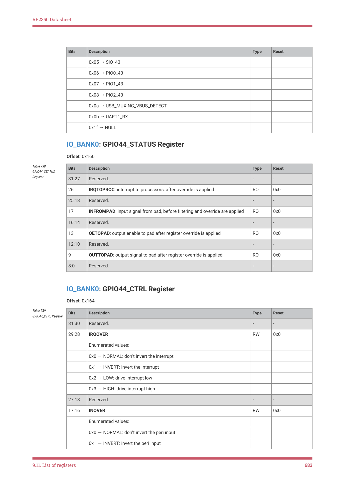

RP2350 Datasheet

Bits
Description
Type
Reset

0x05 → SIO_43

0x06 → PIO0_43

0x07 → PIO1_43

0x08 → PIO2_43

0x0a → USB_MUXING_VBUS_DETECT

0x0b → UART1_RX

0x1f → NULL

IO_BANK0: GPIO44_STATUS Register

Offset: 0x160

| Bits | Description | Type | Reset |
| --- | --- | --- | --- |
| 31:27 | Reserved. | - | - |
| 26 | IRQTOPROC: interrupt to processors, after override is applied | RO | 0x0 |
| 25:18 | Reserved. | - | - |
| 17 | INFROMPAD: input signal from pad, before filtering and override are applied | RO | 0x0 |
| 16:14 | Reserved. | - | - |
| 13 | OETOPAD: output enable to pad after register override is applied | RO | 0x0 |
| 12:10 | Reserved. | - | - |
| 9 | OUTTOPAD: output signal to pad after register override is applied | RO | 0x0 |
| 8:0 | Reserved. | - | - |

Table 738.

GPIO44_STATUS

Register

IO_BANK0: GPIO44_CTRL Register

Offset: 0x164

Table 739.

GPIO44_CTRL Register
Bits
Description
Type
Reset

31:30
Reserved.
-
-

29:28
IRQOVER
RW
0x0

Enumerated values:

0x0 → NORMAL: don’t invert the interrupt

0x1 → INVERT: invert the interrupt

0x2 → LOW: drive interrupt low

0x3 → HIGH: drive interrupt high

27:18
Reserved.
-
-

17:16
INOVER
RW
0x0

Enumerated values:

0x0 → NORMAL: don’t invert the peri input

0x1 → INVERT: invert the peri input

9.11. List of registers
683

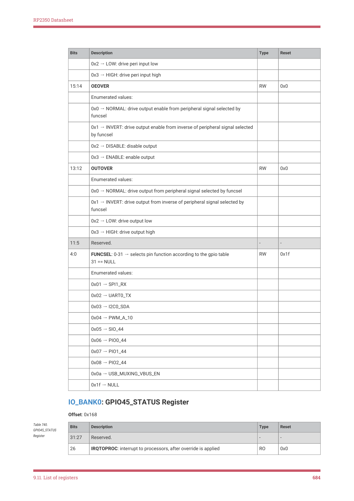

RP2350 Datasheet

Bits
Description
Type
Reset

0x2 → LOW: drive peri input low

0x3 → HIGH: drive peri input high

15:14
OEOVER
RW
0x0

Enumerated values:

0x0 → NORMAL: drive output enable from peripheral signal selected by

funcsel

0x1 → INVERT: drive output enable from inverse of peripheral signal selected

by funcsel

0x2 → DISABLE: disable output

0x3 → ENABLE: enable output

13:12
OUTOVER
RW
0x0

Enumerated values:

0x0 → NORMAL: drive output from peripheral signal selected by funcsel

0x1 → INVERT: drive output from inverse of peripheral signal selected by

funcsel

0x2 → LOW: drive output low

0x3 → HIGH: drive output high

11:5
Reserved.
-
-

4:0
FUNCSEL: 0-31 → selects pin function according to the gpio table

RW
0x1f

31 == NULL

Enumerated values:

0x01 → SPI1_RX

0x02 → UART0_TX

0x03 → I2C0_SDA

0x04 → PWM_A_10

0x05 → SIO_44

0x06 → PIO0_44

0x07 → PIO1_44

0x08 → PIO2_44

0x0a → USB_MUXING_VBUS_EN

0x1f → NULL

IO_BANK0: GPIO45_STATUS Register

Offset: 0x168

| Bits | Description | Type | Reset |
| --- | --- | --- | --- |
| 31:27 | Reserved. | - | - |
| 26 | IRQTOPROC: interrupt to processors, after override is applied | RO | 0x0 |

Table 740.

GPIO45_STATUS

Register

9.11. List of registers
684

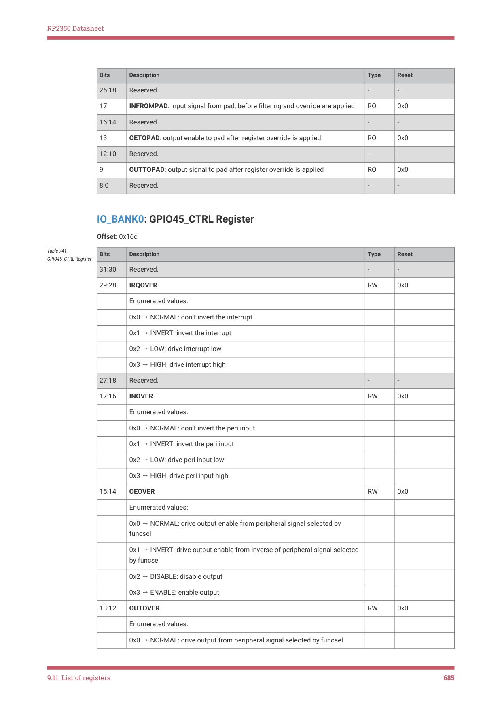

RP2350 Datasheet

| Bits | Description | Type | Reset |
| --- | --- | --- | --- |
| 25:18 | Reserved. | - | - |
| 17 | INFROMPAD: input signal from pad, before filtering and override are applied | RO | 0x0 |
| 16:14 | Reserved. | - | - |
| 13 | OETOPAD: output enable to pad after register override is applied | RO | 0x0 |
| 12:10 | Reserved. | - | - |
| 9 | OUTTOPAD: output signal to pad after register override is applied | RO | 0x0 |
| 8:0 | Reserved. | - | - |

IO_BANK0: GPIO45_CTRL Register

Offset: 0x16c

Table 741.

GPIO45_CTRL Register
Bits
Description
Type
Reset

31:30
Reserved.
-
-

29:28
IRQOVER
RW
0x0

Enumerated values:

0x0 → NORMAL: don’t invert the interrupt

0x1 → INVERT: invert the interrupt

0x2 → LOW: drive interrupt low

0x3 → HIGH: drive interrupt high

27:18
Reserved.
-
-

17:16
INOVER
RW
0x0

Enumerated values:

0x0 → NORMAL: don’t invert the peri input

0x1 → INVERT: invert the peri input

0x2 → LOW: drive peri input low

0x3 → HIGH: drive peri input high

15:14
OEOVER
RW
0x0

Enumerated values:

0x0 → NORMAL: drive output enable from peripheral signal selected by

funcsel

0x1 → INVERT: drive output enable from inverse of peripheral signal selected

by funcsel

0x2 → DISABLE: disable output

0x3 → ENABLE: enable output

13:12
OUTOVER
RW
0x0

Enumerated values:

0x0 → NORMAL: drive output from peripheral signal selected by funcsel

9.11. List of registers
685

RP2350 Datasheet

Bits
Description
Type
Reset

0x1 → INVERT: drive output from inverse of peripheral signal selected by

funcsel

0x2 → LOW: drive output low

0x3 → HIGH: drive output high

11:5
Reserved.
-
-

4:0
FUNCSEL: 0-31 → selects pin function according to the gpio table

RW
0x1f

31 == NULL

Enumerated values:

0x01 → SPI1_SS_N

0x02 → UART0_RX

0x03 → I2C0_SCL

0x04 → PWM_B_10

0x05 → SIO_45

0x06 → PIO0_45

0x07 → PIO1_45

0x08 → PIO2_45

0x0a → USB_MUXING_OVERCURR_DETECT

0x1f → NULL

IO_BANK0: GPIO46_STATUS Register

Offset: 0x170

| Bits | Description | Type | Reset |
| --- | --- | --- | --- |
| 31:27 | Reserved. | - | - |
| 26 | IRQTOPROC: interrupt to processors, after override is applied | RO | 0x0 |
| 25:18 | Reserved. | - | - |
| 17 | INFROMPAD: input signal from pad, before filtering and override are applied | RO | 0x0 |
| 16:14 | Reserved. | - | - |
| 13 | OETOPAD: output enable to pad after register override is applied | RO | 0x0 |
| 12:10 | Reserved. | - | - |
| 9 | OUTTOPAD: output signal to pad after register override is applied | RO | 0x0 |
| 8:0 | Reserved. | - | - |

Table 742.

GPIO46_STATUS

Register

IO_BANK0: GPIO46_CTRL Register

Offset: 0x174

| Bits | Description | Type | Reset |
| --- | --- | --- | --- |
| 31:30 | Reserved. | - | - |

Table 743.

9.11. List of registers
686

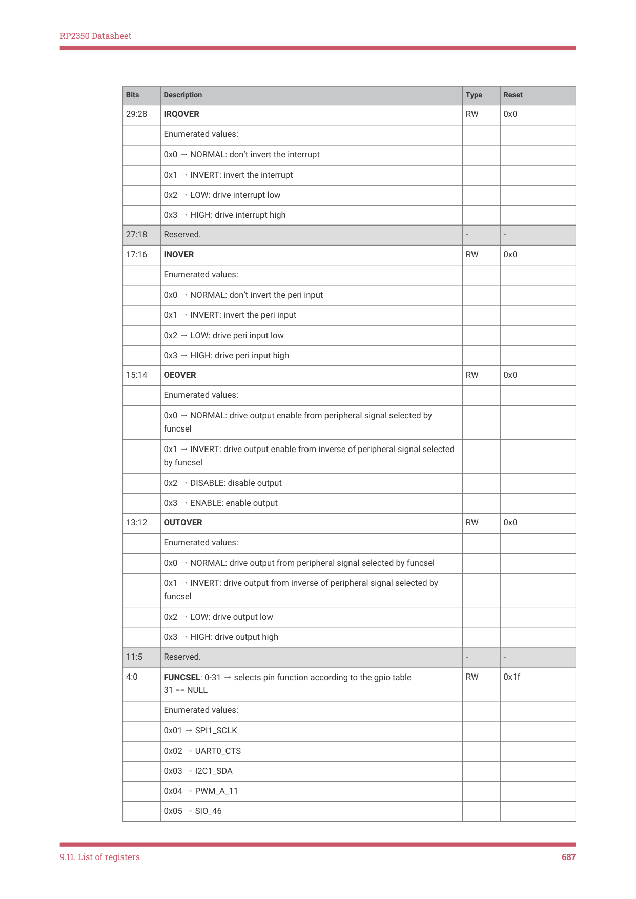

RP2350 Datasheet

Bits
Description
Type
Reset

29:28
IRQOVER
RW
0x0

Enumerated values:

0x0 → NORMAL: don’t invert the interrupt

0x1 → INVERT: invert the interrupt

0x2 → LOW: drive interrupt low

0x3 → HIGH: drive interrupt high

27:18
Reserved.
-
-

17:16
INOVER
RW
0x0

Enumerated values:

0x0 → NORMAL: don’t invert the peri input

0x1 → INVERT: invert the peri input

0x2 → LOW: drive peri input low

0x3 → HIGH: drive peri input high

15:14
OEOVER
RW
0x0

Enumerated values:

0x0 → NORMAL: drive output enable from peripheral signal selected by

funcsel

0x1 → INVERT: drive output enable from inverse of peripheral signal selected

by funcsel

0x2 → DISABLE: disable output

0x3 → ENABLE: enable output

13:12
OUTOVER
RW
0x0

Enumerated values:

0x0 → NORMAL: drive output from peripheral signal selected by funcsel

0x1 → INVERT: drive output from inverse of peripheral signal selected by

funcsel

0x2 → LOW: drive output low

0x3 → HIGH: drive output high

11:5
Reserved.
-
-

4:0
FUNCSEL: 0-31 → selects pin function according to the gpio table

RW
0x1f

31 == NULL

Enumerated values:

0x01 → SPI1_SCLK

0x02 → UART0_CTS

0x03 → I2C1_SDA

0x04 → PWM_A_11

0x05 → SIO_46

9.11. List of registers
687

RP2350 Datasheet

Bits
Description
Type
Reset

0x06 → PIO0_46

0x07 → PIO1_46

0x08 → PIO2_46

0x0a → USB_MUXING_VBUS_DETECT

0x0b → UART0_TX

0x1f → NULL

IO_BANK0: GPIO47_STATUS Register

Offset: 0x178

| Bits | Description | Type | Reset |
| --- | --- | --- | --- |
| 31:27 | Reserved. | - | - |
| 26 | IRQTOPROC: interrupt to processors, after override is applied | RO | 0x0 |
| 25:18 | Reserved. | - | - |
| 17 | INFROMPAD: input signal from pad, before filtering and override are applied | RO | 0x0 |
| 16:14 | Reserved. | - | - |
| 13 | OETOPAD: output enable to pad after register override is applied | RO | 0x0 |
| 12:10 | Reserved. | - | - |
| 9 | OUTTOPAD: output signal to pad after register override is applied | RO | 0x0 |
| 8:0 | Reserved. | - | - |

Table 744.

GPIO47_STATUS

Register

IO_BANK0: GPIO47_CTRL Register

Offset: 0x17c

Table 745.

GPIO47_CTRL Register
Bits
Description
Type
Reset

31:30
Reserved.
-
-

29:28
IRQOVER
RW
0x0

Enumerated values:

0x0 → NORMAL: don’t invert the interrupt

0x1 → INVERT: invert the interrupt

0x2 → LOW: drive interrupt low

0x3 → HIGH: drive interrupt high

27:18
Reserved.
-
-

17:16
INOVER
RW
0x0

Enumerated values:

0x0 → NORMAL: don’t invert the peri input

0x1 → INVERT: invert the peri input

0x2 → LOW: drive peri input low

9.11. List of registers
688

RP2350 Datasheet

Bits
Description
Type
Reset

0x3 → HIGH: drive peri input high

15:14
OEOVER
RW
0x0

Enumerated values:

0x0 → NORMAL: drive output enable from peripheral signal selected by

funcsel

0x1 → INVERT: drive output enable from inverse of peripheral signal selected

by funcsel

0x2 → DISABLE: disable output

0x3 → ENABLE: enable output

13:12
OUTOVER
RW
0x0

Enumerated values:

0x0 → NORMAL: drive output from peripheral signal selected by funcsel

0x1 → INVERT: drive output from inverse of peripheral signal selected by

funcsel

0x2 → LOW: drive output low

0x3 → HIGH: drive output high

11:5
Reserved.
-
-

4:0
FUNCSEL: 0-31 → selects pin function according to the gpio table

RW
0x1f

31 == NULL

Enumerated values:

0x01 → SPI1_TX

0x02 → UART0_RTS

0x03 → I2C1_SCL

0x04 → PWM_B_11

0x05 → SIO_47

0x06 → PIO0_47

0x07 → PIO1_47

0x08 → PIO2_47

0x09 → XIP_SS_N_1

0x0a → USB_MUXING_VBUS_EN

0x0b → UART0_RX

0x1f → NULL

IO_BANK0: IRQSUMMARY_PROC0_SECURE0 Register

Offset: 0x200

| Bits | Description | Type | Reset |
| --- | --- | --- | --- |
| 31 | GPIO31 | RO | 0x0 |

Table 746.

IRQSUMMARY_PROC0

_SECURE0 Register

9.11. List of registers
689

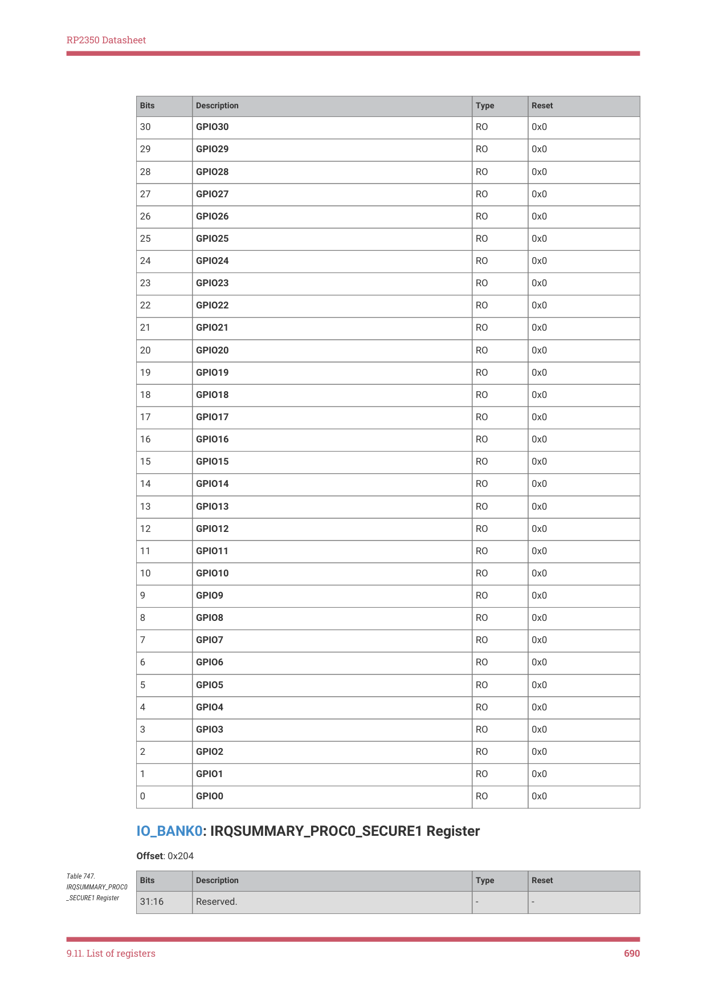

RP2350 Datasheet

| Bits | Description | Type | Reset |
| --- | --- | --- | --- |
| 30 | GPIO30 | RO | 0x0 |
| 29 | GPIO29 | RO | 0x0 |
| 28 | GPIO28 | RO | 0x0 |
| 27 | GPIO27 | RO | 0x0 |
| 26 | GPIO26 | RO | 0x0 |
| 25 | GPIO25 | RO | 0x0 |
| 24 | GPIO24 | RO | 0x0 |
| 23 | GPIO23 | RO | 0x0 |
| 22 | GPIO22 | RO | 0x0 |
| 21 | GPIO21 | RO | 0x0 |
| 20 | GPIO20 | RO | 0x0 |
| 19 | GPIO19 | RO | 0x0 |
| 18 | GPIO18 | RO | 0x0 |
| 17 | GPIO17 | RO | 0x0 |
| 16 | GPIO16 | RO | 0x0 |
| 15 | GPIO15 | RO | 0x0 |
| 14 | GPIO14 | RO | 0x0 |
| 13 | GPIO13 | RO | 0x0 |
| 12 | GPIO12 | RO | 0x0 |
| 11 | GPIO11 | RO | 0x0 |
| 10 | GPIO10 | RO | 0x0 |
| 9 | GPIO9 | RO | 0x0 |
| 8 | GPIO8 | RO | 0x0 |
| 7 | GPIO7 | RO | 0x0 |
| 6 | GPIO6 | RO | 0x0 |
| 5 | GPIO5 | RO | 0x0 |
| 4 | GPIO4 | RO | 0x0 |
| 3 | GPIO3 | RO | 0x0 |
| 2 | GPIO2 | RO | 0x0 |
| 1 | GPIO1 | RO | 0x0 |
| 0 | GPIO0 | RO | 0x0 |

IO_BANK0: IRQSUMMARY_PROC0_SECURE1 Register

Offset: 0x204

| Bits | Description | Type | Reset |
| --- | --- | --- | --- |
| 31:16 | Reserved. | - | - |

Table 747.

IRQSUMMARY_PROC0

_SECURE1 Register

9.11. List of registers
690

RP2350 Datasheet

| Bits | Description | Type | Reset |
| --- | --- | --- | --- |
| 15 | GPIO47 | RO | 0x0 |
| 14 | GPIO46 | RO | 0x0 |
| 13 | GPIO45 | RO | 0x0 |
| 12 | GPIO44 | RO | 0x0 |
| 11 | GPIO43 | RO | 0x0 |
| 10 | GPIO42 | RO | 0x0 |
| 9 | GPIO41 | RO | 0x0 |
| 8 | GPIO40 | RO | 0x0 |
| 7 | GPIO39 | RO | 0x0 |
| 6 | GPIO38 | RO | 0x0 |
| 5 | GPIO37 | RO | 0x0 |
| 4 | GPIO36 | RO | 0x0 |
| 3 | GPIO35 | RO | 0x0 |
| 2 | GPIO34 | RO | 0x0 |
| 1 | GPIO33 | RO | 0x0 |
| 0 | GPIO32 | RO | 0x0 |

IO_BANK0: IRQSUMMARY_PROC0_NONSECURE0 Register

Offset: 0x208

| Bits | Description | Type | Reset |
| --- | --- | --- | --- |
| 31 | GPIO31 | RO | 0x0 |
| 30 | GPIO30 | RO | 0x0 |
| 29 | GPIO29 | RO | 0x0 |
| 28 | GPIO28 | RO | 0x0 |
| 27 | GPIO27 | RO | 0x0 |
| 26 | GPIO26 | RO | 0x0 |
| 25 | GPIO25 | RO | 0x0 |
| 24 | GPIO24 | RO | 0x0 |
| 23 | GPIO23 | RO | 0x0 |
| 22 | GPIO22 | RO | 0x0 |
| 21 | GPIO21 | RO | 0x0 |
| 20 | GPIO20 | RO | 0x0 |
| 19 | GPIO19 | RO | 0x0 |
| 18 | GPIO18 | RO | 0x0 |
| 17 | GPIO17 | RO | 0x0 |
| 16 | GPIO16 | RO | 0x0 |

Table 748.

IRQSUMMARY_PROC0

_NONSECURE0

Register

9.11. List of registers
691

RP2350 Datasheet

| Bits | Description | Type | Reset |
| --- | --- | --- | --- |
| 15 | GPIO15 | RO | 0x0 |
| 14 | GPIO14 | RO | 0x0 |
| 13 | GPIO13 | RO | 0x0 |
| 12 | GPIO12 | RO | 0x0 |
| 11 | GPIO11 | RO | 0x0 |
| 10 | GPIO10 | RO | 0x0 |
| 9 | GPIO9 | RO | 0x0 |
| 8 | GPIO8 | RO | 0x0 |
| 7 | GPIO7 | RO | 0x0 |
| 6 | GPIO6 | RO | 0x0 |
| 5 | GPIO5 | RO | 0x0 |
| 4 | GPIO4 | RO | 0x0 |
| 3 | GPIO3 | RO | 0x0 |
| 2 | GPIO2 | RO | 0x0 |
| 1 | GPIO1 | RO | 0x0 |
| 0 | GPIO0 | RO | 0x0 |

IO_BANK0: IRQSUMMARY_PROC0_NONSECURE1 Register

Offset: 0x20c

| Bits | Description | Type | Reset |
| --- | --- | --- | --- |
| 31:16 | Reserved. | - | - |
| 15 | GPIO47 | RO | 0x0 |
| 14 | GPIO46 | RO | 0x0 |
| 13 | GPIO45 | RO | 0x0 |
| 12 | GPIO44 | RO | 0x0 |
| 11 | GPIO43 | RO | 0x0 |
| 10 | GPIO42 | RO | 0x0 |
| 9 | GPIO41 | RO | 0x0 |
| 8 | GPIO40 | RO | 0x0 |
| 7 | GPIO39 | RO | 0x0 |
| 6 | GPIO38 | RO | 0x0 |
| 5 | GPIO37 | RO | 0x0 |
| 4 | GPIO36 | RO | 0x0 |
| 3 | GPIO35 | RO | 0x0 |
| 2 | GPIO34 | RO | 0x0 |
| 1 | GPIO33 | RO | 0x0 |

Table 749.

IRQSUMMARY_PROC0

_NONSECURE1

Register

9.11. List of registers
692

RP2350 Datasheet

| Bits | Description | Type | Reset |
| --- | --- | --- | --- |
| 0 | GPIO32 | RO | 0x0 |

IO_BANK0: IRQSUMMARY_PROC1_SECURE0 Register

Offset: 0x210

| Bits | Description | Type | Reset |
| --- | --- | --- | --- |
| 31 | GPIO31 | RO | 0x0 |
| 30 | GPIO30 | RO | 0x0 |
| 29 | GPIO29 | RO | 0x0 |
| 28 | GPIO28 | RO | 0x0 |
| 27 | GPIO27 | RO | 0x0 |
| 26 | GPIO26 | RO | 0x0 |
| 25 | GPIO25 | RO | 0x0 |
| 24 | GPIO24 | RO | 0x0 |
| 23 | GPIO23 | RO | 0x0 |
| 22 | GPIO22 | RO | 0x0 |
| 21 | GPIO21 | RO | 0x0 |
| 20 | GPIO20 | RO | 0x0 |
| 19 | GPIO19 | RO | 0x0 |
| 18 | GPIO18 | RO | 0x0 |
| 17 | GPIO17 | RO | 0x0 |
| 16 | GPIO16 | RO | 0x0 |
| 15 | GPIO15 | RO | 0x0 |
| 14 | GPIO14 | RO | 0x0 |
| 13 | GPIO13 | RO | 0x0 |
| 12 | GPIO12 | RO | 0x0 |
| 11 | GPIO11 | RO | 0x0 |
| 10 | GPIO10 | RO | 0x0 |
| 9 | GPIO9 | RO | 0x0 |
| 8 | GPIO8 | RO | 0x0 |
| 7 | GPIO7 | RO | 0x0 |
| 6 | GPIO6 | RO | 0x0 |
| 5 | GPIO5 | RO | 0x0 |
| 4 | GPIO4 | RO | 0x0 |
| 3 | GPIO3 | RO | 0x0 |
| 2 | GPIO2 | RO | 0x0 |
| 1 | GPIO1 | RO | 0x0 |

Table 750.

IRQSUMMARY_PROC1

_SECURE0 Register

9.11. List of registers
693

RP2350 Datasheet

| Bits | Description | Type | Reset |
| --- | --- | --- | --- |
| 0 | GPIO0 | RO | 0x0 |

IO_BANK0: IRQSUMMARY_PROC1_SECURE1 Register

Offset: 0x214

| Bits | Description | Type | Reset |
| --- | --- | --- | --- |
| 31:16 | Reserved. | - | - |
| 15 | GPIO47 | RO | 0x0 |
| 14 | GPIO46 | RO | 0x0 |
| 13 | GPIO45 | RO | 0x0 |
| 12 | GPIO44 | RO | 0x0 |
| 11 | GPIO43 | RO | 0x0 |
| 10 | GPIO42 | RO | 0x0 |
| 9 | GPIO41 | RO | 0x0 |
| 8 | GPIO40 | RO | 0x0 |
| 7 | GPIO39 | RO | 0x0 |
| 6 | GPIO38 | RO | 0x0 |
| 5 | GPIO37 | RO | 0x0 |
| 4 | GPIO36 | RO | 0x0 |
| 3 | GPIO35 | RO | 0x0 |
| 2 | GPIO34 | RO | 0x0 |
| 1 | GPIO33 | RO | 0x0 |
| 0 | GPIO32 | RO | 0x0 |

Table 751.

IRQSUMMARY_PROC1

_SECURE1 Register

IO_BANK0: IRQSUMMARY_PROC1_NONSECURE0 Register

Offset: 0x218

| Bits | Description | Type | Reset |
| --- | --- | --- | --- |
| 31 | GPIO31 | RO | 0x0 |
| 30 | GPIO30 | RO | 0x0 |
| 29 | GPIO29 | RO | 0x0 |
| 28 | GPIO28 | RO | 0x0 |
| 27 | GPIO27 | RO | 0x0 |
| 26 | GPIO26 | RO | 0x0 |
| 25 | GPIO25 | RO | 0x0 |
| 24 | GPIO24 | RO | 0x0 |
| 23 | GPIO23 | RO | 0x0 |
| 22 | GPIO22 | RO | 0x0 |

Table 752.

IRQSUMMARY_PROC1

_NONSECURE0

Register

9.11. List of registers
694

RP2350 Datasheet

| Bits | Description | Type | Reset |
| --- | --- | --- | --- |
| 21 | GPIO21 | RO | 0x0 |
| 20 | GPIO20 | RO | 0x0 |
| 19 | GPIO19 | RO | 0x0 |
| 18 | GPIO18 | RO | 0x0 |
| 17 | GPIO17 | RO | 0x0 |
| 16 | GPIO16 | RO | 0x0 |
| 15 | GPIO15 | RO | 0x0 |
| 14 | GPIO14 | RO | 0x0 |
| 13 | GPIO13 | RO | 0x0 |
| 12 | GPIO12 | RO | 0x0 |
| 11 | GPIO11 | RO | 0x0 |
| 10 | GPIO10 | RO | 0x0 |
| 9 | GPIO9 | RO | 0x0 |
| 8 | GPIO8 | RO | 0x0 |
| 7 | GPIO7 | RO | 0x0 |
| 6 | GPIO6 | RO | 0x0 |
| 5 | GPIO5 | RO | 0x0 |
| 4 | GPIO4 | RO | 0x0 |
| 3 | GPIO3 | RO | 0x0 |
| 2 | GPIO2 | RO | 0x0 |
| 1 | GPIO1 | RO | 0x0 |
| 0 | GPIO0 | RO | 0x0 |

IO_BANK0: IRQSUMMARY_PROC1_NONSECURE1 Register

Offset: 0x21c

| Bits | Description | Type | Reset |
| --- | --- | --- | --- |
| 31:16 | Reserved. | - | - |
| 15 | GPIO47 | RO | 0x0 |
| 14 | GPIO46 | RO | 0x0 |
| 13 | GPIO45 | RO | 0x0 |
| 12 | GPIO44 | RO | 0x0 |
| 11 | GPIO43 | RO | 0x0 |
| 10 | GPIO42 | RO | 0x0 |
| 9 | GPIO41 | RO | 0x0 |
| 8 | GPIO40 | RO | 0x0 |
| 7 | GPIO39 | RO | 0x0 |

Table 753.

IRQSUMMARY_PROC1

_NONSECURE1

Register

9.11. List of registers
695

RP2350 Datasheet

| Bits | Description | Type | Reset |
| --- | --- | --- | --- |
| 6 | GPIO38 | RO | 0x0 |
| 5 | GPIO37 | RO | 0x0 |
| 4 | GPIO36 | RO | 0x0 |
| 3 | GPIO35 | RO | 0x0 |
| 2 | GPIO34 | RO | 0x0 |
| 1 | GPIO33 | RO | 0x0 |
| 0 | GPIO32 | RO | 0x0 |

IO_BANK0: IRQSUMMARY_COMA_WAKE_SECURE0 Register

Offset: 0x220

| Bits | Description | Type | Reset |
| --- | --- | --- | --- |
| 31 | GPIO31 | RO | 0x0 |
| 30 | GPIO30 | RO | 0x0 |
| 29 | GPIO29 | RO | 0x0 |
| 28 | GPIO28 | RO | 0x0 |
| 27 | GPIO27 | RO | 0x0 |
| 26 | GPIO26 | RO | 0x0 |
| 25 | GPIO25 | RO | 0x0 |
| 24 | GPIO24 | RO | 0x0 |
| 23 | GPIO23 | RO | 0x0 |
| 22 | GPIO22 | RO | 0x0 |
| 21 | GPIO21 | RO | 0x0 |
| 20 | GPIO20 | RO | 0x0 |
| 19 | GPIO19 | RO | 0x0 |
| 18 | GPIO18 | RO | 0x0 |
| 17 | GPIO17 | RO | 0x0 |
| 16 | GPIO16 | RO | 0x0 |
| 15 | GPIO15 | RO | 0x0 |
| 14 | GPIO14 | RO | 0x0 |
| 13 | GPIO13 | RO | 0x0 |
| 12 | GPIO12 | RO | 0x0 |
| 11 | GPIO11 | RO | 0x0 |
| 10 | GPIO10 | RO | 0x0 |
| 9 | GPIO9 | RO | 0x0 |
| 8 | GPIO8 | RO | 0x0 |
| 7 | GPIO7 | RO | 0x0 |

Table 754.

IRQSUMMARY_COMA_

WAKE_SECURE0

Register

9.11. List of registers
696

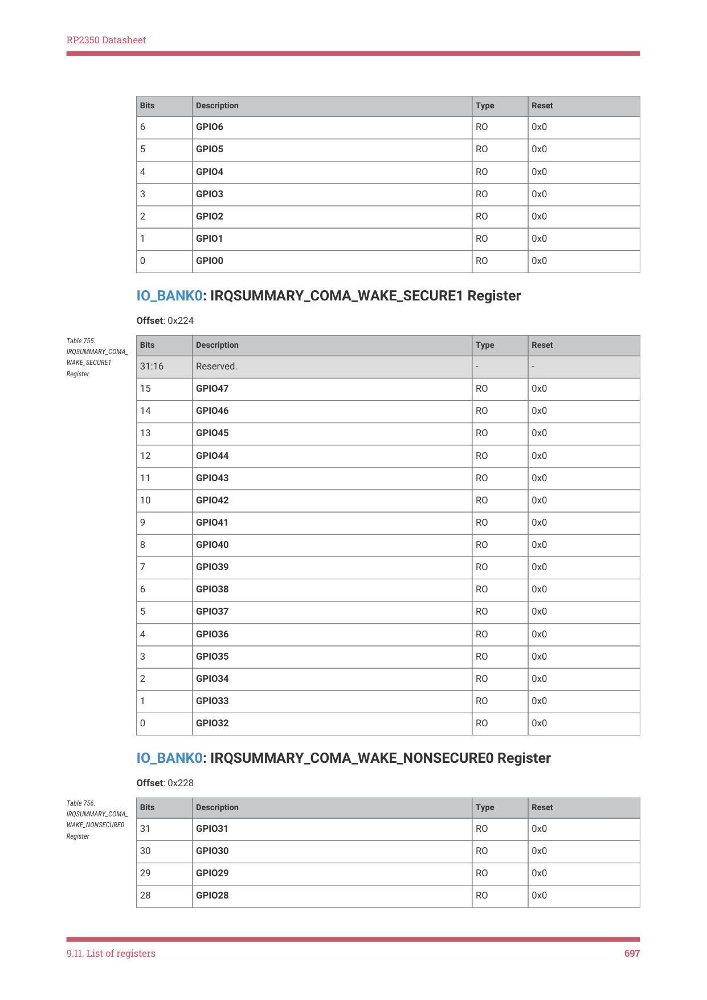

RP2350 Datasheet

| Bits | Description | Type | Reset |
| --- | --- | --- | --- |
| 6 | GPIO6 | RO | 0x0 |
| 5 | GPIO5 | RO | 0x0 |
| 4 | GPIO4 | RO | 0x0 |
| 3 | GPIO3 | RO | 0x0 |
| 2 | GPIO2 | RO | 0x0 |
| 1 | GPIO1 | RO | 0x0 |
| 0 | GPIO0 | RO | 0x0 |

IO_BANK0: IRQSUMMARY_COMA_WAKE_SECURE1 Register

Offset: 0x224

| Bits | Description | Type | Reset |
| --- | --- | --- | --- |
| 31:16 | Reserved. | - | - |
| 15 | GPIO47 | RO | 0x0 |
| 14 | GPIO46 | RO | 0x0 |
| 13 | GPIO45 | RO | 0x0 |
| 12 | GPIO44 | RO | 0x0 |
| 11 | GPIO43 | RO | 0x0 |
| 10 | GPIO42 | RO | 0x0 |
| 9 | GPIO41 | RO | 0x0 |
| 8 | GPIO40 | RO | 0x0 |
| 7 | GPIO39 | RO | 0x0 |
| 6 | GPIO38 | RO | 0x0 |
| 5 | GPIO37 | RO | 0x0 |
| 4 | GPIO36 | RO | 0x0 |
| 3 | GPIO35 | RO | 0x0 |
| 2 | GPIO34 | RO | 0x0 |
| 1 | GPIO33 | RO | 0x0 |
| 0 | GPIO32 | RO | 0x0 |

Table 755.

IRQSUMMARY_COMA_

WAKE_SECURE1

Register

IO_BANK0: IRQSUMMARY_COMA_WAKE_NONSECURE0 Register

Offset: 0x228

| Bits | Description | Type | Reset |
| --- | --- | --- | --- |
| 31 | GPIO31 | RO | 0x0 |
| 30 | GPIO30 | RO | 0x0 |
| 29 | GPIO29 | RO | 0x0 |
| 28 | GPIO28 | RO | 0x0 |

Table 756.

IRQSUMMARY_COMA_

WAKE_NONSECURE0

Register

9.11. List of registers
697

RP2350 Datasheet

| Bits | Description | Type | Reset |
| --- | --- | --- | --- |
| 27 | GPIO27 | RO | 0x0 |
| 26 | GPIO26 | RO | 0x0 |
| 25 | GPIO25 | RO | 0x0 |
| 24 | GPIO24 | RO | 0x0 |
| 23 | GPIO23 | RO | 0x0 |
| 22 | GPIO22 | RO | 0x0 |
| 21 | GPIO21 | RO | 0x0 |
| 20 | GPIO20 | RO | 0x0 |
| 19 | GPIO19 | RO | 0x0 |
| 18 | GPIO18 | RO | 0x0 |
| 17 | GPIO17 | RO | 0x0 |
| 16 | GPIO16 | RO | 0x0 |
| 15 | GPIO15 | RO | 0x0 |
| 14 | GPIO14 | RO | 0x0 |
| 13 | GPIO13 | RO | 0x0 |
| 12 | GPIO12 | RO | 0x0 |
| 11 | GPIO11 | RO | 0x0 |
| 10 | GPIO10 | RO | 0x0 |
| 9 | GPIO9 | RO | 0x0 |
| 8 | GPIO8 | RO | 0x0 |
| 7 | GPIO7 | RO | 0x0 |
| 6 | GPIO6 | RO | 0x0 |
| 5 | GPIO5 | RO | 0x0 |
| 4 | GPIO4 | RO | 0x0 |
| 3 | GPIO3 | RO | 0x0 |
| 2 | GPIO2 | RO | 0x0 |
| 1 | GPIO1 | RO | 0x0 |
| 0 | GPIO0 | RO | 0x0 |

IO_BANK0: IRQSUMMARY_COMA_WAKE_NONSECURE1 Register

Offset: 0x22c

| Bits | Description | Type | Reset |
| --- | --- | --- | --- |
| 31:16 | Reserved. | - | - |
| 15 | GPIO47 | RO | 0x0 |
| 14 | GPIO46 | RO | 0x0 |
| 13 | GPIO45 | RO | 0x0 |

Table 757.

IRQSUMMARY_COMA_

WAKE_NONSECURE1

Register

9.11. List of registers
698

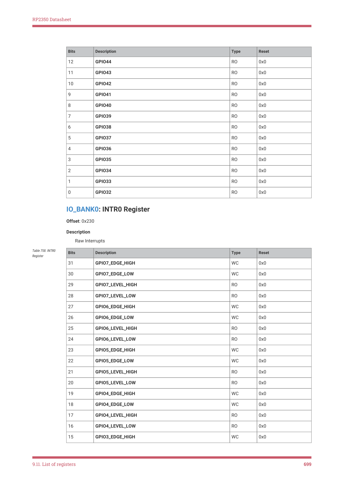

RP2350 Datasheet

| Bits | Description | Type | Reset |
| --- | --- | --- | --- |
| 12 | GPIO44 | RO | 0x0 |
| 11 | GPIO43 | RO | 0x0 |
| 10 | GPIO42 | RO | 0x0 |
| 9 | GPIO41 | RO | 0x0 |
| 8 | GPIO40 | RO | 0x0 |
| 7 | GPIO39 | RO | 0x0 |
| 6 | GPIO38 | RO | 0x0 |
| 5 | GPIO37 | RO | 0x0 |
| 4 | GPIO36 | RO | 0x0 |
| 3 | GPIO35 | RO | 0x0 |
| 2 | GPIO34 | RO | 0x0 |
| 1 | GPIO33 | RO | 0x0 |
| 0 | GPIO32 | RO | 0x0 |

IO_BANK0: INTR0 Register

Offset: 0x230

Description

Raw Interrupts

| Bits | Description | Type | Reset |
| --- | --- | --- | --- |
| 31 | GPIO7_EDGE_HIGH | WC | 0x0 |
| 30 | GPIO7_EDGE_LOW | WC | 0x0 |
| 29 | GPIO7_LEVEL_HIGH | RO | 0x0 |
| 28 | GPIO7_LEVEL_LOW | RO | 0x0 |
| 27 | GPIO6_EDGE_HIGH | WC | 0x0 |
| 26 | GPIO6_EDGE_LOW | WC | 0x0 |
| 25 | GPIO6_LEVEL_HIGH | RO | 0x0 |
| 24 | GPIO6_LEVEL_LOW | RO | 0x0 |
| 23 | GPIO5_EDGE_HIGH | WC | 0x0 |
| 22 | GPIO5_EDGE_LOW | WC | 0x0 |
| 21 | GPIO5_LEVEL_HIGH | RO | 0x0 |
| 20 | GPIO5_LEVEL_LOW | RO | 0x0 |
| 19 | GPIO4_EDGE_HIGH | WC | 0x0 |
| 18 | GPIO4_EDGE_LOW | WC | 0x0 |
| 17 | GPIO4_LEVEL_HIGH | RO | 0x0 |
| 16 | GPIO4_LEVEL_LOW | RO | 0x0 |
| 15 | GPIO3_EDGE_HIGH | WC | 0x0 |

Table 758. INTR0

9.11. List of registers
699

RP2350 Datasheet

| Bits | Description | Type | Reset |
| --- | --- | --- | --- |
| 14 | GPIO3_EDGE_LOW | WC | 0x0 |
| 13 | GPIO3_LEVEL_HIGH | RO | 0x0 |
| 12 | GPIO3_LEVEL_LOW | RO | 0x0 |
| 11 | GPIO2_EDGE_HIGH | WC | 0x0 |
| 10 | GPIO2_EDGE_LOW | WC | 0x0 |
| 9 | GPIO2_LEVEL_HIGH | RO | 0x0 |
| 8 | GPIO2_LEVEL_LOW | RO | 0x0 |
| 7 | GPIO1_EDGE_HIGH | WC | 0x0 |
| 6 | GPIO1_EDGE_LOW | WC | 0x0 |
| 5 | GPIO1_LEVEL_HIGH | RO | 0x0 |
| 4 | GPIO1_LEVEL_LOW | RO | 0x0 |
| 3 | GPIO0_EDGE_HIGH | WC | 0x0 |
| 2 | GPIO0_EDGE_LOW | WC | 0x0 |
| 1 | GPIO0_LEVEL_HIGH | RO | 0x0 |
| 0 | GPIO0_LEVEL_LOW | RO | 0x0 |

IO_BANK0: INTR1 Register

Offset: 0x234

Description

Raw Interrupts

| Bits | Description | Type | Reset |
| --- | --- | --- | --- |
| 31 | GPIO15_EDGE_HIGH | WC | 0x0 |
| 30 | GPIO15_EDGE_LOW | WC | 0x0 |
| 29 | GPIO15_LEVEL_HIGH | RO | 0x0 |
| 28 | GPIO15_LEVEL_LOW | RO | 0x0 |
| 27 | GPIO14_EDGE_HIGH | WC | 0x0 |
| 26 | GPIO14_EDGE_LOW | WC | 0x0 |
| 25 | GPIO14_LEVEL_HIGH | RO | 0x0 |
| 24 | GPIO14_LEVEL_LOW | RO | 0x0 |
| 23 | GPIO13_EDGE_HIGH | WC | 0x0 |
| 22 | GPIO13_EDGE_LOW | WC | 0x0 |
| 21 | GPIO13_LEVEL_HIGH | RO | 0x0 |
| 20 | GPIO13_LEVEL_LOW | RO | 0x0 |
| 19 | GPIO12_EDGE_HIGH | WC | 0x0 |
| 18 | GPIO12_EDGE_LOW | WC | 0x0 |
| 17 | GPIO12_LEVEL_HIGH | RO | 0x0 |

Table 759. INTR1

9.11. List of registers
700

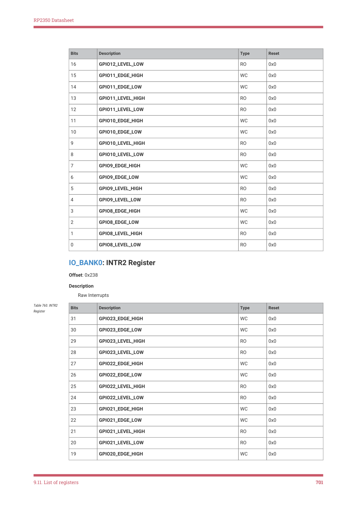

RP2350 Datasheet

| Bits | Description | Type | Reset |
| --- | --- | --- | --- |
| 16 | GPIO12_LEVEL_LOW | RO | 0x0 |
| 15 | GPIO11_EDGE_HIGH | WC | 0x0 |
| 14 | GPIO11_EDGE_LOW | WC | 0x0 |
| 13 | GPIO11_LEVEL_HIGH | RO | 0x0 |
| 12 | GPIO11_LEVEL_LOW | RO | 0x0 |
| 11 | GPIO10_EDGE_HIGH | WC | 0x0 |
| 10 | GPIO10_EDGE_LOW | WC | 0x0 |
| 9 | GPIO10_LEVEL_HIGH | RO | 0x0 |
| 8 | GPIO10_LEVEL_LOW | RO | 0x0 |
| 7 | GPIO9_EDGE_HIGH | WC | 0x0 |
| 6 | GPIO9_EDGE_LOW | WC | 0x0 |
| 5 | GPIO9_LEVEL_HIGH | RO | 0x0 |
| 4 | GPIO9_LEVEL_LOW | RO | 0x0 |
| 3 | GPIO8_EDGE_HIGH | WC | 0x0 |
| 2 | GPIO8_EDGE_LOW | WC | 0x0 |
| 1 | GPIO8_LEVEL_HIGH | RO | 0x0 |
| 0 | GPIO8_LEVEL_LOW | RO | 0x0 |

IO_BANK0: INTR2 Register

Offset: 0x238

Description

Raw Interrupts

| Bits | Description | Type | Reset |
| --- | --- | --- | --- |
| 31 | GPIO23_EDGE_HIGH | WC | 0x0 |
| 30 | GPIO23_EDGE_LOW | WC | 0x0 |
| 29 | GPIO23_LEVEL_HIGH | RO | 0x0 |
| 28 | GPIO23_LEVEL_LOW | RO | 0x0 |
| 27 | GPIO22_EDGE_HIGH | WC | 0x0 |
| 26 | GPIO22_EDGE_LOW | WC | 0x0 |
| 25 | GPIO22_LEVEL_HIGH | RO | 0x0 |
| 24 | GPIO22_LEVEL_LOW | RO | 0x0 |
| 23 | GPIO21_EDGE_HIGH | WC | 0x0 |
| 22 | GPIO21_EDGE_LOW | WC | 0x0 |
| 21 | GPIO21_LEVEL_HIGH | RO | 0x0 |
| 20 | GPIO21_LEVEL_LOW | RO | 0x0 |
| 19 | GPIO20_EDGE_HIGH | WC | 0x0 |

Table 760. INTR2

9.11. List of registers
701

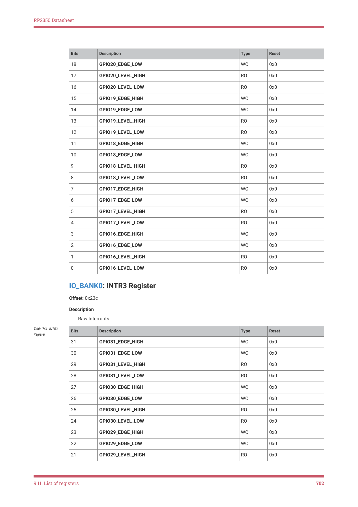

RP2350 Datasheet

| Bits | Description | Type | Reset |
| --- | --- | --- | --- |
| 18 | GPIO20_EDGE_LOW | WC | 0x0 |
| 17 | GPIO20_LEVEL_HIGH | RO | 0x0 |
| 16 | GPIO20_LEVEL_LOW | RO | 0x0 |
| 15 | GPIO19_EDGE_HIGH | WC | 0x0 |
| 14 | GPIO19_EDGE_LOW | WC | 0x0 |
| 13 | GPIO19_LEVEL_HIGH | RO | 0x0 |
| 12 | GPIO19_LEVEL_LOW | RO | 0x0 |
| 11 | GPIO18_EDGE_HIGH | WC | 0x0 |
| 10 | GPIO18_EDGE_LOW | WC | 0x0 |
| 9 | GPIO18_LEVEL_HIGH | RO | 0x0 |
| 8 | GPIO18_LEVEL_LOW | RO | 0x0 |
| 7 | GPIO17_EDGE_HIGH | WC | 0x0 |
| 6 | GPIO17_EDGE_LOW | WC | 0x0 |
| 5 | GPIO17_LEVEL_HIGH | RO | 0x0 |
| 4 | GPIO17_LEVEL_LOW | RO | 0x0 |
| 3 | GPIO16_EDGE_HIGH | WC | 0x0 |
| 2 | GPIO16_EDGE_LOW | WC | 0x0 |
| 1 | GPIO16_LEVEL_HIGH | RO | 0x0 |
| 0 | GPIO16_LEVEL_LOW | RO | 0x0 |

IO_BANK0: INTR3 Register

Offset: 0x23c

Description

Raw Interrupts

| Bits | Description | Type | Reset |
| --- | --- | --- | --- |
| 31 | GPIO31_EDGE_HIGH | WC | 0x0 |
| 30 | GPIO31_EDGE_LOW | WC | 0x0 |
| 29 | GPIO31_LEVEL_HIGH | RO | 0x0 |
| 28 | GPIO31_LEVEL_LOW | RO | 0x0 |
| 27 | GPIO30_EDGE_HIGH | WC | 0x0 |
| 26 | GPIO30_EDGE_LOW | WC | 0x0 |
| 25 | GPIO30_LEVEL_HIGH | RO | 0x0 |
| 24 | GPIO30_LEVEL_LOW | RO | 0x0 |
| 23 | GPIO29_EDGE_HIGH | WC | 0x0 |
| 22 | GPIO29_EDGE_LOW | WC | 0x0 |
| 21 | GPIO29_LEVEL_HIGH | RO | 0x0 |

Table 761. INTR3

9.11. List of registers
702

RP2350 Datasheet

| Bits | Description | Type | Reset |
| --- | --- | --- | --- |
| 20 | GPIO29_LEVEL_LOW | RO | 0x0 |
| 19 | GPIO28_EDGE_HIGH | WC | 0x0 |
| 18 | GPIO28_EDGE_LOW | WC | 0x0 |
| 17 | GPIO28_LEVEL_HIGH | RO | 0x0 |
| 16 | GPIO28_LEVEL_LOW | RO | 0x0 |
| 15 | GPIO27_EDGE_HIGH | WC | 0x0 |
| 14 | GPIO27_EDGE_LOW | WC | 0x0 |
| 13 | GPIO27_LEVEL_HIGH | RO | 0x0 |
| 12 | GPIO27_LEVEL_LOW | RO | 0x0 |
| 11 | GPIO26_EDGE_HIGH | WC | 0x0 |
| 10 | GPIO26_EDGE_LOW | WC | 0x0 |
| 9 | GPIO26_LEVEL_HIGH | RO | 0x0 |
| 8 | GPIO26_LEVEL_LOW | RO | 0x0 |
| 7 | GPIO25_EDGE_HIGH | WC | 0x0 |
| 6 | GPIO25_EDGE_LOW | WC | 0x0 |
| 5 | GPIO25_LEVEL_HIGH | RO | 0x0 |
| 4 | GPIO25_LEVEL_LOW | RO | 0x0 |
| 3 | GPIO24_EDGE_HIGH | WC | 0x0 |
| 2 | GPIO24_EDGE_LOW | WC | 0x0 |
| 1 | GPIO24_LEVEL_HIGH | RO | 0x0 |
| 0 | GPIO24_LEVEL_LOW | RO | 0x0 |

IO_BANK0: INTR4 Register

Offset: 0x240

Description

Raw Interrupts

| Bits | Description | Type | Reset |
| --- | --- | --- | --- |
| 31 | GPIO39_EDGE_HIGH | WC | 0x0 |
| 30 | GPIO39_EDGE_LOW | WC | 0x0 |
| 29 | GPIO39_LEVEL_HIGH | RO | 0x0 |
| 28 | GPIO39_LEVEL_LOW | RO | 0x0 |
| 27 | GPIO38_EDGE_HIGH | WC | 0x0 |
| 26 | GPIO38_EDGE_LOW | WC | 0x0 |
| 25 | GPIO38_LEVEL_HIGH | RO | 0x0 |
| 24 | GPIO38_LEVEL_LOW | RO | 0x0 |
| 23 | GPIO37_EDGE_HIGH | WC | 0x0 |

Table 762. INTR4

9.11. List of registers
703

RP2350 Datasheet

| Bits | Description | Type | Reset |
| --- | --- | --- | --- |
| 22 | GPIO37_EDGE_LOW | WC | 0x0 |
| 21 | GPIO37_LEVEL_HIGH | RO | 0x0 |
| 20 | GPIO37_LEVEL_LOW | RO | 0x0 |
| 19 | GPIO36_EDGE_HIGH | WC | 0x0 |
| 18 | GPIO36_EDGE_LOW | WC | 0x0 |
| 17 | GPIO36_LEVEL_HIGH | RO | 0x0 |
| 16 | GPIO36_LEVEL_LOW | RO | 0x0 |
| 15 | GPIO35_EDGE_HIGH | WC | 0x0 |
| 14 | GPIO35_EDGE_LOW | WC | 0x0 |
| 13 | GPIO35_LEVEL_HIGH | RO | 0x0 |
| 12 | GPIO35_LEVEL_LOW | RO | 0x0 |
| 11 | GPIO34_EDGE_HIGH | WC | 0x0 |
| 10 | GPIO34_EDGE_LOW | WC | 0x0 |
| 9 | GPIO34_LEVEL_HIGH | RO | 0x0 |
| 8 | GPIO34_LEVEL_LOW | RO | 0x0 |
| 7 | GPIO33_EDGE_HIGH | WC | 0x0 |
| 6 | GPIO33_EDGE_LOW | WC | 0x0 |
| 5 | GPIO33_LEVEL_HIGH | RO | 0x0 |
| 4 | GPIO33_LEVEL_LOW | RO | 0x0 |
| 3 | GPIO32_EDGE_HIGH | WC | 0x0 |
| 2 | GPIO32_EDGE_LOW | WC | 0x0 |
| 1 | GPIO32_LEVEL_HIGH | RO | 0x0 |
| 0 | GPIO32_LEVEL_LOW | RO | 0x0 |

IO_BANK0: INTR5 Register

Offset: 0x244

Description

Raw Interrupts

| Bits | Description | Type | Reset |
| --- | --- | --- | --- |
| 31 | GPIO47_EDGE_HIGH | WC | 0x0 |
| 30 | GPIO47_EDGE_LOW | WC | 0x0 |
| 29 | GPIO47_LEVEL_HIGH | RO | 0x0 |
| 28 | GPIO47_LEVEL_LOW | RO | 0x0 |
| 27 | GPIO46_EDGE_HIGH | WC | 0x0 |
| 26 | GPIO46_EDGE_LOW | WC | 0x0 |
| 25 | GPIO46_LEVEL_HIGH | RO | 0x0 |

Table 763. INTR5

9.11. List of registers
704

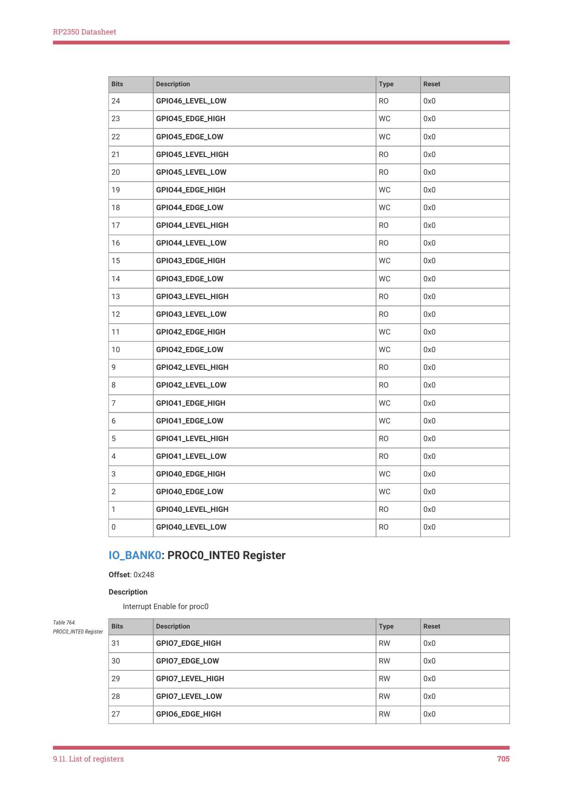

RP2350 Datasheet

| Bits | Description | Type | Reset |
| --- | --- | --- | --- |
| 24 | GPIO46_LEVEL_LOW | RO | 0x0 |
| 23 | GPIO45_EDGE_HIGH | WC | 0x0 |
| 22 | GPIO45_EDGE_LOW | WC | 0x0 |
| 21 | GPIO45_LEVEL_HIGH | RO | 0x0 |
| 20 | GPIO45_LEVEL_LOW | RO | 0x0 |
| 19 | GPIO44_EDGE_HIGH | WC | 0x0 |
| 18 | GPIO44_EDGE_LOW | WC | 0x0 |
| 17 | GPIO44_LEVEL_HIGH | RO | 0x0 |
| 16 | GPIO44_LEVEL_LOW | RO | 0x0 |
| 15 | GPIO43_EDGE_HIGH | WC | 0x0 |
| 14 | GPIO43_EDGE_LOW | WC | 0x0 |
| 13 | GPIO43_LEVEL_HIGH | RO | 0x0 |
| 12 | GPIO43_LEVEL_LOW | RO | 0x0 |
| 11 | GPIO42_EDGE_HIGH | WC | 0x0 |
| 10 | GPIO42_EDGE_LOW | WC | 0x0 |
| 9 | GPIO42_LEVEL_HIGH | RO | 0x0 |
| 8 | GPIO42_LEVEL_LOW | RO | 0x0 |
| 7 | GPIO41_EDGE_HIGH | WC | 0x0 |
| 6 | GPIO41_EDGE_LOW | WC | 0x0 |
| 5 | GPIO41_LEVEL_HIGH | RO | 0x0 |
| 4 | GPIO41_LEVEL_LOW | RO | 0x0 |
| 3 | GPIO40_EDGE_HIGH | WC | 0x0 |
| 2 | GPIO40_EDGE_LOW | WC | 0x0 |
| 1 | GPIO40_LEVEL_HIGH | RO | 0x0 |
| 0 | GPIO40_LEVEL_LOW | RO | 0x0 |

IO_BANK0: PROC0_INTE0 Register

Offset: 0x248

Description

Interrupt Enable for proc0

| Bits | Description | Type | Reset |
| --- | --- | --- | --- |
| 31 | GPIO7_EDGE_HIGH | RW | 0x0 |
| 30 | GPIO7_EDGE_LOW | RW | 0x0 |
| 29 | GPIO7_LEVEL_HIGH | RW | 0x0 |
| 28 | GPIO7_LEVEL_LOW | RW | 0x0 |
| 27 | GPIO6_EDGE_HIGH | RW | 0x0 |

Table 764.

9.11. List of registers
705

RP2350 Datasheet

| Bits | Description | Type | Reset |
| --- | --- | --- | --- |
| 26 | GPIO6_EDGE_LOW | RW | 0x0 |
| 25 | GPIO6_LEVEL_HIGH | RW | 0x0 |
| 24 | GPIO6_LEVEL_LOW | RW | 0x0 |
| 23 | GPIO5_EDGE_HIGH | RW | 0x0 |
| 22 | GPIO5_EDGE_LOW | RW | 0x0 |
| 21 | GPIO5_LEVEL_HIGH | RW | 0x0 |
| 20 | GPIO5_LEVEL_LOW | RW | 0x0 |
| 19 | GPIO4_EDGE_HIGH | RW | 0x0 |
| 18 | GPIO4_EDGE_LOW | RW | 0x0 |
| 17 | GPIO4_LEVEL_HIGH | RW | 0x0 |
| 16 | GPIO4_LEVEL_LOW | RW | 0x0 |
| 15 | GPIO3_EDGE_HIGH | RW | 0x0 |
| 14 | GPIO3_EDGE_LOW | RW | 0x0 |
| 13 | GPIO3_LEVEL_HIGH | RW | 0x0 |
| 12 | GPIO3_LEVEL_LOW | RW | 0x0 |
| 11 | GPIO2_EDGE_HIGH | RW | 0x0 |
| 10 | GPIO2_EDGE_LOW | RW | 0x0 |
| 9 | GPIO2_LEVEL_HIGH | RW | 0x0 |
| 8 | GPIO2_LEVEL_LOW | RW | 0x0 |
| 7 | GPIO1_EDGE_HIGH | RW | 0x0 |
| 6 | GPIO1_EDGE_LOW | RW | 0x0 |
| 5 | GPIO1_LEVEL_HIGH | RW | 0x0 |
| 4 | GPIO1_LEVEL_LOW | RW | 0x0 |
| 3 | GPIO0_EDGE_HIGH | RW | 0x0 |
| 2 | GPIO0_EDGE_LOW | RW | 0x0 |
| 1 | GPIO0_LEVEL_HIGH | RW | 0x0 |
| 0 | GPIO0_LEVEL_LOW | RW | 0x0 |

IO_BANK0: PROC0_INTE1 Register

Offset: 0x24c

Description

Interrupt Enable for proc0

| Bits | Description | Type | Reset |
| --- | --- | --- | --- |
| 31 | GPIO15_EDGE_HIGH | RW | 0x0 |
| 30 | GPIO15_EDGE_LOW | RW | 0x0 |
| 29 | GPIO15_LEVEL_HIGH | RW | 0x0 |

Table 765.

9.11. List of registers
706

RP2350 Datasheet

| Bits | Description | Type | Reset |
| --- | --- | --- | --- |
| 28 | GPIO15_LEVEL_LOW | RW | 0x0 |
| 27 | GPIO14_EDGE_HIGH | RW | 0x0 |
| 26 | GPIO14_EDGE_LOW | RW | 0x0 |
| 25 | GPIO14_LEVEL_HIGH | RW | 0x0 |
| 24 | GPIO14_LEVEL_LOW | RW | 0x0 |
| 23 | GPIO13_EDGE_HIGH | RW | 0x0 |
| 22 | GPIO13_EDGE_LOW | RW | 0x0 |
| 21 | GPIO13_LEVEL_HIGH | RW | 0x0 |
| 20 | GPIO13_LEVEL_LOW | RW | 0x0 |
| 19 | GPIO12_EDGE_HIGH | RW | 0x0 |
| 18 | GPIO12_EDGE_LOW | RW | 0x0 |
| 17 | GPIO12_LEVEL_HIGH | RW | 0x0 |
| 16 | GPIO12_LEVEL_LOW | RW | 0x0 |
| 15 | GPIO11_EDGE_HIGH | RW | 0x0 |
| 14 | GPIO11_EDGE_LOW | RW | 0x0 |
| 13 | GPIO11_LEVEL_HIGH | RW | 0x0 |
| 12 | GPIO11_LEVEL_LOW | RW | 0x0 |
| 11 | GPIO10_EDGE_HIGH | RW | 0x0 |
| 10 | GPIO10_EDGE_LOW | RW | 0x0 |
| 9 | GPIO10_LEVEL_HIGH | RW | 0x0 |
| 8 | GPIO10_LEVEL_LOW | RW | 0x0 |
| 7 | GPIO9_EDGE_HIGH | RW | 0x0 |
| 6 | GPIO9_EDGE_LOW | RW | 0x0 |
| 5 | GPIO9_LEVEL_HIGH | RW | 0x0 |
| 4 | GPIO9_LEVEL_LOW | RW | 0x0 |
| 3 | GPIO8_EDGE_HIGH | RW | 0x0 |
| 2 | GPIO8_EDGE_LOW | RW | 0x0 |
| 1 | GPIO8_LEVEL_HIGH | RW | 0x0 |
| 0 | GPIO8_LEVEL_LOW | RW | 0x0 |

IO_BANK0: PROC0_INTE2 Register

Offset: 0x250

Description

Interrupt Enable for proc0

| Bits | Description | Type | Reset |
| --- | --- | --- | --- |
| 31 | GPIO23_EDGE_HIGH | RW | 0x0 |

Table 766.

9.11. List of registers
707

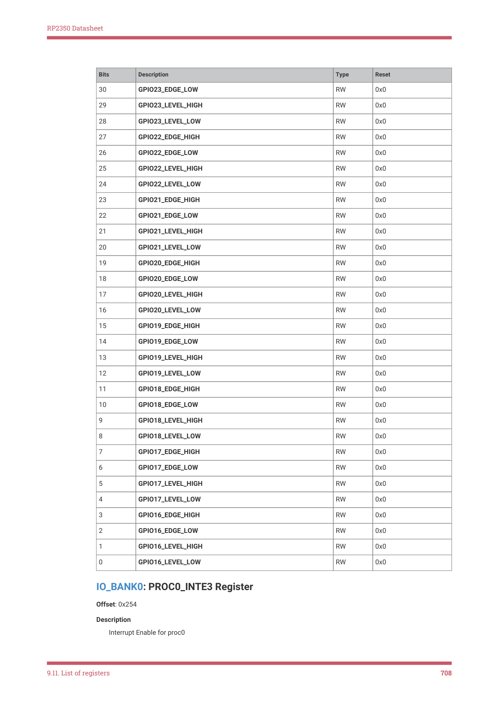

RP2350 Datasheet

| Bits | Description | Type | Reset |
| --- | --- | --- | --- |
| 30 | GPIO23_EDGE_LOW | RW | 0x0 |
| 29 | GPIO23_LEVEL_HIGH | RW | 0x0 |
| 28 | GPIO23_LEVEL_LOW | RW | 0x0 |
| 27 | GPIO22_EDGE_HIGH | RW | 0x0 |
| 26 | GPIO22_EDGE_LOW | RW | 0x0 |
| 25 | GPIO22_LEVEL_HIGH | RW | 0x0 |
| 24 | GPIO22_LEVEL_LOW | RW | 0x0 |
| 23 | GPIO21_EDGE_HIGH | RW | 0x0 |
| 22 | GPIO21_EDGE_LOW | RW | 0x0 |
| 21 | GPIO21_LEVEL_HIGH | RW | 0x0 |
| 20 | GPIO21_LEVEL_LOW | RW | 0x0 |
| 19 | GPIO20_EDGE_HIGH | RW | 0x0 |
| 18 | GPIO20_EDGE_LOW | RW | 0x0 |
| 17 | GPIO20_LEVEL_HIGH | RW | 0x0 |
| 16 | GPIO20_LEVEL_LOW | RW | 0x0 |
| 15 | GPIO19_EDGE_HIGH | RW | 0x0 |
| 14 | GPIO19_EDGE_LOW | RW | 0x0 |
| 13 | GPIO19_LEVEL_HIGH | RW | 0x0 |
| 12 | GPIO19_LEVEL_LOW | RW | 0x0 |
| 11 | GPIO18_EDGE_HIGH | RW | 0x0 |
| 10 | GPIO18_EDGE_LOW | RW | 0x0 |
| 9 | GPIO18_LEVEL_HIGH | RW | 0x0 |
| 8 | GPIO18_LEVEL_LOW | RW | 0x0 |
| 7 | GPIO17_EDGE_HIGH | RW | 0x0 |
| 6 | GPIO17_EDGE_LOW | RW | 0x0 |
| 5 | GPIO17_LEVEL_HIGH | RW | 0x0 |
| 4 | GPIO17_LEVEL_LOW | RW | 0x0 |
| 3 | GPIO16_EDGE_HIGH | RW | 0x0 |
| 2 | GPIO16_EDGE_LOW | RW | 0x0 |
| 1 | GPIO16_LEVEL_HIGH | RW | 0x0 |
| 0 | GPIO16_LEVEL_LOW | RW | 0x0 |

IO_BANK0: PROC0_INTE3 Register

Offset: 0x254

Description

Interrupt Enable for proc0

9.11. List of registers
708

RP2350 Datasheet

| Bits | Description | Type | Reset |
| --- | --- | --- | --- |
| 31 | GPIO31_EDGE_HIGH | RW | 0x0 |
| 30 | GPIO31_EDGE_LOW | RW | 0x0 |
| 29 | GPIO31_LEVEL_HIGH | RW | 0x0 |
| 28 | GPIO31_LEVEL_LOW | RW | 0x0 |
| 27 | GPIO30_EDGE_HIGH | RW | 0x0 |
| 26 | GPIO30_EDGE_LOW | RW | 0x0 |
| 25 | GPIO30_LEVEL_HIGH | RW | 0x0 |
| 24 | GPIO30_LEVEL_LOW | RW | 0x0 |
| 23 | GPIO29_EDGE_HIGH | RW | 0x0 |
| 22 | GPIO29_EDGE_LOW | RW | 0x0 |
| 21 | GPIO29_LEVEL_HIGH | RW | 0x0 |
| 20 | GPIO29_LEVEL_LOW | RW | 0x0 |
| 19 | GPIO28_EDGE_HIGH | RW | 0x0 |
| 18 | GPIO28_EDGE_LOW | RW | 0x0 |
| 17 | GPIO28_LEVEL_HIGH | RW | 0x0 |
| 16 | GPIO28_LEVEL_LOW | RW | 0x0 |
| 15 | GPIO27_EDGE_HIGH | RW | 0x0 |
| 14 | GPIO27_EDGE_LOW | RW | 0x0 |
| 13 | GPIO27_LEVEL_HIGH | RW | 0x0 |
| 12 | GPIO27_LEVEL_LOW | RW | 0x0 |
| 11 | GPIO26_EDGE_HIGH | RW | 0x0 |
| 10 | GPIO26_EDGE_LOW | RW | 0x0 |
| 9 | GPIO26_LEVEL_HIGH | RW | 0x0 |
| 8 | GPIO26_LEVEL_LOW | RW | 0x0 |
| 7 | GPIO25_EDGE_HIGH | RW | 0x0 |
| 6 | GPIO25_EDGE_LOW | RW | 0x0 |
| 5 | GPIO25_LEVEL_HIGH | RW | 0x0 |
| 4 | GPIO25_LEVEL_LOW | RW | 0x0 |
| 3 | GPIO24_EDGE_HIGH | RW | 0x0 |
| 2 | GPIO24_EDGE_LOW | RW | 0x0 |
| 1 | GPIO24_LEVEL_HIGH | RW | 0x0 |
| 0 | GPIO24_LEVEL_LOW | RW | 0x0 |

Table 767.

IO_BANK0: PROC0_INTE4 Register

Offset: 0x258

9.11. List of registers
709

RP2350 Datasheet

Description

Interrupt Enable for proc0

| Bits | Description | Type | Reset |
| --- | --- | --- | --- |
| 31 | GPIO39_EDGE_HIGH | RW | 0x0 |
| 30 | GPIO39_EDGE_LOW | RW | 0x0 |
| 29 | GPIO39_LEVEL_HIGH | RW | 0x0 |
| 28 | GPIO39_LEVEL_LOW | RW | 0x0 |
| 27 | GPIO38_EDGE_HIGH | RW | 0x0 |
| 26 | GPIO38_EDGE_LOW | RW | 0x0 |
| 25 | GPIO38_LEVEL_HIGH | RW | 0x0 |
| 24 | GPIO38_LEVEL_LOW | RW | 0x0 |
| 23 | GPIO37_EDGE_HIGH | RW | 0x0 |
| 22 | GPIO37_EDGE_LOW | RW | 0x0 |
| 21 | GPIO37_LEVEL_HIGH | RW | 0x0 |
| 20 | GPIO37_LEVEL_LOW | RW | 0x0 |
| 19 | GPIO36_EDGE_HIGH | RW | 0x0 |
| 18 | GPIO36_EDGE_LOW | RW | 0x0 |
| 17 | GPIO36_LEVEL_HIGH | RW | 0x0 |
| 16 | GPIO36_LEVEL_LOW | RW | 0x0 |
| 15 | GPIO35_EDGE_HIGH | RW | 0x0 |
| 14 | GPIO35_EDGE_LOW | RW | 0x0 |
| 13 | GPIO35_LEVEL_HIGH | RW | 0x0 |
| 12 | GPIO35_LEVEL_LOW | RW | 0x0 |
| 11 | GPIO34_EDGE_HIGH | RW | 0x0 |
| 10 | GPIO34_EDGE_LOW | RW | 0x0 |
| 9 | GPIO34_LEVEL_HIGH | RW | 0x0 |
| 8 | GPIO34_LEVEL_LOW | RW | 0x0 |
| 7 | GPIO33_EDGE_HIGH | RW | 0x0 |
| 6 | GPIO33_EDGE_LOW | RW | 0x0 |
| 5 | GPIO33_LEVEL_HIGH | RW | 0x0 |
| 4 | GPIO33_LEVEL_LOW | RW | 0x0 |
| 3 | GPIO32_EDGE_HIGH | RW | 0x0 |
| 2 | GPIO32_EDGE_LOW | RW | 0x0 |
| 1 | GPIO32_LEVEL_HIGH | RW | 0x0 |
| 0 | GPIO32_LEVEL_LOW | RW | 0x0 |

Table 768.

IO_BANK0: PROC0_INTE5 Register

Offset: 0x25c

9.11. List of registers
710

RP2350 Datasheet

Description

Interrupt Enable for proc0

| Bits | Description | Type | Reset |
| --- | --- | --- | --- |
| 31 | GPIO47_EDGE_HIGH | RW | 0x0 |
| 30 | GPIO47_EDGE_LOW | RW | 0x0 |
| 29 | GPIO47_LEVEL_HIGH | RW | 0x0 |
| 28 | GPIO47_LEVEL_LOW | RW | 0x0 |
| 27 | GPIO46_EDGE_HIGH | RW | 0x0 |
| 26 | GPIO46_EDGE_LOW | RW | 0x0 |
| 25 | GPIO46_LEVEL_HIGH | RW | 0x0 |
| 24 | GPIO46_LEVEL_LOW | RW | 0x0 |
| 23 | GPIO45_EDGE_HIGH | RW | 0x0 |
| 22 | GPIO45_EDGE_LOW | RW | 0x0 |
| 21 | GPIO45_LEVEL_HIGH | RW | 0x0 |
| 20 | GPIO45_LEVEL_LOW | RW | 0x0 |
| 19 | GPIO44_EDGE_HIGH | RW | 0x0 |
| 18 | GPIO44_EDGE_LOW | RW | 0x0 |
| 17 | GPIO44_LEVEL_HIGH | RW | 0x0 |
| 16 | GPIO44_LEVEL_LOW | RW | 0x0 |
| 15 | GPIO43_EDGE_HIGH | RW | 0x0 |
| 14 | GPIO43_EDGE_LOW | RW | 0x0 |
| 13 | GPIO43_LEVEL_HIGH | RW | 0x0 |
| 12 | GPIO43_LEVEL_LOW | RW | 0x0 |
| 11 | GPIO42_EDGE_HIGH | RW | 0x0 |
| 10 | GPIO42_EDGE_LOW | RW | 0x0 |
| 9 | GPIO42_LEVEL_HIGH | RW | 0x0 |
| 8 | GPIO42_LEVEL_LOW | RW | 0x0 |
| 7 | GPIO41_EDGE_HIGH | RW | 0x0 |
| 6 | GPIO41_EDGE_LOW | RW | 0x0 |
| 5 | GPIO41_LEVEL_HIGH | RW | 0x0 |
| 4 | GPIO41_LEVEL_LOW | RW | 0x0 |
| 3 | GPIO40_EDGE_HIGH | RW | 0x0 |
| 2 | GPIO40_EDGE_LOW | RW | 0x0 |
| 1 | GPIO40_LEVEL_HIGH | RW | 0x0 |
| 0 | GPIO40_LEVEL_LOW | RW | 0x0 |

Table 769.

IO_BANK0: PROC0_INTF0 Register

Offset: 0x260

9.11. List of registers
711

RP2350 Datasheet

Description

Interrupt Force for proc0

| Bits | Description | Type | Reset |
| --- | --- | --- | --- |
| 31 | GPIO7_EDGE_HIGH | RW | 0x0 |
| 30 | GPIO7_EDGE_LOW | RW | 0x0 |
| 29 | GPIO7_LEVEL_HIGH | RW | 0x0 |
| 28 | GPIO7_LEVEL_LOW | RW | 0x0 |
| 27 | GPIO6_EDGE_HIGH | RW | 0x0 |
| 26 | GPIO6_EDGE_LOW | RW | 0x0 |
| 25 | GPIO6_LEVEL_HIGH | RW | 0x0 |
| 24 | GPIO6_LEVEL_LOW | RW | 0x0 |
| 23 | GPIO5_EDGE_HIGH | RW | 0x0 |
| 22 | GPIO5_EDGE_LOW | RW | 0x0 |
| 21 | GPIO5_LEVEL_HIGH | RW | 0x0 |
| 20 | GPIO5_LEVEL_LOW | RW | 0x0 |
| 19 | GPIO4_EDGE_HIGH | RW | 0x0 |
| 18 | GPIO4_EDGE_LOW | RW | 0x0 |
| 17 | GPIO4_LEVEL_HIGH | RW | 0x0 |
| 16 | GPIO4_LEVEL_LOW | RW | 0x0 |
| 15 | GPIO3_EDGE_HIGH | RW | 0x0 |
| 14 | GPIO3_EDGE_LOW | RW | 0x0 |
| 13 | GPIO3_LEVEL_HIGH | RW | 0x0 |
| 12 | GPIO3_LEVEL_LOW | RW | 0x0 |
| 11 | GPIO2_EDGE_HIGH | RW | 0x0 |
| 10 | GPIO2_EDGE_LOW | RW | 0x0 |
| 9 | GPIO2_LEVEL_HIGH | RW | 0x0 |
| 8 | GPIO2_LEVEL_LOW | RW | 0x0 |
| 7 | GPIO1_EDGE_HIGH | RW | 0x0 |
| 6 | GPIO1_EDGE_LOW | RW | 0x0 |
| 5 | GPIO1_LEVEL_HIGH | RW | 0x0 |
| 4 | GPIO1_LEVEL_LOW | RW | 0x0 |
| 3 | GPIO0_EDGE_HIGH | RW | 0x0 |
| 2 | GPIO0_EDGE_LOW | RW | 0x0 |
| 1 | GPIO0_LEVEL_HIGH | RW | 0x0 |
| 0 | GPIO0_LEVEL_LOW | RW | 0x0 |

Table 770.

IO_BANK0: PROC0_INTF1 Register

Offset: 0x264

9.11. List of registers
712

RP2350 Datasheet

Description

Interrupt Force for proc0

| Bits | Description | Type | Reset |
| --- | --- | --- | --- |
| 31 | GPIO15_EDGE_HIGH | RW | 0x0 |
| 30 | GPIO15_EDGE_LOW | RW | 0x0 |
| 29 | GPIO15_LEVEL_HIGH | RW | 0x0 |
| 28 | GPIO15_LEVEL_LOW | RW | 0x0 |
| 27 | GPIO14_EDGE_HIGH | RW | 0x0 |
| 26 | GPIO14_EDGE_LOW | RW | 0x0 |
| 25 | GPIO14_LEVEL_HIGH | RW | 0x0 |
| 24 | GPIO14_LEVEL_LOW | RW | 0x0 |
| 23 | GPIO13_EDGE_HIGH | RW | 0x0 |
| 22 | GPIO13_EDGE_LOW | RW | 0x0 |
| 21 | GPIO13_LEVEL_HIGH | RW | 0x0 |
| 20 | GPIO13_LEVEL_LOW | RW | 0x0 |
| 19 | GPIO12_EDGE_HIGH | RW | 0x0 |
| 18 | GPIO12_EDGE_LOW | RW | 0x0 |
| 17 | GPIO12_LEVEL_HIGH | RW | 0x0 |
| 16 | GPIO12_LEVEL_LOW | RW | 0x0 |
| 15 | GPIO11_EDGE_HIGH | RW | 0x0 |
| 14 | GPIO11_EDGE_LOW | RW | 0x0 |
| 13 | GPIO11_LEVEL_HIGH | RW | 0x0 |
| 12 | GPIO11_LEVEL_LOW | RW | 0x0 |
| 11 | GPIO10_EDGE_HIGH | RW | 0x0 |
| 10 | GPIO10_EDGE_LOW | RW | 0x0 |
| 9 | GPIO10_LEVEL_HIGH | RW | 0x0 |
| 8 | GPIO10_LEVEL_LOW | RW | 0x0 |
| 7 | GPIO9_EDGE_HIGH | RW | 0x0 |
| 6 | GPIO9_EDGE_LOW | RW | 0x0 |
| 5 | GPIO9_LEVEL_HIGH | RW | 0x0 |
| 4 | GPIO9_LEVEL_LOW | RW | 0x0 |
| 3 | GPIO8_EDGE_HIGH | RW | 0x0 |
| 2 | GPIO8_EDGE_LOW | RW | 0x0 |
| 1 | GPIO8_LEVEL_HIGH | RW | 0x0 |
| 0 | GPIO8_LEVEL_LOW | RW | 0x0 |

Table 771.

IO_BANK0: PROC0_INTF2 Register

Offset: 0x268

9.11. List of registers
713

RP2350 Datasheet

Description

Interrupt Force for proc0

| Bits | Description | Type | Reset |
| --- | --- | --- | --- |
| 31 | GPIO23_EDGE_HIGH | RW | 0x0 |
| 30 | GPIO23_EDGE_LOW | RW | 0x0 |
| 29 | GPIO23_LEVEL_HIGH | RW | 0x0 |
| 28 | GPIO23_LEVEL_LOW | RW | 0x0 |
| 27 | GPIO22_EDGE_HIGH | RW | 0x0 |
| 26 | GPIO22_EDGE_LOW | RW | 0x0 |
| 25 | GPIO22_LEVEL_HIGH | RW | 0x0 |
| 24 | GPIO22_LEVEL_LOW | RW | 0x0 |
| 23 | GPIO21_EDGE_HIGH | RW | 0x0 |
| 22 | GPIO21_EDGE_LOW | RW | 0x0 |
| 21 | GPIO21_LEVEL_HIGH | RW | 0x0 |
| 20 | GPIO21_LEVEL_LOW | RW | 0x0 |
| 19 | GPIO20_EDGE_HIGH | RW | 0x0 |
| 18 | GPIO20_EDGE_LOW | RW | 0x0 |
| 17 | GPIO20_LEVEL_HIGH | RW | 0x0 |
| 16 | GPIO20_LEVEL_LOW | RW | 0x0 |
| 15 | GPIO19_EDGE_HIGH | RW | 0x0 |
| 14 | GPIO19_EDGE_LOW | RW | 0x0 |
| 13 | GPIO19_LEVEL_HIGH | RW | 0x0 |
| 12 | GPIO19_LEVEL_LOW | RW | 0x0 |
| 11 | GPIO18_EDGE_HIGH | RW | 0x0 |
| 10 | GPIO18_EDGE_LOW | RW | 0x0 |
| 9 | GPIO18_LEVEL_HIGH | RW | 0x0 |
| 8 | GPIO18_LEVEL_LOW | RW | 0x0 |
| 7 | GPIO17_EDGE_HIGH | RW | 0x0 |
| 6 | GPIO17_EDGE_LOW | RW | 0x0 |
| 5 | GPIO17_LEVEL_HIGH | RW | 0x0 |
| 4 | GPIO17_LEVEL_LOW | RW | 0x0 |
| 3 | GPIO16_EDGE_HIGH | RW | 0x0 |
| 2 | GPIO16_EDGE_LOW | RW | 0x0 |
| 1 | GPIO16_LEVEL_HIGH | RW | 0x0 |
| 0 | GPIO16_LEVEL_LOW | RW | 0x0 |

Table 772.

IO_BANK0: PROC0_INTF3 Register

Offset: 0x26c

9.11. List of registers
714

RP2350 Datasheet

Description

Interrupt Force for proc0

| Bits | Description | Type | Reset |
| --- | --- | --- | --- |
| 31 | GPIO31_EDGE_HIGH | RW | 0x0 |
| 30 | GPIO31_EDGE_LOW | RW | 0x0 |
| 29 | GPIO31_LEVEL_HIGH | RW | 0x0 |
| 28 | GPIO31_LEVEL_LOW | RW | 0x0 |
| 27 | GPIO30_EDGE_HIGH | RW | 0x0 |
| 26 | GPIO30_EDGE_LOW | RW | 0x0 |
| 25 | GPIO30_LEVEL_HIGH | RW | 0x0 |
| 24 | GPIO30_LEVEL_LOW | RW | 0x0 |
| 23 | GPIO29_EDGE_HIGH | RW | 0x0 |
| 22 | GPIO29_EDGE_LOW | RW | 0x0 |
| 21 | GPIO29_LEVEL_HIGH | RW | 0x0 |
| 20 | GPIO29_LEVEL_LOW | RW | 0x0 |
| 19 | GPIO28_EDGE_HIGH | RW | 0x0 |
| 18 | GPIO28_EDGE_LOW | RW | 0x0 |
| 17 | GPIO28_LEVEL_HIGH | RW | 0x0 |
| 16 | GPIO28_LEVEL_LOW | RW | 0x0 |
| 15 | GPIO27_EDGE_HIGH | RW | 0x0 |
| 14 | GPIO27_EDGE_LOW | RW | 0x0 |
| 13 | GPIO27_LEVEL_HIGH | RW | 0x0 |
| 12 | GPIO27_LEVEL_LOW | RW | 0x0 |
| 11 | GPIO26_EDGE_HIGH | RW | 0x0 |
| 10 | GPIO26_EDGE_LOW | RW | 0x0 |
| 9 | GPIO26_LEVEL_HIGH | RW | 0x0 |
| 8 | GPIO26_LEVEL_LOW | RW | 0x0 |
| 7 | GPIO25_EDGE_HIGH | RW | 0x0 |
| 6 | GPIO25_EDGE_LOW | RW | 0x0 |
| 5 | GPIO25_LEVEL_HIGH | RW | 0x0 |
| 4 | GPIO25_LEVEL_LOW | RW | 0x0 |
| 3 | GPIO24_EDGE_HIGH | RW | 0x0 |
| 2 | GPIO24_EDGE_LOW | RW | 0x0 |
| 1 | GPIO24_LEVEL_HIGH | RW | 0x0 |
| 0 | GPIO24_LEVEL_LOW | RW | 0x0 |

Table 773.

IO_BANK0: PROC0_INTF4 Register

Offset: 0x270

9.11. List of registers
715

RP2350 Datasheet

Description

Interrupt Force for proc0

| Bits | Description | Type | Reset |
| --- | --- | --- | --- |
| 31 | GPIO39_EDGE_HIGH | RW | 0x0 |
| 30 | GPIO39_EDGE_LOW | RW | 0x0 |
| 29 | GPIO39_LEVEL_HIGH | RW | 0x0 |
| 28 | GPIO39_LEVEL_LOW | RW | 0x0 |
| 27 | GPIO38_EDGE_HIGH | RW | 0x0 |
| 26 | GPIO38_EDGE_LOW | RW | 0x0 |
| 25 | GPIO38_LEVEL_HIGH | RW | 0x0 |
| 24 | GPIO38_LEVEL_LOW | RW | 0x0 |
| 23 | GPIO37_EDGE_HIGH | RW | 0x0 |
| 22 | GPIO37_EDGE_LOW | RW | 0x0 |
| 21 | GPIO37_LEVEL_HIGH | RW | 0x0 |
| 20 | GPIO37_LEVEL_LOW | RW | 0x0 |
| 19 | GPIO36_EDGE_HIGH | RW | 0x0 |
| 18 | GPIO36_EDGE_LOW | RW | 0x0 |
| 17 | GPIO36_LEVEL_HIGH | RW | 0x0 |
| 16 | GPIO36_LEVEL_LOW | RW | 0x0 |
| 15 | GPIO35_EDGE_HIGH | RW | 0x0 |
| 14 | GPIO35_EDGE_LOW | RW | 0x0 |
| 13 | GPIO35_LEVEL_HIGH | RW | 0x0 |
| 12 | GPIO35_LEVEL_LOW | RW | 0x0 |
| 11 | GPIO34_EDGE_HIGH | RW | 0x0 |
| 10 | GPIO34_EDGE_LOW | RW | 0x0 |
| 9 | GPIO34_LEVEL_HIGH | RW | 0x0 |
| 8 | GPIO34_LEVEL_LOW | RW | 0x0 |
| 7 | GPIO33_EDGE_HIGH | RW | 0x0 |
| 6 | GPIO33_EDGE_LOW | RW | 0x0 |
| 5 | GPIO33_LEVEL_HIGH | RW | 0x0 |
| 4 | GPIO33_LEVEL_LOW | RW | 0x0 |
| 3 | GPIO32_EDGE_HIGH | RW | 0x0 |
| 2 | GPIO32_EDGE_LOW | RW | 0x0 |
| 1 | GPIO32_LEVEL_HIGH | RW | 0x0 |
| 0 | GPIO32_LEVEL_LOW | RW | 0x0 |

Table 774.

IO_BANK0: PROC0_INTF5 Register

Offset: 0x274

9.11. List of registers
716

RP2350 Datasheet

Description

Interrupt Force for proc0

| Bits | Description | Type | Reset |
| --- | --- | --- | --- |
| 31 | GPIO47_EDGE_HIGH | RW | 0x0 |
| 30 | GPIO47_EDGE_LOW | RW | 0x0 |
| 29 | GPIO47_LEVEL_HIGH | RW | 0x0 |
| 28 | GPIO47_LEVEL_LOW | RW | 0x0 |
| 27 | GPIO46_EDGE_HIGH | RW | 0x0 |
| 26 | GPIO46_EDGE_LOW | RW | 0x0 |
| 25 | GPIO46_LEVEL_HIGH | RW | 0x0 |
| 24 | GPIO46_LEVEL_LOW | RW | 0x0 |
| 23 | GPIO45_EDGE_HIGH | RW | 0x0 |
| 22 | GPIO45_EDGE_LOW | RW | 0x0 |
| 21 | GPIO45_LEVEL_HIGH | RW | 0x0 |
| 20 | GPIO45_LEVEL_LOW | RW | 0x0 |
| 19 | GPIO44_EDGE_HIGH | RW | 0x0 |
| 18 | GPIO44_EDGE_LOW | RW | 0x0 |
| 17 | GPIO44_LEVEL_HIGH | RW | 0x0 |
| 16 | GPIO44_LEVEL_LOW | RW | 0x0 |
| 15 | GPIO43_EDGE_HIGH | RW | 0x0 |
| 14 | GPIO43_EDGE_LOW | RW | 0x0 |
| 13 | GPIO43_LEVEL_HIGH | RW | 0x0 |
| 12 | GPIO43_LEVEL_LOW | RW | 0x0 |
| 11 | GPIO42_EDGE_HIGH | RW | 0x0 |
| 10 | GPIO42_EDGE_LOW | RW | 0x0 |
| 9 | GPIO42_LEVEL_HIGH | RW | 0x0 |
| 8 | GPIO42_LEVEL_LOW | RW | 0x0 |
| 7 | GPIO41_EDGE_HIGH | RW | 0x0 |
| 6 | GPIO41_EDGE_LOW | RW | 0x0 |
| 5 | GPIO41_LEVEL_HIGH | RW | 0x0 |
| 4 | GPIO41_LEVEL_LOW | RW | 0x0 |
| 3 | GPIO40_EDGE_HIGH | RW | 0x0 |
| 2 | GPIO40_EDGE_LOW | RW | 0x0 |
| 1 | GPIO40_LEVEL_HIGH | RW | 0x0 |
| 0 | GPIO40_LEVEL_LOW | RW | 0x0 |

Table 775.

IO_BANK0: PROC0_INTS0 Register

Offset: 0x278

9.11. List of registers
717

RP2350 Datasheet

Description

Interrupt status after masking & forcing for proc0

| Bits | Description | Type | Reset |
| --- | --- | --- | --- |
| 31 | GPIO7_EDGE_HIGH | RO | 0x0 |
| 30 | GPIO7_EDGE_LOW | RO | 0x0 |
| 29 | GPIO7_LEVEL_HIGH | RO | 0x0 |
| 28 | GPIO7_LEVEL_LOW | RO | 0x0 |
| 27 | GPIO6_EDGE_HIGH | RO | 0x0 |
| 26 | GPIO6_EDGE_LOW | RO | 0x0 |
| 25 | GPIO6_LEVEL_HIGH | RO | 0x0 |
| 24 | GPIO6_LEVEL_LOW | RO | 0x0 |
| 23 | GPIO5_EDGE_HIGH | RO | 0x0 |
| 22 | GPIO5_EDGE_LOW | RO | 0x0 |
| 21 | GPIO5_LEVEL_HIGH | RO | 0x0 |
| 20 | GPIO5_LEVEL_LOW | RO | 0x0 |
| 19 | GPIO4_EDGE_HIGH | RO | 0x0 |
| 18 | GPIO4_EDGE_LOW | RO | 0x0 |
| 17 | GPIO4_LEVEL_HIGH | RO | 0x0 |
| 16 | GPIO4_LEVEL_LOW | RO | 0x0 |
| 15 | GPIO3_EDGE_HIGH | RO | 0x0 |
| 14 | GPIO3_EDGE_LOW | RO | 0x0 |
| 13 | GPIO3_LEVEL_HIGH | RO | 0x0 |
| 12 | GPIO3_LEVEL_LOW | RO | 0x0 |
| 11 | GPIO2_EDGE_HIGH | RO | 0x0 |
| 10 | GPIO2_EDGE_LOW | RO | 0x0 |
| 9 | GPIO2_LEVEL_HIGH | RO | 0x0 |
| 8 | GPIO2_LEVEL_LOW | RO | 0x0 |
| 7 | GPIO1_EDGE_HIGH | RO | 0x0 |
| 6 | GPIO1_EDGE_LOW | RO | 0x0 |
| 5 | GPIO1_LEVEL_HIGH | RO | 0x0 |
| 4 | GPIO1_LEVEL_LOW | RO | 0x0 |
| 3 | GPIO0_EDGE_HIGH | RO | 0x0 |
| 2 | GPIO0_EDGE_LOW | RO | 0x0 |
| 1 | GPIO0_LEVEL_HIGH | RO | 0x0 |
| 0 | GPIO0_LEVEL_LOW | RO | 0x0 |

Table 776.

PROC0_INTS0

Register

IO_BANK0: PROC0_INTS1 Register

Offset: 0x27c

9.11. List of registers
718

RP2350 Datasheet

Description

Interrupt status after masking & forcing for proc0

| Bits | Description | Type | Reset |
| --- | --- | --- | --- |
| 31 | GPIO15_EDGE_HIGH | RO | 0x0 |
| 30 | GPIO15_EDGE_LOW | RO | 0x0 |
| 29 | GPIO15_LEVEL_HIGH | RO | 0x0 |
| 28 | GPIO15_LEVEL_LOW | RO | 0x0 |
| 27 | GPIO14_EDGE_HIGH | RO | 0x0 |
| 26 | GPIO14_EDGE_LOW | RO | 0x0 |
| 25 | GPIO14_LEVEL_HIGH | RO | 0x0 |
| 24 | GPIO14_LEVEL_LOW | RO | 0x0 |
| 23 | GPIO13_EDGE_HIGH | RO | 0x0 |
| 22 | GPIO13_EDGE_LOW | RO | 0x0 |
| 21 | GPIO13_LEVEL_HIGH | RO | 0x0 |
| 20 | GPIO13_LEVEL_LOW | RO | 0x0 |
| 19 | GPIO12_EDGE_HIGH | RO | 0x0 |
| 18 | GPIO12_EDGE_LOW | RO | 0x0 |
| 17 | GPIO12_LEVEL_HIGH | RO | 0x0 |
| 16 | GPIO12_LEVEL_LOW | RO | 0x0 |
| 15 | GPIO11_EDGE_HIGH | RO | 0x0 |
| 14 | GPIO11_EDGE_LOW | RO | 0x0 |
| 13 | GPIO11_LEVEL_HIGH | RO | 0x0 |
| 12 | GPIO11_LEVEL_LOW | RO | 0x0 |
| 11 | GPIO10_EDGE_HIGH | RO | 0x0 |
| 10 | GPIO10_EDGE_LOW | RO | 0x0 |
| 9 | GPIO10_LEVEL_HIGH | RO | 0x0 |
| 8 | GPIO10_LEVEL_LOW | RO | 0x0 |
| 7 | GPIO9_EDGE_HIGH | RO | 0x0 |
| 6 | GPIO9_EDGE_LOW | RO | 0x0 |
| 5 | GPIO9_LEVEL_HIGH | RO | 0x0 |
| 4 | GPIO9_LEVEL_LOW | RO | 0x0 |
| 3 | GPIO8_EDGE_HIGH | RO | 0x0 |
| 2 | GPIO8_EDGE_LOW | RO | 0x0 |
| 1 | GPIO8_LEVEL_HIGH | RO | 0x0 |
| 0 | GPIO8_LEVEL_LOW | RO | 0x0 |

Table 777.

PROC0_INTS1

Register

IO_BANK0: PROC0_INTS2 Register

Offset: 0x280

9.11. List of registers
719

RP2350 Datasheet

Description

Interrupt status after masking & forcing for proc0

| Bits | Description | Type | Reset |
| --- | --- | --- | --- |
| 31 | GPIO23_EDGE_HIGH | RO | 0x0 |
| 30 | GPIO23_EDGE_LOW | RO | 0x0 |
| 29 | GPIO23_LEVEL_HIGH | RO | 0x0 |
| 28 | GPIO23_LEVEL_LOW | RO | 0x0 |
| 27 | GPIO22_EDGE_HIGH | RO | 0x0 |
| 26 | GPIO22_EDGE_LOW | RO | 0x0 |
| 25 | GPIO22_LEVEL_HIGH | RO | 0x0 |
| 24 | GPIO22_LEVEL_LOW | RO | 0x0 |
| 23 | GPIO21_EDGE_HIGH | RO | 0x0 |
| 22 | GPIO21_EDGE_LOW | RO | 0x0 |
| 21 | GPIO21_LEVEL_HIGH | RO | 0x0 |
| 20 | GPIO21_LEVEL_LOW | RO | 0x0 |
| 19 | GPIO20_EDGE_HIGH | RO | 0x0 |
| 18 | GPIO20_EDGE_LOW | RO | 0x0 |
| 17 | GPIO20_LEVEL_HIGH | RO | 0x0 |
| 16 | GPIO20_LEVEL_LOW | RO | 0x0 |
| 15 | GPIO19_EDGE_HIGH | RO | 0x0 |
| 14 | GPIO19_EDGE_LOW | RO | 0x0 |
| 13 | GPIO19_LEVEL_HIGH | RO | 0x0 |
| 12 | GPIO19_LEVEL_LOW | RO | 0x0 |
| 11 | GPIO18_EDGE_HIGH | RO | 0x0 |
| 10 | GPIO18_EDGE_LOW | RO | 0x0 |
| 9 | GPIO18_LEVEL_HIGH | RO | 0x0 |
| 8 | GPIO18_LEVEL_LOW | RO | 0x0 |
| 7 | GPIO17_EDGE_HIGH | RO | 0x0 |
| 6 | GPIO17_EDGE_LOW | RO | 0x0 |
| 5 | GPIO17_LEVEL_HIGH | RO | 0x0 |
| 4 | GPIO17_LEVEL_LOW | RO | 0x0 |
| 3 | GPIO16_EDGE_HIGH | RO | 0x0 |
| 2 | GPIO16_EDGE_LOW | RO | 0x0 |
| 1 | GPIO16_LEVEL_HIGH | RO | 0x0 |
| 0 | GPIO16_LEVEL_LOW | RO | 0x0 |

Table 778.

PROC0_INTS2

Register

IO_BANK0: PROC0_INTS3 Register

Offset: 0x284

9.11. List of registers
720

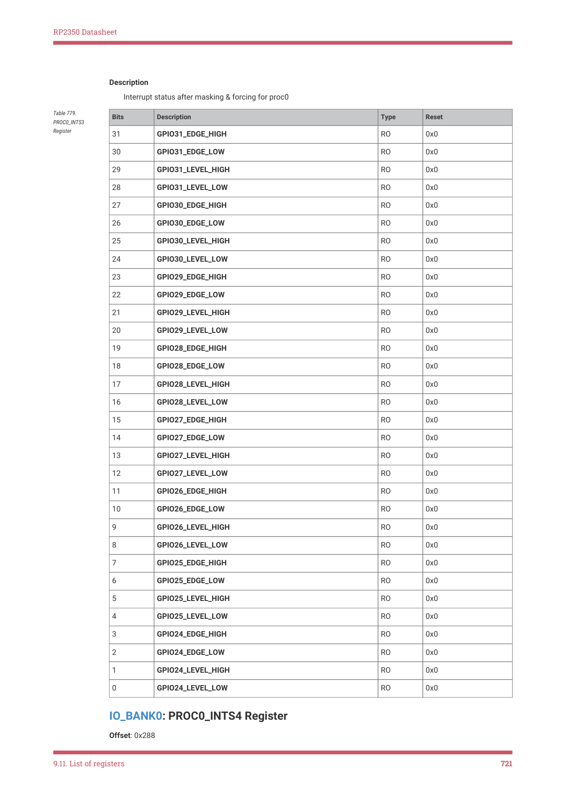

RP2350 Datasheet

Description

Interrupt status after masking & forcing for proc0

| Bits | Description | Type | Reset |
| --- | --- | --- | --- |
| 31 | GPIO31_EDGE_HIGH | RO | 0x0 |
| 30 | GPIO31_EDGE_LOW | RO | 0x0 |
| 29 | GPIO31_LEVEL_HIGH | RO | 0x0 |
| 28 | GPIO31_LEVEL_LOW | RO | 0x0 |
| 27 | GPIO30_EDGE_HIGH | RO | 0x0 |
| 26 | GPIO30_EDGE_LOW | RO | 0x0 |
| 25 | GPIO30_LEVEL_HIGH | RO | 0x0 |
| 24 | GPIO30_LEVEL_LOW | RO | 0x0 |
| 23 | GPIO29_EDGE_HIGH | RO | 0x0 |
| 22 | GPIO29_EDGE_LOW | RO | 0x0 |
| 21 | GPIO29_LEVEL_HIGH | RO | 0x0 |
| 20 | GPIO29_LEVEL_LOW | RO | 0x0 |
| 19 | GPIO28_EDGE_HIGH | RO | 0x0 |
| 18 | GPIO28_EDGE_LOW | RO | 0x0 |
| 17 | GPIO28_LEVEL_HIGH | RO | 0x0 |
| 16 | GPIO28_LEVEL_LOW | RO | 0x0 |
| 15 | GPIO27_EDGE_HIGH | RO | 0x0 |
| 14 | GPIO27_EDGE_LOW | RO | 0x0 |
| 13 | GPIO27_LEVEL_HIGH | RO | 0x0 |
| 12 | GPIO27_LEVEL_LOW | RO | 0x0 |
| 11 | GPIO26_EDGE_HIGH | RO | 0x0 |
| 10 | GPIO26_EDGE_LOW | RO | 0x0 |
| 9 | GPIO26_LEVEL_HIGH | RO | 0x0 |
| 8 | GPIO26_LEVEL_LOW | RO | 0x0 |
| 7 | GPIO25_EDGE_HIGH | RO | 0x0 |
| 6 | GPIO25_EDGE_LOW | RO | 0x0 |
| 5 | GPIO25_LEVEL_HIGH | RO | 0x0 |
| 4 | GPIO25_LEVEL_LOW | RO | 0x0 |
| 3 | GPIO24_EDGE_HIGH | RO | 0x0 |
| 2 | GPIO24_EDGE_LOW | RO | 0x0 |
| 1 | GPIO24_LEVEL_HIGH | RO | 0x0 |
| 0 | GPIO24_LEVEL_LOW | RO | 0x0 |

Table 779.

PROC0_INTS3

Register

IO_BANK0: PROC0_INTS4 Register

Offset: 0x288

9.11. List of registers
721

RP2350 Datasheet

Description

Interrupt status after masking & forcing for proc0

| Bits | Description | Type | Reset |
| --- | --- | --- | --- |
| 31 | GPIO39_EDGE_HIGH | RO | 0x0 |
| 30 | GPIO39_EDGE_LOW | RO | 0x0 |
| 29 | GPIO39_LEVEL_HIGH | RO | 0x0 |
| 28 | GPIO39_LEVEL_LOW | RO | 0x0 |
| 27 | GPIO38_EDGE_HIGH | RO | 0x0 |
| 26 | GPIO38_EDGE_LOW | RO | 0x0 |
| 25 | GPIO38_LEVEL_HIGH | RO | 0x0 |
| 24 | GPIO38_LEVEL_LOW | RO | 0x0 |
| 23 | GPIO37_EDGE_HIGH | RO | 0x0 |
| 22 | GPIO37_EDGE_LOW | RO | 0x0 |
| 21 | GPIO37_LEVEL_HIGH | RO | 0x0 |
| 20 | GPIO37_LEVEL_LOW | RO | 0x0 |
| 19 | GPIO36_EDGE_HIGH | RO | 0x0 |
| 18 | GPIO36_EDGE_LOW | RO | 0x0 |
| 17 | GPIO36_LEVEL_HIGH | RO | 0x0 |
| 16 | GPIO36_LEVEL_LOW | RO | 0x0 |
| 15 | GPIO35_EDGE_HIGH | RO | 0x0 |
| 14 | GPIO35_EDGE_LOW | RO | 0x0 |
| 13 | GPIO35_LEVEL_HIGH | RO | 0x0 |
| 12 | GPIO35_LEVEL_LOW | RO | 0x0 |
| 11 | GPIO34_EDGE_HIGH | RO | 0x0 |
| 10 | GPIO34_EDGE_LOW | RO | 0x0 |
| 9 | GPIO34_LEVEL_HIGH | RO | 0x0 |
| 8 | GPIO34_LEVEL_LOW | RO | 0x0 |
| 7 | GPIO33_EDGE_HIGH | RO | 0x0 |
| 6 | GPIO33_EDGE_LOW | RO | 0x0 |
| 5 | GPIO33_LEVEL_HIGH | RO | 0x0 |
| 4 | GPIO33_LEVEL_LOW | RO | 0x0 |
| 3 | GPIO32_EDGE_HIGH | RO | 0x0 |
| 2 | GPIO32_EDGE_LOW | RO | 0x0 |
| 1 | GPIO32_LEVEL_HIGH | RO | 0x0 |
| 0 | GPIO32_LEVEL_LOW | RO | 0x0 |

Table 780.

PROC0_INTS4

Register

IO_BANK0: PROC0_INTS5 Register

Offset: 0x28c

9.11. List of registers
722

RP2350 Datasheet

Description

Interrupt status after masking & forcing for proc0

| Bits | Description | Type | Reset |
| --- | --- | --- | --- |
| 31 | GPIO47_EDGE_HIGH | RO | 0x0 |
| 30 | GPIO47_EDGE_LOW | RO | 0x0 |
| 29 | GPIO47_LEVEL_HIGH | RO | 0x0 |
| 28 | GPIO47_LEVEL_LOW | RO | 0x0 |
| 27 | GPIO46_EDGE_HIGH | RO | 0x0 |
| 26 | GPIO46_EDGE_LOW | RO | 0x0 |
| 25 | GPIO46_LEVEL_HIGH | RO | 0x0 |
| 24 | GPIO46_LEVEL_LOW | RO | 0x0 |
| 23 | GPIO45_EDGE_HIGH | RO | 0x0 |
| 22 | GPIO45_EDGE_LOW | RO | 0x0 |
| 21 | GPIO45_LEVEL_HIGH | RO | 0x0 |
| 20 | GPIO45_LEVEL_LOW | RO | 0x0 |
| 19 | GPIO44_EDGE_HIGH | RO | 0x0 |
| 18 | GPIO44_EDGE_LOW | RO | 0x0 |
| 17 | GPIO44_LEVEL_HIGH | RO | 0x0 |
| 16 | GPIO44_LEVEL_LOW | RO | 0x0 |
| 15 | GPIO43_EDGE_HIGH | RO | 0x0 |
| 14 | GPIO43_EDGE_LOW | RO | 0x0 |
| 13 | GPIO43_LEVEL_HIGH | RO | 0x0 |
| 12 | GPIO43_LEVEL_LOW | RO | 0x0 |
| 11 | GPIO42_EDGE_HIGH | RO | 0x0 |
| 10 | GPIO42_EDGE_LOW | RO | 0x0 |
| 9 | GPIO42_LEVEL_HIGH | RO | 0x0 |
| 8 | GPIO42_LEVEL_LOW | RO | 0x0 |
| 7 | GPIO41_EDGE_HIGH | RO | 0x0 |
| 6 | GPIO41_EDGE_LOW | RO | 0x0 |
| 5 | GPIO41_LEVEL_HIGH | RO | 0x0 |
| 4 | GPIO41_LEVEL_LOW | RO | 0x0 |
| 3 | GPIO40_EDGE_HIGH | RO | 0x0 |
| 2 | GPIO40_EDGE_LOW | RO | 0x0 |
| 1 | GPIO40_LEVEL_HIGH | RO | 0x0 |
| 0 | GPIO40_LEVEL_LOW | RO | 0x0 |

Table 781.

PROC0_INTS5

Register

IO_BANK0: PROC1_INTE0 Register

Offset: 0x290

9.11. List of registers
723

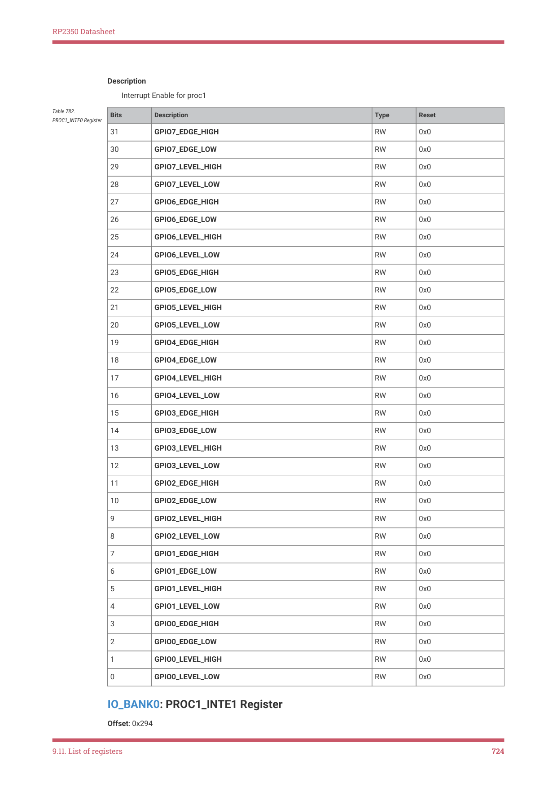

RP2350 Datasheet

Description

Interrupt Enable for proc1

| Bits | Description | Type | Reset |
| --- | --- | --- | --- |
| 31 | GPIO7_EDGE_HIGH | RW | 0x0 |
| 30 | GPIO7_EDGE_LOW | RW | 0x0 |
| 29 | GPIO7_LEVEL_HIGH | RW | 0x0 |
| 28 | GPIO7_LEVEL_LOW | RW | 0x0 |
| 27 | GPIO6_EDGE_HIGH | RW | 0x0 |
| 26 | GPIO6_EDGE_LOW | RW | 0x0 |
| 25 | GPIO6_LEVEL_HIGH | RW | 0x0 |
| 24 | GPIO6_LEVEL_LOW | RW | 0x0 |
| 23 | GPIO5_EDGE_HIGH | RW | 0x0 |
| 22 | GPIO5_EDGE_LOW | RW | 0x0 |
| 21 | GPIO5_LEVEL_HIGH | RW | 0x0 |
| 20 | GPIO5_LEVEL_LOW | RW | 0x0 |
| 19 | GPIO4_EDGE_HIGH | RW | 0x0 |
| 18 | GPIO4_EDGE_LOW | RW | 0x0 |
| 17 | GPIO4_LEVEL_HIGH | RW | 0x0 |
| 16 | GPIO4_LEVEL_LOW | RW | 0x0 |
| 15 | GPIO3_EDGE_HIGH | RW | 0x0 |
| 14 | GPIO3_EDGE_LOW | RW | 0x0 |
| 13 | GPIO3_LEVEL_HIGH | RW | 0x0 |
| 12 | GPIO3_LEVEL_LOW | RW | 0x0 |
| 11 | GPIO2_EDGE_HIGH | RW | 0x0 |
| 10 | GPIO2_EDGE_LOW | RW | 0x0 |
| 9 | GPIO2_LEVEL_HIGH | RW | 0x0 |
| 8 | GPIO2_LEVEL_LOW | RW | 0x0 |
| 7 | GPIO1_EDGE_HIGH | RW | 0x0 |
| 6 | GPIO1_EDGE_LOW | RW | 0x0 |
| 5 | GPIO1_LEVEL_HIGH | RW | 0x0 |
| 4 | GPIO1_LEVEL_LOW | RW | 0x0 |
| 3 | GPIO0_EDGE_HIGH | RW | 0x0 |
| 2 | GPIO0_EDGE_LOW | RW | 0x0 |
| 1 | GPIO0_LEVEL_HIGH | RW | 0x0 |
| 0 | GPIO0_LEVEL_LOW | RW | 0x0 |

Table 782.

IO_BANK0: PROC1_INTE1 Register

Offset: 0x294

9.11. List of registers
724

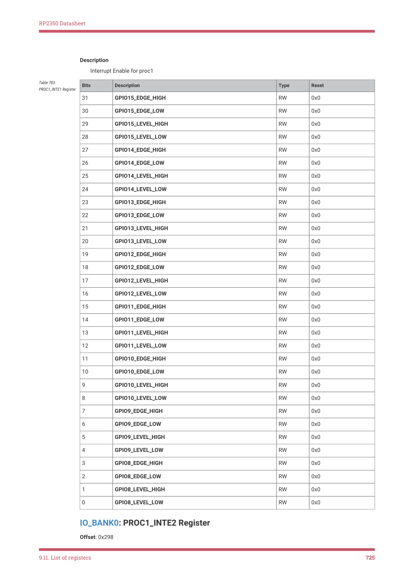

RP2350 Datasheet

Description

Interrupt Enable for proc1

| Bits | Description | Type | Reset |
| --- | --- | --- | --- |
| 31 | GPIO15_EDGE_HIGH | RW | 0x0 |
| 30 | GPIO15_EDGE_LOW | RW | 0x0 |
| 29 | GPIO15_LEVEL_HIGH | RW | 0x0 |
| 28 | GPIO15_LEVEL_LOW | RW | 0x0 |
| 27 | GPIO14_EDGE_HIGH | RW | 0x0 |
| 26 | GPIO14_EDGE_LOW | RW | 0x0 |
| 25 | GPIO14_LEVEL_HIGH | RW | 0x0 |
| 24 | GPIO14_LEVEL_LOW | RW | 0x0 |
| 23 | GPIO13_EDGE_HIGH | RW | 0x0 |
| 22 | GPIO13_EDGE_LOW | RW | 0x0 |
| 21 | GPIO13_LEVEL_HIGH | RW | 0x0 |
| 20 | GPIO13_LEVEL_LOW | RW | 0x0 |
| 19 | GPIO12_EDGE_HIGH | RW | 0x0 |
| 18 | GPIO12_EDGE_LOW | RW | 0x0 |
| 17 | GPIO12_LEVEL_HIGH | RW | 0x0 |
| 16 | GPIO12_LEVEL_LOW | RW | 0x0 |
| 15 | GPIO11_EDGE_HIGH | RW | 0x0 |
| 14 | GPIO11_EDGE_LOW | RW | 0x0 |
| 13 | GPIO11_LEVEL_HIGH | RW | 0x0 |
| 12 | GPIO11_LEVEL_LOW | RW | 0x0 |
| 11 | GPIO10_EDGE_HIGH | RW | 0x0 |
| 10 | GPIO10_EDGE_LOW | RW | 0x0 |
| 9 | GPIO10_LEVEL_HIGH | RW | 0x0 |
| 8 | GPIO10_LEVEL_LOW | RW | 0x0 |
| 7 | GPIO9_EDGE_HIGH | RW | 0x0 |
| 6 | GPIO9_EDGE_LOW | RW | 0x0 |
| 5 | GPIO9_LEVEL_HIGH | RW | 0x0 |
| 4 | GPIO9_LEVEL_LOW | RW | 0x0 |
| 3 | GPIO8_EDGE_HIGH | RW | 0x0 |
| 2 | GPIO8_EDGE_LOW | RW | 0x0 |
| 1 | GPIO8_LEVEL_HIGH | RW | 0x0 |
| 0 | GPIO8_LEVEL_LOW | RW | 0x0 |

Table 783.

IO_BANK0: PROC1_INTE2 Register

Offset: 0x298

9.11. List of registers
725

RP2350 Datasheet

Description

Interrupt Enable for proc1

| Bits | Description | Type | Reset |
| --- | --- | --- | --- |
| 31 | GPIO23_EDGE_HIGH | RW | 0x0 |
| 30 | GPIO23_EDGE_LOW | RW | 0x0 |
| 29 | GPIO23_LEVEL_HIGH | RW | 0x0 |
| 28 | GPIO23_LEVEL_LOW | RW | 0x0 |
| 27 | GPIO22_EDGE_HIGH | RW | 0x0 |
| 26 | GPIO22_EDGE_LOW | RW | 0x0 |
| 25 | GPIO22_LEVEL_HIGH | RW | 0x0 |
| 24 | GPIO22_LEVEL_LOW | RW | 0x0 |
| 23 | GPIO21_EDGE_HIGH | RW | 0x0 |
| 22 | GPIO21_EDGE_LOW | RW | 0x0 |
| 21 | GPIO21_LEVEL_HIGH | RW | 0x0 |
| 20 | GPIO21_LEVEL_LOW | RW | 0x0 |
| 19 | GPIO20_EDGE_HIGH | RW | 0x0 |
| 18 | GPIO20_EDGE_LOW | RW | 0x0 |
| 17 | GPIO20_LEVEL_HIGH | RW | 0x0 |
| 16 | GPIO20_LEVEL_LOW | RW | 0x0 |
| 15 | GPIO19_EDGE_HIGH | RW | 0x0 |
| 14 | GPIO19_EDGE_LOW | RW | 0x0 |
| 13 | GPIO19_LEVEL_HIGH | RW | 0x0 |
| 12 | GPIO19_LEVEL_LOW | RW | 0x0 |
| 11 | GPIO18_EDGE_HIGH | RW | 0x0 |
| 10 | GPIO18_EDGE_LOW | RW | 0x0 |
| 9 | GPIO18_LEVEL_HIGH | RW | 0x0 |
| 8 | GPIO18_LEVEL_LOW | RW | 0x0 |
| 7 | GPIO17_EDGE_HIGH | RW | 0x0 |
| 6 | GPIO17_EDGE_LOW | RW | 0x0 |
| 5 | GPIO17_LEVEL_HIGH | RW | 0x0 |
| 4 | GPIO17_LEVEL_LOW | RW | 0x0 |
| 3 | GPIO16_EDGE_HIGH | RW | 0x0 |
| 2 | GPIO16_EDGE_LOW | RW | 0x0 |
| 1 | GPIO16_LEVEL_HIGH | RW | 0x0 |
| 0 | GPIO16_LEVEL_LOW | RW | 0x0 |

Table 784.

IO_BANK0: PROC1_INTE3 Register

Offset: 0x29c

9.11. List of registers
726

RP2350 Datasheet

Description

Interrupt Enable for proc1

| Bits | Description | Type | Reset |
| --- | --- | --- | --- |
| 31 | GPIO31_EDGE_HIGH | RW | 0x0 |
| 30 | GPIO31_EDGE_LOW | RW | 0x0 |
| 29 | GPIO31_LEVEL_HIGH | RW | 0x0 |
| 28 | GPIO31_LEVEL_LOW | RW | 0x0 |
| 27 | GPIO30_EDGE_HIGH | RW | 0x0 |
| 26 | GPIO30_EDGE_LOW | RW | 0x0 |
| 25 | GPIO30_LEVEL_HIGH | RW | 0x0 |
| 24 | GPIO30_LEVEL_LOW | RW | 0x0 |
| 23 | GPIO29_EDGE_HIGH | RW | 0x0 |
| 22 | GPIO29_EDGE_LOW | RW | 0x0 |
| 21 | GPIO29_LEVEL_HIGH | RW | 0x0 |
| 20 | GPIO29_LEVEL_LOW | RW | 0x0 |
| 19 | GPIO28_EDGE_HIGH | RW | 0x0 |
| 18 | GPIO28_EDGE_LOW | RW | 0x0 |
| 17 | GPIO28_LEVEL_HIGH | RW | 0x0 |
| 16 | GPIO28_LEVEL_LOW | RW | 0x0 |
| 15 | GPIO27_EDGE_HIGH | RW | 0x0 |
| 14 | GPIO27_EDGE_LOW | RW | 0x0 |
| 13 | GPIO27_LEVEL_HIGH | RW | 0x0 |
| 12 | GPIO27_LEVEL_LOW | RW | 0x0 |
| 11 | GPIO26_EDGE_HIGH | RW | 0x0 |
| 10 | GPIO26_EDGE_LOW | RW | 0x0 |
| 9 | GPIO26_LEVEL_HIGH | RW | 0x0 |
| 8 | GPIO26_LEVEL_LOW | RW | 0x0 |
| 7 | GPIO25_EDGE_HIGH | RW | 0x0 |
| 6 | GPIO25_EDGE_LOW | RW | 0x0 |
| 5 | GPIO25_LEVEL_HIGH | RW | 0x0 |
| 4 | GPIO25_LEVEL_LOW | RW | 0x0 |
| 3 | GPIO24_EDGE_HIGH | RW | 0x0 |
| 2 | GPIO24_EDGE_LOW | RW | 0x0 |
| 1 | GPIO24_LEVEL_HIGH | RW | 0x0 |
| 0 | GPIO24_LEVEL_LOW | RW | 0x0 |

Table 785.

IO_BANK0: PROC1_INTE4 Register

Offset: 0x2a0

9.11. List of registers
727

RP2350 Datasheet

Description

Interrupt Enable for proc1

| Bits | Description | Type | Reset |
| --- | --- | --- | --- |
| 31 | GPIO39_EDGE_HIGH | RW | 0x0 |
| 30 | GPIO39_EDGE_LOW | RW | 0x0 |
| 29 | GPIO39_LEVEL_HIGH | RW | 0x0 |
| 28 | GPIO39_LEVEL_LOW | RW | 0x0 |
| 27 | GPIO38_EDGE_HIGH | RW | 0x0 |
| 26 | GPIO38_EDGE_LOW | RW | 0x0 |
| 25 | GPIO38_LEVEL_HIGH | RW | 0x0 |
| 24 | GPIO38_LEVEL_LOW | RW | 0x0 |
| 23 | GPIO37_EDGE_HIGH | RW | 0x0 |
| 22 | GPIO37_EDGE_LOW | RW | 0x0 |
| 21 | GPIO37_LEVEL_HIGH | RW | 0x0 |
| 20 | GPIO37_LEVEL_LOW | RW | 0x0 |
| 19 | GPIO36_EDGE_HIGH | RW | 0x0 |
| 18 | GPIO36_EDGE_LOW | RW | 0x0 |
| 17 | GPIO36_LEVEL_HIGH | RW | 0x0 |
| 16 | GPIO36_LEVEL_LOW | RW | 0x0 |
| 15 | GPIO35_EDGE_HIGH | RW | 0x0 |
| 14 | GPIO35_EDGE_LOW | RW | 0x0 |
| 13 | GPIO35_LEVEL_HIGH | RW | 0x0 |
| 12 | GPIO35_LEVEL_LOW | RW | 0x0 |
| 11 | GPIO34_EDGE_HIGH | RW | 0x0 |
| 10 | GPIO34_EDGE_LOW | RW | 0x0 |
| 9 | GPIO34_LEVEL_HIGH | RW | 0x0 |
| 8 | GPIO34_LEVEL_LOW | RW | 0x0 |
| 7 | GPIO33_EDGE_HIGH | RW | 0x0 |
| 6 | GPIO33_EDGE_LOW | RW | 0x0 |
| 5 | GPIO33_LEVEL_HIGH | RW | 0x0 |
| 4 | GPIO33_LEVEL_LOW | RW | 0x0 |
| 3 | GPIO32_EDGE_HIGH | RW | 0x0 |
| 2 | GPIO32_EDGE_LOW | RW | 0x0 |
| 1 | GPIO32_LEVEL_HIGH | RW | 0x0 |
| 0 | GPIO32_LEVEL_LOW | RW | 0x0 |

Table 786.

IO_BANK0: PROC1_INTE5 Register

Offset: 0x2a4

9.11. List of registers
728

RP2350 Datasheet

Description

Interrupt Enable for proc1

| Bits | Description | Type | Reset |
| --- | --- | --- | --- |
| 31 | GPIO47_EDGE_HIGH | RW | 0x0 |
| 30 | GPIO47_EDGE_LOW | RW | 0x0 |
| 29 | GPIO47_LEVEL_HIGH | RW | 0x0 |
| 28 | GPIO47_LEVEL_LOW | RW | 0x0 |
| 27 | GPIO46_EDGE_HIGH | RW | 0x0 |
| 26 | GPIO46_EDGE_LOW | RW | 0x0 |
| 25 | GPIO46_LEVEL_HIGH | RW | 0x0 |
| 24 | GPIO46_LEVEL_LOW | RW | 0x0 |
| 23 | GPIO45_EDGE_HIGH | RW | 0x0 |
| 22 | GPIO45_EDGE_LOW | RW | 0x0 |
| 21 | GPIO45_LEVEL_HIGH | RW | 0x0 |
| 20 | GPIO45_LEVEL_LOW | RW | 0x0 |
| 19 | GPIO44_EDGE_HIGH | RW | 0x0 |
| 18 | GPIO44_EDGE_LOW | RW | 0x0 |
| 17 | GPIO44_LEVEL_HIGH | RW | 0x0 |
| 16 | GPIO44_LEVEL_LOW | RW | 0x0 |
| 15 | GPIO43_EDGE_HIGH | RW | 0x0 |
| 14 | GPIO43_EDGE_LOW | RW | 0x0 |
| 13 | GPIO43_LEVEL_HIGH | RW | 0x0 |
| 12 | GPIO43_LEVEL_LOW | RW | 0x0 |
| 11 | GPIO42_EDGE_HIGH | RW | 0x0 |
| 10 | GPIO42_EDGE_LOW | RW | 0x0 |
| 9 | GPIO42_LEVEL_HIGH | RW | 0x0 |
| 8 | GPIO42_LEVEL_LOW | RW | 0x0 |
| 7 | GPIO41_EDGE_HIGH | RW | 0x0 |
| 6 | GPIO41_EDGE_LOW | RW | 0x0 |
| 5 | GPIO41_LEVEL_HIGH | RW | 0x0 |
| 4 | GPIO41_LEVEL_LOW | RW | 0x0 |
| 3 | GPIO40_EDGE_HIGH | RW | 0x0 |
| 2 | GPIO40_EDGE_LOW | RW | 0x0 |
| 1 | GPIO40_LEVEL_HIGH | RW | 0x0 |
| 0 | GPIO40_LEVEL_LOW | RW | 0x0 |

Table 787.

IO_BANK0: PROC1_INTF0 Register

Offset: 0x2a8

9.11. List of registers
729

RP2350 Datasheet

Description

Interrupt Force for proc1

| Bits | Description | Type | Reset |
| --- | --- | --- | --- |
| 31 | GPIO7_EDGE_HIGH | RW | 0x0 |
| 30 | GPIO7_EDGE_LOW | RW | 0x0 |
| 29 | GPIO7_LEVEL_HIGH | RW | 0x0 |
| 28 | GPIO7_LEVEL_LOW | RW | 0x0 |
| 27 | GPIO6_EDGE_HIGH | RW | 0x0 |
| 26 | GPIO6_EDGE_LOW | RW | 0x0 |
| 25 | GPIO6_LEVEL_HIGH | RW | 0x0 |
| 24 | GPIO6_LEVEL_LOW | RW | 0x0 |
| 23 | GPIO5_EDGE_HIGH | RW | 0x0 |
| 22 | GPIO5_EDGE_LOW | RW | 0x0 |
| 21 | GPIO5_LEVEL_HIGH | RW | 0x0 |
| 20 | GPIO5_LEVEL_LOW | RW | 0x0 |
| 19 | GPIO4_EDGE_HIGH | RW | 0x0 |
| 18 | GPIO4_EDGE_LOW | RW | 0x0 |
| 17 | GPIO4_LEVEL_HIGH | RW | 0x0 |
| 16 | GPIO4_LEVEL_LOW | RW | 0x0 |
| 15 | GPIO3_EDGE_HIGH | RW | 0x0 |
| 14 | GPIO3_EDGE_LOW | RW | 0x0 |
| 13 | GPIO3_LEVEL_HIGH | RW | 0x0 |
| 12 | GPIO3_LEVEL_LOW | RW | 0x0 |
| 11 | GPIO2_EDGE_HIGH | RW | 0x0 |
| 10 | GPIO2_EDGE_LOW | RW | 0x0 |
| 9 | GPIO2_LEVEL_HIGH | RW | 0x0 |
| 8 | GPIO2_LEVEL_LOW | RW | 0x0 |
| 7 | GPIO1_EDGE_HIGH | RW | 0x0 |
| 6 | GPIO1_EDGE_LOW | RW | 0x0 |
| 5 | GPIO1_LEVEL_HIGH | RW | 0x0 |
| 4 | GPIO1_LEVEL_LOW | RW | 0x0 |
| 3 | GPIO0_EDGE_HIGH | RW | 0x0 |
| 2 | GPIO0_EDGE_LOW | RW | 0x0 |
| 1 | GPIO0_LEVEL_HIGH | RW | 0x0 |
| 0 | GPIO0_LEVEL_LOW | RW | 0x0 |

Table 788.

IO_BANK0: PROC1_INTF1 Register

Offset: 0x2ac

9.11. List of registers
730

RP2350 Datasheet

Description

Interrupt Force for proc1

| Bits | Description | Type | Reset |
| --- | --- | --- | --- |
| 31 | GPIO15_EDGE_HIGH | RW | 0x0 |
| 30 | GPIO15_EDGE_LOW | RW | 0x0 |
| 29 | GPIO15_LEVEL_HIGH | RW | 0x0 |
| 28 | GPIO15_LEVEL_LOW | RW | 0x0 |
| 27 | GPIO14_EDGE_HIGH | RW | 0x0 |
| 26 | GPIO14_EDGE_LOW | RW | 0x0 |
| 25 | GPIO14_LEVEL_HIGH | RW | 0x0 |
| 24 | GPIO14_LEVEL_LOW | RW | 0x0 |
| 23 | GPIO13_EDGE_HIGH | RW | 0x0 |
| 22 | GPIO13_EDGE_LOW | RW | 0x0 |
| 21 | GPIO13_LEVEL_HIGH | RW | 0x0 |
| 20 | GPIO13_LEVEL_LOW | RW | 0x0 |
| 19 | GPIO12_EDGE_HIGH | RW | 0x0 |
| 18 | GPIO12_EDGE_LOW | RW | 0x0 |
| 17 | GPIO12_LEVEL_HIGH | RW | 0x0 |
| 16 | GPIO12_LEVEL_LOW | RW | 0x0 |
| 15 | GPIO11_EDGE_HIGH | RW | 0x0 |
| 14 | GPIO11_EDGE_LOW | RW | 0x0 |
| 13 | GPIO11_LEVEL_HIGH | RW | 0x0 |
| 12 | GPIO11_LEVEL_LOW | RW | 0x0 |
| 11 | GPIO10_EDGE_HIGH | RW | 0x0 |
| 10 | GPIO10_EDGE_LOW | RW | 0x0 |
| 9 | GPIO10_LEVEL_HIGH | RW | 0x0 |
| 8 | GPIO10_LEVEL_LOW | RW | 0x0 |
| 7 | GPIO9_EDGE_HIGH | RW | 0x0 |
| 6 | GPIO9_EDGE_LOW | RW | 0x0 |
| 5 | GPIO9_LEVEL_HIGH | RW | 0x0 |
| 4 | GPIO9_LEVEL_LOW | RW | 0x0 |
| 3 | GPIO8_EDGE_HIGH | RW | 0x0 |
| 2 | GPIO8_EDGE_LOW | RW | 0x0 |
| 1 | GPIO8_LEVEL_HIGH | RW | 0x0 |
| 0 | GPIO8_LEVEL_LOW | RW | 0x0 |

Table 789.

IO_BANK0: PROC1_INTF2 Register

Offset: 0x2b0

9.11. List of registers
731

RP2350 Datasheet

Description

Interrupt Force for proc1

| Bits | Description | Type | Reset |
| --- | --- | --- | --- |
| 31 | GPIO23_EDGE_HIGH | RW | 0x0 |
| 30 | GPIO23_EDGE_LOW | RW | 0x0 |
| 29 | GPIO23_LEVEL_HIGH | RW | 0x0 |
| 28 | GPIO23_LEVEL_LOW | RW | 0x0 |
| 27 | GPIO22_EDGE_HIGH | RW | 0x0 |
| 26 | GPIO22_EDGE_LOW | RW | 0x0 |
| 25 | GPIO22_LEVEL_HIGH | RW | 0x0 |
| 24 | GPIO22_LEVEL_LOW | RW | 0x0 |
| 23 | GPIO21_EDGE_HIGH | RW | 0x0 |
| 22 | GPIO21_EDGE_LOW | RW | 0x0 |
| 21 | GPIO21_LEVEL_HIGH | RW | 0x0 |
| 20 | GPIO21_LEVEL_LOW | RW | 0x0 |
| 19 | GPIO20_EDGE_HIGH | RW | 0x0 |
| 18 | GPIO20_EDGE_LOW | RW | 0x0 |
| 17 | GPIO20_LEVEL_HIGH | RW | 0x0 |
| 16 | GPIO20_LEVEL_LOW | RW | 0x0 |
| 15 | GPIO19_EDGE_HIGH | RW | 0x0 |
| 14 | GPIO19_EDGE_LOW | RW | 0x0 |
| 13 | GPIO19_LEVEL_HIGH | RW | 0x0 |
| 12 | GPIO19_LEVEL_LOW | RW | 0x0 |
| 11 | GPIO18_EDGE_HIGH | RW | 0x0 |
| 10 | GPIO18_EDGE_LOW | RW | 0x0 |
| 9 | GPIO18_LEVEL_HIGH | RW | 0x0 |
| 8 | GPIO18_LEVEL_LOW | RW | 0x0 |
| 7 | GPIO17_EDGE_HIGH | RW | 0x0 |
| 6 | GPIO17_EDGE_LOW | RW | 0x0 |
| 5 | GPIO17_LEVEL_HIGH | RW | 0x0 |
| 4 | GPIO17_LEVEL_LOW | RW | 0x0 |
| 3 | GPIO16_EDGE_HIGH | RW | 0x0 |
| 2 | GPIO16_EDGE_LOW | RW | 0x0 |
| 1 | GPIO16_LEVEL_HIGH | RW | 0x0 |
| 0 | GPIO16_LEVEL_LOW | RW | 0x0 |

Table 790.

IO_BANK0: PROC1_INTF3 Register

Offset: 0x2b4

9.11. List of registers
732

RP2350 Datasheet

Description

Interrupt Force for proc1

| Bits | Description | Type | Reset |
| --- | --- | --- | --- |
| 31 | GPIO31_EDGE_HIGH | RW | 0x0 |
| 30 | GPIO31_EDGE_LOW | RW | 0x0 |
| 29 | GPIO31_LEVEL_HIGH | RW | 0x0 |
| 28 | GPIO31_LEVEL_LOW | RW | 0x0 |
| 27 | GPIO30_EDGE_HIGH | RW | 0x0 |
| 26 | GPIO30_EDGE_LOW | RW | 0x0 |
| 25 | GPIO30_LEVEL_HIGH | RW | 0x0 |
| 24 | GPIO30_LEVEL_LOW | RW | 0x0 |
| 23 | GPIO29_EDGE_HIGH | RW | 0x0 |
| 22 | GPIO29_EDGE_LOW | RW | 0x0 |
| 21 | GPIO29_LEVEL_HIGH | RW | 0x0 |
| 20 | GPIO29_LEVEL_LOW | RW | 0x0 |
| 19 | GPIO28_EDGE_HIGH | RW | 0x0 |
| 18 | GPIO28_EDGE_LOW | RW | 0x0 |
| 17 | GPIO28_LEVEL_HIGH | RW | 0x0 |
| 16 | GPIO28_LEVEL_LOW | RW | 0x0 |
| 15 | GPIO27_EDGE_HIGH | RW | 0x0 |
| 14 | GPIO27_EDGE_LOW | RW | 0x0 |
| 13 | GPIO27_LEVEL_HIGH | RW | 0x0 |
| 12 | GPIO27_LEVEL_LOW | RW | 0x0 |
| 11 | GPIO26_EDGE_HIGH | RW | 0x0 |
| 10 | GPIO26_EDGE_LOW | RW | 0x0 |
| 9 | GPIO26_LEVEL_HIGH | RW | 0x0 |
| 8 | GPIO26_LEVEL_LOW | RW | 0x0 |
| 7 | GPIO25_EDGE_HIGH | RW | 0x0 |
| 6 | GPIO25_EDGE_LOW | RW | 0x0 |
| 5 | GPIO25_LEVEL_HIGH | RW | 0x0 |
| 4 | GPIO25_LEVEL_LOW | RW | 0x0 |
| 3 | GPIO24_EDGE_HIGH | RW | 0x0 |
| 2 | GPIO24_EDGE_LOW | RW | 0x0 |
| 1 | GPIO24_LEVEL_HIGH | RW | 0x0 |
| 0 | GPIO24_LEVEL_LOW | RW | 0x0 |

Table 791.

IO_BANK0: PROC1_INTF4 Register

Offset: 0x2b8

9.11. List of registers
733

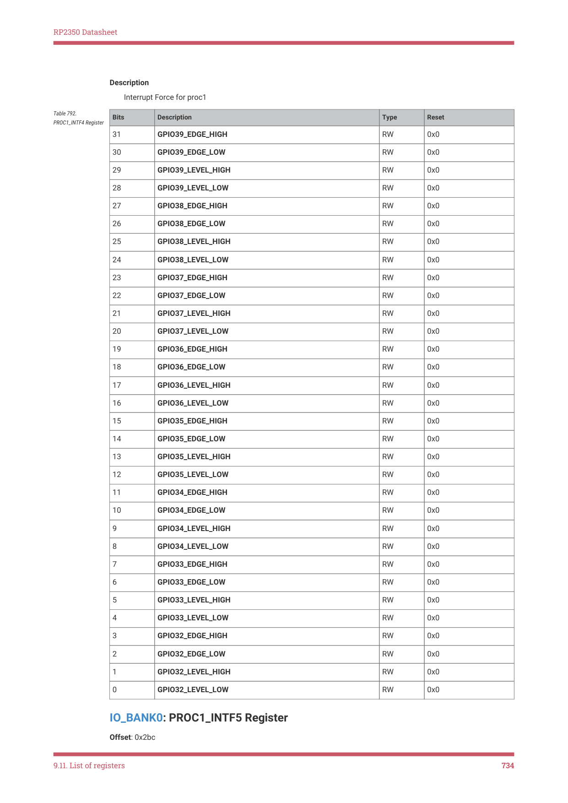

RP2350 Datasheet

Description

Interrupt Force for proc1

| Bits | Description | Type | Reset |
| --- | --- | --- | --- |
| 31 | GPIO39_EDGE_HIGH | RW | 0x0 |
| 30 | GPIO39_EDGE_LOW | RW | 0x0 |
| 29 | GPIO39_LEVEL_HIGH | RW | 0x0 |
| 28 | GPIO39_LEVEL_LOW | RW | 0x0 |
| 27 | GPIO38_EDGE_HIGH | RW | 0x0 |
| 26 | GPIO38_EDGE_LOW | RW | 0x0 |
| 25 | GPIO38_LEVEL_HIGH | RW | 0x0 |
| 24 | GPIO38_LEVEL_LOW | RW | 0x0 |
| 23 | GPIO37_EDGE_HIGH | RW | 0x0 |
| 22 | GPIO37_EDGE_LOW | RW | 0x0 |
| 21 | GPIO37_LEVEL_HIGH | RW | 0x0 |
| 20 | GPIO37_LEVEL_LOW | RW | 0x0 |
| 19 | GPIO36_EDGE_HIGH | RW | 0x0 |
| 18 | GPIO36_EDGE_LOW | RW | 0x0 |
| 17 | GPIO36_LEVEL_HIGH | RW | 0x0 |
| 16 | GPIO36_LEVEL_LOW | RW | 0x0 |
| 15 | GPIO35_EDGE_HIGH | RW | 0x0 |
| 14 | GPIO35_EDGE_LOW | RW | 0x0 |
| 13 | GPIO35_LEVEL_HIGH | RW | 0x0 |
| 12 | GPIO35_LEVEL_LOW | RW | 0x0 |
| 11 | GPIO34_EDGE_HIGH | RW | 0x0 |
| 10 | GPIO34_EDGE_LOW | RW | 0x0 |
| 9 | GPIO34_LEVEL_HIGH | RW | 0x0 |
| 8 | GPIO34_LEVEL_LOW | RW | 0x0 |
| 7 | GPIO33_EDGE_HIGH | RW | 0x0 |
| 6 | GPIO33_EDGE_LOW | RW | 0x0 |
| 5 | GPIO33_LEVEL_HIGH | RW | 0x0 |
| 4 | GPIO33_LEVEL_LOW | RW | 0x0 |
| 3 | GPIO32_EDGE_HIGH | RW | 0x0 |
| 2 | GPIO32_EDGE_LOW | RW | 0x0 |
| 1 | GPIO32_LEVEL_HIGH | RW | 0x0 |
| 0 | GPIO32_LEVEL_LOW | RW | 0x0 |

Table 792.

IO_BANK0: PROC1_INTF5 Register

Offset: 0x2bc

9.11. List of registers
734

RP2350 Datasheet

Description

Interrupt Force for proc1

| Bits | Description | Type | Reset |
| --- | --- | --- | --- |
| 31 | GPIO47_EDGE_HIGH | RW | 0x0 |
| 30 | GPIO47_EDGE_LOW | RW | 0x0 |
| 29 | GPIO47_LEVEL_HIGH | RW | 0x0 |
| 28 | GPIO47_LEVEL_LOW | RW | 0x0 |
| 27 | GPIO46_EDGE_HIGH | RW | 0x0 |
| 26 | GPIO46_EDGE_LOW | RW | 0x0 |
| 25 | GPIO46_LEVEL_HIGH | RW | 0x0 |
| 24 | GPIO46_LEVEL_LOW | RW | 0x0 |
| 23 | GPIO45_EDGE_HIGH | RW | 0x0 |
| 22 | GPIO45_EDGE_LOW | RW | 0x0 |
| 21 | GPIO45_LEVEL_HIGH | RW | 0x0 |
| 20 | GPIO45_LEVEL_LOW | RW | 0x0 |
| 19 | GPIO44_EDGE_HIGH | RW | 0x0 |
| 18 | GPIO44_EDGE_LOW | RW | 0x0 |
| 17 | GPIO44_LEVEL_HIGH | RW | 0x0 |
| 16 | GPIO44_LEVEL_LOW | RW | 0x0 |
| 15 | GPIO43_EDGE_HIGH | RW | 0x0 |
| 14 | GPIO43_EDGE_LOW | RW | 0x0 |
| 13 | GPIO43_LEVEL_HIGH | RW | 0x0 |
| 12 | GPIO43_LEVEL_LOW | RW | 0x0 |
| 11 | GPIO42_EDGE_HIGH | RW | 0x0 |
| 10 | GPIO42_EDGE_LOW | RW | 0x0 |
| 9 | GPIO42_LEVEL_HIGH | RW | 0x0 |
| 8 | GPIO42_LEVEL_LOW | RW | 0x0 |
| 7 | GPIO41_EDGE_HIGH | RW | 0x0 |
| 6 | GPIO41_EDGE_LOW | RW | 0x0 |
| 5 | GPIO41_LEVEL_HIGH | RW | 0x0 |
| 4 | GPIO41_LEVEL_LOW | RW | 0x0 |
| 3 | GPIO40_EDGE_HIGH | RW | 0x0 |
| 2 | GPIO40_EDGE_LOW | RW | 0x0 |
| 1 | GPIO40_LEVEL_HIGH | RW | 0x0 |
| 0 | GPIO40_LEVEL_LOW | RW | 0x0 |

Table 793.

IO_BANK0: PROC1_INTS0 Register

Offset: 0x2c0

9.11. List of registers
735

RP2350 Datasheet

Description

Interrupt status after masking & forcing for proc1

| Bits | Description | Type | Reset |
| --- | --- | --- | --- |
| 31 | GPIO7_EDGE_HIGH | RO | 0x0 |
| 30 | GPIO7_EDGE_LOW | RO | 0x0 |
| 29 | GPIO7_LEVEL_HIGH | RO | 0x0 |
| 28 | GPIO7_LEVEL_LOW | RO | 0x0 |
| 27 | GPIO6_EDGE_HIGH | RO | 0x0 |
| 26 | GPIO6_EDGE_LOW | RO | 0x0 |
| 25 | GPIO6_LEVEL_HIGH | RO | 0x0 |
| 24 | GPIO6_LEVEL_LOW | RO | 0x0 |
| 23 | GPIO5_EDGE_HIGH | RO | 0x0 |
| 22 | GPIO5_EDGE_LOW | RO | 0x0 |
| 21 | GPIO5_LEVEL_HIGH | RO | 0x0 |
| 20 | GPIO5_LEVEL_LOW | RO | 0x0 |
| 19 | GPIO4_EDGE_HIGH | RO | 0x0 |
| 18 | GPIO4_EDGE_LOW | RO | 0x0 |
| 17 | GPIO4_LEVEL_HIGH | RO | 0x0 |
| 16 | GPIO4_LEVEL_LOW | RO | 0x0 |
| 15 | GPIO3_EDGE_HIGH | RO | 0x0 |
| 14 | GPIO3_EDGE_LOW | RO | 0x0 |
| 13 | GPIO3_LEVEL_HIGH | RO | 0x0 |
| 12 | GPIO3_LEVEL_LOW | RO | 0x0 |
| 11 | GPIO2_EDGE_HIGH | RO | 0x0 |
| 10 | GPIO2_EDGE_LOW | RO | 0x0 |
| 9 | GPIO2_LEVEL_HIGH | RO | 0x0 |
| 8 | GPIO2_LEVEL_LOW | RO | 0x0 |
| 7 | GPIO1_EDGE_HIGH | RO | 0x0 |
| 6 | GPIO1_EDGE_LOW | RO | 0x0 |
| 5 | GPIO1_LEVEL_HIGH | RO | 0x0 |
| 4 | GPIO1_LEVEL_LOW | RO | 0x0 |
| 3 | GPIO0_EDGE_HIGH | RO | 0x0 |
| 2 | GPIO0_EDGE_LOW | RO | 0x0 |
| 1 | GPIO0_LEVEL_HIGH | RO | 0x0 |
| 0 | GPIO0_LEVEL_LOW | RO | 0x0 |

Table 794.

PROC1_INTS0

Register

IO_BANK0: PROC1_INTS1 Register

Offset: 0x2c4

9.11. List of registers
736

RP2350 Datasheet

Description

Interrupt status after masking & forcing for proc1

| Bits | Description | Type | Reset |
| --- | --- | --- | --- |
| 31 | GPIO15_EDGE_HIGH | RO | 0x0 |
| 30 | GPIO15_EDGE_LOW | RO | 0x0 |
| 29 | GPIO15_LEVEL_HIGH | RO | 0x0 |
| 28 | GPIO15_LEVEL_LOW | RO | 0x0 |
| 27 | GPIO14_EDGE_HIGH | RO | 0x0 |
| 26 | GPIO14_EDGE_LOW | RO | 0x0 |
| 25 | GPIO14_LEVEL_HIGH | RO | 0x0 |
| 24 | GPIO14_LEVEL_LOW | RO | 0x0 |
| 23 | GPIO13_EDGE_HIGH | RO | 0x0 |
| 22 | GPIO13_EDGE_LOW | RO | 0x0 |
| 21 | GPIO13_LEVEL_HIGH | RO | 0x0 |
| 20 | GPIO13_LEVEL_LOW | RO | 0x0 |
| 19 | GPIO12_EDGE_HIGH | RO | 0x0 |
| 18 | GPIO12_EDGE_LOW | RO | 0x0 |
| 17 | GPIO12_LEVEL_HIGH | RO | 0x0 |
| 16 | GPIO12_LEVEL_LOW | RO | 0x0 |
| 15 | GPIO11_EDGE_HIGH | RO | 0x0 |
| 14 | GPIO11_EDGE_LOW | RO | 0x0 |
| 13 | GPIO11_LEVEL_HIGH | RO | 0x0 |
| 12 | GPIO11_LEVEL_LOW | RO | 0x0 |
| 11 | GPIO10_EDGE_HIGH | RO | 0x0 |
| 10 | GPIO10_EDGE_LOW | RO | 0x0 |
| 9 | GPIO10_LEVEL_HIGH | RO | 0x0 |
| 8 | GPIO10_LEVEL_LOW | RO | 0x0 |
| 7 | GPIO9_EDGE_HIGH | RO | 0x0 |
| 6 | GPIO9_EDGE_LOW | RO | 0x0 |
| 5 | GPIO9_LEVEL_HIGH | RO | 0x0 |
| 4 | GPIO9_LEVEL_LOW | RO | 0x0 |
| 3 | GPIO8_EDGE_HIGH | RO | 0x0 |
| 2 | GPIO8_EDGE_LOW | RO | 0x0 |
| 1 | GPIO8_LEVEL_HIGH | RO | 0x0 |
| 0 | GPIO8_LEVEL_LOW | RO | 0x0 |

Table 795.

PROC1_INTS1

Register

IO_BANK0: PROC1_INTS2 Register

Offset: 0x2c8

9.11. List of registers
737

RP2350 Datasheet

Description

Interrupt status after masking & forcing for proc1

| Bits | Description | Type | Reset |
| --- | --- | --- | --- |
| 31 | GPIO23_EDGE_HIGH | RO | 0x0 |
| 30 | GPIO23_EDGE_LOW | RO | 0x0 |
| 29 | GPIO23_LEVEL_HIGH | RO | 0x0 |
| 28 | GPIO23_LEVEL_LOW | RO | 0x0 |
| 27 | GPIO22_EDGE_HIGH | RO | 0x0 |
| 26 | GPIO22_EDGE_LOW | RO | 0x0 |
| 25 | GPIO22_LEVEL_HIGH | RO | 0x0 |
| 24 | GPIO22_LEVEL_LOW | RO | 0x0 |
| 23 | GPIO21_EDGE_HIGH | RO | 0x0 |
| 22 | GPIO21_EDGE_LOW | RO | 0x0 |
| 21 | GPIO21_LEVEL_HIGH | RO | 0x0 |
| 20 | GPIO21_LEVEL_LOW | RO | 0x0 |
| 19 | GPIO20_EDGE_HIGH | RO | 0x0 |
| 18 | GPIO20_EDGE_LOW | RO | 0x0 |
| 17 | GPIO20_LEVEL_HIGH | RO | 0x0 |
| 16 | GPIO20_LEVEL_LOW | RO | 0x0 |
| 15 | GPIO19_EDGE_HIGH | RO | 0x0 |
| 14 | GPIO19_EDGE_LOW | RO | 0x0 |
| 13 | GPIO19_LEVEL_HIGH | RO | 0x0 |
| 12 | GPIO19_LEVEL_LOW | RO | 0x0 |
| 11 | GPIO18_EDGE_HIGH | RO | 0x0 |
| 10 | GPIO18_EDGE_LOW | RO | 0x0 |
| 9 | GPIO18_LEVEL_HIGH | RO | 0x0 |
| 8 | GPIO18_LEVEL_LOW | RO | 0x0 |
| 7 | GPIO17_EDGE_HIGH | RO | 0x0 |
| 6 | GPIO17_EDGE_LOW | RO | 0x0 |
| 5 | GPIO17_LEVEL_HIGH | RO | 0x0 |
| 4 | GPIO17_LEVEL_LOW | RO | 0x0 |
| 3 | GPIO16_EDGE_HIGH | RO | 0x0 |
| 2 | GPIO16_EDGE_LOW | RO | 0x0 |
| 1 | GPIO16_LEVEL_HIGH | RO | 0x0 |
| 0 | GPIO16_LEVEL_LOW | RO | 0x0 |

Table 796.

PROC1_INTS2

Register

IO_BANK0: PROC1_INTS3 Register

Offset: 0x2cc

9.11. List of registers
738

RP2350 Datasheet

Description

Interrupt status after masking & forcing for proc1

| Bits | Description | Type | Reset |
| --- | --- | --- | --- |
| 31 | GPIO31_EDGE_HIGH | RO | 0x0 |
| 30 | GPIO31_EDGE_LOW | RO | 0x0 |
| 29 | GPIO31_LEVEL_HIGH | RO | 0x0 |
| 28 | GPIO31_LEVEL_LOW | RO | 0x0 |
| 27 | GPIO30_EDGE_HIGH | RO | 0x0 |
| 26 | GPIO30_EDGE_LOW | RO | 0x0 |
| 25 | GPIO30_LEVEL_HIGH | RO | 0x0 |
| 24 | GPIO30_LEVEL_LOW | RO | 0x0 |
| 23 | GPIO29_EDGE_HIGH | RO | 0x0 |
| 22 | GPIO29_EDGE_LOW | RO | 0x0 |
| 21 | GPIO29_LEVEL_HIGH | RO | 0x0 |
| 20 | GPIO29_LEVEL_LOW | RO | 0x0 |
| 19 | GPIO28_EDGE_HIGH | RO | 0x0 |
| 18 | GPIO28_EDGE_LOW | RO | 0x0 |
| 17 | GPIO28_LEVEL_HIGH | RO | 0x0 |
| 16 | GPIO28_LEVEL_LOW | RO | 0x0 |
| 15 | GPIO27_EDGE_HIGH | RO | 0x0 |
| 14 | GPIO27_EDGE_LOW | RO | 0x0 |
| 13 | GPIO27_LEVEL_HIGH | RO | 0x0 |
| 12 | GPIO27_LEVEL_LOW | RO | 0x0 |
| 11 | GPIO26_EDGE_HIGH | RO | 0x0 |
| 10 | GPIO26_EDGE_LOW | RO | 0x0 |
| 9 | GPIO26_LEVEL_HIGH | RO | 0x0 |
| 8 | GPIO26_LEVEL_LOW | RO | 0x0 |
| 7 | GPIO25_EDGE_HIGH | RO | 0x0 |
| 6 | GPIO25_EDGE_LOW | RO | 0x0 |
| 5 | GPIO25_LEVEL_HIGH | RO | 0x0 |
| 4 | GPIO25_LEVEL_LOW | RO | 0x0 |
| 3 | GPIO24_EDGE_HIGH | RO | 0x0 |
| 2 | GPIO24_EDGE_LOW | RO | 0x0 |
| 1 | GPIO24_LEVEL_HIGH | RO | 0x0 |
| 0 | GPIO24_LEVEL_LOW | RO | 0x0 |

Table 797.

PROC1_INTS3

Register

IO_BANK0: PROC1_INTS4 Register

Offset: 0x2d0

9.11. List of registers
739

RP2350 Datasheet

Description

Interrupt status after masking & forcing for proc1

| Bits | Description | Type | Reset |
| --- | --- | --- | --- |
| 31 | GPIO39_EDGE_HIGH | RO | 0x0 |
| 30 | GPIO39_EDGE_LOW | RO | 0x0 |
| 29 | GPIO39_LEVEL_HIGH | RO | 0x0 |
| 28 | GPIO39_LEVEL_LOW | RO | 0x0 |
| 27 | GPIO38_EDGE_HIGH | RO | 0x0 |
| 26 | GPIO38_EDGE_LOW | RO | 0x0 |
| 25 | GPIO38_LEVEL_HIGH | RO | 0x0 |
| 24 | GPIO38_LEVEL_LOW | RO | 0x0 |
| 23 | GPIO37_EDGE_HIGH | RO | 0x0 |
| 22 | GPIO37_EDGE_LOW | RO | 0x0 |
| 21 | GPIO37_LEVEL_HIGH | RO | 0x0 |
| 20 | GPIO37_LEVEL_LOW | RO | 0x0 |
| 19 | GPIO36_EDGE_HIGH | RO | 0x0 |
| 18 | GPIO36_EDGE_LOW | RO | 0x0 |
| 17 | GPIO36_LEVEL_HIGH | RO | 0x0 |
| 16 | GPIO36_LEVEL_LOW | RO | 0x0 |
| 15 | GPIO35_EDGE_HIGH | RO | 0x0 |
| 14 | GPIO35_EDGE_LOW | RO | 0x0 |
| 13 | GPIO35_LEVEL_HIGH | RO | 0x0 |
| 12 | GPIO35_LEVEL_LOW | RO | 0x0 |
| 11 | GPIO34_EDGE_HIGH | RO | 0x0 |
| 10 | GPIO34_EDGE_LOW | RO | 0x0 |
| 9 | GPIO34_LEVEL_HIGH | RO | 0x0 |
| 8 | GPIO34_LEVEL_LOW | RO | 0x0 |
| 7 | GPIO33_EDGE_HIGH | RO | 0x0 |
| 6 | GPIO33_EDGE_LOW | RO | 0x0 |
| 5 | GPIO33_LEVEL_HIGH | RO | 0x0 |
| 4 | GPIO33_LEVEL_LOW | RO | 0x0 |
| 3 | GPIO32_EDGE_HIGH | RO | 0x0 |
| 2 | GPIO32_EDGE_LOW | RO | 0x0 |
| 1 | GPIO32_LEVEL_HIGH | RO | 0x0 |
| 0 | GPIO32_LEVEL_LOW | RO | 0x0 |

Table 798.

PROC1_INTS4

Register

IO_BANK0: PROC1_INTS5 Register

Offset: 0x2d4

9.11. List of registers
740

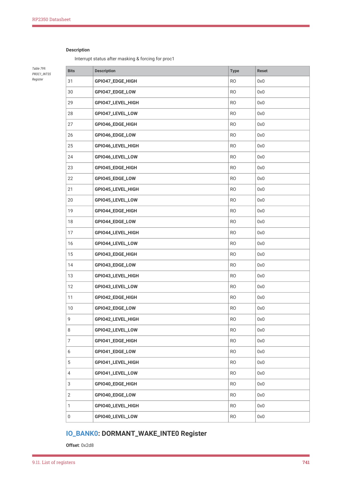

RP2350 Datasheet

Description

Interrupt status after masking & forcing for proc1

| Bits | Description | Type | Reset |
| --- | --- | --- | --- |
| 31 | GPIO47_EDGE_HIGH | RO | 0x0 |
| 30 | GPIO47_EDGE_LOW | RO | 0x0 |
| 29 | GPIO47_LEVEL_HIGH | RO | 0x0 |
| 28 | GPIO47_LEVEL_LOW | RO | 0x0 |
| 27 | GPIO46_EDGE_HIGH | RO | 0x0 |
| 26 | GPIO46_EDGE_LOW | RO | 0x0 |
| 25 | GPIO46_LEVEL_HIGH | RO | 0x0 |
| 24 | GPIO46_LEVEL_LOW | RO | 0x0 |
| 23 | GPIO45_EDGE_HIGH | RO | 0x0 |
| 22 | GPIO45_EDGE_LOW | RO | 0x0 |
| 21 | GPIO45_LEVEL_HIGH | RO | 0x0 |
| 20 | GPIO45_LEVEL_LOW | RO | 0x0 |
| 19 | GPIO44_EDGE_HIGH | RO | 0x0 |
| 18 | GPIO44_EDGE_LOW | RO | 0x0 |
| 17 | GPIO44_LEVEL_HIGH | RO | 0x0 |
| 16 | GPIO44_LEVEL_LOW | RO | 0x0 |
| 15 | GPIO43_EDGE_HIGH | RO | 0x0 |
| 14 | GPIO43_EDGE_LOW | RO | 0x0 |
| 13 | GPIO43_LEVEL_HIGH | RO | 0x0 |
| 12 | GPIO43_LEVEL_LOW | RO | 0x0 |
| 11 | GPIO42_EDGE_HIGH | RO | 0x0 |
| 10 | GPIO42_EDGE_LOW | RO | 0x0 |
| 9 | GPIO42_LEVEL_HIGH | RO | 0x0 |
| 8 | GPIO42_LEVEL_LOW | RO | 0x0 |
| 7 | GPIO41_EDGE_HIGH | RO | 0x0 |
| 6 | GPIO41_EDGE_LOW | RO | 0x0 |
| 5 | GPIO41_LEVEL_HIGH | RO | 0x0 |
| 4 | GPIO41_LEVEL_LOW | RO | 0x0 |
| 3 | GPIO40_EDGE_HIGH | RO | 0x0 |
| 2 | GPIO40_EDGE_LOW | RO | 0x0 |
| 1 | GPIO40_LEVEL_HIGH | RO | 0x0 |
| 0 | GPIO40_LEVEL_LOW | RO | 0x0 |

Table 799.

PROC1_INTS5

Register

IO_BANK0: DORMANT_WAKE_INTE0 Register

Offset: 0x2d8

9.11. List of registers
741

RP2350 Datasheet

Description

Interrupt Enable for dormant_wake

| Bits | Description | Type | Reset |
| --- | --- | --- | --- |
| 31 | GPIO7_EDGE_HIGH | RW | 0x0 |
| 30 | GPIO7_EDGE_LOW | RW | 0x0 |
| 29 | GPIO7_LEVEL_HIGH | RW | 0x0 |
| 28 | GPIO7_LEVEL_LOW | RW | 0x0 |
| 27 | GPIO6_EDGE_HIGH | RW | 0x0 |
| 26 | GPIO6_EDGE_LOW | RW | 0x0 |
| 25 | GPIO6_LEVEL_HIGH | RW | 0x0 |
| 24 | GPIO6_LEVEL_LOW | RW | 0x0 |
| 23 | GPIO5_EDGE_HIGH | RW | 0x0 |
| 22 | GPIO5_EDGE_LOW | RW | 0x0 |
| 21 | GPIO5_LEVEL_HIGH | RW | 0x0 |
| 20 | GPIO5_LEVEL_LOW | RW | 0x0 |
| 19 | GPIO4_EDGE_HIGH | RW | 0x0 |
| 18 | GPIO4_EDGE_LOW | RW | 0x0 |
| 17 | GPIO4_LEVEL_HIGH | RW | 0x0 |
| 16 | GPIO4_LEVEL_LOW | RW | 0x0 |
| 15 | GPIO3_EDGE_HIGH | RW | 0x0 |
| 14 | GPIO3_EDGE_LOW | RW | 0x0 |
| 13 | GPIO3_LEVEL_HIGH | RW | 0x0 |
| 12 | GPIO3_LEVEL_LOW | RW | 0x0 |
| 11 | GPIO2_EDGE_HIGH | RW | 0x0 |
| 10 | GPIO2_EDGE_LOW | RW | 0x0 |
| 9 | GPIO2_LEVEL_HIGH | RW | 0x0 |
| 8 | GPIO2_LEVEL_LOW | RW | 0x0 |
| 7 | GPIO1_EDGE_HIGH | RW | 0x0 |
| 6 | GPIO1_EDGE_LOW | RW | 0x0 |
| 5 | GPIO1_LEVEL_HIGH | RW | 0x0 |
| 4 | GPIO1_LEVEL_LOW | RW | 0x0 |
| 3 | GPIO0_EDGE_HIGH | RW | 0x0 |
| 2 | GPIO0_EDGE_LOW | RW | 0x0 |
| 1 | GPIO0_LEVEL_HIGH | RW | 0x0 |
| 0 | GPIO0_LEVEL_LOW | RW | 0x0 |

Table 800.

DORMANT_WAKE_INT

E0 Register

IO_BANK0: DORMANT_WAKE_INTE1 Register

Offset: 0x2dc

9.11. List of registers
742

RP2350 Datasheet

Description

Interrupt Enable for dormant_wake

| Bits | Description | Type | Reset |
| --- | --- | --- | --- |
| 31 | GPIO15_EDGE_HIGH | RW | 0x0 |
| 30 | GPIO15_EDGE_LOW | RW | 0x0 |
| 29 | GPIO15_LEVEL_HIGH | RW | 0x0 |
| 28 | GPIO15_LEVEL_LOW | RW | 0x0 |
| 27 | GPIO14_EDGE_HIGH | RW | 0x0 |
| 26 | GPIO14_EDGE_LOW | RW | 0x0 |
| 25 | GPIO14_LEVEL_HIGH | RW | 0x0 |
| 24 | GPIO14_LEVEL_LOW | RW | 0x0 |
| 23 | GPIO13_EDGE_HIGH | RW | 0x0 |
| 22 | GPIO13_EDGE_LOW | RW | 0x0 |
| 21 | GPIO13_LEVEL_HIGH | RW | 0x0 |
| 20 | GPIO13_LEVEL_LOW | RW | 0x0 |
| 19 | GPIO12_EDGE_HIGH | RW | 0x0 |
| 18 | GPIO12_EDGE_LOW | RW | 0x0 |
| 17 | GPIO12_LEVEL_HIGH | RW | 0x0 |
| 16 | GPIO12_LEVEL_LOW | RW | 0x0 |
| 15 | GPIO11_EDGE_HIGH | RW | 0x0 |
| 14 | GPIO11_EDGE_LOW | RW | 0x0 |
| 13 | GPIO11_LEVEL_HIGH | RW | 0x0 |
| 12 | GPIO11_LEVEL_LOW | RW | 0x0 |
| 11 | GPIO10_EDGE_HIGH | RW | 0x0 |
| 10 | GPIO10_EDGE_LOW | RW | 0x0 |
| 9 | GPIO10_LEVEL_HIGH | RW | 0x0 |
| 8 | GPIO10_LEVEL_LOW | RW | 0x0 |
| 7 | GPIO9_EDGE_HIGH | RW | 0x0 |
| 6 | GPIO9_EDGE_LOW | RW | 0x0 |
| 5 | GPIO9_LEVEL_HIGH | RW | 0x0 |
| 4 | GPIO9_LEVEL_LOW | RW | 0x0 |
| 3 | GPIO8_EDGE_HIGH | RW | 0x0 |
| 2 | GPIO8_EDGE_LOW | RW | 0x0 |
| 1 | GPIO8_LEVEL_HIGH | RW | 0x0 |
| 0 | GPIO8_LEVEL_LOW | RW | 0x0 |

Table 801.

DORMANT_WAKE_INT

E1 Register

IO_BANK0: DORMANT_WAKE_INTE2 Register

Offset: 0x2e0

9.11. List of registers
743

RP2350 Datasheet

Description

Interrupt Enable for dormant_wake

| Bits | Description | Type | Reset |
| --- | --- | --- | --- |
| 31 | GPIO23_EDGE_HIGH | RW | 0x0 |
| 30 | GPIO23_EDGE_LOW | RW | 0x0 |
| 29 | GPIO23_LEVEL_HIGH | RW | 0x0 |
| 28 | GPIO23_LEVEL_LOW | RW | 0x0 |
| 27 | GPIO22_EDGE_HIGH | RW | 0x0 |
| 26 | GPIO22_EDGE_LOW | RW | 0x0 |
| 25 | GPIO22_LEVEL_HIGH | RW | 0x0 |
| 24 | GPIO22_LEVEL_LOW | RW | 0x0 |
| 23 | GPIO21_EDGE_HIGH | RW | 0x0 |
| 22 | GPIO21_EDGE_LOW | RW | 0x0 |
| 21 | GPIO21_LEVEL_HIGH | RW | 0x0 |
| 20 | GPIO21_LEVEL_LOW | RW | 0x0 |
| 19 | GPIO20_EDGE_HIGH | RW | 0x0 |
| 18 | GPIO20_EDGE_LOW | RW | 0x0 |
| 17 | GPIO20_LEVEL_HIGH | RW | 0x0 |
| 16 | GPIO20_LEVEL_LOW | RW | 0x0 |
| 15 | GPIO19_EDGE_HIGH | RW | 0x0 |
| 14 | GPIO19_EDGE_LOW | RW | 0x0 |
| 13 | GPIO19_LEVEL_HIGH | RW | 0x0 |
| 12 | GPIO19_LEVEL_LOW | RW | 0x0 |
| 11 | GPIO18_EDGE_HIGH | RW | 0x0 |
| 10 | GPIO18_EDGE_LOW | RW | 0x0 |
| 9 | GPIO18_LEVEL_HIGH | RW | 0x0 |
| 8 | GPIO18_LEVEL_LOW | RW | 0x0 |
| 7 | GPIO17_EDGE_HIGH | RW | 0x0 |
| 6 | GPIO17_EDGE_LOW | RW | 0x0 |
| 5 | GPIO17_LEVEL_HIGH | RW | 0x0 |
| 4 | GPIO17_LEVEL_LOW | RW | 0x0 |
| 3 | GPIO16_EDGE_HIGH | RW | 0x0 |
| 2 | GPIO16_EDGE_LOW | RW | 0x0 |
| 1 | GPIO16_LEVEL_HIGH | RW | 0x0 |
| 0 | GPIO16_LEVEL_LOW | RW | 0x0 |

Table 802.

DORMANT_WAKE_INT

E2 Register

IO_BANK0: DORMANT_WAKE_INTE3 Register

Offset: 0x2e4

9.11. List of registers
744

RP2350 Datasheet

Description

Interrupt Enable for dormant_wake

| Bits | Description | Type | Reset |
| --- | --- | --- | --- |
| 31 | GPIO31_EDGE_HIGH | RW | 0x0 |
| 30 | GPIO31_EDGE_LOW | RW | 0x0 |
| 29 | GPIO31_LEVEL_HIGH | RW | 0x0 |
| 28 | GPIO31_LEVEL_LOW | RW | 0x0 |
| 27 | GPIO30_EDGE_HIGH | RW | 0x0 |
| 26 | GPIO30_EDGE_LOW | RW | 0x0 |
| 25 | GPIO30_LEVEL_HIGH | RW | 0x0 |
| 24 | GPIO30_LEVEL_LOW | RW | 0x0 |
| 23 | GPIO29_EDGE_HIGH | RW | 0x0 |
| 22 | GPIO29_EDGE_LOW | RW | 0x0 |
| 21 | GPIO29_LEVEL_HIGH | RW | 0x0 |
| 20 | GPIO29_LEVEL_LOW | RW | 0x0 |
| 19 | GPIO28_EDGE_HIGH | RW | 0x0 |
| 18 | GPIO28_EDGE_LOW | RW | 0x0 |
| 17 | GPIO28_LEVEL_HIGH | RW | 0x0 |
| 16 | GPIO28_LEVEL_LOW | RW | 0x0 |
| 15 | GPIO27_EDGE_HIGH | RW | 0x0 |
| 14 | GPIO27_EDGE_LOW | RW | 0x0 |
| 13 | GPIO27_LEVEL_HIGH | RW | 0x0 |
| 12 | GPIO27_LEVEL_LOW | RW | 0x0 |
| 11 | GPIO26_EDGE_HIGH | RW | 0x0 |
| 10 | GPIO26_EDGE_LOW | RW | 0x0 |
| 9 | GPIO26_LEVEL_HIGH | RW | 0x0 |
| 8 | GPIO26_LEVEL_LOW | RW | 0x0 |
| 7 | GPIO25_EDGE_HIGH | RW | 0x0 |
| 6 | GPIO25_EDGE_LOW | RW | 0x0 |
| 5 | GPIO25_LEVEL_HIGH | RW | 0x0 |
| 4 | GPIO25_LEVEL_LOW | RW | 0x0 |
| 3 | GPIO24_EDGE_HIGH | RW | 0x0 |
| 2 | GPIO24_EDGE_LOW | RW | 0x0 |
| 1 | GPIO24_LEVEL_HIGH | RW | 0x0 |
| 0 | GPIO24_LEVEL_LOW | RW | 0x0 |

Table 803.

DORMANT_WAKE_INT

E3 Register

IO_BANK0: DORMANT_WAKE_INTE4 Register

Offset: 0x2e8

9.11. List of registers
745

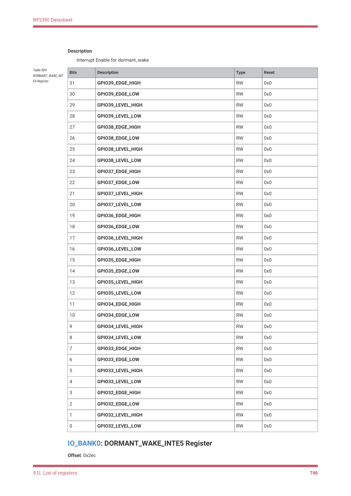

RP2350 Datasheet

Description

Interrupt Enable for dormant_wake

| Bits | Description | Type | Reset |
| --- | --- | --- | --- |
| 31 | GPIO39_EDGE_HIGH | RW | 0x0 |
| 30 | GPIO39_EDGE_LOW | RW | 0x0 |
| 29 | GPIO39_LEVEL_HIGH | RW | 0x0 |
| 28 | GPIO39_LEVEL_LOW | RW | 0x0 |
| 27 | GPIO38_EDGE_HIGH | RW | 0x0 |
| 26 | GPIO38_EDGE_LOW | RW | 0x0 |
| 25 | GPIO38_LEVEL_HIGH | RW | 0x0 |
| 24 | GPIO38_LEVEL_LOW | RW | 0x0 |
| 23 | GPIO37_EDGE_HIGH | RW | 0x0 |
| 22 | GPIO37_EDGE_LOW | RW | 0x0 |
| 21 | GPIO37_LEVEL_HIGH | RW | 0x0 |
| 20 | GPIO37_LEVEL_LOW | RW | 0x0 |
| 19 | GPIO36_EDGE_HIGH | RW | 0x0 |
| 18 | GPIO36_EDGE_LOW | RW | 0x0 |
| 17 | GPIO36_LEVEL_HIGH | RW | 0x0 |
| 16 | GPIO36_LEVEL_LOW | RW | 0x0 |
| 15 | GPIO35_EDGE_HIGH | RW | 0x0 |
| 14 | GPIO35_EDGE_LOW | RW | 0x0 |
| 13 | GPIO35_LEVEL_HIGH | RW | 0x0 |
| 12 | GPIO35_LEVEL_LOW | RW | 0x0 |
| 11 | GPIO34_EDGE_HIGH | RW | 0x0 |
| 10 | GPIO34_EDGE_LOW | RW | 0x0 |
| 9 | GPIO34_LEVEL_HIGH | RW | 0x0 |
| 8 | GPIO34_LEVEL_LOW | RW | 0x0 |
| 7 | GPIO33_EDGE_HIGH | RW | 0x0 |
| 6 | GPIO33_EDGE_LOW | RW | 0x0 |
| 5 | GPIO33_LEVEL_HIGH | RW | 0x0 |
| 4 | GPIO33_LEVEL_LOW | RW | 0x0 |
| 3 | GPIO32_EDGE_HIGH | RW | 0x0 |
| 2 | GPIO32_EDGE_LOW | RW | 0x0 |
| 1 | GPIO32_LEVEL_HIGH | RW | 0x0 |
| 0 | GPIO32_LEVEL_LOW | RW | 0x0 |

Table 804.

DORMANT_WAKE_INT

E4 Register

IO_BANK0: DORMANT_WAKE_INTE5 Register

Offset: 0x2ec

9.11. List of registers
746

RP2350 Datasheet

Description

Interrupt Enable for dormant_wake

| Bits | Description | Type | Reset |
| --- | --- | --- | --- |
| 31 | GPIO47_EDGE_HIGH | RW | 0x0 |
| 30 | GPIO47_EDGE_LOW | RW | 0x0 |
| 29 | GPIO47_LEVEL_HIGH | RW | 0x0 |
| 28 | GPIO47_LEVEL_LOW | RW | 0x0 |
| 27 | GPIO46_EDGE_HIGH | RW | 0x0 |
| 26 | GPIO46_EDGE_LOW | RW | 0x0 |
| 25 | GPIO46_LEVEL_HIGH | RW | 0x0 |
| 24 | GPIO46_LEVEL_LOW | RW | 0x0 |
| 23 | GPIO45_EDGE_HIGH | RW | 0x0 |
| 22 | GPIO45_EDGE_LOW | RW | 0x0 |
| 21 | GPIO45_LEVEL_HIGH | RW | 0x0 |
| 20 | GPIO45_LEVEL_LOW | RW | 0x0 |
| 19 | GPIO44_EDGE_HIGH | RW | 0x0 |
| 18 | GPIO44_EDGE_LOW | RW | 0x0 |
| 17 | GPIO44_LEVEL_HIGH | RW | 0x0 |
| 16 | GPIO44_LEVEL_LOW | RW | 0x0 |
| 15 | GPIO43_EDGE_HIGH | RW | 0x0 |
| 14 | GPIO43_EDGE_LOW | RW | 0x0 |
| 13 | GPIO43_LEVEL_HIGH | RW | 0x0 |
| 12 | GPIO43_LEVEL_LOW | RW | 0x0 |
| 11 | GPIO42_EDGE_HIGH | RW | 0x0 |
| 10 | GPIO42_EDGE_LOW | RW | 0x0 |
| 9 | GPIO42_LEVEL_HIGH | RW | 0x0 |
| 8 | GPIO42_LEVEL_LOW | RW | 0x0 |
| 7 | GPIO41_EDGE_HIGH | RW | 0x0 |
| 6 | GPIO41_EDGE_LOW | RW | 0x0 |
| 5 | GPIO41_LEVEL_HIGH | RW | 0x0 |
| 4 | GPIO41_LEVEL_LOW | RW | 0x0 |
| 3 | GPIO40_EDGE_HIGH | RW | 0x0 |
| 2 | GPIO40_EDGE_LOW | RW | 0x0 |
| 1 | GPIO40_LEVEL_HIGH | RW | 0x0 |
| 0 | GPIO40_LEVEL_LOW | RW | 0x0 |

Table 805.

DORMANT_WAKE_INT

E5 Register

IO_BANK0: DORMANT_WAKE_INTF0 Register

Offset: 0x2f0

9.11. List of registers
747

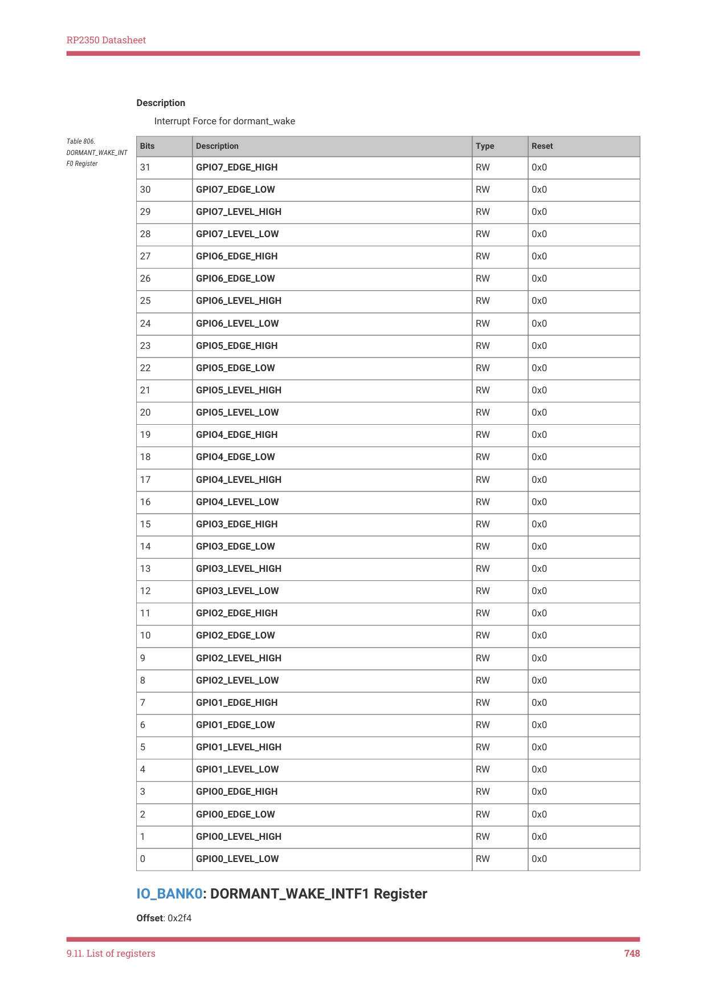

RP2350 Datasheet

Description

Interrupt Force for dormant_wake

| Bits | Description | Type | Reset |
| --- | --- | --- | --- |
| 31 | GPIO7_EDGE_HIGH | RW | 0x0 |
| 30 | GPIO7_EDGE_LOW | RW | 0x0 |
| 29 | GPIO7_LEVEL_HIGH | RW | 0x0 |
| 28 | GPIO7_LEVEL_LOW | RW | 0x0 |
| 27 | GPIO6_EDGE_HIGH | RW | 0x0 |
| 26 | GPIO6_EDGE_LOW | RW | 0x0 |
| 25 | GPIO6_LEVEL_HIGH | RW | 0x0 |
| 24 | GPIO6_LEVEL_LOW | RW | 0x0 |
| 23 | GPIO5_EDGE_HIGH | RW | 0x0 |
| 22 | GPIO5_EDGE_LOW | RW | 0x0 |
| 21 | GPIO5_LEVEL_HIGH | RW | 0x0 |
| 20 | GPIO5_LEVEL_LOW | RW | 0x0 |
| 19 | GPIO4_EDGE_HIGH | RW | 0x0 |
| 18 | GPIO4_EDGE_LOW | RW | 0x0 |
| 17 | GPIO4_LEVEL_HIGH | RW | 0x0 |
| 16 | GPIO4_LEVEL_LOW | RW | 0x0 |
| 15 | GPIO3_EDGE_HIGH | RW | 0x0 |
| 14 | GPIO3_EDGE_LOW | RW | 0x0 |
| 13 | GPIO3_LEVEL_HIGH | RW | 0x0 |
| 12 | GPIO3_LEVEL_LOW | RW | 0x0 |
| 11 | GPIO2_EDGE_HIGH | RW | 0x0 |
| 10 | GPIO2_EDGE_LOW | RW | 0x0 |
| 9 | GPIO2_LEVEL_HIGH | RW | 0x0 |
| 8 | GPIO2_LEVEL_LOW | RW | 0x0 |
| 7 | GPIO1_EDGE_HIGH | RW | 0x0 |
| 6 | GPIO1_EDGE_LOW | RW | 0x0 |
| 5 | GPIO1_LEVEL_HIGH | RW | 0x0 |
| 4 | GPIO1_LEVEL_LOW | RW | 0x0 |
| 3 | GPIO0_EDGE_HIGH | RW | 0x0 |
| 2 | GPIO0_EDGE_LOW | RW | 0x0 |
| 1 | GPIO0_LEVEL_HIGH | RW | 0x0 |
| 0 | GPIO0_LEVEL_LOW | RW | 0x0 |

Table 806.

DORMANT_WAKE_INT

F0 Register

IO_BANK0: DORMANT_WAKE_INTF1 Register

Offset: 0x2f4

9.11. List of registers
748

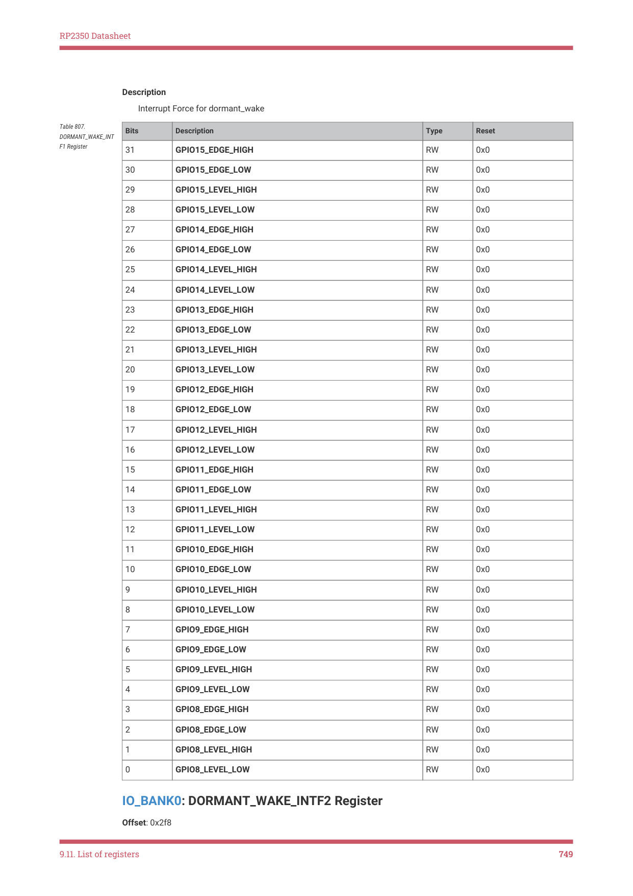

RP2350 Datasheet

Description

Interrupt Force for dormant_wake

| Bits | Description | Type | Reset |
| --- | --- | --- | --- |
| 31 | GPIO15_EDGE_HIGH | RW | 0x0 |
| 30 | GPIO15_EDGE_LOW | RW | 0x0 |
| 29 | GPIO15_LEVEL_HIGH | RW | 0x0 |
| 28 | GPIO15_LEVEL_LOW | RW | 0x0 |
| 27 | GPIO14_EDGE_HIGH | RW | 0x0 |
| 26 | GPIO14_EDGE_LOW | RW | 0x0 |
| 25 | GPIO14_LEVEL_HIGH | RW | 0x0 |
| 24 | GPIO14_LEVEL_LOW | RW | 0x0 |
| 23 | GPIO13_EDGE_HIGH | RW | 0x0 |
| 22 | GPIO13_EDGE_LOW | RW | 0x0 |
| 21 | GPIO13_LEVEL_HIGH | RW | 0x0 |
| 20 | GPIO13_LEVEL_LOW | RW | 0x0 |
| 19 | GPIO12_EDGE_HIGH | RW | 0x0 |
| 18 | GPIO12_EDGE_LOW | RW | 0x0 |
| 17 | GPIO12_LEVEL_HIGH | RW | 0x0 |
| 16 | GPIO12_LEVEL_LOW | RW | 0x0 |
| 15 | GPIO11_EDGE_HIGH | RW | 0x0 |
| 14 | GPIO11_EDGE_LOW | RW | 0x0 |
| 13 | GPIO11_LEVEL_HIGH | RW | 0x0 |
| 12 | GPIO11_LEVEL_LOW | RW | 0x0 |
| 11 | GPIO10_EDGE_HIGH | RW | 0x0 |
| 10 | GPIO10_EDGE_LOW | RW | 0x0 |
| 9 | GPIO10_LEVEL_HIGH | RW | 0x0 |
| 8 | GPIO10_LEVEL_LOW | RW | 0x0 |
| 7 | GPIO9_EDGE_HIGH | RW | 0x0 |
| 6 | GPIO9_EDGE_LOW | RW | 0x0 |
| 5 | GPIO9_LEVEL_HIGH | RW | 0x0 |
| 4 | GPIO9_LEVEL_LOW | RW | 0x0 |
| 3 | GPIO8_EDGE_HIGH | RW | 0x0 |
| 2 | GPIO8_EDGE_LOW | RW | 0x0 |
| 1 | GPIO8_LEVEL_HIGH | RW | 0x0 |
| 0 | GPIO8_LEVEL_LOW | RW | 0x0 |

Table 807.

DORMANT_WAKE_INT

F1 Register

IO_BANK0: DORMANT_WAKE_INTF2 Register

Offset: 0x2f8

9.11. List of registers
749

RP2350 Datasheet

Description

Interrupt Force for dormant_wake

| Bits | Description | Type | Reset |
| --- | --- | --- | --- |
| 31 | GPIO23_EDGE_HIGH | RW | 0x0 |
| 30 | GPIO23_EDGE_LOW | RW | 0x0 |
| 29 | GPIO23_LEVEL_HIGH | RW | 0x0 |
| 28 | GPIO23_LEVEL_LOW | RW | 0x0 |
| 27 | GPIO22_EDGE_HIGH | RW | 0x0 |
| 26 | GPIO22_EDGE_LOW | RW | 0x0 |
| 25 | GPIO22_LEVEL_HIGH | RW | 0x0 |
| 24 | GPIO22_LEVEL_LOW | RW | 0x0 |
| 23 | GPIO21_EDGE_HIGH | RW | 0x0 |
| 22 | GPIO21_EDGE_LOW | RW | 0x0 |
| 21 | GPIO21_LEVEL_HIGH | RW | 0x0 |
| 20 | GPIO21_LEVEL_LOW | RW | 0x0 |
| 19 | GPIO20_EDGE_HIGH | RW | 0x0 |
| 18 | GPIO20_EDGE_LOW | RW | 0x0 |
| 17 | GPIO20_LEVEL_HIGH | RW | 0x0 |
| 16 | GPIO20_LEVEL_LOW | RW | 0x0 |
| 15 | GPIO19_EDGE_HIGH | RW | 0x0 |
| 14 | GPIO19_EDGE_LOW | RW | 0x0 |
| 13 | GPIO19_LEVEL_HIGH | RW | 0x0 |
| 12 | GPIO19_LEVEL_LOW | RW | 0x0 |
| 11 | GPIO18_EDGE_HIGH | RW | 0x0 |
| 10 | GPIO18_EDGE_LOW | RW | 0x0 |
| 9 | GPIO18_LEVEL_HIGH | RW | 0x0 |
| 8 | GPIO18_LEVEL_LOW | RW | 0x0 |
| 7 | GPIO17_EDGE_HIGH | RW | 0x0 |
| 6 | GPIO17_EDGE_LOW | RW | 0x0 |
| 5 | GPIO17_LEVEL_HIGH | RW | 0x0 |
| 4 | GPIO17_LEVEL_LOW | RW | 0x0 |
| 3 | GPIO16_EDGE_HIGH | RW | 0x0 |
| 2 | GPIO16_EDGE_LOW | RW | 0x0 |
| 1 | GPIO16_LEVEL_HIGH | RW | 0x0 |
| 0 | GPIO16_LEVEL_LOW | RW | 0x0 |

Table 808.

DORMANT_WAKE_INT

F2 Register

IO_BANK0: DORMANT_WAKE_INTF3 Register

Offset: 0x2fc

9.11. List of registers
750

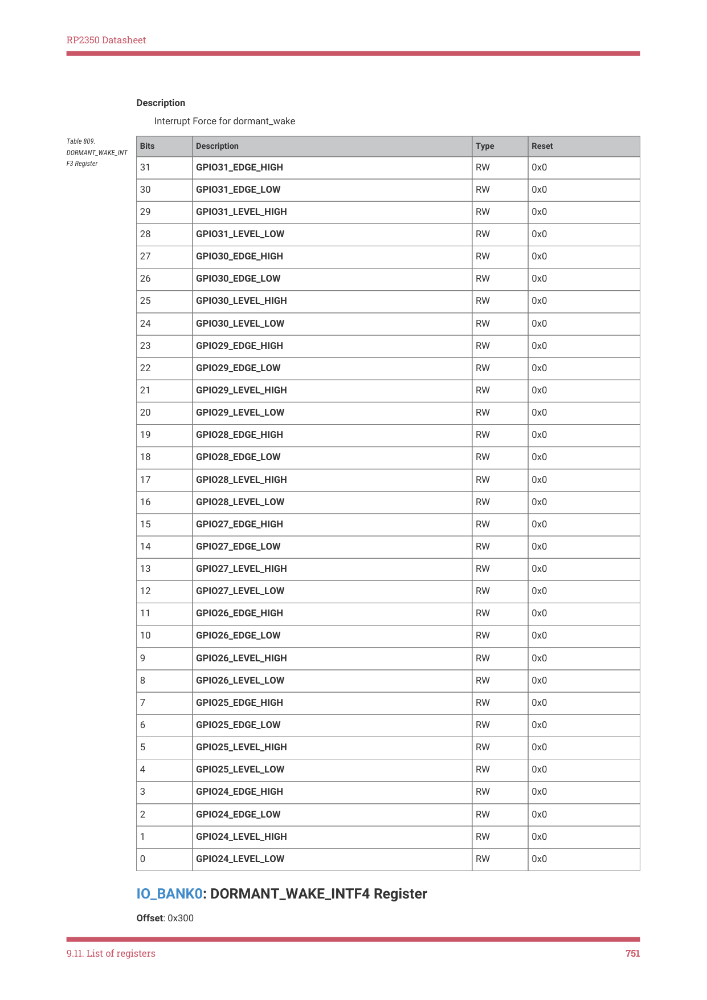

RP2350 Datasheet

Description

Interrupt Force for dormant_wake

| Bits | Description | Type | Reset |
| --- | --- | --- | --- |
| 31 | GPIO31_EDGE_HIGH | RW | 0x0 |
| 30 | GPIO31_EDGE_LOW | RW | 0x0 |
| 29 | GPIO31_LEVEL_HIGH | RW | 0x0 |
| 28 | GPIO31_LEVEL_LOW | RW | 0x0 |
| 27 | GPIO30_EDGE_HIGH | RW | 0x0 |
| 26 | GPIO30_EDGE_LOW | RW | 0x0 |
| 25 | GPIO30_LEVEL_HIGH | RW | 0x0 |
| 24 | GPIO30_LEVEL_LOW | RW | 0x0 |
| 23 | GPIO29_EDGE_HIGH | RW | 0x0 |
| 22 | GPIO29_EDGE_LOW | RW | 0x0 |
| 21 | GPIO29_LEVEL_HIGH | RW | 0x0 |
| 20 | GPIO29_LEVEL_LOW | RW | 0x0 |
| 19 | GPIO28_EDGE_HIGH | RW | 0x0 |
| 18 | GPIO28_EDGE_LOW | RW | 0x0 |
| 17 | GPIO28_LEVEL_HIGH | RW | 0x0 |
| 16 | GPIO28_LEVEL_LOW | RW | 0x0 |
| 15 | GPIO27_EDGE_HIGH | RW | 0x0 |
| 14 | GPIO27_EDGE_LOW | RW | 0x0 |
| 13 | GPIO27_LEVEL_HIGH | RW | 0x0 |
| 12 | GPIO27_LEVEL_LOW | RW | 0x0 |
| 11 | GPIO26_EDGE_HIGH | RW | 0x0 |
| 10 | GPIO26_EDGE_LOW | RW | 0x0 |
| 9 | GPIO26_LEVEL_HIGH | RW | 0x0 |
| 8 | GPIO26_LEVEL_LOW | RW | 0x0 |
| 7 | GPIO25_EDGE_HIGH | RW | 0x0 |
| 6 | GPIO25_EDGE_LOW | RW | 0x0 |
| 5 | GPIO25_LEVEL_HIGH | RW | 0x0 |
| 4 | GPIO25_LEVEL_LOW | RW | 0x0 |
| 3 | GPIO24_EDGE_HIGH | RW | 0x0 |
| 2 | GPIO24_EDGE_LOW | RW | 0x0 |
| 1 | GPIO24_LEVEL_HIGH | RW | 0x0 |
| 0 | GPIO24_LEVEL_LOW | RW | 0x0 |

Table 809.

DORMANT_WAKE_INT

F3 Register

IO_BANK0: DORMANT_WAKE_INTF4 Register

Offset: 0x300

9.11. List of registers
751

RP2350 Datasheet

Description

Interrupt Force for dormant_wake

| Bits | Description | Type | Reset |
| --- | --- | --- | --- |
| 31 | GPIO39_EDGE_HIGH | RW | 0x0 |
| 30 | GPIO39_EDGE_LOW | RW | 0x0 |
| 29 | GPIO39_LEVEL_HIGH | RW | 0x0 |
| 28 | GPIO39_LEVEL_LOW | RW | 0x0 |
| 27 | GPIO38_EDGE_HIGH | RW | 0x0 |
| 26 | GPIO38_EDGE_LOW | RW | 0x0 |
| 25 | GPIO38_LEVEL_HIGH | RW | 0x0 |
| 24 | GPIO38_LEVEL_LOW | RW | 0x0 |
| 23 | GPIO37_EDGE_HIGH | RW | 0x0 |
| 22 | GPIO37_EDGE_LOW | RW | 0x0 |
| 21 | GPIO37_LEVEL_HIGH | RW | 0x0 |
| 20 | GPIO37_LEVEL_LOW | RW | 0x0 |
| 19 | GPIO36_EDGE_HIGH | RW | 0x0 |
| 18 | GPIO36_EDGE_LOW | RW | 0x0 |
| 17 | GPIO36_LEVEL_HIGH | RW | 0x0 |
| 16 | GPIO36_LEVEL_LOW | RW | 0x0 |
| 15 | GPIO35_EDGE_HIGH | RW | 0x0 |
| 14 | GPIO35_EDGE_LOW | RW | 0x0 |
| 13 | GPIO35_LEVEL_HIGH | RW | 0x0 |
| 12 | GPIO35_LEVEL_LOW | RW | 0x0 |
| 11 | GPIO34_EDGE_HIGH | RW | 0x0 |
| 10 | GPIO34_EDGE_LOW | RW | 0x0 |
| 9 | GPIO34_LEVEL_HIGH | RW | 0x0 |
| 8 | GPIO34_LEVEL_LOW | RW | 0x0 |
| 7 | GPIO33_EDGE_HIGH | RW | 0x0 |
| 6 | GPIO33_EDGE_LOW | RW | 0x0 |
| 5 | GPIO33_LEVEL_HIGH | RW | 0x0 |
| 4 | GPIO33_LEVEL_LOW | RW | 0x0 |
| 3 | GPIO32_EDGE_HIGH | RW | 0x0 |
| 2 | GPIO32_EDGE_LOW | RW | 0x0 |
| 1 | GPIO32_LEVEL_HIGH | RW | 0x0 |
| 0 | GPIO32_LEVEL_LOW | RW | 0x0 |

Table 810.

DORMANT_WAKE_INT

F4 Register

IO_BANK0: DORMANT_WAKE_INTF5 Register

Offset: 0x304

9.11. List of registers
752

RP2350 Datasheet

Description

Interrupt Force for dormant_wake

| Bits | Description | Type | Reset |
| --- | --- | --- | --- |
| 31 | GPIO47_EDGE_HIGH | RW | 0x0 |
| 30 | GPIO47_EDGE_LOW | RW | 0x0 |
| 29 | GPIO47_LEVEL_HIGH | RW | 0x0 |
| 28 | GPIO47_LEVEL_LOW | RW | 0x0 |
| 27 | GPIO46_EDGE_HIGH | RW | 0x0 |
| 26 | GPIO46_EDGE_LOW | RW | 0x0 |
| 25 | GPIO46_LEVEL_HIGH | RW | 0x0 |
| 24 | GPIO46_LEVEL_LOW | RW | 0x0 |
| 23 | GPIO45_EDGE_HIGH | RW | 0x0 |
| 22 | GPIO45_EDGE_LOW | RW | 0x0 |
| 21 | GPIO45_LEVEL_HIGH | RW | 0x0 |
| 20 | GPIO45_LEVEL_LOW | RW | 0x0 |
| 19 | GPIO44_EDGE_HIGH | RW | 0x0 |
| 18 | GPIO44_EDGE_LOW | RW | 0x0 |
| 17 | GPIO44_LEVEL_HIGH | RW | 0x0 |
| 16 | GPIO44_LEVEL_LOW | RW | 0x0 |
| 15 | GPIO43_EDGE_HIGH | RW | 0x0 |
| 14 | GPIO43_EDGE_LOW | RW | 0x0 |
| 13 | GPIO43_LEVEL_HIGH | RW | 0x0 |
| 12 | GPIO43_LEVEL_LOW | RW | 0x0 |
| 11 | GPIO42_EDGE_HIGH | RW | 0x0 |
| 10 | GPIO42_EDGE_LOW | RW | 0x0 |
| 9 | GPIO42_LEVEL_HIGH | RW | 0x0 |
| 8 | GPIO42_LEVEL_LOW | RW | 0x0 |
| 7 | GPIO41_EDGE_HIGH | RW | 0x0 |
| 6 | GPIO41_EDGE_LOW | RW | 0x0 |
| 5 | GPIO41_LEVEL_HIGH | RW | 0x0 |
| 4 | GPIO41_LEVEL_LOW | RW | 0x0 |
| 3 | GPIO40_EDGE_HIGH | RW | 0x0 |
| 2 | GPIO40_EDGE_LOW | RW | 0x0 |
| 1 | GPIO40_LEVEL_HIGH | RW | 0x0 |
| 0 | GPIO40_LEVEL_LOW | RW | 0x0 |

Table 811.

DORMANT_WAKE_INT

F5 Register

IO_BANK0: DORMANT_WAKE_INTS0 Register

Offset: 0x308

9.11. List of registers
753

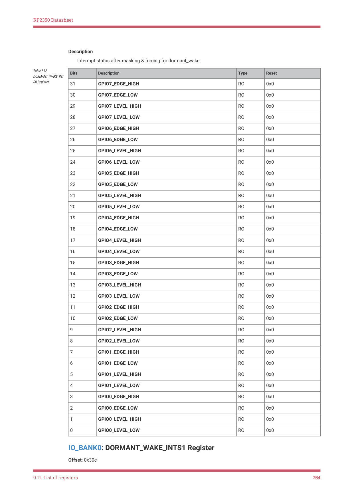

RP2350 Datasheet

Description

Interrupt status after masking & forcing for dormant_wake

| Bits | Description | Type | Reset |
| --- | --- | --- | --- |
| 31 | GPIO7_EDGE_HIGH | RO | 0x0 |
| 30 | GPIO7_EDGE_LOW | RO | 0x0 |
| 29 | GPIO7_LEVEL_HIGH | RO | 0x0 |
| 28 | GPIO7_LEVEL_LOW | RO | 0x0 |
| 27 | GPIO6_EDGE_HIGH | RO | 0x0 |
| 26 | GPIO6_EDGE_LOW | RO | 0x0 |
| 25 | GPIO6_LEVEL_HIGH | RO | 0x0 |
| 24 | GPIO6_LEVEL_LOW | RO | 0x0 |
| 23 | GPIO5_EDGE_HIGH | RO | 0x0 |
| 22 | GPIO5_EDGE_LOW | RO | 0x0 |
| 21 | GPIO5_LEVEL_HIGH | RO | 0x0 |
| 20 | GPIO5_LEVEL_LOW | RO | 0x0 |
| 19 | GPIO4_EDGE_HIGH | RO | 0x0 |
| 18 | GPIO4_EDGE_LOW | RO | 0x0 |
| 17 | GPIO4_LEVEL_HIGH | RO | 0x0 |
| 16 | GPIO4_LEVEL_LOW | RO | 0x0 |
| 15 | GPIO3_EDGE_HIGH | RO | 0x0 |
| 14 | GPIO3_EDGE_LOW | RO | 0x0 |
| 13 | GPIO3_LEVEL_HIGH | RO | 0x0 |
| 12 | GPIO3_LEVEL_LOW | RO | 0x0 |
| 11 | GPIO2_EDGE_HIGH | RO | 0x0 |
| 10 | GPIO2_EDGE_LOW | RO | 0x0 |
| 9 | GPIO2_LEVEL_HIGH | RO | 0x0 |
| 8 | GPIO2_LEVEL_LOW | RO | 0x0 |
| 7 | GPIO1_EDGE_HIGH | RO | 0x0 |
| 6 | GPIO1_EDGE_LOW | RO | 0x0 |
| 5 | GPIO1_LEVEL_HIGH | RO | 0x0 |
| 4 | GPIO1_LEVEL_LOW | RO | 0x0 |
| 3 | GPIO0_EDGE_HIGH | RO | 0x0 |
| 2 | GPIO0_EDGE_LOW | RO | 0x0 |
| 1 | GPIO0_LEVEL_HIGH | RO | 0x0 |
| 0 | GPIO0_LEVEL_LOW | RO | 0x0 |

Table 812.

DORMANT_WAKE_INT

S0 Register

IO_BANK0: DORMANT_WAKE_INTS1 Register

Offset: 0x30c

9.11. List of registers
754

RP2350 Datasheet

Description

Interrupt status after masking & forcing for dormant_wake

| Bits | Description | Type | Reset |
| --- | --- | --- | --- |
| 31 | GPIO15_EDGE_HIGH | RO | 0x0 |
| 30 | GPIO15_EDGE_LOW | RO | 0x0 |
| 29 | GPIO15_LEVEL_HIGH | RO | 0x0 |
| 28 | GPIO15_LEVEL_LOW | RO | 0x0 |
| 27 | GPIO14_EDGE_HIGH | RO | 0x0 |
| 26 | GPIO14_EDGE_LOW | RO | 0x0 |
| 25 | GPIO14_LEVEL_HIGH | RO | 0x0 |
| 24 | GPIO14_LEVEL_LOW | RO | 0x0 |
| 23 | GPIO13_EDGE_HIGH | RO | 0x0 |
| 22 | GPIO13_EDGE_LOW | RO | 0x0 |
| 21 | GPIO13_LEVEL_HIGH | RO | 0x0 |
| 20 | GPIO13_LEVEL_LOW | RO | 0x0 |
| 19 | GPIO12_EDGE_HIGH | RO | 0x0 |
| 18 | GPIO12_EDGE_LOW | RO | 0x0 |
| 17 | GPIO12_LEVEL_HIGH | RO | 0x0 |
| 16 | GPIO12_LEVEL_LOW | RO | 0x0 |
| 15 | GPIO11_EDGE_HIGH | RO | 0x0 |
| 14 | GPIO11_EDGE_LOW | RO | 0x0 |
| 13 | GPIO11_LEVEL_HIGH | RO | 0x0 |
| 12 | GPIO11_LEVEL_LOW | RO | 0x0 |
| 11 | GPIO10_EDGE_HIGH | RO | 0x0 |
| 10 | GPIO10_EDGE_LOW | RO | 0x0 |
| 9 | GPIO10_LEVEL_HIGH | RO | 0x0 |
| 8 | GPIO10_LEVEL_LOW | RO | 0x0 |
| 7 | GPIO9_EDGE_HIGH | RO | 0x0 |
| 6 | GPIO9_EDGE_LOW | RO | 0x0 |
| 5 | GPIO9_LEVEL_HIGH | RO | 0x0 |
| 4 | GPIO9_LEVEL_LOW | RO | 0x0 |
| 3 | GPIO8_EDGE_HIGH | RO | 0x0 |
| 2 | GPIO8_EDGE_LOW | RO | 0x0 |
| 1 | GPIO8_LEVEL_HIGH | RO | 0x0 |
| 0 | GPIO8_LEVEL_LOW | RO | 0x0 |

Table 813.

DORMANT_WAKE_INT

S1 Register

IO_BANK0: DORMANT_WAKE_INTS2 Register

Offset: 0x310

9.11. List of registers
755

RP2350 Datasheet

Description

Interrupt status after masking & forcing for dormant_wake

| Bits | Description | Type | Reset |
| --- | --- | --- | --- |
| 31 | GPIO23_EDGE_HIGH | RO | 0x0 |
| 30 | GPIO23_EDGE_LOW | RO | 0x0 |
| 29 | GPIO23_LEVEL_HIGH | RO | 0x0 |
| 28 | GPIO23_LEVEL_LOW | RO | 0x0 |
| 27 | GPIO22_EDGE_HIGH | RO | 0x0 |
| 26 | GPIO22_EDGE_LOW | RO | 0x0 |
| 25 | GPIO22_LEVEL_HIGH | RO | 0x0 |
| 24 | GPIO22_LEVEL_LOW | RO | 0x0 |
| 23 | GPIO21_EDGE_HIGH | RO | 0x0 |
| 22 | GPIO21_EDGE_LOW | RO | 0x0 |
| 21 | GPIO21_LEVEL_HIGH | RO | 0x0 |
| 20 | GPIO21_LEVEL_LOW | RO | 0x0 |
| 19 | GPIO20_EDGE_HIGH | RO | 0x0 |
| 18 | GPIO20_EDGE_LOW | RO | 0x0 |
| 17 | GPIO20_LEVEL_HIGH | RO | 0x0 |
| 16 | GPIO20_LEVEL_LOW | RO | 0x0 |
| 15 | GPIO19_EDGE_HIGH | RO | 0x0 |
| 14 | GPIO19_EDGE_LOW | RO | 0x0 |
| 13 | GPIO19_LEVEL_HIGH | RO | 0x0 |
| 12 | GPIO19_LEVEL_LOW | RO | 0x0 |
| 11 | GPIO18_EDGE_HIGH | RO | 0x0 |
| 10 | GPIO18_EDGE_LOW | RO | 0x0 |
| 9 | GPIO18_LEVEL_HIGH | RO | 0x0 |
| 8 | GPIO18_LEVEL_LOW | RO | 0x0 |
| 7 | GPIO17_EDGE_HIGH | RO | 0x0 |
| 6 | GPIO17_EDGE_LOW | RO | 0x0 |
| 5 | GPIO17_LEVEL_HIGH | RO | 0x0 |
| 4 | GPIO17_LEVEL_LOW | RO | 0x0 |
| 3 | GPIO16_EDGE_HIGH | RO | 0x0 |
| 2 | GPIO16_EDGE_LOW | RO | 0x0 |
| 1 | GPIO16_LEVEL_HIGH | RO | 0x0 |
| 0 | GPIO16_LEVEL_LOW | RO | 0x0 |

Table 814.

DORMANT_WAKE_INT

S2 Register

IO_BANK0: DORMANT_WAKE_INTS3 Register

Offset: 0x314

9.11. List of registers
756

RP2350 Datasheet

Description

Interrupt status after masking & forcing for dormant_wake

| Bits | Description | Type | Reset |
| --- | --- | --- | --- |
| 31 | GPIO31_EDGE_HIGH | RO | 0x0 |
| 30 | GPIO31_EDGE_LOW | RO | 0x0 |
| 29 | GPIO31_LEVEL_HIGH | RO | 0x0 |
| 28 | GPIO31_LEVEL_LOW | RO | 0x0 |
| 27 | GPIO30_EDGE_HIGH | RO | 0x0 |
| 26 | GPIO30_EDGE_LOW | RO | 0x0 |
| 25 | GPIO30_LEVEL_HIGH | RO | 0x0 |
| 24 | GPIO30_LEVEL_LOW | RO | 0x0 |
| 23 | GPIO29_EDGE_HIGH | RO | 0x0 |
| 22 | GPIO29_EDGE_LOW | RO | 0x0 |
| 21 | GPIO29_LEVEL_HIGH | RO | 0x0 |
| 20 | GPIO29_LEVEL_LOW | RO | 0x0 |
| 19 | GPIO28_EDGE_HIGH | RO | 0x0 |
| 18 | GPIO28_EDGE_LOW | RO | 0x0 |
| 17 | GPIO28_LEVEL_HIGH | RO | 0x0 |
| 16 | GPIO28_LEVEL_LOW | RO | 0x0 |
| 15 | GPIO27_EDGE_HIGH | RO | 0x0 |
| 14 | GPIO27_EDGE_LOW | RO | 0x0 |
| 13 | GPIO27_LEVEL_HIGH | RO | 0x0 |
| 12 | GPIO27_LEVEL_LOW | RO | 0x0 |
| 11 | GPIO26_EDGE_HIGH | RO | 0x0 |
| 10 | GPIO26_EDGE_LOW | RO | 0x0 |
| 9 | GPIO26_LEVEL_HIGH | RO | 0x0 |
| 8 | GPIO26_LEVEL_LOW | RO | 0x0 |
| 7 | GPIO25_EDGE_HIGH | RO | 0x0 |
| 6 | GPIO25_EDGE_LOW | RO | 0x0 |
| 5 | GPIO25_LEVEL_HIGH | RO | 0x0 |
| 4 | GPIO25_LEVEL_LOW | RO | 0x0 |
| 3 | GPIO24_EDGE_HIGH | RO | 0x0 |
| 2 | GPIO24_EDGE_LOW | RO | 0x0 |
| 1 | GPIO24_LEVEL_HIGH | RO | 0x0 |
| 0 | GPIO24_LEVEL_LOW | RO | 0x0 |

Table 815.

DORMANT_WAKE_INT

S3 Register

IO_BANK0: DORMANT_WAKE_INTS4 Register

Offset: 0x318

9.11. List of registers
757

RP2350 Datasheet

Description

Interrupt status after masking & forcing for dormant_wake

| Bits | Description | Type | Reset |
| --- | --- | --- | --- |
| 31 | GPIO39_EDGE_HIGH | RO | 0x0 |
| 30 | GPIO39_EDGE_LOW | RO | 0x0 |
| 29 | GPIO39_LEVEL_HIGH | RO | 0x0 |
| 28 | GPIO39_LEVEL_LOW | RO | 0x0 |
| 27 | GPIO38_EDGE_HIGH | RO | 0x0 |
| 26 | GPIO38_EDGE_LOW | RO | 0x0 |
| 25 | GPIO38_LEVEL_HIGH | RO | 0x0 |
| 24 | GPIO38_LEVEL_LOW | RO | 0x0 |
| 23 | GPIO37_EDGE_HIGH | RO | 0x0 |
| 22 | GPIO37_EDGE_LOW | RO | 0x0 |
| 21 | GPIO37_LEVEL_HIGH | RO | 0x0 |
| 20 | GPIO37_LEVEL_LOW | RO | 0x0 |
| 19 | GPIO36_EDGE_HIGH | RO | 0x0 |
| 18 | GPIO36_EDGE_LOW | RO | 0x0 |
| 17 | GPIO36_LEVEL_HIGH | RO | 0x0 |
| 16 | GPIO36_LEVEL_LOW | RO | 0x0 |
| 15 | GPIO35_EDGE_HIGH | RO | 0x0 |
| 14 | GPIO35_EDGE_LOW | RO | 0x0 |
| 13 | GPIO35_LEVEL_HIGH | RO | 0x0 |
| 12 | GPIO35_LEVEL_LOW | RO | 0x0 |
| 11 | GPIO34_EDGE_HIGH | RO | 0x0 |
| 10 | GPIO34_EDGE_LOW | RO | 0x0 |
| 9 | GPIO34_LEVEL_HIGH | RO | 0x0 |
| 8 | GPIO34_LEVEL_LOW | RO | 0x0 |
| 7 | GPIO33_EDGE_HIGH | RO | 0x0 |
| 6 | GPIO33_EDGE_LOW | RO | 0x0 |
| 5 | GPIO33_LEVEL_HIGH | RO | 0x0 |
| 4 | GPIO33_LEVEL_LOW | RO | 0x0 |
| 3 | GPIO32_EDGE_HIGH | RO | 0x0 |
| 2 | GPIO32_EDGE_LOW | RO | 0x0 |
| 1 | GPIO32_LEVEL_HIGH | RO | 0x0 |
| 0 | GPIO32_LEVEL_LOW | RO | 0x0 |

Table 816.

DORMANT_WAKE_INT

S4 Register

IO_BANK0: DORMANT_WAKE_INTS5 Register

Offset: 0x31c

9.11. List of registers
758

RP2350 Datasheet

Description

Interrupt status after masking & forcing for dormant_wake

| Bits | Description | Type | Reset |
| --- | --- | --- | --- |
| 31 | GPIO47_EDGE_HIGH | RO | 0x0 |
| 30 | GPIO47_EDGE_LOW | RO | 0x0 |
| 29 | GPIO47_LEVEL_HIGH | RO | 0x0 |
| 28 | GPIO47_LEVEL_LOW | RO | 0x0 |
| 27 | GPIO46_EDGE_HIGH | RO | 0x0 |
| 26 | GPIO46_EDGE_LOW | RO | 0x0 |
| 25 | GPIO46_LEVEL_HIGH | RO | 0x0 |
| 24 | GPIO46_LEVEL_LOW | RO | 0x0 |
| 23 | GPIO45_EDGE_HIGH | RO | 0x0 |
| 22 | GPIO45_EDGE_LOW | RO | 0x0 |
| 21 | GPIO45_LEVEL_HIGH | RO | 0x0 |
| 20 | GPIO45_LEVEL_LOW | RO | 0x0 |
| 19 | GPIO44_EDGE_HIGH | RO | 0x0 |
| 18 | GPIO44_EDGE_LOW | RO | 0x0 |
| 17 | GPIO44_LEVEL_HIGH | RO | 0x0 |
| 16 | GPIO44_LEVEL_LOW | RO | 0x0 |
| 15 | GPIO43_EDGE_HIGH | RO | 0x0 |
| 14 | GPIO43_EDGE_LOW | RO | 0x0 |
| 13 | GPIO43_LEVEL_HIGH | RO | 0x0 |
| 12 | GPIO43_LEVEL_LOW | RO | 0x0 |
| 11 | GPIO42_EDGE_HIGH | RO | 0x0 |
| 10 | GPIO42_EDGE_LOW | RO | 0x0 |
| 9 | GPIO42_LEVEL_HIGH | RO | 0x0 |
| 8 | GPIO42_LEVEL_LOW | RO | 0x0 |
| 7 | GPIO41_EDGE_HIGH | RO | 0x0 |
| 6 | GPIO41_EDGE_LOW | RO | 0x0 |
| 5 | GPIO41_LEVEL_HIGH | RO | 0x0 |
| 4 | GPIO41_LEVEL_LOW | RO | 0x0 |
| 3 | GPIO40_EDGE_HIGH | RO | 0x0 |
| 2 | GPIO40_EDGE_LOW | RO | 0x0 |
| 1 | GPIO40_LEVEL_HIGH | RO | 0x0 |
| 0 | GPIO40_LEVEL_LOW | RO | 0x0 |

Table 817.

DORMANT_WAKE_INT

S5 Register

9.11. List of registers
759
