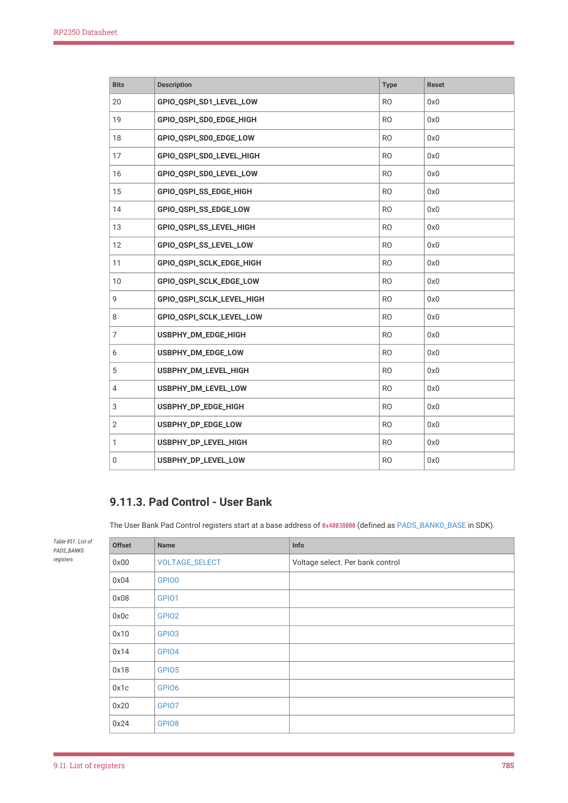
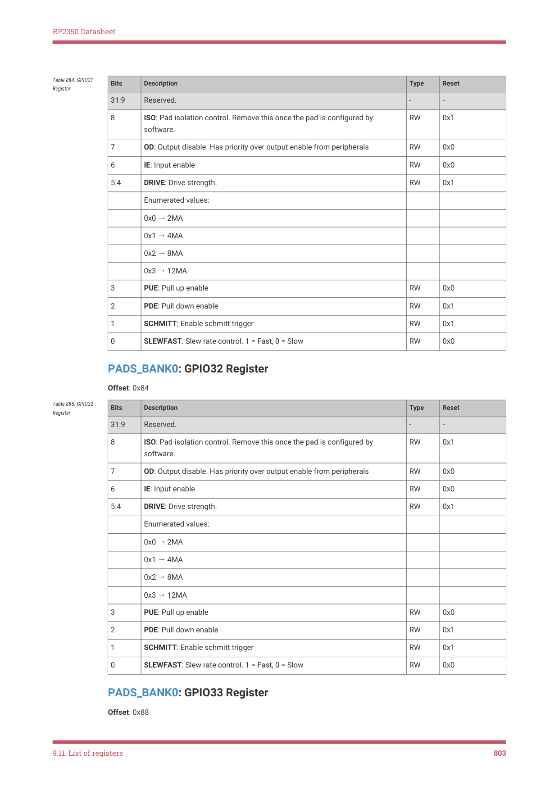

# 9.11.3. Pad Control - User Bank

RP2350 Datasheet

| Bits | Description | Type | Reset |
| --- | --- | --- | --- |
| 20 | GPIO_QSPI_SD1_LEVEL_LOW | RO | 0x0 |
| 19 | GPIO_QSPI_SD0_EDGE_HIGH | RO | 0x0 |
| 18 | GPIO_QSPI_SD0_EDGE_LOW | RO | 0x0 |
| 17 | GPIO_QSPI_SD0_LEVEL_HIGH | RO | 0x0 |
| 16 | GPIO_QSPI_SD0_LEVEL_LOW | RO | 0x0 |
| 15 | GPIO_QSPI_SS_EDGE_HIGH | RO | 0x0 |
| 14 | GPIO_QSPI_SS_EDGE_LOW | RO | 0x0 |
| 13 | GPIO_QSPI_SS_LEVEL_HIGH | RO | 0x0 |
| 12 | GPIO_QSPI_SS_LEVEL_LOW | RO | 0x0 |
| 11 | GPIO_QSPI_SCLK_EDGE_HIGH | RO | 0x0 |
| 10 | GPIO_QSPI_SCLK_EDGE_LOW | RO | 0x0 |
| 9 | GPIO_QSPI_SCLK_LEVEL_HIGH | RO | 0x0 |
| 8 | GPIO_QSPI_SCLK_LEVEL_LOW | RO | 0x0 |
| 7 | USBPHY_DM_EDGE_HIGH | RO | 0x0 |
| 6 | USBPHY_DM_EDGE_LOW | RO | 0x0 |
| 5 | USBPHY_DM_LEVEL_HIGH | RO | 0x0 |
| 4 | USBPHY_DM_LEVEL_LOW | RO | 0x0 |
| 3 | USBPHY_DP_EDGE_HIGH | RO | 0x0 |
| 2 | USBPHY_DP_EDGE_LOW | RO | 0x0 |
| 1 | USBPHY_DP_LEVEL_HIGH | RO | 0x0 |
| 0 | USBPHY_DP_LEVEL_LOW | RO | 0x0 |

9.11.3. Pad Control - User Bank

The User Bank Pad Control registers start at a base address of 0x40038000 (defined as PADS_BANK0_BASE in SDK).

Table 851. List of

Offset
Name
Info

PADS_BANK0

registers

0x00
VOLTAGE_SELECT
Voltage select. Per bank control

0x04
GPIO0

0x08
GPIO1

0x0c
GPIO2

0x10
GPIO3

0x14
GPIO4

0x18
GPIO5

0x1c
GPIO6

0x20
GPIO7

0x24
GPIO8

9.11. List of registers
785

RP2350 Datasheet

Offset
Name
Info

0x28
GPIO9

0x2c
GPIO10

0x30
GPIO11

0x34
GPIO12

0x38
GPIO13

0x3c
GPIO14

0x40
GPIO15

0x44
GPIO16

0x48
GPIO17

0x4c
GPIO18

0x50
GPIO19

0x54
GPIO20

0x58
GPIO21

0x5c
GPIO22

0x60
GPIO23

0x64
GPIO24

0x68
GPIO25

0x6c
GPIO26

0x70
GPIO27

0x74
GPIO28

0x78
GPIO29

0x7c
GPIO30

0x80
GPIO31

0x84
GPIO32

0x88
GPIO33

0x8c
GPIO34

0x90
GPIO35

0x94
GPIO36

0x98
GPIO37

0x9c
GPIO38

0xa0
GPIO39

0xa4
GPIO40

0xa8
GPIO41

0xac
GPIO42

0xb0
GPIO43

0xb4
GPIO44

9.11. List of registers
786

RP2350 Datasheet

Offset
Name
Info

0xb8
GPIO45

0xbc
GPIO46

0xc0
GPIO47

0xc4
SWCLK

0xc8
SWD

PADS_BANK0: VOLTAGE_SELECT Register

Offset: 0x00

Table 852.

Bits
Description
Type
Reset

VOLTAGE_SELECT

Register

31:1
Reserved.
-
-

0
Voltage select. Per bank control
RW
0x0

Enumerated values:

0x0 → 3V3: Set voltage to 3.3V (DVDD >= 2V5)

0x1 → 1V8: Set voltage to 1.8V (DVDD ⇐ 1V8)

PADS_BANK0: GPIO0 Register

Offset: 0x04

Table 853. GPIO0

Register
Bits
Description
Type
Reset

31:9
Reserved.
-
-

8
ISO: Pad isolation control. Remove this once the pad is configured by

RW
0x1

software.

7
OD: Output disable. Has priority over output enable from peripherals
RW
0x0

6
IE: Input enable
RW
0x0

5:4
DRIVE: Drive strength.
RW
0x1

Enumerated values:

0x0 → 2MA

0x1 → 4MA

0x2 → 8MA

0x3 → 12MA

3
PUE: Pull up enable
RW
0x0

2
PDE: Pull down enable
RW
0x1

1
SCHMITT: Enable schmitt trigger
RW
0x1

0
SLEWFAST: Slew rate control. 1 = Fast, 0 = Slow
RW
0x0

PADS_BANK0: GPIO1 Register

Offset: 0x08

9.11. List of registers
787

RP2350 Datasheet

Table 854. GPIO1

Register
Bits
Description
Type
Reset

31:9
Reserved.
-
-

8
ISO: Pad isolation control. Remove this once the pad is configured by

RW
0x1

software.

7
OD: Output disable. Has priority over output enable from peripherals
RW
0x0

6
IE: Input enable
RW
0x0

5:4
DRIVE: Drive strength.
RW
0x1

Enumerated values:

0x0 → 2MA

0x1 → 4MA

0x2 → 8MA

0x3 → 12MA

3
PUE: Pull up enable
RW
0x0

2
PDE: Pull down enable
RW
0x1

1
SCHMITT: Enable schmitt trigger
RW
0x1

0
SLEWFAST: Slew rate control. 1 = Fast, 0 = Slow
RW
0x0

PADS_BANK0: GPIO2 Register

Offset: 0x0c

Table 855. GPIO2

Register
Bits
Description
Type
Reset

31:9
Reserved.
-
-

8
ISO: Pad isolation control. Remove this once the pad is configured by

RW
0x1

software.

7
OD: Output disable. Has priority over output enable from peripherals
RW
0x0

6
IE: Input enable
RW
0x0

5:4
DRIVE: Drive strength.
RW
0x1

Enumerated values:

0x0 → 2MA

0x1 → 4MA

0x2 → 8MA

0x3 → 12MA

3
PUE: Pull up enable
RW
0x0

2
PDE: Pull down enable
RW
0x1

1
SCHMITT: Enable schmitt trigger
RW
0x1

0
SLEWFAST: Slew rate control. 1 = Fast, 0 = Slow
RW
0x0

PADS_BANK0: GPIO3 Register

Offset: 0x10

9.11. List of registers
788

RP2350 Datasheet

Table 856. GPIO3

Register
Bits
Description
Type
Reset

31:9
Reserved.
-
-

8
ISO: Pad isolation control. Remove this once the pad is configured by

RW
0x1

software.

7
OD: Output disable. Has priority over output enable from peripherals
RW
0x0

6
IE: Input enable
RW
0x0

5:4
DRIVE: Drive strength.
RW
0x1

Enumerated values:

0x0 → 2MA

0x1 → 4MA

0x2 → 8MA

0x3 → 12MA

3
PUE: Pull up enable
RW
0x0

2
PDE: Pull down enable
RW
0x1

1
SCHMITT: Enable schmitt trigger
RW
0x1

0
SLEWFAST: Slew rate control. 1 = Fast, 0 = Slow
RW
0x0

PADS_BANK0: GPIO4 Register

Offset: 0x14

Table 857. GPIO4

Register
Bits
Description
Type
Reset

31:9
Reserved.
-
-

8
ISO: Pad isolation control. Remove this once the pad is configured by

RW
0x1

software.

7
OD: Output disable. Has priority over output enable from peripherals
RW
0x0

6
IE: Input enable
RW
0x0

5:4
DRIVE: Drive strength.
RW
0x1

Enumerated values:

0x0 → 2MA

0x1 → 4MA

0x2 → 8MA

0x3 → 12MA

3
PUE: Pull up enable
RW
0x0

2
PDE: Pull down enable
RW
0x1

1
SCHMITT: Enable schmitt trigger
RW
0x1

0
SLEWFAST: Slew rate control. 1 = Fast, 0 = Slow
RW
0x0

PADS_BANK0: GPIO5 Register

Offset: 0x18

9.11. List of registers
789

RP2350 Datasheet

Table 858. GPIO5

Register
Bits
Description
Type
Reset

31:9
Reserved.
-
-

8
ISO: Pad isolation control. Remove this once the pad is configured by

RW
0x1

software.

7
OD: Output disable. Has priority over output enable from peripherals
RW
0x0

6
IE: Input enable
RW
0x0

5:4
DRIVE: Drive strength.
RW
0x1

Enumerated values:

0x0 → 2MA

0x1 → 4MA

0x2 → 8MA

0x3 → 12MA

3
PUE: Pull up enable
RW
0x0

2
PDE: Pull down enable
RW
0x1

1
SCHMITT: Enable schmitt trigger
RW
0x1

0
SLEWFAST: Slew rate control. 1 = Fast, 0 = Slow
RW
0x0

PADS_BANK0: GPIO6 Register

Offset: 0x1c

Table 859. GPIO6

Register
Bits
Description
Type
Reset

31:9
Reserved.
-
-

8
ISO: Pad isolation control. Remove this once the pad is configured by

RW
0x1

software.

7
OD: Output disable. Has priority over output enable from peripherals
RW
0x0

6
IE: Input enable
RW
0x0

5:4
DRIVE: Drive strength.
RW
0x1

Enumerated values:

0x0 → 2MA

0x1 → 4MA

0x2 → 8MA

0x3 → 12MA

3
PUE: Pull up enable
RW
0x0

2
PDE: Pull down enable
RW
0x1

1
SCHMITT: Enable schmitt trigger
RW
0x1

0
SLEWFAST: Slew rate control. 1 = Fast, 0 = Slow
RW
0x0

PADS_BANK0: GPIO7 Register

Offset: 0x20

9.11. List of registers
790

RP2350 Datasheet

Table 860. GPIO7

Register
Bits
Description
Type
Reset

31:9
Reserved.
-
-

8
ISO: Pad isolation control. Remove this once the pad is configured by

RW
0x1

software.

7
OD: Output disable. Has priority over output enable from peripherals
RW
0x0

6
IE: Input enable
RW
0x0

5:4
DRIVE: Drive strength.
RW
0x1

Enumerated values:

0x0 → 2MA

0x1 → 4MA

0x2 → 8MA

0x3 → 12MA

3
PUE: Pull up enable
RW
0x0

2
PDE: Pull down enable
RW
0x1

1
SCHMITT: Enable schmitt trigger
RW
0x1

0
SLEWFAST: Slew rate control. 1 = Fast, 0 = Slow
RW
0x0

PADS_BANK0: GPIO8 Register

Offset: 0x24

Table 861. GPIO8

Register
Bits
Description
Type
Reset

31:9
Reserved.
-
-

8
ISO: Pad isolation control. Remove this once the pad is configured by

RW
0x1

software.

7
OD: Output disable. Has priority over output enable from peripherals
RW
0x0

6
IE: Input enable
RW
0x0

5:4
DRIVE: Drive strength.
RW
0x1

Enumerated values:

0x0 → 2MA

0x1 → 4MA

0x2 → 8MA

0x3 → 12MA

3
PUE: Pull up enable
RW
0x0

2
PDE: Pull down enable
RW
0x1

1
SCHMITT: Enable schmitt trigger
RW
0x1

0
SLEWFAST: Slew rate control. 1 = Fast, 0 = Slow
RW
0x0

PADS_BANK0: GPIO9 Register

Offset: 0x28

9.11. List of registers
791

RP2350 Datasheet

Table 862. GPIO9

Register
Bits
Description
Type
Reset

31:9
Reserved.
-
-

8
ISO: Pad isolation control. Remove this once the pad is configured by

RW
0x1

software.

7
OD: Output disable. Has priority over output enable from peripherals
RW
0x0

6
IE: Input enable
RW
0x0

5:4
DRIVE: Drive strength.
RW
0x1

Enumerated values:

0x0 → 2MA

0x1 → 4MA

0x2 → 8MA

0x3 → 12MA

3
PUE: Pull up enable
RW
0x0

2
PDE: Pull down enable
RW
0x1

1
SCHMITT: Enable schmitt trigger
RW
0x1

0
SLEWFAST: Slew rate control. 1 = Fast, 0 = Slow
RW
0x0

PADS_BANK0: GPIO10 Register

Offset: 0x2c

Table 863. GPIO10

Register
Bits
Description
Type
Reset

31:9
Reserved.
-
-

8
ISO: Pad isolation control. Remove this once the pad is configured by

RW
0x1

software.

7
OD: Output disable. Has priority over output enable from peripherals
RW
0x0

6
IE: Input enable
RW
0x0

5:4
DRIVE: Drive strength.
RW
0x1

Enumerated values:

0x0 → 2MA

0x1 → 4MA

0x2 → 8MA

0x3 → 12MA

3
PUE: Pull up enable
RW
0x0

2
PDE: Pull down enable
RW
0x1

1
SCHMITT: Enable schmitt trigger
RW
0x1

0
SLEWFAST: Slew rate control. 1 = Fast, 0 = Slow
RW
0x0

PADS_BANK0: GPIO11 Register

Offset: 0x30

9.11. List of registers
792

RP2350 Datasheet

Table 864. GPIO11

Register
Bits
Description
Type
Reset

31:9
Reserved.
-
-

8
ISO: Pad isolation control. Remove this once the pad is configured by

RW
0x1

software.

7
OD: Output disable. Has priority over output enable from peripherals
RW
0x0

6
IE: Input enable
RW
0x0

5:4
DRIVE: Drive strength.
RW
0x1

Enumerated values:

0x0 → 2MA

0x1 → 4MA

0x2 → 8MA

0x3 → 12MA

3
PUE: Pull up enable
RW
0x0

2
PDE: Pull down enable
RW
0x1

1
SCHMITT: Enable schmitt trigger
RW
0x1

0
SLEWFAST: Slew rate control. 1 = Fast, 0 = Slow
RW
0x0

PADS_BANK0: GPIO12 Register

Offset: 0x34

Table 865. GPIO12

Register
Bits
Description
Type
Reset

31:9
Reserved.
-
-

8
ISO: Pad isolation control. Remove this once the pad is configured by

RW
0x1

software.

7
OD: Output disable. Has priority over output enable from peripherals
RW
0x0

6
IE: Input enable
RW
0x0

5:4
DRIVE: Drive strength.
RW
0x1

Enumerated values:

0x0 → 2MA

0x1 → 4MA

0x2 → 8MA

0x3 → 12MA

3
PUE: Pull up enable
RW
0x0

2
PDE: Pull down enable
RW
0x1

1
SCHMITT: Enable schmitt trigger
RW
0x1

0
SLEWFAST: Slew rate control. 1 = Fast, 0 = Slow
RW
0x0

PADS_BANK0: GPIO13 Register

Offset: 0x38

9.11. List of registers
793

RP2350 Datasheet

Table 866. GPIO13

Register
Bits
Description
Type
Reset

31:9
Reserved.
-
-

8
ISO: Pad isolation control. Remove this once the pad is configured by

RW
0x1

software.

7
OD: Output disable. Has priority over output enable from peripherals
RW
0x0

6
IE: Input enable
RW
0x0

5:4
DRIVE: Drive strength.
RW
0x1

Enumerated values:

0x0 → 2MA

0x1 → 4MA

0x2 → 8MA

0x3 → 12MA

3
PUE: Pull up enable
RW
0x0

2
PDE: Pull down enable
RW
0x1

1
SCHMITT: Enable schmitt trigger
RW
0x1

0
SLEWFAST: Slew rate control. 1 = Fast, 0 = Slow
RW
0x0

PADS_BANK0: GPIO14 Register

Offset: 0x3c

Table 867. GPIO14

Register
Bits
Description
Type
Reset

31:9
Reserved.
-
-

8
ISO: Pad isolation control. Remove this once the pad is configured by

RW
0x1

software.

7
OD: Output disable. Has priority over output enable from peripherals
RW
0x0

6
IE: Input enable
RW
0x0

5:4
DRIVE: Drive strength.
RW
0x1

Enumerated values:

0x0 → 2MA

0x1 → 4MA

0x2 → 8MA

0x3 → 12MA

3
PUE: Pull up enable
RW
0x0

2
PDE: Pull down enable
RW
0x1

1
SCHMITT: Enable schmitt trigger
RW
0x1

0
SLEWFAST: Slew rate control. 1 = Fast, 0 = Slow
RW
0x0

PADS_BANK0: GPIO15 Register

Offset: 0x40

9.11. List of registers
794

RP2350 Datasheet

Table 868. GPIO15

Register
Bits
Description
Type
Reset

31:9
Reserved.
-
-

8
ISO: Pad isolation control. Remove this once the pad is configured by

RW
0x1

software.

7
OD: Output disable. Has priority over output enable from peripherals
RW
0x0

6
IE: Input enable
RW
0x0

5:4
DRIVE: Drive strength.
RW
0x1

Enumerated values:

0x0 → 2MA

0x1 → 4MA

0x2 → 8MA

0x3 → 12MA

3
PUE: Pull up enable
RW
0x0

2
PDE: Pull down enable
RW
0x1

1
SCHMITT: Enable schmitt trigger
RW
0x1

0
SLEWFAST: Slew rate control. 1 = Fast, 0 = Slow
RW
0x0

PADS_BANK0: GPIO16 Register

Offset: 0x44

Table 869. GPIO16

Register
Bits
Description
Type
Reset

31:9
Reserved.
-
-

8
ISO: Pad isolation control. Remove this once the pad is configured by

RW
0x1

software.

7
OD: Output disable. Has priority over output enable from peripherals
RW
0x0

6
IE: Input enable
RW
0x0

5:4
DRIVE: Drive strength.
RW
0x1

Enumerated values:

0x0 → 2MA

0x1 → 4MA

0x2 → 8MA

0x3 → 12MA

3
PUE: Pull up enable
RW
0x0

2
PDE: Pull down enable
RW
0x1

1
SCHMITT: Enable schmitt trigger
RW
0x1

0
SLEWFAST: Slew rate control. 1 = Fast, 0 = Slow
RW
0x0

PADS_BANK0: GPIO17 Register

Offset: 0x48

9.11. List of registers
795

RP2350 Datasheet

Table 870. GPIO17

Register
Bits
Description
Type
Reset

31:9
Reserved.
-
-

8
ISO: Pad isolation control. Remove this once the pad is configured by

RW
0x1

software.

7
OD: Output disable. Has priority over output enable from peripherals
RW
0x0

6
IE: Input enable
RW
0x0

5:4
DRIVE: Drive strength.
RW
0x1

Enumerated values:

0x0 → 2MA

0x1 → 4MA

0x2 → 8MA

0x3 → 12MA

3
PUE: Pull up enable
RW
0x0

2
PDE: Pull down enable
RW
0x1

1
SCHMITT: Enable schmitt trigger
RW
0x1

0
SLEWFAST: Slew rate control. 1 = Fast, 0 = Slow
RW
0x0

PADS_BANK0: GPIO18 Register

Offset: 0x4c

Table 871. GPIO18

Register
Bits
Description
Type
Reset

31:9
Reserved.
-
-

8
ISO: Pad isolation control. Remove this once the pad is configured by

RW
0x1

software.

7
OD: Output disable. Has priority over output enable from peripherals
RW
0x0

6
IE: Input enable
RW
0x0

5:4
DRIVE: Drive strength.
RW
0x1

Enumerated values:

0x0 → 2MA

0x1 → 4MA

0x2 → 8MA

0x3 → 12MA

3
PUE: Pull up enable
RW
0x0

2
PDE: Pull down enable
RW
0x1

1
SCHMITT: Enable schmitt trigger
RW
0x1

0
SLEWFAST: Slew rate control. 1 = Fast, 0 = Slow
RW
0x0

PADS_BANK0: GPIO19 Register

Offset: 0x50

9.11. List of registers
796

RP2350 Datasheet

Table 872. GPIO19

Register
Bits
Description
Type
Reset

31:9
Reserved.
-
-

8
ISO: Pad isolation control. Remove this once the pad is configured by

RW
0x1

software.

7
OD: Output disable. Has priority over output enable from peripherals
RW
0x0

6
IE: Input enable
RW
0x0

5:4
DRIVE: Drive strength.
RW
0x1

Enumerated values:

0x0 → 2MA

0x1 → 4MA

0x2 → 8MA

0x3 → 12MA

3
PUE: Pull up enable
RW
0x0

2
PDE: Pull down enable
RW
0x1

1
SCHMITT: Enable schmitt trigger
RW
0x1

0
SLEWFAST: Slew rate control. 1 = Fast, 0 = Slow
RW
0x0

PADS_BANK0: GPIO20 Register

Offset: 0x54

Table 873. GPIO20

Register
Bits
Description
Type
Reset

31:9
Reserved.
-
-

8
ISO: Pad isolation control. Remove this once the pad is configured by

RW
0x1

software.

7
OD: Output disable. Has priority over output enable from peripherals
RW
0x0

6
IE: Input enable
RW
0x0

5:4
DRIVE: Drive strength.
RW
0x1

Enumerated values:

0x0 → 2MA

0x1 → 4MA

0x2 → 8MA

0x3 → 12MA

3
PUE: Pull up enable
RW
0x0

2
PDE: Pull down enable
RW
0x1

1
SCHMITT: Enable schmitt trigger
RW
0x1

0
SLEWFAST: Slew rate control. 1 = Fast, 0 = Slow
RW
0x0

PADS_BANK0: GPIO21 Register

Offset: 0x58

9.11. List of registers
797

RP2350 Datasheet

Table 874. GPIO21

Register
Bits
Description
Type
Reset

31:9
Reserved.
-
-

8
ISO: Pad isolation control. Remove this once the pad is configured by

RW
0x1

software.

7
OD: Output disable. Has priority over output enable from peripherals
RW
0x0

6
IE: Input enable
RW
0x0

5:4
DRIVE: Drive strength.
RW
0x1

Enumerated values:

0x0 → 2MA

0x1 → 4MA

0x2 → 8MA

0x3 → 12MA

3
PUE: Pull up enable
RW
0x0

2
PDE: Pull down enable
RW
0x1

1
SCHMITT: Enable schmitt trigger
RW
0x1

0
SLEWFAST: Slew rate control. 1 = Fast, 0 = Slow
RW
0x0

PADS_BANK0: GPIO22 Register

Offset: 0x5c

Table 875. GPIO22

Register
Bits
Description
Type
Reset

31:9
Reserved.
-
-

8
ISO: Pad isolation control. Remove this once the pad is configured by

RW
0x1

software.

7
OD: Output disable. Has priority over output enable from peripherals
RW
0x0

6
IE: Input enable
RW
0x0

5:4
DRIVE: Drive strength.
RW
0x1

Enumerated values:

0x0 → 2MA

0x1 → 4MA

0x2 → 8MA

0x3 → 12MA

3
PUE: Pull up enable
RW
0x0

2
PDE: Pull down enable
RW
0x1

1
SCHMITT: Enable schmitt trigger
RW
0x1

0
SLEWFAST: Slew rate control. 1 = Fast, 0 = Slow
RW
0x0

PADS_BANK0: GPIO23 Register

Offset: 0x60

9.11. List of registers
798

RP2350 Datasheet

Table 876. GPIO23

Register
Bits
Description
Type
Reset

31:9
Reserved.
-
-

8
ISO: Pad isolation control. Remove this once the pad is configured by

RW
0x1

software.

7
OD: Output disable. Has priority over output enable from peripherals
RW
0x0

6
IE: Input enable
RW
0x0

5:4
DRIVE: Drive strength.
RW
0x1

Enumerated values:

0x0 → 2MA

0x1 → 4MA

0x2 → 8MA

0x3 → 12MA

3
PUE: Pull up enable
RW
0x0

2
PDE: Pull down enable
RW
0x1

1
SCHMITT: Enable schmitt trigger
RW
0x1

0
SLEWFAST: Slew rate control. 1 = Fast, 0 = Slow
RW
0x0

PADS_BANK0: GPIO24 Register

Offset: 0x64

Table 877. GPIO24

Register
Bits
Description
Type
Reset

31:9
Reserved.
-
-

8
ISO: Pad isolation control. Remove this once the pad is configured by

RW
0x1

software.

7
OD: Output disable. Has priority over output enable from peripherals
RW
0x0

6
IE: Input enable
RW
0x0

5:4
DRIVE: Drive strength.
RW
0x1

Enumerated values:

0x0 → 2MA

0x1 → 4MA

0x2 → 8MA

0x3 → 12MA

3
PUE: Pull up enable
RW
0x0

2
PDE: Pull down enable
RW
0x1

1
SCHMITT: Enable schmitt trigger
RW
0x1

0
SLEWFAST: Slew rate control. 1 = Fast, 0 = Slow
RW
0x0

PADS_BANK0: GPIO25 Register

Offset: 0x68

9.11. List of registers
799

RP2350 Datasheet

Table 878. GPIO25

Register
Bits
Description
Type
Reset

31:9
Reserved.
-
-

8
ISO: Pad isolation control. Remove this once the pad is configured by

RW
0x1

software.

7
OD: Output disable. Has priority over output enable from peripherals
RW
0x0

6
IE: Input enable
RW
0x0

5:4
DRIVE: Drive strength.
RW
0x1

Enumerated values:

0x0 → 2MA

0x1 → 4MA

0x2 → 8MA

0x3 → 12MA

3
PUE: Pull up enable
RW
0x0

2
PDE: Pull down enable
RW
0x1

1
SCHMITT: Enable schmitt trigger
RW
0x1

0
SLEWFAST: Slew rate control. 1 = Fast, 0 = Slow
RW
0x0

PADS_BANK0: GPIO26 Register

Offset: 0x6c

Table 879. GPIO26

Register
Bits
Description
Type
Reset

31:9
Reserved.
-
-

8
ISO: Pad isolation control. Remove this once the pad is configured by

RW
0x1

software.

7
OD: Output disable. Has priority over output enable from peripherals
RW
0x0

6
IE: Input enable
RW
0x0

5:4
DRIVE: Drive strength.
RW
0x1

Enumerated values:

0x0 → 2MA

0x1 → 4MA

0x2 → 8MA

0x3 → 12MA

3
PUE: Pull up enable
RW
0x0

2
PDE: Pull down enable
RW
0x1

1
SCHMITT: Enable schmitt trigger
RW
0x1

0
SLEWFAST: Slew rate control. 1 = Fast, 0 = Slow
RW
0x0

PADS_BANK0: GPIO27 Register

Offset: 0x70

9.11. List of registers
800

RP2350 Datasheet

Table 880. GPIO27

Register
Bits
Description
Type
Reset

31:9
Reserved.
-
-

8
ISO: Pad isolation control. Remove this once the pad is configured by

RW
0x1

software.

7
OD: Output disable. Has priority over output enable from peripherals
RW
0x0

6
IE: Input enable
RW
0x0

5:4
DRIVE: Drive strength.
RW
0x1

Enumerated values:

0x0 → 2MA

0x1 → 4MA

0x2 → 8MA

0x3 → 12MA

3
PUE: Pull up enable
RW
0x0

2
PDE: Pull down enable
RW
0x1

1
SCHMITT: Enable schmitt trigger
RW
0x1

0
SLEWFAST: Slew rate control. 1 = Fast, 0 = Slow
RW
0x0

PADS_BANK0: GPIO28 Register

Offset: 0x74

Table 881. GPIO28

Register
Bits
Description
Type
Reset

31:9
Reserved.
-
-

8
ISO: Pad isolation control. Remove this once the pad is configured by

RW
0x1

software.

7
OD: Output disable. Has priority over output enable from peripherals
RW
0x0

6
IE: Input enable
RW
0x0

5:4
DRIVE: Drive strength.
RW
0x1

Enumerated values:

0x0 → 2MA

0x1 → 4MA

0x2 → 8MA

0x3 → 12MA

3
PUE: Pull up enable
RW
0x0

2
PDE: Pull down enable
RW
0x1

1
SCHMITT: Enable schmitt trigger
RW
0x1

0
SLEWFAST: Slew rate control. 1 = Fast, 0 = Slow
RW
0x0

PADS_BANK0: GPIO29 Register

Offset: 0x78

9.11. List of registers
801

RP2350 Datasheet

Table 882. GPIO29

Register
Bits
Description
Type
Reset

31:9
Reserved.
-
-

8
ISO: Pad isolation control. Remove this once the pad is configured by

RW
0x1

software.

7
OD: Output disable. Has priority over output enable from peripherals
RW
0x0

6
IE: Input enable
RW
0x0

5:4
DRIVE: Drive strength.
RW
0x1

Enumerated values:

0x0 → 2MA

0x1 → 4MA

0x2 → 8MA

0x3 → 12MA

3
PUE: Pull up enable
RW
0x0

2
PDE: Pull down enable
RW
0x1

1
SCHMITT: Enable schmitt trigger
RW
0x1

0
SLEWFAST: Slew rate control. 1 = Fast, 0 = Slow
RW
0x0

PADS_BANK0: GPIO30 Register

Offset: 0x7c

Table 883. GPIO30

Register
Bits
Description
Type
Reset

31:9
Reserved.
-
-

8
ISO: Pad isolation control. Remove this once the pad is configured by

RW
0x1

software.

7
OD: Output disable. Has priority over output enable from peripherals
RW
0x0

6
IE: Input enable
RW
0x0

5:4
DRIVE: Drive strength.
RW
0x1

Enumerated values:

0x0 → 2MA

0x1 → 4MA

0x2 → 8MA

0x3 → 12MA

3
PUE: Pull up enable
RW
0x0

2
PDE: Pull down enable
RW
0x1

1
SCHMITT: Enable schmitt trigger
RW
0x1

0
SLEWFAST: Slew rate control. 1 = Fast, 0 = Slow
RW
0x0

PADS_BANK0: GPIO31 Register

Offset: 0x80

9.11. List of registers
802

RP2350 Datasheet

Table 884. GPIO31

Register
Bits
Description
Type
Reset

31:9
Reserved.
-
-

8
ISO: Pad isolation control. Remove this once the pad is configured by

RW
0x1

software.

7
OD: Output disable. Has priority over output enable from peripherals
RW
0x0

6
IE: Input enable
RW
0x0

5:4
DRIVE: Drive strength.
RW
0x1

Enumerated values:

0x0 → 2MA

0x1 → 4MA

0x2 → 8MA

0x3 → 12MA

3
PUE: Pull up enable
RW
0x0

2
PDE: Pull down enable
RW
0x1

1
SCHMITT: Enable schmitt trigger
RW
0x1

0
SLEWFAST: Slew rate control. 1 = Fast, 0 = Slow
RW
0x0

PADS_BANK0: GPIO32 Register

Offset: 0x84

Table 885. GPIO32

Register
Bits
Description
Type
Reset

31:9
Reserved.
-
-

8
ISO: Pad isolation control. Remove this once the pad is configured by

RW
0x1

software.

7
OD: Output disable. Has priority over output enable from peripherals
RW
0x0

6
IE: Input enable
RW
0x0

5:4
DRIVE: Drive strength.
RW
0x1

Enumerated values:

0x0 → 2MA

0x1 → 4MA

0x2 → 8MA

0x3 → 12MA

3
PUE: Pull up enable
RW
0x0

2
PDE: Pull down enable
RW
0x1

1
SCHMITT: Enable schmitt trigger
RW
0x1

0
SLEWFAST: Slew rate control. 1 = Fast, 0 = Slow
RW
0x0

PADS_BANK0: GPIO33 Register

Offset: 0x88

9.11. List of registers
803

RP2350 Datasheet

Table 886. GPIO33

Register
Bits
Description
Type
Reset

31:9
Reserved.
-
-

8
ISO: Pad isolation control. Remove this once the pad is configured by

RW
0x1

software.

7
OD: Output disable. Has priority over output enable from peripherals
RW
0x0

6
IE: Input enable
RW
0x0

5:4
DRIVE: Drive strength.
RW
0x1

Enumerated values:

0x0 → 2MA

0x1 → 4MA

0x2 → 8MA

0x3 → 12MA

3
PUE: Pull up enable
RW
0x0

2
PDE: Pull down enable
RW
0x1

1
SCHMITT: Enable schmitt trigger
RW
0x1

0
SLEWFAST: Slew rate control. 1 = Fast, 0 = Slow
RW
0x0

PADS_BANK0: GPIO34 Register

Offset: 0x8c

Table 887. GPIO34

Register
Bits
Description
Type
Reset

31:9
Reserved.
-
-

8
ISO: Pad isolation control. Remove this once the pad is configured by

RW
0x1

software.

7
OD: Output disable. Has priority over output enable from peripherals
RW
0x0

6
IE: Input enable
RW
0x0

5:4
DRIVE: Drive strength.
RW
0x1

Enumerated values:

0x0 → 2MA

0x1 → 4MA

0x2 → 8MA

0x3 → 12MA

3
PUE: Pull up enable
RW
0x0

2
PDE: Pull down enable
RW
0x1

1
SCHMITT: Enable schmitt trigger
RW
0x1

0
SLEWFAST: Slew rate control. 1 = Fast, 0 = Slow
RW
0x0

PADS_BANK0: GPIO35 Register

Offset: 0x90

9.11. List of registers
804

RP2350 Datasheet

Table 888. GPIO35

Register
Bits
Description
Type
Reset

31:9
Reserved.
-
-

8
ISO: Pad isolation control. Remove this once the pad is configured by

RW
0x1

software.

7
OD: Output disable. Has priority over output enable from peripherals
RW
0x0

6
IE: Input enable
RW
0x0

5:4
DRIVE: Drive strength.
RW
0x1

Enumerated values:

0x0 → 2MA

0x1 → 4MA

0x2 → 8MA

0x3 → 12MA

3
PUE: Pull up enable
RW
0x0

2
PDE: Pull down enable
RW
0x1

1
SCHMITT: Enable schmitt trigger
RW
0x1

0
SLEWFAST: Slew rate control. 1 = Fast, 0 = Slow
RW
0x0

PADS_BANK0: GPIO36 Register

Offset: 0x94

Table 889. GPIO36

Register
Bits
Description
Type
Reset

31:9
Reserved.
-
-

8
ISO: Pad isolation control. Remove this once the pad is configured by

RW
0x1

software.

7
OD: Output disable. Has priority over output enable from peripherals
RW
0x0

6
IE: Input enable
RW
0x0

5:4
DRIVE: Drive strength.
RW
0x1

Enumerated values:

0x0 → 2MA

0x1 → 4MA

0x2 → 8MA

0x3 → 12MA

3
PUE: Pull up enable
RW
0x0

2
PDE: Pull down enable
RW
0x1

1
SCHMITT: Enable schmitt trigger
RW
0x1

0
SLEWFAST: Slew rate control. 1 = Fast, 0 = Slow
RW
0x0

PADS_BANK0: GPIO37 Register

Offset: 0x98

9.11. List of registers
805

RP2350 Datasheet

Table 890. GPIO37

Register
Bits
Description
Type
Reset

31:9
Reserved.
-
-

8
ISO: Pad isolation control. Remove this once the pad is configured by

RW
0x1

software.

7
OD: Output disable. Has priority over output enable from peripherals
RW
0x0

6
IE: Input enable
RW
0x0

5:4
DRIVE: Drive strength.
RW
0x1

Enumerated values:

0x0 → 2MA

0x1 → 4MA

0x2 → 8MA

0x3 → 12MA

3
PUE: Pull up enable
RW
0x0

2
PDE: Pull down enable
RW
0x1

1
SCHMITT: Enable schmitt trigger
RW
0x1

0
SLEWFAST: Slew rate control. 1 = Fast, 0 = Slow
RW
0x0

PADS_BANK0: GPIO38 Register

Offset: 0x9c

Table 891. GPIO38

Register
Bits
Description
Type
Reset

31:9
Reserved.
-
-

8
ISO: Pad isolation control. Remove this once the pad is configured by

RW
0x1

software.

7
OD: Output disable. Has priority over output enable from peripherals
RW
0x0

6
IE: Input enable
RW
0x0

5:4
DRIVE: Drive strength.
RW
0x1

Enumerated values:

0x0 → 2MA

0x1 → 4MA

0x2 → 8MA

0x3 → 12MA

3
PUE: Pull up enable
RW
0x0

2
PDE: Pull down enable
RW
0x1

1
SCHMITT: Enable schmitt trigger
RW
0x1

0
SLEWFAST: Slew rate control. 1 = Fast, 0 = Slow
RW
0x0

PADS_BANK0: GPIO39 Register

Offset: 0xa0

9.11. List of registers
806

RP2350 Datasheet

Table 892. GPIO39

Register
Bits
Description
Type
Reset

31:9
Reserved.
-
-

8
ISO: Pad isolation control. Remove this once the pad is configured by

RW
0x1

software.

7
OD: Output disable. Has priority over output enable from peripherals
RW
0x0

6
IE: Input enable
RW
0x0

5:4
DRIVE: Drive strength.
RW
0x1

Enumerated values:

0x0 → 2MA

0x1 → 4MA

0x2 → 8MA

0x3 → 12MA

3
PUE: Pull up enable
RW
0x0

2
PDE: Pull down enable
RW
0x1

1
SCHMITT: Enable schmitt trigger
RW
0x1

0
SLEWFAST: Slew rate control. 1 = Fast, 0 = Slow
RW
0x0

PADS_BANK0: GPIO40 Register

Offset: 0xa4

Table 893. GPIO40

Register
Bits
Description
Type
Reset

31:9
Reserved.
-
-

8
ISO: Pad isolation control. Remove this once the pad is configured by

RW
0x1

software.

7
OD: Output disable. Has priority over output enable from peripherals
RW
0x0

6
IE: Input enable
RW
0x0

5:4
DRIVE: Drive strength.
RW
0x1

Enumerated values:

0x0 → 2MA

0x1 → 4MA

0x2 → 8MA

0x3 → 12MA

3
PUE: Pull up enable
RW
0x0

2
PDE: Pull down enable
RW
0x1

1
SCHMITT: Enable schmitt trigger
RW
0x1

0
SLEWFAST: Slew rate control. 1 = Fast, 0 = Slow
RW
0x0

PADS_BANK0: GPIO41 Register

Offset: 0xa8

9.11. List of registers
807

RP2350 Datasheet

Table 894. GPIO41

Register
Bits
Description
Type
Reset

31:9
Reserved.
-
-

8
ISO: Pad isolation control. Remove this once the pad is configured by

RW
0x1

software.

7
OD: Output disable. Has priority over output enable from peripherals
RW
0x0

6
IE: Input enable
RW
0x0

5:4
DRIVE: Drive strength.
RW
0x1

Enumerated values:

0x0 → 2MA

0x1 → 4MA

0x2 → 8MA

0x3 → 12MA

3
PUE: Pull up enable
RW
0x0

2
PDE: Pull down enable
RW
0x1

1
SCHMITT: Enable schmitt trigger
RW
0x1

0
SLEWFAST: Slew rate control. 1 = Fast, 0 = Slow
RW
0x0

PADS_BANK0: GPIO42 Register

Offset: 0xac

Table 895. GPIO42

Register
Bits
Description
Type
Reset

31:9
Reserved.
-
-

8
ISO: Pad isolation control. Remove this once the pad is configured by

RW
0x1

software.

7
OD: Output disable. Has priority over output enable from peripherals
RW
0x0

6
IE: Input enable
RW
0x0

5:4
DRIVE: Drive strength.
RW
0x1

Enumerated values:

0x0 → 2MA

0x1 → 4MA

0x2 → 8MA

0x3 → 12MA

3
PUE: Pull up enable
RW
0x0

2
PDE: Pull down enable
RW
0x1

1
SCHMITT: Enable schmitt trigger
RW
0x1

0
SLEWFAST: Slew rate control. 1 = Fast, 0 = Slow
RW
0x0

PADS_BANK0: GPIO43 Register

Offset: 0xb0

9.11. List of registers
808

RP2350 Datasheet

Table 896. GPIO43

Register
Bits
Description
Type
Reset

31:9
Reserved.
-
-

8
ISO: Pad isolation control. Remove this once the pad is configured by

RW
0x1

software.

7
OD: Output disable. Has priority over output enable from peripherals
RW
0x0

6
IE: Input enable
RW
0x0

5:4
DRIVE: Drive strength.
RW
0x1

Enumerated values:

0x0 → 2MA

0x1 → 4MA

0x2 → 8MA

0x3 → 12MA

3
PUE: Pull up enable
RW
0x0

2
PDE: Pull down enable
RW
0x1

1
SCHMITT: Enable schmitt trigger
RW
0x1

0
SLEWFAST: Slew rate control. 1 = Fast, 0 = Slow
RW
0x0

PADS_BANK0: GPIO44 Register

Offset: 0xb4

Table 897. GPIO44

Register
Bits
Description
Type
Reset

31:9
Reserved.
-
-

8
ISO: Pad isolation control. Remove this once the pad is configured by

RW
0x1

software.

7
OD: Output disable. Has priority over output enable from peripherals
RW
0x0

6
IE: Input enable
RW
0x0

5:4
DRIVE: Drive strength.
RW
0x1

Enumerated values:

0x0 → 2MA

0x1 → 4MA

0x2 → 8MA

0x3 → 12MA

3
PUE: Pull up enable
RW
0x0

2
PDE: Pull down enable
RW
0x1

1
SCHMITT: Enable schmitt trigger
RW
0x1

0
SLEWFAST: Slew rate control. 1 = Fast, 0 = Slow
RW
0x0

PADS_BANK0: GPIO45 Register

Offset: 0xb8

9.11. List of registers
809

RP2350 Datasheet

Table 898. GPIO45

Register
Bits
Description
Type
Reset

31:9
Reserved.
-
-

8
ISO: Pad isolation control. Remove this once the pad is configured by

RW
0x1

software.

7
OD: Output disable. Has priority over output enable from peripherals
RW
0x0

6
IE: Input enable
RW
0x0

5:4
DRIVE: Drive strength.
RW
0x1

Enumerated values:

0x0 → 2MA

0x1 → 4MA

0x2 → 8MA

0x3 → 12MA

3
PUE: Pull up enable
RW
0x0

2
PDE: Pull down enable
RW
0x1

1
SCHMITT: Enable schmitt trigger
RW
0x1

0
SLEWFAST: Slew rate control. 1 = Fast, 0 = Slow
RW
0x0

PADS_BANK0: GPIO46 Register

Offset: 0xbc

Table 899. GPIO46

Register
Bits
Description
Type
Reset

31:9
Reserved.
-
-

8
ISO: Pad isolation control. Remove this once the pad is configured by

RW
0x1

software.

7
OD: Output disable. Has priority over output enable from peripherals
RW
0x0

6
IE: Input enable
RW
0x0

5:4
DRIVE: Drive strength.
RW
0x1

Enumerated values:

0x0 → 2MA

0x1 → 4MA

0x2 → 8MA

0x3 → 12MA

3
PUE: Pull up enable
RW
0x0

2
PDE: Pull down enable
RW
0x1

1
SCHMITT: Enable schmitt trigger
RW
0x1

0
SLEWFAST: Slew rate control. 1 = Fast, 0 = Slow
RW
0x0

PADS_BANK0: GPIO47 Register

Offset: 0xc0

9.11. List of registers
810

RP2350 Datasheet

Table 900. GPIO47

Register
Bits
Description
Type
Reset

31:9
Reserved.
-
-

8
ISO: Pad isolation control. Remove this once the pad is configured by

RW
0x1

software.

7
OD: Output disable. Has priority over output enable from peripherals
RW
0x0

6
IE: Input enable
RW
0x0

5:4
DRIVE: Drive strength.
RW
0x1

Enumerated values:

0x0 → 2MA

0x1 → 4MA

0x2 → 8MA

0x3 → 12MA

3
PUE: Pull up enable
RW
0x0

2
PDE: Pull down enable
RW
0x1

1
SCHMITT: Enable schmitt trigger
RW
0x1

0
SLEWFAST: Slew rate control. 1 = Fast, 0 = Slow
RW
0x0

PADS_BANK0: SWCLK Register

Offset: 0xc4

Table 901. SWCLK

Register
Bits
Description
Type
Reset

31:9
Reserved.
-
-

8
ISO: Pad isolation control. Remove this once the pad is configured by

RW
0x0

software.

7
OD: Output disable. Has priority over output enable from peripherals
RW
0x0

6
IE: Input enable
RW
0x1

5:4
DRIVE: Drive strength.
RW
0x1

Enumerated values:

0x0 → 2MA

0x1 → 4MA

0x2 → 8MA

0x3 → 12MA

3
PUE: Pull up enable
RW
0x1

2
PDE: Pull down enable
RW
0x0

1
SCHMITT: Enable schmitt trigger
RW
0x1

0
SLEWFAST: Slew rate control. 1 = Fast, 0 = Slow
RW
0x0

PADS_BANK0: SWD Register

Offset: 0xc8

9.11. List of registers
811
