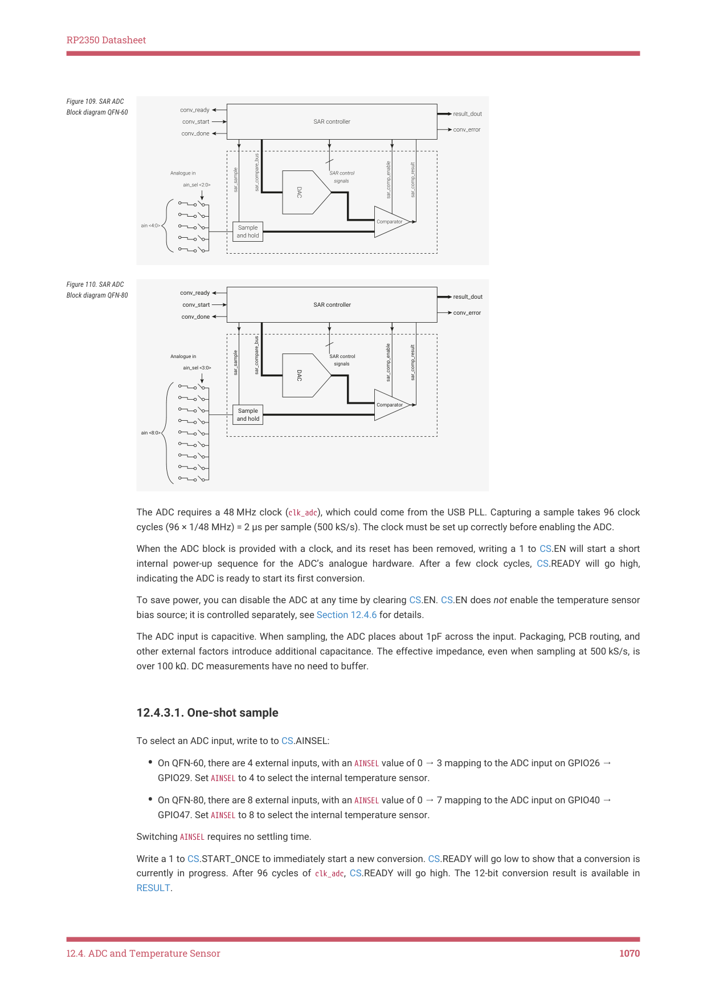

# 12.4.3. SAR ADC

12.4.3. SAR ADC

The Successive Approximation Register Analogue to Digital Converter (SAR ADC) is a combination of digital controller

and analogue circuit as shown in Figure 109 and Figure 110 .

12.4. ADC and Temperature Sensor
1069

RP2350 Datasheet

Figure 109. SAR ADC

Block diagram QFN-60

Figure 110. SAR ADC

Block diagram QFN-80

The ADC requires a 48 MHz clock (clk_adc), which could come from the USB PLL. Capturing a sample takes 96 clock

cycles (96 × 1/48 MHz) = 2 μs per sample (500 kS/s). The clock must be set up correctly before enabling the ADC.

When the ADC block is provided with a clock, and its reset has been removed, writing a 1 to CS.EN will start a short

internal power-up sequence for the ADC’s analogue hardware. After a few clock cycles, CS.READY will go high,

indicating the ADC is ready to start its first conversion.

To save power, you can disable the ADC at any time by clearing CS.EN. CS.EN does not enable the temperature sensor

bias source; it is controlled separately, see Section 12.4.6 for details.

The ADC input is capacitive. When sampling, the ADC places about 1pF across the input. Packaging, PCB routing, and

other external factors introduce additional capacitance. The effective impedance, even when sampling at 500 kS/s, is

over 100 kΩ. DC measurements have no need to buffer.

12.4.3.1. One-shot sample

To select an ADC input, write to to CS.AINSEL:

• On QFN-60, there are 4 external inputs, with an AINSEL value of 0 → 3 mapping to the ADC input on GPIO26 →

GPIO29. Set AINSEL to 4 to select the internal temperature sensor.
• On QFN-80, there are 8 external inputs, with an AINSEL value of 0 → 7 mapping to the ADC input on GPIO40 →

GPIO47. Set AINSEL to 8 to select the internal temperature sensor.

Switching AINSEL requires no settling time.

Write a 1 to CS.START_ONCE to immediately start a new conversion. CS.READY will go low to show that a conversion is

currently in progress. After 96 cycles of clk_adc, CS.READY will go high. The 12-bit conversion result is available in

RESULT.

12.4. ADC and Temperature Sensor
1070

RP2350 Datasheet

12.4.3.2. Free-running sampling

When CS.START_MANY is set, the ADC automatically starts new conversions at regular intervals. The most recent

conversion result is always available in RESULT, but for IRQ or DMA-driven streaming of samples, you must enable the

ADC FIFO (Section 12.4.3.4).

By default (DIV = 0), new conversions start immediately after the previous conversion finishes, producing a new sample

every 96 cycles. At a clock frequency of 48 MHz, this produces 500 kS/s.

Set DIV.INT to a positive value n to trigger the ADC once per n + 1 cycles. The ADC ignores this if a conversion is

currently in progress, so generally n will be ≥ 96. For example, setting DIV.INT to 47999 runs the ADC at 1 kS/s, if running

from a 48 MHz clock.

The pacing timer supports fractional-rate division (first order delta sigma). When setting DIV.FRAC to a non-zero value,

the ADC starts a new conversion once per 
 cycles on average, by changing the sample interval

between 
 and 
.

12.4.3.3. Sampling multiple inputs

CS.RROBIN allows the ADC to sample multiple inputs in an interleaved fashion while performing free-running sampling.

Each bit in RROBIN corresponds to one of the five possible values of CS.AINSEL. When the ADC completes a conversion,

CS.AINSEL automatically cycles to the next input whose corresponding bit is set in RROBIN.

To disable the round-robin sampling feature, write all-zeroes to CS.RROBIN.

For example, if AINSEL is initially 0, and RROBIN is set to 0x06 (bits 1 and 2 are set), the ADC samples channels in the

following order:

1. Channel 0

2. Channel 1

3. Channel 2

4. Channel 1

5. Channel 2

6. Channel 1

7. Channel 2

The ADC continues to sample channels 1 and 2 indefinitely.

NOTE

The initial value of AINSEL does not need to correspond with a set bit in RROBIN.

12.4.3.4. Sample FIFO

You can read ADC samples directly from the RESULT register or store them in a local 8-entry FIFO and read out from

FIFO. Use the FCS register to control FIFO operation.

When FCS.EN is set, the ADC writes each conversion result to the FIFO. A software interrupt handler or the RP2350 DMA

can read this sample from the FIFO when notified by the ADC’s IRQ or DREQ signals. Alternatively, software can poll the

status bits in FCS to wait for each sample to become available.

If the FIFO is full when a conversion completes, the sticky error flag FCS.OVER is set. When the FIFO is full, the current

FIFO contents do not change, so any conversions that complete during this time are lost.

Two flags control the data written to the FIFO by the ADC:

12.4. ADC and Temperature Sensor
1071

RP2350 Datasheet

• FCS.SHIFT right-shifts the FIFO data to eight bits in size (i.e. FIFO bits 7:0 are conversion result bits 11:4). This is

suitable for 8-bit DMA transfer to a byte buffer in memory, allowing deeper capture buffers, at the cost of some

precision.
• FCS.ERR sets the FIFO.ERR flag of each FIFO value, showing that a conversion error took place, i.e. the SAR failed

to converge.

Conversion errors indicate that the comparison of one or more bits failed to complete in the time allowed. Conversion

errors are typically caused by comparator metastability: the closer to the comparator threshold the input signal is, the

longer it takes to make a decision. The higher the comparator gain, the lower the probability of conversion errors.

CAUTION

Because conversion errors produce undefined results, you should always discard samples that contain conversion

errors.

12.4.3.5. DMA

The RP2350 DMA (Section 12.6) can fetch ADC samples from the sample FIFO, by performing a normal memory-

mapped read on the FIFO register, paced by the ADC_DREQ system data request signal. Before you can use the DMA to

fetch ADC samples, you must:

• Enable the sample FIFO (FCS.EN) so that samples are written to it; the FIFO is disabled by default so that it does

not inadvertently fill when the ADC is used for one-shot conversions. Configure the ADC sample rate (Section

12.4.3.2) before starting the ADC.
• Enable the ADC’s data request handshake (DREQ) via FCS.DREQ_EN.
• In the DMA channel used for the transfer, select the DREQ_ADC data request signal (Section 12.6.4.1).
• Set the threshold for DREQ assertion (FCS.THRESH) to 1, so that the DMA transfers as soon as a single sample is

present in the FIFO. This is also the threshold used for IRQ assertion, so non-DMA use cases might prefer a higher

value for less frequent interrupts.
• If the DMA transfer size is set to 8 bits (so that the DMA transfers to a byte array in memory), set FCS.SHIFT to pre-

shift the FIFO samples to 8 bits of significance.
• To sample multiple input channels, write a mask of those channels to CS.RROBIN. Additionally, select the first

channel to sample with CS.AINSEL.

Once the ADC is suitably configured, start the DMA channel first, then the ADC conversion via CS.START_MANY. Once

the DMA completes, you can halt the ADC if you are finished sampling, or promptly start a new DMA transfer before the

FIFO fills up. After clearing CS.START_MANY to halt the ADC, software should poll CS.READY to make sure the last

conversion has finished, then drain any stray samples from the FIFO.

12.4.3.6. Interrupts

Use INTE to generate an interrupt when the FIFO level reaches a threshold defined in FCS.THRESH.

Use INTS to read the interrupt status. To clear the interrupt, drain the FIFO to a level lower than FCS.THRESH.

12.4.3.7. Supply

RP2350 separates the ADC supply out on its own pin to allow noise filtering.

12.4. ADC and Temperature Sensor
1072

## Embedded Images

