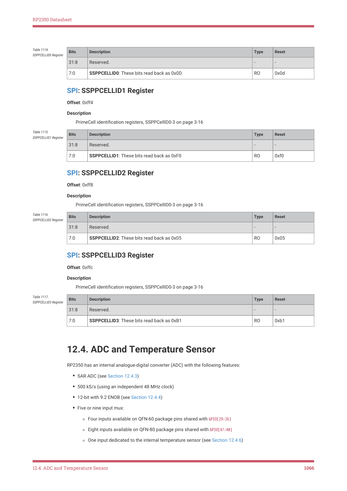

# 12.4. ADC and Temperature Sensor

12.4. ADC and Temperature Sensor

RP2350 has an internal analogue-digital converter (ADC) with the following features:

• SAR ADC (see Section 12.4.3)
• 500 kS/s (using an independent 48 MHz clock)
• 12-bit with 9.2 ENOB (see Section 12.4.4)
• Five or nine input mux:

◦Four inputs available on QFN-60 package pins shared with GPIO[29:26]

◦Eight inputs available on QFN-80 package pins shared with GPIO[47:40]

◦One input dedicated to the internal temperature sensor (see Section 12.4.6)

12.4. ADC and Temperature Sensor
1066

RP2350 Datasheet

• Eight element receive sample FIFO
• Interrupt generation
• DMA interface (see Section 12.4.3.5)

Figure 107 shows the arrangement of ADC channels in the QFN-60 package. Figure 108 shows the same for QFN-80.

Figure 107. ADC

Connection Diagram

for QFN-60. This

package features four

external ADC inputs (0

through 3), on Bank 0

GPIOs 26 through 29.

The internal

temperature sensor

connects to a fifth

channel (channel 4).

This is functionally the

same ADC

arrangement as

RP2040, although the

underlying hardware is

different, to support

the additional

channels on QFN-80.

12.4. ADC and Temperature Sensor
1067
