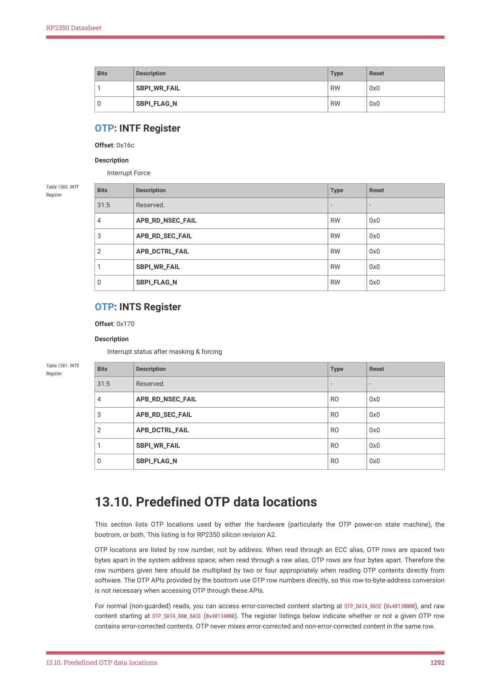
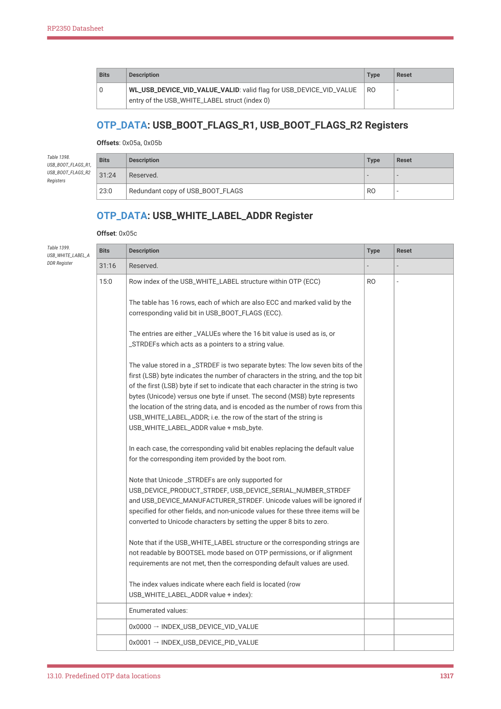
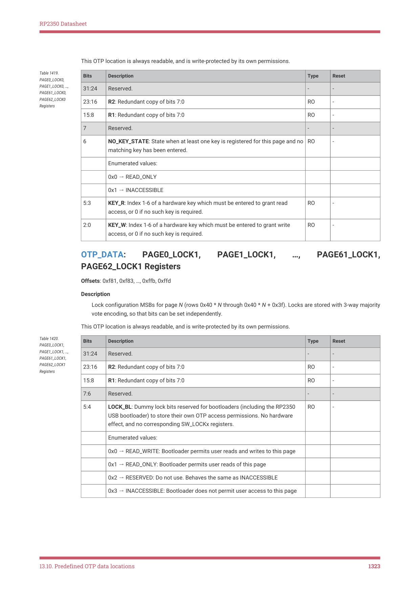

# 13.10. Predefined OTP data locations

13.10. Predefined OTP data locations

This section lists OTP locations used by either the hardware (particularly the OTP power-on state machine), the

bootrom, or both. This listing is for RP2350 silicon revision A2.

OTP locations are listed by row number, not by address. When read through an ECC alias, OTP rows are spaced two

bytes apart in the system address space; when read through a raw alias, OTP rows are four bytes apart. Therefore the

row numbers given here should be multiplied by two or four appropriately when reading OTP contents directly from

software. The OTP APIs provided by the bootrom use OTP row numbers directly, so this row-to-byte-address conversion

is not necessary when accessing OTP through these APIs.

For normal (non-guarded) reads, you can access error-corrected content starting at OTP_DATA_BASE (0x40130000), and raw

content starting at OTP_DATA_RAW_BASE (0x40134000). The register listings below indicate whether or not a given OTP row

contains error-corrected contents. OTP never mixes error-corrected and non-error-corrected content in the same row.

13.10. Predefined OTP data locations
1292

RP2350 Datasheet

All predefined data fields have some form of redundancy. Where ECC is not viable, for instance because a location is

expected to have individual bits programmed at different times, best-of-three majority vote is used instead. The only

exception to this is the critical hardware flags in CRIT0 and CRIT1. These flags use a three-of-eight vote encoding for

each individual flag: the flag is considered set when at least three bits are set out of the eight redundant bit locations.

The description for each row indicates the type of redundancy.

Pages 3 through 60 (rows 0x0c0 through 0xf3f) are free for arbitrary user content such as OTP-resident bootloaders, and

Raspberry Pi will avoid allocating any of these locations for bootrom configuration if possible. This is a total of 7424

bytes of ECC-protected content.

Page 2 (rows 0x080 through 0x0bf) is also available for user content if secure boot is disabled. It is partially available if

secure boot is enabled and fewer than four boot key fingerprints are registered. This is an additional 128 ECC bytes

potentially available for user content.

Pages 0, 1, and 61 through 63 are reserved for future use by Raspberry Pi. Software should avoid allocating content in

these regions, even if they currently have no defined use in this data listing.

| Offset | Name | Info |
| --- | --- | --- |
| 0x000 | CHIPID0 | Bits 15:0 of public device ID. (ECC) The CHIPID0..3 rows contain a 64-bit random identifier for this chip, which can be read from the USB bootloader PICOBOOT interface or from the get_sys_info ROM API. The number of random bits makes the occurrence of twins exceedingly unlikely: for example, a fleet of a hundred million devices has a 99.97% probability of no twinned IDs. This is estimated to be lower than the occurrence of process errors in the assignment of sequential random IDs, and for practical purposes CHIPID may be treated as unique. |
| 0x001 | CHIPID1 | Bits 31:16 of public device ID (ECC) |
| 0x002 | CHIPID2 | Bits 47:32 of public device ID (ECC) |
| 0x003 | CHIPID3 | Bits 63:48 of public device ID (ECC) |
| 0x004 | RANDID0 | Bits 15:0 of private per-device random number (ECC) The RANDID0..7 rows form a 128-bit random number generated during device test. This ID is not exposed through the USB PICOBOOT GET_INFO command or the ROM get sys info() API. However note that the _ _ USB PICOBOOT OTP access point can read the entirety of page 0, so this value is not meaningfully private unless the USB PICOBOOT interface is disabled via the DISABLE_BOOTSEL_USB_PICOBOOT_IFC flag in BOOT_FLAGS0. |
| 0x005 | RANDID1 | Bits 31:16 of private per-device random number (ECC) |
| 0x006 | RANDID2 | Bits 47:32 of private per-device random number (ECC) |
| 0x007 | RANDID3 | Bits 63:48 of private per-device random number (ECC) |
| 0x008 | RANDID4 | Bits 79:64 of private per-device random number (ECC) |
| 0x009 | RANDID5 | Bits 95:80 of private per-device random number (ECC) |
| 0x00a | RANDID6 | Bits 111:96 of private per-device random number (ECC) |
| 0x00b | RANDID7 | Bits 127:112 of private per-device random number (ECC) |

Table 1362. List of

13.10. Predefined OTP data locations
1293

RP2350 Datasheet

| Offset | Name | Info |
| --- | --- | --- |
| 0x010 | ROSC_CALIB | Ring oscillator frequency in kHz, measured during manufacturing (ECC) This is measured at 1.1 V, at room temperature, with the ROSC configuration registers in their reset state. |
| 0x011 | LPOSC_CALIB | Low-power oscillator frequency in Hz, measured during manufacturing (ECC) This is measured at 1.1V, at room temperature, with the LPOSC trim register in its reset state. |
| 0x018 | NUM_GPIOS | The number of main user GPIOs (bank 0). Should read 48 in the QFN80 package, and 30 in the QFN60 package. (ECC) |
| 0x036 | INFO_CRC0 | Lower 16 bits of CRC32 of OTP addresses 0x00 through 0x6b (polynomial 0x4c11db7, input reflected, output reflected, seed all-ones, final XOR all-ones) (ECC) |
| 0x037 | INFO_CRC1 | Upper 16 bits of CRC32 of OTP addresses 0x00 through 0x6b (ECC) |
| 0x038 | CRIT0 | Page 0 critical boot flags (RBIT-8) |
| 0x039 | CRIT0_R1 | Redundant copy of CRIT0 |
| 0x03a | CRIT0_R2 | Redundant copy of CRIT0 |
| 0x03b | CRIT0_R3 | Redundant copy of CRIT0 |
| 0x03c | CRIT0_R4 | Redundant copy of CRIT0 |
| 0x03d | CRIT0_R5 | Redundant copy of CRIT0 |
| 0x03e | CRIT0_R6 | Redundant copy of CRIT0 |
| 0x03f | CRIT0_R7 | Redundant copy of CRIT0 |
| 0x040 | CRIT1 | Page 1 critical boot flags (RBIT-8) |
| 0x041 | CRIT1_R1 | Redundant copy of CRIT1 |
| 0x042 | CRIT1_R2 | Redundant copy of CRIT1 |
| 0x043 | CRIT1_R3 | Redundant copy of CRIT1 |
| 0x044 | CRIT1_R4 | Redundant copy of CRIT1 |
| 0x045 | CRIT1_R5 | Redundant copy of CRIT1 |
| 0x046 | CRIT1_R6 | Redundant copy of CRIT1 |
| 0x047 | CRIT1_R7 | Redundant copy of CRIT1 |
| 0x048 | BOOT_FLAGS0 | Disable/Enable boot paths/features in the RP2350 mask ROM. Disables always supersede enables. Enables are provided where there are other configurations in OTP that must be valid. (RBIT-3) |
| 0x049 | BOOT_FLAGS0_R1 | Redundant copy of BOOT_FLAGS0 |
| 0x04a | BOOT_FLAGS0_R2 | Redundant copy of BOOT_FLAGS0 |
| 0x04b | BOOT_FLAGS1 | Disable/Enable boot paths/features in the RP2350 mask ROM. Disables always supersede enables. Enables are provided where there are other configurations in OTP that must be valid. (RBIT-3) |

13.10. Predefined OTP data locations
1294

RP2350 Datasheet

| Offset | Name | Info |
| --- | --- | --- |
| 0x04c | BOOT_FLAGS1_R1 | Redundant copy of BOOT_FLAGS1 |
| 0x04d | BOOT_FLAGS1_R2 | Redundant copy of BOOT_FLAGS1 |
| 0x04e | DEFAULT_BOOT_VERSION0 | Default boot version thermometer counter, bits 23:0 (RBIT-3) |
| 0x04f | DEFAULT_BOOT_VERSION0_R1 | Redundant copy of DEFAULT_BOOT_VERSION0 |
| 0x050 | DEFAULT_BOOT_VERSION0_R2 | Redundant copy of DEFAULT_BOOT_VERSION0 |
| 0x051 | DEFAULT_BOOT_VERSION1 | Default boot version thermometer counter, bits 47:24 (RBIT-3) |
| 0x052 | DEFAULT_BOOT_VERSION1_R1 | Redundant copy of DEFAULT_BOOT_VERSION1 |
| 0x053 | DEFAULT_BOOT_VERSION1_R2 | Redundant copy of DEFAULT_BOOT_VERSION1 |
| 0x054 | FLASH_DEVINFO | Stores information about external flash device(s). (ECC) Assumed to be valid if BOOT_FLAGS0_FLASH_DEVINFO_ENABLE is set. |
| 0x055 | FLASH_PARTITION_SLOT_SIZE | Gap between partition table slot 0 and slot 1 at the start of flash (the default size is 4096 bytes) (ECC) Enabled by the OVERRIDE_FLASH_PARTITION_SLOT_SIZE bit in BOOT_FLAGS, the size is 4096 * (value + 1) |
| 0x056 | BOOTSEL_LED_CFG | Pin configuration for LED status, used by USB bootloader. (ECC) Must be valid if BOOT_FLAGS0_ENABLE_BOOTSEL_LED is set. |
| 0x057 | BOOTSEL_PLL_CFG | Optional PLL configuration for BOOTSEL mode. (ECC) |
| 0x058 | BOOTSEL_XOSC_CFG | Non-default crystal oscillator configuration for the USB bootloader. (ECC) |
| 0x059 | USB_BOOT_FLAGS | USB boot specific feature flags (RBIT-3) |
| 0x05a | USB_BOOT_FLAGS_R1 | Redundant copy of USB_BOOT_FLAGS |
| 0x05b | USB_BOOT_FLAGS_R2 | Redundant copy of USB_BOOT_FLAGS |
| 0x05c | USB_WHITE_LABEL_ADDR | Row index of the USB_WHITE_LABEL structure within OTP (ECC) |
| 0x05e | OTPBOOT_SRC | OTP start row for the OTP boot image. (ECC) |
| 0x05f | OTPBOOT_LEN | Length in rows of the OTP boot image. (ECC) |
| 0x060 | OTPBOOT_DST0 | Bits 15:0 of the OTP boot image load destination (and entry point). (ECC) |
| 0x061 | OTPBOOT_DST1 | Bits 31:16 of the OTP boot image load destination (and entry point). (ECC) |
| 0x080 | BOOTKEY0_0 | Bits 15:0 of SHA-256 hash of boot key 0 (ECC) |
| 0x081 | BOOTKEY0_1 | Bits 31:16 of SHA-256 hash of boot key 0 (ECC) |
| 0x082 | BOOTKEY0_2 | Bits 47:32 of SHA-256 hash of boot key 0 (ECC) |
| 0x083 | BOOTKEY0_3 | Bits 63:48 of SHA-256 hash of boot key 0 (ECC) |
| 0x084 | BOOTKEY0_4 | Bits 79:64 of SHA-256 hash of boot key 0 (ECC) |
| 0x085 | BOOTKEY0_5 | Bits 95:80 of SHA-256 hash of boot key 0 (ECC) |
| 0x086 | BOOTKEY0_6 | Bits 111:96 of SHA-256 hash of boot key 0 (ECC) |
| 0x087 | BOOTKEY0_7 | Bits 127:112 of SHA-256 hash of boot key 0 (ECC) |

13.10. Predefined OTP data locations
1295

RP2350 Datasheet

| Offset | Name | Info |
| --- | --- | --- |
| 0x088 | BOOTKEY0_8 | Bits 143:128 of SHA-256 hash of boot key 0 (ECC) |
| 0x089 | BOOTKEY0_9 | Bits 159:144 of SHA-256 hash of boot key 0 (ECC) |
| 0x08a | BOOTKEY0_10 | Bits 175:160 of SHA-256 hash of boot key 0 (ECC) |
| 0x08b | BOOTKEY0_11 | Bits 191:176 of SHA-256 hash of boot key 0 (ECC) |
| 0x08c | BOOTKEY0_12 | Bits 207:192 of SHA-256 hash of boot key 0 (ECC) |
| 0x08d | BOOTKEY0_13 | Bits 223:208 of SHA-256 hash of boot key 0 (ECC) |
| 0x08e | BOOTKEY0_14 | Bits 239:224 of SHA-256 hash of boot key 0 (ECC) |
| 0x08f | BOOTKEY0_15 | Bits 255:240 of SHA-256 hash of boot key 0 (ECC) |
| 0x090 | BOOTKEY1_0 | Bits 15:0 of SHA-256 hash of boot key 1 (ECC) |
| 0x091 | BOOTKEY1_1 | Bits 31:16 of SHA-256 hash of boot key 1 (ECC) |
| 0x092 | BOOTKEY1_2 | Bits 47:32 of SHA-256 hash of boot key 1 (ECC) |
| 0x093 | BOOTKEY1_3 | Bits 63:48 of SHA-256 hash of boot key 1 (ECC) |
| 0x094 | BOOTKEY1_4 | Bits 79:64 of SHA-256 hash of boot key 1 (ECC) |
| 0x095 | BOOTKEY1_5 | Bits 95:80 of SHA-256 hash of boot key 1 (ECC) |
| 0x096 | BOOTKEY1_6 | Bits 111:96 of SHA-256 hash of boot key 1 (ECC) |
| 0x097 | BOOTKEY1_7 | Bits 127:112 of SHA-256 hash of boot key 1 (ECC) |
| 0x098 | BOOTKEY1_8 | Bits 143:128 of SHA-256 hash of boot key 1 (ECC) |
| 0x099 | BOOTKEY1_9 | Bits 159:144 of SHA-256 hash of boot key 1 (ECC) |
| 0x09a | BOOTKEY1_10 | Bits 175:160 of SHA-256 hash of boot key 1 (ECC) |
| 0x09b | BOOTKEY1_11 | Bits 191:176 of SHA-256 hash of boot key 1 (ECC) |
| 0x09c | BOOTKEY1_12 | Bits 207:192 of SHA-256 hash of boot key 1 (ECC) |
| 0x09d | BOOTKEY1_13 | Bits 223:208 of SHA-256 hash of boot key 1 (ECC) |
| 0x09e | BOOTKEY1_14 | Bits 239:224 of SHA-256 hash of boot key 1 (ECC) |
| 0x09f | BOOTKEY1_15 | Bits 255:240 of SHA-256 hash of boot key 1 (ECC) |
| 0x0a0 | BOOTKEY2_0 | Bits 15:0 of SHA-256 hash of boot key 2 (ECC) |
| 0x0a1 | BOOTKEY2_1 | Bits 31:16 of SHA-256 hash of boot key 2 (ECC) |
| 0x0a2 | BOOTKEY2_2 | Bits 47:32 of SHA-256 hash of boot key 2 (ECC) |
| 0x0a3 | BOOTKEY2_3 | Bits 63:48 of SHA-256 hash of boot key 2 (ECC) |
| 0x0a4 | BOOTKEY2_4 | Bits 79:64 of SHA-256 hash of boot key 2 (ECC) |
| 0x0a5 | BOOTKEY2_5 | Bits 95:80 of SHA-256 hash of boot key 2 (ECC) |
| 0x0a6 | BOOTKEY2_6 | Bits 111:96 of SHA-256 hash of boot key 2 (ECC) |
| 0x0a7 | BOOTKEY2_7 | Bits 127:112 of SHA-256 hash of boot key 2 (ECC) |
| 0x0a8 | BOOTKEY2_8 | Bits 143:128 of SHA-256 hash of boot key 2 (ECC) |
| 0x0a9 | BOOTKEY2_9 | Bits 159:144 of SHA-256 hash of boot key 2 (ECC) |
| 0x0aa | BOOTKEY2_10 | Bits 175:160 of SHA-256 hash of boot key 2 (ECC) |
| 0x0ab | BOOTKEY2_11 | Bits 191:176 of SHA-256 hash of boot key 2 (ECC) |

13.10. Predefined OTP data locations
1296

RP2350 Datasheet

| Offset | Name | Info |
| --- | --- | --- |
| 0x0ac | BOOTKEY2_12 | Bits 207:192 of SHA-256 hash of boot key 2 (ECC) |
| 0x0ad | BOOTKEY2_13 | Bits 223:208 of SHA-256 hash of boot key 2 (ECC) |
| 0x0ae | BOOTKEY2_14 | Bits 239:224 of SHA-256 hash of boot key 2 (ECC) |
| 0x0af | BOOTKEY2_15 | Bits 255:240 of SHA-256 hash of boot key 2 (ECC) |
| 0x0b0 | BOOTKEY3_0 | Bits 15:0 of SHA-256 hash of boot key 3 (ECC) |
| 0x0b1 | BOOTKEY3_1 | Bits 31:16 of SHA-256 hash of boot key 3 (ECC) |
| 0x0b2 | BOOTKEY3_2 | Bits 47:32 of SHA-256 hash of boot key 3 (ECC) |
| 0x0b3 | BOOTKEY3_3 | Bits 63:48 of SHA-256 hash of boot key 3 (ECC) |
| 0x0b4 | BOOTKEY3_4 | Bits 79:64 of SHA-256 hash of boot key 3 (ECC) |
| 0x0b5 | BOOTKEY3_5 | Bits 95:80 of SHA-256 hash of boot key 3 (ECC) |
| 0x0b6 | BOOTKEY3_6 | Bits 111:96 of SHA-256 hash of boot key 3 (ECC) |
| 0x0b7 | BOOTKEY3_7 | Bits 127:112 of SHA-256 hash of boot key 3 (ECC) |
| 0x0b8 | BOOTKEY3_8 | Bits 143:128 of SHA-256 hash of boot key 3 (ECC) |
| 0x0b9 | BOOTKEY3_9 | Bits 159:144 of SHA-256 hash of boot key 3 (ECC) |
| 0x0ba | BOOTKEY3_10 | Bits 175:160 of SHA-256 hash of boot key 3 (ECC) |
| 0x0bb | BOOTKEY3_11 | Bits 191:176 of SHA-256 hash of boot key 3 (ECC) |
| 0x0bc | BOOTKEY3_12 | Bits 207:192 of SHA-256 hash of boot key 3 (ECC) |
| 0x0bd | BOOTKEY3_13 | Bits 223:208 of SHA-256 hash of boot key 3 (ECC) |
| 0x0be | BOOTKEY3_14 | Bits 239:224 of SHA-256 hash of boot key 3 (ECC) |
| 0x0bf | BOOTKEY3_15 | Bits 255:240 of SHA-256 hash of boot key 3 (ECC) |
| 0xf48 | KEY1_0 | Bits 15:0 of OTP access key 1 (ECC) |
| 0xf49 | KEY1_1 | Bits 31:16 of OTP access key 1 (ECC) |
| 0xf4a | KEY1_2 | Bits 47:32 of OTP access key 1 (ECC) |
| 0xf4b | KEY1_3 | Bits 63:48 of OTP access key 1 (ECC) |
| 0xf4c | KEY1_4 | Bits 79:64 of OTP access key 1 (ECC) |
| 0xf4d | KEY1_5 | Bits 95:80 of OTP access key 1 (ECC) |
| 0xf4e | KEY1_6 | Bits 111:96 of OTP access key 1 (ECC) |
| 0xf4f | KEY1_7 | Bits 127:112 of OTP access key 1 (ECC) |
| 0xf50 | KEY2_0 | Bits 15:0 of OTP access key 2 (ECC) |
| 0xf51 | KEY2_1 | Bits 31:16 of OTP access key 2 (ECC) |
| 0xf52 | KEY2_2 | Bits 47:32 of OTP access key 2 (ECC) |
| 0xf53 | KEY2_3 | Bits 63:48 of OTP access key 2 (ECC) |
| 0xf54 | KEY2_4 | Bits 79:64 of OTP access key 2 (ECC) |
| 0xf55 | KEY2_5 | Bits 95:80 of OTP access key 2 (ECC) |
| 0xf56 | KEY2_6 | Bits 111:96 of OTP access key 2 (ECC) |
| 0xf57 | KEY2_7 | Bits 127:112 of OTP access key 2 (ECC) |

13.10. Predefined OTP data locations
1297

RP2350 Datasheet

| Offset | Name | Info |
| --- | --- | --- |
| 0xf58 | KEY3_0 | Bits 15:0 of OTP access key 3 (ECC) |
| 0xf59 | KEY3_1 | Bits 31:16 of OTP access key 3 (ECC) |
| 0xf5a | KEY3_2 | Bits 47:32 of OTP access key 3 (ECC) |
| 0xf5b | KEY3_3 | Bits 63:48 of OTP access key 3 (ECC) |
| 0xf5c | KEY3_4 | Bits 79:64 of OTP access key 3 (ECC) |
| 0xf5d | KEY3_5 | Bits 95:80 of OTP access key 3 (ECC) |
| 0xf5e | KEY3_6 | Bits 111:96 of OTP access key 3 (ECC) |
| 0xf5f | KEY3_7 | Bits 127:112 of OTP access key 3 (ECC) |
| 0xf60 | KEY4_0 | Bits 15:0 of OTP access key 4 (ECC) |
| 0xf61 | KEY4_1 | Bits 31:16 of OTP access key 4 (ECC) |
| 0xf62 | KEY4_2 | Bits 47:32 of OTP access key 4 (ECC) |
| 0xf63 | KEY4_3 | Bits 63:48 of OTP access key 4 (ECC) |
| 0xf64 | KEY4_4 | Bits 79:64 of OTP access key 4 (ECC) |
| 0xf65 | KEY4_5 | Bits 95:80 of OTP access key 4 (ECC) |
| 0xf66 | KEY4_6 | Bits 111:96 of OTP access key 4 (ECC) |
| 0xf67 | KEY4_7 | Bits 127:112 of OTP access key 4 (ECC) |
| 0xf68 | KEY5_0 | Bits 15:0 of OTP access key 5 (ECC) |
| 0xf69 | KEY5_1 | Bits 31:16 of OTP access key 5 (ECC) |
| 0xf6a | KEY5_2 | Bits 47:32 of OTP access key 5 (ECC) |
| 0xf6b | KEY5_3 | Bits 63:48 of OTP access key 5 (ECC) |
| 0xf6c | KEY5_4 | Bits 79:64 of OTP access key 5 (ECC) |
| 0xf6d | KEY5_5 | Bits 95:80 of OTP access key 5 (ECC) |
| 0xf6e | KEY5_6 | Bits 111:96 of OTP access key 5 (ECC) |
| 0xf6f | KEY5_7 | Bits 127:112 of OTP access key 5 (ECC) |
| 0xf70 | KEY6_0 | Bits 15:0 of OTP access key 6 (ECC) |
| 0xf71 | KEY6_1 | Bits 31:16 of OTP access key 6 (ECC) |
| 0xf72 | KEY6_2 | Bits 47:32 of OTP access key 6 (ECC) |
| 0xf73 | KEY6_3 | Bits 63:48 of OTP access key 6 (ECC) |
| 0xf74 | KEY6_4 | Bits 79:64 of OTP access key 6 (ECC) |
| 0xf75 | KEY6_5 | Bits 95:80 of OTP access key 6 (ECC) |
| 0xf76 | KEY6_6 | Bits 111:96 of OTP access key 6 (ECC) |
| 0xf77 | KEY6_7 | Bits 127:112 of OTP access key 6 (ECC) |
| 0xf79 | KEY1_VALID | Valid flag for key 1. |
| 0xf7a | KEY2_VALID | Valid flag for key 2. |
| 0xf7b | KEY3_VALID | Valid flag for key 3. |
| 0xf7c | KEY4_VALID | Valid flag for key 4. |

13.10. Predefined OTP data locations
1298

RP2350 Datasheet

| Offset | Name | Info |
| --- | --- | --- |
| 0xf7d | KEY5_VALID | Valid flag for key 5. |
| 0xf7e | KEY6_VALID | Valid flag for key 6. |
| 0xf80 | PAGE0_LOCK0 | Lock configuration LSBs for page 0 (rows 0x0 through 0x3f). |
| 0xf81 | PAGE0_LOCK1 | Lock configuration MSBs for page 0 (rows 0x0 through 0x3f). |
| 0xf82 | PAGE1_LOCK0 | Lock configuration LSBs for page 1 (rows 0x40 through 0x7f). |
| 0xf83 | PAGE1_LOCK1 | Lock configuration MSBs for page 1 (rows 0x40 through 0x7f). |
| 0xf84 | PAGE2_LOCK0 | Lock configuration LSBs for page 2 (rows 0x80 through 0xbf). |
| 0xf85 | PAGE2_LOCK1 | Lock configuration MSBs for page 2 (rows 0x80 through 0xbf). |
| 0xf86 | PAGE3_LOCK0 | Lock configuration LSBs for page 3 (rows 0xc0 through 0xff). |
| 0xf87 | PAGE3_LOCK1 | Lock configuration MSBs for page 3 (rows 0xc0 through 0xff). |
| 0xf88 | PAGE4_LOCK0 | Lock configuration LSBs for page 4 (rows 0x100 through 0x13f). |
| 0xf89 | PAGE4_LOCK1 | Lock configuration MSBs for page 4 (rows 0x100 through 0x13f). |
| 0xf8a | PAGE5_LOCK0 | Lock configuration LSBs for page 5 (rows 0x140 through 0x17f). |
| 0xf8b | PAGE5_LOCK1 | Lock configuration MSBs for page 5 (rows 0x140 through 0x17f). |
| 0xf8c | PAGE6_LOCK0 | Lock configuration LSBs for page 6 (rows 0x180 through 0x1bf). |
| 0xf8d | PAGE6_LOCK1 | Lock configuration MSBs for page 6 (rows 0x180 through 0x1bf). |
| 0xf8e | PAGE7_LOCK0 | Lock configuration LSBs for page 7 (rows 0x1c0 through 0x1ff). |
| 0xf8f | PAGE7_LOCK1 | Lock configuration MSBs for page 7 (rows 0x1c0 through 0x1ff). |
| 0xf90 | PAGE8_LOCK0 | Lock configuration LSBs for page 8 (rows 0x200 through 0x23f). |
| 0xf91 | PAGE8_LOCK1 | Lock configuration MSBs for page 8 (rows 0x200 through 0x23f). |
| 0xf92 | PAGE9_LOCK0 | Lock configuration LSBs for page 9 (rows 0x240 through 0x27f). |
| 0xf93 | PAGE9_LOCK1 | Lock configuration MSBs for page 9 (rows 0x240 through 0x27f). |
| 0xf94 | PAGE10_LOCK0 | Lock configuration LSBs for page 10 (rows 0x280 through 0x2bf). |
| 0xf95 | PAGE10_LOCK1 | Lock configuration MSBs for page 10 (rows 0x280 through 0x2bf). |
| 0xf96 | PAGE11_LOCK0 | Lock configuration LSBs for page 11 (rows 0x2c0 through 0x2ff). |
| 0xf97 | PAGE11_LOCK1 | Lock configuration MSBs for page 11 (rows 0x2c0 through 0x2ff). |
| 0xf98 | PAGE12_LOCK0 | Lock configuration LSBs for page 12 (rows 0x300 through 0x33f). |
| 0xf99 | PAGE12_LOCK1 | Lock configuration MSBs for page 12 (rows 0x300 through 0x33f). |
| 0xf9a | PAGE13_LOCK0 | Lock configuration LSBs for page 13 (rows 0x340 through 0x37f). |
| 0xf9b | PAGE13_LOCK1 | Lock configuration MSBs for page 13 (rows 0x340 through 0x37f). |

13.10. Predefined OTP data locations
1299

RP2350 Datasheet

| Offset | Name | Info |
| --- | --- | --- |
| 0xf9c | PAGE14_LOCK0 | Lock configuration LSBs for page 14 (rows 0x380 through 0x3bf). |
| 0xf9d | PAGE14_LOCK1 | Lock configuration MSBs for page 14 (rows 0x380 through 0x3bf). |
| 0xf9e | PAGE15_LOCK0 | Lock configuration LSBs for page 15 (rows 0x3c0 through 0x3ff). |
| 0xf9f | PAGE15_LOCK1 | Lock configuration MSBs for page 15 (rows 0x3c0 through 0x3ff). |
| 0xfa0 | PAGE16_LOCK0 | Lock configuration LSBs for page 16 (rows 0x400 through 0x43f). |
| 0xfa1 | PAGE16_LOCK1 | Lock configuration MSBs for page 16 (rows 0x400 through 0x43f). |
| 0xfa2 | PAGE17_LOCK0 | Lock configuration LSBs for page 17 (rows 0x440 through 0x47f). |
| 0xfa3 | PAGE17_LOCK1 | Lock configuration MSBs for page 17 (rows 0x440 through 0x47f). |
| 0xfa4 | PAGE18_LOCK0 | Lock configuration LSBs for page 18 (rows 0x480 through 0x4bf). |
| 0xfa5 | PAGE18_LOCK1 | Lock configuration MSBs for page 18 (rows 0x480 through 0x4bf). |
| 0xfa6 | PAGE19_LOCK0 | Lock configuration LSBs for page 19 (rows 0x4c0 through 0x4ff). |
| 0xfa7 | PAGE19_LOCK1 | Lock configuration MSBs for page 19 (rows 0x4c0 through 0x4ff). |
| 0xfa8 | PAGE20_LOCK0 | Lock configuration LSBs for page 20 (rows 0x500 through 0x53f). |
| 0xfa9 | PAGE20_LOCK1 | Lock configuration MSBs for page 20 (rows 0x500 through 0x53f). |
| 0xfaa | PAGE21_LOCK0 | Lock configuration LSBs for page 21 (rows 0x540 through 0x57f). |
| 0xfab | PAGE21_LOCK1 | Lock configuration MSBs for page 21 (rows 0x540 through 0x57f). |
| 0xfac | PAGE22_LOCK0 | Lock configuration LSBs for page 22 (rows 0x580 through 0x5bf). |
| 0xfad | PAGE22_LOCK1 | Lock configuration MSBs for page 22 (rows 0x580 through 0x5bf). |
| 0xfae | PAGE23_LOCK0 | Lock configuration LSBs for page 23 (rows 0x5c0 through 0x5ff). |
| 0xfaf | PAGE23_LOCK1 | Lock configuration MSBs for page 23 (rows 0x5c0 through 0x5ff). |
| 0xfb0 | PAGE24_LOCK0 | Lock configuration LSBs for page 24 (rows 0x600 through 0x63f). |
| 0xfb1 | PAGE24_LOCK1 | Lock configuration MSBs for page 24 (rows 0x600 through 0x63f). |
| 0xfb2 | PAGE25_LOCK0 | Lock configuration LSBs for page 25 (rows 0x640 through 0x67f). |

13.10. Predefined OTP data locations
1300

RP2350 Datasheet

| Offset | Name | Info |
| --- | --- | --- |
| 0xfb3 | PAGE25_LOCK1 | Lock configuration MSBs for page 25 (rows 0x640 through 0x67f). |
| 0xfb4 | PAGE26_LOCK0 | Lock configuration LSBs for page 26 (rows 0x680 through 0x6bf). |
| 0xfb5 | PAGE26_LOCK1 | Lock configuration MSBs for page 26 (rows 0x680 through 0x6bf). |
| 0xfb6 | PAGE27_LOCK0 | Lock configuration LSBs for page 27 (rows 0x6c0 through 0x6ff). |
| 0xfb7 | PAGE27_LOCK1 | Lock configuration MSBs for page 27 (rows 0x6c0 through 0x6ff). |
| 0xfb8 | PAGE28_LOCK0 | Lock configuration LSBs for page 28 (rows 0x700 through 0x73f). |
| 0xfb9 | PAGE28_LOCK1 | Lock configuration MSBs for page 28 (rows 0x700 through 0x73f). |
| 0xfba | PAGE29_LOCK0 | Lock configuration LSBs for page 29 (rows 0x740 through 0x77f). |
| 0xfbb | PAGE29_LOCK1 | Lock configuration MSBs for page 29 (rows 0x740 through 0x77f). |
| 0xfbc | PAGE30_LOCK0 | Lock configuration LSBs for page 30 (rows 0x780 through 0x7bf). |
| 0xfbd | PAGE30_LOCK1 | Lock configuration MSBs for page 30 (rows 0x780 through 0x7bf). |
| 0xfbe | PAGE31_LOCK0 | Lock configuration LSBs for page 31 (rows 0x7c0 through 0x7ff). |
| 0xfbf | PAGE31_LOCK1 | Lock configuration MSBs for page 31 (rows 0x7c0 through 0x7ff). |
| 0xfc0 | PAGE32_LOCK0 | Lock configuration LSBs for page 32 (rows 0x800 through 0x83f). |
| 0xfc1 | PAGE32_LOCK1 | Lock configuration MSBs for page 32 (rows 0x800 through 0x83f). |
| 0xfc2 | PAGE33_LOCK0 | Lock configuration LSBs for page 33 (rows 0x840 through 0x87f). |
| 0xfc3 | PAGE33_LOCK1 | Lock configuration MSBs for page 33 (rows 0x840 through 0x87f). |
| 0xfc4 | PAGE34_LOCK0 | Lock configuration LSBs for page 34 (rows 0x880 through 0x8bf). |
| 0xfc5 | PAGE34_LOCK1 | Lock configuration MSBs for page 34 (rows 0x880 through 0x8bf). |
| 0xfc6 | PAGE35_LOCK0 | Lock configuration LSBs for page 35 (rows 0x8c0 through 0x8ff). |
| 0xfc7 | PAGE35_LOCK1 | Lock configuration MSBs for page 35 (rows 0x8c0 through 0x8ff). |
| 0xfc8 | PAGE36_LOCK0 | Lock configuration LSBs for page 36 (rows 0x900 through 0x93f). |
| 0xfc9 | PAGE36_LOCK1 | Lock configuration MSBs for page 36 (rows 0x900 through 0x93f). |

13.10. Predefined OTP data locations
1301

RP2350 Datasheet

| Offset | Name | Info |
| --- | --- | --- |
| 0xfca | PAGE37_LOCK0 | Lock configuration LSBs for page 37 (rows 0x940 through 0x97f). |
| 0xfcb | PAGE37_LOCK1 | Lock configuration MSBs for page 37 (rows 0x940 through 0x97f). |
| 0xfcc | PAGE38_LOCK0 | Lock configuration LSBs for page 38 (rows 0x980 through 0x9bf). |
| 0xfcd | PAGE38_LOCK1 | Lock configuration MSBs for page 38 (rows 0x980 through 0x9bf). |
| 0xfce | PAGE39_LOCK0 | Lock configuration LSBs for page 39 (rows 0x9c0 through 0x9ff). |
| 0xfcf | PAGE39_LOCK1 | Lock configuration MSBs for page 39 (rows 0x9c0 through 0x9ff). |
| 0xfd0 | PAGE40_LOCK0 | Lock configuration LSBs for page 40 (rows 0xa00 through 0xa3f). |
| 0xfd1 | PAGE40_LOCK1 | Lock configuration MSBs for page 40 (rows 0xa00 through 0xa3f). |
| 0xfd2 | PAGE41_LOCK0 | Lock configuration LSBs for page 41 (rows 0xa40 through 0xa7f). |
| 0xfd3 | PAGE41_LOCK1 | Lock configuration MSBs for page 41 (rows 0xa40 through 0xa7f). |
| 0xfd4 | PAGE42_LOCK0 | Lock configuration LSBs for page 42 (rows 0xa80 through 0xabf). |
| 0xfd5 | PAGE42_LOCK1 | Lock configuration MSBs for page 42 (rows 0xa80 through 0xabf). |
| 0xfd6 | PAGE43_LOCK0 | Lock configuration LSBs for page 43 (rows 0xac0 through 0xaff). |
| 0xfd7 | PAGE43_LOCK1 | Lock configuration MSBs for page 43 (rows 0xac0 through 0xaff). |
| 0xfd8 | PAGE44_LOCK0 | Lock configuration LSBs for page 44 (rows 0xb00 through 0xb3f). |
| 0xfd9 | PAGE44_LOCK1 | Lock configuration MSBs for page 44 (rows 0xb00 through 0xb3f). |
| 0xfda | PAGE45_LOCK0 | Lock configuration LSBs for page 45 (rows 0xb40 through 0xb7f). |
| 0xfdb | PAGE45_LOCK1 | Lock configuration MSBs for page 45 (rows 0xb40 through 0xb7f). |
| 0xfdc | PAGE46_LOCK0 | Lock configuration LSBs for page 46 (rows 0xb80 through 0xbbf). |
| 0xfdd | PAGE46_LOCK1 | Lock configuration MSBs for page 46 (rows 0xb80 through 0xbbf). |
| 0xfde | PAGE47_LOCK0 | Lock configuration LSBs for page 47 (rows 0xbc0 through 0xbff). |
| 0xfdf | PAGE47_LOCK1 | Lock configuration MSBs for page 47 (rows 0xbc0 through 0xbff). |
| 0xfe0 | PAGE48_LOCK0 | Lock configuration LSBs for page 48 (rows 0xc00 through 0xc3f). |

13.10. Predefined OTP data locations
1302

RP2350 Datasheet

| Offset | Name | Info |
| --- | --- | --- |
| 0xfe1 | PAGE48_LOCK1 | Lock configuration MSBs for page 48 (rows 0xc00 through 0xc3f). |
| 0xfe2 | PAGE49_LOCK0 | Lock configuration LSBs for page 49 (rows 0xc40 through 0xc7f). |
| 0xfe3 | PAGE49_LOCK1 | Lock configuration MSBs for page 49 (rows 0xc40 through 0xc7f). |
| 0xfe4 | PAGE50_LOCK0 | Lock configuration LSBs for page 50 (rows 0xc80 through 0xcbf). |
| 0xfe5 | PAGE50_LOCK1 | Lock configuration MSBs for page 50 (rows 0xc80 through 0xcbf). |
| 0xfe6 | PAGE51_LOCK0 | Lock configuration LSBs for page 51 (rows 0xcc0 through 0xcff). |
| 0xfe7 | PAGE51_LOCK1 | Lock configuration MSBs for page 51 (rows 0xcc0 through 0xcff). |
| 0xfe8 | PAGE52_LOCK0 | Lock configuration LSBs for page 52 (rows 0xd00 through 0xd3f). |
| 0xfe9 | PAGE52_LOCK1 | Lock configuration MSBs for page 52 (rows 0xd00 through 0xd3f). |
| 0xfea | PAGE53_LOCK0 | Lock configuration LSBs for page 53 (rows 0xd40 through 0xd7f). |
| 0xfeb | PAGE53_LOCK1 | Lock configuration MSBs for page 53 (rows 0xd40 through 0xd7f). |
| 0xfec | PAGE54_LOCK0 | Lock configuration LSBs for page 54 (rows 0xd80 through 0xdbf). |
| 0xfed | PAGE54_LOCK1 | Lock configuration MSBs for page 54 (rows 0xd80 through 0xdbf). |
| 0xfee | PAGE55_LOCK0 | Lock configuration LSBs for page 55 (rows 0xdc0 through 0xdff). |
| 0xfef | PAGE55_LOCK1 | Lock configuration MSBs for page 55 (rows 0xdc0 through 0xdff). |
| 0xff0 | PAGE56_LOCK0 | Lock configuration LSBs for page 56 (rows 0xe00 through 0xe3f). |
| 0xff1 | PAGE56_LOCK1 | Lock configuration MSBs for page 56 (rows 0xe00 through 0xe3f). |
| 0xff2 | PAGE57_LOCK0 | Lock configuration LSBs for page 57 (rows 0xe40 through 0xe7f). |
| 0xff3 | PAGE57_LOCK1 | Lock configuration MSBs for page 57 (rows 0xe40 through 0xe7f). |
| 0xff4 | PAGE58_LOCK0 | Lock configuration LSBs for page 58 (rows 0xe80 through 0xebf). |
| 0xff5 | PAGE58_LOCK1 | Lock configuration MSBs for page 58 (rows 0xe80 through 0xebf). |
| 0xff6 | PAGE59_LOCK0 | Lock configuration LSBs for page 59 (rows 0xec0 through 0xeff). |
| 0xff7 | PAGE59_LOCK1 | Lock configuration MSBs for page 59 (rows 0xec0 through 0xeff). |

13.10. Predefined OTP data locations
1303

RP2350 Datasheet

| Offset | Name | Info |
| --- | --- | --- |
| 0xff8 | PAGE60_LOCK0 | Lock configuration LSBs for page 60 (rows 0xf00 through 0xf3f). |
| 0xff9 | PAGE60_LOCK1 | Lock configuration MSBs for page 60 (rows 0xf00 through 0xf3f). |
| 0xffa | PAGE61_LOCK0 | Lock configuration LSBs for page 61 (rows 0xf40 through 0xf7f). |
| 0xffb | PAGE61_LOCK1 | Lock configuration MSBs for page 61 (rows 0xf40 through 0xf7f). |
| 0xffc | PAGE62_LOCK0 | Lock configuration LSBs for page 62 (rows 0xf80 through 0xfbf). |
| 0xffd | PAGE62_LOCK1 | Lock configuration MSBs for page 62 (rows 0xf80 through 0xfbf). |
| 0xffe | PAGE63_LOCK0 | Lock configuration LSBs for page 63 (rows 0xfc0 through 0xfff). |
| 0xfff | PAGE63_LOCK1 | Lock configuration MSBs for page 63 (rows 0xfc0 through 0xfff). |

OTP_DATA: CHIPID0 Register

Offset: 0x000

| Bits | Description | Type | Reset |
| --- | --- | --- | --- |
| 31:16 | Reserved. | - | - |
| 15:0 | Bits 15:0 of public device ID. (ECC) The CHIPID0..3 rows contain a 64-bit random identifier for this chip, which can be read from the USB bootloader PICOBOOT interface or from the get_sys_info ROM API. The number of random bits makes the occurrence of twins exceedingly unlikely: for example, a fleet of a hundred million devices has a 99.97% probability of no twinned IDs. This is estimated to be lower than the occurrence of process errors in the assignment of sequential random IDs, and for practical purposes CHIPID may be treated as unique. | RO | - |

Table 1363. CHIPID0

OTP_DATA: CHIPID1 Register

Offset: 0x001

| Bits | Description | Type | Reset |
| --- | --- | --- | --- |
| 31:16 | Reserved. | - | - |
| 15:0 | Bits 31:16 of public device ID (ECC) | RO | - |

Table 1364. CHIPID1

OTP_DATA: CHIPID2 Register

Offset: 0x002

13.10. Predefined OTP data locations
1304

RP2350 Datasheet

| Bits | Description | Type | Reset |
| --- | --- | --- | --- |
| 31:16 | Reserved. | - | - |
| 15:0 | Bits 47:32 of public device ID (ECC) | RO | - |

Table 1365. CHIPID2

OTP_DATA: CHIPID3 Register

Offset: 0x003

| Bits | Description | Type | Reset |
| --- | --- | --- | --- |
| 31:16 | Reserved. | - | - |
| 15:0 | Bits 63:48 of public device ID (ECC) | RO | - |

Table 1366. CHIPID3

OTP_DATA: RANDID0 Register

Offset: 0x004

| Bits | Description | Type | Reset |
| --- | --- | --- | --- |
| 31:16 | Reserved. | - | - |
| 15:0 | Bits 15:0 of private per-device random number (ECC) The RANDID0..7 rows form a 128-bit random number generated during device test. This ID is not exposed through the USB PICOBOOT GET_INFO command or the ROM get sys info() API. However note that the USB PICOBOOT OTP access _ _ point can read the entirety of page 0, so this value is not meaningfully private unless the USB PICOBOOT interface is disabled via the DISABLE_BOOTSEL_USB_PICOBOOT_IFC flag in BOOT_FLAGS0. | RO | - |

Table 1367. RANDID0

OTP_DATA: RANDID1 Register

Offset: 0x005

| Bits | Description | Type | Reset |
| --- | --- | --- | --- |
| 31:16 | Reserved. | - | - |
| 15:0 | Bits 31:16 of private per-device random number (ECC) | RO | - |

Table 1368. RANDID1

OTP_DATA: RANDID2 Register

Offset: 0x006

| Bits | Description | Type | Reset |
| --- | --- | --- | --- |
| 31:16 | Reserved. | - | - |
| 15:0 | Bits 47:32 of private per-device random number (ECC) | RO | - |

Table 1369. RANDID2

OTP_DATA: RANDID3 Register

Offset: 0x007

| Bits | Description | Type | Reset |
| --- | --- | --- | --- |
| 31:16 | Reserved. | - | - |

Table 1370. RANDID3

13.10. Predefined OTP data locations
1305

RP2350 Datasheet

| Bits | Description | Type | Reset |
| --- | --- | --- | --- |
| 15:0 | Bits 63:48 of private per-device random number (ECC) | RO | - |

OTP_DATA: RANDID4 Register

Offset: 0x008

| Bits | Description | Type | Reset |
| --- | --- | --- | --- |
| 31:16 | Reserved. | - | - |
| 15:0 | Bits 79:64 of private per-device random number (ECC) | RO | - |

Table 1371. RANDID4

OTP_DATA: RANDID5 Register

Offset: 0x009

| Bits | Description | Type | Reset |
| --- | --- | --- | --- |
| 31:16 | Reserved. | - | - |
| 15:0 | Bits 95:80 of private per-device random number (ECC) | RO | - |

Table 1372. RANDID5

OTP_DATA: RANDID6 Register

Offset: 0x00a

| Bits | Description | Type | Reset |
| --- | --- | --- | --- |
| 31:16 | Reserved. | - | - |
| 15:0 | Bits 111:96 of private per-device random number (ECC) | RO | - |

Table 1373. RANDID6

OTP_DATA: RANDID7 Register

Offset: 0x00b

| Bits | Description | Type | Reset |
| --- | --- | --- | --- |
| 31:16 | Reserved. | - | - |
| 15:0 | Bits 127:112 of private per-device random number (ECC) | RO | - |

Table 1374. RANDID7

OTP_DATA: ROSC_CALIB Register

Offset: 0x010

| Bits | Description | Type | Reset |
| --- | --- | --- | --- |
| 31:16 | Reserved. | - | - |
| 15:0 | Ring oscillator frequency in kHz, measured during manufacturing (ECC) This is measured at 1.1 V, at room temperature, with the ROSC configuration registers in their reset state. | RO | - |

Table 1375.

OTP_DATA: LPOSC_CALIB Register

Offset: 0x011

13.10. Predefined OTP data locations
1306

RP2350 Datasheet

| Bits | Description | Type | Reset |
| --- | --- | --- | --- |
| 31:16 | Reserved. | - | - |
| 15:0 | Low-power oscillator frequency in Hz, measured during manufacturing (ECC) This is measured at 1.1V, at room temperature, with the LPOSC trim register in its reset state. | RO | - |

Table 1376.

OTP_DATA: NUM_GPIOS Register

Offset: 0x018

| Bits | Description | Type | Reset |
| --- | --- | --- | --- |
| 31:8 | Reserved. | - | - |
| 7:0 | The number of main user GPIOs (bank 0). Should read 48 in the QFN80 package, and 30 in the QFN60 package. (ECC) | RO | - |

Table 1377.

OTP_DATA: INFO_CRC0 Register

Offset: 0x036

| Bits | Description | Type | Reset |
| --- | --- | --- | --- |
| 31:16 | Reserved. | - | - |
| 15:0 | Lower 16 bits of CRC32 of OTP addresses 0x00 through 0x6b (polynomial 0x4c11db7, input reflected, output reflected, seed all-ones, final XOR all-ones) (ECC) | RO | - |

Table 1378.

OTP_DATA: INFO_CRC1 Register

Offset: 0x037

| Bits | Description | Type | Reset |
| --- | --- | --- | --- |
| 31:16 | Reserved. | - | - |
| 15:0 | Upper 16 bits of CRC32 of OTP addresses 0x00 through 0x6b (ECC) | RO | - |

Table 1379.

OTP_DATA: CRIT0 Register

Offset: 0x038

Description

Page 0 critical boot flags (RBIT-8)

| Bits | Description | Type | Reset |
| --- | --- | --- | --- |
| 31:2 | Reserved. | - | - |
| 1 | RISCV_DISABLE: Permanently disable RISC-V processors (Hazard3) | RO | - |
| 0 | ARM_DISABLE: Permanently disable ARM processors (Cortex-M33) | RO | - |

Table 1380. CRIT0

OTP_DATA: CRIT0_R1, CRIT0_R2, …, CRIT0_R6, CRIT0_R7 Registers

Offsets: 0x039, 0x03a, …, 0x03e, 0x03f

13.10. Predefined OTP data locations
1307

RP2350 Datasheet

| Bits | Description | Type | Reset |
| --- | --- | --- | --- |
| 31:24 | Reserved. | - | - |
| 23:0 | Redundant copy of CRIT0 | RO | - |

Table 1381. CRIT0_R1,

CRIT0_R2, …,

CRIT0_R6, CRIT0_R7

Registers

OTP_DATA: CRIT1 Register

Offset: 0x040

Description

Page 1 critical boot flags (RBIT-8)

| Bits | Description | Type | Reset |
| --- | --- | --- | --- |
| 31:7 | Reserved. | - | - |
| 6:5 | GLITCH_DETECTOR_SENS: Increase the sensitivity of the glitch detectors from their default. | RO | - |
| 4 | GLITCH_DETECTOR_ENABLE: Arm the glitch detectors to reset the system if an abnormal clock/power event is observed. | RO | - |
| 3 | BOOT_ARCH: Set the default boot architecture, 0=ARM 1=RISC-V. Ignored if ARM_DISABLE, RISCV_DISABLE or SECURE_BOOT_ENABLE is set. | RO | - |
| 2 | DEBUG_DISABLE: Disable all debug access | RO | - |
| 1 | SECURE_DEBUG_DISABLE: Disable Secure debug access | RO | - |
| 0 | SECURE_BOOT_ENABLE: Enable boot signature enforcement, and permanently disable the RISC-V cores. | RO | - |

Table 1382. CRIT1

OTP_DATA: CRIT1_R1, CRIT1_R2, …, CRIT1_R6, CRIT1_R7 Registers

Offsets: 0x041, 0x042, …, 0x046, 0x047

| Bits | Description | Type | Reset |
| --- | --- | --- | --- |
| 31:24 | Reserved. | - | - |
| 23:0 | Redundant copy of CRIT1 | RO | - |

Table 1383. CRIT1_R1,

CRIT1_R2, …,

CRIT1_R6, CRIT1_R7

Registers

OTP_DATA: BOOT_FLAGS0 Register

Offset: 0x048

Description

Disable/Enable boot paths/features in the RP2350 mask ROM. Disables always supersede enables. Enables are

provided where there are other configurations in OTP that must be valid. (RBIT-3)

| Bits | Description | Type | Reset |
| --- | --- | --- | --- |
| 31:22 | Reserved. | - | - |
| 21 | DISABLE_SRAM_WINDOW_BOOT | RO | - |
| 20 | DISABLE_XIP_ACCESS_ON_SRAM_ENTRY: Disable all access to XIP after entering an SRAM binary. Note that this will cause bootrom APIs that access XIP to fail, including APIs that interact with the partition table. | RO | - |
| 19 | DISABLE_BOOTSEL_UART_BOOT | RO | - |

Table 1384.

BOOT_FLAGS0

Register

13.10. Predefined OTP data locations
1308

RP2350 Datasheet

| Bits | Description | Type | Reset |
| --- | --- | --- | --- |
| 18 | DISABLE_BOOTSEL_USB_PICOBOOT_IFC | RO | - |
| 17 | DISABLE_BOOTSEL_USB_MSD_IFC | RO | - |
| 16 | DISABLE_WATCHDOG_SCRATCH | RO | - |
| 15 | DISABLE_POWER_SCRATCH | RO | - |
| 14 | ENABLE_OTP_BOOT: Enable OTP boot. A number of OTP rows specified by OTPBOOT_LEN will be loaded, starting from OTPBOOT_SRC, into the SRAM location specified by OTPBOOT_DST1 and OTPBOOT_DST0. The loaded program image is stored with ECC, 16 bits per row, and must contain a valid IMAGE_DEF. Do not set this bit without first programming an image into OTP and configuring OTPBOOT_LEN, OTPBOOT_SRC, OTPBOOT_DST0 and OTPBOOT_DST1. Note that OTPBOOT_LEN and OTPBOOT_SRC must be even numbers of OTP rows. Equivalently, the image must be a multiple of 32 bits in size, and must start at a 32-bit-aligned address in the ECC read data address window. | RO | - |
| 13 | DISABLE_OTP_BOOT: Takes precedence over ENABLE_OTP_BOOT. | RO | - |
| 12 | DISABLE_FLASH_BOOT | RO | - |
| 11 | ROLLBACK_REQUIRED: Require binaries to have a rollback version. Set automatically the first time a binary with a rollback version is booted. | RO | - |
| 10 | HASHED_PARTITION_TABLE: Require a partition table to be hashed (if not signed) | RO | - |
| 9 | SECURE_PARTITION_TABLE: Require a partition table to be signed | RO | - |
| 8 | DISABLE_AUTO_SWITCH_ARCH: Disable auto-switch of CPU architecture on boot when the (only) binary to be booted is for the other Arm/RISC-V architecture and both architectures are enabled | RO | - |
| 7 | SINGLE_FLASH_BINARY: Restrict flash boot path to use of a single binary at the start of flash | RO | - |
| 6 | OVERRIDE_FLASH_PARTITION_SLOT_SIZE: Override the limit for default flash metadata scanning. The value is specified in FLASH_PARTITION_SLOT_SIZE. Make sure FLASH_PARTITION_SLOT_SIZE is valid before setting this bit | RO | - |
| 5 | FLASH_DEVINFO_ENABLE: Mark FLASH_DEVINFO as containing valid, ECC’d data which describes external flash devices. | RO | - |
| 4 | FAST_SIGCHECK_ROSC_DIV: Enable quartering of ROSC divisor during signature check, to reduce secure boot time | RO | - |
| 3 | FLASH_IO_VOLTAGE_1V8: If 1, configure the QSPI pads for 1.8 V operation when accessing flash for the first time from the bootrom, using the VOLTAGE_SELECT register for the QSPI pads bank. This slightly improves the input timing of the pads at low voltages, but does not affect their output characteristics. If 0, leave VOLTAGE_SELECT in its reset state (suitable for operation at and above 2.5 V) | RO | - |

13.10. Predefined OTP data locations
1309

RP2350 Datasheet

| Bits | Description | Type | Reset |
| --- | --- | --- | --- |
| 2 | ENABLE_BOOTSEL_NON_DEFAULT_PLL_XOSC_CFG: Enable loading of the non-default XOSC and PLL configuration before entering BOOTSEL mode. Ensure that BOOTSEL_XOSC_CFG and BOOTSEL_PLL_CFG are correctly programmed before setting this bit. If this bit is set, user software may use the contents of BOOTSEL_PLL_CFG to calculated the expected XOSC frequency based on the fixed USB boot frequency of 48 MHz. | RO | - |
| 1 | ENABLE_BOOTSEL_LED: Enable bootloader activity LED. If set, bootsel_led_cfg is assumed to be valid | RO | - |
| 0 | Reserved. | - | - |

OTP_DATA: BOOT_FLAGS0_R1, BOOT_FLAGS0_R2 Registers

Offsets: 0x049, 0x04a

| Bits | Description | Type | Reset |
| --- | --- | --- | --- |
| 31:24 | Reserved. | - | - |
| 23:0 | Redundant copy of BOOT_FLAGS0 | RO | - |

Table 1385.

BOOT_FLAGS0_R1,

BOOT_FLAGS0_R2

Registers

OTP_DATA: BOOT_FLAGS1 Register

Offset: 0x04b

Description

Disable/Enable boot paths/features in the RP2350 mask ROM. Disables always supersede enables. Enables are

provided where there are other configurations in OTP that must be valid. (RBIT-3)

| Bits | Description | Type | Reset |
| --- | --- | --- | --- |
| 31:20 | Reserved. | - | - |
| 19 | DOUBLE_TAP: Enable entering BOOTSEL mode via double-tap of the RUN/RSTn pin. Adds a significant delay to boot time, as configured by DOUBLE_TAP_DELAY. This functions by waiting at startup (i.e. following a reset) to see if a second reset is applied soon afterward. The second reset is detected by the bootrom with help of the POWMAN_CHIP_RESET_DOUBLE_TAP flag, which is not reset by the external reset pin, and the bootrom enters BOOTSEL mode (NSBOOT) to await further instruction over USB or UART. | RO | - |
| 18:16 | DOUBLE_TAP_DELAY: Adjust how long to wait for a second reset when double tap BOOTSEL mode is enabled via DOUBLE_TAP. The minimum is 50 milliseconds, and each unit of this field adds an additional 50 milliseconds. For example, settings this field to its maximum value of 7 will cause the chip to wait for 400 milliseconds at boot to check for a second reset which requests entry to BOOTSEL mode. 200 milliseconds (DOUBLE_TAP_DELAY=3) is a good intermediate value. | RO | - |
| 15:12 | Reserved. | - | - |

Table 1386.

BOOT_FLAGS1

Register

13.10. Predefined OTP data locations
1310

RP2350 Datasheet

| Bits | Description | Type | Reset |
| --- | --- | --- | --- |
| 11:8 | KEY_INVALID: Mark a boot key as invalid, or prevent it from ever becoming valid. The bootrom will ignore any boot key marked as invalid during secure boot signature checks. Each bit in this field corresponds to one of the four 256-bit boot key hashes that may be stored in page 2 of the OTP. When provisioning boot keys, it’s recommended to mark any boot key slots you don’t intend to use as KEY_INVALID, so that spurious keys can not be installed at a later time. | RO | - |
| 7:4 | Reserved. | - | - |
| 3:0 | KEY_VALID: Mark each of the possible boot keys as valid. The bootrom will check signatures against all valid boot keys, and ignore invalid boot keys. Each bit in this field corresponds to one of the four 256-bit boot key hashes that may be stored in page 2 of the OTP. A KEY_VALID bit is ignored if the corresponding KEY_INVALID bit is set. Boot keys are considered valid only when KEY_VALID is set and KEY_INVALID is clear. Do not mark a boot key as KEY_VALID if it does not contain a valid SHA-256 hash of your secp256k1 public key. Verify keys after programming, before setting the KEY_VALID bits — a boot key with uncorrectable ECC faults will render your device unbootable if secure boot is enabled. Do not enable secure boot without first installing a valid key. This will render your device unbootable. | RO | - |

OTP_DATA: BOOT_FLAGS1_R1, BOOT_FLAGS1_R2 Registers

Offsets: 0x04c, 0x04d

| Bits | Description | Type | Reset |
| --- | --- | --- | --- |
| 31:24 | Reserved. | - | - |
| 23:0 | Redundant copy of BOOT_FLAGS1 | RO | - |

Table 1387.

BOOT_FLAGS1_R1,

BOOT_FLAGS1_R2

Registers

OTP_DATA: DEFAULT_BOOT_VERSION0 Register

Offset: 0x04e

| Bits | Description | Type | Reset |
| --- | --- | --- | --- |
| 31:24 | Reserved. | - | - |
| 23:0 | Default boot version thermometer counter, bits 23:0 (RBIT-3) | RO | - |

Table 1388.

DEFAULT_BOOT_VERS

ION0 Register

OTP_DATA: DEFAULT_BOOT_VERSION0_R1, DEFAULT_BOOT_VERSION0_R2
Registers

Offsets: 0x04f, 0x050

13.10. Predefined OTP data locations
1311

RP2350 Datasheet

| Bits | Description | Type | Reset |
| --- | --- | --- | --- |
| 31:24 | Reserved. | - | - |
| 23:0 | Redundant copy of DEFAULT_BOOT_VERSION0 | RO | - |

Table 1389.

DEFAULT_BOOT_VERS

ION0_R1,

DEFAULT_BOOT_VERS

ION0_R2 Registers

OTP_DATA: DEFAULT_BOOT_VERSION1 Register

Offset: 0x051

| Bits | Description | Type | Reset |
| --- | --- | --- | --- |
| 31:24 | Reserved. | - | - |
| 23:0 | Default boot version thermometer counter, bits 47:24 (RBIT-3) | RO | - |

Table 1390.

DEFAULT_BOOT_VERS

ION1 Register

OTP_DATA: DEFAULT_BOOT_VERSION1_R1, DEFAULT_BOOT_VERSION1_R2
Registers

Offsets: 0x052, 0x053

| Bits | Description | Type | Reset |
| --- | --- | --- | --- |
| 31:24 | Reserved. | - | - |
| 23:0 | Redundant copy of DEFAULT_BOOT_VERSION1 | RO | - |

Table 1391.

DEFAULT_BOOT_VERS

ION1_R1,

DEFAULT_BOOT_VERS

ION1_R2 Registers

OTP_DATA: FLASH_DEVINFO Register

Offset: 0x054

Description

Stores information about external flash device(s). (ECC)

Assumed to be valid if BOOT_FLAGS0_FLASH_DEVINFO_ENABLE is set.

Table 1392.

Bits
Description
Type
Reset

FLASH_DEVINFO

Register

31:16
Reserved.
-
-

15:12
CS1_SIZE: The size of the flash/PSRAM device on chip select 1 (addressable

at 0x11000000 through 0x11ffffff).

A value of zero is decoded as a size of zero (no device). Nonzero values are

decoded as 4kiB << CS1_SIZE. For example, four megabytes is encoded with a

CS1_SIZE value of 10, and 16 megabytes is encoded with a CS1_SIZE value of

When BOOT_FLAGS0_FLASH_DEVINFO_ENABLE is not set, a default of zero is

13.10. Predefined OTP data locations
1312

RP2350 Datasheet

Bits
Description
Type
Reset

11:8
CS0_SIZE: The size of the flash/PSRAM device on chip select 0 (addressable

at 0x10000000 through 0x10ffffff).

A value of zero is decoded as a size of zero (no device). Nonzero values are

decoded as 4kiB << CS0_SIZE. For example, four megabytes is encoded with a

CS0_SIZE value of 10, and 16 megabytes is encoded with a CS0_SIZE value of

When BOOT_FLAGS0_FLASH_DEVINFO_ENABLE is not set, a default of 12 (16

7
D8H_ERASE_SUPPORTED: If true, all attached devices are assumed to

support (or ignore, in the case of PSRAM) a block erase command with a

command prefix of D8h, an erase size of 64 kiB, and a 24-bit address. Almost

all 25-series flash devices support this command.

If set, the bootrom will use the D8h erase command where it is able, to

accelerate bulk erase operations. This makes flash programming faster.

When BOOT_FLAGS0_FLASH_DEVINFO_ENABLE is not set, this field defaults

6
Reserved.
-
-

13.10. Predefined OTP data locations
1313

RP2350 Datasheet

| Bits | Description | Type | Reset |
| --- | --- | --- | --- |
| 5:0 | CS1_GPIO: Indicate a GPIO number to be used for the secondary flash chip select (CS1), which selects the external QSPI device mapped at system addresses 0x11000000 through 0x11ffffff. There is no such configuration for CS0, as the primary chip select has a dedicated pin. On RP2350 the permissible GPIO numbers are 0, 8, 19 and 47. Ignored if CS1_size is zero. If CS1_SIZE is nonzero, the bootrom will automatically configure this GPIO as a second chip select upon entering the flash boot path, or entering any other path that may use the QSPI flash interface, such as BOOTSEL mode (nsboot). | RO | - |

OTP_DATA: FLASH_PARTITION_SLOT_SIZE Register

Offset: 0x055

| Bits | Description | Type | Reset |
| --- | --- | --- | --- |
| 31:16 | Reserved. | - | - |
| 15:0 | Gap between partition table slot 0 and slot 1 at the start of flash (the default size is 4096 bytes) (ECC) Enabled by the OVERRIDE_FLASH_PARTITION_SLOT_SIZE bit in BOOT_FLAGS, the size is 4096 * (value + 1) | RO | - |

Table 1393.

FLASH_PARTITION_SL

OT_SIZE Register

OTP_DATA: BOOTSEL_LED_CFG Register

Offset: 0x056

Description

Pin configuration for LED status, used by USB bootloader. (ECC)

Must be valid if BOOT_FLAGS0_ENABLE_BOOTSEL_LED is set.

| Bits | Description | Type | Reset |
| --- | --- | --- | --- |
| 31:9 | Reserved. | - | - |
| 8 | ACTIVELOW: LED is active-low. (Default: active-high.) | RO | - |
| 7:6 | Reserved. | - | - |
| 5:0 | PIN: GPIO index to use for bootloader activity LED. | RO | - |

Table 1394.

BOOTSEL_LED_CFG

Register

OTP_DATA: BOOTSEL_PLL_CFG Register

Offset: 0x057

Description

Optional PLL configuration for BOOTSEL mode. (ECC)

This should be configured to produce an exact 48 MHz based on the crystal oscillator frequency. User mode software

may also use this value to calculate the expected crystal frequency based on an assumed 48 MHz PLL output.

If no configuration is given, the crystal is assumed to be 12 MHz.

The PLL frequency can be calculated as:

PLL out = (XOSC frequency / (REFDIV+1)) x FBDIV / (POSTDIV1 x POSTDIV2)

Conversely the crystal frequency can be calculated as:

XOSC frequency = 48 MHz x (REFDIV+1) x (POSTDIV1 x POSTDIV2) / FBDIV

13.10. Predefined OTP data locations
1314

RP2350 Datasheet

(Note the +1 on REFDIV is because the value stored in this OTP location is the actual divisor value minus one.)

Used if and only if ENABLE_BOOTSEL_NON_DEFAULT_PLL_XOSC_CFG is set in BOOT_FLAGS0. That bit should be set

only after this row and BOOTSEL_XOSC_CFG are both correctly programmed.

| Bits | Description | Type | Reset |
| --- | --- | --- | --- |
| 31:16 | Reserved. | - | - |
| 15 | REFDIV: PLL reference divisor, minus one. Programming a value of 0 means a reference divisor of 1. Programming a value of 1 means a reference divisor of 2 (for exceptionally fast XIN inputs) | RO | - |
| 14:12 | POSTDIV2: PLL post-divide 2 divisor, in the range 1..7 inclusive. | RO | - |
| 11:9 | POSTDIV1: PLL post-divide 1 divisor, in the range 1..7 inclusive. | RO | - |
| 8:0 | FBDIV: PLL feedback divisor, in the range 16..320 inclusive. | RO | - |

Table 1395.

BOOTSEL_PLL_CFG

Register

OTP_DATA: BOOTSEL_XOSC_CFG Register

Offset: 0x058

Description

Non-default crystal oscillator configuration for the USB bootloader. (ECC)

These values may also be used by user code configuring the crystal oscillator.

Used if and only if ENABLE_BOOTSEL_NON_DEFAULT_PLL_XOSC_CFG is set in BOOT_FLAGS0. That bit should be set

only after this row and BOOTSEL_PLL_CFG are both correctly programmed.

Table 1396.

Bits
Description
Type
Reset

BOOTSEL_XOSC_CFG

Register

31:16
Reserved.
-
-

15:14
RANGE: Value of the XOSC_CTRL_FREQ_RANGE register.
RO
-

13:0
STARTUP: Value of the XOSC_STARTUP register
RO
-

OTP_DATA: USB_BOOT_FLAGS Register

Offset: 0x059

Description

USB boot specific feature flags (RBIT-3)

| Bits | Description | Type | Reset |
| --- | --- | --- | --- |
| 31:24 | Reserved. | - | - |
| 23 | DP_DM_SWAP: Swap DM/DP during USB boot, to support board layouts with mirrored USB routing (deliberate or accidental). | RO | - |

Table 1397.

USB_BOOT_FLAGS

Register

13.10. Predefined OTP data locations
1315

RP2350 Datasheet

| Bits | Description | Type | Reset |
| --- | --- | --- | --- |
| 22 | WHITE_LABEL_ADDR_VALID: valid flag for INFO_UF2_TXT_BOARD_ID_STRDEF entry of the USB_WHITE_LABEL struct (index 15) | RO | - |
| 21:16 | Reserved. | - | - |
| 15 | WL_INFO_UF2_TXT_BOARD_ID_STRDEF_VALID: valid flag for the USB_WHITE_LABEL_ADDR field | RO | - |
| 14 | WL_INFO_UF2_TXT_MODEL_STRDEF_VALID: valid flag for INFO_UF2_TXT_MODEL_STRDEF entry of the USB_WHITE_LABEL struct (index 14) | RO | - |
| 13 | WL_INDEX_HTM_REDIRECT_NAME_STRDEF_VALID: valid flag for INDEX_HTM_REDIRECT_NAME_STRDEF entry of the USB_WHITE_LABEL struct (index 13) | RO | - |
| 12 | WL_INDEX_HTM_REDIRECT_URL_STRDEF_VALID: valid flag for INDEX_HTM_REDIRECT_URL_STRDEF entry of the USB_WHITE_LABEL struct (index 12) | RO | - |
| 11 | WL_SCSI_INQUIRY_VERSION_STRDEF_VALID: valid flag for SCSI_INQUIRY_VERSION_STRDEF entry of the USB_WHITE_LABEL struct (index 11) | RO | - |
| 10 | WL_SCSI_INQUIRY_PRODUCT_STRDEF_VALID: valid flag for SCSI_INQUIRY_PRODUCT_STRDEF entry of the USB_WHITE_LABEL struct (index 10) | RO | - |
| 9 | WL_SCSI_INQUIRY_VENDOR_STRDEF_VALID: valid flag for SCSI_INQUIRY_VENDOR_STRDEF entry of the USB_WHITE_LABEL struct (index 9) | RO | - |
| 8 | WL_VOLUME_LABEL_STRDEF_VALID: valid flag for VOLUME_LABEL_STRDEF entry of the USB_WHITE_LABEL struct (index 8) | RO | - |
| 7 | WL_USB_CONFIG_ATTRIBUTES_MAX_POWER_VALUES_VALID: valid flag for USB_CONFIG_ATTRIBUTES_MAX_POWER_VALUES entry of the USB_WHITE_LABEL struct (index 7) | RO | - |
| 6 | WL_USB_DEVICE_SERIAL_NUMBER_STRDEF_VALID: valid flag for USB_DEVICE_SERIAL_NUMBER_STRDEF entry of the USB_WHITE_LABEL struct (index 6) | RO | - |
| 5 | WL_USB_DEVICE_PRODUCT_STRDEF_VALID: valid flag for USB_DEVICE_PRODUCT_STRDEF entry of the USB_WHITE_LABEL struct (index 5) | RO | - |
| 4 | WL_USB_DEVICE_MANUFACTURER_STRDEF_VALID: valid flag for USB_DEVICE_MANUFACTURER_STRDEF entry of the USB_WHITE_LABEL struct (index 4) | RO | - |
| 3 | WL_USB_DEVICE_LANG_ID_VALUE_VALID: valid flag for USB_DEVICE_LANG_ID_VALUE entry of the USB_WHITE_LABEL struct (index 3) | RO | - |
| 2 | WL_USB_DEVICE_SERIAL_NUMBER_VALUE_VALID: valid flag for USB_DEVICE_BCD_DEVICEVALUE entry of the USB_WHITE_LABEL struct (index 2) | RO | - |
| 1 | WL_USB_DEVICE_PID_VALUE_VALID: valid flag for USB_DEVICE_PID_VALUE entry of the USB_WHITE_LABEL struct (index 1) | RO | - |

13.10. Predefined OTP data locations
1316

RP2350 Datasheet

| Bits | Description | Type | Reset |
| --- | --- | --- | --- |
| 0 | WL_USB_DEVICE_VID_VALUE_VALID: valid flag for USB_DEVICE_VID_VALUE entry of the USB_WHITE_LABEL struct (index 0) | RO | - |

OTP_DATA: USB_BOOT_FLAGS_R1, USB_BOOT_FLAGS_R2 Registers

Offsets: 0x05a, 0x05b

| Bits | Description | Type | Reset |
| --- | --- | --- | --- |
| 31:24 | Reserved. | - | - |
| 23:0 | Redundant copy of USB_BOOT_FLAGS | RO | - |

Table 1398.

USB_BOOT_FLAGS_R1,

USB_BOOT_FLAGS_R2

Registers

OTP_DATA: USB_WHITE_LABEL_ADDR Register

Offset: 0x05c

Table 1399.

Bits
Description
Type
Reset

USB_WHITE_LABEL_A

DDR Register

31:16
Reserved.
-
-

15:0
Row index of the USB_WHITE_LABEL structure within OTP (ECC)

The table has 16 rows, each of which are also ECC and marked valid by the

corresponding valid bit in USB_BOOT_FLAGS (ECC).

The entries are either _VALUEs where the 16 bit value is used as is, or

_STRDEFs which acts as a pointers to a string value.

The value stored in a _STRDEF is two separate bytes: The low seven bits of the

first (LSB) byte indicates the number of characters in the string, and the top bit

of the first (LSB) byte if set to indicate that each character in the string is two

bytes (Unicode) versus one byte if unset. The second (MSB) byte represents

the location of the string data, and is encoded as the number of rows from this

USB_WHITE_LABEL_ADDR; i.e. the row of the start of the string is

USB_WHITE_LABEL_ADDR value + msb_byte.

In each case, the corresponding valid bit enables replacing the default value

for the corresponding item provided by the boot rom.

Note that Unicode _STRDEFs are only supported for

USB_DEVICE_PRODUCT_STRDEF, USB_DEVICE_SERIAL_NUMBER_STRDEF

and USB_DEVICE_MANUFACTURER_STRDEF. Unicode values will be ignored if

specified for other fields, and non-unicode values for these three items will be

converted to Unicode characters by setting the upper 8 bits to zero.

Note that if the USB_WHITE_LABEL structure or the corresponding strings are

not readable by BOOTSEL mode based on OTP permissions, or if alignment

requirements are not met, then the corresponding default values are used.

The index values indicate where each field is located (row

USB_WHITE_LABEL_ADDR value + index):

0x0000 → INDEX_USB_DEVICE_VID_VALUE

0x0001 → INDEX_USB_DEVICE_PID_VALUE

13.10. Predefined OTP data locations
1317

RP2350 Datasheet

Bits
Description
Type
Reset

0x0002 → INDEX_USB_DEVICE_BCD_DEVICE_VALUE

0x0003 → INDEX_USB_DEVICE_LANG_ID_VALUE

0x0004 → INDEX_USB_DEVICE_MANUFACTURER_STRDEF

0x0005 → INDEX_USB_DEVICE_PRODUCT_STRDEF

0x0006 → INDEX_USB_DEVICE_SERIAL_NUMBER_STRDEF

0x0007 → INDEX_USB_CONFIG_ATTRIBUTES_MAX_POWER_VALUES

0x0008 → INDEX_VOLUME_LABEL_STRDEF

0x0009 → INDEX_SCSI_INQUIRY_VENDOR_STRDEF

0x000a → INDEX_SCSI_INQUIRY_PRODUCT_STRDEF

0x000b → INDEX_SCSI_INQUIRY_VERSION_STRDEF

0x000c → INDEX_INDEX_HTM_REDIRECT_URL_STRDEF

0x000d → INDEX_INDEX_HTM_REDIRECT_NAME_STRDEF

0x000e → INDEX_INFO_UF2_TXT_MODEL_STRDEF

0x000f → INDEX_INFO_UF2_TXT_BOARD_ID_STRDEF

OTP_DATA: OTPBOOT_SRC Register

Offset: 0x05e

| Bits | Description | Type | Reset |
| --- | --- | --- | --- |
| 31:16 | Reserved. | - | - |
| 15:0 | OTP start row for the OTP boot image. (ECC) If OTP boot is enabled, the bootrom will load from this location into SRAM and then directly enter the loaded image. Note that the image must be signed if SECURE_BOOT_ENABLE is set. The image itself is assumed to be ECC- protected. This must be an even number. Equivalently, the OTP boot image must start at a word-aligned location in the ECC read data address window. | RO | - |

Table 1400.

OTPBOOT_SRC

Register

OTP_DATA: OTPBOOT_LEN Register

Offset: 0x05f

| Bits | Description | Type | Reset |
| --- | --- | --- | --- |
| 31:16 | Reserved. | - | - |
| 15:0 | Length in rows of the OTP boot image. (ECC) OTPBOOT_LEN must be even. The total image size must be a multiple of 4 bytes (32 bits). | RO | - |

Table 1401.

OTPBOOT_LEN

Register

OTP_DATA: OTPBOOT_DST0 Register

Offset: 0x060

13.10. Predefined OTP data locations
1318

RP2350 Datasheet

| Bits | Description | Type | Reset |
| --- | --- | --- | --- |
| 31:16 | Reserved. | - | - |
| 15:0 | Bits 15:0 of the OTP boot image load destination (and entry point). (ECC) This must be a location in main SRAM (main SRAM is addresses 0x20000000 through 0x20082000) and must be word-aligned. | RO | - |

Table 1402.

OTPBOOT_DST0

Register

OTP_DATA: OTPBOOT_DST1 Register

Offset: 0x061

| Bits | Description | Type | Reset |
| --- | --- | --- | --- |
| 31:16 | Reserved. | - | - |
| 15:0 | Bits 31:16 of the OTP boot image load destination (and entry point). (ECC) This must be a location in main SRAM (main SRAM is addresses 0x20000000 through 0x20082000) and must be word-aligned. | RO | - |

Table 1403.

OTPBOOT_DST1

Register

OTP_DATA: BOOTKEY0_0, BOOTKEY0_1, …, BOOTKEY3_14, BOOTKEY3_15
Registers

Offsets: 0x080, 0x081, …, 0x0be, 0x0bf

| Bits | Description | Type | Reset |
| --- | --- | --- | --- |
| 31:16 | Reserved. | - | - |
| 15:0 | Bits N + 15 : N of SHA-256 hash of boot key K (ECC) | RO | - |

Table 1404.

BOOTKEY0_0,

BOOTKEY0_1, …,

BOOTKEY3_14,

BOOTKEY3_15

Registers

OTP_DATA: KEY1_0, KEY2_0, …, KEY5_0, KEY6_0 Registers

Offsets: 0xf48, 0xf50, …, 0xf68, 0xf70

| Bits | Description | Type | Reset |
| --- | --- | --- | --- |
| 31:16 | Reserved. | - | - |
| 15:0 | Bits 15:0 of OTP access key n (ECC) | RO | - |

Table 1405. KEY1_0,

KEY2_0, …, KEY5_0,

KEY6_0 Registers

OTP_DATA: KEY1_1, KEY2_1, …, KEY5_1, KEY6_1 Registers

Offsets: 0xf49, 0xf51, …, 0xf69, 0xf71

| Bits | Description | Type | Reset |
| --- | --- | --- | --- |
| 31:16 | Reserved. | - | - |
| 15:0 | Bits 31:16 of OTP access key n (ECC) | RO | - |

Table 1406. KEY1_1,

KEY2_1, …, KEY5_1,

KEY6_1 Registers

OTP_DATA: KEY1_2, KEY2_2, …, KEY5_2, KEY6_2 Registers

Offsets: 0xf4a, 0xf52, …, 0xf6a, 0xf72

13.10. Predefined OTP data locations
1319

RP2350 Datasheet

| Bits | Description | Type | Reset |
| --- | --- | --- | --- |
| 31:16 | Reserved. | - | - |
| 15:0 | Bits 47:32 of OTP access key n (ECC) | RO | - |

Table 1407. KEY1_2,

KEY2_2, …, KEY5_2,

KEY6_2 Registers

OTP_DATA: KEY1_3, KEY2_3, …, KEY5_3, KEY6_3 Registers

Offsets: 0xf4b, 0xf53, …, 0xf6b, 0xf73

| Bits | Description | Type | Reset |
| --- | --- | --- | --- |
| 31:16 | Reserved. | - | - |
| 15:0 | Bits 63:48 of OTP access key n (ECC) | RO | - |

Table 1408. KEY1_3,

KEY2_3, …, KEY5_3,

KEY6_3 Registers

OTP_DATA: KEY1_4, KEY2_4, …, KEY5_4, KEY6_4 Registers

Offsets: 0xf4c, 0xf54, …, 0xf6c, 0xf74

| Bits | Description | Type | Reset |
| --- | --- | --- | --- |
| 31:16 | Reserved. | - | - |
| 15:0 | Bits 79:64 of OTP access key n (ECC) | RO | - |

Table 1409. KEY1_4,

KEY2_4, …, KEY5_4,

KEY6_4 Registers

OTP_DATA: KEY1_5, KEY2_5, …, KEY5_5, KEY6_5 Registers

Offsets: 0xf4d, 0xf55, …, 0xf6d, 0xf75

| Bits | Description | Type | Reset |
| --- | --- | --- | --- |
| 31:16 | Reserved. | - | - |
| 15:0 | Bits 95:80 of OTP access key n (ECC) | RO | - |

Table 1410. KEY1_5,

KEY2_5, …, KEY5_5,

KEY6_5 Registers

OTP_DATA: KEY1_6, KEY2_6, …, KEY5_6, KEY6_6 Registers

Offsets: 0xf4e, 0xf56, …, 0xf6e, 0xf76

| Bits | Description | Type | Reset |
| --- | --- | --- | --- |
| 31:16 | Reserved. | - | - |
| 15:0 | Bits 111:96 of OTP access key n (ECC) | RO | - |

Table 1411. KEY1_6,

KEY2_6, …, KEY5_6,

KEY6_6 Registers

OTP_DATA: KEY1_7, KEY2_7, …, KEY5_7, KEY6_7 Registers

Offsets: 0xf4f, 0xf57, …, 0xf6f, 0xf77

| Bits | Description | Type | Reset |
| --- | --- | --- | --- |
| 31:16 | Reserved. | - | - |
| 15:0 | Bits 127:112 of OTP access key n (ECC) | RO | - |

Table 1412. KEY1_7,

KEY2_7, …, KEY5_7,

KEY6_7 Registers

OTP_DATA: KEY1_VALID Register

Offset: 0xf79

Description

Valid flag for key 1. Once the valid flag is set, the key can no longer be read or written, and becomes a valid fixed

key for protecting OTP pages.

13.10. Predefined OTP data locations
1320

RP2350 Datasheet

| Bits | Description | Type | Reset |
| --- | --- | --- | --- |
| 31:17 | Reserved. | - | - |
| 16 | VALID_R2: Redundant copy of VALID, with 3-way majority vote | RO | - |
| 15:9 | Reserved. | - | - |
| 8 | VALID_R1: Redundant copy of VALID, with 3-way majority vote | RO | - |
| 7:1 | Reserved. | - | - |
| 0 | VALID | RO | - |

Table 1413.

OTP_DATA: KEY2_VALID Register

Offset: 0xf7a

Description

Valid flag for key 2. Once the valid flag is set, the key can no longer be read or written, and becomes a valid fixed

key for protecting OTP pages.

| Bits | Description | Type | Reset |
| --- | --- | --- | --- |
| 31:17 | Reserved. | - | - |
| 16 | VALID_R2: Redundant copy of VALID, with 3-way majority vote | RO | - |
| 15:9 | Reserved. | - | - |
| 8 | VALID_R1: Redundant copy of VALID, with 3-way majority vote | RO | - |
| 7:1 | Reserved. | - | - |
| 0 | VALID | RO | - |

Table 1414.

OTP_DATA: KEY3_VALID Register

Offset: 0xf7b

Description

Valid flag for key 3. Once the valid flag is set, the key can no longer be read or written, and becomes a valid fixed

key for protecting OTP pages.

| Bits | Description | Type | Reset |
| --- | --- | --- | --- |
| 31:17 | Reserved. | - | - |
| 16 | VALID_R2: Redundant copy of VALID, with 3-way majority vote | RO | - |
| 15:9 | Reserved. | - | - |
| 8 | VALID_R1: Redundant copy of VALID, with 3-way majority vote | RO | - |
| 7:1 | Reserved. | - | - |
| 0 | VALID | RO | - |

Table 1415.

OTP_DATA: KEY4_VALID Register

Offset: 0xf7c

Description

Valid flag for key 4. Once the valid flag is set, the key can no longer be read or written, and becomes a valid fixed

key for protecting OTP pages.

13.10. Predefined OTP data locations
1321

RP2350 Datasheet

| Bits | Description | Type | Reset |
| --- | --- | --- | --- |
| 31:17 | Reserved. | - | - |
| 16 | VALID_R2: Redundant copy of VALID, with 3-way majority vote | RO | - |
| 15:9 | Reserved. | - | - |
| 8 | VALID_R1: Redundant copy of VALID, with 3-way majority vote | RO | - |
| 7:1 | Reserved. | - | - |
| 0 | VALID | RO | - |

Table 1416.

OTP_DATA: KEY5_VALID Register

Offset: 0xf7d

Description

Valid flag for key 5. Once the valid flag is set, the key can no longer be read or written, and becomes a valid fixed

key for protecting OTP pages.

| Bits | Description | Type | Reset |
| --- | --- | --- | --- |
| 31:17 | Reserved. | - | - |
| 16 | VALID_R2: Redundant copy of VALID, with 3-way majority vote | RO | - |
| 15:9 | Reserved. | - | - |
| 8 | VALID_R1: Redundant copy of VALID, with 3-way majority vote | RO | - |
| 7:1 | Reserved. | - | - |
| 0 | VALID | RO | - |

Table 1417.

OTP_DATA: KEY6_VALID Register

Offset: 0xf7e

Description

Valid flag for key 6. Once the valid flag is set, the key can no longer be read or written, and becomes a valid fixed

key for protecting OTP pages.

| Bits | Description | Type | Reset |
| --- | --- | --- | --- |
| 31:17 | Reserved. | - | - |
| 16 | VALID_R2: Redundant copy of VALID, with 3-way majority vote | RO | - |
| 15:9 | Reserved. | - | - |
| 8 | VALID_R1: Redundant copy of VALID, with 3-way majority vote | RO | - |
| 7:1 | Reserved. | - | - |
| 0 | VALID | RO | - |

Table 1418.

OTP_DATA: 
PAGE0_LOCK0, 
PAGE1_LOCK0, 
…, 
PAGE61_LOCK0,
PAGE62_LOCK0 Registers

Offsets: 0xf80, 0xf82, …, 0xffa, 0xffc

Description

Lock configuration LSBs for page N (rows 0x40 * N through 0x40 * N + 0x3f). Locks are stored with 3-way majority

vote encoding, so that bits can be set independently.

13.10. Predefined OTP data locations
1322

RP2350 Datasheet

This OTP location is always readable, and is write-protected by its own permissions.

Table 1419.

Bits
Description
Type
Reset

PAGE0_LOCK0,

PAGE1_LOCK0, …,

31:24
Reserved.
-
-

PAGE61_LOCK0,

PAGE62_LOCK0

23:16
R2: Redundant copy of bits 7:0
RO
-

Registers

15:8
R1: Redundant copy of bits 7:0
RO
-

7
Reserved.
-
-

6
NO_KEY_STATE: State when at least one key is registered for this page and no

matching key has been entered.

5:3
KEY_R: Index 1-6 of a hardware key which must be entered to grant read

access, or 0 if no such key is required.

2:0
KEY_W: Index 1-6 of a hardware key which must be entered to grant write

access, or 0 if no such key is required.

OTP_DATA: 
PAGE0_LOCK1, 
PAGE1_LOCK1, 
…, 
PAGE61_LOCK1,
PAGE62_LOCK1 Registers

Offsets: 0xf81, 0xf83, …, 0xffb, 0xffd

Lock configuration MSBs for page N (rows 0x40 * N through 0x40 * N + 0x3f). Locks are stored with 3-way majority

vote encoding, so that bits can be set independently.

This OTP location is always readable, and is write-protected by its own permissions.

Table 1420.

Bits
Description
Type
Reset

PAGE0_LOCK1,

PAGE1_LOCK1, …,

31:24
Reserved.
-
-

PAGE61_LOCK1,

PAGE62_LOCK1

23:16
R2: Redundant copy of bits 7:0
RO
-

Registers

15:8
R1: Redundant copy of bits 7:0
RO
-

7:6
Reserved.
-
-

5:4
LOCK_BL: Dummy lock bits reserved for bootloaders (including the RP2350

USB bootloader) to store their own OTP access permissions. No hardware

effect, and no corresponding SW_LOCKx registers.

0x0 → READ_WRITE: Bootloader permits user reads and writes to this page

0x1 → READ_ONLY: Bootloader permits user reads of this page

0x2 → RESERVED: Do not use. Behaves the same as INACCESSIBLE

0x3 → INACCESSIBLE: Bootloader does not permit user access to this page

13.10. Predefined OTP data locations
1323

RP2350 Datasheet

Bits
Description
Type
Reset

3:2
LOCK_NS: Lock state for Non-secure accesses to this page. Thermometer-

coded, so lock state can be advanced permanently from any state to any less-

permissive state by programming OTP. Software can also advance the lock

state temporarily (until next OTP reset) using the SW_LOCKx registers.

Note that READ_WRITE and READ_ONLY are equivalent in hardware, as the

SBPI programming interface is not accessible to Non-secure software.

However, Secure software may check these bits to apply write permissions to

a Non-secure OTP programming API.

0x0 → READ_WRITE: Page can be read by Non-secure software, and Secure

software may permit Non-secure writes.

0x1 → READ_ONLY: Page can be read by Non-secure software

0x2 → RESERVED: Do not use. Behaves the same as INACCESSIBLE.

0x3 → INACCESSIBLE: Page can not be accessed by Non-secure software.

1:0
LOCK_S: Lock state for Secure accesses to this page. Thermometer-coded, so

lock state can be advanced permanently from any state to any less-permissive

state by programming OTP. Software can also advance the lock state

temporarily (until next OTP reset) using the SW_LOCKx registers.

0x0 → READ_WRITE: Page is fully accessible by Secure software.

0x1 → READ_ONLY: Page can be read by Secure software, but can not be

0x2 → RESERVED: Do not use. Behaves the same as INACCESSIBLE.

0x3 → INACCESSIBLE: Page can not be accessed by Secure software.

OTP_DATA: PAGE63_LOCK0 Register

Offset: 0xffe

Description

Lock configuration LSBs for page 63 (rows 0xfc0 through 0xfff). Locks are stored with 3-way majority vote

encoding, so that bits can be set independently.

This OTP location is always readable, and is write-protected by its own permissions.

| Bits | Description | Type | Reset |
| --- | --- | --- | --- |
| 31:24 | Reserved. | - | - |
| 23:16 | R2: Redundant copy of bits 7:0 | RO | - |
| 15:8 | R1: Redundant copy of bits 7:0 | RO | - |
| 7 | RMA: Decommission for RMA of a suspected faulty device. This re-enables the factory test JTAG interface, and makes pages 3 through 61 of the OTP permanently inaccessible. | RO | - |
| 6 | NO_KEY_STATE: State when at least one key is registered for this page and no matching key has been entered. | RO | - |
|  | Enumerated values: |  |  |

Table 1421.

PAGE63_LOCK0

Register

13.10. Predefined OTP data locations
1324

RP2350 Datasheet

Bits
Description
Type
Reset

5:3
KEY_R: Index 1-6 of a hardware key which must be entered to grant read

access, or 0 if no such key is required.

2:0
KEY_W: Index 1-6 of a hardware key which must be entered to grant write

access, or 0 if no such key is required.

OTP_DATA: PAGE63_LOCK1 Register

Lock configuration MSBs for page 63 (rows 0xfc0 through 0xfff). Locks are stored with 3-way majority vote

encoding, so that bits can be set independently.

This OTP location is always readable, and is write-protected by its own permissions.

Table 1422.

Bits
Description
Type
Reset

PAGE63_LOCK1

Register

31:24
Reserved.
-
-

23:16
R2: Redundant copy of bits 7:0
RO
-

15:8
R1: Redundant copy of bits 7:0
RO
-

7:6
Reserved.
-
-

5:4
LOCK_BL: Dummy lock bits reserved for bootloaders (including the RP2350

USB bootloader) to store their own OTP access permissions. No hardware

effect, and no corresponding SW_LOCKx registers.

0x0 → READ_WRITE: Bootloader permits user reads and writes to this page

0x1 → READ_ONLY: Bootloader permits user reads of this page

0x2 → RESERVED: Do not use. Behaves the same as INACCESSIBLE

0x3 → INACCESSIBLE: Bootloader does not permit user access to this page

3:2
LOCK_NS: Lock state for Non-secure accesses to this page. Thermometer-

coded, so lock state can be advanced permanently from any state to any less-

permissive state by programming OTP. Software can also advance the lock

state temporarily (until next OTP reset) using the SW_LOCKx registers.

Note that READ_WRITE and READ_ONLY are equivalent in hardware, as the

SBPI programming interface is not accessible to Non-secure software.

However, Secure software may check these bits to apply write permissions to

a Non-secure OTP programming API.

0x0 → READ_WRITE: Page can be read by Non-secure software, and Secure

software may permit Non-secure writes.

0x1 → READ_ONLY: Page can be read by Non-secure software

0x2 → RESERVED: Do not use. Behaves the same as INACCESSIBLE.

0x3 → INACCESSIBLE: Page can not be accessed by Non-secure software.

13.10. Predefined OTP data locations
1325

RP2350 Datasheet

Bits
Description
Type
Reset

1:0
LOCK_S: Lock state for Secure accesses to this page. Thermometer-coded, so

lock state can be advanced permanently from any state to any less-permissive

state by programming OTP. Software can also advance the lock state

temporarily (until next OTP reset) using the SW_LOCKx registers.

0x0 → READ_WRITE: Page is fully accessible by Secure software.

0x1 → READ_ONLY: Page can be read by Secure software, but can not be

0x2 → RESERVED: Do not use. Behaves the same as INACCESSIBLE.

0x3 → INACCESSIBLE: Page can not be accessed by Secure software.

13.10. Predefined OTP data locations
1326
