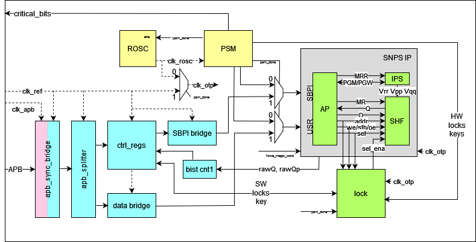

# 13.3.1. Lock shim

13.3.1. Lock shim

The lock shim is inserted between the Synopsys AP block and the SHF block, and is used to enforce read/write page

locks, based on:

• The OTP address presented on the AP → SHF bus
• The read/write strobe on the AP → SHF bus
• The security attribute of the upstream bus access which caused this SHF access (assumed to be Secure if SBPI is

currently enabled via USR.DCTRL)

Because the Synopsys AP performs both reads and writes in the course of programming an OTP row, it is impossible to

disable reads to an address without also disabling writes. Three lock states are supported:

13.3. Background: OTP hardware architecture
1270

## Embedded Images

