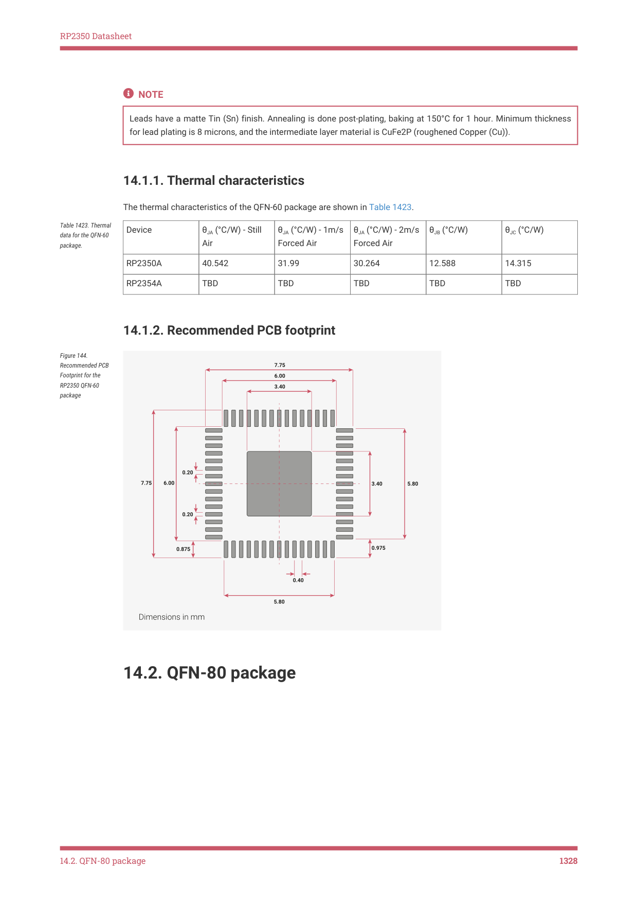

# 14.1.1. Thermal characteristics

14.1.1. Thermal characteristics

The thermal characteristics of the QFN-60 package are shown in Table 1423.

| Device | θ (°C/W) - Still JA Air | θ (°C/W) - 1m/s JA Forced Air | θ (°C/W) - 2m/s JA Forced Air | θ (°C/W) JB | θ (°C/W) JC |
| --- | --- | --- | --- | --- | --- |
| RP2350A | 40.542 | 31.99 | 30.264 | 12.588 | 14.315 |
| RP2354A | TBD | TBD | TBD | TBD | TBD |

Table 1423. Thermal

data for the QFN-60

package.
