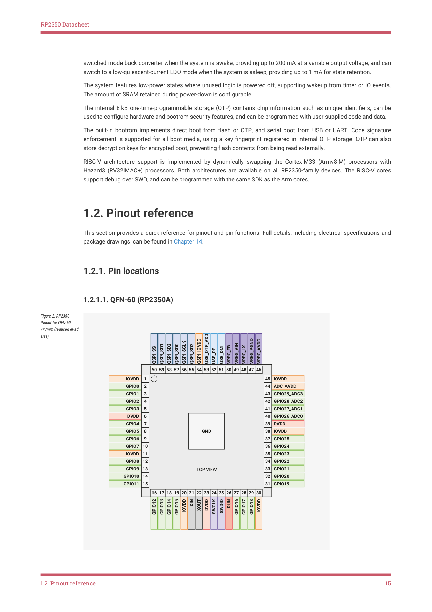

# 1.2.1. Pin locations

1.2.1. Pin locations

1.2.1.1. QFN-60 (RP2350A)

Figure 2. RP2350

Pinout for QFN-60

7×7mm (reduced ePad

size)

60 59 58 57 56 55 54 53 52 51 50 49 48

16 17 18 19 20 21 22 23 24 25 26 27 28 29 30

1.2. Pinout reference
15
