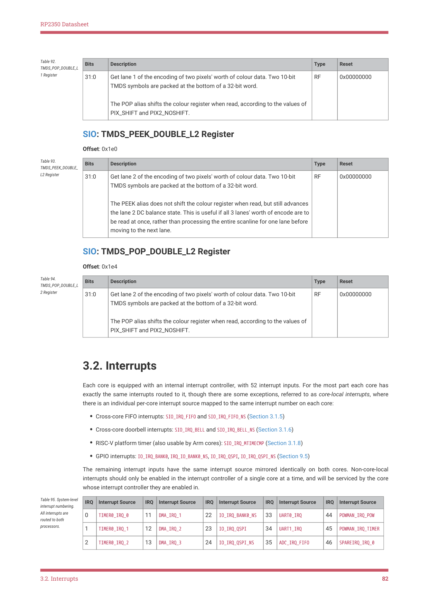

# 3.2. Interrupts

3.2. Interrupts

Each core is equipped with an internal interrupt controller, with 52 interrupt inputs. For the most part each core has

exactly the same interrupts routed to it, though there are some exceptions, referred to as core-local interrupts, where

there is an individual per-core interrupt source mapped to the same interrupt number on each core:

• Cross-core FIFO interrupts: SIO_IRQ_FIFO and SIO_IRQ_FIFO_NS (Section 3.1.5)
• Cross-core doorbell interrupts: SIO_IRQ_BELL and SIO_IRQ_BELL_NS (Section 3.1.6)
• RISC-V platform timer (also usable by Arm cores): SIO_IRQ_MTIMECMP (Section 3.1.8)
• GPIO interrupts: IO_IRQ_BANK0, IRQ_IO_BANK0_NS, IO_IRQ_QSPI, IO_IRQ_QSPI_NS (Section 9.5)

The remaining interrupt inputs have the same interrupt source mirrored identically on both cores. Non-core-local

interrupts should only be enabled in the interrupt controller of a single core at a time, and will be serviced by the core

whose interrupt controller they are enabled in.

| IRQ | Interrupt Source | IRQ | Interrupt Source | IRQ | Interrupt Source | IRQ | Interrupt Source | IRQ | Interrupt Source |
| --- | --- | --- | --- | --- | --- | --- | --- | --- | --- |
| 0 | TIMER0 IRQ 0 _ _ | 11 | DMA IRQ 1 _ _ | 22 | IO IRQ BANK0 NS _ _ _ | 33 | UART0 IRQ _ | 44 | POWMAN IRQ POW _ _ |
| 1 | TIMER0 IRQ 1 _ _ | 12 | DMA IRQ 2 _ _ | 23 | IO IRQ QSPI _ _ | 34 | UART1 IRQ _ | 45 | POWMAN IRQ TIMER _ _ |
| 2 | TIMER0 IRQ 2 _ _ | 13 | DMA IRQ 3 _ _ | 24 | IO IRQ QSPI NS _ _ _ | 35 | ADC IRQ FIFO _ _ | 46 | SPAREIRQ IRQ 0 _ _ |

Table 95. System-level

interrupt numbering.

All interrupts are

routed to both

processors.

3.2. Interrupts
82
