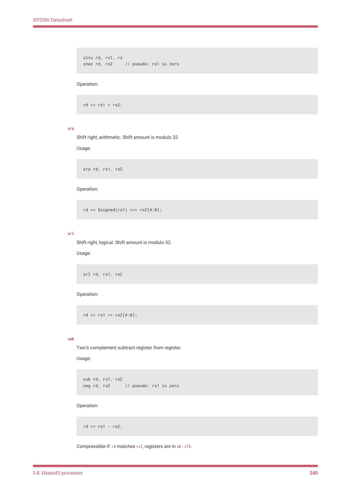
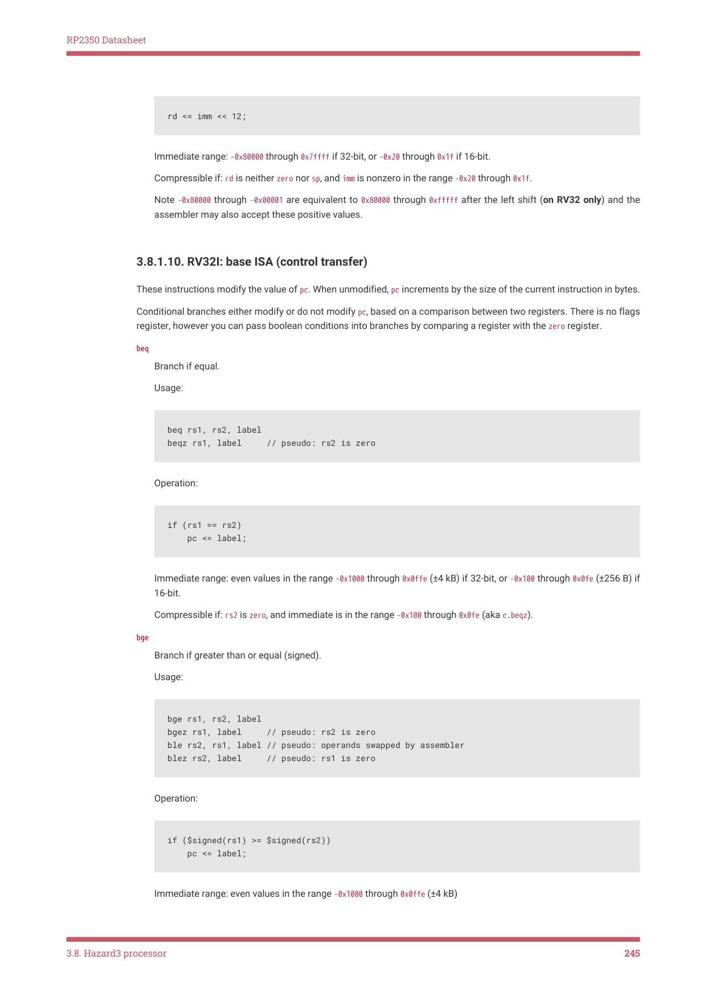
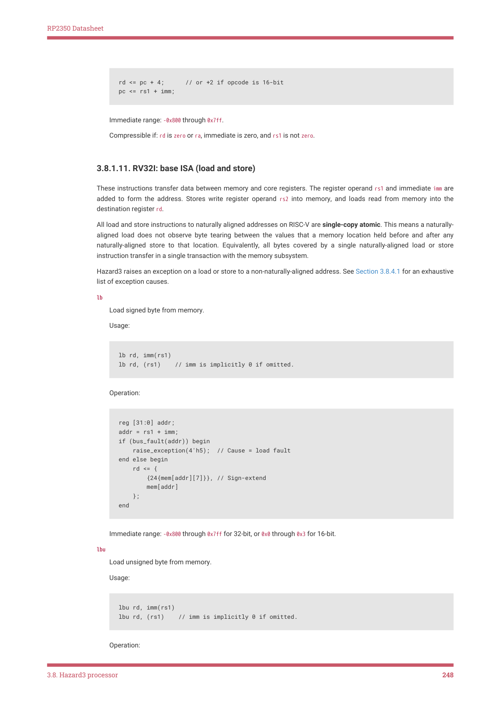
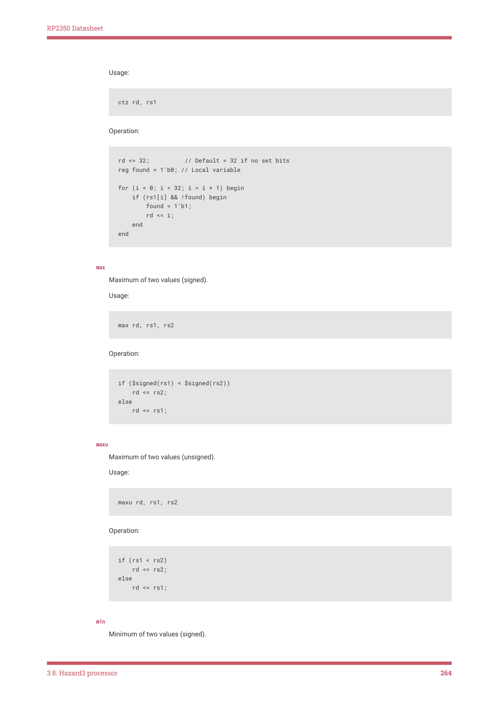
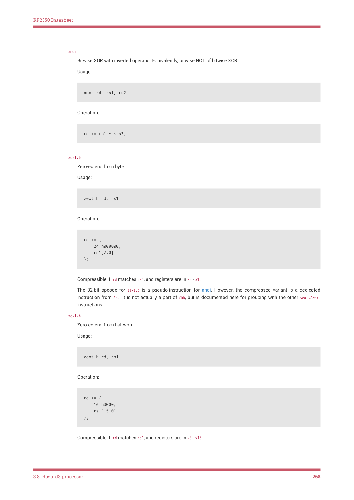
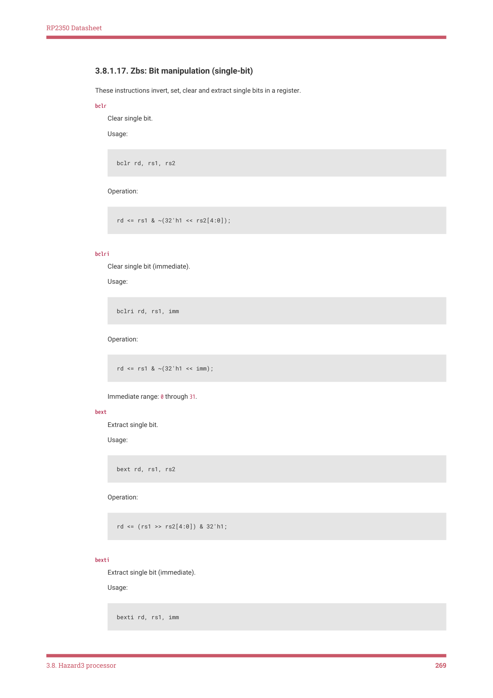

# 3.8.1. Instruction set reference

3.8.1. Instruction set reference

This section is a programmer’s reference guide for the instructions supported by Hazard3. It covers basic assembly

syntax, instruction behaviour, ranges for immediate values, and conditions for instruction compression. The index lists

instructions alphabetically, including pseudo-instructions.

The pseudocode in this guide is informative only, and is no replacement for the official RISC-V specifications in Section

3.8.1.1. However, it should prove a useful mnemonic aid once you have read the specifications.

3.8.1.1. Links to RISC-V specifications

This table links ratified versions of the base instruction set and extensions implemented by Hazard3. These are the

authoritative reference for the instructions documented in this reference guide.

3.8. Hazard3 processor
233

RP2350 Datasheet

| Extension | Specification |
| --- | --- |
| RV32I v2.1 | Unprivileged ISA 20191213 |
| M v2.0 | Unprivileged ISA 20191213 |
| A v2.1 | Unprivileged ISA 20191213 |
| C v2.0 | Unprivileged ISA 20191213 |
| Zicsr v2.0 | Unprivileged ISA 20191213 |
| Zifencei v2.0 | Unprivileged ISA 20191213 |
| Zba v1.0.0 | Bit Manipulation ISA extensions 20210628 |
| Zbb v1.0.0 | Bit Manipulation ISA extensions 20210628 |
| Zbs v1.0.0 | Bit Manipulation ISA extensions 20210628 |
| Zbkb v1.0.1 | Scalar Cryptography ISA extensions 20220218 |
| Zcb v1.0.3-1 | Code Size Reduction extensions frozen v1.0.3-1 |
| Zcmp v1.0.3-1 | Code Size Reduction extensions frozen v1.0.3-1 |
| Machine ISA v1.12 | Privileged Architecture 20211203 |
| Debug v0.13.2 | RISC-V External Debug Support 20190322 |

You may also refer to the RISC-V Assembly Programmer’s Manual for information on assembly syntax.

Consult the source code for detailed questions about implementation-defined behaviour, which is not covered by the

RISC-V specifications. RP2350 uses version 86fc4e3, with metal ECOs for commits 2f6e983 and af08c0b.

3.8.1.2. Architecture strings

-march strings completely specify the set of available RISC-V instructions, so that a compiler can generate correct and

optimal code for your device. Use the following in descending order of preference:

1. Use rv32ima_zicsr_zifencei_zba_zbb_zbs_zbkb_zca_zcb_zcmp for compilers which support the Zcb and Zcmp extensions,

such as GCC 14.

2. Use rv32ima_zicsr_zifencei_zba_zbb_zbs_zbkb_zca_zcb for GCC 14 packaged with an older assembler which does not

support Zcmp.

3. Use rv32imac_zicsr_zifencei_zba_zbb_zbs_zbkb for older compilers, such as GCC 13 and below.

3.8.1.3. RISC-V architectural state

The mutable state visible to the programmer consists of:

• The 31 × 32-bit integer general-purpose registers (GPRs), named x1 through x31
• The program counter pc, which points to the beginning of the current instruction in memory
• The control and status registers (CSRs), which configure processor behaviour and are used in trap handling
• The local monitor bit, which helps maintain correctness of atomic read-modify-write sequences
• The current privilege level, which determines which memory locations the core can access, which CSRs it can

access, and which instructions it can execute

Hazard3 supports two privilege levels: Machine and User. These are interchangeably referred to as modes, and are

commonly abbreviated as M-mode and U-mode. Debug mode behaves as an additional privilege level above M-mode.

3.8. Hazard3 processor
234

RP2350 Datasheet

The 0th general-purpose register, x0, is hardwired to zero and ignores writes.

There is no flags register; branch instructions perform GPR-to-GPR comparisons directly.

This state is duplicated per hardware thread, or hart. RP2350 implements two Hazard3 cores, each with one hart.

3.8.1.3.1. Register conventions

The following ABI names are synonymous with x0 through x31:

| Register | ABI Name | Description |
| --- | --- | --- |
| x0 | zero | Hardwired to zero; ignores writes |
| x1 | ra | Return address (link register) |
| x2 | sp | Stack pointer |
| x3 | gp | Global pointer |
| x4 | tp | Thread pointer |
| x5 - x7 | t0 - t2 | Temporaries |
| x8 | s0 or fp | Saved register or frame pointer |
| x9 | s1 | Saved register |
| x10 - x11 | a0 - a1 | Function arguments and return values |
| x12 - x17 | a2 - a7 | Function arguments |
| x18 - x27 | s2 - s11 | Saved registers |
| x28 - x31 | t3 - t6 | Temporaries |

Registers x1 through x31 are identical, and any 32-bit opcode can use any combination of these registers. However,

compressed instructions give preferential treatment to commonly-used registers sp, ra, s0, s1, and a0 through a5 to

improve code density. All compressed instructions implemented by Hazard3 are 16-bit aliases for existing 32-bit

instructions, so you can still perform any operation on any register.

See the RISC-V PSABI Specification for more information on the ABI register assignment as well as the RISC-V

procedure calling convention.

3.8.1.4. Compressed instructions

The RISC-V extensions which Hazard3 implements use a mixture of 32-bit and 16-bit opcodes, the latter being referred

to as compressed instructions. With the exception of Zcmp, each compressed instruction maps to a subset of an existing

32-bit instruction. For example, c.add is a 16-bit alias of the add instruction, with restrictions on register allocation.

The assembler automatically uses compressed instructions when possible. For example, add a0, a0, a1 is a

compressible form of add. This assembles to the 16-bit opcode c.add a0, a1 when compressed instructions are enabled

in the assembler.

The following extensions use 16-bit opcodes:

• C: compressed instructions (the non-floating-point subset is equivalently spelled as Zca)
• Zcb: additional basic compressed instructions
• Zcmp: compressed push, pop and double-move

Disabling the above extensions for compilation (and assembly) aligns all instructions to 32-bit boundaries. This may

have a minor performance advantage for branch-dense code sequences (see Section 3.8.7), at the cost of poorer code

density.

3.8. Hazard3 processor
235

RP2350 Datasheet

When an instruction has an optional 16-bit compressed form, the limitations of the compressed form are documented

in the listing for the 32-bit form. It is useful to be aware of these restrictions when optimising for code size. If no such

limitations are mentioned, it means the instruction is always a 32-bit opcode.

Zcmp is an outlier in that its instructions each expand to a sequence of 32-bit instructions from the RV32I base instruction

set. They therefore have no direct 32-bit counterparts.

3.8.1.5. Conventions for pseudocode

Pseudocode in this section is in Verilog 2005 syntax (IEEE 1364-2005). These Verilog operators are used throughout:

• Infix operators +, -, *, /, &, ^, |, <<, ==, !=, < and >= can be considered the same as the corresponding C operator.
• $signed() bit-casts to a signed value; comparisons between two signed values are signed comparisons.
• >> is always a logical (zero-extending) right shift.
• >>> on a signed value is an arithmetic (sign-extending) right shift.
• {a, b} is the bit-concatenation of a and b, with a in the more-significant position of the result.
• a[n] on an array is a subscript array access. For example mem[0] is the first byte of memory.
• x[m:l] on a packed array (a bit vector) is a bit slice of x, where m is the (inclusive) MSB and l is the (inclusive) LSB.

For example rs1[7:0] is the 8 least-significant bits of rs1.
• {n{x}}, where n is a constant and x is a packed array, replicates x n times. n copies of x are concatenated together.

For example {32{1’b1}} is a 32-bit all-ones value.

The pseudocode uses <= non-blocking assignments to assign to outputs: all such assignments are applied in a batch

after the block of pseudocode has executed. Local variables may be assigned with = blocking assignments, which

update the assignee immediately, similar to = procedural assignments in e.g. C programs. This distinction is important

in some cases where e.g. rd and rs1 may alias the same register, but it’s generally sufficient just to be aware that a <= b

and a = b are both assignments into a.

3.8.1.5.1. Variables used in pseudocode

Pseudocode in this guide uses the following conventions for variables:

• rs1, rs2, and rd are 32-bit unsigned packed arrays (bit vectors), representing the values of the two register operands

and the destination register.
• regnum_rs1, regnum_rs2, and regnum_rd are the 5-bit register numbers which select a GPR for rs1, rs2, and rd
• imm is a 32-bit unsigned packed array referring to the instruction’s immediate value.
• pc is a 32-bit unsigned packed array referring to the program counter, which is exactly the address of the current

instruction.
• mem is an array of 8-bit unsigned packed arrays, each corresponding to a byte address in memory.
• csr is an array of 32-bit unsigned packed arrays, each corresponding to a CSR listed in Section 3.8.9.
• priv is a 2-bit unsigned packed array which contains the value 0x3 when the core is in Debug or M-mode, and 0x0

when the core is in U-mode.
• i and j are pseudocode temporary variables of type integer which may be used for loop variables.

The following tasks are used throughout:

• raise_exception(n) raises an exception with a cause of n (see Section 3.8.4.1).
• bus_error(addr) returns 1 when the address addr returns a bus error, and 0 otherwise.

3.8. Hazard3 processor
236

RP2350 Datasheet

3.8.1.6. Alphabetical list of instructions

This instruction reference covers all instructions from all extensions which Hazard3 implements on RP2350. The table

below also includes common pseudo-instructions such as not and ret, which you may see in disassembly and be

surprised not to see in the ISA manual. The links for pseudo-instructions go to the entry for the underlying hardware

instruction aliased by that pseudo-instruction.


TIP

The instruction names at the left-hand margin of the instruction listings are links back to this index. Use them to

quickly return here and look up another instruction.

| Alphabetical order: le | ft-to-right, then top-to- | bottom. |  |  |  |
| --- | --- | --- | --- | --- | --- |
| add | addi | amoadd.w | amoand.w | amomax.w | amomaxu.w |
| amomin.w | amominu.w | amoor.w | amoswap.w | amoxor.w | and |
| andi | andn | auipc | bclr | bclri | beq |
| beqz | bext | bexti | bge | bgeu | bgez |
| bgt | bgtu | bgtz | binv | binvi | ble |
| bleu | blez | blt | bltu | bltz | bne |
| bnez | brev8 | bset | bseti | clz | cm.mva01s |
| cm.mvsa01 | cm.pop | cm.popret | cm.popretz | cm.push | cpop |
| csrc | csrci | csrr | csrrc | csrrci | csrrs |
| csrrsi | csrrw | csrrwi | csrs | csrsi | csrw |
| csrwi | ctz | div | divu | ebreak | ecall |
| fence | fence.i | j | jal | jalr | jr |
| lb | lbu | lh | lhu | lr.w | lui |
| lw | max | maxu | min | minu | mret |
| mul | mulh | mulhsu | mulhu | mv | neg |
| nop | not | or | orc.b | ori | orn |
| pack | packh | rem | remu | ret | rev8 |
| rol | ror | rori | sb | sc.w | seqz |
| sext.b | sext.h | sgtz | sh1add | sh2add | sh3add |
| sh | sll | slli | slt | slti | sltiu |
| sltu | sltz | snez | sra | srai | srl |
| srli | sub | sw | unzip | wfi | xnor |
| xor | xori | zext.b | zext.h | zip |  |

The remainder of this reference guide groups instructions by extension:

• RV32I: base ISA (register-register)
• RV32I: base ISA (register-immediate)
• RV32I: base ISA (large immediate)
• RV32I: base ISA (control transfer)
• RV32I: base ISA (load/store)

3.8. Hazard3 processor
237

RP2350 Datasheet

• M: multiply and divide
• A: atomics
• C: compressed instructions
• Zba: bit manipulation for address generation
• Zbb: basic bit manipulation
• Zbs: single bit manipulation
• Zbkb: basic bit manipulation for scalar cryptography
• Zcb: additional basic compressed instructions
• Zcmp: compressed push, pop and double-move
• RV32I and Zifencei: memory ordering
• Zicsr: control and status register access
• Privileged instructions

3.8.1.7. RV32I: base ISA (register-register)

These instructions calculate a function of two register operands, rs1 and rs2. They write the 32-bit result to a destination

register, rd.

add

Add register to register.

Usage:

add rd, rs1, rs2

Operation:

rd <= rs1 + rs2;

Compressible if either:

• rd matches rs1, no operands are zero (aka c.add)
• rs2 is zero and neither rd nor rs1 is zero (aka c.mv)

and

Bitwise AND register with register.

Usage:

and rd, rs1, rs2

Operation:

3.8. Hazard3 processor
238

RP2350 Datasheet

Compressible if: rd matches rs1, registers are in x8 - x15.

or

Bitwise OR register with register.

Compressible if: rd matches rs1, registers are in x8 - x15.

sll

Shift left, logical. Shift amount is modulo 32.

slt

Set if less than (signed). Result is 0 for false, 1 for true.

sltz rd, rs1     // pseudo: rs2 is zero

sgtz rd, rs2     // pseudo: rs1 is zero

rd <= $signed(rs1) < $signed(rs2);

sltu

Set if less than (unsigned). Result is 0 for false, 1 for true.

Usage:

3.8. Hazard3 processor
239

RP2350 Datasheet

snez rd, rs2     // pseudo: rs1 is zero

sra

Shift right, arithmetic. Shift amount is modulo 32.

rd <= $signed(rs1) >>> rs2[4:0];

srl

Shift right, logical. Shift amount is modulo 32.

sub

Two’s complement subtract register from register.

neg rd, rs2      // pseudo: rs1 is zero

Compressible if: rd matches rs1, registers are in x8 - x15.

3.8. Hazard3 processor
240

RP2350 Datasheet

xor

Bitwise XOR register with register

Usage:

Compressible if: rd matches rs1, registers are in x8 - x15.

3.8.1.8. RV32I: base ISA (register-immediate)

These instructions calculate a function of one register rs1 and one immediate operand imm. They write the 32-bit result

Immediate operands are constants encoded directly in the instruction, which avoids the cost of first materialising the

constant value into a register.

addi

mv rd, rs1        // pseudo: imm is 0

nop               // pseudo: rd, rs1 are zero, imm is 0

Immediate range: -0x800 through 0x7ff for 32-bit, smaller for 16-bit.

Compressible if:

• rd matches rs1, and immediate is in the range -0x20 through 0x1f (aka c.addi)
• rd is not zero, rs1 is zero, and immediate is in the range -0x20 through 0x1f (aka c.li)
• rd is in x8 - x15, rs1 is sp, and immediate is a nonzero multiple of four in the range 0x000 through 0x3fc (aka

c.addi4spn)
• rd is sp, rs1 is sp, and immediate is a nonzero multiple of 16 in the range -0x200 through 0x1f0 (aka c.addi16sp)

Note compressed c.mv canonically expands to add, not addi.

andi

Bitwise AND register with immediate.

Usage:

3.8. Hazard3 processor
241

RP2350 Datasheet

zext.b rd, rs1    // pseudo: imm is 0xff

Immediate range: -0x800 through 0x7ff for 32-bit, -0x20 through 0x1f for 16-bit.

Compressible if: rd matches rs1, registers are in x8 - x15, and immediate is in the range -0x20 through 0x1f.

ori

Bitwise OR register with immediate.

Immediate range: -0x800 through 0x7ff

slli

Shift left, logical, immediate.

Immediate range: 0 through 31.

Compressible if: rd matches rs1, registers are not zero.

slti

Set if less than immediate (signed). Result is 0 for false, 1 for true.

Operation:

3.8. Hazard3 processor
242

RP2350 Datasheet

rd <= $signed(rs1) < $signed(imm);

Immediate range: -0x800 through 0x7ff

sltiu

Set if less than immediate (unsigned). Result is 0 for false, 1 for true.

seqz rd, rs1       // pseudo: imm is 1

Immediate range: -0x800 through 0x7ff

Note the negative values indicated for the immediate range are two’s complement: this instruction uses them in an

unsigned context, so -0x800 through -0x001 can be thought of as +0xfffff800 through +0xffffffff for the comparison.

srai

Shift right, arithmetic, immediate.

Immediate range: 0 through 31.

Compressible if: rd matches rs1, registers are in x8 through x15.

srli

Shift right, logical, immediate.

Immediate range: 0 through 31.

3.8. Hazard3 processor
243

RP2350 Datasheet

Compressible if: rd matches rs1, registers are in x8 through x15.

xori

Bitwise XOR register with immediate.

Usage:

not rd, rs1       // pseudo: imm is -1

Immediate range: -0x800 through 0x7ff

Compressible if: rd matches rs1, registers are in x8 - x15, and immediate is -1 (aka c.not)

3.8.1.9. RV32I: base ISA (large immediate)

These instructions are the first in a two-instruction sequence to materialise a 32-bit constant, or a 32-bit offset from pc.

auipc

Add upper immediate to program counter.

Immediate range: -0x80000 through 0x7ffff.

Note -0x80000 through -0x00001 are equivalent to 0x80000 through 0xfffff after the left shift (on RV32 only) and the

assembler may also accept these positive values.

lui

Operation:

3.8. Hazard3 processor
244

RP2350 Datasheet

Immediate range: -0x80000 through 0x7ffff if 32-bit, or -0x20 through 0x1f if 16-bit.

Compressible if: rd is neither zero nor sp, and imm is nonzero in the range -0x20 through 0x1f.

Note -0x80000 through -0x00001 are equivalent to 0x80000 through 0xfffff after the left shift (on RV32 only) and the

assembler may also accept these positive values.

3.8.1.10. RV32I: base ISA (control transfer)

These instructions modify the value of pc. When unmodified, pc increments by the size of the current instruction in bytes.

Conditional branches either modify or do not modify pc, based on a comparison between two registers. There is no flags

register, however you can pass boolean conditions into branches by comparing a register with the zero register.

beq

beqz rs1, label     // pseudo: rs2 is zero

Immediate range: even values in the range -0x1000 through 0x0ffe (±4 kB) if 32-bit, or -0x100 through 0x0fe (±256 B) if

Compressible if: rs2 is zero, and immediate is in the range -0x100 through 0x0fe (aka c.beqz).

bge

Branch if greater than or equal (signed).

bgez rs1, label     // pseudo: rs2 is zero

ble rs2, rs1, label // pseudo: operands swapped by assembler

blez rs2, label     // pseudo: rs1 is zero

if ($signed(rs1) >= $signed(rs2))

Immediate range: even values in the range -0x1000 through 0x0ffe (±4 kB)

3.8. Hazard3 processor
245

RP2350 Datasheet

bgeu

Branch if less than or equal (unsigned).

Usage:

bleu rs2, rs1, label // pseudo: operands swapped by assembler

Immediate range: even values in the range -0x1000 through 0x0ffe (±4 kB)

blt

bltz rs1, label      // pseudo: rs2 is zero

bgt rs2, rs1, label  // pseudo: operands swapped by assembler

bgtz rs2, label      // pseudo: rs1 is zero

if ($signed(rs1) < $signed(rs2))

Immediate range: even values in the range -0x1000 through 0x0ffe (±4 kB)

bltu

Branch if less than (unsigned).

bgtu rs2, rs1, label // pseudo: operands swapped by assembler

Immediate range: even values in the range -0x1000 through 0x0ffe (±4 kB)

bne

Branch if not equal.

3.8. Hazard3 processor
246

RP2350 Datasheet

Usage:

bnez rs1, label     // pseudo: rs2 is zero

Immediate range: even values in the range -0x1000 through 0x0ffe (±4 kB) if 32-bit, or -0x100 through 0x0fe (±256 B) if

Compressible if: rs2 is zero, and immediate is in the range -0x100 through 0x0fe (aka c.bnez).

jal

jal label      // pseudo: rd is ra

j label        // pseudo: rd is zero

rd <= pc + 4;   // or +2 if opcode is 16-bit

Immediate range: even values in the range -0x100000 through 0x0ffffe (±1 MB) if 32-bit, or -0x800 through 0x7fe

Compressible if: rd is zero or ra, and immediate is in the range -0x800 through 0x7fe.

jalr

Jump and link, register-offset.

jalr rd, rs1, imm //                     (imm is implicitly 0 if omitted.)

jalr rd, imm(rs1) // alternate syntax.   (imm is implicitly 0 if omitted.)

jalr rs1, imm     // pseudo: rd is ra.   (imm is implicitly 0 if omitted.)

jalr imm(rs1)     // pseudo: rd is ra.   (imm is implicitly 0 if omitted.)

jr rs1, imm       // pseudo: rd is zero. (imm is implicitly 0 if omitted.)

jr imm(rs1)       // pseudo: rd is zero. (imm is implicitly 0 if omitted.)

ret               // pseudo for jr ra

Operation:

3.8. Hazard3 processor
247

RP2350 Datasheet

rd <= pc + 4;      // or +2 if opcode is 16-bit

Immediate range: -0x800 through 0x7ff.

Compressible if: rd is zero or ra, immediate is zero, and rs1 is not zero.

3.8.1.11. RV32I: base ISA (load and store)

These instructions transfer data between memory and core registers. The register operand rs1 and immediate imm are

added to form the address. Stores write register operand rs2 into memory, and loads read from memory into the

All load and store instructions to naturally aligned addresses on RISC-V are single-copy atomic. This means a naturally-

aligned load does not observe byte tearing between the values that a memory location held before and after any

naturally-aligned store to that location. Equivalently, all bytes covered by a single naturally-aligned load or store

instruction transfer in a single transaction with the memory subsystem.

Hazard3 raises an exception on a load or store to a non-naturally-aligned address. See Section 3.8.4.1 for an exhaustive

lb

lb rd, (rs1)    // imm is implicitly 0 if omitted.

    raise_exception(4'h5);  // Cause = load fault

        {24{mem[addr][7]}}, // Sign-extend

Immediate range: -0x800 through 0x7ff for 32-bit, or 0x0 through 0x3 for 16-bit.

lbu

Load unsigned byte from memory.

lbu rd, (rs1)    // imm is implicitly 0 if omitted.

Operation:

3.8. Hazard3 processor
248

RP2350 Datasheet

    raise_exception(4'h5); // Cause = load fault

        24'h000000,        // Zero-extend

Immediate range: -0x800 through 0x7ff for 32-bit, or 0x0 through 0x3 for 16-bit.

Compressible if: rd and rs1 are in x8 through x15, and immediate is in the range 0x0 through 0x3.

lh

Load signed halfword from memory.

lh rd, (rs1)    // imm is implicitly 0 if omitted.

    raise_exception(4'h4);           // Cause = unaligned load

end else if (bus_fault(addr)) begin

    raise_exception(4'h5);           // Cause = load fault

        {16{mem[addr + 1][7]}},      // Sign-extend

Immediate range: -0x800 through 0x7ff for 32-bit, or even values in the range 0x0 through 0x2 for 16-bit.

Compressible if: rd and rs1 are in x8 through x15, and immediate is 0x0 or 0x2.

lhu

Load unsigned halfword from memory.

lhu rd, (rs1)    // imm is implicitly 0 if omitted.

Operation:

3.8. Hazard3 processor
249

RP2350 Datasheet

reg [31:0] addr;

addr = rs1 + imm;

if (addr[0]) begin

    raise_exception(4'h4);           // Cause = unaligned load

end else if (bus_fault(addr)) begin

    raise_exception(4'h5);           // Cause = load fault

end else begin

    rd <= {

        16'h0000,                    // Zero-extend

        mem[addr + 1],

        mem[addr]

    };

end

Immediate range: -0x800 through 0x7ff for 32-bit, or even values in the range 0x0 through 0x2 for 16-bit.

Compressible if: rd and rs1 are in x8 through x15, and immediate is 0x0 or 0x2.

lw

Load word from memory.

Usage:

lw rd, imm(rs1)

lw rd, (rs1)    // imm is implicitly 0 if omitted.

Operation:

reg [31:0] addr;

addr = rs1 + imm;

if (addr[1:0]) begin

    raise_exception(4'h4);           // Cause = unaligned load

end else if (bus_fault(addr)) begin

    raise_exception(4'h5);           // Cause = load fault

end else begin

    rd <= {

        mem[addr + 3],               // Note little-endian;

        mem[addr + 2],               // MSBs are highest address

        mem[addr + 1],

        mem[addr]

    };

end

Immediate range: -0x800 through 0x7ff for 32-bit, smaller for 16-bit.

Compressible if:

• rd and rs1 are in x8 - x15, and immediate is a multiple of four in the range 0x00 through 0x7c (aka c.lw)
• rd is not zero, rs1 is sp, and immediate is a multiple of four in the range 0x00 through 0xfc (aka c.lwsp)

sb

Store byte to memory.

Usage:

3.8. Hazard3 processor
250

RP2350 Datasheet

sb rs2, (rs1)    // imm is implicitly 0 if omitted.

    raise_exception(4'h7);      // Cause = store/AMO fault

Immediate range: -0x800 through 0x7ff for 32-bit, or 0x0 through 0x3 for 16-bit.

Compressible if: rd and rs1 are in x8 through x15, and immediate is in the range 0x0 through 0x3.

sh

sh rs2, (rs1)    // imm is implicitly 0 if omitted.

    raise_exception(4'h6);      // Cause = unaligned store/AMO

end else if (bus_fault(addr)) begin

    raise_exception(4'h7);      // Cause = store/AMO fault

Immediate range: -0x800 through 0x7ff for 32-bit, or even values in the range 0x0 through 0x2 for 16-bit.

Compressible if: rd and rs1 are in x8 through x15, and immediate is 0x0 or 0x2.

sw

sw rs2, (rs1)    // imm is implicitly 0 if omitted.

Operation:

3.8. Hazard3 processor
251

RP2350 Datasheet

    raise_exception(4'h6);      // Cause = unaligned store/AMO

end else if (bus_fault(addr)) begin

    raise_exception(4'h7);      // Cause = store/AMO fault

Immediate range: -0x800 through 0x7ff for 32-bit, smaller for 16-bit.

• rs1 and rs2 are in x8 - x15, and immediate is a multiple of four in the range 0x00 through 0x7c (aka c.sw)
• rs2 is not zero, rs1 is sp, and immediate is a multiple of four in the range 0x00 through 0xfc (aka c.swsp)

3.8.1.12. M: Multiply and Divide

These instructions implement integer multiply, divide and modulo.

div

    rd <= 32'hffffffff;                              // Defined for division by zero

else if (rs1 == 32'h80000000 && rs2 == 32'hffffffff)

    rd <= 32'h80000000;                              // Defined for signed overflow

    rd <= $signed(rs1) / $signed(rs2);               // Sign of rd is XOR of signs

divu

Operation:

3.8. Hazard3 processor
252

RP2350 Datasheet

    rd <= 32'hffffffff;                              // Defined for division by zero

mul

Compressible if: rd matches rs1, registers are in x8 through x15.

mulh

Multiply signed (32) by signed (32), return upper 32 bits of the 64-bit result.

// Both operands are sign-extended to 64 bits:

result_full = {{32{rs1[31]}}, rs1} * {{32{rs2[31]}}, rs2};

mulhsu

Multiply signed (32) by unsigned (32), return upper 32 bits of the 64-bit result.

// rs1 is sign-extended, rs2 is zero-extended:

result_full = {{32{rs1[31}}, rs1} * {32'h00000000, rs2};

3.8. Hazard3 processor
253

RP2350 Datasheet

mulhu

Multiply unsigned (32) by unsigned (32), return upper 32 bits of the 64-bit result.

Usage:

// Both operands are zero-extended to 64 bits:

result_full = {32'h00000000, rs1} * {32'h00000000, rs2};

rem

    rd <= rs1;                         // Defined for division by zero

    rd <= $signed(rs1) % $signed(rs2); // Sign of rd is sign of rs1

remu

3.8.1.13. A: Atomics

These instructions help software to safely and concurrently modify shared variables. They fall into two groups:

3.8. Hazard3 processor
254

RP2350 Datasheet

• lr.w and sc.w, load-reserved and store-conditional instructions, which allow software to safely perform read-modify-

write operations on shared variables by looping until success
• amo*.w instructions (atomic memory operations or AMOs), which atomically modify a memory location and return

the value it held immediately prior to modification

The pseudocode in this section references the 1-bit global variable local_monitor_valid. It is true when the hart has:

• previously completed a successful AHB5 exclusive read
• not attempted an exclusive write since the read
• not been interrupted or taken an exception since the read (implementation-defined behaviour)

The pseudocode maintains this invariant over the local_monitor_valid flag. This flag helps the hart maintain atomicity of

its read-modify-write sequences with respect to its own interrupts. Hardware refuses to perform exclusive writes when

the local monitor flag is not set.

AMOs clear the local monitor state even when bailing out during the read phase, since even in this case you have

attempted to execute an instruction which performs an exclusive write. In an lr.w, sc.w sequence with an AMO executed

in between, the sc.w always fails.

Hazard3 builds its atomic shared memory implementation on top of AHB5 exclusive accesses. The following tasks,

used throughout this section, represent AHB5 32-bit exclusive reads and writes:

// Read 32 bits from memory and return reservation success/fail according to

// global monitor. Set local monitor bit if the reservation succeeded.

task exclusive_read_32;

    input  [31:0]  addr;

    output [31:0]  data;

    output         exclusive_ok;

begin

    data = {

        mem[addr + 3],

        mem[addr + 2],

        mem[addr + 1],

        mem[addr]

    };

    local_monitor_valid = global_monitor_read(addr);

    exclusive_ok = local_monitor_valid;

end

endtask

// Attempt to write 32 bits to memory, and return write success/fail according

// to global monitor. Always clear the local monitor flag.

task exclusive_write_32;

    input  [31:0] addr;

    input  [31:0] data;

    output        exclusive_ok;

begin

    if (!local_monitor_valid) begin

        exclusive_ok = 0;                 // Write refused by local monitor

    end else if (global_monitor_write(addr)) begin

        exclusive_ok = 1;                 // Write succeeds

        mem[addr + 3] <= data[31:24];

        mem[addr + 2] <= data[23:16];

        mem[addr + 1] <= data[15: 8];

        mem[addr + 0] <= data[ 7: 0];

    end else begin

        exclusive_ok = 0;                 // Write refused by global monitor

    end

    local_monitor_valid = 0;              // Always clear local monitor

end

3.8. Hazard3 processor
255

RP2350 Datasheet

The functions global_monitor_read(addr); and global_monitor_write(addr); in the above code return the global monitor

response for an exclusive read or write to this address, following the rules laid out in Section 2.1.6. The global monitor

enforces atomicity of this hart’s read-modify-write sequences with respect to other harts sharing the same memory.

Because Hazard3 implements an AMO as a hardware-sequenced read-modify-write retry loop using AHB5 exclusives,

the hardware promotes a read reservation failure during an AMO to a store/AMO fault exception (mcause = 7). This

behaviour avoids an infinite loop when accessing locations which do not support exclusive access.

The following local variables are common to all AMO pseudocode:

Atomically add register to memory and return original memory value.

    raise_exception(4'h6);                            // Cause: store/AMO align

    exclusive_read_32(rs1, tmp, exclusive_success);

    if (!exclusive_success || bus_fault(addr)) begin

        raise_exception(4'h7);                        // Cause: store/AMO fault

        exclusive_write_32(rs1, tmp, done);

local_monitor_valid = 0;                              // Always clear local monitor

Atomically bitwise AND register into memory. Return original memory value.

Operation:

3.8. Hazard3 processor
256

RP2350 Datasheet

    raise_exception(4'h6);                            // Cause: store/AMO align

    exclusive_read_32(rs1, tmp, exclusive_success);

    if (!exclusive_success || bus_fault(addr)) begin

        raise_exception(4'h7);                        // Cause: store/AMO fault

        exclusive_write_32(rs1, tmp, done);

local_monitor_valid = 0;                              // Always clear local monitor

amomax.w

Atomically: check if register is signed-greater-than memory value, and write to memory if true. Return original

    raise_exception(4'h6);                            // Cause: store/AMO align

    exclusive_read_32(rs1, tmp, exclusive_success);

    if (!exclusive_success || bus_fault(addr)) begin

        raise_exception(4'h7);                        // Cause: store/AMO fault

        tmp = $signed(tmp) < $signed(rs2) ? rs2 : tmp;

        exclusive_write_32(rs1, tmp, done);

local_monitor_valid = 0;                              // Always clear local monitor

Atomically: check if register is unsigned-greater-than memory value, and write to memory if so. Return original

Operation:

3.8. Hazard3 processor
257

RP2350 Datasheet

    raise_exception(4'h6);                            // Cause: store/AMO align

    exclusive_read_32(rs1, tmp, exclusive_success);

    if (!exclusive_success || bus_fault(addr)) begin

        raise_exception(4'h7);                        // Cause: store/AMO fault

        exclusive_write_32(rs1, tmp, done);

local_monitor_valid = 0;                              // Always clear local monitor

amomin.w

Atomically: check if register is signed-less-than memory value, and write to memory if so. Return original memory

    raise_exception(4'h6);                            // Cause: store/AMO align

    exclusive_read_32(rs1, tmp, exclusive_success);

    if (!exclusive_success || bus_fault(addr)) begin

        raise_exception(4'h7);                        // Cause: store/AMO fault

        tmp = $signed(tmp) < $signed(rs2) ? tmp : rs2;

        exclusive_write_32(rs1, tmp, done);

local_monitor_valid = 0;                              // Always clear local monitor

Atomically: check if register is unsigned-less-than memory value, and write to memory if so. Return original memory

Operation:

3.8. Hazard3 processor
258

RP2350 Datasheet

    raise_exception(4'h6);                            // Cause: store/AMO align

    exclusive_read_32(rs1, tmp, exclusive_success);

    if (!exclusive_success || bus_fault(addr)) begin

        raise_exception(4'h7);                        // Cause: store/AMO fault

        exclusive_write_32(rs1, tmp, done);

local_monitor_valid = 0;                              // Always clear local monitor

amoor.w

Atomically bitwise OR register into memory. Return original memory value.

    raise_exception(4'h6);                            // Cause: store/AMO align

    exclusive_read_32(rs1, tmp, exclusive_success);

    if (!exclusive_success || bus_fault(addr)) begin

        raise_exception(4'h7);                        // Cause: store/AMO fault

        exclusive_write_32(rs1, tmp, done);

local_monitor_valid = 0;                              // Always clear local monitor

Atomically: write a value to memory, and return the value the memory location held immediately prior to the write.

Operation:

3.8. Hazard3 processor
259

RP2350 Datasheet

    raise_exception(4'h6);                            // Cause: store/AMO align

    exclusive_read_32(rs1, tmp, exclusive_success);

    if (!exclusive_success || bus_fault(addr)) begin

        raise_exception(4'h7);                        // Cause: store/AMO fault

        exclusive_write_32(rs1, rs2, done);

local_monitor_valid = 0;                              // Always clear local monitor

amoxor.w

Atomically bitwise OR register into memory. Return original memory value.

    raise_exception(4'h6);                            // Cause: store/AMO align

    exclusive_read_32(rs1, tmp, exclusive_success);

    if (!exclusive_success || bus_fault(addr)) begin

        raise_exception(4'h7);                        // Cause: store/AMO fault

        exclusive_write_32(rs1, rs2, done);

local_monitor_valid = 0;                              // Always clear local monitor

lr.w

Load a value from memory and make a reservation with the global monitor. Set local monitor bit according to

Operation:

3.8. Hazard3 processor
260

RP2350 Datasheet

if (rs1[1:0]) begin

    raise_exception(4'h4); // Cause: load align

end else if (bus_fault(rs1)) begin

    raise_exception(4'h5); // Cause: load fault

end else begin

    read_exclusive_32(rs1, tmp, local_monitor_valid);

    rd <= tmp;

end

sc.w

Conditionally store a value to memory. Succeed if reservation is valid at both local and global monitor. Return 1 for

failure, 0 for success.

Usage:

sc.w rd, rs2, (rs1)

Operation:

if (rs1[1:0]) begin

    raise_exception(4'h6);                // Cause: store/AMO align

end else if (bus_fault(addr)) begin

    raise_exception(4'h7);                // Cause: store/AMO fault

end else if (!local_monitor_valid) begin

    rd <= 1;                              // Refused by local monitor

end else begin

    write_exclusive_32(rs1, rs2, exclusive_success);

    rd <= !exclusive_success;

end

local_monitor_valid = 0;                  // Always clear local monitor

3.8.1.14. C: Compressed instructions

All instructions in the C extension are 16-bit aliases of 32-bit instructions from other extensions. In the case of Hazard3,

which lacks the F extension, these are all aliases of base I instructions. They behave identically to their 32-bit

counterparts.

C adds compressed aliases for the following instructions from RV32I:

| Alphabetical order: le | ft-to-right, then top-to- | bottom. |  |  |  |
| --- | --- | --- | --- | --- | --- |
| add | addi | and | andi | beq | bne |
| ebreak | jal | jalr | lui | lw | or |
| slli | srai | srli | sub | sw | xor |

See the per-instruction documentation for the compression limitations of each instruction. The assembler automatically

uses compressed variants when the limitations are met, and when the relevant compressed instruction extension is

enabled for the assembler, for example by passing c in the -march ISA string.

The above also applies to Zca and Zcb: the former is an alias for the non-floating-point subset of C, and the latter adds 16-

bit aliases for additional common instructions from the I, M and Zbb extensions. Each Zcmp instruction expands to a

sequence of multiple instructions from the I extension.

3.8. Hazard3 processor
261

RP2350 Datasheet

(Return to index)

3.8.1.15. Zba: bit manipulation (address generation)

These instructions accelerate address generation for arrays of 2, 4 and 8-byte elements. They can also multiply by

constant values 3, 5 and 9 if that is more your style.

sh1add

Add, with the first addend shifted left by 1.

Usage:

sh2add

Add, with the first addend shifted left by 2.

sh3add

Add, with the first addend shifted left by 3.

3.8.1.16. Zbb: bit manipulation (basic)

These instructions are useful for bitfield manipulation, and complex integer arithmetic, such as in soft floating point

routines. Many of them substitute directly for common pairs of RV32I instructions, like zext.h → sll, srl.

3.8. Hazard3 processor
262

RP2350 Datasheet

andn

Bitwise AND with inverted second operand.

Usage:

clz

Count leading zeroes (starting from MSB, searching LSB-ward).

rd <= 32;         // Default = 32 if no set bits

reg found = 1'b0; // Local variable

for (i = 0; i < 32; i = i + 1) begin

    if (rs1[31 - i] && !found) begin

cpop

reg [5:0] sum = 6'd0;          // Local variable

for (i = 0; i < 32; i = i + 1)

ctz

Count trailing zeroes (starting from LSB, searching MSB-ward).

3.8. Hazard3 processor
263

RP2350 Datasheet

Usage:

rd <= 32;          // Default = 32 if no set bits

reg found = 1'b0; // Local variable

for (i = 0; i < 32; i = i + 1) begin

max

Maximum of two values (signed).

if ($signed(rs1) < $signed(rs2))

maxu

Maximum of two values (unsigned).

min

Minimum of two values (signed).

3.8. Hazard3 processor
264

RP2350 Datasheet

Usage:

if ($signed(rs1) < $signed(rs2))

minu

Minimum of two values (unsigned).

orc.b

OR-combine of bits within each byte. Generates a mask of nonzero bytes.

orn

Bitwise OR with inverted second operand.

Usage:

3.8. Hazard3 processor
265

RP2350 Datasheet

rev8

rol

Rotate left by register, modulo 32.

rd <= ({rs1, rs1} << rs2[4:0]) >> 32;

ror

Rotate right by register, modulo 32.

Operation:

3.8. Hazard3 processor
266

RP2350 Datasheet

rori

Immediate range: 0 through 31.

sext.b

Compressible if: rd matches rs1, and registers are in x8 - x15.

sext.h

Compressible if: rd matches rs1, and registers are in x8 - x15.

3.8. Hazard3 processor
267

RP2350 Datasheet

xnor

Bitwise XOR with inverted operand. Equivalently, bitwise NOT of bitwise XOR.

Usage:

zext.b

Compressible if: rd matches rs1, and registers are in x8 - x15.

The 32-bit opcode for zext.b is a pseudo-instruction for andi. However, the compressed variant is a dedicated

instruction from Zcb. It is not actually a part of Zbb, but is documented here for grouping with the other sext./zext

zext.h

Compressible if: rd matches rs1, and registers are in x8 - x15.

3.8. Hazard3 processor
268

RP2350 Datasheet

3.8.1.17. Zbs: Bit manipulation (single-bit)

These instructions invert, set, clear and extract single bits in a register.

bclr

Clear single bit.

Usage:

rd <= rs1 & ~(32'h1 << rs2[4:0]);

bclri

Immediate range: 0 through 31.

bext

rd <= (rs1 >> rs2[4:0]) & 32'h1;

bexti

Extract single bit (immediate).

3.8. Hazard3 processor
269

RP2350 Datasheet

Operation:

Immediate range: 0 through 31.

binv

rd <= rs1 ^ (32'h1 << rs2[4:0]);

binvi

Invert single bit (immediate).

Immediate range: 0 through 31.

bset

rd <= rs1 | (32'h1 << rs2[4:0])

bseti

Set single bit (immediate).

Usage:

3.8. Hazard3 processor
270

RP2350 Datasheet

Immediate range: 0 through 31.

3.8.1.18. Zbkb: basic bit manipulation for cryptography

Zbkb has a large overlap with Zbb (basic bit manipulation). This section covers instructions in Zbkb but not in Zbb.

brev8

for (i = 0; i < 32; i = i + 8) begin

    for (j = 0; j < 8; j = j + 1) begin

        rd[i + j] <= rs1[i + (7 - j)];

pack

Pack two halfwords into one word.

packh

Pack two bytes into one halfword.

Usage:

3.8. Hazard3 processor
271

RP2350 Datasheet

Deinterleave odd/even bits of register into upper/lower half of result.

for (i = 0; i < 32; i = i + 2) begin

Interleave upper/lower half of register into odd/even bits of result.

for (i = 0; i < 32; i = i + 2) begin

3.8.1.19. Zcb: Additional basic compressed instructions

Zcb adds 16-bit compressed aliases for the following instructions from the I, M and Zbb extensions:

Alphabetical order: left-to-right, then top-to-bottom.

lbu
lh
lhu
mul
not
sb

3.8. Hazard3 processor
272

RP2350 Datasheet

Alphabetical order: left-to-right, then top-to-bottom.

sext.b
sext.h
sh
zext.b
zext.h

See per-instruction documentation for the compressibility limitations for each instruction.

3.8.1.20. Zcmp: Compressed push, pop, and double move

Zcmp adds 16-bit instructions which expand to common sequences of 32-bit RV32I instructions used in function

prologues and epilogues. The following is a rough description of the available instructions:

• cm.push: allocates a stack frame and saves registers.

◦Optionally push a number of the s0 through s11 saved registers, consecutively up from s0.

◦Round the total stack decrement to a multiple of 16 bytes, to maintain stack alignment if already aligned.

◦Decrement the stack pointer by up to 48 additional bytes, in multiples of 16 bytes, to allocate additional frame

◦There are twelve s* registers, and you can push any number of them except for eleven. If you need to push

more than ten s* registers, push twelve.
• cm.pop: reverse of cm.push. Deallocates a stack frame and restores ra, optionally s0 through s11.
• cm.popret: equivalent to cm.pop followed by ret. Deallocates a stack frame, restores saved registers, and returns.
• cm.popretz: equivalent to cm.pop; li a0, 0; ret. It is common for functions to return a constant 0.
• cm.mvsa01: move a0 and a1 into any two registers in the range s0 through s7. Used to save arguments over embedded

calls.
• cm.mva01s: move into a0 and a1, from any two registers in s0 through s7. Used to restore saved arguments.

See Section 3.8.1.1 for a link to the Zcmp specification which covers key details such as stack layout and atomicity with

respect to interrupts. See Section 3.8.7 for cycle counts for these instructions on Hazard3.

3.8.1.21. RV32I and Zifencei: Memory ordering instructions

These instructions control observed memory ordering of loads and stores in multi-hart systems. They also enforce

when a hart’s instruction fetch observes its own stores.

Constrain the position of this hart’s accesses in the total memory order, according to this hart’s program order.

                   // <set> is a nonempty string which matches the regex i?o?r?w?

fence <set>, <set> // predecessor, successor

fence              // pseudo: fence iorw, iorw

fence.tso          // variant of fence rw, rw; see below

Operation: Hazard3 has no store buffer, and assumes the memory subsystem is sequentially consistent. Therefore

no additional book-keeping is required to enforce ordering on shared memory, and this instruction executes as a no-

op. (The SDK still uses fence instructions, and the ordered variants of amo*.w, for portability across platforms which

3.8. Hazard3 processor
273

RP2350 Datasheet

take advantage of relaxed memory ordering.)

Nominally a fence enforces that the predecessor set appears before the successor set in the total memory order.

These sets respectively contain the hart’s memory accesses before and after the fence instruction in program order,

and are further filtered by a 4-bit mask each:

• Device input (I)
• Device output (O)
• Read (R)
• Write (W)

The fence.tso (total store order) variant is equivalent to fence rw, rw except that it does not enforce write-before-

read ordering.

fence.i

Instruction fence. Ensure subsequent instruction fetches on this hart observe this hart’s previous stores.

Usage:

fence.i

Operation:

1. Clear the branch target buffer (Section 3.8.7.10)

2. Jump to the instruction at the sequentially-next address (pc + 4), to clear the prefetch buffer.

The prefetch buffer can reorder instruction fetch against stores which are earlier in program order. For example:

    la a0, label   // get address for store instruction

    li a1, 0x9002  // get immediate value of c.ebreak

    div t1, t1, t1 // long-running instruction, fills prefetch buffer

    sh a1, (a0)    // write to next address. (16-bit opcode)

label:

    nop            // (16-bit opcode)

If you execute the above code on Hazard3, you may or may not get a breakpoint exception at label. The outcome

depends on how many cycles the bus accesses take. This is permitted by the RISC-V memory model.

This case is generally only reachable on fall-through, because Hazard3 does not prefetch through control flow

instructions except for the taken backward conditional branch currently allocated in the branch target buffer. In

particular it does not prefetch through indirect branches like ret. You are unlikely to hit this issue in practice;

however, be aware fence.i is the standard mechanism for solving this class of problem.

Hazard3 behaves unpredictably if you write to the address of a conditional branch instruction that is currently

tagged in the branch target buffer, and then execute that conditional branch instruction without first executing a

fence.i. Avoid this by always executing a fence.i between writing to memory and executing that same memory.

3.8.1.22. Zicsr: Control and status register access

These instructions access the control and status registers (CSRs) listed in Section 3.8.9. A CSR instruction may read a

CSR, modify a CSR, or simultaneously read and modify the same CSR. A modification consists of a normal write, an

atomic bit-clear, or an atomic bit-set.

CSR addresses are in the range 0x000 through 0xfff (12 bits, 4096 possible CSRs). The CSR address is an immediate

constant in the instruction, so you cannot index CSRs with runtime values. The assembler accepts numeric constants or

3.8. Hazard3 processor
274

RP2350 Datasheet

CSR names such as mstatus as CSR addresses.

csrrc

Simultaneously read and clear bits in a CSR.

Usage:

csrc <addr>, rs1      // pseudo: rd is zero

    csr[addr] <= csr[addr] & ~rs1;

csrrci

Simultaneously read and clear bits in a CSR, with an immediate value for the clear.

csrci <addr>, imm      // pseudo: rd is zero

    csr[addr] <= csr[addr] & ~imm;

Immediate range: 0 through 31.

csrrs

Simultaneously read and set bits in a CSR.

csrs <addr>, rs1       // pseudo: rd is zero

csrr rd, <addr>        // pseudo: rs1 is zero

3.8. Hazard3 processor
275

RP2350 Datasheet

csrrsi

Simultaneously read and set bits in a CSR, with an immediate value for the set.

Usage:

csrsi <addr>, imm      // pseudo: rd is zero

Immediate range: 0 through 31.

csrrw

Simultaneously read and write a CSR.

csrw <addr>, rs1       // pseudo: rd is zero

csrrwi

Simultaneously read and write a CSR, with an immediate value for the write.

csrwi <addr>, imm      // pseudo: rd is zero

Immediate range: 0 through 31.

3.8. Hazard3 processor
276

RP2350 Datasheet

3.8.1.23. Privileged instructions

These instructions are part of the trap and interrupt control support defined in the privileged ISA manual. The other part

of this support is the CSRs (Section 3.8.9).

ebreak

Raise a breakpoint exception.

Usage:

raise_exception(4'h3); // Cause = ebreak

Privilege requirements: any privilege level.

See Section 3.8.4 for details of the RISC-V trap entry sequence. All exceptions trap into M-mode on Hazard3. The

exception program counter mepc points to the start of the ebreak instruction.

An external debug host can catch the execution of breakpoint instructions. If the core is in M-mode, and

DCSR.EBREAKM is set, the core enters Debug mode instead of taking the exception. In U-mode, DCSR.EBREAKU

ecall

Environment call. Raise an exception to access a handler at a higher privilege level.

    raise_exception(4'hb); // Cause: Environment call from M-mode

    raise_exception(4'h8); // Cause: Environment call from U-mode

Privilege requirements: any privilege level.

See Section 3.8.4 for details of the RISC-V trap entry sequence. All exceptions trap into M-mode on Hazard3. The

exception program counter mepc points to the start of the ecall instruction.

mret

3.8. Hazard3 processor
277
