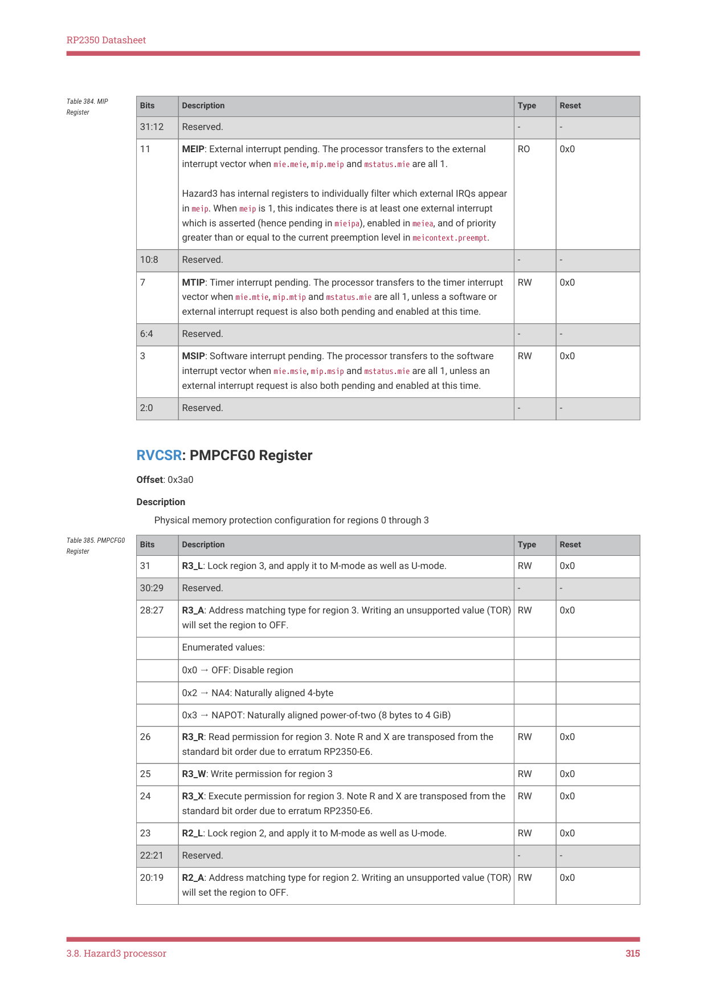
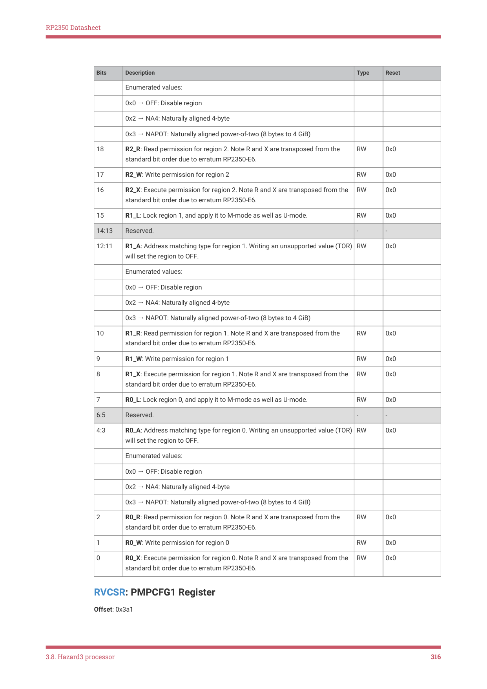
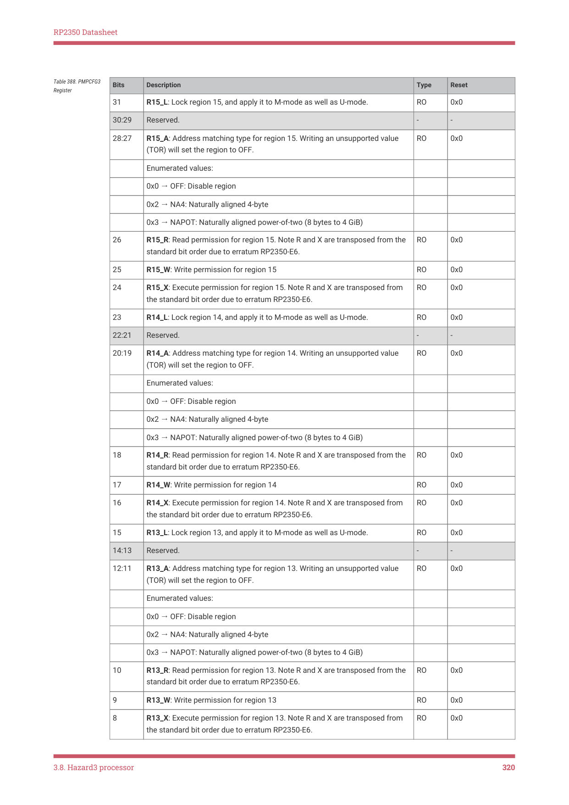
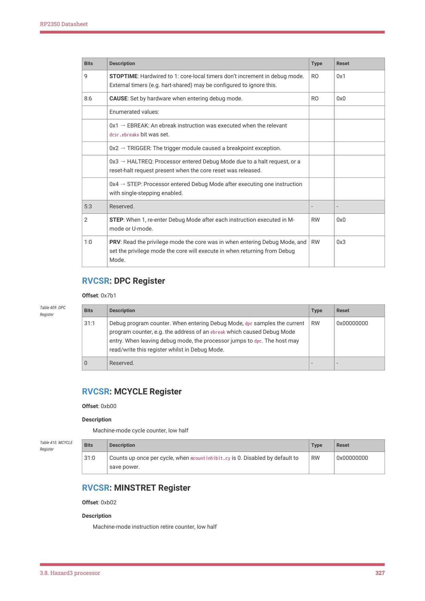

# 3.8.9. Control and status registers

3.8.9. Control and status registers

Control and status registers (CSRs) are registers internal to the processor that affect its behaviour. They are hart-local:

every hart has a copy of the CSRs. On RP2350 hart-local is a synonym for core-local.

Use dedicated CSR instructions to access the CSRs, as described in Section 3.8.1.22. You cannot access CSRs with

load or store instructions.

The RISC-V privileged specification is flexible on which CSRs are implemented, and how they behave. This section

documents the as-implemented behaviour of CSRs on Hazard3 specifically, and does not enumerate all possible

behaviour of all platforms.

IMPORTANT

The RISC-V Privileged Specification should be your primary reference for writing software to run on Hazard3.

Portable RISC-V software should not rely on any implementation-defined behaviour described in this section.

All CSRs are 32-bit, and MXLEN is fixed at 32 bits. CSR addresses not listed in this section are unimplemented.

Accessing an unimplemented CSR raises an illegal instruction exception (mcause = 2). This includes all S-mode CSRs.

| Offset | Name | Info |
| --- | --- | --- |
| 0x300 | MSTATUS | Machine status register |
| 0x301 | MISA | Summary of ISA extension support |
| 0x302 | MEDELEG | Machine exception delegation register. Not implemented, as no S-mode support. |
| 0x303 | MIDELEG | Machine interrupt delegation register. Not implemented, as no S- mode support. |
| 0x304 | MIE | Machine interrupt enable register |
| 0x305 | MTVEC | Machine trap handler base address. |
| 0x306 | MCOUNTEREN | Counter enable. Control access to counters from U-mode. Not to be confused with mcountinhibit. |
| 0x30a | MENVCFG | Machine environment configuration register, low half |
| 0x310 | MSTATUSH | High half of mstatus, hardwired to 0. |
| 0x31a | MENVCFGH | Machine environment configuration register, high half |
| 0x320 | MCOUNTINHIBIT | Count inhibit register for mcycle/minstret |
| 0x323 | MHPMEVENT3 | Extended performance event selector, hardwired to 0. |

Table 367. List of

3.8. Hazard3 processor
304

RP2350 Datasheet

| Offset | Name | Info |
| --- | --- | --- |
| 0x324 | MHPMEVENT4 | Extended performance event selector, hardwired to 0. |
| 0x325 | MHPMEVENT5 | Extended performance event selector, hardwired to 0. |
| 0x326 | MHPMEVENT6 | Extended performance event selector, hardwired to 0. |
| 0x327 | MHPMEVENT7 | Extended performance event selector, hardwired to 0. |
| 0x328 | MHPMEVENT8 | Extended performance event selector, hardwired to 0. |
| 0x329 | MHPMEVENT9 | Extended performance event selector, hardwired to 0. |
| 0x32a | MHPMEVENT10 | Extended performance event selector, hardwired to 0. |
| 0x32b | MHPMEVENT11 | Extended performance event selector, hardwired to 0. |
| 0x32c | MHPMEVENT12 | Extended performance event selector, hardwired to 0. |
| 0x32d | MHPMEVENT13 | Extended performance event selector, hardwired to 0. |
| 0x32e | MHPMEVENT14 | Extended performance event selector, hardwired to 0. |
| 0x32f | MHPMEVENT15 | Extended performance event selector, hardwired to 0. |
| 0x330 | MHPMEVENT16 | Extended performance event selector, hardwired to 0. |
| 0x331 | MHPMEVENT17 | Extended performance event selector, hardwired to 0. |
| 0x332 | MHPMEVENT18 | Extended performance event selector, hardwired to 0. |
| 0x333 | MHPMEVENT19 | Extended performance event selector, hardwired to 0. |
| 0x334 | MHPMEVENT20 | Extended performance event selector, hardwired to 0. |
| 0x335 | MHPMEVENT21 | Extended performance event selector, hardwired to 0. |
| 0x336 | MHPMEVENT22 | Extended performance event selector, hardwired to 0. |
| 0x337 | MHPMEVENT23 | Extended performance event selector, hardwired to 0. |
| 0x338 | MHPMEVENT24 | Extended performance event selector, hardwired to 0. |
| 0x339 | MHPMEVENT25 | Extended performance event selector, hardwired to 0. |
| 0x33a | MHPMEVENT26 | Extended performance event selector, hardwired to 0. |
| 0x33b | MHPMEVENT27 | Extended performance event selector, hardwired to 0. |
| 0x33c | MHPMEVENT28 | Extended performance event selector, hardwired to 0. |
| 0x33d | MHPMEVENT29 | Extended performance event selector, hardwired to 0. |
| 0x33e | MHPMEVENT30 | Extended performance event selector, hardwired to 0. |
| 0x33f | MHPMEVENT31 | Extended performance event selector, hardwired to 0. |
| 0x340 | MSCRATCH | Scratch register for machine trap handlers |
| 0x341 | MEPC | Machine exception program counter |
| 0x342 | MCAUSE | Machine trap cause. Set when entering a trap to indicate the reason for the trap. Readable and writable by software. |
| 0x343 | MTVAL | Machine bad address or instruction. Hardwired to zero. |
| 0x344 | MIP | Machine interrupt pending |
| 0x3a0 | PMPCFG0 | Physical memory protection configuration for regions 0 through 3 |

3.8. Hazard3 processor
305

RP2350 Datasheet

| Offset | Name | Info |
| --- | --- | --- |
| 0x3a1 | PMPCFG1 | Physical memory protection configuration for regions 4 through 7 |
| 0x3a2 | PMPCFG2 | Physical memory protection configuration for regions 8 through 11 |
| 0x3a3 | PMPCFG3 | Physical memory protection configuration for regions 12 through 15 |
| 0x3b0 | PMPADDR0 | Physical memory protection address for region 0 |
| 0x3b1 | PMPADDR1 | Physical memory protection address for region 1 |
| 0x3b2 | PMPADDR2 | Physical memory protection address for region 2 |
| 0x3b3 | PMPADDR3 | Physical memory protection address for region 3 |
| 0x3b4 | PMPADDR4 | Physical memory protection address for region 4 |
| 0x3b5 | PMPADDR5 | Physical memory protection address for region 5 |
| 0x3b6 | PMPADDR6 | Physical memory protection address for region 6 |
| 0x3b7 | PMPADDR7 | Physical memory protection address for region 7 |
| 0x3b8 | PMPADDR8 | Physical memory protection address for region 8 |
| 0x3b9 | PMPADDR9 | Physical memory protection address for region 9 |
| 0x3ba | PMPADDR10 | Physical memory protection address for region 10 |
| 0x3bb | PMPADDR11 | Physical memory protection address for region 11 |
| 0x3bc | PMPADDR12 | Physical memory protection address for region 12 |
| 0x3bd | PMPADDR13 | Physical memory protection address for region 13 |
| 0x3be | PMPADDR14 | Physical memory protection address for region 14 |
| 0x3bf | PMPADDR15 | Physical memory protection address for region 15 |
| 0x7a0 | TSELECT | Select trigger to be configured via tdata1/tdata2 |
| 0x7a1 | TDATA1 | Trigger configuration data 1 |
| 0x7a2 | TDATA2 | Trigger configuration data 2 |
| 0x7b0 | DCSR | Debug control and status register (Debug Mode only) |
| 0x7b1 | DPC | Debug program counter (Debug Mode only) |
| 0xb00 | MCYCLE | Machine-mode cycle counter, low half |
| 0xb02 | MINSTRET | Machine-mode instruction retire counter, low half |
| 0xb03 | MHPMCOUNTER3 | Extended performance counter, hardwired to 0. |
| 0xb04 | MHPMCOUNTER4 | Extended performance counter, hardwired to 0. |
| 0xb05 | MHPMCOUNTER5 | Extended performance counter, hardwired to 0. |
| 0xb06 | MHPMCOUNTER6 | Extended performance counter, hardwired to 0. |
| 0xb07 | MHPMCOUNTER7 | Extended performance counter, hardwired to 0. |
| 0xb08 | MHPMCOUNTER8 | Extended performance counter, hardwired to 0. |
| 0xb09 | MHPMCOUNTER9 | Extended performance counter, hardwired to 0. |
| 0xb0a | MHPMCOUNTER10 | Extended performance counter, hardwired to 0. |

3.8. Hazard3 processor
306

RP2350 Datasheet

| Offset | Name | Info |
| --- | --- | --- |
| 0xb0b | MHPMCOUNTER11 | Extended performance counter, hardwired to 0. |
| 0xb0c | MHPMCOUNTER12 | Extended performance counter, hardwired to 0. |
| 0xb0d | MHPMCOUNTER13 | Extended performance counter, hardwired to 0. |
| 0xb0e | MHPMCOUNTER14 | Extended performance counter, hardwired to 0. |
| 0xb0f | MHPMCOUNTER15 | Extended performance counter, hardwired to 0. |
| 0xb10 | MHPMCOUNTER16 | Extended performance counter, hardwired to 0. |
| 0xb11 | MHPMCOUNTER17 | Extended performance counter, hardwired to 0. |
| 0xb12 | MHPMCOUNTER18 | Extended performance counter, hardwired to 0. |
| 0xb13 | MHPMCOUNTER19 | Extended performance counter, hardwired to 0. |
| 0xb14 | MHPMCOUNTER20 | Extended performance counter, hardwired to 0. |
| 0xb15 | MHPMCOUNTER21 | Extended performance counter, hardwired to 0. |
| 0xb16 | MHPMCOUNTER22 | Extended performance counter, hardwired to 0. |
| 0xb17 | MHPMCOUNTER23 | Extended performance counter, hardwired to 0. |
| 0xb18 | MHPMCOUNTER24 | Extended performance counter, hardwired to 0. |
| 0xb19 | MHPMCOUNTER25 | Extended performance counter, hardwired to 0. |
| 0xb1a | MHPMCOUNTER26 | Extended performance counter, hardwired to 0. |
| 0xb1b | MHPMCOUNTER27 | Extended performance counter, hardwired to 0. |
| 0xb1c | MHPMCOUNTER28 | Extended performance counter, hardwired to 0. |
| 0xb1d | MHPMCOUNTER29 | Extended performance counter, hardwired to 0. |
| 0xb1e | MHPMCOUNTER30 | Extended performance counter, hardwired to 0. |
| 0xb1f | MHPMCOUNTER31 | Extended performance counter, hardwired to 0. |
| 0xb80 | MCYCLEH | Machine-mode cycle counter, high half |
| 0xb82 | MINSTRETH | Machine-mode instruction retire counter, low half |
| 0xb83 | MHPMCOUNTER3H | Extended performance counter, hardwired to 0. |
| 0xb84 | MHPMCOUNTER4H | Extended performance counter, hardwired to 0. |
| 0xb85 | MHPMCOUNTER5H | Extended performance counter, hardwired to 0. |
| 0xb86 | MHPMCOUNTER6H | Extended performance counter, hardwired to 0. |
| 0xb87 | MHPMCOUNTER7H | Extended performance counter, hardwired to 0. |
| 0xb88 | MHPMCOUNTER8H | Extended performance counter, hardwired to 0. |
| 0xb89 | MHPMCOUNTER9H | Extended performance counter, hardwired to 0. |
| 0xb8a | MHPMCOUNTER10H | Extended performance counter, hardwired to 0. |
| 0xb8b | MHPMCOUNTER11H | Extended performance counter, hardwired to 0. |
| 0xb8c | MHPMCOUNTER12H | Extended performance counter, hardwired to 0. |
| 0xb8d | MHPMCOUNTER13H | Extended performance counter, hardwired to 0. |
| 0xb8e | MHPMCOUNTER14H | Extended performance counter, hardwired to 0. |
| 0xb8f | MHPMCOUNTER15H | Extended performance counter, hardwired to 0. |

3.8. Hazard3 processor
307

RP2350 Datasheet

| Offset | Name | Info |
| --- | --- | --- |
| 0xb90 | MHPMCOUNTER16H | Extended performance counter, hardwired to 0. |
| 0xb91 | MHPMCOUNTER17H | Extended performance counter, hardwired to 0. |
| 0xb92 | MHPMCOUNTER18H | Extended performance counter, hardwired to 0. |
| 0xb93 | MHPMCOUNTER19H | Extended performance counter, hardwired to 0. |
| 0xb94 | MHPMCOUNTER20H | Extended performance counter, hardwired to 0. |
| 0xb95 | MHPMCOUNTER21H | Extended performance counter, hardwired to 0. |
| 0xb96 | MHPMCOUNTER22H | Extended performance counter, hardwired to 0. |
| 0xb97 | MHPMCOUNTER23H | Extended performance counter, hardwired to 0. |
| 0xb98 | MHPMCOUNTER24H | Extended performance counter, hardwired to 0. |
| 0xb99 | MHPMCOUNTER25H | Extended performance counter, hardwired to 0. |
| 0xb9a | MHPMCOUNTER26H | Extended performance counter, hardwired to 0. |
| 0xb9b | MHPMCOUNTER27H | Extended performance counter, hardwired to 0. |
| 0xb9c | MHPMCOUNTER28H | Extended performance counter, hardwired to 0. |
| 0xb9d | MHPMCOUNTER29H | Extended performance counter, hardwired to 0. |
| 0xb9e | MHPMCOUNTER30H | Extended performance counter, hardwired to 0. |
| 0xb9f | MHPMCOUNTER31H | Extended performance counter, hardwired to 0. |
| 0xbd0 | PMPCFGM0 | Set PMP regions to M-mode, without locking |
| 0xbe0 | MEIEA | External interrupt enable array |
| 0xbe1 | MEIPA | External interrupt pending array |
| 0xbe2 | MEIFA | External interrupt force array |
| 0xbe3 | MEIPRA | External interrupt priority array |
| 0xbe4 | MEINEXT | Get next external interrupt |
| 0xbe5 | MEICONTEXT | External interrupt context register |
| 0xbf0 | MSLEEP | M-mode sleep control register |
| 0xbff | DMDATA0 | Debug Module DATA0 access register (Debug Mode only) |
| 0xc00 | CYCLE | Read-only U-mode alias of mcycle, accessible when mcounteren.cy is set |
| 0xc02 | INSTRET | Read-only U-mode alias of minstret, accessible when mcounteren.ir is set |
| 0xc80 | CYCLEH | Read-only U-mode alias of mcycleh, accessible when mcounteren.cy is set |
| 0xc82 | INSTRETH | Read-only U-mode alias of minstreth, accessible when mcounteren.ir is set |
| 0xf11 | MVENDORID | Vendor ID |
| 0xf12 | MARCHID | Architecture ID (Hazard3) |
| 0xf13 | MIMPID | Implementation ID. On RP2350 this reads as 0x86fc4e3f, which is release v1.0-rc1 of Hazard3. |

3.8. Hazard3 processor
308

RP2350 Datasheet

| Offset | Name | Info |
| --- | --- | --- |
| 0xf14 | MHARTID | Hardware thread ID |
| 0xf15 | MCONFIGPTR | Pointer to configuration data structure (hardwired to 0) |

RVCSR: MSTATUS Register

Offset: 0x300

Description

Machine status register

| Bits | Description | Type | Reset |
| --- | --- | --- | --- |
| 31:22 | Reserved. | - | - |
| 21 | TW: Timeout wait. When 1, attempting to execute a WFI instruction in U-mode will instantly cause an illegal instruction exception. | RW | 0x0 |
| 20:18 | Reserved. | - | - |
| 17 | MPRV: Modify privilege. If 1, loads and stores behave as though the current privilege level were mpp. This includes physical memory protection checks, and the privilege level asserted on the system bus alongside the load/store address. | RW | 0x0 |
| 16:13 | Reserved. | - | - |
| 12:11 | MPP: Previous privilege level. Can store the values 3 (M-mode) or 0 (U-mode). If another value is written, hardware rounds to the nearest supported mode. | RW | 0x3 |
| 10:8 | Reserved. | - | - |
| 7 | MPIE: Previous interrupt enable. Readable and writable. Is set to the current value of mstatus.mie on trap entry. Is set to 1 on trap return. | RW | 0x0 |
| 6:4 | Reserved. | - | - |
| 3 | MIE: Interrupt enable. Readable and writable. Is set to 0 on trap entry. Is set to the current value of mstatus.mpie on trap return. | RW | 0x0 |
| 2:0 | Reserved. | - | - |

Table 368. MSTATUS

RVCSR: MISA Register

Offset: 0x301

Description

Summary of ISA extension support

On RP2350, Hazard3’s full -march string is: rv32ima_zicsr_zifencei_zba_zbb_zbs_zbkb_zca_zcb_zcmp

Note Zca is equivalent to the C extension in this case; all instructions from the RISC-V C extension relevant to a 32-bit

non-floating-point processor are supported. On older toolchains which do not support the Zc extensions, the appropriate

-march string is: rv32imac_zicsr_zifencei_zba_zbb_zbs_zbkb

In addition the following custom extensions are configured: Xh3bm, Xh3power, Xh3irq, Xh3pmpm

| Bits | Description | Type | Reset |
| --- | --- | --- | --- |
| 31:30 | MXL: Value of 0x1 indicates this is a 32-bit processor. | RO | 0x1 |
| 29:24 | Reserved. | - | - |

Table 369. MISA

3.8. Hazard3 processor
309

RP2350 Datasheet

| Bits | Description | Type | Reset |
| --- | --- | --- | --- |
| 23 | X: Value of 1 indicates nonstandard extensions are present. (Xh3b bit manipulation, and custom sleep and interrupt control CSRs) | RO | 0x1 |
| 22 | Reserved. | - | - |
| 21 | V: Vector extension (not implemented). | RO | 0x0 |
| 20 | U: Value of 1 indicates U-mode is implemented. | RO | 0x1 |
| 19 | Reserved. | - | - |
| 18 | S: Supervisor extension (not implemented). | RO | 0x0 |
| 17 | Reserved. | - | - |
| 16 | Q: Quad-precision floating point extension (not implemented). | RO | 0x0 |
| 15:13 | Reserved. | - | - |
| 12 | M: Value of 1 indicates the M extension (integer multiply/divide) is implemented. | RO | 0x1 |
| 11:9 | Reserved. | - | - |
| 8 | I: Value of 1 indicates the RVI base ISA is implemented (as opposed to RVE) | RO | 0x1 |
| 7 | H: Hypervisor extension (not implemented, I agree it would be pretty cool on a microcontroller through). | RO | 0x0 |
| 6 | Reserved. | - | - |
| 5 | F: Single-precision floating point extension (not implemented). | RO | 0x0 |
| 4 | E: RV32E/64E base ISA (not implemented). | RO | 0x0 |
| 3 | D: Double-precision floating point extension (not implemented). | RO | 0x0 |
| 2 | C: Value of 1 indicates the C extension (compressed instructions) is implemented. | RO | 0x1 |
| 1 | B: Value of 1 indicates the B extension (bit manipulation) is implemented. B is the combination of Zba, Zbb and Zbs. Hazard3 implements all of these extensions, but the definition of B as ZbaZbbZbs did not exist at the point this version of Hazard3 was taped out. This bit was reserved-0 at that point. Therefore this bit reads as 0. | RO | 0x0 |
| 0 | A: Value of 1 indicates the A extension (atomics) is implemented. | RO | 0x1 |

RVCSR: MEDELEG Register

Offset: 0x302

| Bits | Description | Type | Reset |
| --- | --- | --- | --- |
| 31:0 | Machine exception delegation register. Not implemented, as no S-mode support. | RW | - |

Table 370. MEDELEG

RVCSR: MIDELEG Register

Offset: 0x303

3.8. Hazard3 processor
310

RP2350 Datasheet

| Bits | Description | Type | Reset |
| --- | --- | --- | --- |
| 31:0 | Machine interrupt delegation register. Not implemented, as no S-mode support. | RW | - |

Table 371. MIDELEG

RVCSR: MIE Register

Offset: 0x304

Description

Machine interrupt enable register

| Bits | Description | Type | Reset |
| --- | --- | --- | --- |
| 31:12 | Reserved. | - | - |
| 11 | MEIE: External interrupt enable. The processor transfers to the external interrupt vector when mie.meie, mip.meip and mstatus.mie are all 1. Hazard3 has internal registers to individually filter external interrupts (see meiea), but this standard control can be used to mask all external interrupts at once. | RW | 0x0 |
| 10:8 | Reserved. | - | - |
| 7 | MTIE: Timer interrupt enable. The processor transfers to the timer interrupt vector when mie.mtie, mip.mtip and mstatus.mie are all 1, unless a software or external interrupt request is also both pending and enabled at this time. | RW | 0x0 |
| 6:4 | Reserved. | - | - |
| 3 | MSIE: Software interrupt enable. The processor transfers to the software interrupt vector when mie.msie, mip.msip and mstatus.mie are all 1, unless an external interrupt request is also both pending and enabled at this time. | RW | 0x0 |
| 2:0 | Reserved. | - | - |

Table 372. MIE

RVCSR: MTVEC Register

Offset: 0x305

Description

Machine trap handler base address.

Table 373. MTVEC

Register
Bits
Description
Type
Reset

31:2
BASE: The upper 30 bits of the trap vector address (2 LSBs are implicitly 0).

Must be 64-byte-aligned if vectoring is enabled. Otherwise, must be 4-byte-

1:0
MODE: If 0 (direct mode), all traps set pc to the trap vector base. If 1

(vectored), exceptions set pc to the trap vector base, and interrupts set pc to 4

times the interrupt cause (3=soft IRQ, 7=timer IRQ, 11=external IRQ).

The upper bit is hardwired to zero, so attempting to set mode to 2 or 3 will

result in a value of 0 or 1 respectively.

0x0 → DIRECT: Direct entry to mtvec

0x1 → VECTORED: Vectored entry to a 16-entry jump table starting at mtvec

3.8. Hazard3 processor
311

RP2350 Datasheet

RVCSR: MCOUNTEREN Register

Offset: 0x306

Description

Counter enable. Control access to counters from U-mode. Not to be confused with mcountinhibit.

| Bits | Description | Type | Reset |
| --- | --- | --- | --- |
| 31:3 | Reserved. | - | - |
| 2 | IR: If 1, U-mode is permitted to access the instret/instreth instruction retire counter CSRs. Otherwise, U-mode accesses to these CSRs will trap. | RW | 0x0 |
| 1 | TM: No hardware effect, as the time/timeh CSRs are not implemented. However, this field still exists, as M-mode software can use it to track whether it should emulate U-mode attempts to access those CSRs. | RW | 0x0 |
| 0 | CY: If 1, U-mode is permitted to access the cycle/cycleh cycle counter CSRs. Otherwise, U-mode accesses to these CSRs will trap. | RW | 0x0 |

Table 374.

MCOUNTEREN

Register

RVCSR: MENVCFG Register

Offset: 0x30a

Description

Machine environment configuration register, low half

| Bits | Description | Type | Reset |
| --- | --- | --- | --- |
| 31:1 | Reserved. | - | - |
| 0 | FIOM: When set, fence instructions in modes less privileged than M-mode which specify that IO memory accesses are ordered will also cause ordering of main memory accesses. FIOM is hardwired to zero on Hazard3, because S-mode is not supported, and because fence instructions execute as NOPs (with the exception of fence.i) | RO | 0x0 |

Table 375. MENVCFG

RVCSR: MSTATUSH Register

Offset: 0x310

| Bits | Description | Type | Reset |
| --- | --- | --- | --- |
| 31:0 | High half of mstatus, hardwired to 0. | RO | 0x00000000 |

Table 376. MSTATUSH

RVCSR: MENVCFGH Register

Offset: 0x31a

Description

Machine environment configuration register, high half

This register is fully reserved, as Hazard3 does not implement the relevant extensions. It is implemented as hardwired-

0.

3.8. Hazard3 processor
312

RP2350 Datasheet

| Bits | Description | Type | Reset |
| --- | --- | --- | --- |
| 31:0 | Reserved. | - | - |

Table 377.

RVCSR: MCOUNTINHIBIT Register

Offset: 0x320

Description

Count inhibit register for mcycle/minstret

| Bits | Description | Type | Reset |
| --- | --- | --- | --- |
| 31:3 | Reserved. | - | - |
| 2 | IR: Inhibit counting of the minstret and minstreth registers. Set by default to save power. | RW | 0x1 |
| 1 | Reserved. | - | - |
| 0 | CY: Inhibit counting of the mcycle and mcycleh registers. Set by default to save power. | RW | 0x1 |

Table 378.

MCOUNTINHIBIT

Register

RVCSR: MHPMEVENT3, MHPMEVENT4, …, MHPMEVENT30, MHPMEVENT31
Registers

Offsets: 0x323, 0x324, …, 0x33e, 0x33f

| Bits | Description | Type | Reset |
| --- | --- | --- | --- |
| 31:0 | Extended performance event selector, hardwired to 0. | RO | 0x00000000 |

Table 379.

MHPMEVENT3,

MHPMEVENT4, …,

MHPMEVENT30,

MHPMEVENT31

Registers

RVCSR: MSCRATCH Register

Offset: 0x340

| Bits | Description | Type | Reset |
| --- | --- | --- | --- |
| 31:0 | Scratch register for machine trap handlers. 32-bit read/write register with no specific hardware function. Software may use this to do a fast save/restore of a core register in a trap handler. | RW | 0x00000000 |

Table 380.

RVCSR: MEPC Register

Offset: 0x341

| Bits | Description | Type | Reset |
| --- | --- | --- | --- |
| 31:2 | Machine exception program counter. When entering a trap, the current value of the program counter is recorded here. When executing an mret, the processor jumps to mepc. Can also be read and written by software. | RW | 0x00000000 |
| 1:0 | Reserved. | - | - |

Table 381. MEPC

RVCSR: MCAUSE Register

Offset: 0x342

3.8. Hazard3 processor
313

RP2350 Datasheet

Description

Machine trap cause. Set when entering a trap to indicate the reason for the trap. Readable and writable by software.

Table 382. MCAUSE

Register
Bits
Description
Type
Reset

31
INTERRUPT: If 1, the trap was caused by an interrupt. If 0, it was caused by an

30:4
Reserved.
-
-

3:0
CODE: If interrupt is set, code indicates the index of the bit in mip that caused

the trap (3=soft IRQ, 7=timer IRQ, 11=external IRQ). Otherwise, code is set

according to the cause of the exception.

0x0 → INSTR_ALIGN: Instruction fetch was misaligned. Will never fire on

RP2350, since the C extension is enabled.

0x1 → INSTR_FAULT: Instruction access fault. Instruction fetch failed a PMP

check, or encountered a downstream bus fault, and then passed the point of

0x2 → ILLEGAL_INSTR: Illegal instruction was executed (including illegal CSR

0x3 → BREAKPOINT: Breakpoint. An ebreak instruction was executed when

the relevant dcsr.ebreak bit was clear.

0x4 → LOAD_ALIGN: Load address misaligned. Hazard3 requires natural

0x5 → LOAD_FAULT: Load access fault. A load failed a PMP check, or

encountered a downstream bus error.

0x6 → STORE_ALIGN: Store/AMO address misaligned. Hazard3 requires

natural alignment of all accesses.

0x7 → STORE_FAULT: Store/AMO access fault. A store/AMO failed a PMP

check, or encountered a downstream bus error. Also set if an AMO is

attempted on a region that does not support atomics (on RP2350, anything

0x8 → U_ECALL: Environment call from U-mode.

0xb → M_ECALL: Environment call from M-mode.

RVCSR: MTVAL Register

Offset: 0x343

| Bits | Description | Type | Reset |
| --- | --- | --- | --- |
| 31:0 | Machine bad address or instruction. Hardwired to zero. | RO | 0x00000000 |

Table 383. MTVAL

RVCSR: MIP Register

Offset: 0x344

Description

Machine interrupt pending

3.8. Hazard3 processor
314

RP2350 Datasheet

| Bits | Description | Type | Reset |
| --- | --- | --- | --- |
| 31:12 | Reserved. | - | - |
| 11 | MEIP: External interrupt pending. The processor transfers to the external interrupt vector when mie.meie, mip.meip and mstatus.mie are all 1. Hazard3 has internal registers to individually filter which external IRQs appear in meip. When meip is 1, this indicates there is at least one external interrupt which is asserted (hence pending in mieipa), enabled in meiea, and of priority greater than or equal to the current preemption level in meicontext.preempt. | RO | 0x0 |
| 10:8 | Reserved. | - | - |
| 7 | MTIP: Timer interrupt pending. The processor transfers to the timer interrupt vector when mie.mtie, mip.mtip and mstatus.mie are all 1, unless a software or external interrupt request is also both pending and enabled at this time. | RW | 0x0 |
| 6:4 | Reserved. | - | - |
| 3 | MSIP: Software interrupt pending. The processor transfers to the software interrupt vector when mie.msie, mip.msip and mstatus.mie are all 1, unless an external interrupt request is also both pending and enabled at this time. | RW | 0x0 |
| 2:0 | Reserved. | - | - |

Table 384. MIP

RVCSR: PMPCFG0 Register

Offset: 0x3a0

Description

Physical memory protection configuration for regions 0 through 3

Table 385. PMPCFG0

Register
Bits
Description
Type
Reset

31
R3_L: Lock region 3, and apply it to M-mode as well as U-mode.
RW
0x0

30:29
Reserved.
-
-

28:27
R3_A: Address matching type for region 3. Writing an unsupported value (TOR)

0x2 → NA4: Naturally aligned 4-byte

0x3 → NAPOT: Naturally aligned power-of-two (8 bytes to 4 GiB)

26
R3_R: Read permission for region 3. Note R and X are transposed from the

standard bit order due to erratum RP2350-E6.

25
R3_W: Write permission for region 3
RW
0x0

24
R3_X: Execute permission for region 3. Note R and X are transposed from the

standard bit order due to erratum RP2350-E6.

23
R2_L: Lock region 2, and apply it to M-mode as well as U-mode.
RW
0x0

22:21
Reserved.
-
-

20:19
R2_A: Address matching type for region 2. Writing an unsupported value (TOR)

3.8. Hazard3 processor
315

RP2350 Datasheet

Bits
Description
Type
Reset

0x2 → NA4: Naturally aligned 4-byte

0x3 → NAPOT: Naturally aligned power-of-two (8 bytes to 4 GiB)

18
R2_R: Read permission for region 2. Note R and X are transposed from the

standard bit order due to erratum RP2350-E6.

17
R2_W: Write permission for region 2
RW
0x0

16
R2_X: Execute permission for region 2. Note R and X are transposed from the

standard bit order due to erratum RP2350-E6.

15
R1_L: Lock region 1, and apply it to M-mode as well as U-mode.
RW
0x0

14:13
Reserved.
-
-

12:11
R1_A: Address matching type for region 1. Writing an unsupported value (TOR)

0x2 → NA4: Naturally aligned 4-byte

0x3 → NAPOT: Naturally aligned power-of-two (8 bytes to 4 GiB)

10
R1_R: Read permission for region 1. Note R and X are transposed from the

standard bit order due to erratum RP2350-E6.

9
R1_W: Write permission for region 1
RW
0x0

8
R1_X: Execute permission for region 1. Note R and X are transposed from the

standard bit order due to erratum RP2350-E6.

7
R0_L: Lock region 0, and apply it to M-mode as well as U-mode.
RW
0x0

6:5
Reserved.
-
-

4:3
R0_A: Address matching type for region 0. Writing an unsupported value (TOR)

0x2 → NA4: Naturally aligned 4-byte

0x3 → NAPOT: Naturally aligned power-of-two (8 bytes to 4 GiB)

2
R0_R: Read permission for region 0. Note R and X are transposed from the

standard bit order due to erratum RP2350-E6.

1
R0_W: Write permission for region 0
RW
0x0

0
R0_X: Execute permission for region 0. Note R and X are transposed from the

standard bit order due to erratum RP2350-E6.

RVCSR: PMPCFG1 Register

Offset: 0x3a1

3.8. Hazard3 processor
316

RP2350 Datasheet

Description

Physical memory protection configuration for regions 4 through 7

Table 386. PMPCFG1

Register
Bits
Description
Type
Reset

31
R7_L: Lock region 7, and apply it to M-mode as well as U-mode.
RW
0x0

30:29
Reserved.
-
-

28:27
R7_A: Address matching type for region 7. Writing an unsupported value (TOR)

0x2 → NA4: Naturally aligned 4-byte

0x3 → NAPOT: Naturally aligned power-of-two (8 bytes to 4 GiB)

26
R7_R: Read permission for region 7. Note R and X are transposed from the

standard bit order due to erratum RP2350-E6.

25
R7_W: Write permission for region 7
RW
0x0

24
R7_X: Execute permission for region 7. Note R and X are transposed from the

standard bit order due to erratum RP2350-E6.

23
R6_L: Lock region 6, and apply it to M-mode as well as U-mode.
RW
0x0

22:21
Reserved.
-
-

20:19
R6_A: Address matching type for region 6. Writing an unsupported value (TOR)

0x2 → NA4: Naturally aligned 4-byte

0x3 → NAPOT: Naturally aligned power-of-two (8 bytes to 4 GiB)

18
R6_R: Read permission for region 6. Note R and X are transposed from the

standard bit order due to erratum RP2350-E6.

17
R6_W: Write permission for region 6
RW
0x0

16
R6_X: Execute permission for region 6. Note R and X are transposed from the

standard bit order due to erratum RP2350-E6.

15
R5_L: Lock region 5, and apply it to M-mode as well as U-mode.
RW
0x0

14:13
Reserved.
-
-

12:11
R5_A: Address matching type for region 5. Writing an unsupported value (TOR)

0x2 → NA4: Naturally aligned 4-byte

0x3 → NAPOT: Naturally aligned power-of-two (8 bytes to 4 GiB)

10
R5_R: Read permission for region 5. Note R and X are transposed from the

standard bit order due to erratum RP2350-E6.

9
R5_W: Write permission for region 5
RW
0x0

3.8. Hazard3 processor
317

RP2350 Datasheet

Bits
Description
Type
Reset

8
R5_X: Execute permission for region 5. Note R and X are transposed from the

standard bit order due to erratum RP2350-E6.

7
R4_L: Lock region 4, and apply it to M-mode as well as U-mode.
RW
0x0

6:5
Reserved.
-
-

4:3
R4_A: Address matching type for region 4. Writing an unsupported value (TOR)

0x2 → NA4: Naturally aligned 4-byte

0x3 → NAPOT: Naturally aligned power-of-two (8 bytes to 4 GiB)

2
R4_R: Read permission for region 4. Note R and X are transposed from the

standard bit order due to erratum RP2350-E6.

1
R4_W: Write permission for region 4
RW
0x0

0
R4_X: Execute permission for region 4. Note R and X are transposed from the

standard bit order due to erratum RP2350-E6.

Physical memory protection configuration for regions 8 through 11

Table 387. PMPCFG2

Register
Bits
Description
Type
Reset

31
R11_L: Lock region 11, and apply it to M-mode as well as U-mode.
RO
0x0

30:29
Reserved.
-
-

28:27
R11_A: Address matching type for region 11. Writing an unsupported value

(TOR) will set the region to OFF.

0x2 → NA4: Naturally aligned 4-byte

0x3 → NAPOT: Naturally aligned power-of-two (8 bytes to 4 GiB)

26
R11_R: Read permission for region 11. Note R and X are transposed from the

standard bit order due to erratum RP2350-E6.

25
R11_W: Write permission for region 11
RO
0x0

24
R11_X: Execute permission for region 11. Note R and X are transposed from

the standard bit order due to erratum RP2350-E6.

23
R10_L: Lock region 10, and apply it to M-mode as well as U-mode.
RO
0x0

22:21
Reserved.
-
-

20:19
R10_A: Address matching type for region 10. Writing an unsupported value

(TOR) will set the region to OFF.

3.8. Hazard3 processor
318

RP2350 Datasheet

Bits
Description
Type
Reset

0x2 → NA4: Naturally aligned 4-byte

0x3 → NAPOT: Naturally aligned power-of-two (8 bytes to 4 GiB)

18
R10_R: Read permission for region 10. Note R and X are transposed from the

standard bit order due to erratum RP2350-E6.

17
R10_W: Write permission for region 10
RO
0x1

16
R10_X: Execute permission for region 10. Note R and X are transposed from

the standard bit order due to erratum RP2350-E6.

15
R9_L: Lock region 9, and apply it to M-mode as well as U-mode.
RO
0x0

14:13
Reserved.
-
-

12:11
R9_A: Address matching type for region 9. Writing an unsupported value (TOR)

0x2 → NA4: Naturally aligned 4-byte

0x3 → NAPOT: Naturally aligned power-of-two (8 bytes to 4 GiB)

10
R9_R: Read permission for region 9. Note R and X are transposed from the

standard bit order due to erratum RP2350-E6.

9
R9_W: Write permission for region 9
RO
0x1

8
R9_X: Execute permission for region 9. Note R and X are transposed from the

standard bit order due to erratum RP2350-E6.

7
R8_L: Lock region 8, and apply it to M-mode as well as U-mode.
RO
0x0

6:5
Reserved.
-
-

4:3
R8_A: Address matching type for region 8. Writing an unsupported value (TOR)

0x2 → NA4: Naturally aligned 4-byte

0x3 → NAPOT: Naturally aligned power-of-two (8 bytes to 4 GiB)

2
R8_R: Read permission for region 8. Note R and X are transposed from the

standard bit order due to erratum RP2350-E6.

1
R8_W: Write permission for region 8
RO
0x1

0
R8_X: Execute permission for region 8. Note R and X are transposed from the

standard bit order due to erratum RP2350-E6.

RVCSR: PMPCFG3 Register

Offset: 0x3a3

Description

Physical memory protection configuration for regions 12 through 15

3.8. Hazard3 processor
319

RP2350 Datasheet

Table 388. PMPCFG3

Register
Bits
Description
Type
Reset

31
R15_L: Lock region 15, and apply it to M-mode as well as U-mode.
RO
0x0

30:29
Reserved.
-
-

28:27
R15_A: Address matching type for region 15. Writing an unsupported value

(TOR) will set the region to OFF.

0x2 → NA4: Naturally aligned 4-byte

0x3 → NAPOT: Naturally aligned power-of-two (8 bytes to 4 GiB)

26
R15_R: Read permission for region 15. Note R and X are transposed from the

standard bit order due to erratum RP2350-E6.

25
R15_W: Write permission for region 15
RO
0x0

24
R15_X: Execute permission for region 15. Note R and X are transposed from

the standard bit order due to erratum RP2350-E6.

23
R14_L: Lock region 14, and apply it to M-mode as well as U-mode.
RO
0x0

22:21
Reserved.
-
-

20:19
R14_A: Address matching type for region 14. Writing an unsupported value

(TOR) will set the region to OFF.

0x2 → NA4: Naturally aligned 4-byte

0x3 → NAPOT: Naturally aligned power-of-two (8 bytes to 4 GiB)

18
R14_R: Read permission for region 14. Note R and X are transposed from the

standard bit order due to erratum RP2350-E6.

17
R14_W: Write permission for region 14
RO
0x0

16
R14_X: Execute permission for region 14. Note R and X are transposed from

the standard bit order due to erratum RP2350-E6.

15
R13_L: Lock region 13, and apply it to M-mode as well as U-mode.
RO
0x0

14:13
Reserved.
-
-

12:11
R13_A: Address matching type for region 13. Writing an unsupported value

(TOR) will set the region to OFF.

0x2 → NA4: Naturally aligned 4-byte

0x3 → NAPOT: Naturally aligned power-of-two (8 bytes to 4 GiB)

10
R13_R: Read permission for region 13. Note R and X are transposed from the

standard bit order due to erratum RP2350-E6.

9
R13_W: Write permission for region 13
RO
0x0

8
R13_X: Execute permission for region 13. Note R and X are transposed from

the standard bit order due to erratum RP2350-E6.

3.8. Hazard3 processor
320

RP2350 Datasheet

Bits
Description
Type
Reset

7
R12_L: Lock region 12, and apply it to M-mode as well as U-mode.
RO
0x0

6:5
Reserved.
-
-

4:3
R12_A: Address matching type for region 12. Writing an unsupported value

(TOR) will set the region to OFF.

0x2 → NA4: Naturally aligned 4-byte

0x3 → NAPOT: Naturally aligned power-of-two (8 bytes to 4 GiB)

2
R12_R: Read permission for region 12. Note R and X are transposed from the

standard bit order due to erratum RP2350-E6.

1
R12_W: Write permission for region 12
RO
0x0

0
R12_X: Execute permission for region 12. Note R and X are transposed from

the standard bit order due to erratum RP2350-E6.

RVCSR: PMPADDR0 Register

Offset: 0x3b0

| Bits | Description | Type | Reset |
| --- | --- | --- | --- |
| 31:30 | Reserved. | - | - |
| 29:0 | Physical memory protection address for region 0. Note all PMP addresses are in units of four bytes. | RW | 0x00000000 |

Table 389. PMPADDR0

RVCSR: PMPADDR1 Register

Offset: 0x3b1

| Bits | Description | Type | Reset |
| --- | --- | --- | --- |
| 31:30 | Reserved. | - | - |
| 29:0 | Physical memory protection address for region 1. Note all PMP addresses are in units of four bytes. | RW | 0x00000000 |

Table 390. PMPADDR1

RVCSR: PMPADDR2 Register

Offset: 0x3b2

| Bits | Description | Type | Reset |
| --- | --- | --- | --- |
| 31:30 | Reserved. | - | - |
| 29:0 | Physical memory protection address for region 2. Note all PMP addresses are in units of four bytes. | RW | 0x00000000 |

Table 391. PMPADDR2

RVCSR: PMPADDR3 Register

Offset: 0x3b3

| Bits | Description | Type | Reset |
| --- | --- | --- | --- |
| 31:30 | Reserved. | - | - |

Table 392. PMPADDR3

3.8. Hazard3 processor
321

RP2350 Datasheet

| Bits | Description | Type | Reset |
| --- | --- | --- | --- |
| 29:0 | Physical memory protection address for region 3. Note all PMP addresses are in units of four bytes. | RW | 0x00000000 |

RVCSR: PMPADDR4 Register

Offset: 0x3b4

| Bits | Description | Type | Reset |
| --- | --- | --- | --- |
| 31:30 | Reserved. | - | - |
| 29:0 | Physical memory protection address for region 4. Note all PMP addresses are in units of four bytes. | RW | 0x00000000 |

Table 393. PMPADDR4

RVCSR: PMPADDR5 Register

Offset: 0x3b5

| Bits | Description | Type | Reset |
| --- | --- | --- | --- |
| 31:30 | Reserved. | - | - |
| 29:0 | Physical memory protection address for region 5. Note all PMP addresses are in units of four bytes. | RW | 0x00000000 |

Table 394. PMPADDR5

RVCSR: PMPADDR6 Register

Offset: 0x3b6

| Bits | Description | Type | Reset |
| --- | --- | --- | --- |
| 31:30 | Reserved. | - | - |
| 29:0 | Physical memory protection address for region 6. Note all PMP addresses are in units of four bytes. | RW | 0x00000000 |

Table 395. PMPADDR6

RVCSR: PMPADDR7 Register

Offset: 0x3b7

| Bits | Description | Type | Reset |
| --- | --- | --- | --- |
| 31:30 | Reserved. | - | - |
| 29:0 | Physical memory protection address for region 7. Note all PMP addresses are in units of four bytes. | RW | 0x00000000 |

Table 396. PMPADDR7

RVCSR: PMPADDR8 Register

Offset: 0x3b8

| Bits | Description | Type | Reset |
| --- | --- | --- | --- |
| 31:30 | Reserved. | - | - |

Table 397. PMPADDR8

3.8. Hazard3 processor
322

RP2350 Datasheet

| Bits | Description | Type | Reset |
| --- | --- | --- | --- |
| 29:0 | Physical memory protection address for region 8. Note all PMP addresses are in units of four bytes. Hardwired to the address range 0x00000000 through 0x0fffffff, which contains the boot ROM. This range is made accessible to User mode by default. User mode access to this range can be disabled using one of the dynamically configurable PMP regions, or using the permission registers in ACCESSCTRL. | RO | 0x01ffffff |

RVCSR: PMPADDR9 Register

Offset: 0x3b9

| Bits | Description | Type | Reset |
| --- | --- | --- | --- |
| 31:30 | Reserved. | - | - |
| 29:0 | Physical memory protection address for region 9. Note all PMP addresses are in units of four bytes. Hardwired to the address range 0x40000000 through 0x5fffffff, which contains the system peripherals. This range is made accessible to User mode by default. User mode access to this range can be disabled using one of the dynamically configurable PMP regions, or using the permission registers in ACCESSCTRL. | RO | 0x13ffffff |

Table 398. PMPADDR9

RVCSR: PMPADDR10 Register

Offset: 0x3ba

| Bits | Description | Type | Reset |
| --- | --- | --- | --- |
| 31:30 | Reserved. | - | - |
| 29:0 | Physical memory protection address for region 10. Note all PMP addresses are in units of four bytes. Hardwired to the address range 0xd0000000 through 0xdfffffff, which contains the core-local peripherals (SIO). This range is made accessible to User mode by default. User mode access to this range can be disabled using one of the dynamically configurable PMP regions, or using the permission registers in ACCESSCTRL. | RO | 0x35ffffff |

Table 399.

RVCSR: PMPADDR11 Register

Offset: 0x3bb

3.8. Hazard3 processor
323

RP2350 Datasheet

| Bits | Description | Type | Reset |
| --- | --- | --- | --- |
| 31:30 | Reserved. | - | - |
| 29:0 | Physical memory protection address for region 11. Note all PMP addresses are in units of four bytes. Hardwired to all-zeroes. This region is not implemented. | RO | 0x00000000 |

Table 400.

RVCSR: PMPADDR12 Register

Offset: 0x3bc

| Bits | Description | Type | Reset |
| --- | --- | --- | --- |
| 31:30 | Reserved. | - | - |
| 29:0 | Physical memory protection address for region 12. Note all PMP addresses are in units of four bytes. Hardwired to all-zeroes. This region is not implemented. | RO | 0x00000000 |

Table 401.

RVCSR: PMPADDR13 Register

Offset: 0x3bd

| Bits | Description | Type | Reset |
| --- | --- | --- | --- |
| 31:30 | Reserved. | - | - |
| 29:0 | Physical memory protection address for region 13. Note all PMP addresses are in units of four bytes. Hardwired to all-zeroes. This region is not implemented. | RO | 0x00000000 |

Table 402.

RVCSR: PMPADDR14 Register

Offset: 0x3be

| Bits | Description | Type | Reset |
| --- | --- | --- | --- |
| 31:30 | Reserved. | - | - |
| 29:0 | Physical memory protection address for region 14. Note all PMP addresses are in units of four bytes. Hardwired to all-zeroes. This region is not implemented. | RO | 0x00000000 |

Table 403.

RVCSR: PMPADDR15 Register

Offset: 0x3bf

3.8. Hazard3 processor
324

RP2350 Datasheet

| Bits | Description | Type | Reset |
| --- | --- | --- | --- |
| 31:30 | Reserved. | - | - |
| 29:0 | Physical memory protection address for region 15. Note all PMP addresses are in units of four bytes. Hardwired to all-zeroes. This region is not implemented. | RO | 0x00000000 |

Table 404.

RVCSR: TSELECT Register

Offset: 0x7a0

| Bits | Description | Type | Reset |
| --- | --- | --- | --- |
| 31:2 | Reserved. | - | - |
| 1:0 | Select trigger to be configured via tdata1/tdata2 On RP2350, four instruction address triggers are implemented, so only the two LSBs of this register are writable. | RW | 0x0 |

Table 405. TSELECT

RVCSR: TDATA1 Register

Offset: 0x7a1

Description

Trigger configuration data 1

Hazard 3 only supports address/data match triggers (type=2) so this register description includes the mcontrol fields for

this type.

More precisely, Hazard3 only supports exact instruction address match triggers (hardware breakpoints) so many of this

register’s fields are hardwired.

| Bits | Description | Type | Reset |
| --- | --- | --- | --- |
| 31:28 | TYPE: Trigger type. Hardwired to type=2, meaning an address/data match trigger | RO | 0x2 |
| 27 | DMODE: If 0, both Debug and M-mode can write the tdata registers at the selected tselect. If 1, only Debug Mode can write the tdata registers at the selected tselect. Writes from other modes are ignored. This bit is only writable from Debug Mode | RW | 0x0 |
| 26:21 | MASKMAX: Value of 0 indicates only exact address matches are supported | RO | 0x00 |
| 20 | HIT: Trigger hit flag. Not implemented, hardwired to 0. | RO | 0x0 |
| 19 | SELECT: Hardwired value of 0 indicates that only address matches are supported, not data matches | RO | 0x0 |
| 18 | TIMING: Hardwired value of 0 indicates that trigger fires before the triggering instruction executes, not afterward | RO | 0x0 |
| 17:16 | SIZELO: Hardwired value of 0 indicates that access size matching is not supported | RO | 0x0 |
| 15:12 | ACTION: Select action to be taken when the trigger fires. | RW | 0x0 |
|  | Enumerated values: |  |  |

Table 406. TDATA1

3.8. Hazard3 processor
325

RP2350 Datasheet

| Bits | Description | Type | Reset |
| --- | --- | --- | --- |
|  | 0x0 → EBREAK: Raise a breakpoint exception, which can be handled by the M- mode exception handler |  |  |
|  | 0x1 → DEBUG: Enter debug mode. This action is only selectable when tdata1.dmode is 1. |  |  |
| 11 | CHAIN: Hardwired to 0 to indicate trigger chaining is not supported. | RO | 0x0 |
| 10:7 | MATCH: Hardwired to 0 to indicate match is always on the full address specified by tdata2 | RO | 0x0 |
| 6 | M: When set, enable this trigger in M-mode | RW | 0x0 |
| 5:4 | Reserved. | - | - |
| 3 | U: When set, enable this trigger in U-mode | RW | 0x0 |
| 2 | EXECUTE: When set, the trigger fires on the address of an instruction that is executed. | RW | 0x0 |
| 1 | STORE: Hardwired to 0 to indicate store address/data triggers are not supported | RO | 0x0 |
| 0 | LOAD: Hardwired to 0 to indicate load address/data triggers are not supported | RO | 0x0 |

RVCSR: TDATA2 Register

Offset: 0x7a2

| Bits | Description | Type | Reset |
| --- | --- | --- | --- |
| 31:0 | Trigger configuration data 2 Contains the address for instruction address triggers (hardware breakpoints) | RW | 0x00000000 |

Table 407. TDATA2

RVCSR: DCSR Register

Offset: 0x7b0

Description

Debug control and status register. Access outside of Debug Mode will cause an illegal instruction exception.

| Bits | Description | Type | Reset |
| --- | --- | --- | --- |
| 31:28 | XDEBUGVER: Hardwired to 4: external debug support as per RISC-V 0.13.2 debug specification. | RO | 0x4 |
| 27:16 | Reserved. | - | - |
| 15 | EBREAKM: When 1, ebreak instructions executed in M-mode will break to Debug Mode instead of trapping | RW | 0x0 |
| 14:13 | Reserved. | - | - |
| 12 | EBREAKU: When 1, ebreak instructions executed in U-mode will break to Debug Mode instead of trapping. | RW | 0x0 |
| 11 | STEPIE: Hardwired to 0: no interrupts are taken during hardware single- stepping. | RO | 0x0 |
| 10 | STOPCOUNT: Hardwired to 1: mcycle/mcycleh and minstret/minstreth do not increment in Debug Mode. | RO | 0x1 |

Table 408. DCSR

3.8. Hazard3 processor
326

RP2350 Datasheet

Bits
Description
Type
Reset

9
STOPTIME: Hardwired to 1: core-local timers don’t increment in debug mode.

External timers (e.g. hart-shared) may be configured to ignore this.

8:6
CAUSE: Set by hardware when entering debug mode.
RO
0x0

0x1 → EBREAK: An ebreak instruction was executed when the relevant

0x2 → TRIGGER: The trigger module caused a breakpoint exception.

0x3 → HALTREQ: Processor entered Debug Mode due to a halt request, or a

reset-halt request present when the core reset was released.

0x4 → STEP: Processor entered Debug Mode after executing one instruction

5:3
Reserved.
-
-

2
STEP: When 1, re-enter Debug Mode after each instruction executed in M-

1:0
PRV: Read the privilege mode the core was in when entering Debug Mode, and

set the privilege mode the core will execute in when returning from Debug

RVCSR: DPC Register

Offset: 0x7b1

| Bits | Description | Type | Reset |
| --- | --- | --- | --- |
| 31:1 | Debug program counter. When entering Debug Mode, dpc samples the current program counter, e.g. the address of an ebreak which caused Debug Mode entry. When leaving debug mode, the processor jumps to dpc. The host may read/write this register whilst in Debug Mode. | RW | 0x00000000 |
| 0 | Reserved. | - | - |

Table 409. DPC

RVCSR: MCYCLE Register

Offset: 0xb00

Description

Machine-mode cycle counter, low half

| Bits | Description | Type | Reset |
| --- | --- | --- | --- |
| 31:0 | Counts up once per cycle, when mcountinhibit.cy is 0. Disabled by default to save power. | RW | 0x00000000 |

Table 410. MCYCLE

RVCSR: MINSTRET Register

Offset: 0xb02

Description

Machine-mode instruction retire counter, low half

3.8. Hazard3 processor
327

RP2350 Datasheet

| Bits | Description | Type | Reset |
| --- | --- | --- | --- |
| 31:0 | Counts up once per instruction, when mcountinhibit.ir is 0. Disabled by default to save power. | RW | 0x00000000 |

Table 411. MINSTRET

RVCSR: 
MHPMCOUNTER3, 
MHPMCOUNTER4, 
…, 
MHPMCOUNTER30,
MHPMCOUNTER31 Registers

Offsets: 0xb03, 0xb04, …, 0xb1e, 0xb1f

| Bits | Description | Type | Reset |
| --- | --- | --- | --- |
| 31:0 | Extended performance counter, hardwired to 0. | RO | 0x00000000 |

Table 412.

MHPMCOUNTER3,

MHPMCOUNTER4, …,

MHPMCOUNTER30,

MHPMCOUNTER31

Registers

RVCSR: MCYCLEH Register

Offset: 0xb80

Description

Machine-mode cycle counter, high half

| Bits | Description | Type | Reset |
| --- | --- | --- | --- |
| 31:0 | Counts up once per 1 << 32 cycles, when mcountinhibit.cy is 0. Disabled by default to save power. | RW | 0x00000000 |

Table 413. MCYCLEH

RVCSR: MINSTRETH Register

Offset: 0xb82

Description

Machine-mode instruction retire counter, low half

| Bits | Description | Type | Reset |
| --- | --- | --- | --- |
| 31:0 | Counts up once per 1 << 32 instructions, when mcountinhibit.ir is 0. Disabled by default to save power. | RW | 0x00000000 |

Table 414.

RVCSR: MHPMCOUNTER3H, MHPMCOUNTER4H, …, MHPMCOUNTER30H,
MHPMCOUNTER31H Registers

Offsets: 0xb83, 0xb84, …, 0xb9e, 0xb9f

| Bits | Description | Type | Reset |
| --- | --- | --- | --- |
| 31:0 | Extended performance counter, hardwired to 0. | RO | 0x00000000 |

Table 415.

MHPMCOUNTER3H,

MHPMCOUNTER4H, …,

MHPMCOUNTER30H,

MHPMCOUNTER31H

Registers

RVCSR: PMPCFGM0 Register

Offset: 0xbd0

| Bits | Description | Type | Reset |
| --- | --- | --- | --- |
| 31:16 | Reserved. | - | - |

Table 416.

3.8. Hazard3 processor
328

RP2350 Datasheet

| Bits | Description | Type | Reset |
| --- | --- | --- | --- |
| 15:0 | PMP M-mode configuration. One bit per PMP region. Setting a bit makes the corresponding region apply to M-mode (like the pmpcfg.L bit) but does not lock the region. PMP is useful for non-security-related purposes, such as stack guarding and peripheral emulation. This extension allows M-mode to freely use any currently unlocked regions for its own purposes, without the inconvenience of having to lock them. Note that this does not grant any new capabilities to M-mode, since in the base standard it is already possible to apply unlocked regions to M-mode by locking them. In general, PMP regions should be locked in ascending region number order so they can’t be subsequently overridden by currently unlocked regions. Note also that this is not the same as the rule locking bypass bit in the ePMP extension, which does not permit locked and unlocked M-mode regions to coexist. This is a Hazard3 custom CSR. | RW | 0x0000 |

RVCSR: MEIEA Register

Offset: 0xbe0

Description

External interrupt enable array.

The array contains a read-write bit for each external interrupt request: a 1 bit indicates that interrupt is currently enabled.

At reset, all external interrupts are disabled.

If enabled, an external interrupt can cause assertion of the standard RISC-V machine external interrupt pending flag

(mip.meip), and therefore cause the processor to enter the external interrupt vector. See meipa.

There are up to 512 external interrupts. The upper half of this register contains a 16-bit window into the full 512-bit

vector. The window is indexed by the 5 LSBs of the write data.

| Bits | Description | Type | Reset |
| --- | --- | --- | --- |
| 31:16 | WINDOW: 16-bit read/write window into the external interrupt enable array | RW | 0x0000 |
| 15:5 | Reserved. | - | - |
| 4:0 | INDEX: Write-only self-clearing field (no value is stored) used to control which window of the array appears in window. | WO | 0x00 |

Table 417. MEIEA

RVCSR: MEIPA Register

Offset: 0xbe1

Description

External interrupt pending array

Contains a read-only bit for each external interrupt request. Similarly to meiea, this register is a window into an array of

up to 512 external interrupt flags. The status appears in the upper 16 bits of the value read from meipa, and the lower 5

bits of the value written by the same CSR instruction (or 0 if no write takes place) select a 16-bit window of the full

interrupt pending array.

A 1 bit indicates that interrupt is currently asserted. IRQs are assumed to be level-sensitive, and the relevant meipa bit is

3.8. Hazard3 processor
329

RP2350 Datasheet

cleared by servicing the requestor so that it deasserts its interrupt request.

When any interrupt of sufficient priority is both set in meipa and enabled in meiea, the standard RISC-V external interrupt

pending bit mip.meip is asserted. In other words, meipa is filtered by meiea to generate the standard mip.meip flag.

| Bits | Description | Type | Reset |
| --- | --- | --- | --- |
| 31:16 | WINDOW: 16-bit read-only window into the external interrupt pending array | RO | - |
| 15:5 | Reserved. | - | - |
| 4:0 | INDEX: Write-only, self-clearing field (no value is stored) used to control which window of the array appears in window. | WO | 0x00 |

Table 418. MEIPA

RVCSR: MEIFA Register

Offset: 0xbe2

Description

External interrupt force array

Contains a read-write bit for every interrupt request. Writing a 1 to a bit in the interrupt force array causes the

corresponding bit to become pending in meipa. Software can use this feature to manually trigger a particular interrupt.

There are no restrictions on using meifa inside of an interrupt. The more useful case here is to schedule some lower-

priority handler from within a high-priority interrupt, so that it will execute before the core returns to the foreground

code. Implementers may wish to reserve some external IRQs with their external inputs tied to 0 for this purpose.

Bits can be cleared by software, and are cleared automatically by hardware upon a read of meinext which returns the

corresponding IRQ number in meinext.irq with mienext.noirq clear (no matter whether meinext.update is written).

meifa implements the same array window indexing scheme as meiea and meipa.

| Bits | Description | Type | Reset |
| --- | --- | --- | --- |
| 31:16 | WINDOW: 16-bit read/write window into the external interrupt force array | RW | 0x0000 |
| 15:5 | Reserved. | - | - |
| 4:0 | INDEX: Write-only, self-clearing field (no value is stored) used to control which window of the array appears in window. | WO | 0x00 |

Table 419. MEIFA

RVCSR: MEIPRA Register

Offset: 0xbe3

Description

External interrupt priority array

Each interrupt has an (up to) 4-bit priority value associated with it, and each access to this register reads and/or writes a

16-bit window containing four such priority values. When less than 16 priority levels are available, the LSBs of the

priority fields are hardwired to 0.

When an interrupt’s priority is lower than the current preemption priority meicontext.preempt, it is treated as not being

pending for the purposes of mip.meip. The pending bit in meipa will still assert, but the machine external interrupt pending

bit mip.meip will not, so the processor will ignore this interrupt. See meicontext.

| Bits | Description | Type | Reset |
| --- | --- | --- | --- |
| 31:16 | WINDOW: 16-bit read/write window into the external interrupt priority array, containing four 4-bit priority values. | RW | 0x0000 |
| 15:5 | Reserved. | - | - |

Table 420. MEIPRA

3.8. Hazard3 processor
330

RP2350 Datasheet

| Bits | Description | Type | Reset |
| --- | --- | --- | --- |
| 4:0 | INDEX: Write-only, self-clearing field (no value is stored) used to control which window of the array appears in window. | WO | 0x00 |

RVCSR: MEINEXT Register

Offset: 0xbe4

Description

Get next external interrupt

Contains the index of the highest-priority external interrupt which is both asserted in meipa and enabled in meiea, left-

shifted by 2 so that it can be used to index an array of 32-bit function pointers. If there is no such interrupt, the MSB is

set.

When multiple interrupts of the same priority are both pending and enabled, the lowest-numbered wins. Interrupts with

priority less than meicontext.ppreempt — the previous preemption priority — are treated as though they are not pending.

This is to ensure that a preempting interrupt frame does not service interrupts which may be in progress in the frame

that was preempted.

| Bits | Description | Type | Reset |
| --- | --- | --- | --- |
| 31 | NOIRQ: Set when there is no external interrupt which is enabled, pending, and has priority greater than or equal to meicontext.ppreempt. Can be efficiently tested with a bltz or bgez instruction. | RO | 0x0 |
| 30:11 | Reserved. | - | - |
| 10:2 | IRQ: Index of the highest-priority active external interrupt. Zero when no external interrupts with sufficient priority are both pending and enabled. | RO | 0x000 |
| 1 | Reserved. | - | - |
| 0 | UPDATE: Writing 1 (self-clearing) causes hardware to update meicontext according to the IRQ number and preemption priority of the interrupt indicated in noirq/irq. This should be done in a single atomic operation, i.e. csrrsi a0, meinext, 0x1. | SC | 0x0 |

Table 421. MEINEXT

RVCSR: MEICONTEXT Register

Offset: 0xbe5

Description

External interrupt context register

Configures the priority level for interrupt preemption, and helps software track which interrupt it is currently in. The latter

is useful when a common interrupt service routine handles interrupt requests from multiple instances of the same

peripheral.

A three-level stack of preemption priorities is maintained in the preempt, ppreempt and pppreempt fields. The priority stack is

saved when hardware enters the external interrupt vector, and restored by an mret instruction if meicontext.mreteirq is

set.

The top entry of the priority stack, preempt, is used by hardware to ensure that only higher-priority interrupts can preempt

the current interrupt. The next entry, ppreempt, is used to avoid servicing interrupts which may already be in progress in a

frame that was preempted. The third entry, pppreempt, has no hardware effect, but ensures that preempt and ppreempt can

be correctly saved/restored across arbitary levels of preemption.

Table 422.

MEICONTEXT Register

3.8. Hazard3 processor
331

RP2350 Datasheet

| Bits | Description | Type | Reset |
| --- | --- | --- | --- |
| 31:28 | PPPREEMPT: Previous ppreempt. Set to ppreempt on priority save, set to zero on priority restore. Has no hardware effect, but ensures that when meicontext is saved/restored correctly, preempt and ppreempt stack correctly through arbitrarily many preemption frames. | RW | 0x0 |
| 27:24 | PPREEMPT: Previous preempt. Set to preempt on priority save, restored to to pppreempt on priority restore. IRQs of lower priority than ppreempt are not visible in meinext, so that a preemptee is not re-taken in the preempting frame. | RW | 0x0 |
| 23:21 | Reserved. | - | - |
| 20:16 | PREEMPT: Minimum interrupt priority to preempt the current interrupt. Interrupts with lower priority than preempt do not cause the core to transfer to an interrupt handler. Updated by hardware when when meinext.update is written, or when hardware enters the external interrupt vector. If an interrupt is present in meinext when this field is updated, then preempt is set to one level greater than that interrupt’s priority. Otherwise, ppreempt is set to one level greater than the maximum interrupt priority, disabling preemption. | RW | 0x00 |
| 15 | NOIRQ: Not in interrupt (read/write). Set to 1 at reset. Set to meinext.noirq when meinext.update is written. No hardware effect. | RW | 0x1 |
| 14:13 | Reserved. | - | - |
| 12:4 | IRQ: Current IRQ number (read/write). Set to meinext.irq when meinext.update is written. No hardware effect. | RW | 0x000 |
| 3 | MTIESAVE: Reads as the current value of mie.mtie, if clearts is set by the same CSR access instruction. Otherwise reads as 0. Writes are ORed into mie.mtie. | RO | 0x0 |
| 2 | MSIESAVE: Reads as the current value of mie.msie, if clearts is set by the same CSR access instruction. Otherwise reads as 0. Writes are ORed into mie.msie. | RO | 0x0 |
| 1 | CLEARTS: Write-1 self-clearing field. Writing 1 will clear mie.mtie and mie.msie, and present their prior values in the mtiesave and msiesave of this register. This makes it safe to re-enable IRQs (via mstatus.mie) without the possibility of being preempted by the standard timer and soft interrupt handlers, which may not be aware of Hazard3’s interrupt hardware. The clear due to clearts takes precedence over the set due to mtiesave/ msiesave, although it would be unusual for software to write both on the same cycle. | SC | 0x0 |
| 0 | MRETEIRQ: If 1, enable restore of the preemption priority stack on mret. This bit is set on entering the external interrupt vector, cleared by mret, and cleared upon taking any trap other than an external interrupt. Provided meicontext is saved on entry to the external interrupt vector (before enabling preemption), is restored before exiting, and the standard software/timer IRQs are prevented from preempting (e.g. by using clearts), this flag allows the hardware to safely manage the preemption priority stack even when an external interrupt handler may take exceptions. | RW | 0x0 |

RVCSR: MSLEEP Register

Offset: 0xbf0

3.8. Hazard3 processor
332

RP2350 Datasheet

Description

M-mode sleep control register

| Bits | Description | Type | Reset |
| --- | --- | --- | --- |
| 31:3 | Reserved. | - | - |
| 2 | SLEEPONBLOCK: Enter the deep sleep state configured by msleep.deepsleep/msleep.powerdown on a h3.block instruction, as well as a standard wfi. If this bit is clear, a h3.block is always implemented as a simple pipeline stall. | RW | 0x0 |
| 1 | POWERDOWN: Release the external power request when going to sleep. The function of this is platform-defined — it may do nothing, it may do something simple like clock-gating the fabric, or it may be tied to some complex system- level power controller. When waking, the processor reasserts its external power-up request, and will not fetch any instructions until the request is acknowledged. This may add considerable latency to the wakeup. | RW | 0x0 |
| 0 | DEEPSLEEP: Deassert the processor clock enable when entering the sleep state. If a clock gate is instantiated, this allows most of the processor (everything except the power state machine and the interrupt and halt input registers) to be clock gated whilst asleep, which may reduce the sleep current. This adds one cycle to the wakeup latency. | RW | 0x0 |

Table 423. MSLEEP

RVCSR: DMDATA0 Register

Offset: 0xbff

| Bits | Description | Type | Reset |
| --- | --- | --- | --- |
| 31:0 | The Debug Module’s DATA0 register is mapped into Hazard3’s CSR space so that the Debug Module can exchange data with the core by executing CSR access instructions (this is used to implement the Abstract Access Register command). Only accessible in Debug Mode. | RW | 0x00000000 |

Table 424. DMDATA0

RVCSR: CYCLE Register

Offset: 0xc00

| Bits | Description | Type | Reset |
| --- | --- | --- | --- |
| 31:0 | Read-only U-mode alias of mcycle, accessible when mcounteren.cy is set | RO | 0x00000000 |

Table 425. CYCLE

RVCSR: INSTRET Register

Offset: 0xc02

| Bits | Description | Type | Reset |
| --- | --- | --- | --- |
| 31:0 | Read-only U-mode alias of minstret, accessible when mcounteren.ir is set | RO | 0x00000000 |

Table 426. INSTRET

RVCSR: CYCLEH Register

Offset: 0xc80

3.8. Hazard3 processor
333

RP2350 Datasheet

| Bits | Description | Type | Reset |
| --- | --- | --- | --- |
| 31:0 | Read-only U-mode alias of mcycleh, accessible when mcounteren.cy is set | RO | 0x00000000 |

Table 427. CYCLEH

RVCSR: INSTRETH Register

Offset: 0xc82

| Bits | Description | Type | Reset |
| --- | --- | --- | --- |
| 31:0 | Read-only U-mode alias of minstreth, accessible when mcounteren.ir is set | RO | 0x00000000 |

Table 428. INSTRETH

RVCSR: MVENDORID Register

Offset: 0xf11

Description

Vendor ID

| Bits | Description | Type | Reset |
| --- | --- | --- | --- |
| 31:7 | BANK: Value of 9 indicates 9 continuation codes, which is JEP106 bank 10. | RO | 0x0000009 |
| 6:0 | OFFSET: ID 0x13 in bank 10 is the JEP106 ID for Raspberry Pi Ltd, the vendor of RP2350. | RO | 0x13 |

Table 429.

RVCSR: MARCHID Register

Offset: 0xf12

| Bits | Description | Type | Reset |
| --- | --- | --- | --- |
| 31:0 | Architecture ID (Hazard3) | RO | 0x0000001b |

Table 430. MARCHID

RVCSR: MIMPID Register

Offset: 0xf13

| Bits | Description | Type | Reset |
| --- | --- | --- | --- |
| 31:0 | Implementation ID. On RP2350 this reads as 0x86fc4e3f, which is release v1.0-rc1 of Hazard3. | RO | 0x86fc4e3f |

Table 431. MIMPID

RVCSR: MHARTID Register

Offset: 0xf14

Description

Hardware thread ID

| Bits | Description | Type | Reset |
| --- | --- | --- | --- |
| 31:0 | On RP2350, core 0 has a hart ID of 0, and core 1 has a hart ID of 1. | RO | - |

Table 432. MHARTID

RVCSR: MCONFIGPTR Register

Offset: 0xf15

3.8. Hazard3 processor
334
