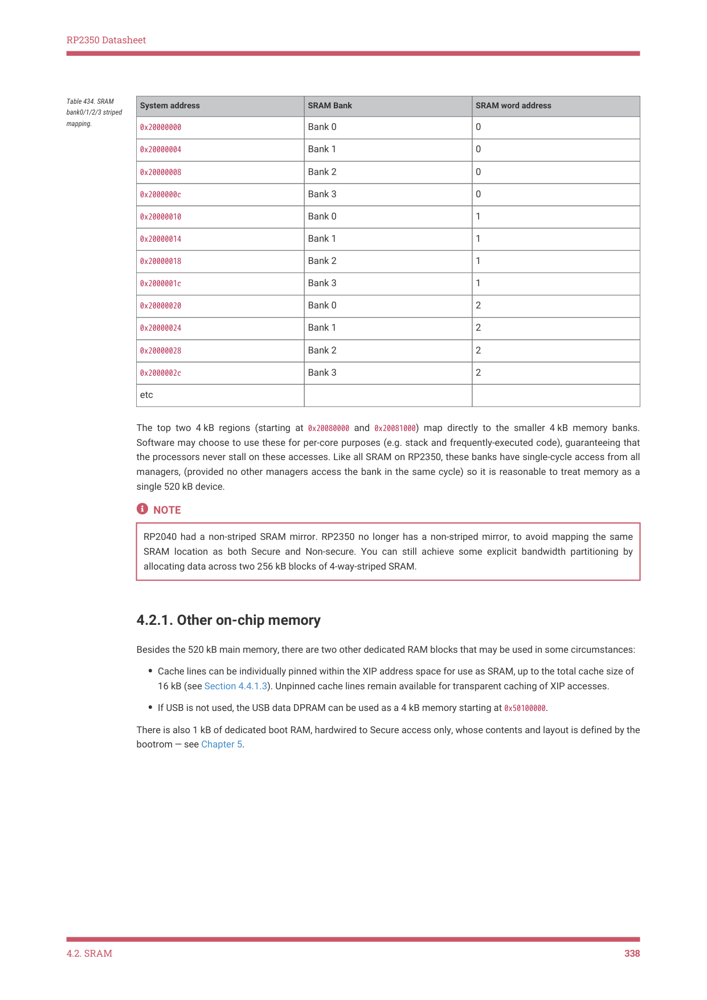

# 4.2.1. Other on-chip memory

4.2.1. Other on-chip memory

Besides the 520 kB main memory, there are two other dedicated RAM blocks that may be used in some circumstances:

• Cache lines can be individually pinned within the XIP address space for use as SRAM, up to the total cache size of

16 kB (see Section 4.4.1.3). Unpinned cache lines remain available for transparent caching of XIP accesses.
• If USB is not used, the USB data DPRAM can be used as a 4 kB memory starting at 0x50100000.

There is also 1 kB of dedicated boot RAM, hardwired to Secure access only, whose contents and layout is defined by the

bootrom — see Chapter 5.

4.2. SRAM
338
