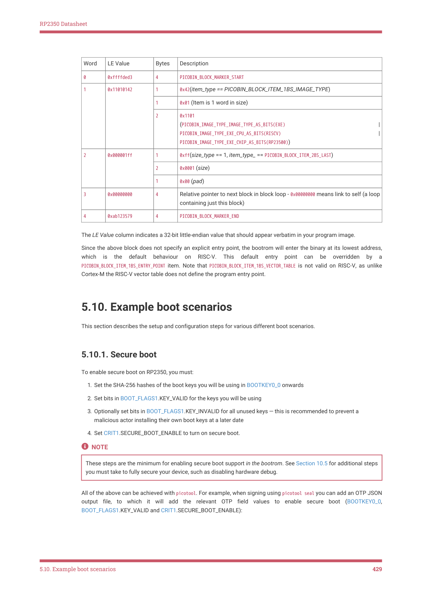

# 5.10.1. Secure boot

To enable secure boot on RP2350, you must:

1. Set the SHA-256 hashes of the boot keys you will be using in BOOTKEY0_0 onwards

2. Set bits in BOOT_FLAGS1.KEY_VALID for the keys you will be using

3. Optionally set bits in BOOT_FLAGS1.KEY_INVALID for all unused keys — this is recommended to prevent a

malicious actor installing their own boot keys at a later date

4. Set CRIT1.SECURE_BOOT_ENABLE to turn on secure boot.

These steps are the minimum for enabling secure boot support in the bootrom. See Section 10.5 for additional steps

you must take to fully secure your device, such as disabling hardware debug.

All of the above can be achieved with picotool. For example, when signing using picotool seal you can add an OTP JSON

output file, to which it will add the relevant OTP field values to enable secure boot (BOOTKEY0_0,

BOOT_FLAGS1.KEY_VALID and CRIT1.SECURE_BOOT_ENABLE):

5.10. Example boot scenarios
429
