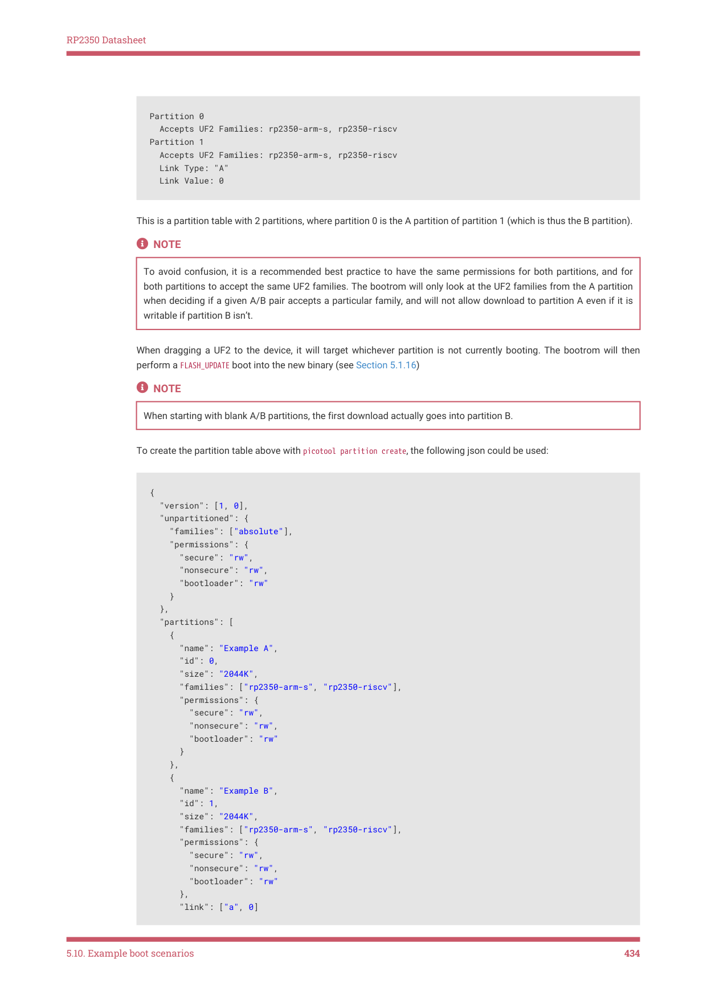

# 5.10.4. A/B booting

5.10.4. A/B booting

This is a common boot scenario, to be able to update the software without overwriting it. A simple partition layout

would be:

5.10. Example boot scenarios
433

RP2350 Datasheet

  Accepts UF2 Families: rp2350-arm-s, rp2350-riscv

  Accepts UF2 Families: rp2350-arm-s, rp2350-riscv

This is a partition table with 2 partitions, where partition 0 is the A partition of partition 1 (which is thus the B partition).

To avoid confusion, it is a recommended best practice to have the same permissions for both partitions, and for

both partitions to accept the same UF2 families. The bootrom will only look at the UF2 families from the A partition

when deciding if a given A/B pair accepts a particular family, and will not allow download to partition A even if it is

writable if partition B isn’t.

When dragging a UF2 to the device, it will target whichever partition is not currently booting. The bootrom will then

perform a FLASH_UPDATE boot into the new binary (see Section 5.1.16)

When starting with blank A/B partitions, the first download actually goes into partition B.

To create the partition table above with picotool partition create, the following json could be used:

      "families": ["rp2350-arm-s", "rp2350-riscv"],

      "families": ["rp2350-arm-s", "rp2350-riscv"],

5.10. Example boot scenarios
434
