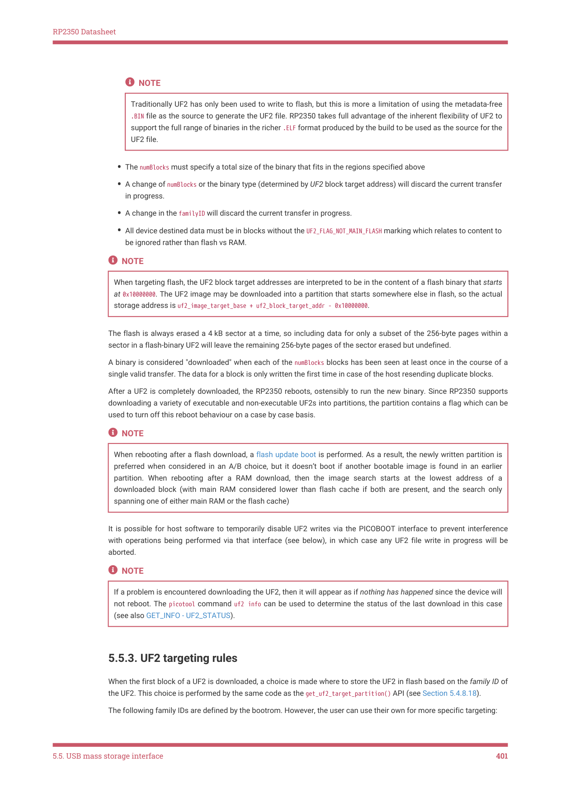

# 5.5.3. UF2 targeting rules

5.5.3. UF2 targeting rules

When the first block of a UF2 is downloaded, a choice is made where to store the UF2 in flash based on the family ID of

the UF2. This choice is performed by the same code as the get_uf2_target_partition() API (see Section 5.4.8.18).

The following family IDs are defined by the bootrom. However, the user can use their own for more specific targeting:

5.5. USB mass storage interface
401

RP2350 Datasheet

| Name | Value | Description |
| --- | --- | --- |
| absolute | 0xe48bff57 | Special family ID for content intended to be written directly to flash, ignoring partitions. |
| rp2040 | 0xe48bff56 | RP2040 executable image. |
| data | 0xe48bff58 | Generic catch-all for data UF2s. |
| rp2350 arm s _ _ | 0xe48bff59 | RP2350 Arm Secure image (one intended to be booted by the bootrom). |
| rp2350 riscv _ | 0xe48bff5a | RP2350 RISC-V image. |
| rp2350 arm ns _ _ | 0xe48bff5b | RP2350 Arm Non-secure image. Not directly bootable by the bootrom. However, Secure user code is likely to want to be able to locate binaries of this type. |

Table 455. Table of

standard UF2 family

IDs understood by the

RP2350 bootrom

NOTE

The only information available to the algorithm that makes the choice of where to store the UF2, is the UF2 family ID;

the algorithm can’t look inside at the UF2 contents as UF2 data sectors may appear at the device in any order.

A UF2 with the absolute family ID is downloaded without regard to partition boundaries. A partition table (if present) or

OTP configuration can define whether absolute family ID downloads are allowed, and download to the start of flash. The

default factory settings allow for absolute family ID downloads

If there is a partition table present, any other family IDs download to a single partition; if there is no partition table

present then the data, rp2350-arm-s (if Arm architecture is enabled) and rp2350-riscv (if RISC-V architecture is enabled)

family IDs are allowed by default, and the UF2 is always downloaded to the start of flash.

If a partition table is present, then up to four passes are made over the partition table (from first to last partition

encountered) until a matching partition is found; Each pass has different selection criteria:

1. Look for an (unowned) A partition, ignoring those marked NOT_BOOTABLE for the current CPU architecture

Use of the NOT_BOOTABLE_ flags allows you to have separate boot partitions for each CPU architecture (Arm or RISC-

V); were you not to use NOT_BOOTABLE_ flags in this scenario, and say the first encountered partition has an Arm

IMAGE_DEF, then, when booting under the RISC-V architecture with auto architecture switching enabled, the bootrom

would just switch back into the Arm architecture to boot the Arm binary. Marking the first partition as

NOT_BOOTABLE_RISCV in the partition table solves this problem.

The correct CPU architecture refers to a match between the architecture of the UF2 (determined by family ID of

rp2350_arm_s or rp2350_riscv) and the current CPU architecture.

This pass allows the user to drop either Arm or RISC-V UF2s, and have them stored as you’d want for the

NOT_BOOTABLE_ flag scenario.

2. If auto architecture switching is enabled and the other architecture is available, look for an (unowned) A partition,

ignoring those marked NOT_BOOTABLE for that CPU architecture.

This pass is designed to match the boot use case of booting images from the other architecture as a fallback. If

there is a partition that would be booted as a result auto architecture switching then this a reasonable place to

store this UF2 for the alternative architecture.

3. Look for any unowned A partition that accepts the family ID

This pass provides a way to target any UF2s to a partitions based on family ID, but assumes that you’d prefer a

UF2 to go into a matching top-level partition vs an owned partition.

4. Finally, look for any A partition that accepts the family ID

This pass implicitly only looks at owned partitions, since unowned partitions would have been matched in the

previous pass.

If none of the passes find a match, the UF2 contents aren’t then downloaded. The picotool command uf2 info can be

5.5. USB mass storage interface
402
