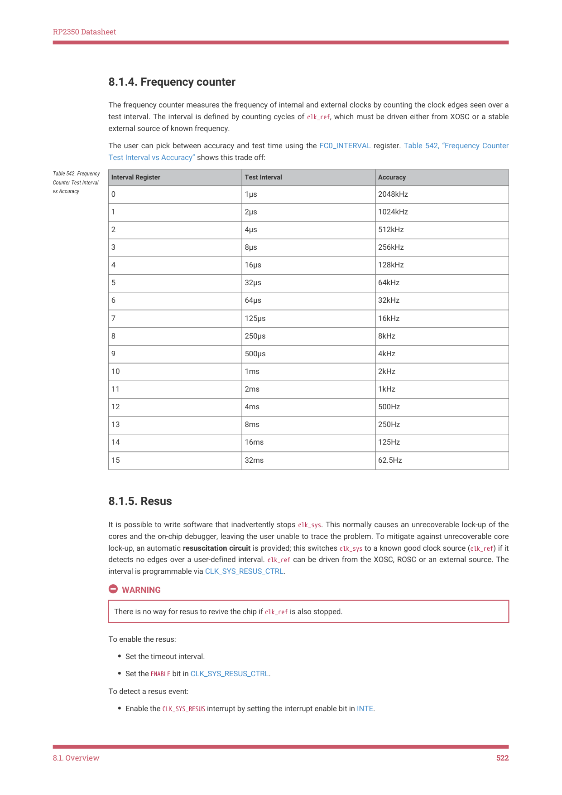

# 8.1.5. Resus

It is possible to write software that inadvertently stops clk_sys. This normally causes an unrecoverable lock-up of the

cores and the on-chip debugger, leaving the user unable to trace the problem. To mitigate against unrecoverable core

lock-up, an automatic resuscitation circuit is provided; this switches clk_sys to a known good clock source (clk_ref) if it

detects no edges over a user-defined interval. clk_ref can be driven from the XOSC, ROSC or an external source. The

interval is programmable via CLK_SYS_RESUS_CTRL.

There is no way for resus to revive the chip if clk_ref is also stopped.

To enable the resus:

• Set the timeout interval.
• Set the ENABLE bit in CLK_SYS_RESUS_CTRL.

To detect a resus event:

• Enable the CLK_SYS_RESUS interrupt by setting the interrupt enable bit in INTE.

8.1. Overview
522
