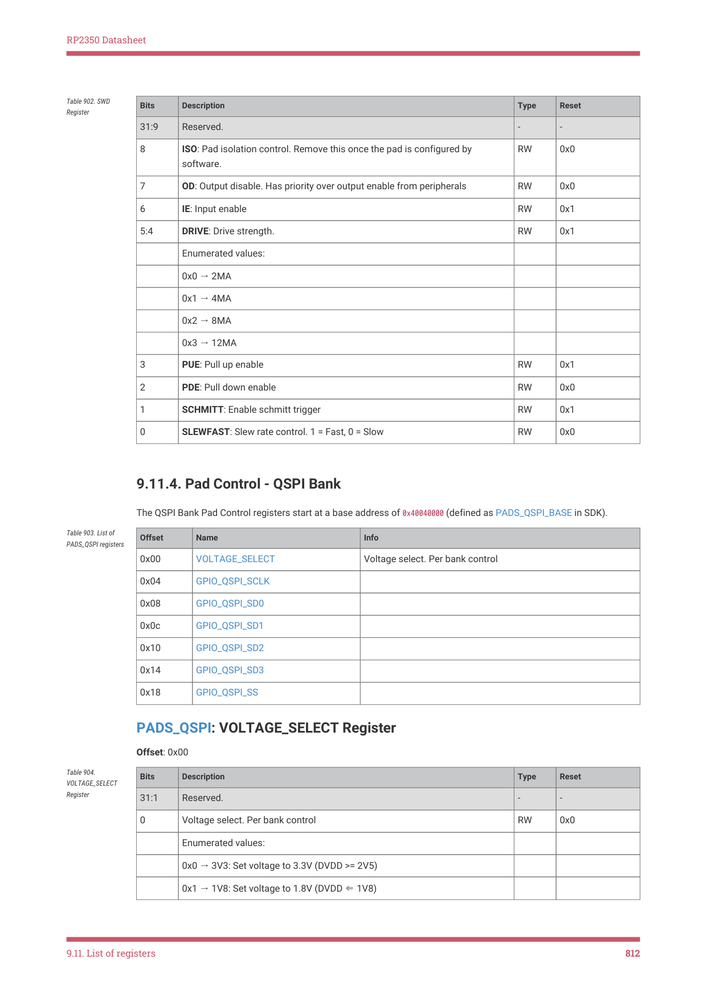
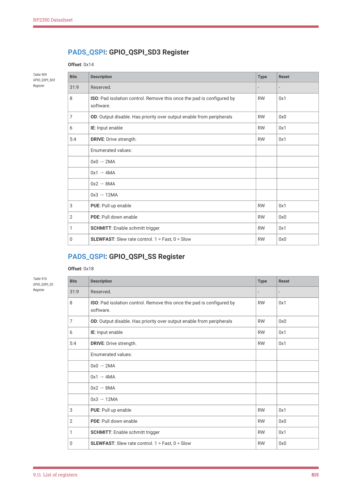

# 9.11.4. Pad Control - QSPI Bank

9.11.4. Pad Control - QSPI Bank

The QSPI Bank Pad Control registers start at a base address of 0x40040000 (defined as PADS_QSPI_BASE in SDK).

Table 903. List of

PADS_QSPI registers
Offset
Name
Info

0x00
VOLTAGE_SELECT
Voltage select. Per bank control

PADS_QSPI: VOLTAGE_SELECT Register

Table 904.

Bits
Description
Type
Reset

VOLTAGE_SELECT

Register

31:1
Reserved.
-
-

0
Voltage select. Per bank control
RW
0x0

0x0 → 3V3: Set voltage to 3.3V (DVDD >= 2V5)

0x1 → 1V8: Set voltage to 1.8V (DVDD ⇐ 1V8)

9.11. List of registers
812

RP2350 Datasheet

PADS_QSPI: GPIO_QSPI_SCLK Register

Offset: 0x04

Table 905.

Bits
Description
Type
Reset

GPIO_QSPI_SCLK

Register

31:9
Reserved.
-
-

8
ISO: Pad isolation control. Remove this once the pad is configured by

7
OD: Output disable. Has priority over output enable from peripherals
RW
0x0

6
IE: Input enable
RW
0x1

5:4
DRIVE: Drive strength.
RW
0x1

3
PUE: Pull up enable
RW
0x0

2
PDE: Pull down enable
RW
0x1

1
SCHMITT: Enable schmitt trigger
RW
0x1

0
SLEWFAST: Slew rate control. 1 = Fast, 0 = Slow
RW
0x0

PADS_QSPI: GPIO_QSPI_SD0 Register

Table 906.

Bits
Description
Type
Reset

GPIO_QSPI_SD0

Register

31:9
Reserved.
-
-

8
ISO: Pad isolation control. Remove this once the pad is configured by

7
OD: Output disable. Has priority over output enable from peripherals
RW
0x0

6
IE: Input enable
RW
0x1

5:4
DRIVE: Drive strength.
RW
0x1

3
PUE: Pull up enable
RW
0x0

2
PDE: Pull down enable
RW
0x1

1
SCHMITT: Enable schmitt trigger
RW
0x1

0
SLEWFAST: Slew rate control. 1 = Fast, 0 = Slow
RW
0x0

9.11. List of registers
813

RP2350 Datasheet

PADS_QSPI: GPIO_QSPI_SD1 Register

Offset: 0x0c

Table 907.

Bits
Description
Type
Reset

GPIO_QSPI_SD1

Register

31:9
Reserved.
-
-

8
ISO: Pad isolation control. Remove this once the pad is configured by

7
OD: Output disable. Has priority over output enable from peripherals
RW
0x0

6
IE: Input enable
RW
0x1

5:4
DRIVE: Drive strength.
RW
0x1

3
PUE: Pull up enable
RW
0x0

2
PDE: Pull down enable
RW
0x1

1
SCHMITT: Enable schmitt trigger
RW
0x1

0
SLEWFAST: Slew rate control. 1 = Fast, 0 = Slow
RW
0x0

PADS_QSPI: GPIO_QSPI_SD2 Register

Table 908.

Bits
Description
Type
Reset

GPIO_QSPI_SD2

Register

31:9
Reserved.
-
-

8
ISO: Pad isolation control. Remove this once the pad is configured by

7
OD: Output disable. Has priority over output enable from peripherals
RW
0x0

6
IE: Input enable
RW
0x1

5:4
DRIVE: Drive strength.
RW
0x1

3
PUE: Pull up enable
RW
0x1

2
PDE: Pull down enable
RW
0x0

1
SCHMITT: Enable schmitt trigger
RW
0x1

0
SLEWFAST: Slew rate control. 1 = Fast, 0 = Slow
RW
0x0

9.11. List of registers
814

RP2350 Datasheet

PADS_QSPI: GPIO_QSPI_SD3 Register

Offset: 0x14

Table 909.

Bits
Description
Type
Reset

GPIO_QSPI_SD3

Register

31:9
Reserved.
-
-

8
ISO: Pad isolation control. Remove this once the pad is configured by

7
OD: Output disable. Has priority over output enable from peripherals
RW
0x0

6
IE: Input enable
RW
0x1

5:4
DRIVE: Drive strength.
RW
0x1

3
PUE: Pull up enable
RW
0x1

2
PDE: Pull down enable
RW
0x0

1
SCHMITT: Enable schmitt trigger
RW
0x1

0
SLEWFAST: Slew rate control. 1 = Fast, 0 = Slow
RW
0x0

PADS_QSPI: GPIO_QSPI_SS Register

Table 910.

Bits
Description
Type
Reset

GPIO_QSPI_SS

Register

31:9
Reserved.
-
-

8
ISO: Pad isolation control. Remove this once the pad is configured by

7
OD: Output disable. Has priority over output enable from peripherals
RW
0x0

6
IE: Input enable
RW
0x1

5:4
DRIVE: Drive strength.
RW
0x1

3
PUE: Pull up enable
RW
0x1

2
PDE: Pull down enable
RW
0x0

1
SCHMITT: Enable schmitt trigger
RW
0x1

0
SLEWFAST: Slew rate control. 1 = Fast, 0 = Slow
RW
0x0

9.11. List of registers
815
