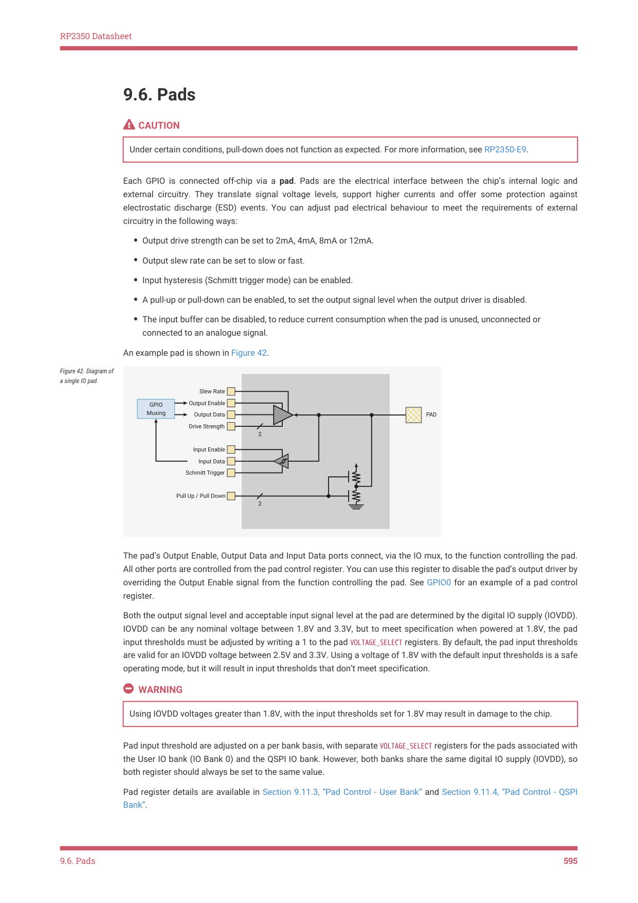

# 9.6. Pads

RP2350 Datasheet

9.6. Pads

CAUTION

Under certain conditions, pull-down does not function as expected. For more information, see RP2350-E9.

Each GPIO is connected off-chip via a pad. Pads are the electrical interface between the chip’s internal logic and

external circuitry. They translate signal voltage levels, support higher currents and offer some protection against

electrostatic discharge (ESD) events. You can adjust pad electrical behaviour to meet the requirements of external

circuitry in the following ways:

• Output drive strength can be set to 2mA, 4mA, 8mA or 12mA.
• Output slew rate can be set to slow or fast.
• Input hysteresis (Schmitt trigger mode) can be enabled.
• A pull-up or pull-down can be enabled, to set the output signal level when the output driver is disabled.
• The input buffer can be disabled, to reduce current consumption when the pad is unused, unconnected or

connected to an analogue signal.

An example pad is shown in Figure 42.

Figure 42. Diagram of

a single IO pad.

The pad’s Output Enable, Output Data and Input Data ports connect, via the IO mux, to the function controlling the pad.

All other ports are controlled from the pad control register. You can use this register to disable the pad’s output driver by

overriding the Output Enable signal from the function controlling the pad. See GPIO0 for an example of a pad control

Both the output signal level and acceptable input signal level at the pad are determined by the digital IO supply (IOVDD).

IOVDD can be any nominal voltage between 1.8V and 3.3V, but to meet specification when powered at 1.8V, the pad

input thresholds must be adjusted by writing a 1 to the pad VOLTAGE_SELECT registers. By default, the pad input thresholds

are valid for an IOVDD voltage between 2.5V and 3.3V. Using a voltage of 1.8V with the default input thresholds is a safe

operating mode, but it will result in input thresholds that don’t meet specification.

Using IOVDD voltages greater than 1.8V, with the input thresholds set for 1.8V may result in damage to the chip.

Pad input threshold are adjusted on a per bank basis, with separate VOLTAGE_SELECT registers for the pads associated with

the User IO bank (IO Bank 0) and the QSPI IO bank. However, both banks share the same digital IO supply (IOVDD), so

both register should always be set to the same value.

Pad register details are available in Section 9.11.3, “Pad Control - User Bank” and Section 9.11.4, “Pad Control - QSPI

Bank”.

9.6. Pads
595
