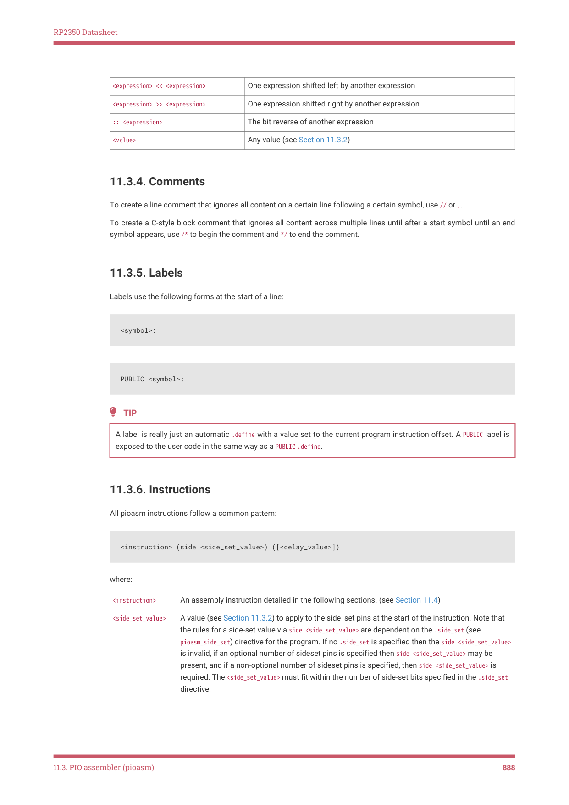

# 11.3.5. Labels

Labels use the following forms at the start of a line:

A label is really just an automatic .define with a value set to the current program instruction offset. A PUBLIC label is

exposed to the user code in the same way as a PUBLIC .define.
