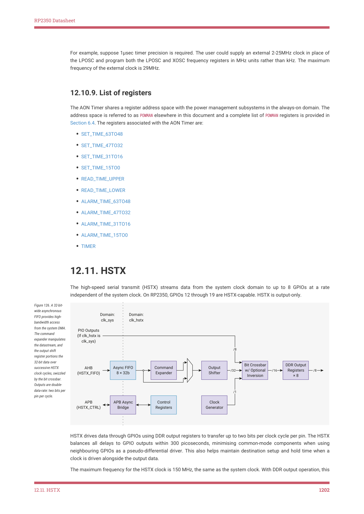

# 12.10.8. Using a tick faster than 1ms

12.10.8. Using a tick faster than 1ms

The tick rate can be increased by scaling the value written to the LPOSC and XOSC frequency registers. For example, if

the frequency value is divided by 4 then the AON Timer will tick 4 times per ms. The minimum value that can be written

to the frequency registers is 2.0, therefore the maximum upscaling using this method with LPOSC is 16, giving a time

resolution of 1/16th of 1 ms (= 62.5us).

As described previously, the external tick is limited to 16kHz, so the maximum upscaling using this method is also 16.

This gives a time resolution of 1/16th of 1 ms (62.5μs).

These limitations can be overcome either by using a faster external clock (see Section 12.10.5.2) or keeping the chip

core powered so the AON Timer is always running from the XOSC. If a faster external clock is used then the power

sequencer timings will also need to be adjusted.

12.10. Always-on timer
1201

RP2350 Datasheet

For example, suppose 1μsec timer precision is required. The user could supply an external 2-25MHz clock in place of

the LPOSC and program both the LPOSC and XOSC frequency registers in MHz units rather than kHz. The maximum

frequency of the external clock is 29MHz.

