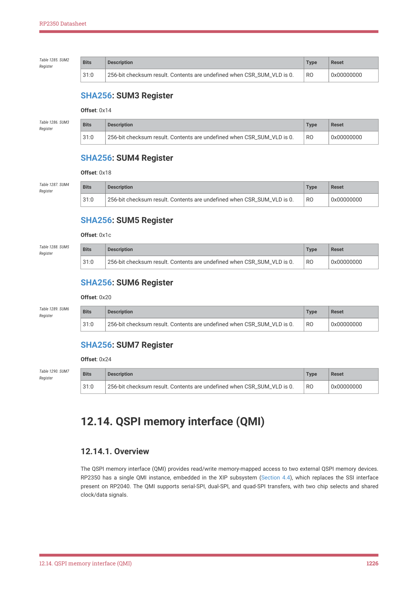

# 12.14.1. Overview

12.14.1. Overview

The QSPI memory interface (QMI) provides read/write memory-mapped access to two external QSPI memory devices.

RP2350 has a single QMI instance, embedded in the XIP subsystem (Section 4.4), which replaces the SSI interface

present on RP2040. The QMI supports serial-SPI, dual-SPI, and quad-SPI transfers, with two chip selects and shared

clock/data signals.

12.14. QSPI memory interface (QMI)
1226

RP2350 Datasheet

Figure 129. QMI block

diagram: AHB

accesses are address-

translated, broken

down into the

necessary QSPI

transfer phases such

as command, address

and data, and

interfaced to the

external QSPI signals

via the

serialiser/deserialiser.

There is a chip select

per device, and shared

clock/data signals.

Separately, the direct

mode interface can be

used to issue raw SPI

commands through a

pair of FIFOs, which

can be used to

program and configure

the external QSPI

devices.

|  |  |  |  |  |  |
| --- | --- | --- | --- | --- | --- |
| S | CK | CSn | [1:0] | SD[ | 3:0] |

Each chip select corresponds to a 16 MB AHB address window, so a maximum of 32 MB of external memory is

supported. Chip select 0, which has a dedicated external pin, is mapped to addresses starting from 0x10000000, and chip

select 1, which is available as an alternate GPIO function, starts from 0x11000000. This mapping is mirrored in the

uncached and uncached + untranslated XIP address windows described in Section 4.4.

All timing and SPI command format parameters are configured per chip select, with the correct configuration used

automatically based on address decode. For example, M0_TIMING configures timing parameters for accesses to chip

select 0, and M1_TIMING is an identical register for chip select 1.

The serial clock (SCK) is any integer division of the system clock in the range 1 to 256. The divisors can be adjusted at

any time. Input sample timing can be adjusted in half-system-clock-cycle increments, to compensate for clock-to-data

delay at high SCK frequencies. Double transfer rate mode (DTR) is implemented by halving the SCK frequency whilst

maintaining the data transfer rate, which is capped at 4 bits per system clock cycle.

The number of SCK cycles issued for each access depends on the access size, which varies between one byte and one

cache line. For example, an uncached one-byte read by a processor will fetch exactly one byte of data over the QSPI bus,

to avoid wasting time fetching unwanted data. Cache misses are always issued as 64-bit QSPI transfers.

Optionally, the QMI can automatically chain sequentially addressed AHB accesses into a single, long QSPI transfer. This

avoids issuing redundant commands and addresses on the QSPI bus, and is particularly beneficial for cold code paths

and for streaming in flash data using the XIP streaming hardware (Section 4.4.3). For PSRAM compatibility, chains can

be broken when they exceed a maximum chip select time (M0_TIMING.MAX_SELECT) or when they cross certain

power-of-two address boundaries (M0_TIMING.PAGEBREAK). Section 12.14.2.1 goes into more detail on these

features.

The QMI can map addresses with its built-in address translation hardware: each chip select is partitioned into 4 × 4 MB

windows, whose physical base address and aperture size are configured in units of 4 kB (one flash sector). This enables

the runtime addresses of flash programs to be independent of where they are stored: for example, a flash-resident

bootloader at flash storage address 0 could select one of multiple flash-resident program images, all of them linked to

run at address 0x10000000, and these can be executed in place with no position-independent code required. Address

translation is described fully in Section 12.14.4.

Finally, the direct-mode interface is included for cases where software needs to communicate directly with the external

QSPI devices, for example to access status registers. This interface also supports serial, dual, and quad interface

widths as described in Section 12.14.5.

12.14. QSPI memory interface (QMI)
1227
