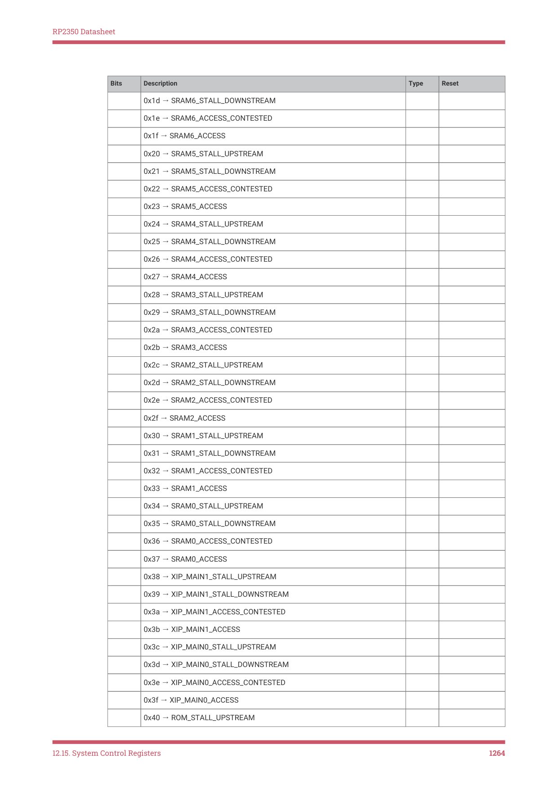

# 12.15.4. BUSCTRL

12.15.4. BUSCTRL

This block provides basic controls and monitoring for the system bus fabric.

12.15.4.1. Bus priority

RP2350 implements a dynamic bus priority scheme described in Section 2.1.1. The BUS_PRIORITY register implements

the priority controls for this scheme.

12.15.4.2. Performance counters

There are four 24-bit counters, each of which can subscribe to a single performance event from the system bus fabric.

Counters saturate at a value of all-ones: the counter stops incrementing when it reaches its maximum value, rather than

wrapping to zero.

The performance counters are initially disabled: you must write 1 to PERFCTR_EN before the counters begin to

increment. Write any value to a counter to clear the counter to zero in before running a profiled section of code, and

enable the counters immediately before entering the profiled section. Disable the counters again immediately upon

leaving the profiled section. The counters do not support arbitrary writes: they only count up from zero.

Write to a performance event selector register PERFSEL0 through PERFSEL3 to select the performance event which

increments the corresponding counter, PERFCTR0 through PERFCTR3.

For each of the seventeen downstream bus ports on the main system AHB5 crossbar shown in Figure 5, there are four

types of event which the performance counters detect. These events do not distinguish reads from writes, but they do

distinguish different types of bus stall, which can be helpful when diagnosing performance issues. The types of event

are:

Access

Increment when any access completes on this downstream port.

Contested access

Increment when any access completes on this downstream port which previously stalled due to the port being

12.15. System Control Registers
1255

RP2350 Datasheet

occupied by another access. For example, if two managers access an initially idle port simultaneously, one will

complete before the other. The access that completes first is said to not be contested, and does not increment this

counter. The access that completes second (which was initially deferred due to the access from the other

manager) is contested, and increments this counter when it completes.

Upstream-stalled cycle

Increment once per cycle while any manager experiences a stall on this port. This may be either due to arbitration

with another manager (a contested access) or due to a stall on the downstream bus port, such as access to a slow

peripheral. This is measured at the port, before leaving the main AHB5 crossbar.

Downstream-stalled cycle

Increment once per cycle while this port itself experiences a stall on the downstream bus. This indicates the

peripheral or memory device itself being slow to respond, such as an XIP cache miss.

The first two event types listed above are the same as RP2040. The latter two are new for RP2350.

12.15.4.3. List of registers

The Bus Fabric registers start at a base address of 0x40068000 (defined as BUSCTRL_BASE in SDK).

| Offset | Name | Info |
| --- | --- | --- |
| 0x00 | BUS_PRIORITY | Set the priority of each master for bus arbitration. |
| 0x04 | BUS_PRIORITY_ACK | Bus priority acknowledge |
| 0x08 | PERFCTR_EN | Enable the performance counters. If 0, the performance counters do not increment. This can be used to precisely start/stop event sampling around the profiled section of code. The performance counters are initially disabled, to save energy. |
| 0x0c | PERFCTR0 | Bus fabric performance counter 0 |
| 0x10 | PERFSEL0 | Bus fabric performance event select for PERFCTR0 |
| 0x14 | PERFCTR1 | Bus fabric performance counter 1 |
| 0x18 | PERFSEL1 | Bus fabric performance event select for PERFCTR1 |
| 0x1c | PERFCTR2 | Bus fabric performance counter 2 |
| 0x20 | PERFSEL2 | Bus fabric performance event select for PERFCTR2 |
| 0x24 | PERFCTR3 | Bus fabric performance counter 3 |
| 0x28 | PERFSEL3 | Bus fabric performance event select for PERFCTR3 |

Table 1320. List of

BUSCTRL: BUS_PRIORITY Register

Offset: 0x00

Description

Set the priority of each master for bus arbitration.

| Bits | Description | Type | Reset |
| --- | --- | --- | --- |
| 31:13 | Reserved. | - | - |
| 12 | DMA_W: 0 - low priority, 1 - high priority | RW | 0x0 |
| 11:9 | Reserved. | - | - |
| 8 | DMA_R: 0 - low priority, 1 - high priority | RW | 0x0 |
| 7:5 | Reserved. | - | - |
| 4 | PROC1: 0 - low priority, 1 - high priority | RW | 0x0 |
| 3:1 | Reserved. | - | - |
| 0 | PROC0: 0 - low priority, 1 - high priority | RW | 0x0 |

Table 1321.

BUS_PRIORITY

Register

12.15. System Control Registers
1256

RP2350 Datasheet

BUSCTRL: BUS_PRIORITY_ACK Register

Offset: 0x04

Description

Bus priority acknowledge

| Bits | Description | Type | Reset |
| --- | --- | --- | --- |
| 31:1 | Reserved. | - | - |
| 0 | Goes to 1 once all arbiters have registered the new global priority levels. Arbiters update their local priority when servicing a new nonsequential access. In normal circumstances this will happen almost immediately. | RO | 0x0 |

Table 1322.

BUS_PRIORITY_ACK

Register

BUSCTRL: PERFCTR_EN Register

Offset: 0x08

| Bits | Description | Type | Reset |
| --- | --- | --- | --- |
| 31:1 | Reserved. | - | - |
| 0 | Enable the performance counters. If 0, the performance counters do not increment. This can be used to precisely start/stop event sampling around the profiled section of code. The performance counters are initially disabled, to save energy. | RW | 0x0 |

Table 1323.

BUSCTRL: PERFCTR0 Register

Offset: 0x0c

Description

Bus fabric performance counter 0

| Bits | Description | Type | Reset |
| --- | --- | --- | --- |
| 31:24 | Reserved. | - | - |
| 23:0 | Busfabric saturating performance counter 0 Count some event signal from the busfabric arbiters, if PERFCTR_EN is set. Write any value to clear. Select an event to count using PERFSEL0 | WC | 0x000000 |

Table 1324.

BUSCTRL: PERFSEL0 Register

Offset: 0x10

Description

Bus fabric performance event select for PERFCTR0

12.15. System Control Registers
1257

RP2350 Datasheet

Table 1325. PERFSEL0

Register
Bits
Description
Type
Reset

31:7
Reserved.
-
-

6:0
Select an event for PERFCTR0. For each downstream port of the main

crossbar, four events are available: ACCESS, an access took place;

ACCESS_CONTESTED, an access took place that previously stalled due to

contention from other masters; STALL_DOWNSTREAM, count cycles where

any master stalled due to a stall on the downstream bus; STALL_UPSTREAM,

count cycles where any master stalled for any reason, including contention

0x00 → SIOB_PROC1_STALL_UPSTREAM

0x01 → SIOB_PROC1_STALL_DOWNSTREAM

0x02 → SIOB_PROC1_ACCESS_CONTESTED

0x04 → SIOB_PROC0_STALL_UPSTREAM

0x05 → SIOB_PROC0_STALL_DOWNSTREAM

0x06 → SIOB_PROC0_ACCESS_CONTESTED

0x0c → FASTPERI_STALL_UPSTREAM

0x0d → FASTPERI_STALL_DOWNSTREAM

0x0e → FASTPERI_ACCESS_CONTESTED

12.15. System Control Registers
1258

RP2350 Datasheet

Bits
Description
Type
Reset

0x38 → XIP_MAIN1_STALL_UPSTREAM

0x39 → XIP_MAIN1_STALL_DOWNSTREAM

0x3a → XIP_MAIN1_ACCESS_CONTESTED

0x3c → XIP_MAIN0_STALL_UPSTREAM

0x3d → XIP_MAIN0_STALL_DOWNSTREAM

0x3e → XIP_MAIN0_ACCESS_CONTESTED

12.15. System Control Registers
1259

RP2350 Datasheet

Bits
Description
Type
Reset

Bus fabric performance counter 1

| Bits | Description | Type | Reset |
| --- | --- | --- | --- |
| 31:24 | Reserved. | - | - |
| 23:0 | Busfabric saturating performance counter 1 Count some event signal from the busfabric arbiters, if PERFCTR_EN is set. Write any value to clear. Select an event to count using PERFSEL1 | WC | 0x000000 |

Table 1326.

Bus fabric performance event select for PERFCTR1

Table 1327. PERFSEL1

Register
Bits
Description
Type
Reset

31:7
Reserved.
-
-

6:0
Select an event for PERFCTR1. For each downstream port of the main

crossbar, four events are available: ACCESS, an access took place;

ACCESS_CONTESTED, an access took place that previously stalled due to

contention from other masters; STALL_DOWNSTREAM, count cycles where

any master stalled due to a stall on the downstream bus; STALL_UPSTREAM,

count cycles where any master stalled for any reason, including contention

0x00 → SIOB_PROC1_STALL_UPSTREAM

0x01 → SIOB_PROC1_STALL_DOWNSTREAM

0x02 → SIOB_PROC1_ACCESS_CONTESTED

0x04 → SIOB_PROC0_STALL_UPSTREAM

0x05 → SIOB_PROC0_STALL_DOWNSTREAM

0x06 → SIOB_PROC0_ACCESS_CONTESTED

12.15. System Control Registers
1260

RP2350 Datasheet

Bits
Description
Type
Reset

0x0c → FASTPERI_STALL_UPSTREAM

0x0d → FASTPERI_STALL_DOWNSTREAM

0x0e → FASTPERI_ACCESS_CONTESTED

12.15. System Control Registers
1261

RP2350 Datasheet

Bits
Description
Type
Reset

0x38 → XIP_MAIN1_STALL_UPSTREAM

0x39 → XIP_MAIN1_STALL_DOWNSTREAM

0x3a → XIP_MAIN1_ACCESS_CONTESTED

0x3c → XIP_MAIN0_STALL_UPSTREAM

0x3d → XIP_MAIN0_STALL_DOWNSTREAM

0x3e → XIP_MAIN0_ACCESS_CONTESTED

BUSCTRL: PERFCTR2 Register

Offset: 0x1c

Description

Bus fabric performance counter 2

| Bits | Description | Type | Reset |
| --- | --- | --- | --- |
| 31:24 | Reserved. | - | - |
| 23:0 | Busfabric saturating performance counter 2 Count some event signal from the busfabric arbiters, if PERFCTR_EN is set. Write any value to clear. Select an event to count using PERFSEL2 | WC | 0x000000 |

Table 1328.

BUSCTRL: PERFSEL2 Register

Offset: 0x20

Description

Bus fabric performance event select for PERFCTR2

12.15. System Control Registers
1262

RP2350 Datasheet

Table 1329. PERFSEL2

Register
Bits
Description
Type
Reset

31:7
Reserved.
-
-

6:0
Select an event for PERFCTR2. For each downstream port of the main

crossbar, four events are available: ACCESS, an access took place;

ACCESS_CONTESTED, an access took place that previously stalled due to

contention from other masters; STALL_DOWNSTREAM, count cycles where

any master stalled due to a stall on the downstream bus; STALL_UPSTREAM,

count cycles where any master stalled for any reason, including contention

0x00 → SIOB_PROC1_STALL_UPSTREAM

0x01 → SIOB_PROC1_STALL_DOWNSTREAM

0x02 → SIOB_PROC1_ACCESS_CONTESTED

0x04 → SIOB_PROC0_STALL_UPSTREAM

0x05 → SIOB_PROC0_STALL_DOWNSTREAM

0x06 → SIOB_PROC0_ACCESS_CONTESTED

0x0c → FASTPERI_STALL_UPSTREAM

0x0d → FASTPERI_STALL_DOWNSTREAM

0x0e → FASTPERI_ACCESS_CONTESTED

12.15. System Control Registers
1263

RP2350 Datasheet

Bits
Description
Type
Reset

0x38 → XIP_MAIN1_STALL_UPSTREAM

0x39 → XIP_MAIN1_STALL_DOWNSTREAM

0x3a → XIP_MAIN1_ACCESS_CONTESTED

0x3c → XIP_MAIN0_STALL_UPSTREAM

0x3d → XIP_MAIN0_STALL_DOWNSTREAM

0x3e → XIP_MAIN0_ACCESS_CONTESTED

12.15. System Control Registers
1264

RP2350 Datasheet

Bits
Description
Type
Reset

Bus fabric performance counter 3

| Bits | Description | Type | Reset |
| --- | --- | --- | --- |
| 31:24 | Reserved. | - | - |
| 23:0 | Busfabric saturating performance counter 3 Count some event signal from the busfabric arbiters, if PERFCTR_EN is set. Write any value to clear. Select an event to count using PERFSEL3 | WC | 0x000000 |

Table 1330.

Bus fabric performance event select for PERFCTR3

Table 1331. PERFSEL3

Register
Bits
Description
Type
Reset

31:7
Reserved.
-
-

6:0
Select an event for PERFCTR3. For each downstream port of the main

crossbar, four events are available: ACCESS, an access took place;

ACCESS_CONTESTED, an access took place that previously stalled due to

contention from other masters; STALL_DOWNSTREAM, count cycles where

any master stalled due to a stall on the downstream bus; STALL_UPSTREAM,

count cycles where any master stalled for any reason, including contention

0x00 → SIOB_PROC1_STALL_UPSTREAM

0x01 → SIOB_PROC1_STALL_DOWNSTREAM

0x02 → SIOB_PROC1_ACCESS_CONTESTED

0x04 → SIOB_PROC0_STALL_UPSTREAM

0x05 → SIOB_PROC0_STALL_DOWNSTREAM

0x06 → SIOB_PROC0_ACCESS_CONTESTED

12.15. System Control Registers
1265

RP2350 Datasheet

Bits
Description
Type
Reset

0x0c → FASTPERI_STALL_UPSTREAM

0x0d → FASTPERI_STALL_DOWNSTREAM

0x0e → FASTPERI_ACCESS_CONTESTED

12.15. System Control Registers
1266

RP2350 Datasheet

Bits
Description
Type
Reset

0x38 → XIP_MAIN1_STALL_UPSTREAM

0x39 → XIP_MAIN1_STALL_DOWNSTREAM

0x3a → XIP_MAIN1_ACCESS_CONTESTED

0x3c → XIP_MAIN0_STALL_UPSTREAM

0x3d → XIP_MAIN0_STALL_DOWNSTREAM

0x3e → XIP_MAIN0_ACCESS_CONTESTED

12.15. System Control Registers
1267

RP2350 Datasheet

Chapter 13. OTP

RP2350 provides 8 kB of one-time programmable storage (OTP), which holds:

• Preprogrammed per-device information, such as unique device identifier and oscillator trim values
• Security configuration such as debug disable and secure boot enable
• Public key fingerprints for secure boot
• Symmetric keys for decryption of flash contents into SRAM
• Configuration for the USB bootloader, such as customising VID/PID and descriptors
• Bootable software images, for low-cost flashless applications or custom bootloaders
• Any other user-defined data, such as per-device personalisation values

For the full listing of predefined OTP contents, see Section 13.10.

OTP is physically an array of 4096 rows of 24 bits each. You can directly access these 24-bit values, but there is also

hardware support for storing 16 bits of data in each row, with 6 bits of Hamming ECC protection and 2 bits of bit polarity

reversal protection, yielding an ECC data capacity of 8192 bytes.

On a blank device, the OTP contents is all zeroes, except for some basic device information pre-programmed during

manufacturing test. Each bit can be irreversibly programmed from zero to one. To program the OTP contents:

• Directly access the registers using the SBPI bridge
• Call the bootrom otp_access API (Section 5.4.8.21)
• Use the PICOBOOT interface of the USB bootloader (Section 5.6)

RP2350 enforces page-based permissions on OTP to partition Secure from Non-secure data and to ensure that

contents that should not change do not change. The OTP address space is logically partitioned into 64 pages, each 64

rows in size, for a total of 128 bytes of ECC data per page. Pages initially have full read-write permissions, but can be

restricted to read-only or inaccessible for each of Secure, Non-secure and bootloader access.

The page permissions themselves are stored in OTP. Locking pages in this way is an irreversible operation, referred to

as hard locking. The hardware also supports soft locking, where a page’s permissions are further restricted by writing to

the relevant register in SW_LOCK0 through SW_LOCK63; this restriction remains in effect until the next OTP reset.

Resetting the OTP block also resets the processors, so soft locking can be used to restrict the availability of sensitive

content like decryption keys to early boot stages.

OTP access keys (Section 13.5.2) provide an additional layer of protection. A fixed challenge is written to a write-only

OTP area. Pages registered to that key require the key to be entered to a write-only register in order to open read or write

access. This supports configuration data that can be accessed or edited by the board manufacturer, but not by general

firmware running on the device.
