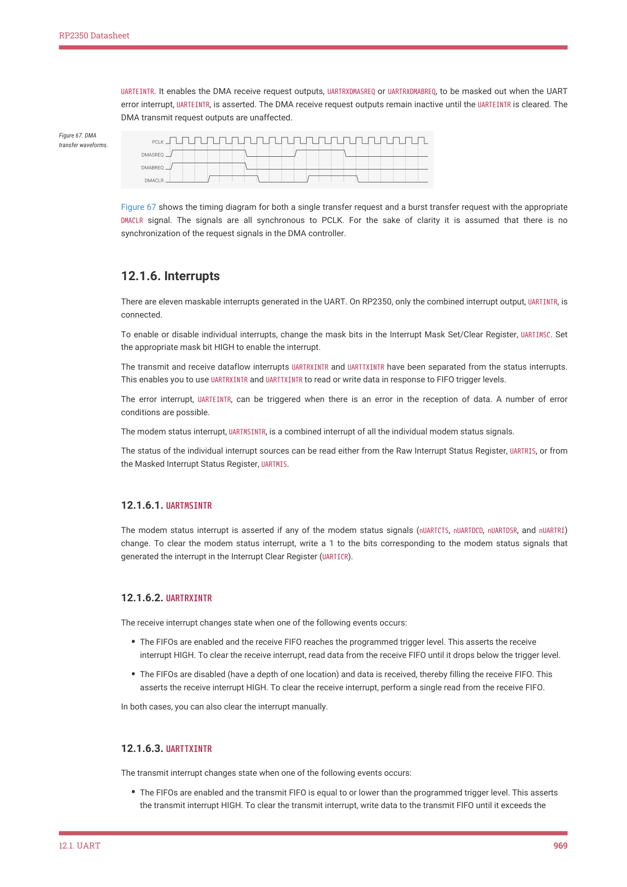

# 12.1.6. Interrupts

12.1.6. Interrupts

There are eleven maskable interrupts generated in the UART. On RP2350, only the combined interrupt output, UARTINTR, is

connected.

To enable or disable individual interrupts, change the mask bits in the Interrupt Mask Set/Clear Register, UARTIMSC. Set

the appropriate mask bit HIGH to enable the interrupt.

The transmit and receive dataflow interrupts UARTRXINTR and UARTTXINTR have been separated from the status interrupts.

This enables you to use UARTRXINTR and UARTTXINTR to read or write data in response to FIFO trigger levels.

The error interrupt, UARTEINTR, can be triggered when there is an error in the reception of data. A number of error

conditions are possible.

The modem status interrupt, UARTMSINTR, is a combined interrupt of all the individual modem status signals.

The status of the individual interrupt sources can be read either from the Raw Interrupt Status Register, UARTRIS, or from

the Masked Interrupt Status Register, UARTMIS.

12.1.6.1. UARTMSINTR

The modem status interrupt is asserted if any of the modem status signals (nUARTCTS, nUARTDCD, nUARTDSR, and nUARTRI)

change. To clear the modem status interrupt, write a 1 to the bits corresponding to the modem status signals that

generated the interrupt in the Interrupt Clear Register (UARTICR).

12.1.6.2. UARTRXINTR

The receive interrupt changes state when one of the following events occurs:

• The FIFOs are enabled and the receive FIFO reaches the programmed trigger level. This asserts the receive

interrupt HIGH. To clear the receive interrupt, read data from the receive FIFO until it drops below the trigger level.
• The FIFOs are disabled (have a depth of one location) and data is received, thereby filling the receive FIFO. This

asserts the receive interrupt HIGH. To clear the receive interrupt, perform a single read from the receive FIFO.

In both cases, you can also clear the interrupt manually.

12.1.6.3. UARTTXINTR

The transmit interrupt changes state when one of the following events occurs:

• The FIFOs are enabled and the transmit FIFO is equal to or lower than the programmed trigger level. This asserts

the transmit interrupt HIGH. To clear the transmit interrupt, write data to the transmit FIFO until it exceeds the

12.1. UART
969

RP2350 Datasheet

trigger level.
• The FIFOs are disabled (have a depth of one location) and there is no data present in the transmit FIFO. This

asserts the transmit interrupt HIGH. To clear the transmit interrupt, perform a single write to the transmit FIFO.

In both cases, you can also clear the interrupt manually.

To update the transmit FIFO, write data to the transmit FIFO before or after enabling the UART and the interrupts.

NOTE

The transmit interrupt is based on a transition through a level, rather than on the level itself. When the interrupt and

the UART is enabled before any data is written to the transmit FIFO, the interrupt is not set. The interrupt is only set

after written data leaves the single location of the transmit FIFO and it becomes empty.

12.1.6.4. UARTRTINTR

The receive timeout interrupt is asserted when the receive FIFO is not empty and no more data is received during a 32-

bit period.

The receive timeout interrupt is cleared in the following scenarios:

• the FIFO becomes empty through reading all the data or by reading the holding register
• a 1 is written to the corresponding bit of the Interrupt Clear Register, UARTICR

12.1.6.5. UARTEINTR

The error interrupt is asserted when an error occurs in the reception of data by the UART. The interrupt can be caused

by a number of different error conditions:

• framing
• parity
• break
• overrun

To determine the cause of the interrupt, read the Raw Interrupt Status Register (UARTRIS) or the Masked Interrupt Status

Register (UARTMIS). To clear the interrupt, write to the relevant bits of the Interrupt Clear Register, UARTICR (bits 7 to 10 are

the error clear bits).

12.1.6.6. UARTINTR

The interrupts are also combined into a single output, that is an OR function of the individual masked sources. You can

connect this output to a system interrupt controller to provide another level of masking on a individual peripheral basis.

The combined UART interrupt is asserted if any of the individual interrupts are asserted and enabled.
