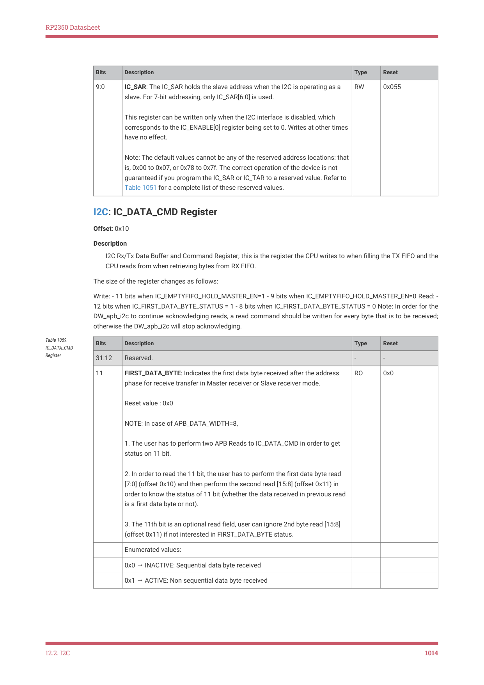
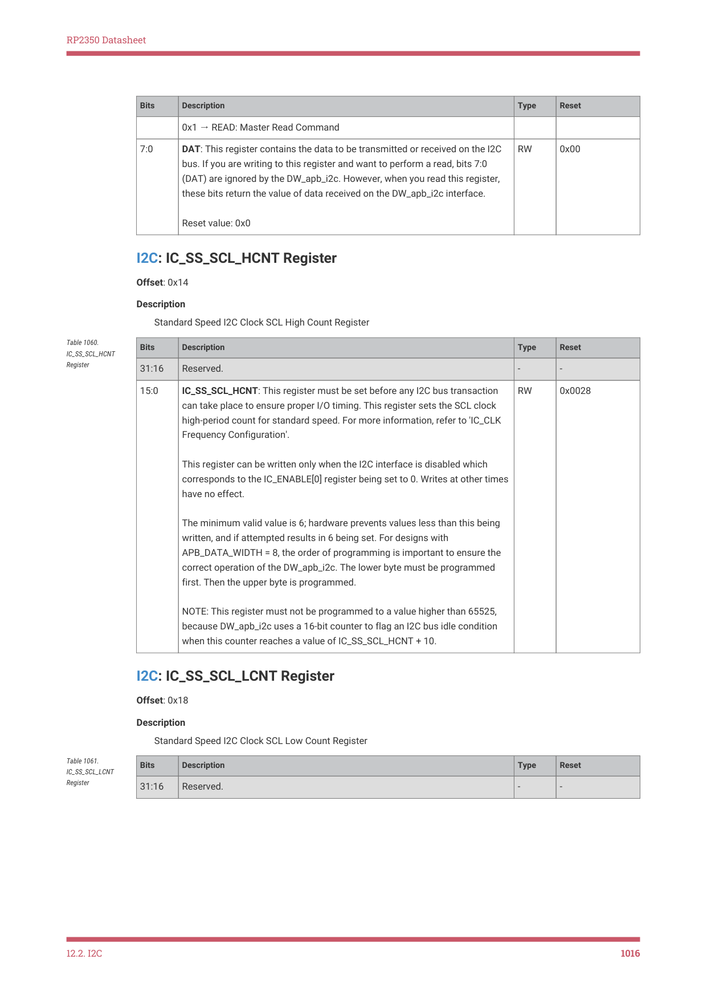
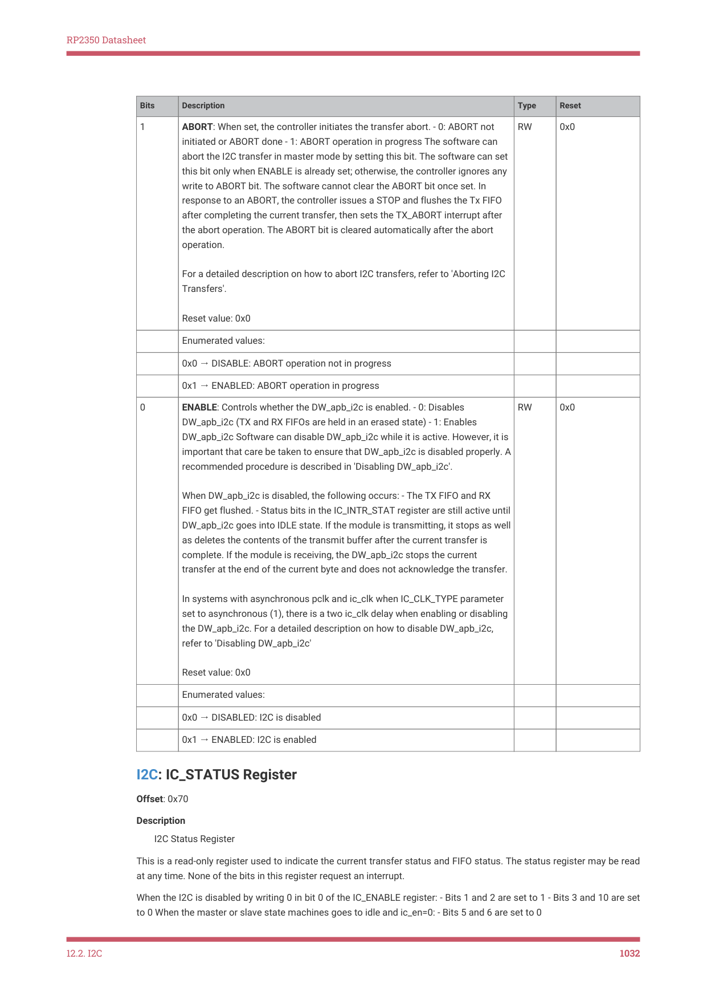
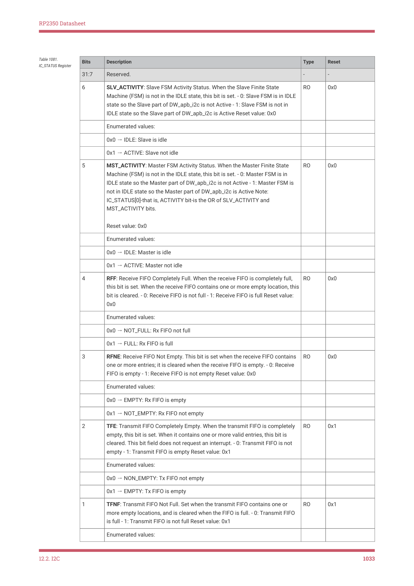
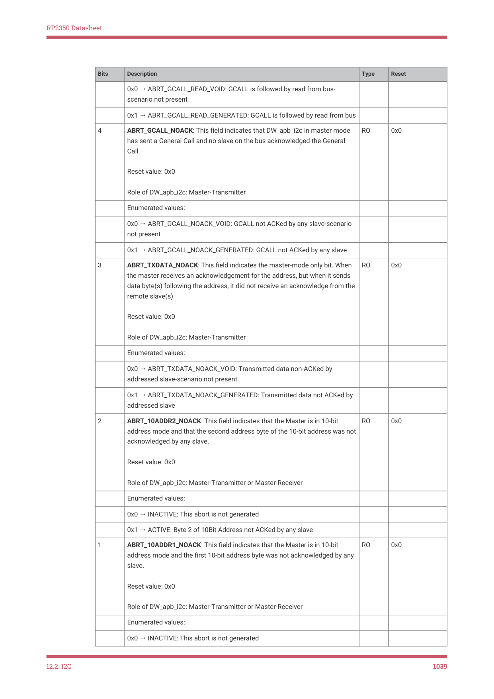
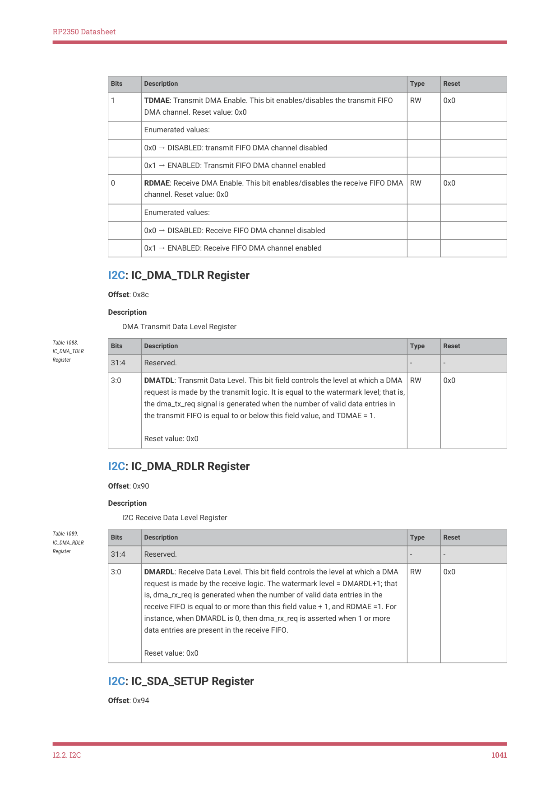
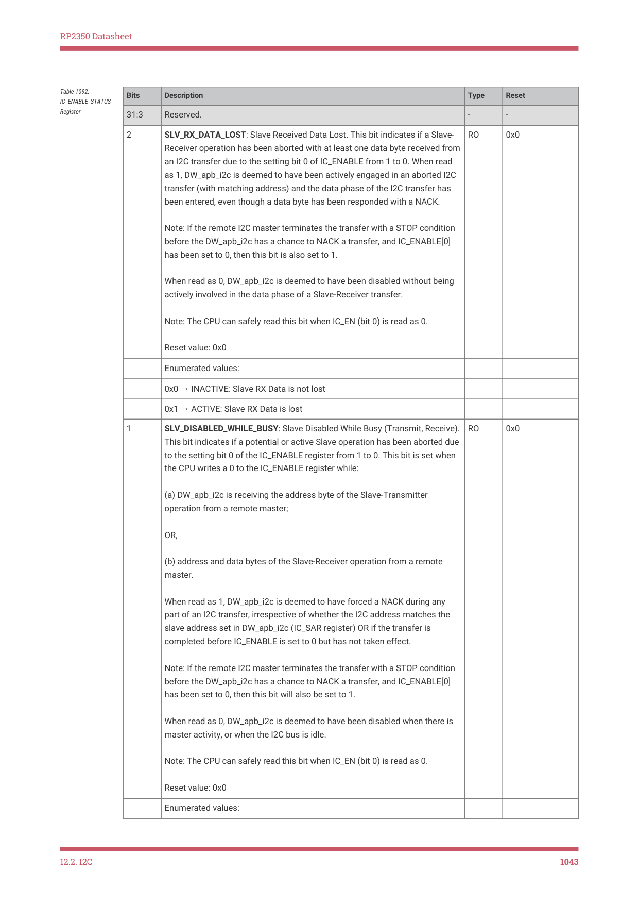

# 12.2.17. List of registers

12.2.17. List of registers

The I2C0 and I2C1 registers start at base addresses of 0x40090000 and 0x40098000 respectively (defined as I2C0_BASE and

I2C1_BASE in SDK).

12.2. I2C
1008

RP2350 Datasheet

NOTE

You may see references to configuration constants in the I2C register descriptions; these are fixed values, set at

hardware design time. A full list of their values can be found in i2c.h in the pico-sdk GitHub repository.

| Offset | Name | Info |
| --- | --- | --- |
| 0x00 | IC_CON | I2C Control Register |
| 0x04 | IC_TAR | I2C Target Address Register |
| 0x08 | IC_SAR | I2C Slave Address Register |
| 0x10 | IC_DATA_CMD | I2C Rx/Tx Data Buffer and Command Register |
| 0x14 | IC_SS_SCL_HCNT | Standard Speed I2C Clock SCL High Count Register |
| 0x18 | IC_SS_SCL_LCNT | Standard Speed I2C Clock SCL Low Count Register |
| 0x1c | IC_FS_SCL_HCNT | Fast Mode or Fast Mode Plus I2C Clock SCL High Count Register |
| 0x20 | IC_FS_SCL_LCNT | Fast Mode or Fast Mode Plus I2C Clock SCL Low Count Register |
| 0x2c | IC_INTR_STAT | I2C Interrupt Status Register |
| 0x30 | IC_INTR_MASK | I2C Interrupt Mask Register |
| 0x34 | IC_RAW_INTR_STAT | I2C Raw Interrupt Status Register |
| 0x38 | IC_RX_TL | I2C Receive FIFO Threshold Register |
| 0x3c | IC_TX_TL | I2C Transmit FIFO Threshold Register |
| 0x40 | IC_CLR_INTR | Clear Combined and Individual Interrupt Register |
| 0x44 | IC_CLR_RX_UNDER | Clear RX_UNDER Interrupt Register |
| 0x48 | IC_CLR_RX_OVER | Clear RX_OVER Interrupt Register |
| 0x4c | IC_CLR_TX_OVER | Clear TX_OVER Interrupt Register |
| 0x50 | IC_CLR_RD_REQ | Clear RD_REQ Interrupt Register |
| 0x54 | IC_CLR_TX_ABRT | Clear TX_ABRT Interrupt Register |
| 0x58 | IC_CLR_RX_DONE | Clear RX_DONE Interrupt Register |
| 0x5c | IC_CLR_ACTIVITY | Clear ACTIVITY Interrupt Register |
| 0x60 | IC_CLR_STOP_DET | Clear STOP_DET Interrupt Register |
| 0x64 | IC_CLR_START_DET | Clear START_DET Interrupt Register |
| 0x68 | IC_CLR_GEN_CALL | Clear GEN_CALL Interrupt Register |
| 0x6c | IC_ENABLE | I2C ENABLE Register |
| 0x70 | IC_STATUS | I2C STATUS Register |
| 0x74 | IC_TXFLR | I2C Transmit FIFO Level Register |
| 0x78 | IC_RXFLR | I2C Receive FIFO Level Register |
| 0x7c | IC_SDA_HOLD | I2C SDA Hold Time Length Register |
| 0x80 | IC_TX_ABRT_SOURCE | I2C Transmit Abort Source Register |
| 0x84 | IC_SLV_DATA_NACK_ONLY | Generate Slave Data NACK Register |
| 0x88 | IC_DMA_CR | DMA Control Register |
| 0x8c | IC_DMA_TDLR | DMA Transmit Data Level Register |
| 0x90 | IC_DMA_RDLR | DMA Transmit Data Level Register |
| 0x94 | IC_SDA_SETUP | I2C SDA Setup Register |
| 0x98 | IC_ACK_GENERAL_CALL | I2C ACK General Call Register |
| 0x9c | IC_ENABLE_STATUS | I2C Enable Status Register |
| 0xa0 | IC_FS_SPKLEN | I2C SS, FS or FM+ spike suppression limit |
| 0xa8 | IC_CLR_RESTART_DET | Clear RESTART_DET Interrupt Register |
| 0xf4 | IC_COMP_PARAM_1 | Component Parameter Register 1 |
| 0xf8 | IC_COMP_VERSION | I2C Component Version Register |
| 0xfc | IC_COMP_TYPE | I2C Component Type Register |

Table 1055. List of I2C

12.2. I2C
1009

RP2350 Datasheet

I2C: IC_CON Register

Offset: 0x00

Description

I2C Control Register. This register can be written only when the DW_apb_i2c is disabled, which corresponds to the

IC_ENABLE[0] register being set to 0. Writes at other times have no effect.

Read/Write Access: - bit 10 is read only. - bit 11 is read only - bit 16 is read only - bit 17 is read only - bits 18 and 19 are

read only.

Table 1056. IC_CON

Register
Bits
Description
Type
Reset

31:11
Reserved.
-
-

10
STOP_DET_IF_MASTER_ACTIVE: Master issues the STOP_DET interrupt

irrespective of whether master is active or not

9
RX_FIFO_FULL_HLD_CTRL: This bit controls whether DW_apb_i2c should hold

the bus when the Rx FIFO is physically full to its RX_BUFFER_DEPTH, as

described in the IC_RX_FULL_HLD_BUS_EN parameter.

0x0 → DISABLED: Overflow when RX_FIFO is full

0x1 → ENABLED: Hold bus when RX_FIFO is full

8
TX_EMPTY_CTRL: This bit controls the generation of the TX_EMPTY interrupt,

as described in the IC_RAW_INTR_STAT register.

0x0 → DISABLED: Default behaviour of TX_EMPTY interrupt

0x1 → ENABLED: Controlled generation of TX_EMPTY interrupt

12.2. I2C
1010

RP2350 Datasheet

Bits
Description
Type
Reset

7
STOP_DET_IFADDRESSED: In slave mode: - 1’b1: issues the STOP_DET

interrupt only when it is addressed. - 1’b0: issues the STOP_DET irrespective of

whether it’s addressed or not. Reset value: 0x0

NOTE: During a general call address, this slave does not issue the STOP_DET

interrupt if STOP_DET_IF_ADDRESSED = 1’b1, even if the slave responds to the

general call address by generating ACK. The STOP_DET interrupt is generated

only when the transmitted address matches the slave address (SAR).

0x0 → DISABLED: slave issues STOP_DET intr always

0x1 → ENABLED: slave issues STOP_DET intr only if addressed

6
IC_SLAVE_DISABLE: This bit controls whether I2C has its slave disabled,

which means once the presetn signal is applied, then this bit is set and the

If this bit is set (slave is disabled), DW_apb_i2c functions only as a master and

does not perform any action that requires a slave.

NOTE: Software should ensure that if this bit is written with 0, then bit 0 should

0x0 → SLAVE_ENABLED: Slave mode is enabled

0x1 → SLAVE_DISABLED: Slave mode is disabled

5
IC_RESTART_EN: Determines whether RESTART conditions may be sent when

acting as a master. Some older slaves do not support handling RESTART

conditions; however, RESTART conditions are used in several DW_apb_i2c

operations. When RESTART is disabled, the master is prohibited from

performing the following functions: - Sending a START BYTE - Performing any

high-speed mode operation - High-speed mode operation - Performing

direction changes in combined format mode - Performing a read operation

with a 10-bit address By replacing RESTART condition followed by a STOP and

a subsequent START condition, split operations are broken down into multiple

DW_apb_i2c transfers. If the above operations are performed, it will result in

setting bit 6 (TX_ABRT) of the IC_RAW_INTR_STAT register.

0x0 → DISABLED: Master restart disabled

0x1 → ENABLED: Master restart enabled

4
IC_10BITADDR_MASTER: Controls whether the DW_apb_i2c starts its

transfers in 7- or 10-bit addressing mode when acting as a master. - 0: 7-bit

addressing - 1: 10-bit addressing

0x0 → ADDR_7BITS: Master 7Bit addressing mode

0x1 → ADDR_10BITS: Master 10Bit addressing mode

12.2. I2C
1011

RP2350 Datasheet

Bits
Description
Type
Reset

3
IC_10BITADDR_SLAVE: When acting as a slave, this bit controls whether the

DW_apb_i2c responds to 7- or 10-bit addresses. - 0: 7-bit addressing. The

DW_apb_i2c ignores transactions that involve 10-bit addressing; for 7-bit

addressing, only the lower 7 bits of the IC_SAR register are compared. - 1: 10-

bit addressing. The DW_apb_i2c responds to only 10-bit addressing transfers

that match the full 10 bits of the IC_SAR register.

0x0 → ADDR_7BITS: Slave 7Bit addressing

0x1 → ADDR_10BITS: Slave 10Bit addressing

2:1
SPEED: These bits control at which speed the DW_apb_i2c operates; its

setting is relevant only if one is operating the DW_apb_i2c in master mode.

Hardware protects against illegal values being programmed by software.

These bits must be programmed appropriately for slave mode also, as it is

used to capture correct value of spike filter as per the speed mode.

This register should be programmed only with a value in the range of 1 to

IC_MAX_SPEED_MODE; otherwise, hardware updates this register with the

2: fast mode (<=400 kbit/s) or fast mode plus (<=1000Kbit/s)

3: high speed mode (3.4 Mbit/s)

Note: This field is not applicable when IC_ULTRA_FAST_MODE=1

0x1 → STANDARD: Standard Speed mode of operation

0x2 → FAST: Fast or Fast Plus mode of operation

0x3 → HIGH: High Speed mode of operation

0
MASTER_MODE: This bit controls whether the DW_apb_i2c master is enabled.

NOTE: Software should ensure that if this bit is written with '1' then bit 6

should also be written with a '1'.

0x0 → DISABLED: Master mode is disabled

0x1 → ENABLED: Master mode is enabled

I2C: IC_TAR Register

Offset: 0x04

Description

I2C Target Address Register

This register is 12 bits wide, and bits 31:12 are reserved. This register can be written to only when IC_ENABLE[0] is set

to 0.

Note: If the software or application is aware that the DW_apb_i2c is not using the TAR address for the pending

12.2. I2C
1012

RP2350 Datasheet

commands in the Tx FIFO, then it is possible to update the TAR address even while the Tx FIFO has entries

(IC_STATUS[2]= 0). - It is not necessary to perform any write to this register if DW_apb_i2c is enabled as an I2C slave

only.

Table 1057. IC_TAR

Register
Bits
Description
Type
Reset

31:12
Reserved.
-
-

11
SPECIAL: This bit indicates whether software performs a Device-ID or General

Call or START BYTE command. - 0: ignore bit 10 GC_OR_START and use

IC_TAR normally - 1: perform special I2C command as specified in Device_ID

or GC_OR_START bit Reset value: 0x0

0x0 → DISABLED: Disables programming of GENERAL_CALL or START_BYTE

0x1 → ENABLED: Enables programming of GENERAL_CALL or START_BYTE

10
GC_OR_START: If bit 11 (SPECIAL) is set to 1 and bit 13(Device-ID) is set to 0,

then this bit indicates whether a General Call or START byte command is to be

performed by the DW_apb_i2c. - 0: General Call Address - after issuing a

General Call, only writes may be performed. Attempting to issue a read

command results in setting bit 6 (TX_ABRT) of the IC_RAW_INTR_STAT

register. The DW_apb_i2c remains in General Call mode until the SPECIAL bit

value (bit 11) is cleared. - 1: START BYTE Reset value: 0x0

0x0 → GENERAL_CALL: GENERAL_CALL byte transmission

0x1 → START_BYTE: START byte transmission

9:0
IC_TAR: This is the target address for any master transaction. When

transmitting a General Call, these bits are ignored. To generate a START BYTE,

the CPU needs to write only once into these bits.

If the IC_TAR and IC_SAR are the same, loopback exists but the FIFOs are

shared between master and slave, so full loopback is not feasible. Only one

direction loopback mode is supported (simplex), not duplex. A master cannot

transmit to itself; it can transmit to only a slave.

I2C: IC_SAR Register

Offset: 0x08

Description

I2C Slave Address Register

| Bits | Description | Type | Reset |
| --- | --- | --- | --- |
| 31:10 | Reserved. | - | - |
| 9:0 | IC_SAR: The IC_SAR holds the slave address when the I2C is operating as a slave. For 7-bit addressing, only IC_SAR[6:0] is used. This register can be written only when the I2C interface is disabled, which corresponds to the IC_ENABLE[0] register being set to 0. Writes at other times have no effect. Note: The default values cannot be any of the reserved address locations: that is, 0x00 to 0x07, or 0x78 to 0x7f. The correct operation of the device is not guaranteed if you program the IC_SAR or IC_TAR to a reserved value. Refer to Table 1051 for a complete list of these reserved values. | RW | 0x055 |

Table 1058. IC_SAR

12.2. I2C
1013

RP2350 Datasheet

I2C: IC_DATA_CMD Register

Offset: 0x10

Description

I2C Rx/Tx Data Buffer and Command Register; this is the register the CPU writes to when filling the TX FIFO and the

CPU reads from when retrieving bytes from RX FIFO.

The size of the register changes as follows:

Write: - 11 bits when IC_EMPTYFIFO_HOLD_MASTER_EN=1 - 9 bits when IC_EMPTYFIFO_HOLD_MASTER_EN=0 Read: -

12 bits when IC_FIRST_DATA_BYTE_STATUS = 1 - 8 bits when IC_FIRST_DATA_BYTE_STATUS = 0 Note: In order for the

DW_apb_i2c to continue acknowledging reads, a read command should be written for every byte that is to be received;

otherwise the DW_apb_i2c will stop acknowledging.

Table 1059.

Bits
Description
Type
Reset

IC_DATA_CMD

Register

31:12
Reserved.
-
-

11
FIRST_DATA_BYTE: Indicates the first data byte received after the address

phase for receive transfer in Master receiver or Slave receiver mode.

NOTE: In case of APB_DATA_WIDTH=8,

1. The user has to perform two APB Reads to IC_DATA_CMD in order to get

2. In order to read the 11 bit, the user has to perform the first data byte read

[7:0] (offset 0x10) and then perform the second read [15:8] (offset 0x11) in

order to know the status of 11 bit (whether the data received in previous read

3. The 11th bit is an optional read field, user can ignore 2nd byte read [15:8]

(offset 0x11) if not interested in FIRST_DATA_BYTE status.

0x0 → INACTIVE: Sequential data byte received

0x1 → ACTIVE: Non sequential data byte received

12.2. I2C
1014

RP2350 Datasheet

Bits
Description
Type
Reset

10
RESTART: This bit controls whether a RESTART is issued before the byte is

1 - If IC_RESTART_EN is 1, a RESTART is issued before the data is

sent/received (according to the value of CMD), regardless of whether or not

the transfer direction is changing from the previous command; if

IC_RESTART_EN is 0, a STOP followed by a START is issued instead.

0 - If IC_RESTART_EN is 1, a RESTART is issued only if the transfer direction is

changing from the previous command; if IC_RESTART_EN is 0, a STOP

followed by a START is issued instead.

0x0 → DISABLE: Don’t Issue RESTART before this command

0x1 → ENABLE: Issue RESTART before this command

9
STOP: This bit controls whether a STOP is issued after the byte is sent or

- 1 - STOP is issued after this byte, regardless of whether or not the Tx FIFO is

empty. If the Tx FIFO is not empty, the master immediately tries to start a new

transfer by issuing a START and arbitrating for the bus. - 0 - STOP is not

issued after this byte, regardless of whether or not the Tx FIFO is empty. If the

Tx FIFO is not empty, the master continues the current transfer by

sending/receiving data bytes according to the value of the CMD bit. If the Tx

FIFO is empty, the master holds the SCL line low and stalls the bus until a new

command is available in the Tx FIFO. Reset value: 0x0

0x0 → DISABLE: Don’t Issue STOP after this command

0x1 → ENABLE: Issue STOP after this command

8
CMD: This bit controls whether a read or a write is performed. This bit does

not control the direction when the DW_apb_i2con acts as a slave. It controls

only the direction when it acts as a master.

When a command is entered in the TX FIFO, this bit distinguishes the write

and read commands. In slave-receiver mode, this bit is a 'don’t care' because

writes to this register are not required. In slave-transmitter mode, a '0'

indicates that the data in IC_DATA_CMD is to be transmitted.

When programming this bit, you should remember the following: attempting to

perform a read operation after a General Call command has been sent results

in a TX_ABRT interrupt (bit 6 of the IC_RAW_INTR_STAT register), unless bit 11

(SPECIAL) in the IC_TAR register has been cleared. If a '1' is written to this bit

after receiving a RD_REQ interrupt, then a TX_ABRT interrupt occurs.

0x0 → WRITE: Master Write Command

12.2. I2C
1015

RP2350 Datasheet

Bits
Description
Type
Reset

0x1 → READ: Master Read Command

7:0
DAT: This register contains the data to be transmitted or received on the I2C

bus. If you are writing to this register and want to perform a read, bits 7:0

(DAT) are ignored by the DW_apb_i2c. However, when you read this register,

these bits return the value of data received on the DW_apb_i2c interface.

I2C: IC_SS_SCL_HCNT Register

Offset: 0x14

Description

Standard Speed I2C Clock SCL High Count Register

| Bits | Description | Type | Reset |
| --- | --- | --- | --- |
| 31:16 | Reserved. | - | - |
| 15:0 | IC_SS_SCL_HCNT: This register must be set before any I2C bus transaction can take place to ensure proper I/O timing. This register sets the SCL clock high-period count for standard speed. For more information, refer to 'IC_CLK Frequency Configuration'. This register can be written only when the I2C interface is disabled which corresponds to the IC_ENABLE[0] register being set to 0. Writes at other times have no effect. The minimum valid value is 6; hardware prevents values less than this being written, and if attempted results in 6 being set. For designs with APB_DATA_WIDTH = 8, the order of programming is important to ensure the correct operation of the DW_apb_i2c. The lower byte must be programmed first. Then the upper byte is programmed. NOTE: This register must not be programmed to a value higher than 65525, because DW_apb_i2c uses a 16-bit counter to flag an I2C bus idle condition when this counter reaches a value of IC_SS_SCL_HCNT + 10. | RW | 0x0028 |

Table 1060.

IC_SS_SCL_HCNT

Register

I2C: IC_SS_SCL_LCNT Register

Offset: 0x18

Description

Standard Speed I2C Clock SCL Low Count Register

| Bits | Description | Type | Reset |
| --- | --- | --- | --- |
| 31:16 | Reserved. | - | - |
| 15:0 | IC_SS_SCL_LCNT: This register must be set before any I2C bus transaction can take place to ensure proper I/O timing. This register sets the SCL clock low period count for standard speed. For more information, refer to 'IC_CLK Frequency Configuration' This register can be written only when the I2C interface is disabled which corresponds to the IC_ENABLE[0] register being set to 0. Writes at other times have no effect. The minimum valid value is 8; hardware prevents values less than this being written, and if attempted, results in 8 being set. For designs with APB_DATA_WIDTH = 8, the order of programming is important to ensure the correct operation of DW_apb_i2c. The lower byte must be programmed first, and then the upper byte is programmed. | RW | 0x002f |

Table 1061.

IC_SS_SCL_LCNT

Register

12.2. I2C
1016

RP2350 Datasheet

I2C: IC_FS_SCL_HCNT Register

Offset: 0x1c

Description

Fast Mode or Fast Mode Plus I2C Clock SCL High Count Register

| Bits | Description | Type | Reset |
| --- | --- | --- | --- |
| 31:16 | Reserved. | - | - |
| 15:0 | IC_FS_SCL_HCNT: This register must be set before any I2C bus transaction can take place to ensure proper I/O timing. This register sets the SCL clock high-period count for fast mode or fast mode plus. It is used in high-speed mode to send the Master Code and START BYTE or General CALL. For more information, refer to 'IC_CLK Frequency Configuration'. This register goes away and becomes read-only returning 0s if IC_MAX_SPEED_MODE = standard. This register can be written only when the I2C interface is disabled, which corresponds to the IC_ENABLE[0] register being set to 0. Writes at other times have no effect. The minimum valid value is 6; hardware prevents values less than this being written, and if attempted results in 6 being set. For designs with APB_DATA_WIDTH == 8 the order of programming is important to ensure the correct operation of the DW_apb_i2c. The lower byte must be programmed first. Then the upper byte is programmed. | RW | 0x0006 |

Table 1062.

IC_FS_SCL_HCNT

Register

I2C: IC_FS_SCL_LCNT Register

Offset: 0x20

Description

Fast Mode or Fast Mode Plus I2C Clock SCL Low Count Register

| Bits | Description | Type | Reset |
| --- | --- | --- | --- |
| 31:16 | Reserved. | - | - |
| 15:0 | IC_FS_SCL_LCNT: This register must be set before any I2C bus transaction can take place to ensure proper I/O timing. This register sets the SCL clock low period count for fast speed. It is used in high-speed mode to send the Master Code and START BYTE or General CALL. For more information, refer to 'IC_CLK Frequency Configuration'. This register goes away and becomes read-only returning 0s if IC_MAX_SPEED_MODE = standard. This register can be written only when the I2C interface is disabled, which corresponds to the IC_ENABLE[0] register being set to 0. Writes at other times have no effect. The minimum valid value is 8; hardware prevents values less than this being written, and if attempted results in 8 being set. For designs with APB_DATA_WIDTH = 8 the order of programming is important to ensure the correct operation of the DW_apb_i2c. The lower byte must be programmed first. Then the upper byte is programmed. If the value is less than 8 then the count value gets changed to 8. | RW | 0x000d |

Table 1063.

IC_FS_SCL_LCNT

Register

12.2. I2C
1017

RP2350 Datasheet

I2C: IC_INTR_STAT Register

Offset: 0x2c

Description

I2C Interrupt Status Register

Each bit in this register has a corresponding mask bit in the IC_INTR_MASK register. These bits are cleared by reading

the matching interrupt clear register. The unmasked raw versions of these bits are available in the IC_RAW_INTR_STAT

register.

Table 1064.

Bits
Description
Type
Reset

IC_INTR_STAT

Register

31:13
Reserved.
-
-

12
R_RESTART_DET: See IC_RAW_INTR_STAT for a detailed description of

0x0 → INACTIVE: R_RESTART_DET interrupt is inactive

0x1 → ACTIVE: R_RESTART_DET interrupt is active

11
R_GEN_CALL: See IC_RAW_INTR_STAT for a detailed description of

0x0 → INACTIVE: R_GEN_CALL interrupt is inactive

0x1 → ACTIVE: R_GEN_CALL interrupt is active

12.2. I2C
1018

RP2350 Datasheet

Bits
Description
Type
Reset

10
R_START_DET: See IC_RAW_INTR_STAT for a detailed description of

0x0 → INACTIVE: R_START_DET interrupt is inactive

0x1 → ACTIVE: R_START_DET interrupt is active

9
R_STOP_DET: See IC_RAW_INTR_STAT for a detailed description of

0x0 → INACTIVE: R_STOP_DET interrupt is inactive

0x1 → ACTIVE: R_STOP_DET interrupt is active

8
R_ACTIVITY: See IC_RAW_INTR_STAT for a detailed description of

0x0 → INACTIVE: R_ACTIVITY interrupt is inactive

0x1 → ACTIVE: R_ACTIVITY interrupt is active

7
R_RX_DONE: See IC_RAW_INTR_STAT for a detailed description of

0x0 → INACTIVE: R_RX_DONE interrupt is inactive

0x1 → ACTIVE: R_RX_DONE interrupt is active

6
R_TX_ABRT: See IC_RAW_INTR_STAT for a detailed description of R_TX_ABRT

0x0 → INACTIVE: R_TX_ABRT interrupt is inactive

0x1 → ACTIVE: R_TX_ABRT interrupt is active

5
R_RD_REQ: See IC_RAW_INTR_STAT for a detailed description of R_RD_REQ

0x0 → INACTIVE: R_RD_REQ interrupt is inactive

0x1 → ACTIVE: R_RD_REQ interrupt is active

12.2. I2C
1019

RP2350 Datasheet

Bits
Description
Type
Reset

4
R_TX_EMPTY: See IC_RAW_INTR_STAT for a detailed description of

0x0 → INACTIVE: R_TX_EMPTY interrupt is inactive

0x1 → ACTIVE: R_TX_EMPTY interrupt is active

3
R_TX_OVER: See IC_RAW_INTR_STAT for a detailed description of R_TX_OVER

0x0 → INACTIVE: R_TX_OVER interrupt is inactive

0x1 → ACTIVE: R_TX_OVER interrupt is active

2
R_RX_FULL: See IC_RAW_INTR_STAT for a detailed description of R_RX_FULL

0x0 → INACTIVE: R_RX_FULL interrupt is inactive

0x1 → ACTIVE: R_RX_FULL interrupt is active

1
R_RX_OVER: See IC_RAW_INTR_STAT for a detailed description of

0x0 → INACTIVE: R_RX_OVER interrupt is inactive

0x1 → ACTIVE: R_RX_OVER interrupt is active

0
R_RX_UNDER: See IC_RAW_INTR_STAT for a detailed description of

0x0 → INACTIVE: RX_UNDER interrupt is inactive

0x1 → ACTIVE: RX_UNDER interrupt is active

I2C: IC_INTR_MASK Register

Offset: 0x30

Description

I2C Interrupt Mask Register.

These bits mask their corresponding interrupt status bits. This register is active low; a value of 0 masks the interrupt,

whereas a value of 1 unmasks the interrupt.

12.2. I2C
1020

RP2350 Datasheet

Table 1065.

Bits
Description
Type
Reset

IC_INTR_MASK

Register

31:13
Reserved.
-
-

12
M_RESTART_DET: This bit masks the R_RESTART_DET interrupt in

0x0 → ENABLED: RESTART_DET interrupt is masked

0x1 → DISABLED: RESTART_DET interrupt is unmasked

11
M_GEN_CALL: This bit masks the R_GEN_CALL interrupt in IC_INTR_STAT

0x0 → ENABLED: GEN_CALL interrupt is masked

0x1 → DISABLED: GEN_CALL interrupt is unmasked

10
M_START_DET: This bit masks the R_START_DET interrupt in IC_INTR_STAT

0x0 → ENABLED: START_DET interrupt is masked

0x1 → DISABLED: START_DET interrupt is unmasked

9
M_STOP_DET: This bit masks the R_STOP_DET interrupt in IC_INTR_STAT

0x0 → ENABLED: STOP_DET interrupt is masked

0x1 → DISABLED: STOP_DET interrupt is unmasked

8
M_ACTIVITY: This bit masks the R_ACTIVITY interrupt in IC_INTR_STAT

0x0 → ENABLED: ACTIVITY interrupt is masked

0x1 → DISABLED: ACTIVITY interrupt is unmasked

7
M_RX_DONE: This bit masks the R_RX_DONE interrupt in IC_INTR_STAT

0x0 → ENABLED: RX_DONE interrupt is masked

12.2. I2C
1021

RP2350 Datasheet

Bits
Description
Type
Reset

0x1 → DISABLED: RX_DONE interrupt is unmasked

6
M_TX_ABRT: This bit masks the R_TX_ABRT interrupt in IC_INTR_STAT

0x0 → ENABLED: TX_ABORT interrupt is masked

0x1 → DISABLED: TX_ABORT interrupt is unmasked

5
M_RD_REQ: This bit masks the R_RD_REQ interrupt in IC_INTR_STAT register.

0x0 → ENABLED: RD_REQ interrupt is masked

0x1 → DISABLED: RD_REQ interrupt is unmasked

4
M_TX_EMPTY: This bit masks the R_TX_EMPTY interrupt in IC_INTR_STAT

0x0 → ENABLED: TX_EMPTY interrupt is masked

0x1 → DISABLED: TX_EMPTY interrupt is unmasked

3
M_TX_OVER: This bit masks the R_TX_OVER interrupt in IC_INTR_STAT

0x0 → ENABLED: TX_OVER interrupt is masked

0x1 → DISABLED: TX_OVER interrupt is unmasked

2
M_RX_FULL: This bit masks the R_RX_FULL interrupt in IC_INTR_STAT

0x0 → ENABLED: RX_FULL interrupt is masked

0x1 → DISABLED: RX_FULL interrupt is unmasked

1
M_RX_OVER: This bit masks the R_RX_OVER interrupt in IC_INTR_STAT

0x0 → ENABLED: RX_OVER interrupt is masked

0x1 → DISABLED: RX_OVER interrupt is unmasked

12.2. I2C
1022

RP2350 Datasheet

Bits
Description
Type
Reset

0
M_RX_UNDER: This bit masks the R_RX_UNDER interrupt in IC_INTR_STAT

0x0 → ENABLED: RX_UNDER interrupt is masked

0x1 → DISABLED: RX_UNDER interrupt is unmasked

I2C: IC_RAW_INTR_STAT Register

I2C Raw Interrupt Status Register

Unlike the IC_INTR_STAT register, these bits are not masked so they always show the true status of the DW_apb_i2c.

Table 1066.

Bits
Description
Type
Reset

IC_RAW_INTR_STAT

Register

31:13
Reserved.
-
-

12
RESTART_DET: Indicates whether a RESTART condition has occurred on the

I2C interface when DW_apb_i2c is operating in Slave mode and the slave is

being addressed. Enabled only when IC_SLV_RESTART_DET_EN=1.

Note: However, in high-speed mode or during a START BYTE transfer, the

RESTART comes before the address field as per the I2C protocol. In this case,

the slave is not the addressed slave when the RESTART is issued, therefore

DW_apb_i2c does not generate the RESTART_DET interrupt.

0x0 → INACTIVE: RESTART_DET interrupt is inactive

0x1 → ACTIVE: RESTART_DET interrupt is active

11
GEN_CALL: Set only when a General Call address is received and it is

acknowledged. It stays set until it is cleared either by disabling DW_apb_i2c or

when the CPU reads bit 0 of the IC_CLR_GEN_CALL register. DW_apb_i2c

stores the received data in the Rx buffer.

0x0 → INACTIVE: GEN_CALL interrupt is inactive

0x1 → ACTIVE: GEN_CALL interrupt is active

10
START_DET: Indicates whether a START or RESTART condition has occurred

on the I2C interface regardless of whether DW_apb_i2c is operating in slave or

12.2. I2C
1023

RP2350 Datasheet

Bits
Description
Type
Reset

0x0 → INACTIVE: START_DET interrupt is inactive

0x1 → ACTIVE: START_DET interrupt is active

9
STOP_DET: Indicates whether a STOP condition has occurred on the I2C

interface regardless of whether DW_apb_i2c is operating in slave or master

In Slave Mode: - If IC_CON[7]=1’b1 (STOP_DET_IFADDRESSED), the STOP_DET

interrupt will be issued only if slave is addressed. Note: During a general call

address, this slave does not issue a STOP_DET interrupt if

STOP_DET_IF_ADDRESSED=1’b1, even if the slave responds to the general call

address by generating ACK. The STOP_DET interrupt is generated only when

the transmitted address matches the slave address (SAR). - If IC_CON[7]=1’b0

(STOP_DET_IFADDRESSED), the STOP_DET interrupt is issued irrespective of

whether it is being addressed. In Master Mode: - If IC_CON[10]=1’b1

(STOP_DET_IF_MASTER_ACTIVE),the STOP_DET interrupt will be issued only if

Master is active. - If IC_CON[10]=1’b0 (STOP_DET_IFADDRESSED),the

STOP_DET interrupt will be issued irrespective of whether master is active or

0x0 → INACTIVE: STOP_DET interrupt is inactive

0x1 → ACTIVE: STOP_DET interrupt is active

8
ACTIVITY: This bit captures DW_apb_i2c activity and stays set until it is

cleared. There are four ways to clear it: - Disabling the DW_apb_i2c - Reading

the IC_CLR_ACTIVITY register - Reading the IC_CLR_INTR register - System

reset Once this bit is set, it stays set unless one of the four methods is used to

clear it. Even if the DW_apb_i2c module is idle, this bit remains set until

cleared, indicating that there was activity on the bus.

0x0 → INACTIVE: RAW_INTR_ACTIVITY interrupt is inactive

0x1 → ACTIVE: RAW_INTR_ACTIVITY interrupt is active

7
RX_DONE: When the DW_apb_i2c is acting as a slave-transmitter, this bit is set

to 1 if the master does not acknowledge a transmitted byte. This occurs on

the last byte of the transmission, indicating that the transmission is done.

0x0 → INACTIVE: RX_DONE interrupt is inactive

0x1 → ACTIVE: RX_DONE interrupt is active

12.2. I2C
1024

RP2350 Datasheet

Bits
Description
Type
Reset

6
TX_ABRT: This bit indicates if DW_apb_i2c, as an I2C transmitter, is unable to

complete the intended actions on the contents of the transmit FIFO. This

situation can occur both as an I2C master or an I2C slave, and is referred to as

a 'transmit abort'. When this bit is set to 1, the IC_TX_ABRT_SOURCE register

indicates the reason why the transmit abort takes places.

Note: The DW_apb_i2c flushes/resets/empties the TX_FIFO and RX_FIFO

whenever there is a transmit abort caused by any of the events tracked by the

IC_TX_ABRT_SOURCE register. The FIFOs remains in this flushed state until

the register IC_CLR_TX_ABRT is read. Once this read is performed, the Tx FIFO

is then ready to accept more data bytes from the APB interface.

0x0 → INACTIVE: TX_ABRT interrupt is inactive

0x1 → ACTIVE: TX_ABRT interrupt is active

5
RD_REQ: This bit is set to 1 when DW_apb_i2c is acting as a slave and another

I2C master is attempting to read data from DW_apb_i2c. The DW_apb_i2c

holds the I2C bus in a wait state (SCL=0) until this interrupt is serviced, which

means that the slave has been addressed by a remote master that is asking

for data to be transferred. The processor must respond to this interrupt and

then write the requested data to the IC_DATA_CMD register. This bit is set to 0

just after the processor reads the IC_CLR_RD_REQ register.

0x0 → INACTIVE: RD_REQ interrupt is inactive

0x1 → ACTIVE: RD_REQ interrupt is active

4
TX_EMPTY: The behavior of the TX_EMPTY interrupt status differs based on

the TX_EMPTY_CTRL selection in the IC_CON register. - When

TX_EMPTY_CTRL = 0: This bit is set to 1 when the transmit buffer is at or

below the threshold value set in the IC_TX_TL register. - When

TX_EMPTY_CTRL = 1: This bit is set to 1 when the transmit buffer is at or

below the threshold value set in the IC_TX_TL register and the transmission of

the address/data from the internal shift register for the most recently popped

command is completed. It is automatically cleared by hardware when the

buffer level goes above the threshold. When IC_ENABLE[0] is set to 0, the TX

FIFO is flushed and held in reset. There the TX FIFO looks like it has no data

within it, so this bit is set to 1, provided there is activity in the master or slave

state machines. When there is no longer any activity, then with ic_en=0, this bit

0x0 → INACTIVE: TX_EMPTY interrupt is inactive

0x1 → ACTIVE: TX_EMPTY interrupt is active

12.2. I2C
1025

RP2350 Datasheet

Bits
Description
Type
Reset

3
TX_OVER: Set during transmit if the transmit buffer is filled to

IC_TX_BUFFER_DEPTH and the processor attempts to issue another I2C

command by writing to the IC_DATA_CMD register. When the module is

disabled, this bit keeps its level until the master or slave state machines go

into idle, and when ic_en goes to 0, this interrupt is cleared.

0x0 → INACTIVE: TX_OVER interrupt is inactive

0x1 → ACTIVE: TX_OVER interrupt is active

2
RX_FULL: Set when the receive buffer reaches or goes above the RX_TL

threshold in the IC_RX_TL register. It is automatically cleared by hardware

when buffer level goes below the threshold. If the module is disabled

(IC_ENABLE[0]=0), the RX FIFO is flushed and held in reset; therefore the RX

FIFO is not full. So this bit is cleared once the IC_ENABLE bit 0 is programmed

with a 0, regardless of the activity that continues.

0x0 → INACTIVE: RX_FULL interrupt is inactive

0x1 → ACTIVE: RX_FULL interrupt is active

IC_RX_BUFFER_DEPTH and an additional byte is received from an external I2C

device. The DW_apb_i2c acknowledges this, but any data bytes received after

the FIFO is full are lost. If the module is disabled (IC_ENABLE[0]=0), this bit

keeps its level until the master or slave state machines go into idle, and when

ic_en goes to 0, this interrupt is cleared.

Note: If bit 9 of the IC_CON register (RX_FIFO_FULL_HLD_CTRL) is

programmed to HIGH, then the RX_OVER interrupt never occurs, because the

0x0 → INACTIVE: RX_OVER interrupt is inactive

0x1 → ACTIVE: RX_OVER interrupt is active

0
RX_UNDER: Set if the processor attempts to read the receive buffer when it is

empty by reading from the IC_DATA_CMD register. If the module is disabled

(IC_ENABLE[0]=0), this bit keeps its level until the master or slave state

machines go into idle, and when ic_en goes to 0, this interrupt is cleared.

0x0 → INACTIVE: RX_UNDER interrupt is inactive

0x1 → ACTIVE: RX_UNDER interrupt is active

12.2. I2C
1026

RP2350 Datasheet

I2C: IC_RX_TL Register

Offset: 0x38

Description

I2C Receive FIFO Threshold Register

| Bits | Description | Type | Reset |
| --- | --- | --- | --- |
| 31:8 | Reserved. | - | - |
| 7:0 | RX_TL: Receive FIFO Threshold Level. Controls the level of entries (or above) that triggers the RX_FULL interrupt (bit 2 in IC_RAW_INTR_STAT register). The valid range is 0-255, with the additional restriction that hardware does not allow this value to be set to a value larger than the depth of the buffer. If an attempt is made to do that, the actual value set will be the maximum depth of the buffer. A value of 0 sets the threshold for 1 entry, and a value of 255 sets the threshold for 256 entries. | RW | 0x00 |

Table 1067. IC_RX_TL

I2C: IC_TX_TL Register

Offset: 0x3c

Description

I2C Transmit FIFO Threshold Register

| Bits | Description | Type | Reset |
| --- | --- | --- | --- |
| 31:8 | Reserved. | - | - |
| 7:0 | TX_TL: Transmit FIFO Threshold Level. Controls the level of entries (or below) that trigger the TX_EMPTY interrupt (bit 4 in IC_RAW_INTR_STAT register). The valid range is 0-255, with the additional restriction that it may not be set to value larger than the depth of the buffer. If an attempt is made to do that, the actual value set will be the maximum depth of the buffer. A value of 0 sets the threshold for 0 entries, and a value of 255 sets the threshold for 255 entries. | RW | 0x00 |
| 31:1 | Reserved. | - | - |
| 0 | CLR_INTR: Read this register to clear the combined interrupt, all individual interrupts, and the IC_TX_ABRT_SOURCE register. This bit does not clear hardware clearable interrupts but software clearable interrupts. Refer to Bit 9 of the IC_TX_ABRT_SOURCE register for an exception to clearing IC_TX_ABRT_SOURCE. Reset value: 0x0 | RO | 0x0 |

Table 1068. IC_TX_TL

I2C: IC_CLR_INTR Register

Offset: 0x40

Description

Clear Combined and Individual Interrupt Register

12.2. I2C
1027

RP2350 Datasheet

Table 1069.

I2C: IC_CLR_RX_UNDER Register

Offset: 0x44

Description

Clear RX_UNDER Interrupt Register

| Bits | Description | Type | Reset |
| --- | --- | --- | --- |
| 31:1 | Reserved. | - | - |
| 0 | CLR_RX_UNDER: Read this register to clear the RX_UNDER interrupt (bit 0) of the IC_RAW_INTR_STAT register. Reset value: 0x0 | RO | 0x0 |

Table 1070.

IC_CLR_RX_UNDER

Register

I2C: IC_CLR_RX_OVER Register

Offset: 0x48

Description

Clear RX_OVER Interrupt Register

| Bits | Description | Type | Reset |
| --- | --- | --- | --- |
| 31:1 | Reserved. | - | - |
| 0 | CLR_RX_OVER: Read this register to clear the RX_OVER interrupt (bit 1) of the IC_RAW_INTR_STAT register. Reset value: 0x0 | RO | 0x0 |
| 31:1 | Reserved. | - | - |
| 0 | CLR_TX_OVER: Read this register to clear the TX_OVER interrupt (bit 3) of the IC_RAW_INTR_STAT register. Reset value: 0x0 | RO | 0x0 |

Table 1071.

IC_CLR_RX_OVER

Register

I2C: IC_CLR_TX_OVER Register

Offset: 0x4c

Description

Clear TX_OVER Interrupt Register

12.2. I2C
1028

RP2350 Datasheet

Table 1072.

IC_CLR_TX_OVER

Register

I2C: IC_CLR_RD_REQ Register

Offset: 0x50

Description

Clear RD_REQ Interrupt Register

| Bits | Description | Type | Reset |
| --- | --- | --- | --- |
| 31:1 | Reserved. | - | - |
| 0 | CLR_RD_REQ: Read this register to clear the RD_REQ interrupt (bit 5) of the IC_RAW_INTR_STAT register. Reset value: 0x0 | RO | 0x0 |

Table 1073.

IC_CLR_RD_REQ

Register

I2C: IC_CLR_TX_ABRT Register

Offset: 0x54

Description

Clear TX_ABRT Interrupt Register

| Bits | Description | Type | Reset |
| --- | --- | --- | --- |
| 31:1 | Reserved. | - | - |
| 0 | CLR_TX_ABRT: Read this register to clear the TX_ABRT interrupt (bit 6) of the IC_RAW_INTR_STAT register, and the IC_TX_ABRT_SOURCE register. This also releases the TX FIFO from the flushed/reset state, allowing more writes to the TX FIFO. Refer to Bit 9 of the IC_TX_ABRT_SOURCE register for an exception to clearing IC_TX_ABRT_SOURCE. Reset value: 0x0 | RO | 0x0 |
| 31:1 | Reserved. | - | - |
| 0 | CLR_RX_DONE: Read this register to clear the RX_DONE interrupt (bit 7) of the IC_RAW_INTR_STAT register. Reset value: 0x0 | RO | 0x0 |

Table 1074.

IC_CLR_TX_ABRT

Register

I2C: IC_CLR_RX_DONE Register

Offset: 0x58

Description

Clear RX_DONE Interrupt Register

12.2. I2C
1029

RP2350 Datasheet

Table 1075.

IC_CLR_RX_DONE

Register

I2C: IC_CLR_ACTIVITY Register

Offset: 0x5c

Description

Clear ACTIVITY Interrupt Register

| Bits | Description | Type | Reset |
| --- | --- | --- | --- |
| 31:1 | Reserved. | - | - |
| 0 | CLR_ACTIVITY: Reading this register clears the ACTIVITY interrupt if the I2C is not active anymore. If the I2C module is still active on the bus, the ACTIVITY interrupt bit continues to be set. It is automatically cleared by hardware if the module is disabled and if there is no further activity on the bus. The value read from this register to get status of the ACTIVITY interrupt (bit 8) of the IC_RAW_INTR_STAT register. Reset value: 0x0 | RO | 0x0 |

Table 1076.

IC_CLR_ACTIVITY

Register

I2C: IC_CLR_STOP_DET Register

Offset: 0x60

Description

Clear STOP_DET Interrupt Register

| Bits | Description | Type | Reset |
| --- | --- | --- | --- |
| 31:1 | Reserved. | - | - |
| 0 | CLR_STOP_DET: Read this register to clear the STOP_DET interrupt (bit 9) of the IC_RAW_INTR_STAT register. Reset value: 0x0 | RO | 0x0 |
| 31:1 | Reserved. | - | - |
| 0 | CLR_START_DET: Read this register to clear the START_DET interrupt (bit 10) of the IC_RAW_INTR_STAT register. Reset value: 0x0 | RO | 0x0 |

Table 1077.

IC_CLR_STOP_DET

Register

I2C: IC_CLR_START_DET Register

Offset: 0x64

Description

Clear START_DET Interrupt Register

12.2. I2C
1030

RP2350 Datasheet

Table 1078.

IC_CLR_START_DET

Register

I2C: IC_CLR_GEN_CALL Register

Offset: 0x68

Description

Clear GEN_CALL Interrupt Register

| Bits | Description | Type | Reset |
| --- | --- | --- | --- |
| 31:1 | Reserved. | - | - |
| 0 | CLR_GEN_CALL: Read this register to clear the GEN_CALL interrupt (bit 11) of IC_RAW_INTR_STAT register. Reset value: 0x0 | RO | 0x0 |

Table 1079.

IC_CLR_GEN_CALL

Register

I2C: IC_ENABLE Register

Offset: 0x6c

Description

I2C Enable Register

Table 1080.

IC_ENABLE Register
Bits
Description
Type
Reset

31:3
Reserved.
-
-

2
TX_CMD_BLOCK: In Master mode: - 1’b1: Blocks the transmission of data on

I2C bus even if Tx FIFO has data to transmit. - 1’b0: The transmission of data

starts on I2C bus automatically, as soon as the first data is available in the Tx

FIFO. Note: To block the execution of Master commands, set the

TX_CMD_BLOCK bit only when Tx FIFO is empty (IC_STATUS[2]==1) and

Master is in Idle state (IC_STATUS[5] == 0). Any further commands put in the

Tx FIFO are not executed until TX_CMD_BLOCK bit is unset. Reset value:

0x0 → NOT_BLOCKED: Tx Command execution not blocked

0x1 → BLOCKED: Tx Command execution blocked

12.2. I2C
1031

RP2350 Datasheet

Bits
Description
Type
Reset

1
ABORT: When set, the controller initiates the transfer abort. - 0: ABORT not

initiated or ABORT done - 1: ABORT operation in progress The software can

abort the I2C transfer in master mode by setting this bit. The software can set

this bit only when ENABLE is already set; otherwise, the controller ignores any

write to ABORT bit. The software cannot clear the ABORT bit once set. In

response to an ABORT, the controller issues a STOP and flushes the Tx FIFO

after completing the current transfer, then sets the TX_ABORT interrupt after

the abort operation. The ABORT bit is cleared automatically after the abort

For a detailed description on how to abort I2C transfers, refer to 'Aborting I2C

0x0 → DISABLE: ABORT operation not in progress

0x1 → ENABLED: ABORT operation in progress

0
ENABLE: Controls whether the DW_apb_i2c is enabled. - 0: Disables

DW_apb_i2c (TX and RX FIFOs are held in an erased state) - 1: Enables

DW_apb_i2c Software can disable DW_apb_i2c while it is active. However, it is

important that care be taken to ensure that DW_apb_i2c is disabled properly. A

recommended procedure is described in 'Disabling DW_apb_i2c'.

When DW_apb_i2c is disabled, the following occurs: - The TX FIFO and RX

FIFO get flushed. - Status bits in the IC_INTR_STAT register are still active until

DW_apb_i2c goes into IDLE state. If the module is transmitting, it stops as well

as deletes the contents of the transmit buffer after the current transfer is

complete. If the module is receiving, the DW_apb_i2c stops the current

transfer at the end of the current byte and does not acknowledge the transfer.

In systems with asynchronous pclk and ic_clk when IC_CLK_TYPE parameter

set to asynchronous (1), there is a two ic_clk delay when enabling or disabling

the DW_apb_i2c. For a detailed description on how to disable DW_apb_i2c,

refer to 'Disabling DW_apb_i2c'

0x0 → DISABLED: I2C is disabled

I2C: IC_STATUS Register

Offset: 0x70

Description

I2C Status Register

This is a read-only register used to indicate the current transfer status and FIFO status. The status register may be read

at any time. None of the bits in this register request an interrupt.

When the I2C is disabled by writing 0 in bit 0 of the IC_ENABLE register: - Bits 1 and 2 are set to 1 - Bits 3 and 10 are set

to 0 When the master or slave state machines goes to idle and ic_en=0: - Bits 5 and 6 are set to 0

12.2. I2C
1032

RP2350 Datasheet

Table 1081.

IC_STATUS Register
Bits
Description
Type
Reset

31:7
Reserved.
-
-

6
SLV_ACTIVITY: Slave FSM Activity Status. When the Slave Finite State

Machine (FSM) is not in the IDLE state, this bit is set. - 0: Slave FSM is in IDLE

state so the Slave part of DW_apb_i2c is not Active - 1: Slave FSM is not in

IDLE state so the Slave part of DW_apb_i2c is Active Reset value: 0x0

5
MST_ACTIVITY: Master FSM Activity Status. When the Master Finite State

Machine (FSM) is not in the IDLE state, this bit is set. - 0: Master FSM is in

IDLE state so the Master part of DW_apb_i2c is not Active - 1: Master FSM is

not in IDLE state so the Master part of DW_apb_i2c is Active Note:

IC_STATUS[0]-that is, ACTIVITY bit-is the OR of SLV_ACTIVITY and

4
RFF: Receive FIFO Completely Full. When the receive FIFO is completely full,

this bit is set. When the receive FIFO contains one or more empty location, this

bit is cleared. - 0: Receive FIFO is not full - 1: Receive FIFO is full Reset value:

0x0 → NOT_FULL: Rx FIFO not full

3
RFNE: Receive FIFO Not Empty. This bit is set when the receive FIFO contains

one or more entries; it is cleared when the receive FIFO is empty. - 0: Receive

FIFO is empty - 1: Receive FIFO is not empty Reset value: 0x0

0x1 → NOT_EMPTY: Rx FIFO not empty

2
TFE: Transmit FIFO Completely Empty. When the transmit FIFO is completely

empty, this bit is set. When it contains one or more valid entries, this bit is

cleared. This bit field does not request an interrupt. - 0: Transmit FIFO is not

empty - 1: Transmit FIFO is empty Reset value: 0x1

0x0 → NON_EMPTY: Tx FIFO not empty

1
TFNF: Transmit FIFO Not Full. Set when the transmit FIFO contains one or

more empty locations, and is cleared when the FIFO is full. - 0: Transmit FIFO

is full - 1: Transmit FIFO is not full Reset value: 0x1

12.2. I2C
1033

RP2350 Datasheet

Bits
Description
Type
Reset

0x1 → NOT_FULL: Tx FIFO not full

0
ACTIVITY: I2C Activity Status. Reset value: 0x0
RO
0x0

I2C: IC_TXFLR Register

Offset: 0x74

Description

I2C Transmit FIFO Level Register This register contains the number of valid data entries in the transmit FIFO buffer.

It is cleared whenever: - The I2C is disabled - There is a transmit abort - that is, TX_ABRT bit is set in the

IC_RAW_INTR_STAT register - The slave bulk transmit mode is aborted The register increments whenever data is

placed into the transmit FIFO and decrements when data is taken from the transmit FIFO.

| Bits | Description | Type | Reset |
| --- | --- | --- | --- |
| 31:5 | Reserved. | - | - |
| 4:0 | TXFLR: Transmit FIFO Level. Contains the number of valid data entries in the transmit FIFO. Reset value: 0x0 | RO | 0x00 |

Table 1082. IC_TXFLR

I2C: IC_RXFLR Register

Offset: 0x78

Description

I2C Receive FIFO Level Register This register contains the number of valid data entries in the receive FIFO buffer. It

is cleared whenever: - The I2C is disabled - Whenever there is a transmit abort caused by any of the events tracked

in IC_TX_ABRT_SOURCE The register increments whenever data is placed into the receive FIFO and decrements

when data is taken from the receive FIFO.

| Bits | Description | Type | Reset |
| --- | --- | --- | --- |
| 31:5 | Reserved. | - | - |
| 4:0 | RXFLR: Receive FIFO Level. Contains the number of valid data entries in the receive FIFO. Reset value: 0x0 | RO | 0x00 |

Table 1083. IC_RXFLR

I2C: IC_SDA_HOLD Register

Offset: 0x7c

Description

I2C SDA Hold Time Length Register

The bits [15:0] of this register are used to control the hold time of SDA during transmit in both slave and master mode

(after SCL goes from HIGH to LOW).

The bits [23:16] of this register are used to extend the SDA transition (if any) whenever SCL is HIGH in the receiver in

12.2. I2C
1034

RP2350 Datasheet

either master or slave mode.

Writes to this register succeed only when IC_ENABLE[0]=0.

The values in this register are in units of ic_clk period. The value programmed in IC_SDA_TX_HOLD must be greater than

the minimum hold time in each mode (one cycle in master mode, seven cycles in slave mode) for the value to be

implemented.

The programmed SDA hold time during transmit (IC_SDA_TX_HOLD) cannot exceed at any time the duration of the low

part of scl. Therefore the programmed value cannot be larger than N_SCL_LOW-2, where N_SCL_LOW is the duration of

the low part of the scl period measured in ic_clk cycles.

| Bits | Description | Type | Reset |
| --- | --- | --- | --- |
| 31:24 | Reserved. | - | - |
| 23:16 | IC_SDA_RX_HOLD: Sets the required SDA hold time in units of ic_clk period, when DW_apb_i2c acts as a receiver. Reset value: IC_DEFAULT_SDA_HOLD[23:16]. | RW | 0x00 |
| 15:0 | IC_SDA_TX_HOLD: Sets the required SDA hold time in units of ic_clk period, when DW_apb_i2c acts as a transmitter. Reset value: IC_DEFAULT_SDA_HOLD[15:0]. | RW | 0x0001 |

Table 1084.

IC_SDA_HOLD

Register

I2C: IC_TX_ABRT_SOURCE Register

Offset: 0x80

Description

I2C Transmit Abort Source Register

This register has 32 bits that indicate the source of the TX_ABRT bit. Except for Bit 9, this register is cleared whenever

the IC_CLR_TX_ABRT register or the IC_CLR_INTR register is read. To clear Bit 9, the source of the

ABRT_SBYTE_NORSTRT must be fixed first; RESTART must be enabled (IC_CON[5]=1), the SPECIAL bit must be cleared

(IC_TAR[11]), or the GC_OR_START bit must be cleared (IC_TAR[10]).

Once the source of the ABRT_SBYTE_NORSTRT is fixed, then this bit can be cleared in the same manner as other bits in

this register. If the source of the ABRT_SBYTE_NORSTRT is not fixed before attempting to clear this bit, Bit 9 clears for

one cycle and is then re-asserted.

| Bits | Description | Type | Reset |
| --- | --- | --- | --- |
| 31:23 | TX_FLUSH_CNT: This field indicates the number of Tx FIFO Data Commands which are flushed due to TX_ABRT interrupt. It is cleared whenever I2C is disabled. Reset value: 0x0 Role of DW_apb_i2c: Master-Transmitter or Slave-Transmitter | RO | 0x000 |
| 22:17 | Reserved. | - | - |
| 16 | ABRT_USER_ABRT: This is a master-mode-only bit. Master has detected the transfer abort (IC_ENABLE[1]) Reset value: 0x0 Role of DW_apb_i2c: Master-Transmitter | RO | 0x0 |
|  | Enumerated values: |  |  |

Table 1085.

IC_TX_ABRT_SOURCE

Register

12.2. I2C
1035

RP2350 Datasheet

Bits
Description
Type
Reset

0x0 → ABRT_USER_ABRT_VOID: Transfer abort detected by master- scenario

0x1 → ABRT_USER_ABRT_GENERATED: Transfer abort detected by master

15
ABRT_SLVRD_INTX: 1: When the processor side responds to a slave mode

request for data to be transmitted to a remote master and user writes a 1 in

CMD (bit 8) of IC_DATA_CMD register.

Role of DW_apb_i2c: Slave-Transmitter

0x0 → ABRT_SLVRD_INTX_VOID: Slave trying to transmit to remote master in

read mode- scenario not present

0x1 → ABRT_SLVRD_INTX_GENERATED: Slave trying to transmit to remote

14
ABRT_SLV_ARBLOST: This field indicates that a Slave has lost the bus while

transmitting data to a remote master. IC_TX_ABRT_SOURCE[12] is set at the

same time. Note: Even though the slave never 'owns' the bus, something could

go wrong on the bus. This is a fail safe check. For instance, during a data

transmission at the low-to-high transition of SCL, if what is on the data bus is

not what is supposed to be transmitted, then DW_apb_i2c no longer own the

Role of DW_apb_i2c: Slave-Transmitter

0x0 → ABRT_SLV_ARBLOST_VOID: Slave lost arbitration to remote master-

0x1 → ABRT_SLV_ARBLOST_GENERATED: Slave lost arbitration to remote

13
ABRT_SLVFLUSH_TXFIFO: This field specifies that the Slave has received a

read command and some data exists in the TX FIFO, so the slave issues a

TX_ABRT interrupt to flush old data in TX FIFO.

Role of DW_apb_i2c: Slave-Transmitter

0x0 → ABRT_SLVFLUSH_TXFIFO_VOID: Slave flushes existing data in TX-FIFO

upon getting read command- scenario not present

0x1 → ABRT_SLVFLUSH_TXFIFO_GENERATED: Slave flushes existing data in

TX-FIFO upon getting read command

12.2. I2C
1036

RP2350 Datasheet

Bits
Description
Type
Reset

12
ARB_LOST: This field specifies that the Master has lost arbitration, or if

IC_TX_ABRT_SOURCE[14] is also set, then the slave transmitter has lost

Role of DW_apb_i2c: Master-Transmitter or Slave-Transmitter

0x0 → ABRT_LOST_VOID: Master or Slave-Transmitter lost arbitration-

0x1 → ABRT_LOST_GENERATED: Master or Slave-Transmitter lost arbitration

11
ABRT_MASTER_DIS: This field indicates that the User tries to initiate a Master

operation with the Master mode disabled.

Role of DW_apb_i2c: Master-Transmitter or Master-Receiver

0x0 → ABRT_MASTER_DIS_VOID: User initiating master operation when

MASTER disabled- scenario not present

0x1 → ABRT_MASTER_DIS_GENERATED: User initiating master operation

10
ABRT_10B_RD_NORSTRT: This field indicates that the restart is disabled

(IC_RESTART_EN bit (IC_CON[5]) =0) and the master sends a read command

Role of DW_apb_i2c: Master-Receiver

0x0 → ABRT_10B_RD_VOID: Master not trying to read in 10Bit addressing

0x1 → ABRT_10B_RD_GENERATED: Master trying to read in 10Bit addressing

ABRT_SBYTE_NORSTRT must be fixed first; restart must be enabled

(IC_CON[5]=1), the SPECIAL bit must be cleared (IC_TAR[11]), or the

GC_OR_START bit must be cleared (IC_TAR[10]). Once the source of the

ABRT_SBYTE_NORSTRT is fixed, then this bit can be cleared in the same

manner as other bits in this register. If the source of the

ABRT_SBYTE_NORSTRT is not fixed before attempting to clear this bit, bit 9

clears for one cycle and then gets reasserted. When this field is set to 1, the

restart is disabled (IC_RESTART_EN bit (IC_CON[5]) =0) and the user is trying

12.2. I2C
1037

RP2350 Datasheet

Bits
Description
Type
Reset

0x0 → ABRT_SBYTE_NORSTRT_VOID: User trying to send START byte when

RESTART disabled- scenario not present

0x1 → ABRT_SBYTE_NORSTRT_GENERATED: User trying to send START byte

8
ABRT_HS_NORSTRT: This field indicates that the restart is disabled

(IC_RESTART_EN bit (IC_CON[5]) =0) and the user is trying to use the master

to transfer data in High Speed mode.

Role of DW_apb_i2c: Master-Transmitter or Master-Receiver

0x0 → ABRT_HS_NORSTRT_VOID: User trying to switch Master to HS mode

when RESTART disabled- scenario not present

0x1 → ABRT_HS_NORSTRT_GENERATED: User trying to switch Master to HS

7
ABRT_SBYTE_ACKDET: This field indicates that the Master has sent a START

Byte and the START Byte was acknowledged (wrong behavior).

0x0 → ABRT_SBYTE_ACKDET_VOID: ACK detected for START byte- scenario

0x1 → ABRT_SBYTE_ACKDET_GENERATED: ACK detected for START byte

6
ABRT_HS_ACKDET: This field indicates that the Master is in High Speed mode

and the High Speed Master code was acknowledged (wrong behavior).

0x0 → ABRT_HS_ACK_VOID: HS Master code ACKed in HS Mode- scenario not

0x1 → ABRT_HS_ACK_GENERATED: HS Master code ACKed in HS Mode

5
ABRT_GCALL_READ: This field indicates that DW_apb_i2c in the master mode

has sent a General Call but the user programmed the byte following the

General Call to be a read from the bus (IC_DATA_CMD[9] is set to 1).

Role of DW_apb_i2c: Master-Transmitter

12.2. I2C
1038

RP2350 Datasheet

Bits
Description
Type
Reset

0x0 → ABRT_GCALL_READ_VOID: GCALL is followed by read from bus-

0x1 → ABRT_GCALL_READ_GENERATED: GCALL is followed by read from bus

4
ABRT_GCALL_NOACK: This field indicates that DW_apb_i2c in master mode

has sent a General Call and no slave on the bus acknowledged the General

Role of DW_apb_i2c: Master-Transmitter

0x0 → ABRT_GCALL_NOACK_VOID: GCALL not ACKed by any slave-scenario

0x1 → ABRT_GCALL_NOACK_GENERATED: GCALL not ACKed by any slave

3
ABRT_TXDATA_NOACK: This field indicates the master-mode only bit. When

the master receives an acknowledgement for the address, but when it sends

data byte(s) following the address, it did not receive an acknowledge from the

Role of DW_apb_i2c: Master-Transmitter

0x0 → ABRT_TXDATA_NOACK_VOID: Transmitted data non-ACKed by

addressed slave-scenario not present

0x1 → ABRT_TXDATA_NOACK_GENERATED: Transmitted data not ACKed by

2
ABRT_10ADDR2_NOACK: This field indicates that the Master is in 10-bit

address mode and that the second address byte of the 10-bit address was not

Role of DW_apb_i2c: Master-Transmitter or Master-Receiver

0x0 → INACTIVE: This abort is not generated

0x1 → ACTIVE: Byte 2 of 10Bit Address not ACKed by any slave

1
ABRT_10ADDR1_NOACK: This field indicates that the Master is in 10-bit

address mode and the first 10-bit address byte was not acknowledged by any

Role of DW_apb_i2c: Master-Transmitter or Master-Receiver

0x0 → INACTIVE: This abort is not generated

12.2. I2C
1039

RP2350 Datasheet

Bits
Description
Type
Reset

0x1 → ACTIVE: Byte 1 of 10Bit Address not ACKed by any slave

0
ABRT_7B_ADDR_NOACK: This field indicates that the Master is in 7-bit

addressing mode and the address sent was not acknowledged by any slave.

Role of DW_apb_i2c: Master-Transmitter or Master-Receiver

0x0 → INACTIVE: This abort is not generated

0x1 → ACTIVE: This abort is generated because of NOACK for 7-bit address

I2C: IC_SLV_DATA_NACK_ONLY Register

Generate Slave Data NACK Register

The register is used to generate a NACK for the data part of a transfer when DW_apb_i2c is acting as a slave-receiver.

This register only exists when the IC_SLV_DATA_NACK_ONLY parameter is set to 1. When this parameter disabled, this

register does not exist and writing to the register’s address has no effect.

A write can occur on this register if both of the following conditions are met: - DW_apb_i2c is disabled (IC_ENABLE[0] =

0) - Slave part is inactive (IC_STATUS[6] = 0) Note: The IC_STATUS[6] is a register read-back location for the internal

slv_activity signal; the user should poll this before writing the ic_slv_data_nack_only bit.

Table 1086.

Bits
Description
Type
Reset

IC_SLV_DATA_NACK_

ONLY Register

31:1
Reserved.
-
-

0
NACK: Generate NACK. This NACK generation only occurs when DW_apb_i2c

is a slave-receiver. If this register is set to a value of 1, it can only generate a

NACK after a data byte is received; hence, the data transfer is aborted and the

data received is not pushed to the receive buffer.

When the register is set to a value of 0, it generates NACK/ACK, depending on

normal criteria. - 1: generate NACK after data byte received - 0: generate

NACK/ACK normally Reset value: 0x0

0x0 → DISABLED: Slave receiver generates NACK normally

0x1 → ENABLED: Slave receiver generates NACK upon data reception only

I2C: IC_DMA_CR Register

Offset: 0x88

Description

DMA Control Register

The register is used to enable the DMA Controller interface operation. There is a separate bit for transmit and receive.

This can be programmed regardless of the state of IC_ENABLE.

| Bits | Description | Type | Reset |
| --- | --- | --- | --- |
| 31:2 | Reserved. | - | - |

Table 1087.

12.2. I2C
1040

RP2350 Datasheet

Bits
Description
Type
Reset

1
TDMAE: Transmit DMA Enable. This bit enables/disables the transmit FIFO

0x0 → DISABLED: transmit FIFO DMA channel disabled

0x1 → ENABLED: Transmit FIFO DMA channel enabled

0
RDMAE: Receive DMA Enable. This bit enables/disables the receive FIFO DMA

0x0 → DISABLED: Receive FIFO DMA channel disabled

0x1 → ENABLED: Receive FIFO DMA channel enabled

I2C: IC_DMA_TDLR Register

Offset: 0x8c

Description

DMA Transmit Data Level Register

| Bits | Description | Type | Reset |
| --- | --- | --- | --- |
| 31:4 | Reserved. | - | - |
| 3:0 | DMATDL: Transmit Data Level. This bit field controls the level at which a DMA request is made by the transmit logic. It is equal to the watermark level; that is, the dma_tx_req signal is generated when the number of valid data entries in the transmit FIFO is equal to or below this field value, and TDMAE = 1. Reset value: 0x0 | RW | 0x0 |

Table 1088.

IC_DMA_TDLR

Register

I2C: IC_DMA_RDLR Register

Offset: 0x90

Description

I2C Receive Data Level Register

| Bits | Description | Type | Reset |
| --- | --- | --- | --- |
| 31:4 | Reserved. | - | - |
| 3:0 | DMARDL: Receive Data Level. This bit field controls the level at which a DMA request is made by the receive logic. The watermark level = DMARDL+1; that is, dma_rx_req is generated when the number of valid data entries in the receive FIFO is equal to or more than this field value + 1, and RDMAE =1. For instance, when DMARDL is 0, then dma_rx_req is asserted when 1 or more data entries are present in the receive FIFO. Reset value: 0x0 | RW | 0x0 |

Table 1089.

IC_DMA_RDLR

Register

I2C: IC_SDA_SETUP Register

Offset: 0x94

12.2. I2C
1041

RP2350 Datasheet

Description

I2C SDA Setup Register

This register controls the amount of time delay (in terms of number of ic_clk clock periods) introduced in the rising edge

of SCL - relative to SDA changing - when DW_apb_i2c services a read request in a slave-transmitter operation. The

relevant I2C requirement is tSU:DAT (note 4) as detailed in the I2C Bus Specification. This register must be programmed

with a value equal to or greater than 2.

Writes to this register succeed only when IC_ENABLE[0] = 0.

Note: The length of setup time is calculated using [(IC_SDA_SETUP - 1) * (ic_clk_period)], so if the user requires 10 ic_clk

periods of setup time, they should program a value of 11. The IC_SDA_SETUP register is only used by the DW_apb_i2c

when operating as a slave transmitter.

| Bits | Description | Type | Reset |
| --- | --- | --- | --- |
| 31:8 | Reserved. | - | - |
| 7:0 | SDA_SETUP: SDA Setup. It is recommended that if the required delay is 1000ns, then for an ic_clk frequency of 10 MHz, IC_SDA_SETUP should be programmed to a value of 11. IC_SDA_SETUP must be programmed with a minimum value of 2. | RW | 0x64 |

Table 1090.

IC_SDA_SETUP

Register

I2C: IC_ACK_GENERAL_CALL Register

Offset: 0x98

Description

I2C ACK General Call Register

The register controls whether DW_apb_i2c responds with a ACK or NACK when it receives an I2C General Call address.

This register is applicable only when the DW_apb_i2c is in slave mode.

Table 1091.

Bits
Description
Type
Reset

IC_ACK_GENERAL_CA

LL Register

31:1
Reserved.
-
-

0
ACK_GEN_CALL: ACK General Call. When set to 1, DW_apb_i2c responds with

a ACK (by asserting ic_data_oe) when it receives a General Call. Otherwise,

DW_apb_i2c responds with a NACK (by negating ic_data_oe).

0x0 → DISABLED: Generate NACK for a General Call

0x1 → ENABLED: Generate ACK for a General Call

I2C: IC_ENABLE_STATUS Register

Offset: 0x9c

Description

I2C Enable Status Register

The register is used to report the DW_apb_i2c hardware status when the IC_ENABLE[0] register is set from 1 to 0; that is,

when DW_apb_i2c is disabled.

If IC_ENABLE[0] has been set to 1, bits 2:1 are forced to 0, and bit 0 is forced to 1.

If IC_ENABLE[0] has been set to 0, bits 2:1 is only be valid as soon as bit 0 is read as '0'.

Note: When IC_ENABLE[0] has been set to 0, a delay occurs for bit 0 to be read as 0 because disabling the DW_apb_i2c

depends on I2C bus activities.

12.2. I2C
1042

RP2350 Datasheet

Table 1092.

Bits
Description
Type
Reset

IC_ENABLE_STATUS

Register

31:3
Reserved.
-
-

2
SLV_RX_DATA_LOST: Slave Received Data Lost. This bit indicates if a Slave-

Receiver operation has been aborted with at least one data byte received from

an I2C transfer due to the setting bit 0 of IC_ENABLE from 1 to 0. When read

as 1, DW_apb_i2c is deemed to have been actively engaged in an aborted I2C

transfer (with matching address) and the data phase of the I2C transfer has

been entered, even though a data byte has been responded with a NACK.

Note: If the remote I2C master terminates the transfer with a STOP condition

before the DW_apb_i2c has a chance to NACK a transfer, and IC_ENABLE[0]

has been set to 0, then this bit is also set to 1.

When read as 0, DW_apb_i2c is deemed to have been disabled without being

actively involved in the data phase of a Slave-Receiver transfer.

Note: The CPU can safely read this bit when IC_EN (bit 0) is read as 0.

0x0 → INACTIVE: Slave RX Data is not lost

0x1 → ACTIVE: Slave RX Data is lost

1
SLV_DISABLED_WHILE_BUSY: Slave Disabled While Busy (Transmit, Receive).

This bit indicates if a potential or active Slave operation has been aborted due

to the setting bit 0 of the IC_ENABLE register from 1 to 0. This bit is set when

the CPU writes a 0 to the IC_ENABLE register while:

(a) DW_apb_i2c is receiving the address byte of the Slave-Transmitter

operation from a remote master;

(b) address and data bytes of the Slave-Receiver operation from a remote

When read as 1, DW_apb_i2c is deemed to have forced a NACK during any

part of an I2C transfer, irrespective of whether the I2C address matches the

slave address set in DW_apb_i2c (IC_SAR register) OR if the transfer is

completed before IC_ENABLE is set to 0 but has not taken effect.

Note: If the remote I2C master terminates the transfer with a STOP condition

before the DW_apb_i2c has a chance to NACK a transfer, and IC_ENABLE[0]

has been set to 0, then this bit will also be set to 1.

When read as 0, DW_apb_i2c is deemed to have been disabled when there is

master activity, or when the I2C bus is idle.

Note: The CPU can safely read this bit when IC_EN (bit 0) is read as 0.

12.2. I2C
1043

RP2350 Datasheet

Bits
Description
Type
Reset

0x0 → INACTIVE: Slave is disabled when it is idle

0x1 → ACTIVE: Slave is disabled when it is active

0
IC_EN: ic_en Status. This bit always reflects the value driven on the output port

ic_en. - When read as 1, DW_apb_i2c is deemed to be in an enabled state. -

When read as 0, DW_apb_i2c is deemed completely inactive. Note: The CPU

can safely read this bit anytime. When this bit is read as 0, the CPU can safely

read SLV_RX_DATA_LOST (bit 2) and SLV_DISABLED_WHILE_BUSY (bit 1).

I2C: IC_FS_SPKLEN Register

Offset: 0xa0

Description

I2C SS, FS or FM+ spike suppression limit

This register is used to store the duration, measured in ic_clk cycles, of the longest spike that is filtered out by the spike

suppression logic when the component is operating in SS, FS or FM+ modes. The relevant I2C requirement is tSP (table

4) as detailed in the I2C Bus Specification. This register must be programmed with a minimum value of 1.

| Bits | Description | Type | Reset |
| --- | --- | --- | --- |
| 31:8 | Reserved. | - | - |
| 7:0 | IC_FS_SPKLEN: This register must be set before any I2C bus transaction can take place to ensure stable operation. This register sets the duration, measured in ic_clk cycles, of the longest spike in the SCL or SDA lines that will be filtered out by the spike suppression logic. This register can be written only when the I2C interface is disabled which corresponds to the IC_ENABLE[0] register being set to 0. Writes at other times have no effect. The minimum valid value is 1; hardware prevents values less than this being written, and if attempted results in 1 being set. or more information, refer to 'Spike Suppression'. | RW | 0x07 |
| 31:1 | Reserved. | - | - |
| 0 | CLR_RESTART_DET: Read this register to clear the RESTART_DET interrupt (bit 12) of IC_RAW_INTR_STAT register. Reset value: 0x0 | RO | 0x0 |

Table 1093.

IC_FS_SPKLEN

Register

I2C: IC_CLR_RESTART_DET Register

Offset: 0xa8

Description

Clear RESTART_DET Interrupt Register

12.2. I2C
1044

RP2350 Datasheet

Table 1094.

IC_CLR_RESTART_DET

Register

I2C: IC_COMP_PARAM_1 Register

Offset: 0xf4

Description

Component Parameter Register 1

Note This register is not implemented and therefore reads as 0. If it was implemented it would be a constant read-only

register that contains encoded information about the component’s parameter settings. Fields shown below are the

settings for those parameters

| Bits | Description | Type | Reset |
| --- | --- | --- | --- |
| 31:24 | Reserved. | - | - |
| 23:16 | TX_BUFFER_DEPTH: TX Buffer Depth = 16 | RO | 0x00 |
| 15:8 | RX_BUFFER_DEPTH: RX Buffer Depth = 16 | RO | 0x00 |
| 7 | ADD_ENCODED_PARAMS: Encoded parameters not visible | RO | 0x0 |
| 6 | HAS_DMA: DMA handshaking signals are enabled | RO | 0x0 |
| 5 | INTR_IO: COMBINED Interrupt outputs | RO | 0x0 |
| 4 | HC_COUNT_VALUES: Programmable count values for each mode. | RO | 0x0 |
| 3:2 | MAX_SPEED_MODE: MAX SPEED MODE = FAST MODE | RO | 0x0 |
| 1:0 | APB_DATA_WIDTH: APB data bus width is 32 bits | RO | 0x0 |

Table 1095.

IC_COMP_PARAM_1

Register

I2C: IC_COMP_VERSION Register

Offset: 0xf8

Description

I2C Component Version Register

| Bits | Description | Type | Reset |
| --- | --- | --- | --- |
| 31:0 | IC_COMP_VERSION | RO | 0x3230312a |
| 31:0 | IC_COMP_TYPE: Designware Component Type number = 0x44_57_01_40. This assigned unique hex value is constant and is derived from the two ASCII letters 'DW' followed by a 16-bit unsigned number. | RO | 0x44570140 |

Table 1096.

IC_COMP_VERSION

Register

I2C: IC_COMP_TYPE Register

Offset: 0xfc

Description

I2C Component Type Register

12.2. I2C
1045

RP2350 Datasheet

Table 1097.

IC_COMP_TYPE

Register
