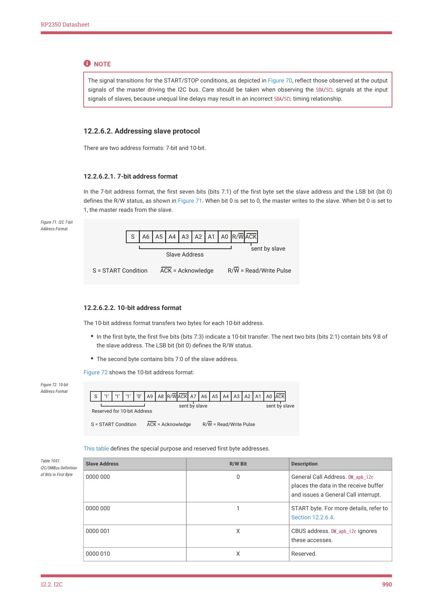

# 12.2.6. I2C protocols

12.2.6. I2C protocols

This section defines protocols used in the DW_apb_i2c.

12.2.6.1. START and STOP conditions

When the bus is idle, both the SCL and SDA signals are pulled high through external pull-up resistors on the bus. When the

master wants to start a transmission on the bus, the master issues a START condition: a high-to-low transition of the

SDA signal while SCL is 1. When the master wants to terminate the transmission, the master issues a STOP condition: a

low-to-high transition of the SDA signal while SCL is 1. Figure 70 shows the timing of the START and STOP conditions.

When data is being transmitted on the bus, the SDA signal must be stable when SCL is set to 1.

Figure 70. I2C START

and STOP Condition

SDA

SCL

S

P

Stop Condition
Change of Data Allowed
Start Condition

Data line Stable Data Valid
Change of Data 

Allowed

12.2. I2C
989

RP2350 Datasheet

NOTE

The signal transitions for the START/STOP conditions, as depicted in Figure 70, reflect those observed at the output

signals of the master driving the I2C bus. Care should be taken when observing the SDA/SCL signals at the input

signals of slaves, because unequal line delays may result in an incorrect SDA/SCL timing relationship.

12.2.6.2. Addressing slave protocol

There are two address formats: 7-bit and 10-bit.

12.2.6.2.1. 7-bit address format

In the 7-bit address format, the first seven bits (bits 7:1) of the first byte set the slave address and the LSB bit (bit 0)

defines the R/W status, as shown in Figure 71. When bit 0 is set to 0, the master writes to the slave. When bit 0 is set to

1, the master reads from the slave.

Figure 71. I2C 7-bit

Address Format

S
A6
A5
A4
A3
A2
A1
A0 R/W ACK

S = START Condition
ACK = Acknowledge
R/W = Read/Write Pulse

12.2.6.2.2. 10-bit address format

The 10-bit address format transfers two bytes for each 10-bit address.

• In the first byte, the first five bits (bits 7:3) indicate a 10-bit transfer. The next two bits (bits 2:1) contain bits 9:8 of

the slave address. The LSB bit (bit 0) defines the R/W status.
• The second byte contains bits 7:0 of the slave address.

Figure 72 shows the 10-bit address format:

Figure 72. 10-bit

Address Format

S
‘1’
‘1’
‘1’
‘0’
A9
A8
A7
A6
A5
A4
A3
A2
A1
A0
R/W ACK

This table defines the special purpose and reserved first byte addresses.

| Slave Address | R/W Bit | Description |
| --- | --- | --- |
| 0000 000 | 0 | General Call Address. DW apb i2c _ _ places the data in the receive buffer and issues a General Call interrupt. |
| 0000 000 | 1 | START byte. For more details, refer to Section 12.2.6.4. |
| 0000 001 | X | CBUS address. DW apb i2c ignores _ _ these accesses. |
| 0000 010 | X | Reserved. |
| 0000 011 | X | Reserved. |
| 0000 1XX | X | High-speed master code (for more information, refer to Section 12.2.8). |
| 1111 1XX | X | Reserved. |
| 1111 0XX | X | 10-bit slave addressing. |
| 0001 000 | X | SMbus Host. (not supported) |
| 0001 100 | X | SMBus Alert Response Address. (not supported) |
| 1100 001 | X | SMBus Device Default Address. (not supported) |

Table 1051.

I2C/SMBus Definition

of Bits in First Byte

12.2. I2C
990

RP2350 Datasheet

DW_apb_i2c does not restrict you from using reserved addresses. However, if you use these reserved addresses, you may

experience incompatibilities with I2C components.

12.2.6.3. Transmitting and receiving protocol

The master can initiate data transmission and reception to and from the bus, acting as either a master-transmitter or

master-receiver. A slave responds to requests from the master to either transmit data or receive data to/from the bus,

acting as either a slave-transmitter or slave-receiver, respectively.

12.2.6.3.1. Master-transmitter and slave-receiver

All data is transmitted in byte format, with no limit on the number of bytes transferred per data transfer. After the master

sends the address and R/W bit or the master transmits a byte of data to the slave, the slave-receiver must respond with

the acknowledge signal (ACK). When no slave-receiver responds with an ACK pulse, the master aborts the transfer by

issuing a STOP condition. The slave must leave the SDA line high so that the master can abort the transfer. If the master-

transmitter is transmitting data as shown in Figure 73, the slave-receiver responds to the master-transmitter with an

acknowledge pulse after every byte of data is received.

Figure 73. I2C Master-

Transmitter Protocol

A
A
DATA
A/A
P
DATA
Slave Address

A/A
P
DATA
S

12.2.6.3.2. Master-receiver and slave-transmitter

If the master is receiving data as shown in Figure 74 the master responds to the slave-transmitter with an acknowledge

pulse after receiving each byte of data, except for the last byte. This is the way the master-receiver notifies the slave-

transmitter that this is the last byte. The slave-transmitter relinquishes the SDA line after detecting No Acknowledge

(NACK) so that the master can issue a STOP condition.

12.2. I2C
991

RP2350 Datasheet

Figure 74. I2C Master-

Receiver Protocol

A
A
DATA
A
P
DATA
Slave Address

A
A
A
Sr
A
P
DATA
Slave Address

When a master does not want to relinquish the bus with a STOP condition, the master can issue a RESTART condition.

This is identical to a START condition except it occurs after the ACK pulse. Operating in master mode, the DW_apb_i2c can

then communicate with the same slave using a transfer of a different direction. For a description of the combined

format transactions that the DW_apb_i2c supports, see Section 12.2.5.2.

The DW_apb_i2c must be completely disabled before the target slave address register (IC_TAR) can be reprogrammed.

12.2.6.4. START BYTE Transfer Protocol

The START BYTE transfer protocol is designed for systems that do not have an on-board dedicated I2C hardware

module. When the DW_apb_i2c is addressed as a slave, it always samples the I2C bus at the highest speed supported so

that it never requires a START BYTE transfer. However, when DW_apb_i2c is a master, it supports the generation of START

BYTE transfers at the beginning of every transfer in case a slave device requires it.

This protocol consists of the transmission of seven zeros, followed by a one, as illustrated in Figure 75. This allows the

processor polling the bus to under-sample the address phase until zero is detected. Once the microcontroller detects a

zero, it switches from the under sampling rate to the correct rate of the master.

Figure 75. I2C Start

Byte Transfer

The START BYTE procedure is as follows:

1. Master generates a START condition.

2. Master transmits the START byte (0000 0001).

3. Master transmits the ACK clock pulse. (Present only to conform with the byte handling format used on the bus)

4. No slave sets the ACK signal to zero.

5. Master generates a RESTART (R) condition.

Hardware receivers do not respond to the START BYTE procedure because it uses a reserved address and resets after

the RESTART condition generates.

12.2. I2C
992
