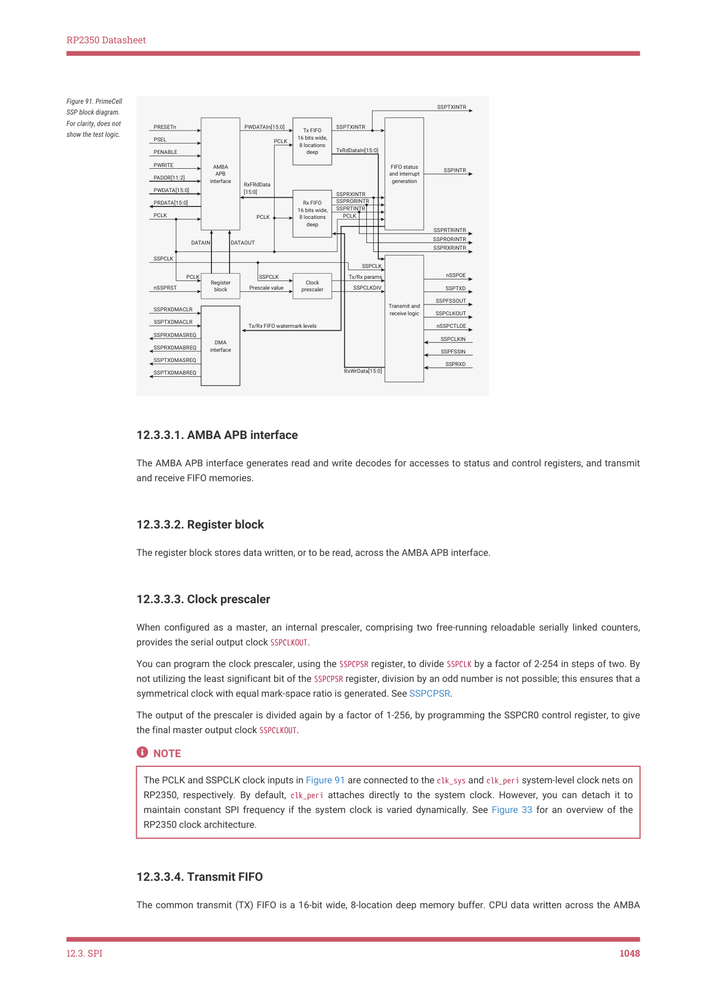

# 12.3.3. Functional description

12.3.3. Functional description

12.3. SPI
1047

RP2350 Datasheet

Figure 91. PrimeCell

SSP block diagram.

For clarity, does not

show the test logic.

The AMBA APB interface generates read and write decodes for accesses to status and control registers, and transmit

The register block stores data written, or to be read, across the AMBA APB interface.

When configured as a master, an internal prescaler, comprising two free-running reloadable serially linked counters,

provides the serial output clock SSPCLKOUT.

You can program the clock prescaler, using the SSPCPSR register, to divide SSPCLK by a factor of 2-254 in steps of two. By

not utilizing the least significant bit of the SSPCPSR register, division by an odd number is not possible; this ensures that a

symmetrical clock with equal mark-space ratio is generated. See SSPCPSR.

The output of the prescaler is divided again by a factor of 1-256, by programming the SSPCR0 control register, to give

the final master output clock SSPCLKOUT.

The PCLK and SSPCLK clock inputs in Figure 91 are connected to the clk_sys and clk_peri system-level clock nets on

RP2350, respectively. By default, clk_peri attaches directly to the system clock. However, you can detach it to

maintain constant SPI frequency if the system clock is varied dynamically. See Figure 33 for an overview of the

12.3.3.4. Transmit FIFO

The common transmit (TX) FIFO is a 16-bit wide, 8-location deep memory buffer. CPU data written across the AMBA

12.3. SPI
1048

RP2350 Datasheet

APB interface is stored in the buffer until read out by the transmit logic.

When configured as a master or a slave, parallel data is written into the transmit FIFO prior to serial conversion, and

transmission to the attached slave or master respectively, through the SSPTXD pin.

12.3.3.5. Receive FIFO

The common receive (RX) FIFO is a 16-bit wide, 8-location deep memory buffer. Received data from the serial interface

is stored in the buffer until read out by the CPU across the AMBA APB interface.

When configured as a master or slave, serial data received through the SSPRXD pin is registered prior to parallel loading

into the attached slave or master receive FIFO respectively.

12.3.3.6. Transmit and receive logic

When configured as a master, the clock for the attached slaves is derived from a divided-down version of SSPCLK through

the previously described prescaler operations. The master transmit logic successively reads a value from its transmit

FIFO and performs parallel to serial conversion on it. Then, the serial data stream and frame control signal,

synchronized to SSPCLKOUT, outputs through the SSPTXD pin to the attached slaves. The master receive logic performs

serial to parallel conversion on the incoming synchronous SSPRXD data stream, extracting and storing values into its

receive FIFO for subsequent reading through the APB interface.

When configured as a slave, the SSPCLKIN clock is provided by an attached master and used to time transmission and

reception sequences. The slave transmit logic, under control of the master clock, successively:

1. Reads a value from its transmit FIFO.

2. Performs parallel to serial conversion.

3. Outputs the serial data stream and frame control signal through the slave SSPTXD pin.

The slave receive logic performs serial to parallel conversion on the incoming SSPRXD data stream, extracting and storing

values into its receive FIFO, for subsequent reading through the APB interface.

12.3.3.7. Interrupt generation logic

The PrimeCell SSP generates four individual maskable, active-HIGH interrupts. A combined interrupt output is generated

as an OR function of the individual interrupt requests.

The transmit and receive dynamic data-flow interrupts, SSPTXINTR and SSPRXINTR, are separated from the status interrupts

so that data can be read or written in response to the FIFO trigger levels.

12.3.3.8. DMA interface

The PrimeCell SSP provides an interface to connect to a DMA controller, see Section 12.3.4.16.

12.3.3.9. Synchronizing registers and logic

The PrimeCell SSP supports both asynchronous and synchronous operation of the clocks, PCLK and SSPCLK.

Synchronization registers and handshaking logic have been implemented, and are active at all times. Synchronization of

control signals is performed on both directions of data flow, that is:

• from the PCLK to the SSPCLK domain
• from the SSPCLK to the PCLK domain.

12.3. SPI
1049
