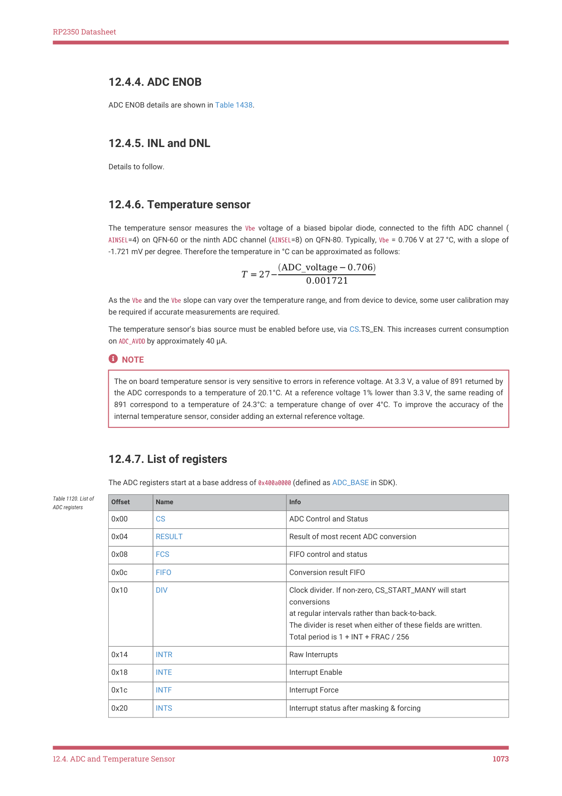

# 12.4.6. Temperature sensor

12.4.6. Temperature sensor

The temperature sensor measures the Vbe voltage of a biased bipolar diode, connected to the fifth ADC channel (

AINSEL=4) on QFN-60 or the ninth ADC channel (AINSEL=8) on QFN-80. Typically, Vbe = 0.706 V at 27 °C, with a slope of

-1.721 mV per degree. Therefore the temperature in °C can be approximated as follows:

As the Vbe and the Vbe slope can vary over the temperature range, and from device to device, some user calibration may

be required if accurate measurements are required.

The temperature sensor’s bias source must be enabled before use, via CS.TS_EN. This increases current consumption

on ADC_AVDD by approximately 40 μA.

NOTE

The on board temperature sensor is very sensitive to errors in reference voltage. At 3.3 V, a value of 891 returned by

the ADC corresponds to a temperature of 20.1°C. At a reference voltage 1% lower than 3.3 V, the same reading of

891 correspond to a temperature of 24.3°C: a temperature change of over 4°C. To improve the accuracy of the

internal temperature sensor, consider adding an external reference voltage.

## Embedded Images

