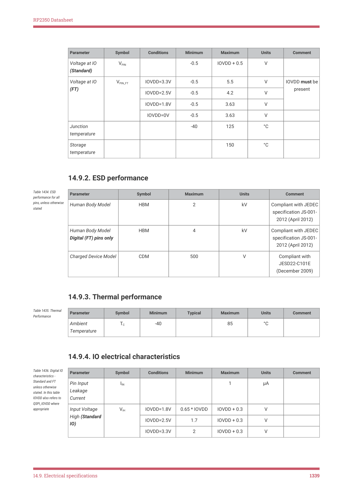

# 14.9.1. Absolute maximum ratings

14.9.1. Absolute maximum ratings

Stresses beyond the absolute maximum ratings listed in the following table can cause permanent damage to the

device. These are stress ratings only and do not refer to the functional operation of the device.

| Parameter | Symbol | Conditions | Minimum | Maximum | Units | Comment |
| --- | --- | --- | --- | --- | --- | --- |
| Core Supply (DVDD) Voltage | DVDD |  | -0.5 | 1.21 | V |  |
| I/O Supply (IOVDD) & QSPI Supply (QSPI_IOVDD) Voltage | IOVDD |  | -0.5 | 3.63 | V |  |

Table 1433. Absolute

14.9. Electrical specifications
1338

RP2350 Datasheet

Parameter
Symbol
Conditions
Minimum
Maximum
Units
Comment

VPIN
-0.5
IOVDD + 0.5
V

VPIN_FT
IOVDD=3.3V
-0.5
5.5
V
IOVDD must be

present
IOVDD=2.5V
-0.5
4.2
V

IOVDD=1.8V
-0.5
3.63
V

IOVDD=0V
-0.5
3.63
V
