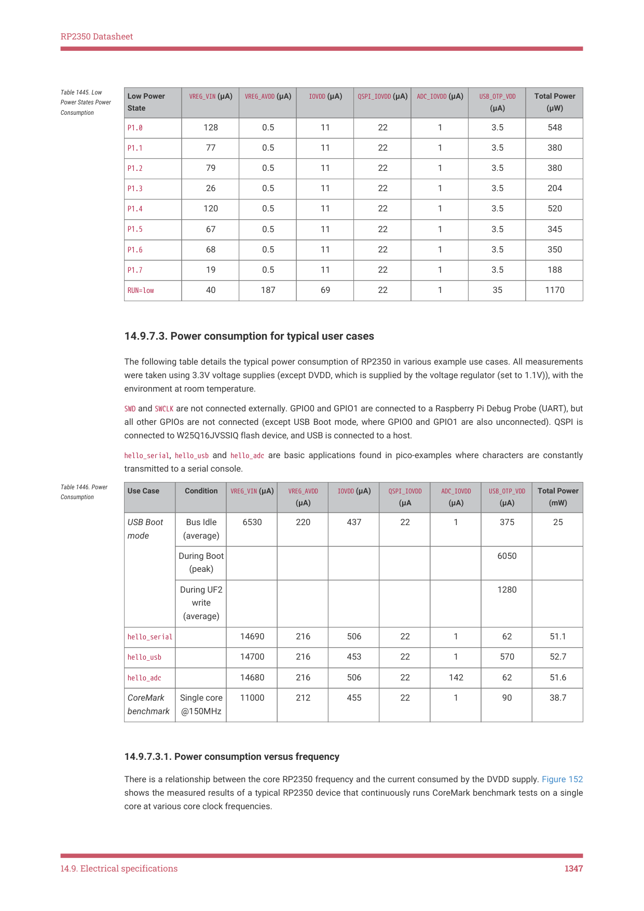

# 14.9.7. Power consumption

14.9.7. Power consumption

14.9. Electrical specifications
1345

RP2350 Datasheet

14.9.7.1. Peripheral power consumption

Baseline readings are taken with only clock sources and essential peripherals (BUSCTRL, BUSFAB, VREG, Resets, ROM,

SRAMs) active in the WAKE_EN0/WAKE_EN1 registers. Clocks are set to default clock settings.

Each peripheral is activated in turn by enabling all clock sources for the peripheral in the WAKE_EN0/WAKE_EN1 registers.

Current consumption is the increase in current when the peripheral clocks are enabled.

| Peripheral | Typical DVDD Current Consumption (μA/MHz) |
| --- | --- |
| DMA | 2.6 |
| I2C0 | 3 |
| I2C1 | 3.6 |
| IO + Pads | 24.5 |
| PWM | 9.9 |
| SIO | 2 |
| SHA256 | 0.1 |
| SPI0 | 1.7 |
| SPI1 | 1.4 |
| Timer 0 | 0.8 |
| Timer 1 | 0.6 |
| TRNG | 0.8 |
| UART0 | 2.6 |
| UART1 | 3.6 |
| Watchdog | 1.1 |
| XIP | 37.6 |

Table 1443. Baseline

Because of fixed reference clocks of 48MHz, as well as the variable system clock input, ADC and USBCTRL power

consumption does not vary linearly with system clock (as it does for other peripherals which only have system and/or

peripheral clock inputs). The following table shows absolute DVDD current consumption of the ADC and USBCTRL

blocks at standard clocks settings:

| Peripheral | Typical DVDD Current Consumption (mA) |
| --- | --- |
| ADC | 0.14 |
| USBCTRL | 1.25 |

Table 1444. Baseline

power consumption

for ADC and USBCTRL

14.9.7.2. Power consumption in Low Power states

Table 1445 shows the typical power consumption in low power states P1.0 → P1.7. All voltage supplies are 3.3V (except

DVDD which is supplied by the voltage regulator (in low power mode)), with the environment at room temperature.

All GPIOs, SWDIO and SWCLK are pulled down internally, and not connected externally. QSPI is connected to

W25Q16JVSSIQ flash device. USB PHY has been powered down, and the DP and DM pull-downs were enabled prior to

entering the low power state. The USB cable remains connected to a host computer. The table also shows the power

consumed when RUN is held low. This is not technically a low power state (the voltage regulator is in normal switching

mode), but it is included for completeness.

14.9. Electrical specifications
1346

RP2350 Datasheet

| Low Power State | VREG VIN (μA) _ | VREG AVDD (μA) _ | IOVDD (μA) | QSPI IOVDD (μA) _ | ADC IOVDD (μA) _ | USB OTP VDD _ _ (μA) | Total Power (μW) |
| --- | --- | --- | --- | --- | --- | --- | --- |
| P1.0 | 128 | 0.5 | 11 | 22 | 1 | 3.5 | 548 |
| P1.1 | 77 | 0.5 | 11 | 22 | 1 | 3.5 | 380 |
| P1.2 | 79 | 0.5 | 11 | 22 | 1 | 3.5 | 380 |
| P1.3 | 26 | 0.5 | 11 | 22 | 1 | 3.5 | 204 |
| P1.4 | 120 | 0.5 | 11 | 22 | 1 | 3.5 | 520 |
| P1.5 | 67 | 0.5 | 11 | 22 | 1 | 3.5 | 345 |
| P1.6 | 68 | 0.5 | 11 | 22 | 1 | 3.5 | 350 |
| P1.7 | 19 | 0.5 | 11 | 22 | 1 | 3.5 | 188 |
| RUN=low | 40 | 187 | 69 | 22 | 1 | 35 | 1170 |

Table 1445. Low

Power States Power

Consumption

14.9.7.3. Power consumption for typical user cases

The following table details the typical power consumption of RP2350 in various example use cases. All measurements

were taken using 3.3V voltage supplies (except DVDD, which is supplied by the voltage regulator (set to 1.1V)), with the

environment at room temperature.

SWD and SWCLK are not connected externally. GPIO0 and GPIO1 are connected to a Raspberry Pi Debug Probe (UART), but

all other GPIOs are not connected (except USB Boot mode, where GPIO0 and GPIO1 are also unconnected). QSPI is

connected to W25Q16JVSSIQ flash device, and USB is connected to a host.

hello_serial, hello_usb and hello_adc are basic applications found in pico-examples where characters are constantly

transmitted to a serial console.

Table 1446. Power

Consumption
Use Case
Condition
VREG_VIN (μA)
VREG_AVDD

6530
220
437
22
1
375
25

hello_serial
14690
216
506
22
1
62
51.1

hello_usb
14700
216
453
22
1
570
52.7

hello_adc
14680
216
506
22
142
62
51.6

11000
212
455
22
1
90
38.7

14.9.7.3.1. Power consumption versus frequency

There is a relationship between the core RP2350 frequency and the current consumed by the DVDD supply. Figure 152

shows the measured results of a typical RP2350 device that continuously runs CoreMark benchmark tests on a single

core at various core clock frequencies.

14.9. Electrical specifications
1347

RP2350 Datasheet

Figure 152. DVDD

Current vs Core

Frequency of a typical

RP2350 device, whilst

running CoreMark

benchmark

14.9. Electrical specifications
1348

RP2350 Datasheet

Appendix A: Register field types

## Embedded Images

