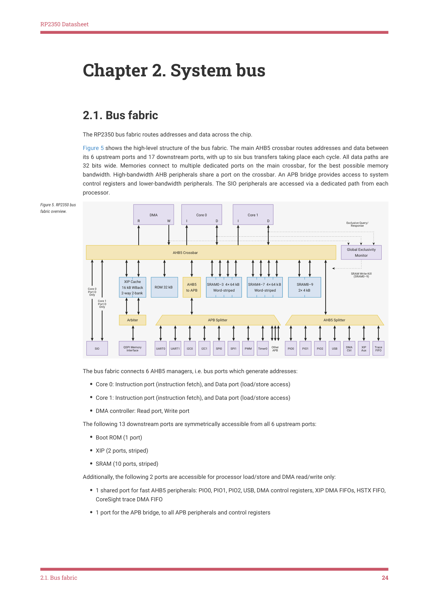

# 2.1. Bus fabric

2.1. Bus fabric

The RP2350 bus fabric routes addresses and data across the chip.

Figure 5 shows the high-level structure of the bus fabric. The main AHB5 crossbar routes addresses and data between

its 6 upstream ports and 17 downstream ports, with up to six bus transfers taking place each cycle. All data paths are

32 bits wide. Memories connect to multiple dedicated ports on the main crossbar, for the best possible memory

bandwidth. High-bandwidth AHB peripherals share a port on the crossbar. An APB bridge provides access to system

control registers and lower-bandwidth peripherals. The SIO peripherals are accessed via a dedicated path from each

processor.

Figure 5. RP2350 bus

fabric overview.

APB Splitter
Arbiter
AHB5 Splitter

FIFO
XIP 
Aux
Other 

SIO
UART0
UART1
I2C0
I2C1
SPI0
SPI1
PWM
PIO0
PIO1
PIO2
USB
Timer0
QSPI Memory 

The bus fabric connects 6 AHB5 managers, i.e. bus ports which generate addresses:

• Core 0: Instruction port (instruction fetch), and Data port (load/store access)
• Core 1: Instruction port (instruction fetch), and Data port (load/store access)
• DMA controller: Read port, Write port

The following 13 downstream ports are symmetrically accessible from all 6 upstream ports:

• Boot ROM (1 port)
• XIP (2 ports, striped)
• SRAM (10 ports, striped)

Additionally, the following 2 ports are accessible for processor load/store and DMA read/write only:

• 1 shared port for fast AHB5 peripherals: PIO0, PIO1, PIO2, USB, DMA control registers, XIP DMA FIFOs, HSTX FIFO,

CoreSight trace DMA FIFO
• 1 port for the APB bridge, to all APB peripherals and control registers

2.1. Bus fabric
24

RP2350 Datasheet

NOTE

Instruction fetch from peripherals is physically disconnected, to avoid this IDAU-Exempt region ever becoming both

Non-secure-writable and Secure-executable. This includes USB RAM, OTP and boot RAM. See Section 10.2.2.

The SIO block, which was connected to the Cortex-M0+ IOPORT on RP2040, provides two AHB ports, each dedicated to

load/store access from one core.

The six managers can access any six different crossbar ports simultaneously. So, at a system clock of 150 MHz, the

maximum sustained bus bandwidth is 3.6 GB/s.
