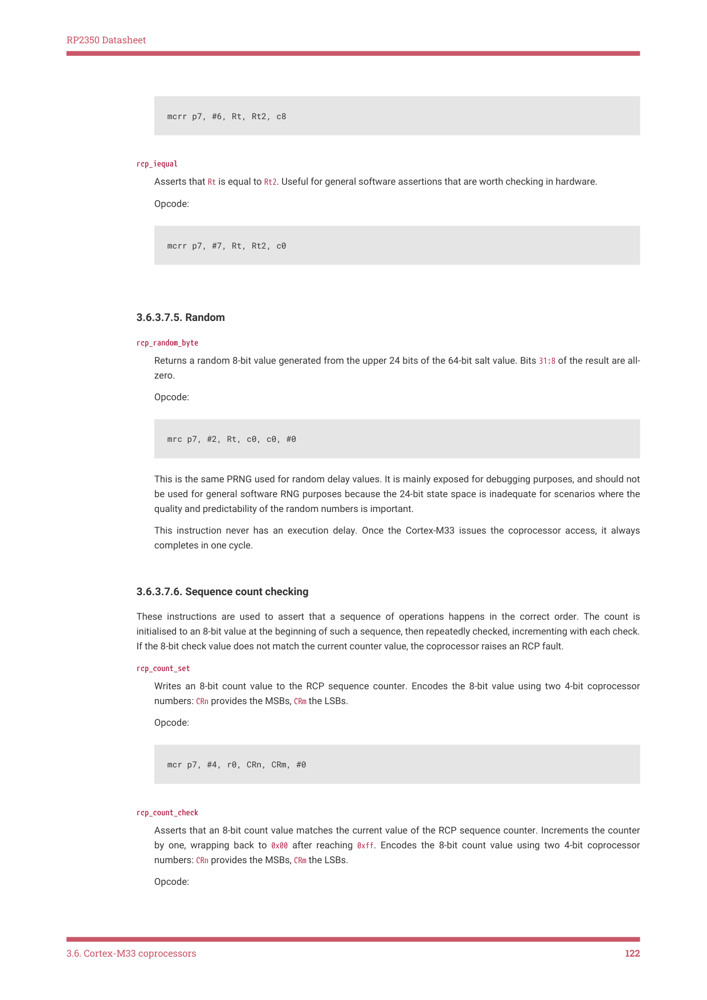

# 3.6.3. Redundancy coprocessor (RCP)

3.6.3. Redundancy coprocessor (RCP)

3.6. Cortex-M33 coprocessors
112

RP2350 Datasheet

Figure 13. The

redundancy

Opcode Phase
Data Phase

coprocessor

implements hardware-

CPOPC
CPRDATA[31:0]
CPWDATA[63:0]

checked assertions, to

aid control flow and

data flow integrity

checking. Its two-

phase pipeline is

closely coupled to the

Cortex-M33 pipeline. A

64-bit salt register

holds a once-per-boot

random number, which

Tag
Canary 
Generation
Comparison

is used to generate

and validate stack

canary values and

generate

pseudorandom delay

sequences on RCP

instructions. Other

comparison functions

provide more general

hardware-checked

assertion support.

The redundancy coprocessor (RCP) is used in the RP2350 bootrom to provide hardware-assisted mitigation against

fault injection and return-oriented programming attacks. This includes the following instructions:

• generate and validate stack canary values based on a per-boot random seed
• assert that certain points in the program are executed in the correct order without missing steps
• validate booleans stored as one of two valid bit patterns in a 32-bit word
• validate 32-bit integers stored redundantly in two words with an XOR parity mask
• halt the processor upon reaching a software-detected panic condition

Section 3.6.3.7 lists the RCP instruction set in full. RCP instruction encodings contain a parity bit; executing an invalid

instruction or an instruction with bad parity triggers an RCP fault.

Each Cortex-M33 processor is equipped with a single RCP instance, mapped as coprocessor number 7 in the

coprocessor opcode space. The two RCP instances are linked: an RCP fault on one core immediately triggers a fault on

the other. RCP faults have two steps:

1. The non-maskable interrupt (NMI) is asserted. It remains asserted until a warm reset of the processor.

2. Any further RCP instructions stall the coprocessor port until a warm reset of the processor. This stall cannot be

interrupted, as the processor is already in the NMI state.

The RP2350 bootrom implements the NMI and HardFault vectors with an rcp_panic instruction. This instruction

unconditionally stalls the coprocessor port. This prevents the processor from retiring any more instructions until either

a debugger connects to reset the processors, or the processors reset through some other mechanism (such as the

system watchdog timer). The processor quickly reaches a quiescent state that reduces vulnerability to further fault

injection (deliberate or otherwise).

Each core’s RCP has a 64-bit seed value (Section 3.6.3.1). The RCP uses this value to generate stack canary values and

to add short pseudorandom delays to RCP instructions. Both RCP instances are seeded by core 0 during the early boot

path in the bootrom using the system true-random number generator (Section 12.12). Running any RCP instruction

before providing a salt value triggers an RCP fault. The use of random data in stack canary values makes it difficult to

reuse return-oriented-programming stack payloads across multiple boots.

Figure 13 gives a dataflow-level overview of the RCP hardware. The RCP is structured as a two-phase pipeline which

overlays the Cortex-M33 execution pipeline. It exchanges data with the core via a 64-bit incoming bus (CPWDATA) and

a 32-bit outgoing bus (CPRDATA). The Cortex-M33 can issue two register reads to the coprocessor in one cycle through

the CPWDATA bus. The RCP leverages this throughput for some of its assertion instructions, such as rcp_iequal, which

raises a fault when two Arm registers do not contain the same 32-bit value.

3.6. Cortex-M33 coprocessors
113

RP2350 Datasheet

The 8-bit tag value in Figure 13 is an 8-bit instruction immediate value encoded by the instruction CRn and CRm fields.

These 8-bit values are used to uniquely identify functions for canary value generation so that stack frames are not

interchangeable between functions. They also provide 8-bit counter values for rcp_count_set and rcp_count_check

instructions. Encoding the tags using the CRn and CRm fields makes RCP instruction sequences more compact, as it

obviates additional instructions to materialise these small constants in registers and pass them through CPWDATA.

This also makes the tag values less vulnerable to glitching, because the instruction opcode fields are available earlier in

the cycle than the register values passed on CPWDATA.

RCP instructions may also execute in the Non-secure state, with certain differences to prevent Non-secure code from

triggering RCP faults or observing the value of the salt register. This supports Non-secure software executing shared

ROM routines which contain RCP instructions, but does not allow probing of the RCP’s internal state from a Non-secure

context. Section 3.6.3.2 gives further details and rationale for Non-secure execution support.

Certain details are elided from Figure 13 for clarity, such as the delay counter used for pseudorandom instruction

delays, and the logic for suppressing faults under Non-secure execution. This behaviour is described in full in the

following sections.

3.6.3.1. Salt register

Each RCP instance is provisioned with a 64-bit salt register, which provides a seed for stack canary values and random

instruction delays. This is expected to be initialised with a random value early in the boot process: the RP2350 bootrom

uses the true random number generator to generate the salt values.

Initially the salt register is in the invalid state. This state only allows the following operations:

• Checking the valid state of the salt register, via rcp_canary_status
• Writing a salt via rcp_salt_core0 or rcp_salt_core1, which writes a 64-bit value to that core’s salt register, and

changes its state to valid

When the salt register is in the invalid state, executing any RCP instruction other than those listed above unconditionally

triggers an RCP fault. This makes it difficult to skip RCP initialisation via fault injection, because the RP2350 bootrom

contains a high density of RCP instructions.

Similarly, attempting to write to an already-valid RCP salt register triggers an RCP fault. There is no reason to initialise

the RCP salt register twice, so this case is detected as an anomaly that indicates loss of control flow integrity.

Core 0’s coprocessor port writes the salt registers for both cores' RCP instances to simplify multicore interactions

during early boot. In the RP2350 bootrom, core 1’s first steps lock down its MPU execute permissions to a small region

of the ROM containing its wait-for-launch code, and then poll for its RCP salt to become valid once core 0 has cleared

boot memory, performed some minimal hardware setup, and generated the RCP salts.

When core 0 is switched to RISC-V architecture and core 1 is Arm, the core 1 salt register is forcibly marked as valid to

permit core 1 to execute the ROM. This has no impact on secure boot because RISC-V cores are only enabled when

secure boot is disabled; the ability to set core 0 to RISC-V already implies subversion of secure boot.

3.6.3.2. Access from Non-secure

Setting bit 7 of the Cortex-M33 NSACR register permits Non-secure code to set bit 7 of CPACR_NS, which in turn enables Non-

secure access to the RCP. Non-secure RCP access is useful for executing shared Secure/Non-secure routines which

contain RCP instructions. For example, the memcpy implementation in the RP2350 bootrom is shared by Secure code in

the main boot path, and Non-secure code such as the USB bootloader.

Since an RCP fault is fatal for all software running on the system, Non-secure must not be able to trigger RCP faults at

will. Similarly, if Non-secure code were able to read out the RCP salt register, it would make it easier to engineer stack

payloads which can control Secure execution without triggering RCP faults. Therefore the RCP handles Non-secure

accesses differently from Secure:

• Masks read data to all-zeroes

3.6. Cortex-M33 coprocessors
114

RP2350 Datasheet

• Ignores write data: any instruction which would generate a data-dependent RCP fault becomes a no-op
• Reports coprocessor errors instead of RCP faults for invalid instructions, which the processor maps to the Non-

secure UNDEFINSTR UsageFault
• Skips the pseudorandom instruction delay: all RCP instructions execute in one cycle, assuming the Cortex-M33 is

able to issue them at one instruction per cycle

The lack of pseudorandom instruction delays makes it more difficult for Non-secure code to extract the seed value used

to add delays to Secure execution of RCP instructions.

3.6.3.3. Instruction validation

The RCP applies the following rules to all coprocessor instructions which target coprocessor 7:

• The number of 1 bits in the Opc1 field, plus the instruction parity bit, must be an even number.

◦For mcr, mrc and cdp instructions, bit 0 of the Opc2 field encodes the parity bit.

◦For mcrr, bit 3 of the CRm field encodes the parity bit.
• The instruction must not be an mrrc (64-bit coprocessor-to-core)
• For mcr instructions (32-bit core-to-coprocessor):

◦The Opc1 field must be in the range 0 through 6.

◦If there is no 8-bit tag (i.e. any other than rcp_canary_check, rcp_count_check, rcp_count_set), the CRn and CRm

opcode fields must be all-zeroes.
• For mrc instructions (32-bit coprocessor-to-core):

◦The Opc1 field must be in the range 0 through 2.

◦For instructions other than rcp_canary_get and rcp_canary_check, the CRn and CRm opcode fields must be all-

zeroes.
• For mcrr instructions (64-bit core-to-coprocessor):

◦The Opc1 field must be in the range 0 through 8.

◦For rcp_salt_core* instructions, bits 2:0 of the CRm field must be 0 or 1 (referred to as rcp_salt_core0 and

rcp_salt_core1 respectively).

◦For all other mcrr instructions, bits 2:0 of the CRm field must be 0.

The terms Opc1, Opc2, CRm and CRn in the description above refer to standard encoding fields in the Arm T32 instruction

encoding for coprocessor instructions. See the Armv8-M Architecture Reference Manual for full details of the encoding

and assembler syntax.

Any coprocessor instruction targeting coprocessor 7 that fails these validation rules will result in one of two outcomes,

depending on the security domain in which the instruction is executed:

• Secure execution of an invalid instruction is an immediate, unconditional RCP fault. The RCP asserts the core’s

non-maskable interrupt signal, and any further RCP instructions stall the coprocessor port indefinitely. This

continues until the core receives a warm reset. This also triggers RCP faults on other cores: for more information,

see Section 3.6.3.4.
• Non-secure execution of an invalid instruction returns an error on the opcode-phase coprocessor interface, which

is interpreted as a Non-secure UNDEFINSTR UsageFault by the core. For a full description of this Armv8-M-specific

fault, see the Armv8-M Architecture Reference Manual.

3.6.3.4. Cross-core triggering

An RCP fault indicates that the integrity of the software environment is compromised. Though the fault may originate on

3.6. Cortex-M33 coprocessors
115

RP2350 Datasheet

a single processor, all processors which share the same trusted memory may behave unpredictably if they continue to

execute, since:

• The physical condition which caused one processor to misexecute in a detectable way, such as low supply voltage,

may cause other processors to misexecute in a manner which was not detected.
• The processor which triggered an RCP fault may already have corrupted shared, trusted memory contents in a way

that interferes with the other processor’s operation, (e.g. corrupting the other core’s stack).

Therefore, an RCP fault on one core also triggers an RCP fault on other cores. Because RP2350 has two cores, an RCP

fault on core 0 always triggers a fault on core 1, and an RCP fault on core 1 always triggers a fault on core 0.

Figure 14. Triggering

an RCP fault on one

core also triggers a

fault on the other

core. Triggers

accumulate into a

fault register, which

remains set until the

core resets. The NMI

asserts when the fault

register is set.

Each core locally ORs in the trigger signal from the other core. The outputs of the two OR gates on the left are logically

equivalent, but the gates are kept local to the core to minimise delay routing the core’s own fault trigger to its own fault

register.

3.6.3.5. Stack canary values

Canaries are values written to the stack on function entry and validated on function exit, to assure that:

• The exit matches the entry (i.e. when leaving through the back door, you entered through the front door)
• The stack was not completely overwritten in the course of executing the function

This helps to mitigate two classes of attack:

• Fault injection: any physical fault condition which corrupts the program counter or causes a wild indirect branch is

likely to cause the processor to execute a function epilogue which does not match the prologue. Any branch into

the middle of a function is likely to eventually reach the epilogue.
• Return-oriented programming: deliberate stack corruption can redirect control flow through a sequence of function

tails which perform arbitrary operations. The stack may be corrupted by exploiting missing bounds checks on

stack buffer operations. Random canary values make it difficult to craft such a stack payload.

Return-oriented programming mitigation is particularly important to account for in the bootrom because the bootrom

exposes an API surface that is mapped at a known location at runtime (it is physically always mapped at 0x00000000).

This provides a well-known exploit surface similar to the C standard library.

The RCP supports canary values with two canary-specific instructions:

• rcp_canary_get generates a 32-bit value for an 8-bit tag as a function of the salt register
• rcp_canary_check validates a 32-bit value for an 8-bit tag and raises an RCP fault if the value does not match that

produced by an rcp_canary_get for the same tag.

The 32-bit canary value is as follows:

• Bits 7:0: all-zero
• Bits 15:8: XOR of bits 7:0 of the salt with (AND of bits 31:24 of the salt with the 8-bit tag)

3.6. Cortex-M33 coprocessors
116

RP2350 Datasheet

• Bits 23:16: XOR of bits 15:8 of the salt with (AND of bits 39:32 of the salt with the bitwise NOT of the 8-bit tag)
• Bits 31:24: XOR of bits 23:16 of the salt with the 8-bit tag

The following code demonstrates how you might calculate the 32-bit canary value in C:

uint32_t canary_value(uint64_t salt, uint8_t tag) {

    uint32_t tag_expanded =

        (uint32_t)tag |

        ((uint32_t)~tag << 8)

        ((uint32_t)tag << 16);

    tag_expanded &= (0xff0000u | ((salt >> 24) & 0x00ffffu));

    uint32_t result24 = tag_expanded ^ salt;

    return result24 << 8;

}

This canary value is chosen such that:

• Different tags are guaranteed to yield different canary values
• For any two different tags, each is a function of at least one salt bit that the other is not a function of (so it is

difficult to calculate canaries for different tags even if one value is known)
• Null-terminated string operations on the stack terminate before reading or writing a canary

Each function should use a different canary tag, to prevent a stack frame for one function being used to return through

another function’s epilogue. Avoid using canary values for purposes other than stack canaries.

The RP2350 bootrom uses 8-bit tags in the range 0x40 through 0xbf. The remaining tags are free for use in user code.

3.6.3.6. Pseudorandom instruction delays

By default, all RCP instructions execute with a pseudorandom delay in the range of 0 to 127 cycles. These delays make

it more difficult for an outside observer to precisely time a fault injection event with respect to an RCP instruction, or the

critical code path it protects.

NOTE

In certain usage situations, RCP delays can expose a side-channel where processor state can be inferred. See

RP2350-E26 for details.

Setting bit 12 of the first halfword of an instruction disables the pseudorandom delay for that instruction only. The

instruction executes in a single cycle, assuming the Cortex-M33 does not insert stall cycles due to other micro-

architectural constraints. To set this bit, assemble the *2 variant of any given coprocessor instruction ( e.g. mrc2 rather

than mrc). In the NonSecure state, RCP instructions always execute without delay.

The RCP implements instruction execution delays by stalling the coprocessor opcode interface during the opcode

phase (shown in the Figure 13 pipeline diagram). The Cortex-M33 may choose to abandon a stalled coprocessor

instruction due to an interrupt. When this happens, the delay counter continues counting down, waiting for the delay

period to elapse. If the Cortex-M33 issues another RCP instruction whilst the delay counter is still running (either in the

interrupt, or after returning to the interrupted RCP instruction), this instruction executes once the existing countdown

completes. However, if the delay counter of an abandoned instruction has already expired before the next RCP

instruction executes, the next instruction samples a pseudorandom delay count, and begins a new countdown.

The pseudorandom delay sequence is a function of bits 63:40 of the salt value. As such, the pattern of delays is unique

per-boot, provided each boot writes a different 64-bit value to the salt register.

The pseudorandom number generator (PRNG) used for delays implements a number of small linear feedback shift

registers (LFSRs) in bits 63:40 of the salt register, and returns a nonlinear function of the 24-bit state. The LFSR feedback

functions on the 24-bit state are:

3.6. Cortex-M33 coprocessors
117

RP2350 Datasheet

• Bits 23:20: 4-bit LFSR with taps 0xc
• Bits 19:15: 5-bit LFSR with taps 0x14
• Bits 14:8: 7-bit LFSR with taps 0x60
• Bits 7:0: 8-bit LFSR with taps 0xb4

The LFSRs are implemented by shifting the XOR reduction of (state AND taps) into the LSB with each state update.

When an LFSR’s state is all-zeroes, a one bit is shifted into the LSB. The LFSR state advances each time a random

number is generated: this happens when executing an instruction with a pseudorandom delay, or when executing a

rcp_random_byte instruction.

Each bit of the pseudorandom output is the XOR of six bits of the 24-bit state, XORed with the majority-3 vote of three

other bits of the state:

| Output Bit | XOR Taps |  |  |  |  |  | Majority-3 Ta | ps |  |
| --- | --- | --- | --- | --- | --- | --- | --- | --- | --- |
| 7 | 7 | 17 | 6 | 16 | 13 | 8 | 9 | 12 | 21 |
| 6 | 14 | 21 | 19 | 6 | 16 | 13 | 4 | 14 | 6 |
| 5 | 7 | 5 | 2 | 18 | 11 | 1 | 18 | 14 | 7 |
| 4 | 4 | 19 | 17 | 0 | 18 | 7 | 18 | 11 | 3 |
| 3 | 23 | 12 | 7 | 16 | 14 | 5 | 17 | 3 | 15 |
| 2 | 15 | 13 | 20 | 21 | 8 | 12 | 7 | 22 | 9 |
| 1 | 4 | 16 | 11 | 18 | 9 | 6 | 14 | 21 | 16 |
| 0 | 11 | 3 | 4 | 19 | 10 | 14 | 1 | 2 | 9 |

Bits 6:0 of this function are used for pseudorandom instruction delays, producing delays in the range of 0 to 127 cycles.

The delay is applied in addition to the one-cycle base cost of executing a coprocessor instruction. The full 8-bit result is

available through the rcp_random_byte instruction.

This is a simple pseudorandom number generator which makes it difficult to recover the initial 24-bit state from a small

number of observations. It accomplishes this by making the observation size much smaller than the state size and

using a non-linear combination function for the output. It has a number of statistical aberrations which make it

unsuitable for general random number generation (not to mention its small state size). For high-quality random number

generation, either use the system true-random number generator (TRNG) directly, or use a high-quality software PRNG

with a large state seeded from the TRNG.

Note that the 24 MSBs of the salt value used to seed the delay PRNG do not overlap with the 40 LSBs used to generate

stack canary values. Therefore measuring the random delays externally provides no information on the canary values.

3.6.3.7. Instruction listing

The Cortex-M33 processors access the RCP using mcr, mcrr, mrc, and cdp instructions. The Armv8-M Architecture

Reference Manual describes the intricacies of these instructions in relation to the processor’s architectural state, but

from the coprocessor’s point of view:

• mcr writes a 32-bit value to the coprocessor from a single Arm integer register
• mcrr writes a 64-bit value to the coprocessor from a pair of Arm integer registers
• mrc reads a 32-bit value from the coprocessor, writing to either a single Arm integer register or to the processor

status flags
• cdp performs some internal coprocessor operation without exchanging data with the processor

For each mcr, mcrr, mrc and cdp instruction, the RCP also accepts the matching mcr2, mcrr2, mrc2, and cdp2 opcode variant.

These opcodes differ only in bit 12. The plain versions have a pseudorandom delay of up to 127 cycles on their

3.6. Cortex-M33 coprocessors
118

RP2350 Datasheet

execution, whereas the 2-suffixed versions have no such delay.

Most RCP instructions are in the form of hardware-checked assertions. The phrase "asserts that" in the following

instruction listings means that, if some asserted condition is not true, the coprocessor raises an RCP fault.

3.6.3.7.1. Initialisation

rcp_salt_core0

Asserts that the core 0 salt register is currently invalid. Writes a 64-bit value, and marks it as valid.

Opcode:

Rt is the 32 LSBs of the salt, Rt2 is the 32 MSBs.

Asserts that the core 1 salt register is currently invalid. Writes a 64-bit value, and marks it as valid.

Returns a true or false bit pattern (0xa500a500 or 0x00c300c3 respectively) that indicates whether the salt register for

this core has been initialised.

Invoking with Rt = 0xf sets the Arm N and C flags if and only if the salt register is valid.

If the salt has not been initialised, any operation other than initialising the salt or checking the canary status triggers

This opcode is used on core 0 to skip the RCP initialisation sequence if the bootrom has been re-entered without a

reset under debugger control, and on core 1 to wait for its RCP salt to be initialised.

Gets a 32-bit canary value as a function of the salt register and the 8-bit tag encoded by two 4-bit coprocessor

register numbers CRn and CRm. CRn contains the four MSBs, CRm the four LSBs.

Section 3.6.3.5 specifies the 32-bit value returned by this instruction, but you should treat this as an opaque value to

be consumed by rcp_canary_check.

3.6. Cortex-M33 coprocessors
119

RP2350 Datasheet

rcp_canary_check

Asserts that a value matches the result of an rcp_canary_get with the same 8-bit tag. The tag is encoded by two 4-bit

coprocessor register numbers, CRn and CRm. CRn contains the four MSBs, CRm the four LSBs.

Opcode:

The RCP defines 0xa500a500 as the true value for 32-bit booleans, and 0x00c300c3 as the false value. All other bit patterns

are poison, and trigger an RCP fault when consumed by any RCP boolean instructions. These values are chosen as they

are valid immediates in Armv8-M Main.

This provides limited runtime type checking to ensure that boolean values are used in boolean contexts. The RP2350

bootrom occasionally uses redundant operations to generate booleans in a way that results in an invalid bit pattern if

the two redundant operations do not return the same value, such as when checking boot flags in OTP.

Asserts that Rt is a valid boolean (0xa500a500 or 0x00c300c3).

Asserts that Rt is true (0xa500a500).

Asserts that Rt is false (0x00c300c3).

Asserts that Rt and Rt2 are both valid booleans.

3.6. Cortex-M33 coprocessors
120

RP2350 Datasheet

rcp_b2and

Asserts that Rt and Rt2 are both true.

Opcode:

rcp_b2or

Asserts that both Rt and Rt2 are valid, and at least one is true.

Asserts that Rt XOR Rt2 is a valid boolean. The XOR mask is generally a fixed bit pattern used to validate the origin

of the boolean, such as a return value from a critical function.

Asserts that Rt XOR Rt2 is true.

Asserts that Rt XOR Rt2 is false.

3.6.3.7.4. Integer Validation

rcp_ivalid

Asserts that Rt XOR Rt2 is equal to 0x96009600. This is used to validate 32-bit integers stored redundantly in two

memory words. The XOR difference provides assurance that two parallel chains of integer operations have not

mixed.

Opcode:

3.6. Cortex-M33 coprocessors
121

RP2350 Datasheet

Asserts that Rt is equal to Rt2. Useful for general software assertions that are worth checking in hardware.

Returns a random 8-bit value generated from the upper 24 bits of the 64-bit salt value. Bits 31:8 of the result are all-

This is the same PRNG used for random delay values. It is mainly exposed for debugging purposes, and should not

be used for general software RNG purposes because the 24-bit state space is inadequate for scenarios where the

quality and predictability of the random numbers is important.

This instruction never has an execution delay. Once the Cortex-M33 issues the coprocessor access, it always

3.6.3.7.6. Sequence count checking

These instructions are used to assert that a sequence of operations happens in the correct order. The count is

initialised to an 8-bit value at the beginning of such a sequence, then repeatedly checked, incrementing with each check.

If the 8-bit check value does not match the current counter value, the coprocessor raises an RCP fault.

Writes an 8-bit count value to the RCP sequence counter. Encodes the 8-bit value using two 4-bit coprocessor

numbers: CRn provides the MSBs, CRm the LSBs.

rcp_count_check

Asserts that an 8-bit count value matches the current value of the RCP sequence counter. Increments the counter

by one, wrapping back to 0x00 after reaching 0xff. Encodes the 8-bit count value using two 4-bit coprocessor

numbers: CRn provides the MSBs, CRm the LSBs.

Opcode:

3.6. Cortex-M33 coprocessors
122

RP2350 Datasheet

mcr p7, #5, r0, CRn, CRm, #1

3.6.3.7.7. Panic

rcp_panic

Stalls the coprocessor port forever. If the processor abandons the coprocessor access, asserts NMI and continues

stalling the coprocessor port. Also immediately raises an RCP fault on other cores.

Opcode:

cdp p7, #0, c0, c0, c0, #1

Software executes an rcp_panic instruction when it detects a condition that makes it unsafe to continue executing

the current program. The RCP responds by stalling the processor’s CDP access forever, which should cause the

processor to stop fetching and executing instructions.

The processor is allowed to abandon a stalled coprocessor instruction when interrupted, which may cause it to

continue executing in an unsafe state. The RCP responds to an abandoned transfer by asserting the non-maskable

interrupt, pre-empting the interrupt handler that caused the coprocessor access to be abandoned. This should

swiftly encounter another RCP instruction and once again stall the processor, this time without allowing

interruption.

Panic is specified in this way, instead of gating the processor clock, so the debugger can still attach cleanly to the

processor after a panic.
