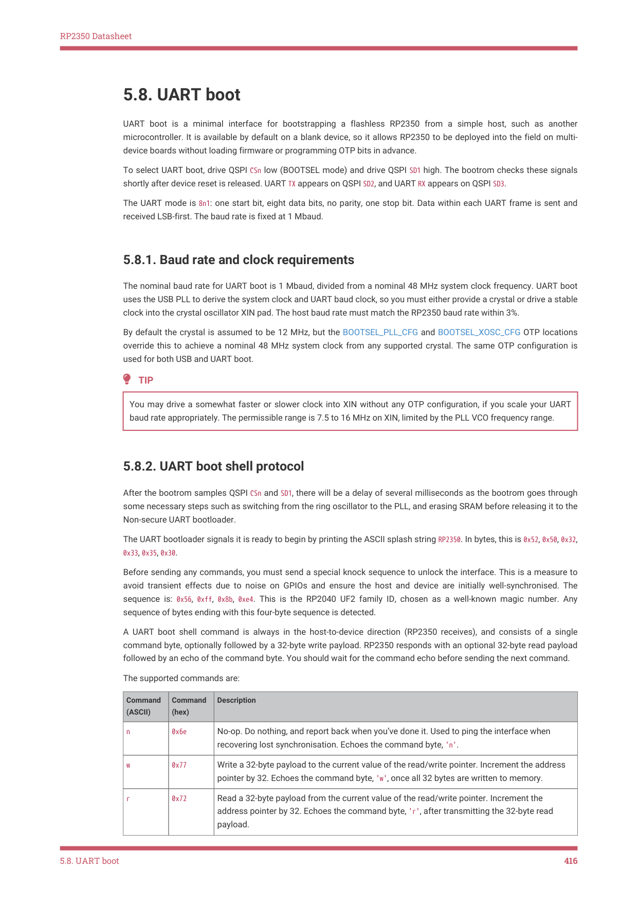

# 5.7.9. Volume label in-depth example

5.7.9. Volume label in-depth example

The following example demonstrates how to manually change the volume label using picotool to the value "SPOON":

1. First, define the row of white label structure to be 0x400:

$ picotool otp set -e OTP_DATA_USB_WHITE_LABEL_ADDR 0x400

2. Next, because the volume label is located at index 0x8 within OTP_DATA_USB_WHITE_LABEL_ADDR, write to 0x408. Define the

location of the volume label string to be offset from OTP_DATA_USB_WHITE_LABEL_ADDR by 0x30. For this example,

"SPOON" has 5 characters, so we write 0x3005 to 0x408:

$ picotool otp set -e 0x408 0x3005

3. Then, write the "S" and "P" characters:

$ picotool otp set -e 0x430 0x5053

4. Then, write the "O" and "O" characters:

$ picotool otp set -e 0x431 0x4f4f

5. Then, write the "N" character:

$ picotool otp set -e 0x432 0x4e

6. Finally, enable the valid override to use the new values (bit 8 marks the VOLUME_LABEL override as valid, and bit 22

marks the OTP_DATA_USB_WHITE_LABEL_ADDR override as valid):

$ picotool otp set -r OTP_DATA_USB_BOOT_FLAGS 0x400100

7. To put your changes into effect, reboot the device:

5.7. USB white-labelling
415

RP2350 Datasheet

5.8. UART boot

UART boot is a minimal interface for bootstrapping a flashless RP2350 from a simple host, such as another

microcontroller. It is available by default on a blank device, so it allows RP2350 to be deployed into the field on multi-

device boards without loading firmware or programming OTP bits in advance.

To select UART boot, drive QSPI CSn low (BOOTSEL mode) and drive QSPI SD1 high. The bootrom checks these signals

shortly after device reset is released. UART TX appears on QSPI SD2, and UART RX appears on QSPI SD3.

The UART mode is 8n1: one start bit, eight data bits, no parity, one stop bit. Data within each UART frame is sent and

received LSB-first. The baud rate is fixed at 1 Mbaud.

