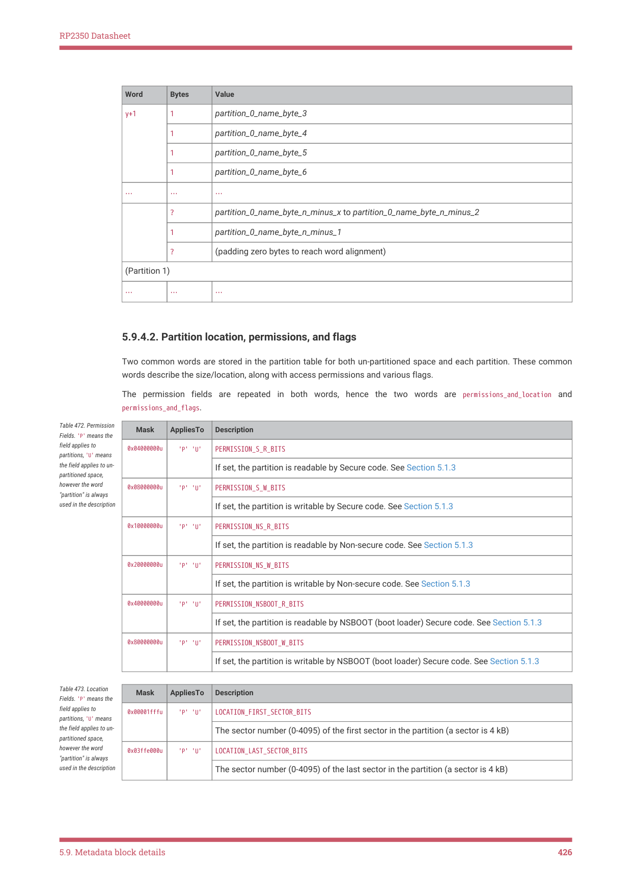
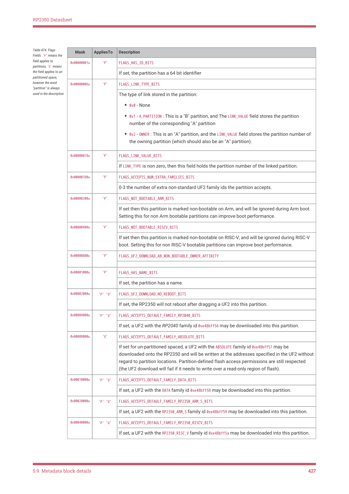

# 5.9.4. Partition table items

5.9.4. Partition table items

Partition tables allows dividing the 32 MB flash region (2 × 16 MB) into partitions. Permissions and other partition

attributes may be specified for each partition, along with permissions for the un-partitioned space.

The permission specify read/write access for Secure code, Non-secure code, and "NSBoot" which refers to the boot

loader (and PICOBOOT)

NOTE

These permissions are only advisory to Secure code, however they are respected by flash_op(), the PICOBOOT flash

access commands, and UF2 downloads.

5.9.4.1. PARTITION_TABLE item

| Word | Bytes | Value |
| --- | --- | --- |
| 0 | 1 | 0x44 (size_flag == 0, item_type == PICOBIN BLOCK ITEM PARTITION TABLE) _ _ _ _ |
|  | 2 | Block size in words |
|  | 1 | singleton_flag:1, pad:3 , partition_count:4 |
| 1 | 4 | unpartitioned_space_permissions_and_flags |
| Partition 0 |  |  |
| 2 | 4 | permissions_and_location for partition 0 |
| 3 | 4 | permissions_and_flags for partition 0 |
|  | if _partition | _0_has_id: |
| 3 | 4 | partition_0_ID_lo |
| 4 | 4 | partition_0_ID_hi |
|  | one word p | er additional family ID (can be none): |
| x | 4 | partition_0_family ID_0 |
| x + 1 | 4 | partition_0_family ID_1 |
|  | … | … |
|  | if _partition | _0_has_name: |
| y | 1 | reserved:1 (0), name_len_bytes:7 |
|  | 1 | partition_0_name_byte_0 |
|  | 1 | partition_0_name_byte_1 |
|  | 1 | partition_0_name_byte_2 |

5.9. Metadata block details
425

RP2350 Datasheet

?
partition_0_name_byte_n_minus_x to partition_0_name_byte_n_minus_2

5.9.4.2. Partition location, permissions, and flags

Two common words are stored in the partition table for both un-partitioned space and each partition. These common

words describe the size/location, along with access permissions and various flags.

The permission fields are repeated in both words, hence the two words are permissions_and_location and

Table 472. Permission

Fields. 'P' means the

field applies to

partitions, 'U' means

the field applies to un-

If set, the partition is readable by Secure code. See Section 5.1.3

partitioned space,

however the word

"partition" is always

used in the description

If set, the partition is writable by Secure code. See Section 5.1.3

If set, the partition is readable by Non-secure code. See Section 5.1.3

If set, the partition is writable by Non-secure code. See Section 5.1.3

If set, the partition is readable by NSBOOT (boot loader) Secure code. See Section 5.1.3

If set, the partition is writable by NSBOOT (boot loader) Secure code. See Section 5.1.3

Table 473. Location

Fields. 'P' means the

field applies to

partitions, 'U' means

the field applies to un-

The sector number (0-4095) of the first sector in the partition (a sector is 4 kB)

partitioned space,

however the word

"partition" is always

used in the description

The sector number (0-4095) of the last sector in the partition (a sector is 4 kB)

5.9. Metadata block details
426

RP2350 Datasheet

Table 474. Flags

Fields. 'P' means the

field applies to

partitions, 'U' means

the field applies to un-

If set, the partition has a 64 bit identifier

partitioned space,

however the word

"partition" is always

used in the description

The type of link stored in the partition:

• 0x0 - None
• 0x1 - A_PARTITION : This is a "B" partition, and The LINK_VALUE field stores the partition

number of the corresponding "A" partition
• 0x2 - OWNER : This is an "A" partition, and the LINK_VALUE field stores the partition number of

the owning partition (which should also be an "A" partition).

If LINK_TYPE is non zero, then this field holds the partition number of the linked partition.

0-3 the number of extra non-standard UF2 family ids the partition accepts.

If set then this partition is marked non-bootable on Arm, and will be ignored during Arm boot.

Setting this for non Arm bootable partitions can improve boot performance.

If set then this partition is marked non-bootable on RISC-V, and will be ignored during RISC-V

boot. Setting this for non RISC-V bootable partitions can improve boot performance.

0x00000800u
'P'
FLAGS_UF2_DOWNLOAD_AB_NON_BOOTABLE_OWNER_AFFINITY

If set, the partition has a name.

If set, the RP2350 will not reboot after dragging a UF2 into this partition.

If set, a UF2 with the RP2040 family id 0xe48bff56 may be downloaded into this partition.

If set for un-partitioned spaced, a UF2 with the ABSOLUTE family id 0xe48bff57 may be

downloaded onto the RP2350 and will be written at the addresses specified in the UF2 without

regard to partition locations. Partition-defined flash access permissions are still respected

(the UF2 download will fail if it needs to write over a read-only region of flash).

If set, a UF2 with the DATA family id 0xe48bff58 may be downloaded into this partition.

0x00020000u
'P' 'U'
FLAGS_ACCEPTS_DEFAULT_FAMILY_RP2350_ARM_S_BITS

If set, a UF2 with the RP2350_ARM_S family id 0xe48bff59 may be downloaded into this partition.

0x00040000u
'P' 'U'
FLAGS_ACCEPTS_DEFAULT_FAMILY_RP2350_RISCV_BITS

If set, a UF2 with the RP2350_RISC_V family id 0xe48bff5a may be downloaded into this partition.

5.9. Metadata block details
427

RP2350 Datasheet

| Mask | AppliesTo | Description |
| --- | --- | --- |
| 0x00080000u | 'P' 'U' | FLAGS ACCEPTS DEFAULT FAMILY RP2350 ARM NS BITS _ _ _ _ _ _ _ |
|  |  | If set, a UF2 with the RP2350 ARM NS family id 0xe48bff5b may be downloaded into this partition. _ _ |
| 0x03f00000u | 'P' 'U' | reserved; should be 0 |

