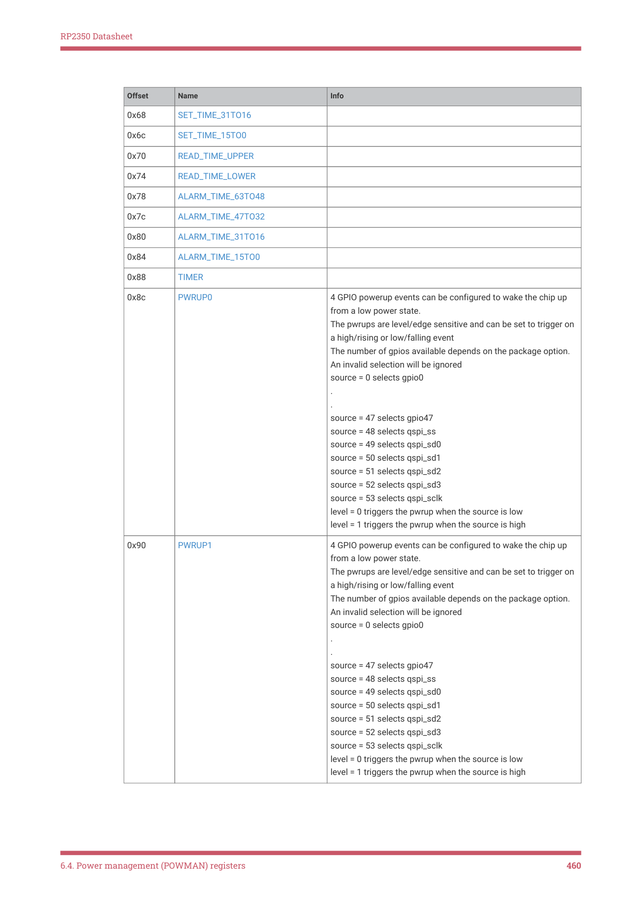
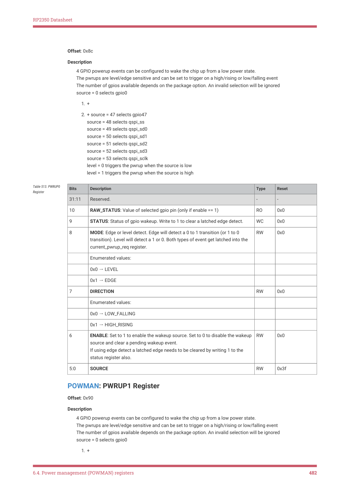

# 6.4. Power management (POWMAN) registers

6.4. Power management (POWMAN) registers

Password-protected POWMAN registers require a password (0x5AFE) to be written to the top 16 bits to enable the write

operation. This protects against accidental writes that could crash the chip untraceably. Writes to protected registers

that don’t include the password are ignored, setting a flag in the BADPASSWD register. Reads from protected registers

don’t return the password, to protect against erroneous read-modify-write operations.

Protected registers obviously don’t have writeable fields in the top 16 bits, however they may have read-only fields in

that range.

All registers with address offsets up to and including 0x000000ac are password protected. Therefore, the following

writeable registers are unprotected and have 32-bit write access:

6.4. Power management (POWMAN) registers
457

RP2350 Datasheet

• POWMAN_SCRATCH0 → POWMAN_SCRATCH7
• POWMAN_BOOT0 → POWMAN_BOOT3
• POWMAN_INTR
• POWMAN_INTE
• POWMAN_INTF

| Offset | Name | Info |
| --- | --- | --- |
| 0x00 | BADPASSWD | Indicates a bad password has been used |
| 0x04 | VREG_CTRL | Voltage Regulator Control |
| 0x08 | VREG_STS | Voltage Regulator Status |
| 0x0c | VREG | Voltage Regulator Settings |
| 0x10 | VREG_LP_ENTRY | Voltage Regulator Low Power Entry Settings |
| 0x14 | VREG_LP_EXIT | Voltage Regulator Low Power Exit Settings |
| 0x18 | BOD_CTRL | Brown-out Detection Control |
| 0x1c | BOD | Brown-out Detection Settings |
| 0x20 | BOD_LP_ENTRY | Brown-out Detection Low Power Entry Settings |
| 0x24 | BOD_LP_EXIT | Brown-out Detection Low Power Exit Settings |
| 0x28 | LPOSC | Low power oscillator control register. |
| 0x2c | CHIP_RESET | Chip reset control and status |
| 0x30 | WDSEL | Allows a watchdog reset to reset the internal state of powman in addition to the power-on state machine (PSM). Note that powman ignores watchdog resets that do not select at least the CLOCKS stage or earlier stages in the PSM. If using these bits, it’s recommended to set PSM_WDSEL to all-ones in addition to the desired bits in this register. Failing to select CLOCKS or earlier will result in the POWMAN_WDSEL register having no effect. |
| 0x34 | SEQ_CFG | For configuration of the power sequencer Writes are ignored while POWMAN_STATE_CHANGING=1 |
| 0x38 | STATE | This register controls the power state of the 4 power domains. The current power state is indicated in POWMAN_STATE_CURRENT which is read-only. To change the state, write to POWMAN_STATE_REQ. The coding of POWMAN_STATE_CURRENT & POWMAN_STATE_REQ corresponds to the power states defined in the datasheet: bit 3 = SWCORE bit 2 = XIP cache bit 1 = SRAM0 bit 0 = SRAM1 0 = powered up 1 = powered down When POWMAN_STATE_REQ is written, the POWMAN_STATE_WAITING flag is set while the Power Manager determines what is required. If an invalid transition is requested the Power Manager will still register the request in POWMAN_STATE_REQ but will also set the POWMAN_BAD_REQ flag. It will then implement the power-up requests and ignore the power down requests. To do nothing would risk entering an unrecoverable lock-up state. Invalid requests are: any combination of power up and power down requests any request that results in swcore being powered and xip unpowered If the request is to power down the switched-core domain then POWMAN_STATE_WAITING stays active until the processors halt. During this time the POWMAN_STATE_REQ field can be re- written to change or cancel the request. When the power state transition begins the POWMAN_STATE_WAITING_flag is cleared, the POWMAN_STATE_CHANGING flag is set and POWMAN register writes are ignored until the transition completes. |
| 0x3c | POW_FASTDIV |  |
| 0x40 | POW_DELAY | power state machine delays |
| 0x44 | EXT_CTRL0 | Configures a gpio as a power mode aware control output |
| 0x48 | EXT_CTRL1 | Configures a gpio as a power mode aware control output |
| 0x4c | EXT_TIME_REF | Select a GPIO to use as a time reference, the source can be used to drive the low power clock at 32kHz, or to provide a 1ms tick to the timer, or provide a 1Hz tick to the timer. The tick selection is controlled by the POWMAN_TIMER register. |
| 0x50 | LPOSC_FREQ_KHZ_INT | Informs the AON Timer of the integer component of the clock frequency when running off the LPOSC. |
| 0x54 | LPOSC_FREQ_KHZ_FRAC | Informs the AON Timer of the fractional component of the clock frequency when running off the LPOSC. |
| 0x58 | XOSC_FREQ_KHZ_INT | Informs the AON Timer of the integer component of the clock frequency when running off the XOSC. |
| 0x5c | XOSC_FREQ_KHZ_FRAC | Informs the AON Timer of the fractional component of the clock frequency when running off the XOSC. |
| 0x60 | SET_TIME_63TO48 |  |
| 0x64 | SET_TIME_47TO32 |  |

Table 477. List of

6.4. Power management (POWMAN) registers
458

RP2350 Datasheet

6.4. Power management (POWMAN) registers
459

RP2350 Datasheet

0x8c
PWRUP0
4 GPIO powerup events can be configured to wake the chip up

The pwrups are level/edge sensitive and can be set to trigger on

a high/rising or low/falling event

The number of gpios available depends on the package option.

An invalid selection will be ignored

level = 0 triggers the pwrup when the source is low

level = 1 triggers the pwrup when the source is high

0x90
PWRUP1
4 GPIO powerup events can be configured to wake the chip up

The pwrups are level/edge sensitive and can be set to trigger on

a high/rising or low/falling event

The number of gpios available depends on the package option.

An invalid selection will be ignored

level = 0 triggers the pwrup when the source is low

level = 1 triggers the pwrup when the source is high

6.4. Power management (POWMAN) registers
460

RP2350 Datasheet

| Offset | Name | Info |
| --- | --- | --- |
| 0x94 | PWRUP2 | 4 GPIO powerup events can be configured to wake the chip up from a low power state. The pwrups are level/edge sensitive and can be set to trigger on a high/rising or low/falling event The number of gpios available depends on the package option. An invalid selection will be ignored source = 0 selects gpio0 . . source = 47 selects gpio47 source = 48 selects qspi_ss source = 49 selects qspi_sd0 source = 50 selects qspi_sd1 source = 51 selects qspi_sd2 source = 52 selects qspi_sd3 source = 53 selects qspi_sclk level = 0 triggers the pwrup when the source is low level = 1 triggers the pwrup when the source is high |
| 0x98 | PWRUP3 | 4 GPIO powerup events can be configured to wake the chip up from a low power state. The pwrups are level/edge sensitive and can be set to trigger on a high/rising or low/falling event The number of gpios available depends on the package option. An invalid selection will be ignored source = 0 selects gpio0 . . source = 47 selects gpio47 source = 48 selects qspi_ss source = 49 selects qspi_sd0 source = 50 selects qspi_sd1 source = 51 selects qspi_sd2 source = 52 selects qspi_sd3 source = 53 selects qspi_sclk level = 0 triggers the pwrup when the source is low level = 1 triggers the pwrup when the source is high |
| 0x9c | CURRENT_PWRUP_REQ | Indicates current powerup request state pwrup events can be cleared by removing the enable from the pwrup register. The alarm pwrup req can be cleared by clearing timer.alarm_enab 0 = chip reset, for the source of the last reset see POWMAN_CHIP_RESET 1 = pwrup0 2 = pwrup1 3 = pwrup2 4 = pwrup3 5 = coresight_pwrup 6 = alarm_pwrup |
| 0xa0 | LAST_SWCORE_PWRUP | Indicates which pwrup source triggered the last switched-core power up 0 = chip reset, for the source of the last reset see POWMAN_CHIP_RESET 1 = pwrup0 2 = pwrup1 3 = pwrup2 4 = pwrup3 5 = coresight_pwrup 6 = alarm_pwrup |
| 0xa4 | DBG_PWRCFG |  |
| 0xa8 | BOOTDIS | Tell the bootrom to ignore the BOOT0..3 registers following the next RSM reset (e.g. the next core power down/up). If an early boot stage has soft-locked some OTP pages in order to protect their contents from later stages, there is a risk that Secure code running at a later stage can unlock the pages by powering the core up and down. This register can be used to ensure that the bootloader runs as normal on the next power up, preventing Secure code at a later stage from accessing OTP in its unlocked state. Should be used in conjunction with the OTP BOOTDIS register. |
| 0xac | DBGCONFIG |  |
| 0xb0 | SCRATCH0 | Scratch register. Information persists in low power mode |
| 0xb4 | SCRATCH1 | Scratch register. Information persists in low power mode |
| 0xb8 | SCRATCH2 | Scratch register. Information persists in low power mode |
| 0xbc | SCRATCH3 | Scratch register. Information persists in low power mode |
| 0xc0 | SCRATCH4 | Scratch register. Information persists in low power mode |
| 0xc4 | SCRATCH5 | Scratch register. Information persists in low power mode |
| 0xc8 | SCRATCH6 | Scratch register. Information persists in low power mode |
| 0xcc | SCRATCH7 | Scratch register. Information persists in low power mode |
| 0xd0 | BOOT0 | Scratch register. Information persists in low power mode |
| 0xd4 | BOOT1 | Scratch register. Information persists in low power mode |
| 0xd8 | BOOT2 | Scratch register. Information persists in low power mode |
| 0xdc | BOOT3 | Scratch register. Information persists in low power mode |
| 0xe0 | INTR | Raw Interrupts |
| 0xe4 | INTE | Interrupt Enable |
| 0xe8 | INTF | Interrupt Force |
| 0xec | INTS | Interrupt status after masking & forcing |

6.4. Power management (POWMAN) registers
461

RP2350 Datasheet

POWMAN: BADPASSWD Register

Offset: 0x00

6.4. Power management (POWMAN) registers
462

RP2350 Datasheet

| Bits | Description | Type | Reset |
| --- | --- | --- | --- |
| 31:1 | Reserved. | - | - |
| 0 | Indicates a bad password has been used | WC | 0x0 |

Table 478.

POWMAN: VREG_CTRL Register

Offset: 0x04

Description

Voltage Regulator Control

| Bits | Description | Type | Reset |
| --- | --- | --- | --- |
| 31:16 | Reserved. | - | - |
| 15 | RST_N: returns the regulator to its startup settings 0 - reset 1 - not reset (default) | RW | 0x1 |
| 14 | Reserved. | - | - |
| 13 | UNLOCK: unlocks the VREG control interface after power up 0 - Locked (default) 1 - Unlocked It cannot be relocked when it is unlocked. | RW | 0x0 |
| 12 | ISOLATE: isolates the VREG control interface 0 - not isolated (default) 1 - isolated | RW | 0x0 |
| 11:9 | Reserved. | - | - |
| 8 | DISABLE_VOLTAGE_LIMIT: 0=not disabled, 1=enabled | RW | 0x0 |
| 7 | Reserved. | - | - |
| 6:4 | HT_TH: high temperature protection threshold regulator power transistors are disabled when junction temperature exceeds threshold 000 - 100C 001 - 105C 010 - 110C 011 - 115C 100 - 120C 101 - 125C 110 - 135C 111 - 150C | RW | 0x5 |
| 3:2 | Reserved. | - | - |
| 1:0 | RESERVED: write 0 to this field | RW | 0x0 |
| 31:5 | Reserved. | - | - |
| 4 | VOUT_OK: output regulation status 0=not in regulation, 1=in regulation | RO | 0x0 |
| 3:1 | Reserved. | - | - |
| 0 | STARTUP: startup status 0=startup complete, 1=starting up | RO | 0x0 |

Table 479.

POWMAN: VREG_STS Register

Offset: 0x08

Description

Voltage Regulator Status

Table 480. VREG_STS

Register

6.4. Power management (POWMAN) registers
463

RP2350 Datasheet

POWMAN: VREG Register

Offset: 0x0c

Description

Voltage Regulator Settings

| Bits | Description | Type | Reset |
| --- | --- | --- | --- |
| 31:16 | Reserved. | - | - |
| 15 | UPDATE_IN_PROGRESS: regulator state is being updated writes to the vreg register will be ignored when this field is set | RO | 0x0 |
| 14:9 | Reserved. | - | - |
| 8:4 | VSEL: output voltage select the regulator output voltage is limited to 1.3V unless the voltage limit is disabled using the disable_voltage_limit field in the vreg_ctrl register 00000 - 0.55V 00001 - 0.60V 00010 - 0.65V 00011 - 0.70V 00100 - 0.75V 00101 - 0.80V 00110 - 0.85V 00111 - 0.90V 01000 - 0.95V 01001 - 1.00V 01010 - 1.05V 01011 - 1.10V (default) 01100 - 1.15V 01101 - 1.20V 01110 - 1.25V 01111 - 1.30V 10000 - 1.35V 10001 - 1.40V 10010 - 1.50V 10011 - 1.60V 10100 - 1.65V 10101 - 1.70V 10110 - 1.80V 10111 - 1.90V 11000 - 2.00V 11001 - 2.35V 11010 - 2.50V 11011 - 2.65V 11100 - 2.80V 11101 - 3.00V 11110 - 3.15V 11111 - 3.30V | RW | 0x0b |
| 3 | Reserved. | - | - |
| 2 | RESERVED: write 0 to this field | RW | 0x0 |
| 1 | HIZ: high impedance mode select 0=not in high impedance mode, 1=in high impedance mode | RW | 0x0 |
| 0 | Reserved. | - | - |

Table 481. VREG

6.4. Power management (POWMAN) registers
464

RP2350 Datasheet

POWMAN: VREG_LP_ENTRY Register

Offset: 0x10

Description

Voltage Regulator Low Power Entry Settings

| Bits | Description | Type | Reset |
| --- | --- | --- | --- |
| 31:9 | Reserved. | - | - |
| 8:4 | VSEL: output voltage select the regulator output voltage is limited to 1.3V unless the voltage limit is disabled using the disable_voltage_limit field in the vreg_ctrl register 00000 - 0.55V 00001 - 0.60V 00010 - 0.65V 00011 - 0.70V 00100 - 0.75V 00101 - 0.80V 00110 - 0.85V 00111 - 0.90V 01000 - 0.95V 01001 - 1.00V 01010 - 1.05V 01011 - 1.10V (default) 01100 - 1.15V 01101 - 1.20V 01110 - 1.25V 01111 - 1.30V 10000 - 1.35V 10001 - 1.40V 10010 - 1.50V 10011 - 1.60V 10100 - 1.65V 10101 - 1.70V 10110 - 1.80V 10111 - 1.90V 11000 - 2.00V 11001 - 2.35V 11010 - 2.50V 11011 - 2.65V 11100 - 2.80V 11101 - 3.00V 11110 - 3.15V 11111 - 3.30V | RW | 0x0b |
| 3 | Reserved. | - | - |
| 2 | MODE: selects either normal (switching) mode or low power (linear) mode low power mode can only be selected for output voltages up to 1.3V 0 = normal mode (switching) 1 = low power mode (linear) | RW | 0x1 |
| 1 | HIZ: high impedance mode select 0=not in high impedance mode, 1=in high impedance mode | RW | 0x0 |
| 0 | Reserved. | - | - |
| 31:9 | Reserved. | - | - |
| 8:4 | VSEL: output voltage select the regulator output voltage is limited to 1.3V unless the voltage limit is disabled using the disable_voltage_limit field in the vreg_ctrl register 00000 - 0.55V 00001 - 0.60V 00010 - 0.65V 00011 - 0.70V 00100 - 0.75V 00101 - 0.80V 00110 - 0.85V 00111 - 0.90V 01000 - 0.95V 01001 - 1.00V 01010 - 1.05V 01011 - 1.10V (default) 01100 - 1.15V 01101 - 1.20V 01110 - 1.25V 01111 - 1.30V 10000 - 1.35V 10001 - 1.40V 10010 - 1.50V 10011 - 1.60V 10100 - 1.65V 10101 - 1.70V 10110 - 1.80V 10111 - 1.90V 11000 - 2.00V 11001 - 2.35V 11010 - 2.50V 11011 - 2.65V 11100 - 2.80V 11101 - 3.00V 11110 - 3.15V 11111 - 3.30V | RW | 0x0b |
| 3 | Reserved. | - | - |
| 2 | MODE: selects either normal (switching) mode or low power (linear) mode low power mode can only be selected for output voltages up to 1.3V 0 = normal mode (switching) 1 = low power mode (linear) | RW | 0x0 |
| 1 | HIZ: high impedance mode select 0=not in high impedance mode, 1=in high impedance mode | RW | 0x0 |
| 0 | Reserved. | - | - |
| 31:13 | Reserved. | - | - |
| 12 | ISOLATE: isolates the brown-out detection control interface 0 - not isolated (default) 1 - isolated | RW | 0x0 |
| 11:0 | Reserved. | - | - |

Table 482.

VREG_LP_ENTRY

Register

6.4. Power management (POWMAN) registers
465

RP2350 Datasheet

POWMAN: VREG_LP_EXIT Register

Offset: 0x14

Description

Voltage Regulator Low Power Exit Settings

6.4. Power management (POWMAN) registers
466

RP2350 Datasheet

Table 483.

VREG_LP_EXIT

Register

POWMAN: BOD_CTRL Register

Offset: 0x18

Description

Brown-out Detection Control

6.4. Power management (POWMAN) registers
467

RP2350 Datasheet

Table 484. BOD_CTRL

POWMAN: BOD Register

Offset: 0x1c

Description

Brown-out Detection Settings

| Bits | Description | Type | Reset |
| --- | --- | --- | --- |
| 31:9 | Reserved. | - | - |
| 8:4 | VSEL: threshold select 00000 - 0.473V 00001 - 0.516V 00010 - 0.559V 00011 - 0.602V 00100 - 0.645VS 00101 - 0.688V 00110 - 0.731V 00111 - 0.774V 01000 - 0.817V 01001 - 0.860V (default) 01010 - 0.903V 01011 - 0.946V 01100 - 0.989V 01101 - 1.032V 01110 - 1.075V 01111 - 1.118V 10000 - 1.161 10001 - 1.204V | RW | 0x0b |
| 3:1 | Reserved. | - | - |
| 0 | EN: enable brown-out detection 0=not enabled, 1=enabled | RW | 0x1 |

Table 485. BOD

POWMAN: BOD_LP_ENTRY Register

Offset: 0x20

Description

Brown-out Detection Low Power Entry Settings

| Bits | Description | Type | Reset |
| --- | --- | --- | --- |
| 31:9 | Reserved. | - | - |
| 8:4 | VSEL: threshold select 00000 - 0.473V 00001 - 0.516V 00010 - 0.559V 00011 - 0.602V 00100 - 0.645VS 00101 - 0.688V 00110 - 0.731V 00111 - 0.774V 01000 - 0.817V 01001 - 0.860V (default) 01010 - 0.903V 01011 - 0.946V 01100 - 0.989V 01101 - 1.032V 01110 - 1.075V 01111 - 1.118V 10000 - 1.161 10001 - 1.204V | RW | 0x0b |
| 3:1 | Reserved. | - | - |
| 0 | EN: enable brown-out detection 0=not enabled, 1=enabled | RW | 0x0 |

Table 486.

BOD_LP_ENTRY

Register

6.4. Power management (POWMAN) registers
468

RP2350 Datasheet

POWMAN: BOD_LP_EXIT Register

Offset: 0x24

Description

Brown-out Detection Low Power Exit Settings

| Bits | Description | Type | Reset |
| --- | --- | --- | --- |
| 31:9 | Reserved. | - | - |
| 8:4 | VSEL: threshold select 00000 - 0.473V 00001 - 0.516V 00010 - 0.559V 00011 - 0.602V 00100 - 0.645VS 00101 - 0.688V 00110 - 0.731V 00111 - 0.774V 01000 - 0.817V 01001 - 0.860V (default) 01010 - 0.903V 01011 - 0.946V 01100 - 0.989V 01101 - 1.032V 01110 - 1.075V 01111 - 1.118V 10000 - 1.161 10001 - 1.204V | RW | 0x0b |
| 3:1 | Reserved. | - | - |
| 0 | EN: enable brown-out detection 0=not enabled, 1=enabled | RW | 0x1 |

Table 487.

6.4. Power management (POWMAN) registers
469

RP2350 Datasheet

POWMAN: LPOSC Register

Offset: 0x28

Description

Low power oscillator control register.

| Bits | Description | Type | Reset |
| --- | --- | --- | --- |
| 31:10 | Reserved. | - | - |
| 9:4 | TRIM: Frequency trim - the trim step is typically 1% of the reset frequency, but can be up to 3% | RW | 0x20 |
| 3:2 | Reserved. | - | - |
| 1:0 | MODE: This feature has been removed | RW | 0x3 |

Table 488. LPOSC

POWMAN: CHIP_RESET Register

Offset: 0x2c

Description

Chip reset control and status

| Bits | Description | Type | Reset |
| --- | --- | --- | --- |
| 31:29 | Reserved. | - | - |
| 28 | HAD_WATCHDOG_RESET_PSM: Last reset was a watchdog timeout which was configured to reset the power-on state machine This resets: double_tap flag no DP no RPAP no rescue_flag no timer no powman no swcore no psm yes and does not change the power state | RO | 0x0 |
| 27 | HAD_HZD_SYS_RESET_REQ: Last reset was a system reset from the hazard debugger This resets: double_tap flag no DP no RPAP no rescue_flag no timer no powman no swcore no psm yes and does not change the power state | RO | 0x0 |
| 26 | HAD_GLITCH_DETECT: Last reset was due to a power supply glitch This resets: double_tap flag no DP no RPAP no rescue_flag no timer no powman no swcore no psm yes and does not change the power state | RO | 0x0 |
| 25 | HAD_SWCORE_PD: Last reset was a switched core powerdown This resets: double_tap flag no DP no RPAP no rescue_flag no timer no powman no swcore yes psm yes then starts the power sequencer | RO | 0x0 |
| 24 | HAD_WATCHDOG_RESET_SWCORE: Last reset was a watchdog timeout which was configured to reset the switched-core This resets: double_tap flag no DP no RPAP no rescue_flag no timer no powman no swcore yes psm yes then starts the power sequencer | RO | 0x0 |
| 23 | HAD_WATCHDOG_RESET_POWMAN: Last reset was a watchdog timeout which was configured to reset the power manager This resets: double_tap flag no DP no RPAP no rescue_flag no timer yes powman yes swcore yes psm yes then starts the power sequencer | RO | 0x0 |
| 22 | HAD_WATCHDOG_RESET_POWMAN_ASYNC: Last reset was a watchdog timeout which was configured to reset the power manager asynchronously This resets: double_tap flag no DP no RPAP no rescue_flag no timer yes powman yes swcore yes psm yes then starts the power sequencer | RO | 0x0 |
| 21 | HAD_RESCUE: Last reset was a rescue reset from the debugger This resets: double_tap flag no DP no RPAP no rescue_flag no, it sets this flag timer yes powman yes swcore yes psm yes then starts the power sequencer | RO | 0x0 |
| 20 | Reserved. | - | - |
| 19 | HAD_DP_RESET_REQ: Last reset was an reset request from the arm debugger This resets: double_tap flag no DP no RPAP no rescue_flag yes timer yes powman yes swcore yes psm yes then starts the power sequencer | RO | 0x0 |
| 18 | HAD_RUN_LOW: Last reset was from the RUN pin This resets: double_tap flag no DP yes RPAP yes rescue_flag yes timer yes powman yes swcore yes psm yes then starts the power sequencer | RO | 0x0 |
| 17 | HAD_BOR: Last reset was from the brown-out detection block This resets: double_tap flag yes DP yes RPAP yes rescue_flag yes timer yes powman yes swcore yes psm yes then starts the power sequencer | RO | 0x0 |
| 16 | HAD_POR: Last reset was from the power-on reset This resets: double_tap flag yes DP yes RPAP yes rescue_flag yes timer yes powman yes swcore yes psm yes then starts the power sequencer | RO | 0x0 |
| 15:5 | Reserved. | - | - |
| 4 | RESCUE_FLAG: This is set by a rescue reset from the RP-AP. Its purpose is to halt before the bootrom before booting from flash in order to recover from a boot lock-up. The debugger can then attach once the bootrom has been halted and flash some working code that does not lock up. | WC | 0x0 |
| 3:1 | Reserved. | - | - |
| 0 | DOUBLE_TAP: This flag is set by double-tapping RUN. It tells bootcode to go into the bootloader. | RW | 0x0 |

Table 489.

6.4. Power management (POWMAN) registers
470

RP2350 Datasheet

6.4. Power management (POWMAN) registers
471

RP2350 Datasheet

6.4. Power management (POWMAN) registers
472

RP2350 Datasheet

POWMAN: WDSEL Register

Offset: 0x30

Description

Allows a watchdog reset to reset the internal state of powman in addition to the power-on state machine (PSM).

Note that powman ignores watchdog resets that do not select at least the CLOCKS stage or earlier stages in the

PSM. If using these bits, it’s recommended to set PSM_WDSEL to all-ones in addition to the desired bits in this

register. Failing to select CLOCKS or earlier will result in the POWMAN_WDSEL register having no effect.

| Bits | Description | Type | Reset |
| --- | --- | --- | --- |
| 31:13 | Reserved. | - | - |
| 12 | RESET_PSM: If set to 1, a watchdog reset will run the full power-on state machine (PSM) sequence From a user perspective it is the same as setting RSM_WDSEL_PROC_COLD From a hardware debug perspective it has the same effect as a reset from a glitch detector | RW | 0x0 |
| 11:9 | Reserved. | - | - |
| 8 | RESET_SWCORE: If set to 1, a watchdog reset will reset the switched core power domain and run the full power-on state machine (PSM) sequence From a user perspective it is the same as setting RSM_WDSEL_PROC_COLD From a hardware debug perspective it has the same effect as a power-on reset for the switched core power domain | RW | 0x0 |
| 7:5 | Reserved. | - | - |
| 4 | RESET_POWMAN: If set to 1, a watchdog reset will restore powman defaults, reset the timer, reset the switched core power domain and run the full power-on state machine (PSM) sequence This relies on clk_ref running. Use reset_powman_async if that may not be true | RW | 0x0 |
| 3:1 | Reserved. | - | - |
| 0 | RESET_POWMAN_ASYNC: If set to 1, a watchdog reset will restore powman defaults, reset the timer, reset the switched core domain and run the full power-on state machine (PSM) sequence This does not rely on clk_ref running | RW | 0x0 |

Table 490. WDSEL

6.4. Power management (POWMAN) registers
473

RP2350 Datasheet

POWMAN: SEQ_CFG Register

Offset: 0x34

Description

For configuration of the power sequencer

Writes are ignored while POWMAN_STATE_CHANGING=1

| Bits | Description | Type | Reset |
| --- | --- | --- | --- |
| 31:21 | Reserved. | - | - |
| 20 | USING_FAST_POWCK: 0 indicates the POWMAN clock is running from the low power oscillator (32kHz) 1 indicates the POWMAN clock is running from the reference clock (2-50MHz) | RO | 0x1 |
| 19:18 | Reserved. | - | - |
| 17 | USING_BOD_LP: Indicates the brown-out detector (BOD) mode 0 = BOD high power mode which is the default 1 = BOD low power mode | RO | 0x0 |
| 16 | USING_VREG_LP: Indicates the voltage regulator (VREG) mode 0 = VREG high power mode which is the default 1 = VREG low power mode | RO | 0x0 |
| 15:13 | Reserved. | - | - |
| 12 | USE_FAST_POWCK: selects the reference clock (clk_ref) as the source of the POWMAN clock when switched-core is powered. The POWMAN clock always switches to the slow clock (lposc) when switched-core is powered down because the fast clock stops running. 0 always run the POWMAN clock from the slow clock (lposc) 1 run the POWMAN clock from the fast clock when available This setting takes effect when a power up sequence is next run | RW | 0x1 |
| 11:9 | Reserved. | - | - |
| 8 | RUN_LPOSC_IN_LP: Set to 0 to stop the low power osc when the switched- core is powered down, which is unwise if using it to clock the timer This setting takes effect when the swcore is next powered down | RW | 0x1 |
| 7 | USE_BOD_HP: Set to 0 to prevent automatic switching to bod high power mode when switched-core is powered up This setting takes effect when the swcore is next powered up | RW | 0x1 |
| 6 | USE_BOD_LP: Set to 0 to prevent automatic switching to bod low power mode when switched-core is powered down This setting takes effect when the swcore is next powered down | RW | 0x1 |
| 5 | USE_VREG_HP: Set to 0 to prevent automatic switching to vreg high power mode when switched-core is powered up This setting takes effect when the swcore is next powered up | RW | 0x1 |
| 4 | USE_VREG_LP: Set to 0 to prevent automatic switching to vreg low power mode when switched-core is powered down This setting takes effect when the swcore is next powered down | RW | 0x1 |
| 3:2 | Reserved. | - | - |
| 1 | HW_PWRUP_SRAM0: Specifies the power state of SRAM0 when powering up swcore from a low power state (P1.xxx) to a high power state (P0.0xx). 0=power-up 1=no change | RW | 0x0 |
| 0 | HW_PWRUP_SRAM1: Specifies the power state of SRAM1 when powering up swcore from a low power state (P1.xxx) to a high power state (P0.0xx). 0=power-up 1=no change | RW | 0x0 |
| 31:14 | Reserved. | - | - |
| 13 | CHANGING: Indicates a power state change is in progress | RO | 0x0 |
| 12 | WAITING: Indicates the power manager has received a state change request and is waiting for other actions to complete before executing it | RO | 0x0 |
| 11 | BAD_HW_REQ: Invalid hardware initiated state request, power up requests actioned, power down requests ignored | RO | 0x0 |
| 10 | BAD_SW_REQ: Invalid software initiated state request ignored | RO | 0x0 |
| 9 | PWRUP_WHILE_WAITING: Indicates that a power state change request was ignored because of a pending power state change request | WC | 0x0 |
| 8 | REQ_IGNORED: Indicates that a software state change request was ignored because it clashed with an ongoing hardware or debugger request | WC | 0x0 |
| 7:4 | REQ: This is written by software or hardware to request a new power state | RW | 0x0 |
| 3:0 | CURRENT: Indicates the current power state | RO | 0xf |

Table 491. SEQ_CFG

6.4. Power management (POWMAN) registers
474

RP2350 Datasheet

POWMAN: STATE Register

Offset: 0x38

Description

This register controls the power state of the 4 power domains.

The current power state is indicated in POWMAN_STATE_CURRENT which is read-only.

To change the state, write to POWMAN_STATE_REQ.

The coding of POWMAN_STATE_CURRENT & POWMAN_STATE_REQ corresponds to the power states

defined in the datasheet:

bit 3 = SWCORE

bit 2 = XIP cache

bit 1 = SRAM0

bit 0 = SRAM1

0 = powered up

1 = powered down

When POWMAN_STATE_REQ is written, the POWMAN_STATE_WAITING flag is set while the Power Manager

determines what is required. If an invalid transition is requested the Power Manager will still register the request in

POWMAN_STATE_REQ but will also set the POWMAN_BAD_REQ flag. It will then implement the power-up requests

and ignore the power down requests. To do nothing would risk entering an unrecoverable lock-up state. Invalid

requests are: any combination of power up and power down requests any request that results in swcore being

powered and xip unpowered If the request is to power down the switched-core domain then

POWMAN_STATE_WAITING stays active until the processors halt. During this time the POWMAN_STATE_REQ field

can be re-written to change or cancel the request. When the power state transition begins the

POWMAN_STATE_WAITING_flag is cleared, the POWMAN_STATE_CHANGING flag is set and POWMAN register

writes are ignored until the transition completes.

6.4. Power management (POWMAN) registers
475

RP2350 Datasheet

Table 492. STATE

POWMAN: POW_FASTDIV Register

Offset: 0x3c

| Bits | Description | Type | Reset |
| --- | --- | --- | --- |
| 31:11 | Reserved. | - | - |
| 10:0 | divides the POWMAN clock to provide a tick for the delay module and state machines when clk_pow is running from the slow clock it is not divided when clk_pow is running from the fast clock it is divided by tick_div | RW | 0x040 |

Table 493.

POW_FASTDIV

Register

POWMAN: POW_DELAY Register

Offset: 0x40

Description

power state machine delays

| Bits | Description | Type | Reset |
| --- | --- | --- | --- |
| 31:16 | Reserved. | - | - |
| 15:8 | SRAM_STEP: timing between the sram0 and sram1 power state machine steps measured in units of the powman tick period (>=1us), 0 gives a delay of 1 unit | RW | 0x20 |
| 7:4 | XIP_STEP: timing between the xip power state machine steps measured in units of the lposc period, 0 gives a delay of 1 unit | RW | 0x1 |
| 3:0 | SWCORE_STEP: timing between the swcore power state machine steps measured in units of the lposc period, 0 gives a delay of 1 unit | RW | 0x1 |
| 31:15 | Reserved. | - | - |
| 14 | LP_EXIT_STATE: output level when exiting the low power state | RW | 0x0 |
| 13 | LP_ENTRY_STATE: output level when entering the low power state | RW | 0x0 |
| 12 | INIT_STATE | RW | 0x0 |
| 11:9 | Reserved. | - | - |
| 8 | INIT | RW | 0x0 |
| 7:6 | Reserved. | - | - |
| 5:0 | GPIO_SELECT: selects from gpio 0→30 set to 31 to disable this feature | RW | 0x3f |

Table 494.

POWMAN: EXT_CTRL0 Register

Offset: 0x44

Description

Configures a gpio as a power mode aware control output

6.4. Power management (POWMAN) registers
476

RP2350 Datasheet

Table 495. EXT_CTRL0

POWMAN: EXT_CTRL1 Register

Offset: 0x48

Description

Configures a gpio as a power mode aware control output

| Bits | Description | Type | Reset |
| --- | --- | --- | --- |
| 31:15 | Reserved. | - | - |
| 14 | LP_EXIT_STATE: output level when exiting the low power state | RW | 0x0 |
| 13 | LP_ENTRY_STATE: output level when entering the low power state | RW | 0x0 |
| 12 | INIT_STATE | RW | 0x0 |
| 11:9 | Reserved. | - | - |
| 8 | INIT | RW | 0x0 |
| 7:6 | Reserved. | - | - |
| 5:0 | GPIO_SELECT: selects from gpio 0→30 set to 31 to disable this feature | RW | 0x3f |

Table 496. EXT_CTRL1

POWMAN: EXT_TIME_REF Register

Offset: 0x4c

Description

Select a GPIO to use as a time reference, the source can be used to drive the low power clock at 32kHz, or to

provide a 1ms tick to the timer, or provide a 1Hz tick to the timer. The tick selection is controlled by the

POWMAN_TIMER register.

| Bits | Description | Type | Reset |
| --- | --- | --- | --- |
| 31:5 | Reserved. | - | - |
| 4 | DRIVE_LPCK: Use the selected GPIO to drive the 32kHz low power clock, in place of LPOSC. This field must only be written when POWMAN_TIMER_RUN=0 | RW | 0x0 |
| 3:2 | Reserved. | - | - |

Table 497.

EXT_TIME_REF

Register

6.4. Power management (POWMAN) registers
477

RP2350 Datasheet

Bits
Description
Type
Reset

POWMAN: LPOSC_FREQ_KHZ_INT Register

Offset: 0x50

Description

Informs the AON Timer of the integer component of the clock frequency when running off the LPOSC.

| Bits | Description | Type | Reset |
| --- | --- | --- | --- |
| 31:6 | Reserved. | - | - |
| 5:0 | Integer component of the LPOSC or GPIO clock source frequency in kHz. Default = 32 This field must only be written when POWMAN_TIMER_RUN=0 or POWMAN_TIMER_USING_XOSC=1 | RW | 0x20 |

Table 498.

LPOSC_FREQ_KHZ_IN

T Register

POWMAN: LPOSC_FREQ_KHZ_FRAC Register

Offset: 0x54

Description

Informs the AON Timer of the fractional component of the clock frequency when running off the LPOSC.

| Bits | Description | Type | Reset |
| --- | --- | --- | --- |
| 31:16 | Reserved. | - | - |
| 15:0 | Fractional component of the LPOSC or GPIO clock source frequency in kHz. Default = 0.768 This field must only be written when POWMAN_TIMER_RUN=0 or POWMAN_TIMER_USING_XOSC=1 | RW | 0xc49c |
| 31:16 | Reserved. | - | - |
| 15:0 | Integer component of the XOSC frequency in kHz. Default = 12000 Must be >1 This field must only be written when POWMAN_TIMER_RUN=0 or POWMAN_TIMER_USING_XOSC=0 | RW | 0x2ee0 |

Table 499.

LPOSC_FREQ_KHZ_FR

AC Register

POWMAN: XOSC_FREQ_KHZ_INT Register

Offset: 0x58

Description

Informs the AON Timer of the integer component of the clock frequency when running off the XOSC.

6.4. Power management (POWMAN) registers
478

RP2350 Datasheet

Table 500.

XOSC_FREQ_KHZ_INT

Register

POWMAN: XOSC_FREQ_KHZ_FRAC Register

Offset: 0x5c

Description

Informs the AON Timer of the fractional component of the clock frequency when running off the XOSC.

| Bits | Description | Type | Reset |
| --- | --- | --- | --- |
| 31:16 | Reserved. | - | - |
| 15:0 | Fractional component of the XOSC frequency in kHz. This field must only be written when POWMAN_TIMER_RUN=0 or POWMAN_TIMER_USING_XOSC=0 | RW | 0x0000 |

Table 501.

XOSC_FREQ_KHZ_FRA

C Register

POWMAN: SET_TIME_63TO48 Register

Offset: 0x60

| Bits | Description | Type | Reset |
| --- | --- | --- | --- |
| 31:16 | Reserved. | - | - |
| 15:0 | For setting the time, do not use for reading the time, use POWMAN_READ_TIME_UPPER and POWMAN_READ_TIME_LOWER. This field must only be written when POWMAN_TIMER_RUN=0 | RW | 0x0000 |

Table 502.

SET_TIME_63TO48

Register

POWMAN: SET_TIME_47TO32 Register

Offset: 0x64

| Bits | Description | Type | Reset |
| --- | --- | --- | --- |
| 31:16 | Reserved. | - | - |
| 15:0 | For setting the time, do not use for reading the time, use POWMAN_READ_TIME_UPPER and POWMAN_READ_TIME_LOWER. This field must only be written when POWMAN_TIMER_RUN=0 | RW | 0x0000 |

Table 503.

SET_TIME_47TO32

Register

POWMAN: SET_TIME_31TO16 Register

Offset: 0x68

| Bits | Description | Type | Reset |
| --- | --- | --- | --- |
| 31:16 | Reserved. | - | - |
| 15:0 | For setting the time, do not use for reading the time, use POWMAN_READ_TIME_UPPER and POWMAN_READ_TIME_LOWER. This field must only be written when POWMAN_TIMER_RUN=0 | RW | 0x0000 |
| 31:16 | Reserved. | - | - |
| 15:0 | For setting the time, do not use for reading the time, use POWMAN_READ_TIME_UPPER and POWMAN_READ_TIME_LOWER. This field must only be written when POWMAN_TIMER_RUN=0 | RW | 0x0000 |

Table 504.

SET_TIME_31TO16

Register

POWMAN: SET_TIME_15TO0 Register

Offset: 0x6c

6.4. Power management (POWMAN) registers
479

RP2350 Datasheet

Table 505.

SET_TIME_15TO0

Register

POWMAN: READ_TIME_UPPER Register

Offset: 0x70

| Bits | Description | Type | Reset |
| --- | --- | --- | --- |
| 31:0 | For reading bits 63:32 of the timer. When reading all 64 bits it is possible for the LOWER count to rollover during the read. It is recommended to read UPPER, then LOWER, then re-read UPPER and, if it has changed, re-read LOWER. | RO | 0x00000000 |

Table 506.

READ_TIME_UPPER

Register

POWMAN: READ_TIME_LOWER Register

Offset: 0x74

| Bits | Description | Type | Reset |
| --- | --- | --- | --- |
| 31:0 | For reading bits 31:0 of the timer. | RO | 0x00000000 |

Table 507.

READ_TIME_LOWER

Register

POWMAN: ALARM_TIME_63TO48 Register

Offset: 0x78

| Bits | Description | Type | Reset |
| --- | --- | --- | --- |
| 31:16 | Reserved. | - | - |
| 15:0 | This field must only be written when POWMAN_ALARM_ENAB=0 | RW | 0x0000 |

Table 508.

ALARM_TIME_63TO48

Register

POWMAN: ALARM_TIME_47TO32 Register

Offset: 0x7c

| Bits | Description | Type | Reset |
| --- | --- | --- | --- |
| 31:16 | Reserved. | - | - |
| 15:0 | This field must only be written when POWMAN_ALARM_ENAB=0 | RW | 0x0000 |

Table 509.

ALARM_TIME_47TO32

Register

POWMAN: ALARM_TIME_31TO16 Register

Offset: 0x80

| Bits | Description | Type | Reset |
| --- | --- | --- | --- |
| 31:16 | Reserved. | - | - |
| 15:0 | This field must only be written when POWMAN_ALARM_ENAB=0 | RW | 0x0000 |
| 31:16 | Reserved. | - | - |
| 15:0 | This field must only be written when POWMAN_ALARM_ENAB=0 | RW | 0x0000 |

Table 510.

ALARM_TIME_31TO16

Register

POWMAN: ALARM_TIME_15TO0 Register

Offset: 0x84

6.4. Power management (POWMAN) registers
480

RP2350 Datasheet

Table 511.

ALARM_TIME_15TO0

Register

POWMAN: TIMER Register

Offset: 0x88

| Bits | Description | Type | Reset |
| --- | --- | --- | --- |
| 31:20 | Reserved. | - | - |
| 19 | USING_GPIO_1HZ: Timer is synchronised to a 1hz gpio source | RO | 0x0 |
| 18 | USING_GPIO_1KHZ: Timer is running from a 1khz gpio source | RO | 0x0 |
| 17 | USING_LPOSC: Timer is running from lposc | RO | 0x0 |
| 16 | USING_XOSC: Timer is running from xosc | RO | 0x0 |
| 15:14 | Reserved. | - | - |
| 13 | USE_GPIO_1HZ: Selects the gpio source as the reference for the sec counter. The msec counter will continue to use the lposc or xosc reference. | RW | 0x0 |
| 12:11 | Reserved. | - | - |
| 10 | USE_GPIO_1KHZ: switch to gpio as the source of the 1kHz timer tick | SC | 0x0 |
| 9 | USE_XOSC: switch to xosc as the source of the 1kHz timer tick | SC | 0x0 |
| 8 | USE_LPOSC: Switch to lposc as the source of the 1kHz timer tick | SC | 0x0 |
| 7 | Reserved. | - | - |
| 6 | ALARM: Alarm has fired. Write to 1 to clear the alarm. | WC | 0x0 |
| 5 | PWRUP_ON_ALARM: Alarm wakes the chip from low power mode | RW | 0x0 |
| 4 | ALARM_ENAB: Enables the alarm. The alarm must be disabled while writing the alarm time. | RW | 0x0 |
| 3 | Reserved. | - | - |
| 2 | CLEAR: Clears the timer, does not disable the timer and does not affect the alarm. This control can be written at any time. | SC | 0x0 |
| 1 | RUN: Timer enable. Setting this bit causes the timer to begin counting up from its current value. Clearing this bit stops the timer from counting. Before enabling the timer, set the POWMAN_LPOSC_FREQ* and POWMAN_XOSC_FREQ* registers to configure the count rate, and initialise the current time by writing to SET_TIME_63TO48 through SET_TIME_15TO0. You must not write to the SET_TIME_x registers when the timer is running. Once configured, start the timer by setting POWMAN_TIMER_RUN=1. This will start the timer running from the LPOSC. When the XOSC is available switch the reference clock to XOSC then select it as the timer clock by setting POWMAN_TIMER_USE_XOSC=1 | RW | 0x0 |
| 0 | NONSEC_WRITE: Control whether Non-secure software can write to the timer registers. All other registers are hardwired to be inaccessible to Non-secure. | RW | 0x0 |

Table 512. TIMER

POWMAN: PWRUP0 Register

6.4. Power management (POWMAN) registers
481

RP2350 Datasheet

Offset: 0x8c

Description

4 GPIO powerup events can be configured to wake the chip up from a low power state.

The pwrups are level/edge sensitive and can be set to trigger on a high/rising or low/falling event

The number of gpios available depends on the package option. An invalid selection will be ignored

source = 0 selects gpio0

1. +

2. + source = 47 selects gpio47

source = 48 selects qspi_ss

source = 49 selects qspi_sd0

source = 50 selects qspi_sd1

source = 51 selects qspi_sd2

source = 52 selects qspi_sd3

source = 53 selects qspi_sclk

level = 0 triggers the pwrup when the source is low

level = 1 triggers the pwrup when the source is high

Table 513. PWRUP0

Register
Bits
Description
Type
Reset

31:11
Reserved.
-
-

10
RAW_STATUS: Value of selected gpio pin (only if enable == 1)
RO
0x0

9
STATUS: Status of gpio wakeup. Write to 1 to clear a latched edge detect.
WC
0x0

8
MODE: Edge or level detect. Edge will detect a 0 to 1 transition (or 1 to 0

transition). Level will detect a 1 or 0. Both types of event get latched into the

7
DIRECTION
RW
0x0

6
ENABLE: Set to 1 to enable the wakeup source. Set to 0 to disable the wakeup

source and clear a pending wakeup event.

If using edge detect a latched edge needs to be cleared by writing 1 to the

5:0
SOURCE
RW
0x3f

POWMAN: PWRUP1 Register

Offset: 0x90

Description

4 GPIO powerup events can be configured to wake the chip up from a low power state.

The pwrups are level/edge sensitive and can be set to trigger on a high/rising or low/falling event

The number of gpios available depends on the package option. An invalid selection will be ignored

source = 0 selects gpio0

1. +

6.4. Power management (POWMAN) registers
482

RP2350 Datasheet

2. + source = 47 selects gpio47

source = 48 selects qspi_ss

source = 49 selects qspi_sd0

source = 50 selects qspi_sd1

source = 51 selects qspi_sd2

source = 52 selects qspi_sd3

source = 53 selects qspi_sclk

level = 0 triggers the pwrup when the source is low

level = 1 triggers the pwrup when the source is high

Table 514. PWRUP1

Register
Bits
Description
Type
Reset

31:11
Reserved.
-
-

10
RAW_STATUS: Value of selected gpio pin (only if enable == 1)
RO
0x0

9
STATUS: Status of gpio wakeup. Write to 1 to clear a latched edge detect.
WC
0x0

8
MODE: Edge or level detect. Edge will detect a 0 to 1 transition (or 1 to 0

transition). Level will detect a 1 or 0. Both types of event get latched into the

7
DIRECTION
RW
0x0

6
ENABLE: Set to 1 to enable the wakeup source. Set to 0 to disable the wakeup

source and clear a pending wakeup event.

If using edge detect a latched edge needs to be cleared by writing 1 to the

5:0
SOURCE
RW
0x3f

POWMAN: PWRUP2 Register

Offset: 0x94

Description

4 GPIO powerup events can be configured to wake the chip up from a low power state.

The pwrups are level/edge sensitive and can be set to trigger on a high/rising or low/falling event

The number of gpios available depends on the package option. An invalid selection will be ignored

source = 0 selects gpio0

1. +

2. + source = 47 selects gpio47

source = 48 selects qspi_ss

source = 49 selects qspi_sd0

source = 50 selects qspi_sd1

source = 51 selects qspi_sd2

source = 52 selects qspi_sd3

source = 53 selects qspi_sclk

level = 0 triggers the pwrup when the source is low

6.4. Power management (POWMAN) registers
483

RP2350 Datasheet

level = 1 triggers the pwrup when the source is high

Table 515. PWRUP2

Register
Bits
Description
Type
Reset

31:11
Reserved.
-
-

10
RAW_STATUS: Value of selected gpio pin (only if enable == 1)
RO
0x0

9
STATUS: Status of gpio wakeup. Write to 1 to clear a latched edge detect.
WC
0x0

8
MODE: Edge or level detect. Edge will detect a 0 to 1 transition (or 1 to 0

transition). Level will detect a 1 or 0. Both types of event get latched into the

7
DIRECTION
RW
0x0

6
ENABLE: Set to 1 to enable the wakeup source. Set to 0 to disable the wakeup

source and clear a pending wakeup event.

If using edge detect a latched edge needs to be cleared by writing 1 to the

5:0
SOURCE
RW
0x3f

POWMAN: PWRUP3 Register

Offset: 0x98

Description

4 GPIO powerup events can be configured to wake the chip up from a low power state.

The pwrups are level/edge sensitive and can be set to trigger on a high/rising or low/falling event

The number of gpios available depends on the package option. An invalid selection will be ignored

source = 0 selects gpio0

1. +

2. + source = 47 selects gpio47

source = 48 selects qspi_ss

source = 49 selects qspi_sd0

source = 50 selects qspi_sd1

source = 51 selects qspi_sd2

source = 52 selects qspi_sd3

source = 53 selects qspi_sclk

level = 0 triggers the pwrup when the source is low

level = 1 triggers the pwrup when the source is high

| Bits | Description | Type | Reset |
| --- | --- | --- | --- |
| 31:11 | Reserved. | - | - |
| 10 | RAW_STATUS: Value of selected gpio pin (only if enable == 1) | RO | 0x0 |
| 9 | STATUS: Status of gpio wakeup. Write to 1 to clear a latched edge detect. | WC | 0x0 |

Table 516. PWRUP3

6.4. Power management (POWMAN) registers
484

RP2350 Datasheet

Bits
Description
Type
Reset

8
MODE: Edge or level detect. Edge will detect a 0 to 1 transition (or 1 to 0

transition). Level will detect a 1 or 0. Both types of event get latched into the

7
DIRECTION
RW
0x0

6
ENABLE: Set to 1 to enable the wakeup source. Set to 0 to disable the wakeup

source and clear a pending wakeup event.

If using edge detect a latched edge needs to be cleared by writing 1 to the

5:0
SOURCE
RW
0x3f

POWMAN: CURRENT_PWRUP_REQ Register

Offset: 0x9c

| Bits | Description | Type | Reset |
| --- | --- | --- | --- |
| 31:7 | Reserved. | - | - |
| 6:0 | Indicates current powerup request state pwrup events can be cleared by removing the enable from the pwrup register. The alarm pwrup req can be cleared by clearing timer.alarm_enab 0 = chip reset, for the source of the last reset see POWMAN_CHIP_RESET 1 = pwrup0 2 = pwrup1 3 = pwrup2 4 = pwrup3 5 = coresight_pwrup 6 = alarm_pwrup | RO | 0x00 |
| 31:7 | Reserved. | - | - |
| 6:0 | Indicates which pwrup source triggered the last switched-core power up 0 = chip reset, for the source of the last reset see POWMAN_CHIP_RESET 1 = pwrup0 2 = pwrup1 3 = pwrup2 4 = pwrup3 5 = coresight_pwrup 6 = alarm_pwrup | RO | 0x00 |

Table 517.

CURRENT_PWRUP_RE

Q Register

POWMAN: LAST_SWCORE_PWRUP Register

Offset: 0xa0

6.4. Power management (POWMAN) registers
485

RP2350 Datasheet

Table 518.

LAST_SWCORE_PWRU

P Register

POWMAN: DBG_PWRCFG Register

Offset: 0xa4

| Bits | Description | Type | Reset |
| --- | --- | --- | --- |
| 31:1 | Reserved. | - | - |
| 0 | IGNORE: Ignore pwrup req from debugger. If pwrup req is asserted then this will prevent power down and set powerdown blocked. Set ignore to stop paying attention to pwrup_req | RW | 0x0 |

Table 519.

DBG_PWRCFG

Register

POWMAN: BOOTDIS Register

Offset: 0xa8

Description

Tell the bootrom to ignore the BOOT0..3 registers following the next RSM reset (e.g. the next core power down/up).

If an early boot stage has soft-locked some OTP pages in order to protect their contents from later stages, there is a risk

that Secure code running at a later stage can unlock the pages by powering the core up and down.

This register can be used to ensure that the bootloader runs as normal on the next power up, preventing Secure code at

a later stage from accessing OTP in its unlocked state.

Should be used in conjunction with the OTP BOOTDIS register.

| Bits | Description | Type | Reset |
| --- | --- | --- | --- |
| 31:2 | Reserved. | - | - |
| 1 | NEXT: This flag always ORs writes into its current contents. It can be set but not cleared by software. The BOOTDIS_NEXT bit is OR’d into the BOOTDIS_NOW bit when the core is powered down. Simultaneously, the BOOTDIS_NEXT bit is cleared. Setting this bit means that the BOOT0..3 registers will be ignored following the next reset of the RSM by powman. This flag should be set by an early boot stage that has soft-locked OTP pages, to prevent later stages from unlocking it by power cycling. | RW | 0x0 |
| 0 | NOW: When powman resets the RSM, the current value of BOOTDIS_NEXT is OR’d into BOOTDIS_NOW, and BOOTDIS_NEXT is cleared. The bootrom checks this flag before reading the BOOT0..3 registers. If it is set, the bootrom clears it, and ignores the BOOT registers. This prevents Secure software from diverting the boot path before a bootloader has had the chance to soft lock OTP pages containing sensitive data. | WC | 0x0 |

Table 520. BOOTDIS

6.4. Power management (POWMAN) registers
486

RP2350 Datasheet

POWMAN: DBGCONFIG Register

Offset: 0xac

| Bits | Description | Type | Reset |
| --- | --- | --- | --- |
| 31:4 | Reserved. | - | - |
| 3:0 | DP_INSTID: Configure DP instance ID for SWD multidrop selection. Recommend that this is NOT changed until you require debug access in multi- chip environment | RW | 0x0 |

Table 521.

POWMAN: SCRATCH0, SCRATCH1, …, SCRATCH6, SCRATCH7 Registers

Offsets: 0xb0, 0xb4, …, 0xc8, 0xcc

| Bits | Description | Type | Reset |
| --- | --- | --- | --- |
| 31:0 | Scratch register. Information persists in low power mode | RW | 0x00000000 |

Table 522. SCRATCH0,

SCRATCH1, …,

SCRATCH6,

SCRATCH7 Registers

POWMAN: BOOT0, BOOT1, BOOT2, BOOT3 Registers

Offsets: 0xd0, 0xd4, 0xd8, 0xdc

| Bits | Description | Type | Reset |
| --- | --- | --- | --- |
| 31:0 | Scratch register. Information persists in low power mode | RW | 0x00000000 |

Table 523. BOOT0,

BOOT1, BOOT2,

BOOT3 Registers

POWMAN: INTR Register

Offset: 0xe0

Description

Raw Interrupts

| Bits | Description | Type | Reset |
| --- | --- | --- | --- |
| 31:4 | Reserved. | - | - |
| 3 | PWRUP_WHILE_WAITING: Source is state.pwrup_while_waiting | RO | 0x0 |
| 2 | STATE_REQ_IGNORED: Source is state.req_ignored | RO | 0x0 |
| 1 | TIMER | RO | 0x0 |
| 0 | VREG_OUTPUT_LOW | WC | 0x0 |
| 31:4 | Reserved. | - | - |
| 3 | PWRUP_WHILE_WAITING: Source is state.pwrup_while_waiting | RW | 0x0 |
| 2 | STATE_REQ_IGNORED: Source is state.req_ignored | RW | 0x0 |
| 1 | TIMER | RW | 0x0 |
| 0 | VREG_OUTPUT_LOW | RW | 0x0 |

Table 524. INTR

POWMAN: INTE Register

Offset: 0xe4

6.4. Power management (POWMAN) registers
487

RP2350 Datasheet

Description

Interrupt Enable

Table 525. INTE

POWMAN: INTF Register

Offset: 0xe8

Description

Interrupt Force

| Bits | Description | Type | Reset |
| --- | --- | --- | --- |
| 31:4 | Reserved. | - | - |
| 3 | PWRUP_WHILE_WAITING: Source is state.pwrup_while_waiting | RW | 0x0 |
| 2 | STATE_REQ_IGNORED: Source is state.req_ignored | RW | 0x0 |
| 1 | TIMER | RW | 0x0 |
| 0 | VREG_OUTPUT_LOW | RW | 0x0 |

Table 526. INTF

POWMAN: INTS Register

Offset: 0xec

Description

Interrupt status after masking & forcing

| Bits | Description | Type | Reset |
| --- | --- | --- | --- |
| 31:4 | Reserved. | - | - |
| 3 | PWRUP_WHILE_WAITING: Source is state.pwrup_while_waiting | RO | 0x0 |
| 2 | STATE_REQ_IGNORED: Source is state.req_ignored | RO | 0x0 |
| 1 | TIMER | RO | 0x0 |
| 0 | VREG_OUTPUT_LOW | RO | 0x0 |

Table 527. INTS
