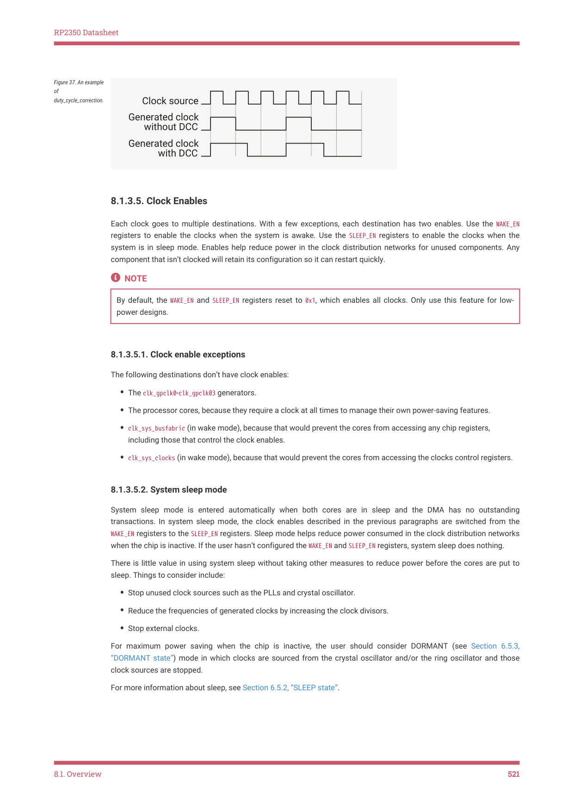

# 8.1.3. Clock generators

8.1.3. Clock generators

The clock generators are built on a standard design that incorporates clock source multiplexing, division, duty cycle

correction, and sleep mode enabling. To save chip area and power, some individual clock generators omit certain

features.

Figure 35. A generic

clock generator

RP2350 has several clock generators, which are listed below.

Table 541. RP2350

clock generators
Clock
Description
Nominal Frequency

clk_gpout0
Clock output to GPIO. Can be used to

clock external devices or debug on

chip clocks with a logic analyser or

clk_ref
Reference clock that is always running

unless in DORMANT mode. Runs from

ring oscillator (ROSC) at power-up but

can be switched to crystal oscillator

8.1. Overview
518

RP2350 Datasheet

| Clock | Description | Nominal Frequency |
| --- | --- | --- |
| clk sys _ | System clock that is always running unless in DORMANT mode. Runs from clk ref at power-up, but is typically _ switched to a PLL. | 150MHz |
| clk peri _ | Peripheral clock. Typically runs from clk sys but allows peripherals to run at _ a consistent speed if clk sys is _ changed by software. | 12 - 150MHz |
| clk usb _ | USB reference clock. Must be 48MHz. | 48MHz |
| clk adc _ | ADC reference clock. Must be 48MHz. | 48MHz |
| clk hstx _ | HSTX clock. | 150MHz |

For a full list of clock sources for each clock generator, see the appropriate CTRL register. For example, CLK_SYS_CTRL.

8.1.3.2. Multiplexers

All clock generators have a multiplexer referred to as the auxiliary (aux) mux. This mux has a conventional design

whose output will glitch when changing the select control. The reference clock (clk_ref) and the system clock (clk_sys)

have an additional multiplexer referred to as the glitchless mux. The glitchless mux can switch between clock sources

without generating a glitch on the output.

Before switching the clock source of an auxiliary mux you must either:

• Temporarily switch the glitchless mux away from aux (if a glitchless mux is available).
• Temporarily disable the clock generator using its CTRL_ENABLE bit.
• Hold the destination in reset so that a potential clock glitch doesn’t cause undefined operation.

Failure to do at least one of the above can cause a glitch on the clock input of all hardware currently clocked by this

clock generator. Avoid clock glitches at all costs; they can corrupt the logic running from the clock.

Clock generators require two cycles of the source clock to stop the output and two cycles of the new source to restart

the output. Wait for the generator to stop before changing the auxiliary mux. When the destination clock is much slower

than the system clock, there is a danger that software changes the aux mux source before the clock generator has

come to a safe halt. Avoid this by polling the clock generator’s CTRL_ENABLED status until it matches the value of

CTRL_ENABLE.

The glitchless mux is only implemented for always-on clocks. On RP2350, the always-on clocks are the reference clock

(clk_ref) and the system clock (clk_sys). Such clocks must run continuously unless the chip is in DORMANT mode. The

glitchless mux has a status output (SELECTED) that indicates which source is selected. You can read this status output

from software to confirm that a change of clock source has completed.

The recommended control sequences are as follows.

To switch between clock sources for the glitchless mux:

1. Switch the glitchless mux to an alternate source.

2. Poll the SELECTED register until the switch completes.

To switch between clock sources for the aux mux when the generator has a glitchless mux:

1. Switch the glitchless mux to a source that isn’t the aux mux.

2. Poll the SELECTED register until the switch completes.

3. Change the auxiliary mux select control.

8.1. Overview
519

RP2350 Datasheet

4. Switch the glitchless mux back to the aux mux.

5. If required, poll the SELECTED register until the switch completes.

To switch between clock sources for the aux mux when the generator does not have a glitchless mux:

1. Disable the clock divider.

2. Wait for the generated clock to stop (two cycles of the clock source).

3. Change the auxiliary mux select control.

4. Enable the clock divider.

5. If required, wait for the clock generator to restart (two cycles of the clock source).

See Section 8.1.6.1, “Configuring a clock generator” for a code example of this.

8.1.3.3. Divider

A fully featured divider divides by a fractional number in the range 1.0 to 216. Fractional division is achieved by toggling

between 2 integer divisors; this yields a jittery clock that might be unsuitable for some applications. For example, when

dividing by 2.4, the divider divides by 2 for 3 cycles and by 3 for 2 cycles. For divisors with large integer components, the

jitter will be much smaller and less critical.

Figure 36. An example

of fractional division.

All dividers support on-the-fly divisor changes: the output clock can switch cleanly from one divisor to another. The

clock generator does not need to be stopped during clock divisor changes, because the dividers synchronise the divisor

change to the end of the clock cycle. Similarly, dividers synchronise the enable to the end of the clock cycle to avoid

glitches when the clock generator is enabled or disabled. Clock generators for always-on clocks are permanently

enabled and therefore do not have an enable control.

In the event that a clock generator locks up and never completes the current clock cycle, it can be forced to stop using

the KILL control. This can result in an output glitch, which can corrupt the logic driven by the clock. Always reset the

destination logic before using the KILL control. Clock generators for always-on clocks are permanently active and

therefore do not have a KILL control.

This clock generator design has been used in numerous chips and has never been known to lock up. The KILL control

is inelegant and unnecessary and should not be used as an alternative to the enable.

8.1.3.4. Duty cycle correction

The divider operates on the rising edge of the input clock, so it does not generate an even duty cycle clock when dividing

by odd numbers. For example, divide by 3 gives a duty cycle of 33.3%, and divide by 5 gives a duty cycle of 40%.

If enabled, duty cycle correction logic will shift the falling edge of the output clock to the falling edge of the input clock

and restore a 50% duty cycle. The duty cycle correction can be enabled and disabled while the clock is running. It

doesn’t operate when dividing by an even number.

8.1. Overview
520

RP2350 Datasheet

Figure 37. An example

of

duty_cycle_correction.

Each clock goes to multiple destinations. With a few exceptions, each destination has two enables. Use the WAKE_EN

registers to enable the clocks when the system is awake. Use the SLEEP_EN registers to enable the clocks when the

system is in sleep mode. Enables help reduce power in the clock distribution networks for unused components. Any

component that isn’t clocked will retain its configuration so it can restart quickly.

By default, the WAKE_EN and SLEEP_EN registers reset to 0x1, which enables all clocks. Only use this feature for low-

8.1.3.5.1. Clock enable exceptions

The following destinations don’t have clock enables:

• The clk_gpclk0-clk_gpclk03 generators.
• The processor cores, because they require a clock at all times to manage their own power-saving features.
• clk_sys_busfabric (in wake mode), because that would prevent the cores from accessing any chip registers,

including those that control the clock enables.
• clk_sys_clocks (in wake mode), because that would prevent the cores from accessing the clocks control registers.

8.1.3.5.2. System sleep mode

System sleep mode is entered automatically when both cores are in sleep and the DMA has no outstanding

transactions. In system sleep mode, the clock enables described in the previous paragraphs are switched from the

WAKE_EN registers to the SLEEP_EN registers. Sleep mode helps reduce power consumed in the clock distribution networks

when the chip is inactive. If the user hasn’t configured the WAKE_EN and SLEEP_EN registers, system sleep does nothing.

There is little value in using system sleep without taking other measures to reduce power before the cores are put to

sleep. Things to consider include:

• Stop unused clock sources such as the PLLs and crystal oscillator.
• Reduce the frequencies of generated clocks by increasing the clock divisors.
• Stop external clocks.

For maximum power saving when the chip is inactive, the user should consider DORMANT (see Section 6.5.3,

“DORMANT state”) mode in which clocks are sourced from the crystal oscillator and/or the ring oscillator and those

clock sources are stopped.

For more information about sleep, see Section 6.5.2, “SLEEP state”.

8.1. Overview
521
