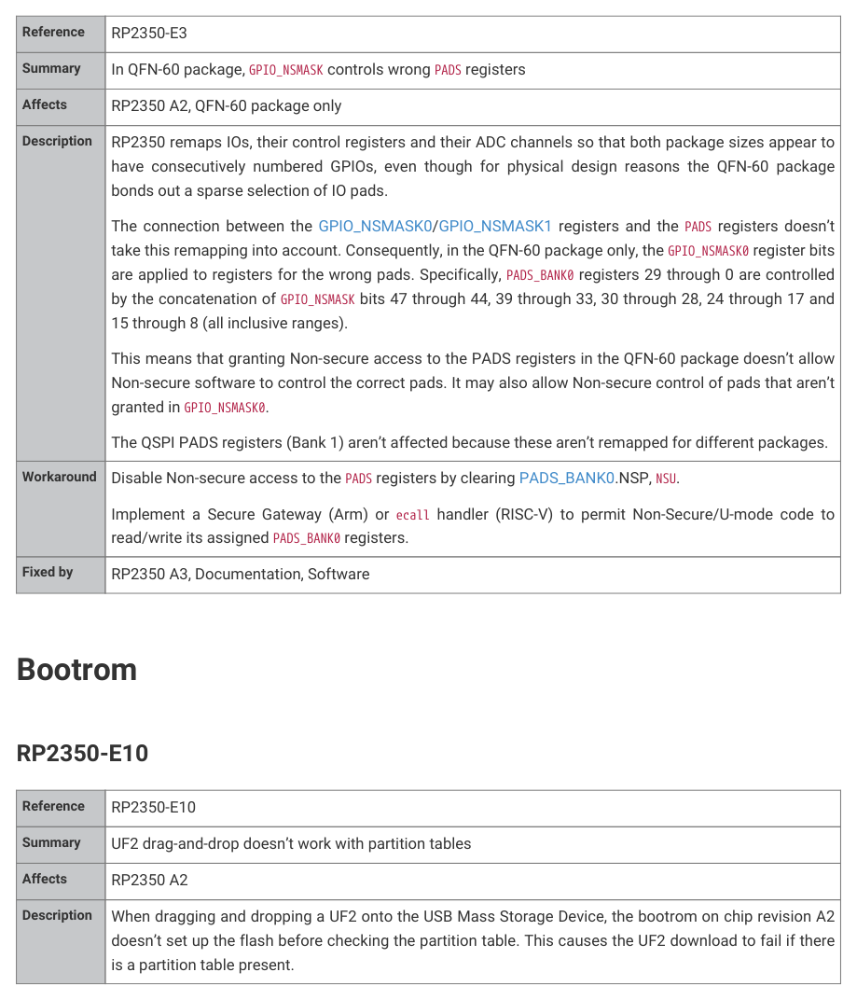

# Bootrom Changes

RP2350 Datasheet

Bootrom Changes

The A4 bootrom introduces the following changes:

• Fix RP2350-E18: the RP2350 forever fails to boot if FLASH_PARTITION_SLOT_SIZE contains an invalid ECC bit

pattern. This issue is a consequence of RP2350-E17 (a guarded read on a single ECC OTP row causes a fault if the

data in the adjacent row isn’t also valid ECC data). The underlying hardware issue isn’t resolved, but the bootrom

avoids the issue in this instance.
• Mitigate RP2350-E24: an attacker with physical access to the chip, moderate hardware, and the ability to

physically glitch the CPU at precise times, could cause unsigned code execution on a secured RP2350. The A4

bootrom contains additional fault injection mitigations for this vulnerability, and for other potential vulnerabilities

with the same underlying mechanism.
• Fix RP2350-E25: a LOAD_MAP that uses non-word sizes previously didn’t cause an error. The bootrom now

correctly rejects these structures.

RP2350 A4
1356

RP2350 Datasheet

Appendix E: Errata

Alphabetical by section.

ACCESSCTRL

