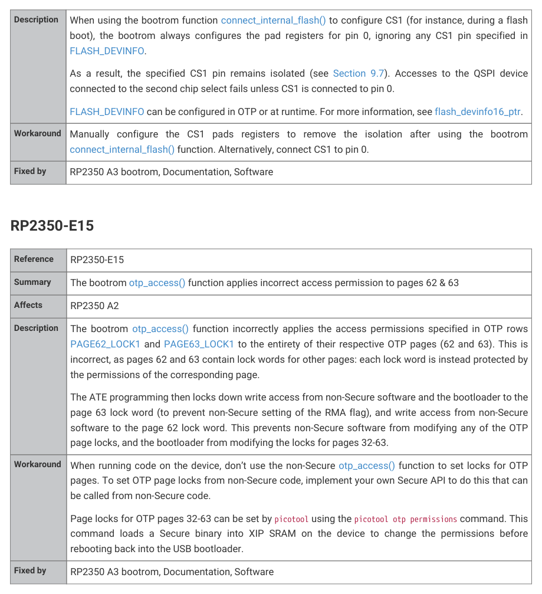

# RP2350-E15

| Reference | RP2350-E15 |
| --- | --- |
| Summary | The bootrom otp_access() function applies incorrect access permission to pages 62 & 63 |
| Affects | RP2350 A2 |
| Description | The bootrom otp_access() function incorrectly applies the access permissions specified in OTP rows PAGE62_LOCK1 and PAGE63_LOCK1 to the entirety of their respective OTP pages (62 and 63). This is incorrect, as pages 62 and 63 contain lock words for other pages: each lock word is instead protected by the permissions of the corresponding page. The ATE programming then locks down write access from non-Secure software and the bootloader to the page 63 lock word (to prevent non-Secure setting of the RMA flag), and write access from non-Secure software to the page 62 lock word. This prevents non-Secure software from modifying any of the OTP page locks, and the bootloader from modifying the locks for pages 32-63. |
| Workaround | When running code on the device, don’t use the non-Secure otp_access() function to set locks for OTP pages. To set OTP page locks from non-Secure code, implement your own Secure API to do this that can be called from non-Secure code. Page locks for OTP pages 32-63 can be set by picotool using the picotool otp permissions command. This command loads a Secure binary into XIP SRAM on the device to change the permissions before rebooting back into the USB bootloader. |
| Fixed by | RP2350 A3 bootrom, Documentation, Software |
