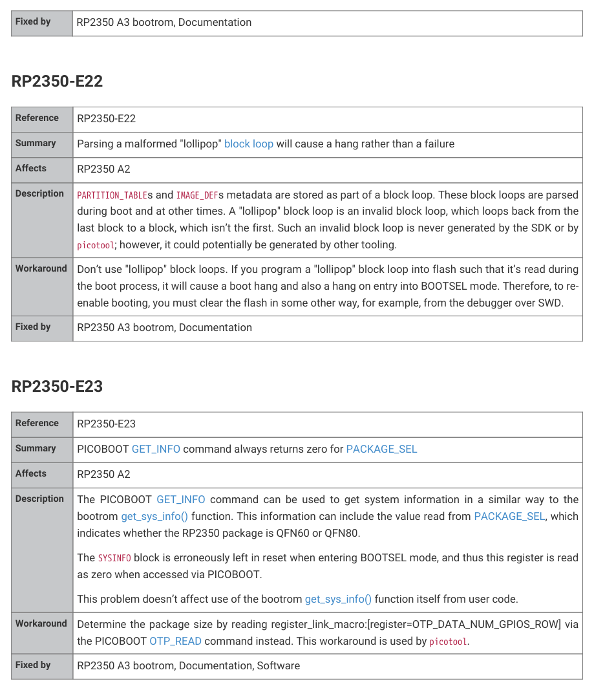

# RP2350-E23

| Reference | RP2350-E23 |
| --- | --- |
| Summary | PICOBOOT GET_INFO command always returns zero for PACKAGE_SEL |
| Affects | RP2350 A2 |
| Description | The PICOBOOT GET_INFO command can be used to get system information in a similar way to the bootrom get_sys_info() function. This information can include the value read from PACKAGE_SEL, which indicates whether the RP2350 package is QFN60 or QFN80. The SYSINFO block is erroneously left in reset when entering BOOTSEL mode, and thus this register is read as zero when accessed via PICOBOOT. This problem doesn’t affect use of the bootrom get_sys_info() function itself from user code. |
| Workaround | Determine the package size by reading register_link_macro:[register=OTP_DATA_NUM_GPIOS_ROW] via the PICOBOOT OTP_READ command instead. This workaround is used by picotool. |
| Fixed by | RP2350 A3 bootrom, Documentation, Software |
