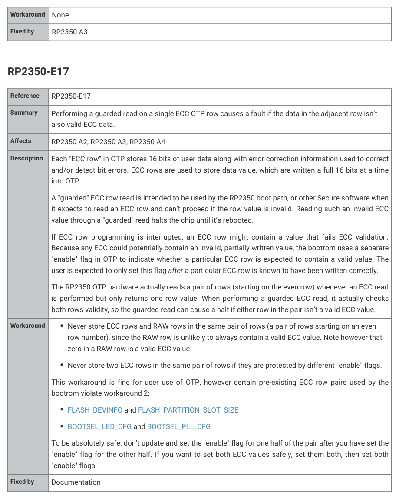
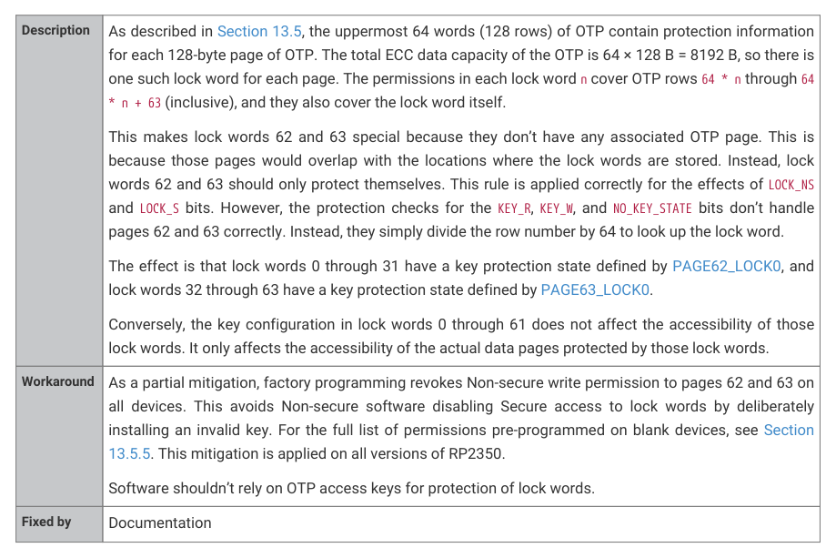

# RP2350-E28

RP2350-E28

| Reference | RP2350-E28 |
| --- | --- |
| Summary | OTP keys for pages 62/63 are applied to all lock words 0 through 63 |
| Affects | RP2350 A2, RP2350 A3, RP2350 A4 |
| Description | As described in Section 13.5, the uppermost 64 words (128 rows) of OTP contain protection information for each 128-byte page of OTP. The total ECC data capacity of the OTP is 64 × 128 B = 8192 B, so there is one such lock word for each page. The permissions in each lock word n cover OTP rows 64 * n through 64 * n + 63 (inclusive), and they also cover the lock word itself. This makes lock words 62 and 63 special because they don’t have any associated OTP page. This is because those pages would overlap with the locations where the lock words are stored. Instead, lock words 62 and 63 should only protect themselves. This rule is applied correctly for the effects of LOCK NS _ and LOCK S bits. However, the protection checks for the KEY R, KEY W, and NO KEY STATE bits don’t handle _ _ _ _ _ pages 62 and 63 correctly. Instead, they simply divide the row number by 64 to look up the lock word. The effect is that lock words 0 through 31 have a key protection state defined by PAGE62_LOCK0, and lock words 32 through 63 have a key protection state defined by PAGE63_LOCK0. Conversely, the key configuration in lock words 0 through 61 does not affect the accessibility of those lock words. It only affects the accessibility of the actual data pages protected by those lock words. |
| Workaround | As a partial mitigation, factory programming revokes Non-secure write permission to pages 62 and 63 on all devices. This avoids Non-secure software disabling Secure access to lock words by deliberately installing an invalid key. For the full list of permissions pre-programmed on blank devices, see Section 13.5.5. This mitigation is applied on all versions of RP2350. Software shouldn’t rely on OTP access keys for protection of lock words. |
| Fixed by | Documentation |

OTP
1371

RP2350 Datasheet

RCP

