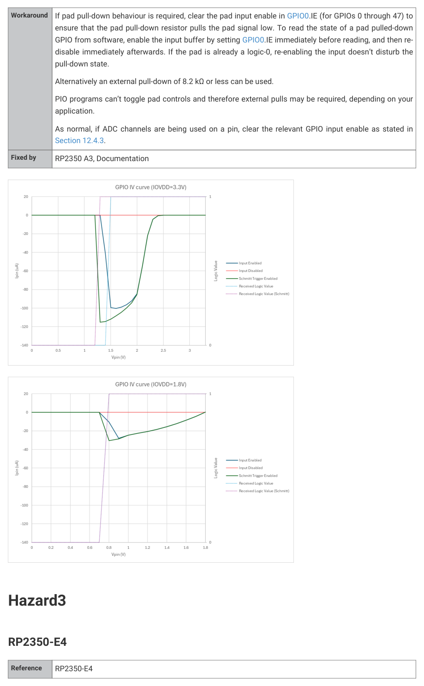
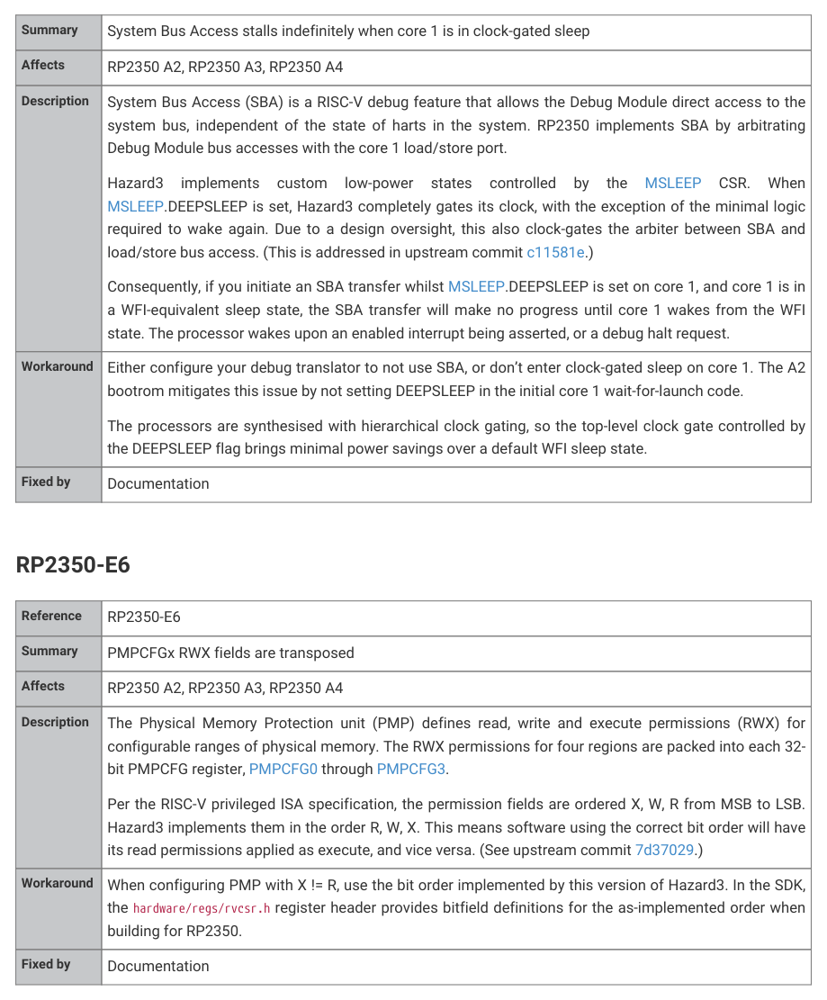

# RP2350-E4

Hazard3
1368

RP2350 Datasheet

| Summary | System Bus Access stalls indefinitely when core 1 is in clock-gated sleep |
| --- | --- |
| Affects | RP2350 A2, RP2350 A3, RP2350 A4 |
| Description | System Bus Access (SBA) is a RISC-V debug feature that allows the Debug Module direct access to the system bus, independent of the state of harts in the system. RP2350 implements SBA by arbitrating Debug Module bus accesses with the core 1 load/store port. Hazard3 implements custom low-power states controlled by the MSLEEP CSR. When MSLEEP.DEEPSLEEP is set, Hazard3 completely gates its clock, with the exception of the minimal logic required to wake again. Due to a design oversight, this also clock-gates the arbiter between SBA and load/store bus access. (This is addressed in upstream commit c11581e.) Consequently, if you initiate an SBA transfer whilst MSLEEP.DEEPSLEEP is set on core 1, and core 1 is in a WFI-equivalent sleep state, the SBA transfer will make no progress until core 1 wakes from the WFI state. The processor wakes upon an enabled interrupt being asserted, or a debug halt request. |
| Workaround | Either configure your debug translator to not use SBA, or don’t enter clock-gated sleep on core 1. The A2 bootrom mitigates this issue by not setting DEEPSLEEP in the initial core 1 wait-for-launch code. The processors are synthesised with hierarchical clock gating, so the top-level clock gate controlled by the DEEPSLEEP flag brings minimal power savings over a default WFI sleep state. |
| Fixed by | Documentation |

## Embedded Images

