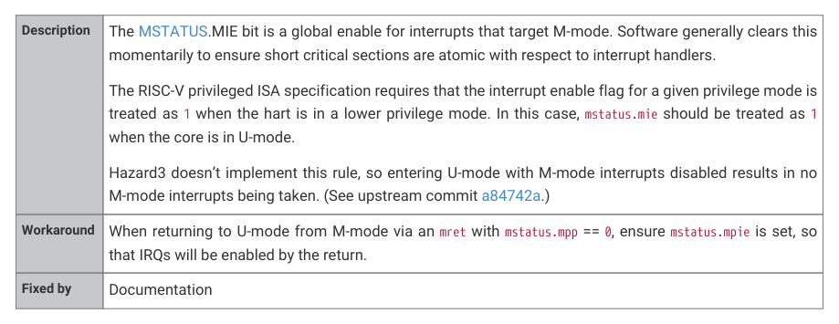

# RP2350-E7

RP2350-E7

| Reference | RP2350-E7 |
| --- | --- |
| Summary | U-mode doesn’t ignore mstatus.mie |
| Affects | RP2350 A2, RP2350 A3, RP2350 A4 |
| Description | The MSTATUS.MIE bit is a global enable for interrupts that target M-mode. Software generally clears this momentarily to ensure short critical sections are atomic with respect to interrupt handlers. The RISC-V privileged ISA specification requires that the interrupt enable flag for a given privilege mode is treated as 1 when the hart is in a lower privilege mode. In this case, mstatus.mie should be treated as 1 when the core is in U-mode. Hazard3 doesn’t implement this rule, so entering U-mode with M-mode interrupts disabled results in no M-mode interrupts being taken. (See upstream commit a84742a.) |
| Workaround | When returning to U-mode from M-mode via an mret with mstatus.mpp == 0, ensure mstatus.mpie is set, so that IRQs will be enabled by the return. |
| Fixed by | Documentation |

Hazard3
1369

RP2350 Datasheet

OTP

