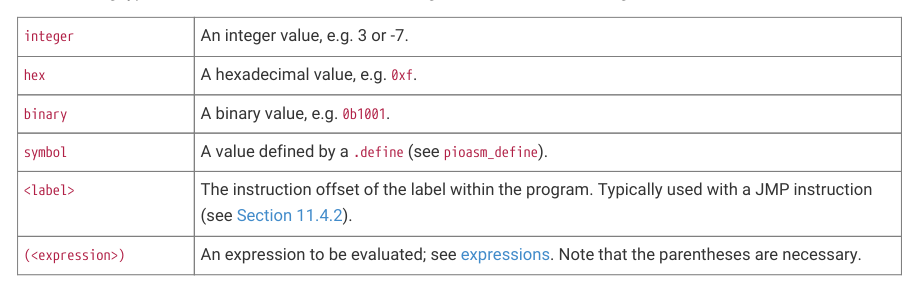

# 11.3.2. Values

11.3.2. Values

The following types of values can be used to define integer numbers or branch targets:

| integer | An integer value, e.g. 3 or -7. |
| --- | --- |
| hex | A hexadecimal value, e.g. 0xf. |
| binary | A binary value, e.g. 0b1001. |
| symbol | A value defined by a .define (see pioasm define). _ |
| <label> | The instruction offset of the label within the program. Typically used with a JMP instruction (see Section 11.4.2). |
| (<expression>) | An expression to be evaluated; see expressions. Note that the parentheses are necessary. |

Table 978. Values in

