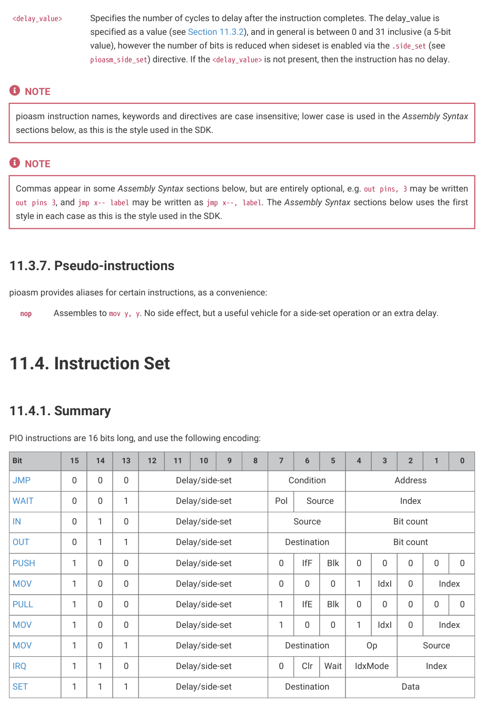
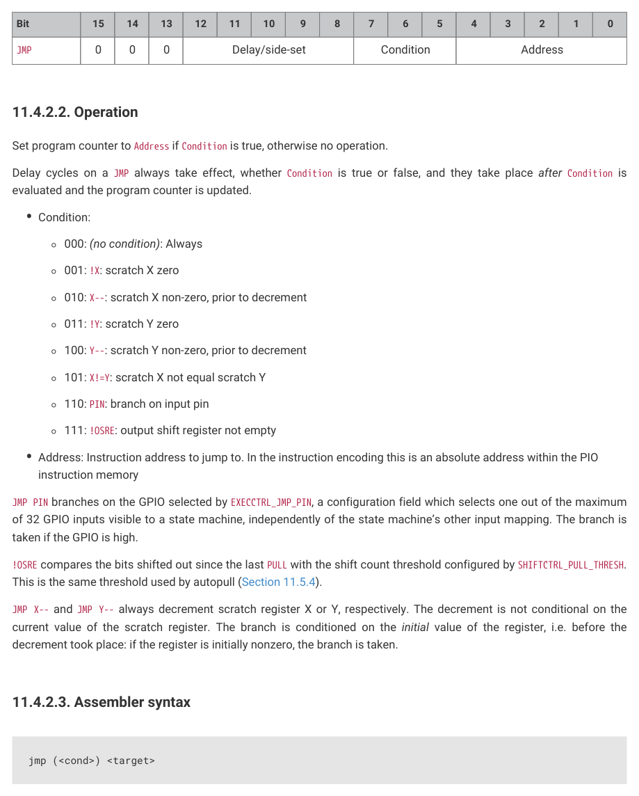

# 11.4.1. Summary

PIO instructions are 16 bits long, and use the following encoding:

Table 980. PIO

instruction encoding
Bit
15
14
13
12
11
10
9
8
7
6
5
4
3
2
1
0

JMP
0
0
0
Delay/side-set
Condition
Address

WAIT
0
0
1
Delay/side-set
Pol
Source
Index

IN
0
1
0
Delay/side-set
Source
Bit count

OUT
0
1
1
Delay/side-set
Destination
Bit count

PUSH
1
0
0
Delay/side-set
0
IfF
Blk
0
0
0
0
0

MOV
1
0
0
Delay/side-set
0
0
0
1
IdxI
0
Index

PULL
1
0
0
Delay/side-set
1
IfE
Blk
0
0
0
0
0

MOV
1
0
0
Delay/side-set
1
0
0
1
IdxI
0
Index

MOV
1
0
1
Delay/side-set
Destination
Op
Source

IRQ
1
1
0
Delay/side-set
0
Clr
Wait
IdxMode
Index

SET
1
1
1
Delay/side-set
Destination
Data

All PIO instructions execute in one clock cycle.

The function of the 5-bit Delay/side-set field depends on the state machine’s SIDESET_COUNT configuration:

• Up to 5 LSBs (5 minus SIDESET_COUNT) encode a number of idle cycles inserted between this instruction and the next.

11.4. Instruction Set
889

RP2350 Datasheet

• Up to 5 MSBs, set by SIDESET_COUNT, encode a side-set (Section 11.5.1), which can assert a constant onto some

GPIOs, concurrently with main instruction execution.

