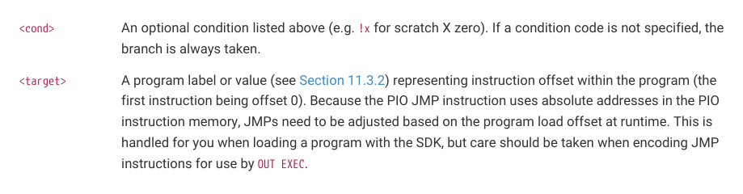
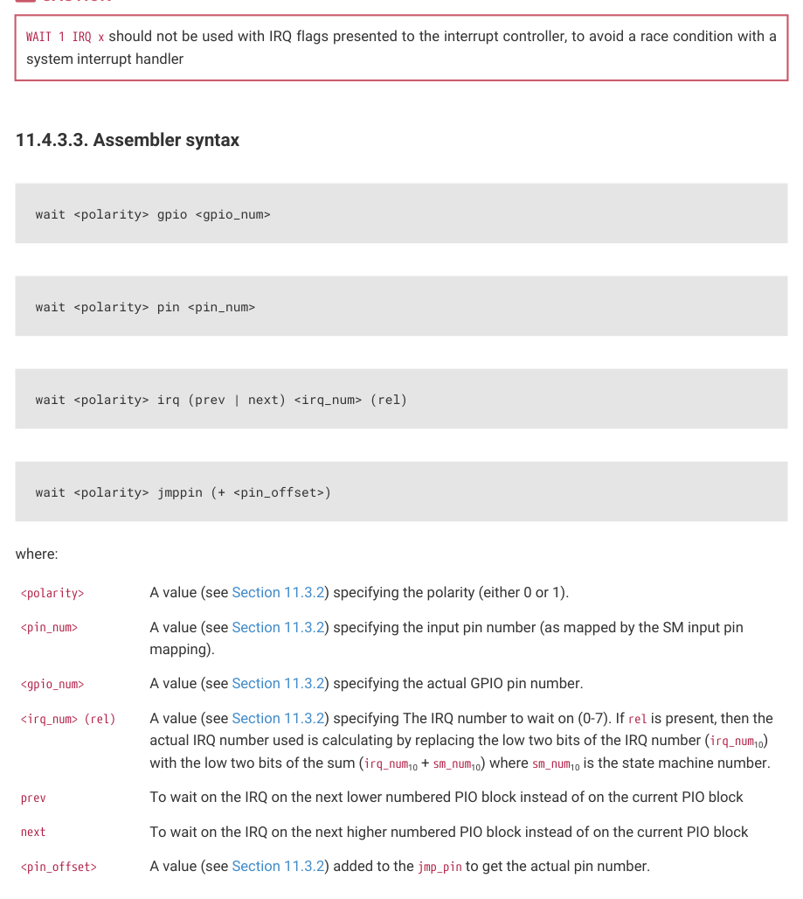

# 11.4.3. WAIT

11.4.3. WAIT

11.4.3.1. Encoding

| Bit | 15 | 14 | 13 | 12 | 11 | 10 | 9 | 8 | 7 | 6 | 5 | 4 | 3 | 2 | 1 | 0 |
| --- | --- | --- | --- | --- | --- | --- | --- | --- | --- | --- | --- | --- | --- | --- | --- | --- |
| WAIT | 0 | 0 | 1 |  | Del | ay/side | -set |  | Pol | Sou | rce |  |  | Index |  |  |

11.4.3.2. Operation

Stall until some condition is met.

Like all stalling instructions (Section 11.2.5), delay cycles begin after the instruction completes. That is, if any delay

cycles are present, they do not begin counting until after the wait condition is met.

• Polarity:

◦1: wait for a 1.

◦0: wait for a 0.
• Source: what to wait on. Values are:

◦00: GPIO: System GPIO input selected by Index. This is an absolute GPIO index, and is not affected by the state

machine’s input IO mapping.

◦01: PIN: Input pin selected by Index. This state machine’s input IO mapping is applied first, and then Index

selects which of the mapped bits to wait on. In other words, the pin is selected by adding Index to the

PINCTRL_IN_BASE configuration, modulo 32.

◦10: IRQ: PIO IRQ flag selected by Index

◦11: JMPPIN: wait on the pin indexed by the PINCTRL_JMP_PIN configuration, plus an Index in the range 0-3, all

modulo 32. Other values of Index are reserved.
• Index: which pin or bit to check.

WAIT x IRQ behaves slightly differently from other WAIT sources:

• If Polarity is 1, the selected IRQ flag is cleared by the state machine upon the wait condition being met.
• The flag index is decoded in the same way as the IRQ index field, decoding down from the two MSBs (aligning with

the IRQ instruction IdxMode field):

◦00: the three LSBs are used directly to index the IRQ flags in this PIO block.

◦01 (PREV), the instruction references an IRQ from the next-lower-numbered PIO in the system, wrapping to the

highest-numbered PIO if this is PIO0.

◦10 (REL), the state machine ID (0…3) is added to the IRQ index, by way of modulo-4 addition on the two LSBs.

For example, state machine 2 with a flag value of 0x11 will wait on flag 3, and a flag value of 0x13 will wait on

flag 1. This allows multiple state machines running the same program to synchronise with each other.

11.4. Instruction Set
891

RP2350 Datasheet

◦11 (NEXT), the instruction references an IRQ from the next-higher-numbered PIO in the system, wrapping to

PIO0 if this is the highest-numbered PIO.

CAUTION

WAIT 1 IRQ x should not be used with IRQ flags presented to the interrupt controller, to avoid a race condition with a

wait <polarity> gpio <gpio_num>

wait <polarity> irq (prev | next) <irq_num> (rel)

wait <polarity> jmppin (+ <pin_offset>)

| <polarity> | A value (see Section 11.3.2) specifying the polarity (either 0 or 1). |
| --- | --- |
| <pin num> _ | A value (see Section 11.3.2) specifying the input pin number (as mapped by the SM input pin mapping). |
| <gpio num> _ | A value (see Section 11.3.2) specifying the actual GPIO pin number. |
| <irq num> (rel) _ | A value (see Section 11.3.2) specifying The IRQ number to wait on (0-7). If rel is present, then the actual IRQ number used is calculating by replacing the low two bits of the IRQ number (irq num ) _ 10 with the low two bits of the sum (irq num + sm num ) where sm num is the state machine number. _ 10 _ 10 _ 10 |
| prev | To wait on the IRQ on the next lower numbered PIO block instead of on the current PIO block |
| next | To wait on the IRQ on the next higher numbered PIO block instead of on the current PIO block |
| <pin offset> _ | A value (see Section 11.3.2) added to the jmp pin to get the actual pin number. _ |
