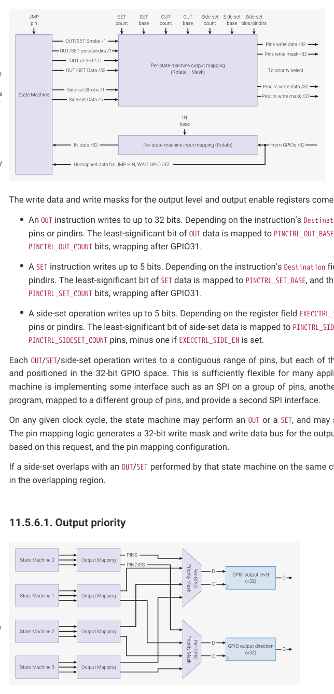

# 11.5.6. GPIO mapping

11.5.6. GPIO mapping

Internally, PIO has a 32-bit register for the output levels of each GPIO it can drive, and another register for the output

enables (Hi/Lo-Z). On every system clock cycle, each state machine can write to some or all of the GPIOs in each of

these registers.

11.5. Functional details
911

RP2350 Datasheet

Figure 54. The state

machine has two

independent output

channels, one shared

by OUT/SET, and

another used by side-

set (which can happen

at any time). Three

independent mappings

(first GPIO, number of

GPIOs) control which

GPIOs OUT, SET and

side-set are directed

to. Input data is

rotated according to

which GPIO is mapped

to the LSB of the IN

data.

The write data and write masks for the output level and output enable registers come from the following sources:

• An OUT instruction writes to up to 32 bits. Depending on the instruction’s Destination field, this is applied to either

pins or pindirs. The least-significant bit of OUT data is mapped to PINCTRL_OUT_BASE, and this mapping continues for

PINCTRL_OUT_COUNT bits, wrapping after GPIO31.
• A SET instruction writes up to 5 bits. Depending on the instruction’s Destination field, this is applied to either pins or

pindirs. The least-significant bit of SET data is mapped to PINCTRL_SET_BASE, and this mapping continues for

PINCTRL_SET_COUNT bits, wrapping after GPIO31.
• A side-set operation writes up to 5 bits. Depending on the register field EXECCTRL_SIDE_PINDIR, this is applied to either

pins or pindirs. The least-significant bit of side-set data is mapped to PINCTRL_SIDESET_BASE, continuing for

PINCTRL_SIDESET_COUNT pins, minus one if EXECCTRL_SIDE_EN is set.

Each OUT/SET/side-set operation writes to a contiguous range of pins, but each of these ranges is independently sized

and positioned in the 32-bit GPIO space. This is sufficiently flexible for many applications. For example, if one state

machine is implementing some interface such as an SPI on a group of pins, another state machine can run the same

program, mapped to a different group of pins, and provide a second SPI interface.

On any given clock cycle, the state machine may perform an OUT or a SET, and may simultaneously perform a side-set.

The pin mapping logic generates a 32-bit write mask and write data bus for the output level and output enable registers,

based on this request, and the pin mapping configuration.

If a side-set overlaps with an OUT/SET performed by that state machine on the same cycle, the side-set takes precedence

Figure 55. Per-GPIO

priority select of write

masks from each

state machine. Each

GPIO considers level

and direction writes

from each of the four

state machines, and

applies the value from

the highest-numbered

state machine.

Each state machine may assert an OUT/SET and a side-set through its pin mapping hardware on each cycle. This

generates 32 bits of write data and write mask for the GPIO output level and output enable registers, from each state

machine.

For each GPIO, PIO collates the writes from all four state machines, and applies the write from the highest-numbered

11.5. Functional details
912

RP2350 Datasheet

state machine. This occurs separately for output levels and output values — it is possible for a state machine to change

both the level and direction of the same pin on the same cycle (e.g. via simultaneous SET and side-set), or for one state

machine to change a GPIO’s direction while another changes that GPIO’s level. If no state machine asserts a write to a

GPIO’s level or direction, the value does not change.

11.5.6.2. Input mapping

The data observed by IN instructions is mapped such that the LSB is the GPIO selected by PINCTRL_IN_BASE, and

successively more-significant bits come from successively higher-numbered GPIOs, wrapping after 31.

In other words, the IN bus is a right-rotate of the GPIO input values, by PINCTRL_IN_BASE. If fewer than 32 GPIOs are

present, the PIO input is padded with zeroes up to 32 bits.

Some instructions, such as WAIT GPIO, use an absolute GPIO number, rather than an index into the IN data bus. In this

case, the right-rotate is not applied.

11.5.6.3. Input synchronisers

To protect PIO from metastabilities, each GPIO input is equipped with a standard 2-flipflop synchroniser. This adds two

cycles of latency to input sampling, but the benefit is that state machines can perform an IN PINS at any point, and will

see only a clean high or low level, not some intermediate value that could disturb the state machine circuitry. This is

absolutely necessary for asynchronous interfaces such as UART RX.

It is possible to bypass these synchronisers, on a per-GPIO basis. This reduces input latency, but it is then up to the user

to guarantee that the state machine does not sample its inputs at inappropriate times. Generally this is only possible for

synchronous interfaces such as SPI. Synchronisers are bypassed by setting the corresponding bit in INPUT_SYNC_BYPASS.

WARNING

Sampling a metastable input can lead to unpredictable state machine behaviour. This should be avoided.

## Embedded Images

