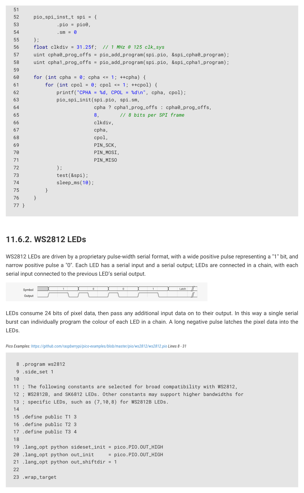
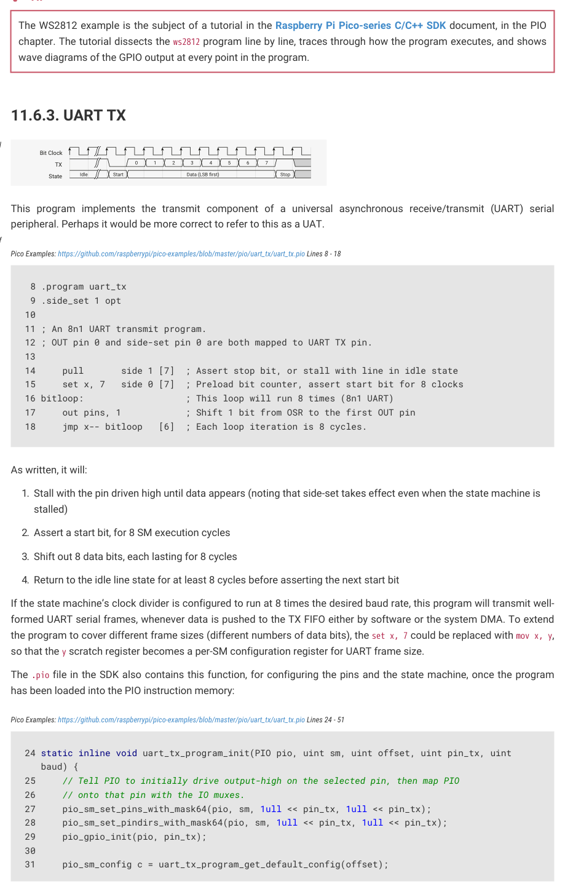

# 11.6.2. WS2812 LEDs

WS2812 LEDs are driven by a proprietary pulse-width serial format, with a wide positive pulse representing a "1" bit, and

narrow positive pulse a "0". Each LED has a serial input and a serial output; LEDs are connected in a chain, with each

serial input connected to the previous LED’s serial output.

1
0
0
1
Latch
Figure 57. WS2812

line format. Wide

positive pulse for 1,

narrow positive pulse

for 0, very long

LEDs consume 24 bits of pixel data, then pass any additional input data on to their output. In this way a single serial

negative pulse for

burst can individually program the colour of each LED in a chain. A long negative pulse latches the pixel data into the

latch enable

Pico Examples: https://github.com/raspberrypi/pico-examples/blob/master/pio/ws2812/ws2812.pio Lines 8 - 31

11 ; The following constants are selected for broad compatibility with WS2812,

12 ; WS2812B, and SK6812 LEDs. Other constants may support higher bandwidths for

13 ; specific LEDs, such as (7,10,8) for WS2812B LEDs.

19 .lang_opt python sideset_init = pico.PIO.OUT_HIGH

20 .lang_opt python out_init     = pico.PIO.OUT_HIGH

21 .lang_opt python out_shiftdir = 1

11.6. Examples
919

RP2350 Datasheet

24 bitloop:

25     out x, 1       side 0 [T3 - 1] ; Side-set still takes place when instruction stalls

26     jmp !x do_zero side 1 [T1 - 1] ; Branch on the bit we shifted out. Positive pulse

27 do_one:

28     jmp  bitloop   side 1 [T2 - 1] ; Continue driving high, for a long pulse

29 do_zero:

30     nop            side 0 [T2 - 1] ; Or drive low, for a short pulse

31 .wrap

This program shifts bits from the OSR into X, and produces a wide or narrow pulse on side-set pin 0, based on the value

of each data bit. Autopull must be configured, with a threshold of 24. Software can then write 24-bit pixel values into the

FIFO, and these will be serialised to a chain of WS2812 LEDs. The .pio file contains a C helper function to set this up:

Pico Examples: https://github.com/raspberrypi/pico-examples/blob/master/pio/ws2812/ws2812.pio Lines 36 - 52

36 static inline void ws2812_program_init(PIO pio, uint sm, uint offset, uint pin, float freq,

   bool rgbw) {

37 

38     pio_gpio_init(pio, pin);

39     pio_sm_set_consecutive_pindirs(pio, sm, pin, 1, true);

40 

41     pio_sm_config c = ws2812_program_get_default_config(offset);

42     sm_config_set_sideset_pins(&c, pin);

43     sm_config_set_out_shift(&c, false, true, rgbw ? 32 : 24);

44     sm_config_set_fifo_join(&c, PIO_FIFO_JOIN_TX);

45 

46     int cycles_per_bit = ws2812_T1 + ws2812_T2 + ws2812_T3;

47     float div = clock_get_hz(clk_sys) / (freq * cycles_per_bit);

48     sm_config_set_clkdiv(&c, div);

49 

50     pio_sm_init(pio, sm, offset, &c);

51     pio_sm_set_enabled(pio, sm, true);

52 }

Because the shift is MSB-first, and our pixels aren’t a power of two size (so we can’t rely on the narrow write replication

behaviour on RP2350 to fan out the bits for us), we need to preshift the values written to the TX FIFO.

Pico Examples: https://github.com/raspberrypi/pico-examples/blob/master/pio/ws2812/ws2812.c Lines 43 - 45

43 static inline void put_pixel(PIO pio, uint sm, uint32_t pixel_grb) {

44     pio_sm_put_blocking(pio, sm, pixel_grb << 8u);

45 }

To DMA the pixels, we could instead set the autopull threshold to 8 bits, set the DMA transfer size to 8 bits, and write a

byte at a time into the FIFO. Each pixel would be 3 one-byte transfers. Because of how the bus fabric and DMA on

RP2350 work, each byte the DMA transfers will appear replicated four times when written to a 32-bit IO register, so

effectively your data is at both ends of the shift register, and you can shift in either direction without worry.

11.6. Examples
920

RP2350 Datasheet


TIP

The WS2812 example is the subject of a tutorial in the Raspberry Pi Pico-series C/C++ SDK document, in the PIO

chapter. The tutorial dissects the ws2812 program line by line, traces through how the program executes, and shows

wave diagrams of the GPIO output at every point in the program.
