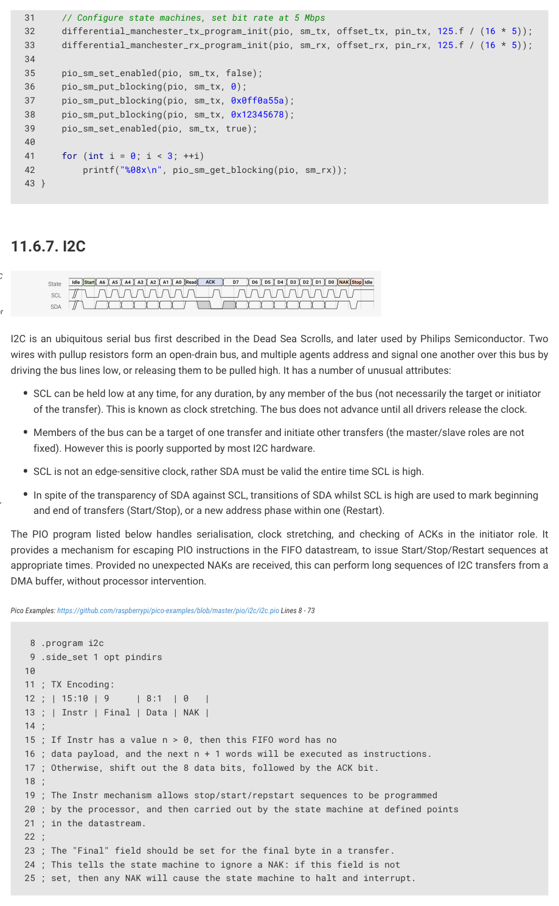

# 11.6.7. I2C

Figure 61. A 1-byte I2C

read transfer. In the

idle state, both lines

float high. The initiator

drives SDA low (a

Start condition),

I2C is an ubiquitous serial bus first described in the Dead Sea Scrolls, and later used by Philips Semiconductor. Two

followed by 7 address

wires with pullup resistors form an open-drain bus, and multiple agents address and signal one another over this bus by

bits A6-A0, and a

driving the bus lines low, or releasing them to be pulled high. It has a number of unusual attributes:

direction bit

(Read/nWrite). The

• SCL can be held low at any time, for any duration, by any member of the bus (not necessarily the target or initiator

target drives SDA low

to acknowledge the

of the transfer). This is known as clock stretching. The bus does not advance until all drivers release the clock.
• Members of the bus can be a target of one transfer and initiate other transfers (the master/slave roles are not

address (ACK). Data

bytes follow. The

target serialises data

fixed). However this is poorly supported by most I2C hardware.
• SCL is not an edge-sensitive clock, rather SDA must be valid the entire time SCL is high.
• In spite of the transparency of SDA against SCL, transitions of SDA whilst SCL is high are used to mark beginning

on SDA, clocked out

by SCL. Every 9th

clock, the initiator

pulls SDA low to

acknowledge the data,

and end of transfers (Start/Stop), or a new address phase within one (Restart).

except on the last

byte, where it leaves

The PIO program listed below handles serialisation, clock stretching, and checking of ACKs in the initiator role. It

the line high (NAK).

Releasing SDA whilst

provides a mechanism for escaping PIO instructions in the FIFO datastream, to issue Start/Stop/Restart sequences at

SCL is high is a Stop

appropriate times. Provided no unexpected NAKs are received, this can perform long sequences of I2C transfers from a

condition, returning

DMA buffer, without processor intervention.

the bus to idle.

Pico Examples: https://github.com/raspberrypi/pico-examples/blob/master/pio/i2c/i2c.pio Lines 8 - 73

12 ; | 15:10 | 9     | 8:1  | 0   |

13 ; | Instr | Final | Data | NAK |

15 ; If Instr has a value n > 0, then this FIFO word has no

16 ; data payload, and the next n + 1 words will be executed as instructions.

17 ; Otherwise, shift out the 8 data bits, followed by the ACK bit.

19 ; The Instr mechanism allows stop/start/repstart sequences to be programmed

20 ; by the processor, and then carried out by the state machine at defined points

23 ; The "Final" field should be set for the final byte in a transfer.

24 ; This tells the state machine to ignore a NAK: if this field is not

25 ; set, then any NAK will cause the state machine to halt and interrupt.

11.6. Examples
932

RP2350 Datasheet

26 ;

27 ; Autopull should be enabled, with a threshold of 16.

28 ; Autopush should be enabled, with a threshold of 8.

29 ; The TX FIFO should be accessed with halfword writes, to ensure

30 ; the data is immediately available in the OSR.

31 ;

32 ; Pin mapping:

33 ; - Input pin 0 is SDA, 1 is SCL (if clock stretching used)

34 ; - Jump pin is SDA

35 ; - Side-set pin 0 is SCL

36 ; - Set pin 0 is SDA

37 ; - OUT pin 0 is SDA

38 ; - SCL must be SDA + 1 (for wait mapping)

39 ;

40 ; The OE outputs should be inverted in the system IO controls!

41 ; (It's possible for the inversion to be done in this program,

42 ; but costs 2 instructions: 1 for inversion, and one to cope

43 ; with the side effect of the MOV on TX shift counter.)

44 

45 do_nack:

46     jmp y-- entry_point        ; Continue if NAK was expected

47     irq wait 0 rel             ; Otherwise stop, ask for help

48 

49 do_byte:

50     set x, 7                   ; Loop 8 times

51 bitloop:

52     out pindirs, 1         [7] ; Serialise write data (all-ones if reading)

53     nop             side 1 [2] ; SCL rising edge

54     wait 1 pin, 1          [4] ; Allow clock to be stretched

55     in pins, 1             [7] ; Sample read data in middle of SCL pulse

56     jmp x-- bitloop side 0 [7] ; SCL falling edge

57 

58     ; Handle ACK pulse

59     out pindirs, 1         [7] ; On reads, we provide the ACK.

60     nop             side 1 [7] ; SCL rising edge

61     wait 1 pin, 1          [7] ; Allow clock to be stretched

62     jmp pin do_nack side 0 [2] ; Test SDA for ACK/NAK, fall through if ACK

63 

64 public entry_point:

65 .wrap_target

66     out x, 6                   ; Unpack Instr count

67     out y, 1                   ; Unpack the NAK ignore bit

68     jmp !x do_byte             ; Instr == 0, this is a data record.

69     out null, 32               ; Instr > 0, remainder of this OSR is invalid

70 do_exec:

71     out exec, 16               ; Execute one instruction per FIFO word

72     jmp x-- do_exec            ; Repeat n + 1 times

73 .wrap

The IO mapping required by the I2C program is quite complex, due to the different ways that the two serial lines must be

driven and sampled. One interesting feature is that state machine must drive the output enable high when the output is

low, since the bus is open-drain, so the sense of the data is inverted. This could be handled in the PIO program (e.g. mov

osr, ~osr), but instead we can use the IO controls on RP2350 to perform this inversion in the GPIO muxes, saving an

instruction.

Pico Examples: https://github.com/raspberrypi/pico-examples/blob/master/pio/i2c/i2c.pio Lines 81 - 121

 81 static inline void i2c_program_init(PIO pio, uint sm, uint offset, uint pin_sda, uint

    pin_scl) {

 82     assert(pin_scl == pin_sda + 1);

 83     pio_sm_config c = i2c_program_get_default_config(offset);

11.6. Examples
933

RP2350 Datasheet

 84 

 85     // IO mapping

 86     sm_config_set_out_pins(&c, pin_sda, 1);

 87     sm_config_set_set_pins(&c, pin_sda, 1);

 88     sm_config_set_in_pins(&c, pin_sda);

 89     sm_config_set_sideset_pins(&c, pin_scl);

 90     sm_config_set_jmp_pin(&c, pin_sda);

 91 

 92     sm_config_set_out_shift(&c, false, true, 16);

 93     sm_config_set_in_shift(&c, false, true, 8);

 94 

 95     float div = (float)clock_get_hz(clk_sys) / (32 * 100000);

 96     sm_config_set_clkdiv(&c, div);

 97 

 98     // Try to avoid glitching the bus while connecting the IOs. Get things set

 99     // up so that pin is driven down when PIO asserts OE low, and pulled up

100     // otherwise.

101     gpio_pull_up(pin_scl);

102     gpio_pull_up(pin_sda);

103     uint32_t both_pins = (1u << pin_sda) | (1u << pin_scl);

104     pio_sm_set_pins_with_mask(pio, sm, both_pins, both_pins);

105     pio_sm_set_pindirs_with_mask(pio, sm, both_pins, both_pins);

106     pio_gpio_init(pio, pin_sda);

107     gpio_set_oeover(pin_sda, GPIO_OVERRIDE_INVERT);

108     pio_gpio_init(pio, pin_scl);

109     gpio_set_oeover(pin_scl, GPIO_OVERRIDE_INVERT);

110     pio_sm_set_pins_with_mask(pio, sm, 0, both_pins);

111 

112     // Clear IRQ flag before starting, and make sure flag doesn't actually

113     // assert a system-level interrupt (we're using it as a status flag)

114     pio_set_irq0_source_enabled(pio, (enum pio_interrupt_source) ((uint) pis_interrupt0 +

    sm), false);

115     pio_set_irq1_source_enabled(pio, (enum pio_interrupt_source) ((uint) pis_interrupt0 +

    sm), false);

116     pio_interrupt_clear(pio, sm);

117 

118     // Configure and start SM

119     pio_sm_init(pio, sm, offset + i2c_offset_entry_point, &c);

120     pio_sm_set_enabled(pio, sm, true);

121 }

We can also use the PIO assembler to generate a table of instructions for passing through the FIFO, for

Start/Stop/Restart conditions.

Pico Examples: https://github.com/raspberrypi/pico-examples/blob/master/pio/i2c/i2c.pio Lines 126 - 136

126 .program set_scl_sda

127 .side_set 1 opt

128 

129 ; Assemble a table of instructions which software can select from, and pass

130 ; into the FIFO, to issue START/STOP/RSTART. This isn't intended to be run as

131 ; a complete program.

132 

133     set pindirs, 0 side 0 [7] ; SCL = 0, SDA = 0

134     set pindirs, 1 side 0 [7] ; SCL = 0, SDA = 1

135     set pindirs, 0 side 1 [7] ; SCL = 1, SDA = 0

136     set pindirs, 1 side 1 [7] ; SCL = 1, SDA = 1

The example code does blocking software IO on the state machine’s FIFOs, to avoid the extra complexity of setting up

the system DMA. For example, an I2C start condition is enqueued like so:

11.6. Examples
934

RP2350 Datasheet

Pico Examples: https://github.com/raspberrypi/pico-examples/blob/master/pio/i2c/pio_i2c.c Lines 69 - 74

69 void pio_i2c_start(PIO pio, uint sm) {

70     pio_i2c_put_or_err(pio, sm, 2u << PIO_I2C_ICOUNT_LSB);                         // Escape

   code for 3 instruction sequence

71     pio_i2c_put_or_err(pio, sm, set_scl_sda_program_instructions[I2C_SC1_SD0]);    // We are

   already in idle state, just pull SDA low

72     pio_i2c_put_or_err(pio, sm, set_scl_sda_program_instructions[I2C_SC0_SD0]);    // Also

   pull clock low so we can present data

73     pio_i2c_put_or_err(pio, sm, pio_encode_mov(pio_isr, pio_null));                // Ensure

   ISR counter is clear following a write

Because I2C can go wrong at so many points, we need to be able to check the error flag asserted by the state machine,

clear the halt and restart it, before asserting a Stop condition and releasing the bus.

Pico Examples: https://github.com/raspberrypi/pico-examples/blob/master/pio/i2c/pio_i2c.c Lines 15 - 17

15 bool pio_i2c_check_error(PIO pio, uint sm) {

16     return pio_interrupt_get(pio, sm);

Pico Examples: https://github.com/raspberrypi/pico-examples/blob/master/pio/i2c/pio_i2c.c Lines 19 - 23

19 void pio_i2c_resume_after_error(PIO pio, uint sm) {

20     pio_sm_drain_tx_fifo(pio, sm);

21     pio_sm_exec(pio, sm, (pio->sm[sm].execctrl & PIO_SM0_EXECCTRL_WRAP_BOTTOM_BITS) >>

   PIO_SM0_EXECCTRL_WRAP_BOTTOM_LSB);

22     pio_interrupt_clear(pio, sm);

We need some higher-level functions to pass correctly-formatted data though the FIFOs and insert Starts, Stops, NAKs

and so on at the correct points. This is enough to present a similar interface to the other hardware I2Cs on RP2350.

Pico Examples: https://github.com/raspberrypi/pico-examples/blob/master/pio/i2c/i2c_bus_scan.c Lines 13 - 42

18     uint offset = pio_add_program(pio, &i2c_program);

19     i2c_program_init(pio, sm, offset, PIN_SDA, PIN_SCL);

21     printf("\nPIO I2C Bus Scan\n");

22     printf("   0  1  2  3  4  5  6  7  8  9  A  B  C  D  E  F\n");

24     for (int addr = 0; addr < (1 << 7); ++addr) {

25         if (addr % 16 == 0) {

26             printf("%02x ", addr);

28         // Perform a 0-byte read from the probe address. The read function

29         // returns a negative result NAK'd any time other than the last data

30         // byte. Skip over reserved addresses.

32         if (reserved_addr(addr))

11.6. Examples
935

RP2350 Datasheet

35             result = pio_i2c_read_blocking(pio, sm, addr, NULL, 0);

37         printf(result < 0 ? "." : "@");

38         printf(addr % 16 == 15 ? "\n" : "  ");
