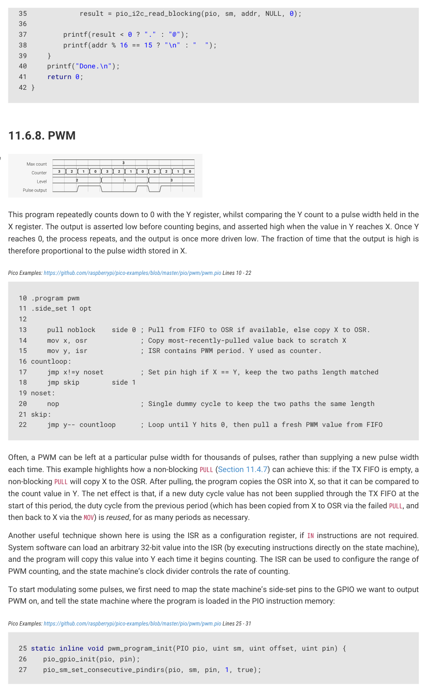
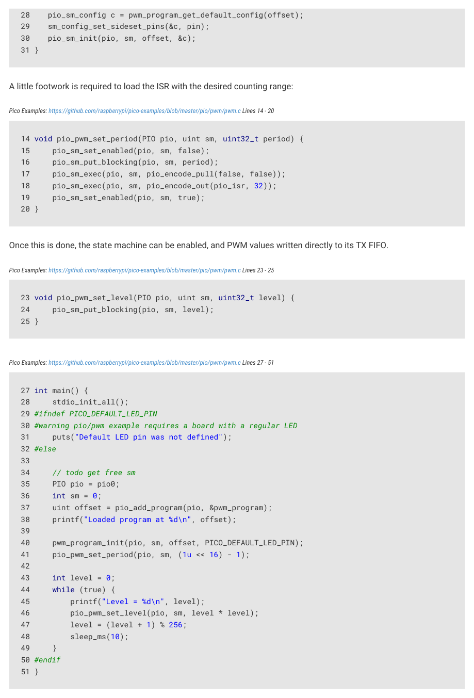

# 11.6.8. PWM

Figure 62. Pulse width

modulation (PWM).

The state machine

outputs positive

voltage pulses at

regular intervals. The

width of these pulses

This program repeatedly counts down to 0 with the Y register, whilst comparing the Y count to a pulse width held in the

is controlled, so that

X register. The output is asserted low before counting begins, and asserted high when the value in Y reaches X. Once Y

the line is high for

reaches 0, the process repeats, and the output is once more driven low. The fraction of time that the output is high is

some controlled

fraction of the time

therefore proportional to the pulse width stored in X.

(the duty cycle). One

use of this is to

Pico Examples: https://github.com/raspberrypi/pico-examples/blob/master/pio/pwm/pwm.pio Lines 10 - 22

smoothly vary the

brightness of an LED,

by pulsing it faster

than human

persistence of vision.

13     pull noblock    side 0 ; Pull from FIFO to OSR if available, else copy X to OSR.

14     mov x, osr             ; Copy most-recently-pulled value back to scratch X

15     mov y, isr             ; ISR contains PWM period. Y used as counter.

17     jmp x!=y noset         ; Set pin high if X == Y, keep the two paths length matched

20     nop                    ; Single dummy cycle to keep the two paths the same length

22     jmp y-- countloop      ; Loop until Y hits 0, then pull a fresh PWM value from FIFO

Often, a PWM can be left at a particular pulse width for thousands of pulses, rather than supplying a new pulse width

each time. This example highlights how a non-blocking PULL (Section 11.4.7) can achieve this: if the TX FIFO is empty, a

non-blocking PULL will copy X to the OSR. After pulling, the program copies the OSR into X, so that it can be compared to

the count value in Y. The net effect is that, if a new duty cycle value has not been supplied through the TX FIFO at the

start of this period, the duty cycle from the previous period (which has been copied from X to OSR via the failed PULL, and

then back to X via the MOV) is reused, for as many periods as necessary.

Another useful technique shown here is using the ISR as a configuration register, if IN instructions are not required.

System software can load an arbitrary 32-bit value into the ISR (by executing instructions directly on the state machine),

and the program will copy this value into Y each time it begins counting. The ISR can be used to configure the range of

PWM counting, and the state machine’s clock divider controls the rate of counting.

To start modulating some pulses, we first need to map the state machine’s side-set pins to the GPIO we want to output

PWM on, and tell the state machine where the program is loaded in the PIO instruction memory:

Pico Examples: https://github.com/raspberrypi/pico-examples/blob/master/pio/pwm/pwm.pio Lines 25 - 31

25 static inline void pwm_program_init(PIO pio, uint sm, uint offset, uint pin) {

26    pio_gpio_init(pio, pin);

27    pio_sm_set_consecutive_pindirs(pio, sm, pin, 1, true);

11.6. Examples
936

RP2350 Datasheet

28    pio_sm_config c = pwm_program_get_default_config(offset);

29    sm_config_set_sideset_pins(&c, pin);

30    pio_sm_init(pio, sm, offset, &c);

A little footwork is required to load the ISR with the desired counting range:

Pico Examples: https://github.com/raspberrypi/pico-examples/blob/master/pio/pwm/pwm.c Lines 14 - 20

14 void pio_pwm_set_period(PIO pio, uint sm, uint32_t period) {

15     pio_sm_set_enabled(pio, sm, false);

16     pio_sm_put_blocking(pio, sm, period);

17     pio_sm_exec(pio, sm, pio_encode_pull(false, false));

18     pio_sm_exec(pio, sm, pio_encode_out(pio_isr, 32));

19     pio_sm_set_enabled(pio, sm, true);

Once this is done, the state machine can be enabled, and PWM values written directly to its TX FIFO.

Pico Examples: https://github.com/raspberrypi/pico-examples/blob/master/pio/pwm/pwm.c Lines 23 - 25

23 void pio_pwm_set_level(PIO pio, uint sm, uint32_t level) {

24     pio_sm_put_blocking(pio, sm, level);

Pico Examples: https://github.com/raspberrypi/pico-examples/blob/master/pio/pwm/pwm.c Lines 27 - 51

29 #ifndef PICO_DEFAULT_LED_PIN

30 #warning pio/pwm example requires a board with a regular LED

31     puts("Default LED pin was not defined");

37     uint offset = pio_add_program(pio, &pwm_program);

38     printf("Loaded program at %d\n", offset);

40     pwm_program_init(pio, sm, offset, PICO_DEFAULT_LED_PIN);

41     pio_pwm_set_period(pio, sm, (1u << 16) - 1);

45         printf("Level = %d\n", level);

46         pio_pwm_set_level(pio, sm, level * level);

47         level = (level + 1) % 256;

If the TX FIFO is kept topped up with fresh pulse width values, this program will consume a new pulse width for each

pulse. Once the FIFO runs dry, the program will again start reusing the most recently supplied value.

11.6. Examples
937
